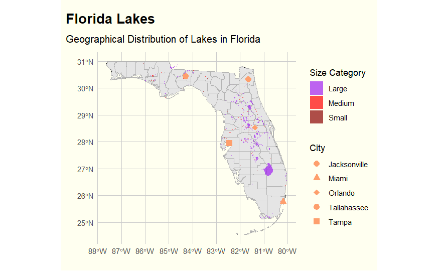

# Data Visualization and Reproducible Research

Course projects by [Zhi Zheng](https://github.com/ZhiZheng0889), using R to explore traffic patterns, Florida lake geography, weather, and student feedback. This repository includes the R Markdown source, input data, rendered reports, and static and interactive visualizations.

## Explore the projects

| Project | Contents | Report and source |
| --- | --- | --- |
| **01: Interstate 94 traffic** | Minnesota westbound traffic volumes by weather, hour, and weekday; density, point, and violin plots; an interactive Plotly chart. | [Read report](project-01/Zheng_project_01.md) · [R Markdown](project-01/Zheng_project_01.Rmd) · [HTML](project-01/Zheng_project_01.html) |
| **02: Florida lakes** | Lake geometry cleaning, maps with cities and county boundaries, lake size categories, and linear regression predicting area from perimeter with diagnostic plots. | [Read report](project-02/Zheng_project_02.md) · [R Markdown](project-02/Zheng_project_02.Rmd) · [HTML](project-02/Zheng_project_02.html) |
| **03: Weather and text analysis** | Tampa International Airport weather for 2022: temperature histograms, densities, ridgelines, and precipitation. RateMyProfessors comments: word clouds, bigram networks, sentiment analysis, and a two-topic LDA model. | [Read report](project-03/Zheng_project_03.md) · [R Markdown](project-03/Zheng_project_03.Rmd) · [HTML](project-03/Zheng_project_03.html) |

You can read the Markdown reports on GitHub without installing R. To view rendered HTML reports and interactive plots, clone or download the repository, then open the HTML files in a web browser. Keep companion asset directories alongside the HTML files; GitHub's file viewer does not run the interactive widgets.

- [Interactive traffic volume chart](figures/interactive_traffic_volume.html)
- [Original Florida lakes map](figures/florida_lakes_interactive_map.html)
- [Revised Florida lakes map](figures/florida_lakes_interactive_map_revised.html)



## Repository contents

```text
.
├── dataviz_final_project.Rproj   # RStudio project settings
├── project-01/                  # Traffic source, reports, and generated assets
├── project-02/                  # Lakes source, reports, and generated assets
├── project-03/                  # Weather/text source, reports, and generated assets
├── data/                        # CSV inputs, lake archive, and extracted shapefile
├── figures/                     # Shared PNG figures and interactive HTML widgets
└── scripts/
    ├── install_packages.R       # Install missing R packages and dependencies
    └── render_all.R             # Render each of the three reports in sequence
```

Each project includes a `Zheng_project_0N.Rmd` source file, `.html` and `.md` reports, and a corresponding `_files/` directory of generated figures. Projects 02 and 03 also have their own README files.

### Datasets

| Path in `data/` | Use |
| --- | --- |
| `trafficMN.csv` | Project 01: hourly traffic volume, timestamps, and weather conditions. |
| `Florida_Lakes/Florida_Lakes/Florida_Lakes.shp` | Project 02: lake geometry and attributes including `NAME`, `SHAPEAREA`, and `PERIMETER`. Keep the accompanying `.dbf`, `.shx`, `.prj`, and other shapefile files together. |
| `Florida_Lakes.zip` | Archived copy of the lake dataset; an extracted copy is already included. |
| `tpa_weather_2022.csv` | Project 03: daily Tampa weather observations. |
| `rmp_wit_comments.csv` | Project 03: RateMyProfessors comments and course labels for text analysis. |
| `BB_top100_2015.csv`, `concrete.csv`, `flpoly_news_SP23.csv`, `marathon_results_2017.csv` | Additional course datasets; not loaded by the three current analyses. |

## Run the analyses

### Prerequisites

Install R and optionally RStudio. HTML rendering also requires Pandoc; RStudio includes it. For terminal use, make sure `Rscript` is on your PATH and Pandoc is discoverable by `rmarkdown`.

Open `dataviz_final_project.Rproj` in RStudio, or open a terminal in the repository root. Run all commands below from that root directory.

### Install packages

```sh
Rscript scripts/install_packages.R
```

The helper installs missing packages for data manipulation, plotting, spatial analysis, modeling, and text mining, including `tidyverse`, `plotly`, `sf`, `tigris`, `rnaturalearth`, `tidytext`, and `topicmodels`. Internet access is needed to download packages. If R asks for a CRAN mirror or reports that none is configured, run this in the R console:

```r
options(repos = c(CRAN = "https://cloud.r-project.org"))
source("scripts/install_packages.R")
```

### Render reports

Render all three projects:

```sh
Rscript scripts/render_all.R
```

Or render one report, substituting `02` or `03` to choose another project:

```sh
Rscript -e "rmarkdown::render('project-01/Zheng_project_01.Rmd')"
```

In RStudio, you can also open an `.Rmd` file and select **Knit**. Rendering executes its R chunks and writes an HTML report, retains a Markdown report (`keep_md: true`), and generates supporting assets in the project directory. The traffic and lake analyses also save interactive HTML files into `figures/`. Existing generated outputs may be overwritten; rendering does not refresh every manually collected PNG in `figures/`.

When running chunks manually, use the relevant `project-0N/` folder as your working directory, since inputs use paths such as `../data/trafficMN.csv`. Normal knitting evaluates those paths relative to the source document.

### Reproduction notes

- **Check the render log.** `render_all.R` catches errors and continues with the next report. A completed script is not proof that all reports were regenerated; inspect each success/failure message. Previously committed reports can remain after a failed render.
- **Some resources are online.** Project 02 requests state data through `rnaturalearth::ne_states()` and county boundaries through `tigris::counties()`. Project 03 embeds reference images hosted on GitHub. The bundled input data alone therefore does not guarantee an offline render.
- **Traffic weekday labels depend on locale.** Project 01 maps Chinese weekday names returned by `weekdays()` to English labels. On other locales, that mapping can produce missing values. Before interpreting regenerated weekday plots, adapt the mapping to your locale or replace it with numeric weekday extraction.
- **Package versions are not pinned.** There is no package lockfile. Installation or rendering issues may require checking package dependencies and compatibility. R rendering has not been validated as part of this README update.
