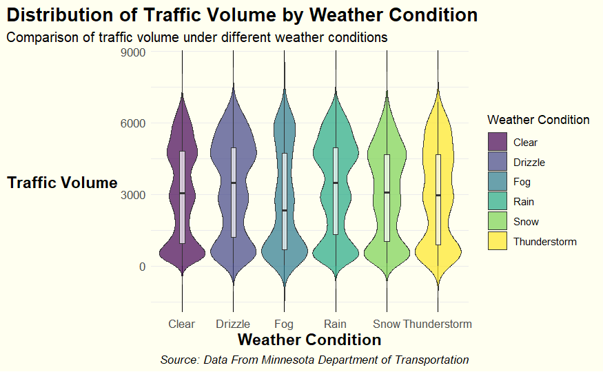

# Data Visualization and Reproducible Research

> Zhi Zheng. 

Learn more about me on my [GitHub profile page](https://github.com/ZhiZheng0889). 

The following is a sample of products created during the _"Data Visualization and Reproducible Research"_ course.

## Project 01

In the `project_01/` folder, you can find a detailed analysis of traffic data from Interstate 94 Westbound in Minnesota. The project focuses on how different factors like weather conditions and time of day affect traffic volume, utilizing various data visualization techniques to uncover insights. This analysis aims to provide a comprehensive understanding of traffic patterns, which could be pivotal for enhancing traffic management, alleviating congestion, and boosting road safety.

**Sample data visualization:** 

This enhanced violin plot is my favorite visualization in this project, and it demonstrates the impact of different weather conditions on traffic volume. The interactive nature of the plot allows for dynamic exploration, providing detailed insights into how traffic varies under different weather scenarios.

> [View the Traffic Volume Visualization (Interactive)](figures/interactive_traffic_volume.html)

### Project 02: Analysis of Florida Lakes' Geographical Distribution and Area Prediction

In this project, I explored the spatial distribution of lakes in Florida and developed a linear regression model to predict the SHAPEAREA of lakes from their PERIMETER. This analysis not only highlighted the relationship between lake size and perimeter but also provided insights into the regional distribution of lakes, particularly their proximity to urban areas. The project involved comprehensive data preparation, regression analysis, and the creation of both static and interactive visualizations. Find the complete code and detailed report in the `project_02/` folder.

**Sample Data Visualization:**

Here are my favorite visualizations from this project, depicting the spatial visualization and interactive visualization of Florida lakes. These maps show the lakes categorized by size and highlight their geographical distribution across the state, with county boundaries and major cities for context.

> [View the New Florida Lakes Visualization (Interactive)](figures/florida_lakes_interactice_map_revised.html)

### Project 03: Exploratory Data Analysis Through Visualization

In this project, I explored a variety of visual techniques to analyze datasets from Tampa International Airport (TPA) weather data and RateMyProfessors comments from 2022. My focus was on extracting and visually interpreting data patterns that reveal insights into weather trends and academic feedback.

**Sample Data Visualization:**

Here is my favorite visualization from this project, depicting a network visualization of commonly used terms in RateMyProfessors comments. This graph illuminates the connections between terms, providing a clear view of the most prominent themes and sentiments expressed by students.

### Moving Forward

Throughout this course, I've gained invaluable insights into data visualization, particularly in how customizing the theme of visualization can significantly impact its effectiveness. My exploration into different color schemes, text positioning, and layout designs has opened my eyes to the power of visual elements. These elements are crucial not only in capturing attention but also in enhancing comprehension and emphasizing the intended messages, regardless of whether the presentation is in-person or digital.

Moving forward, I am motivated to delve deeper into the nuances of visual design in both live and non-live presentation formats. I plan to explore advanced tools and techniques for creating interactive and dynamic visualizations that adapt to user interactions or real-time data changes, which are essential for digital platforms. Additionally, I intend to study the psychological impacts of various visual elements, aiming to craft visualizations that are persuasive across different mediums.

My ongoing goal is to blend technical skills with aesthetic sensibility to produce visualizations that are strategically effective and adaptable to various presentation contexts. By doing so, I aim to ensure that my future projects are not only informative but also engaging and impactful, facilitating data-driven decisions in a wide range of scenarios.

