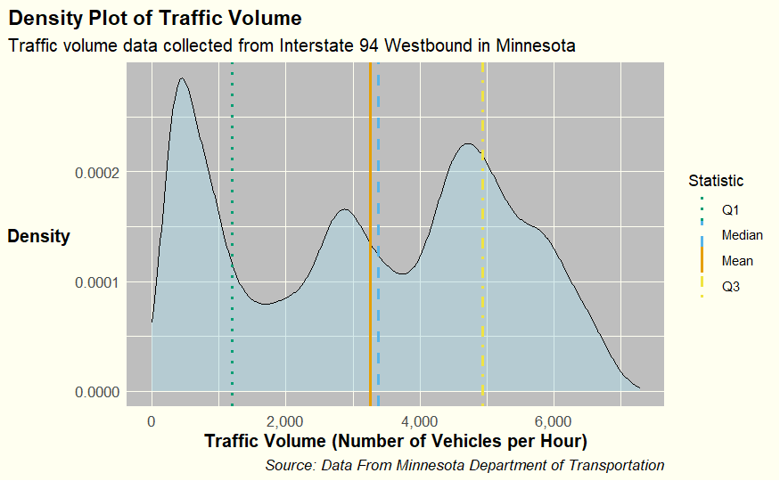
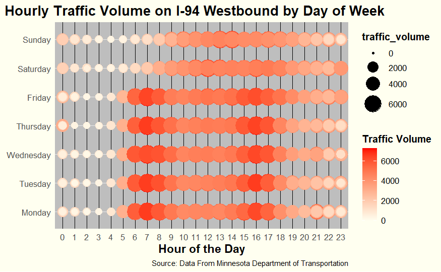
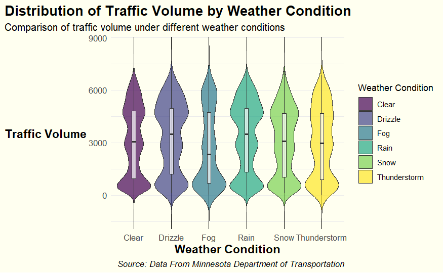

# Data Visualization - Mini-Project 1 (TrafficMN)

> Zhi Zheng

## Project Description

### Motivation

This project aims to delve into traffic data from Interstate 94 Westbound in Minnesota to analyze how different factors like weather conditions and time of day affect traffic volume. The insights gained could be pivotal for enhancing traffic management, alleviating congestion, and boosting road safety.

### Summary of Findings

1. **Traffic Volume Patterns:**
   - Pronounced traffic peaks are observed during morning (7 AM - 9 AM) and evening (4 PM - 6 PM) rush hours on weekdays, which correlate with common commuting times.
   - Weekend traffic is more evenly distributed throughout the day, showcasing varied travel habits compared to weekdays.

2. **Impact of Weather Conditions:**
   - Optimal traffic flow occurs under clear weather conditions, likely due to safer driving conditions.
   - Inclement weather conditions such as fog, snow, and thunderstorms correlate with reduced traffic volumes, suggesting that drivers are likely to avoid travel during these conditions.

3. **Daily Traffic Patterns:**
   - There is a significant variation in traffic volumes across the week, with higher volumes during weekday rush hours and more evenly spread volumes during weekends.

### Description of the Data

The dataset comprises hourly traffic volume records along with various weather conditions for Interstate 94 Westbound in Minnesota. Key variables include:

- **date_time:** Timestamp of each traffic record.
- **traffic_volume:** Number of vehicles passing a checkpoint per hour.
- **weather_main:** General weather condition (e.g., Clear, Rain, Snow).
- **weather_description:** More detailed weather description (e.g., light rain, scattered clouds).
- **temp:** Ambient temperature in Kelvin.
- **rain_1h:** Rainfall in millimeters collected over the past hour.
- **snow_1h:** Snowfall in millimeters collected over the past hour.
- **clouds_all:** Percentage of cloud cover.
- **holiday:** Indicates the presence of a holiday.
- **month, day, hour, day_of_week:** Time indicators extracted for more detailed analyses.

### Steps and Code Explanation

#### Data Preparation and Analysis

1. **Dataset Acquisition:**
   - The dataset was initially downloaded and saved locally to maintain a stable version for detailed analysis.

2. **Library Setup:**
   - Necessary R libraries like `tidyverse`, `lubridate`, and `ggplot2` were installed and loaded to facilitate data manipulation and visualization.

3. **Preliminary Data Review:**
   - Initial data checks were conducted to confirm data integrity and to understand the dataset structure and variables.

4. **Feature Engineering:**
   - Extracted and engineered features such as day of the week and hour from the `date_time` column to enrich the analysis.

5. **Traffic Analysis by Day:**
   - Summarized traffic volumes by day of the week to identify and analyze varying traffic patterns.

#### Visualization and Insights

1. **Traffic Volume Distribution:**
   - Employed density plots to visualize the continuous distribution of traffic volumes, highlighting typical and peak traffic periods.
    

2. **Hourly and Weekly Traffic Trends:**
   - Developed point plots to depict hourly traffic volumes by day, offering insights into daily traffic flow variations.
   

3. **Weather-Related Traffic Impacts (Revised):**
   - Employed enhanced violin plots to depict how various weather conditions influence traffic volumes. These plots were made interactive using the `plotly` package, allowing for dynamic exploration of the data. The interactivity enriches the user's understanding by providing tooltips that display specific traffic volume data when hovered over different sections of the plot. This visualization method not only illustrates the variability and central tendencies of traffic under each weather condition but also enables a more engaging and detailed examination of how weather impacts road use.
   

   [View the Interactive Traffic Volume Visualization (Interactive)](../figures/interactive_traffic_volume.html)

### Future Work

Several potential areas for further research include:

1. **Predictive Traffic Modeling:**
   - Implement advanced machine learning models to predict traffic volumes based on historical data and predictive weather models.

2. **Incorporating Additional Data:**
   - Augment the dataset with additional variables such as accident frequencies, construction activities, and significant local events.

3. **Geospatial Traffic Analysis:**
   - Analyze traffic patterns through geospatial studies to understand spatial variations along the highway.

### Conclusion

This project offers a thorough examination of traffic trends on Interstate 94 Westbound, utilizing diverse data visualization methods to reveal crucial insights into factors influencing traffic volumes. These insights are instrumental for developing strategies to minimize congestion and enhance safety on this busy highway.
