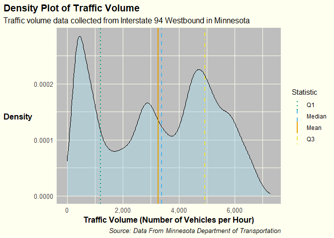
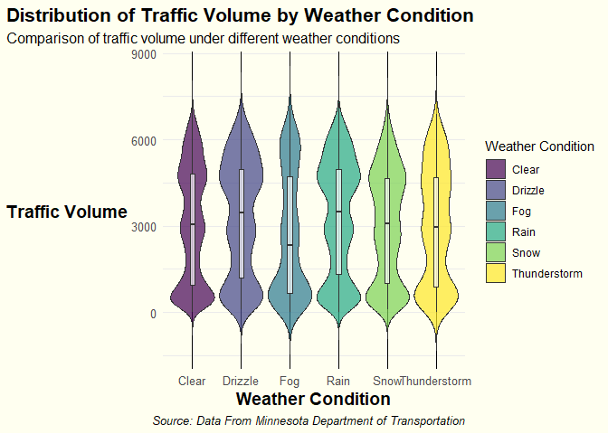

# Data Visualization Mini-Project (TrafficMN)

## Introduction

Welcome to the Data Visualization Mini-Project! In this project, we'll dive into the traffic data from Interstate 94 Westbound in Minnesota, exploring how various factors like weather and time of day impact traffic volume. The dataset contains hourly traffic volume records along with weather conditions, which offers a rich source of insights into traffic patterns.

### Data Preparation and Analysis

Before we get to the exciting visualizations, let's walk through the initial steps of preparing and the dataset. The primary goal is to clean the data, extract useful features, and ensure it's ready for analysis.

### Step-by-Step Code Explanation

1.  **Downloading the Dataset:**

First, the dataset are needed to be downloaded and save it locally. This ensures the project have a stable copy of the data for the project analysis.


```r
# # Set the URL for the dataset
# url <- "https://raw.githubusercontent.com/reisanar/datasets/master/trafficMN.csv"
# 
# # Create the data folder if it doesn't exist
# if (!dir.exists("../data")) {
#   dir.create("../data")
# }
# 
# # Download the dataset into the data folder
# download.file(url, destfile = "C:/Users/zhizh/Desktop/Zhi_Zheng_Mini_Project_1/data/trafficMN.csv", method = "curl")
```

2.  **Installing Required Libraries:**

The project need a few R libraries to help with data manipulation and visualization. Let's install them if they're not already installed.


```r
# # Install all required libraries
# install.packages("tidyverse")
# install.packages('reshape2')
# install.packages(ggplot2)
# install.packages(lubridate)
# install.packages(viridis)
```

3.  **Loading the Libraries:**

Now, let's load the libraries that will be use throughout the project.


```r
# Load necessary libraries
library(tidyverse)
```

```
## ── Attaching core tidyverse packages ──────────────────────── tidyverse 2.0.0 ──
## ✔ dplyr     1.1.4     ✔ readr     2.1.5
## ✔ forcats   1.0.0     ✔ stringr   1.5.1
## ✔ ggplot2   3.5.0     ✔ tibble    3.2.1
## ✔ lubridate 1.9.3     ✔ tidyr     1.3.1
## ✔ purrr     1.0.2     
## ── Conflicts ────────────────────────────────────────── tidyverse_conflicts() ──
## ✖ dplyr::filter() masks stats::filter()
## ✖ dplyr::lag()    masks stats::lag()
## ℹ Use the conflicted package (<http://conflicted.r-lib.org/>) to force all conflicts to become errors
```

```r
library(reshape2)
```

```
## 
## 载入程辑包：'reshape2'
## 
## The following object is masked from 'package:tidyr':
## 
##     smiths
```

```r
library(ggplot2)
library(lubridate)
library(viridis)
```

```
## 载入需要的程辑包：viridisLite
```

```r
library(plotly)
```

```
## 
## 载入程辑包：'plotly'
## 
## The following object is masked from 'package:ggplot2':
## 
##     last_plot
## 
## The following object is masked from 'package:stats':
## 
##     filter
## 
## The following object is masked from 'package:graphics':
## 
##     layout
```

4.  **Loading and Checking the Dataset:**

With the libraries in place, dataset are loaded and perform an initial check to ensure it loaded correctly.


```r
# Load the dataset
traffic_data <- read_csv("../data/trafficMN.csv")
```

```
## Rows: 48204 Columns: 9
## ── Column specification ────────────────────────────────────────────────────────
## Delimiter: ","
## chr  (3): holiday, weather_main, weather_description
## dbl  (5): temp, rain_1h, snow_1h, clouds_all, traffic_volume
## dttm (1): date_time
## 
## ℹ Use `spec()` to retrieve the full column specification for this data.
## ℹ Specify the column types or set `show_col_types = FALSE` to quiet this message.
```

```r
# Initial check if the dataset is loaded correctly
head(traffic_data)
```

```
## # A tibble: 6 × 9
##   holiday  temp rain_1h snow_1h clouds_all weather_main weather_description
##   <chr>   <dbl>   <dbl>   <dbl>      <dbl> <chr>        <chr>              
## 1 None     288.       0       0         40 Clouds       scattered clouds   
## 2 None     289.       0       0         75 Clouds       broken clouds      
## 3 None     290.       0       0         90 Clouds       overcast clouds    
## 4 None     290.       0       0         90 Clouds       overcast clouds    
## 5 None     291.       0       0         75 Clouds       broken clouds      
## 6 None     292.       0       0          1 Clear        sky is clear       
## # ℹ 2 more variables: date_time <dttm>, traffic_volume <dbl>
```

5.  **Summarizing the Dataset:**

Next, the dataset are summarize to get an overview of its structure and content, and check for any missing values.


```r
# Summarize the dataset
summary(traffic_data)
```

```
##    holiday               temp          rain_1h            snow_1h         
##  Length:48204       Min.   :  0.0   Min.   :   0.000   Min.   :0.0000000  
##  Class :character   1st Qu.:272.2   1st Qu.:   0.000   1st Qu.:0.0000000  
##  Mode  :character   Median :282.4   Median :   0.000   Median :0.0000000  
##                     Mean   :281.2   Mean   :   0.334   Mean   :0.0002224  
##                     3rd Qu.:291.8   3rd Qu.:   0.000   3rd Qu.:0.0000000  
##                     Max.   :310.1   Max.   :9831.300   Max.   :0.5100000  
##    clouds_all     weather_main       weather_description
##  Min.   :  0.00   Length:48204       Length:48204       
##  1st Qu.:  1.00   Class :character   Class :character   
##  Median : 64.00   Mode  :character   Mode  :character   
##  Mean   : 49.36                                         
##  3rd Qu.: 90.00                                         
##  Max.   :100.00                                         
##    date_time                      traffic_volume
##  Min.   :2012-10-02 09:00:00.00   Min.   :   0  
##  1st Qu.:2014-02-06 11:45:00.00   1st Qu.:1193  
##  Median :2016-06-11 03:30:00.00   Median :3380  
##  Mean   :2016-01-05 10:46:16.76   Mean   :3260  
##  3rd Qu.:2017-08-11 06:00:00.00   3rd Qu.:4933  
##  Max.   :2018-09-30 23:00:00.00   Max.   :7280
```

```r
# Check for missing values
sum(is.na(traffic_data))
```

```
## [1] 0
```

```r
# Display the structure of the dataset
str(traffic_data)
```

```
## spc_tbl_ [48,204 × 9] (S3: spec_tbl_df/tbl_df/tbl/data.frame)
##  $ holiday            : chr [1:48204] "None" "None" "None" "None" ...
##  $ temp               : num [1:48204] 288 289 290 290 291 ...
##  $ rain_1h            : num [1:48204] 0 0 0 0 0 0 0 0 0 0 ...
##  $ snow_1h            : num [1:48204] 0 0 0 0 0 0 0 0 0 0 ...
##  $ clouds_all         : num [1:48204] 40 75 90 90 75 1 1 1 20 20 ...
##  $ weather_main       : chr [1:48204] "Clouds" "Clouds" "Clouds" "Clouds" ...
##  $ weather_description: chr [1:48204] "scattered clouds" "broken clouds" "overcast clouds" "overcast clouds" ...
##  $ date_time          : POSIXct[1:48204], format: "2012-10-02 09:00:00" "2012-10-02 10:00:00" ...
##  $ traffic_volume     : num [1:48204] 5545 4516 4767 5026 4918 ...
##  - attr(*, "spec")=
##   .. cols(
##   ..   holiday = col_character(),
##   ..   temp = col_double(),
##   ..   rain_1h = col_double(),
##   ..   snow_1h = col_double(),
##   ..   clouds_all = col_double(),
##   ..   weather_main = col_character(),
##   ..   weather_description = col_character(),
##   ..   date_time = col_datetime(format = ""),
##   ..   traffic_volume = col_double()
##   .. )
##  - attr(*, "problems")=<externalptr>
```

6.  **Feature Extraction:**

To make the analysis more insightful, additional features like `date`, `day of the week`, and `hour` are extract from the `date_time` column.


```r
# Extract the date and day of the week from the date_time column
traffic_data <- traffic_data %>%
  mutate(
    date = as.Date(date_time),
    day_of_week = weekdays(date),
    day_of_week = case_when(
      day_of_week == "星期一" ~ "Monday",
      day_of_week == "星期二" ~ "Tuesday",
      day_of_week == "星期三" ~ "Wednesday",
      day_of_week == "星期四" ~ "Thursday",
      day_of_week == "星期五" ~ "Friday",
      day_of_week == "星期六" ~ "Saturday",
      day_of_week == "星期日" ~ "Sunday"
    ),
    day_of_week = factor(day_of_week, 
                         levels = c("Monday",
                                  "Tuesday", 
                                   "Wednesday",
                                   "Thursday",
                                   "Friday",
                                   "Saturday",
                                   "Sunday")),
    hour = factor(hour(date_time))
  )
```

7.  **Summarizing Traffic Volume by Day of the Week:**

Finally, the traffic volume by day of the week are summarize to see how traffic patterns vary across different days.


```r
# Summarize the dataset
summary(traffic_data)
```

```
##    holiday               temp          rain_1h            snow_1h         
##  Length:48204       Min.   :  0.0   Min.   :   0.000   Min.   :0.0000000  
##  Class :character   1st Qu.:272.2   1st Qu.:   0.000   1st Qu.:0.0000000  
##  Mode  :character   Median :282.4   Median :   0.000   Median :0.0000000  
##                     Mean   :281.2   Mean   :   0.334   Mean   :0.0002224  
##                     3rd Qu.:291.8   3rd Qu.:   0.000   3rd Qu.:0.0000000  
##                     Max.   :310.1   Max.   :9831.300   Max.   :0.5100000  
##                                                                           
##    clouds_all     weather_main       weather_description
##  Min.   :  0.00   Length:48204       Length:48204       
##  1st Qu.:  1.00   Class :character   Class :character   
##  Median : 64.00   Mode  :character   Mode  :character   
##  Mean   : 49.36                                         
##  3rd Qu.: 90.00                                         
##  Max.   :100.00                                         
##                                                         
##    date_time                      traffic_volume      date           
##  Min.   :2012-10-02 09:00:00.00   Min.   :   0   Min.   :2012-10-02  
##  1st Qu.:2014-02-06 11:45:00.00   1st Qu.:1193   1st Qu.:2014-02-06  
##  Median :2016-06-11 03:30:00.00   Median :3380   Median :2016-06-11  
##  Mean   :2016-01-05 10:46:16.76   Mean   :3260   Mean   :2016-01-04  
##  3rd Qu.:2017-08-11 06:00:00.00   3rd Qu.:4933   3rd Qu.:2017-08-11  
##  Max.   :2018-09-30 23:00:00.00   Max.   :7280   Max.   :2018-09-30  
##                                                                      
##     day_of_week        hour      
##  Monday   :7072   4      : 2091  
##  Tuesday  :6846   6      : 2087  
##  Wednesday:6930   8      : 2080  
##  Thursday :6817   7      : 2079  
##  Friday   :6836   10     : 2078  
##  Saturday :6831   5      : 2063  
##  Sunday   :6872   (Other):35726
```

```r
# Check for missing values
sum(is.na(traffic_data))
```

```
## [1] 0
```

```r
# Display the structure of the dataset
str(traffic_data)
```

```
## tibble [48,204 × 12] (S3: tbl_df/tbl/data.frame)
##  $ holiday            : chr [1:48204] "None" "None" "None" "None" ...
##  $ temp               : num [1:48204] 288 289 290 290 291 ...
##  $ rain_1h            : num [1:48204] 0 0 0 0 0 0 0 0 0 0 ...
##  $ snow_1h            : num [1:48204] 0 0 0 0 0 0 0 0 0 0 ...
##  $ clouds_all         : num [1:48204] 40 75 90 90 75 1 1 1 20 20 ...
##  $ weather_main       : chr [1:48204] "Clouds" "Clouds" "Clouds" "Clouds" ...
##  $ weather_description: chr [1:48204] "scattered clouds" "broken clouds" "overcast clouds" "overcast clouds" ...
##  $ date_time          : POSIXct[1:48204], format: "2012-10-02 09:00:00" "2012-10-02 10:00:00" ...
##  $ traffic_volume     : num [1:48204] 5545 4516 4767 5026 4918 ...
##  $ date               : Date[1:48204], format: "2012-10-02" "2012-10-02" ...
##  $ day_of_week        : Factor w/ 7 levels "Monday","Tuesday",..: 2 2 2 2 2 2 2 2 2 2 ...
##  $ hour               : Factor w/ 24 levels "0","1","2","3",..: 10 11 12 13 14 15 16 17 18 19 ...
```

```r
# Summarize the data by grouping and calculating the mean traffic volume by day of the week
traffic_summary <- traffic_data %>%
  group_by(day_of_week) %>%
  summarize(mean_traffic_volume = mean(traffic_volume, na.rm = TRUE))
```

With the dataset now prepped for exploration and visualization, the analysis can commence. The traffic data has been successfully loaded, initial checks performed, and the dataset ensured to be clean and structured. Key features such as `date`, `day of the week`, and `hour` have been extracted from the `date_time` column, providing the necessary granularity for in-depth analysis. Additionally, the traffic volume has been summarized by day of the week, offering a preliminary understanding of how traffic patterns vary across different days. This thorough preparation sets the stage for creating insightful visualizations that will uncover trends and patterns in traffic volume, influenced by time of day, weather conditions, and holidays.

------------------------------------------------------------------------

## Density Plot of Traffic Volume: Strategy and Insights

### Evolution of Visualization Plan

The initial plan for this assignment began with creating a histogram to explore the traffic volume data from Interstate 94 Westbound in Minnesota. The purpose of the histogram was to observe the raw distribution of traffic volumes, as histograms provide detailed count information within specified bins and help identify the frequency of traffic volumes across different ranges. However, seeking to enhance the visualization and provide more detailed insights, the plan evolved to consider a violin plot. The violin plot aimed to combine density estimation with summary statistics such as the median and quartiles, offering a more detailed view of the data distribution's shape and central tendency. Despite these advantages, violin plots can be visually complex and potentially cluttered.

Ultimately, the decision was made to use a density plot for its ability to offer a smooth, continuous estimate of the distribution of traffic volume. Density plots highlight patterns and peaks more clearly than histograms and provide a cleaner, less cluttered representation compared to violin plots. This choice aligns with the objective of creating a clear, informative, and visually appealing representation of the traffic volume data.


```r
# Compute summary statistics for traffic volume
traffic_summary <- traffic_data %>%
  summarize(
    mean_volume = mean(traffic_volume, na.rm = TRUE),     # Calculate the mean traffic volume, excluding NA values
    median_volume = median(traffic_volume, na.rm = TRUE), # Calculate the median traffic volume, excluding NA values
    sd_volume = sd(traffic_volume, na.rm = TRUE),         # Calculate the standard deviation of traffic volume, excluding NA values
    q1_volume = quantile(traffic_volume, 0.25, na.rm = TRUE), # Calculate the 1st quartile (Q1) of traffic volume, excluding NA values
    q3_volume = quantile(traffic_volume, 0.75, na.rm = TRUE)  # Calculate the 3rd quartile (Q3) of traffic volume, excluding NA values
  )

# Display the summary statistics
print(traffic_summary)
```

```
## # A tibble: 1 × 5
##   mean_volume median_volume sd_volume q1_volume q3_volume
##         <dbl>         <dbl>     <dbl>     <dbl>     <dbl>
## 1       3260.          3380     1987.      1193      4933
```


```r
# Prepare data for lines to be added as separate layers
# This data frame includes the x-intercepts for mean, median, Q1, and Q3 traffic volumes
line_data <- data.frame(
  xintercept = c(traffic_summary$mean_volume, traffic_summary$median_volume, traffic_summary$q1_volume, traffic_summary$q3_volume),
  category = factor(c("Mean", "Median", "Q1", "Q3"), levels = c("Q1", "Median", "Mean", "Q3"))
)

# Define color-blind friendly palette
cb_palette <- c(
  "Mean" = "#E69F00",   # orange
  "Median" = "#56B4E9", # sky blue
  "Q1" = "#009E73",     # bluish green
  "Q3" = "#F0E442"      # yellow
)

# Create a density plot for traffic volume
traffic_density_plot <- ggplot(traffic_data, aes(x = traffic_volume)) +
  # Add a density plot with light blue fill and black border
  geom_density(fill = "lightblue", alpha = 0.5, color = "black") +
  # Add vertical lines for mean, median, Q1, and Q3 traffic volumes
  geom_vline(data = line_data, aes(xintercept = xintercept, color = category, linetype = category), size = 1) +
  # Customize color and linetype scales
  scale_color_manual(values = cb_palette) +
  scale_linetype_manual(values = c("Mean" = "solid", "Median" = "dashed", "Q1" = "dotted", "Q3" = "dotdash")) +
  # Add plot title, subtitle, caption, and axis labels
  labs(
    title = "Density Plot of Traffic Volume",
    subtitle = "Traffic volume data collected from Interstate 94 Westbound in Minnesota",
    caption = "Source: Data From Minnesota Department of Transportation",
    x = "Traffic Volume (Number of Vehicles per Hour)",
    y = "Density",
    color = "Statistic",
    linetype = "Statistic"
  ) +
  # Customize y-axis and x-axis labels
  scale_y_continuous(labels = scales::number_format(accuracy = 0.0001)) +
  scale_x_continuous(labels = scales::comma) +
  # Apply a minimal theme for the plot
  theme_minimal() +
  # Customize various elements of the plot's theme
  theme(
    plot.title.position = "plot",
    plot.title = element_text(hjust = 0, size = 14, face = "bold"),
    plot.subtitle = element_text(hjust = 0, size = 12),
    plot.caption = element_text(hjust = 1, size = 10, face = "italic"),
    axis.title.x = element_text(size = 12, face = "bold"),
    axis.title.y = element_text(size = 12, face = "bold", angle = 0, vjust = 0.5),
    axis.text = element_text(size = 10),
    panel.background = element_rect(fill = "gray", color = NA),
    plot.background = element_rect(fill = "ivory", color = NA),
    panel.grid.major = element_line(color = "ivory", linewidth = 0.5),
    panel.grid.minor = element_line(color = "ivory", linewidth = 0.25),
    legend.position = "right"
  )
```

```
## Warning: Using `size` aesthetic for lines was deprecated in ggplot2 3.4.0.
## ℹ Please use `linewidth` instead.
## This warning is displayed once every 8 hours.
## Call `lifecycle::last_lifecycle_warnings()` to see where this warning was
## generated.
```

```r
# Display the plot
traffic_density_plot
```

<!-- -->

### Insights from the Density Plot

The final density plot conveys several key insights about traffic volume patterns. It illustrates the overall distribution of traffic volumes, highlighting common traffic volumes and peak frequencies. By incorporating lines for the mean, median, first quartile (Q1), and third quartile (Q3), the plot provides insights into central tendencies and variability, offering a clear understanding of typical traffic conditions and their variations. The inclusion of summary statistics allows for quick comparisons between measures of central tendency (mean vs. median) and data spread (Q1 and Q3), enhancing the understanding of traffic patterns.

### Stories Derived from Insights

1.  **Traffic Flow During Peak Hours:**
    -   The density plot indicates distinct peaks at certain traffic volumes, suggesting the times of day when traffic is heaviest. These peaks likely correspond to rush hours when people are commuting to and from work. Understanding these peak times can help traffic management authorities implement measures such as adjusting traffic signal timings, encouraging carpooling, or promoting public transportation during these hours to alleviate congestion.
2.  **Variability in Traffic Volumes:**
    -   The spread of traffic volumes, as indicated by the quartile lines, highlights the variability in traffic conditions. On some days, traffic volumes may fluctuate widely, indicating inconsistent traffic flow. This variability can be influenced by external factors such as weather conditions, accidents, or special events. Recognizing these patterns can assist in proactive traffic management, such as deploying additional traffic control personnel during high-variability periods or informing drivers about expected delays.

These stories provide actionable insights that can inform traffic management strategies aimed at reducing congestion and improving traffic flow on Interstate 94 Westbound.

#### Application of Data Visualization Principles

The following principles of data visualization and design were applied to create an effective and informative density plot:

1.  **Clarity and Simplicity:**
    -   The density plot provides a smooth, continuous estimate of traffic volume distribution, avoiding the clutter of histograms and the complexity of violin plots.
2.  **Use of Color and Aesthetics:**
    -   A color-blind friendly palette ensures accessibility and readability for all viewers. Different colors effectively distinguish between the mean, median, Q1, and Q3 lines.
    -   The plot background and gridlines are styled to enhance readability without overshadowing the data.
3.  **Incorporation of Summary Statistics:**
    -   Lines for mean, median, Q1, and Q3 are added to provide context and additional insights into the distribution of traffic volume.
    -   These lines help viewers quickly understand central tendency and variability in the data.
4.  **Effective Labeling and Titles:**
    -   Descriptive title, subtitle, and axis labels clearly communicate the data being presented.
    -   A caption provides the data source, adding credibility and context to the visualization.
5.  **Attention to Detail:**
    -   Axis labels and gridlines are formatted for precision and ease of interpretation.
    -   The plot maintains a balance between visual appeal and informational content, effectively communicating the story behind the data.

------------------------------------------------------------------------

## Hourly Traffic Volume on I-94 Westbound by Day of Week

### Evolution of Visualization Plan

The initial plan for this visualization involved using a heatmap with `geom_tile` to represent traffic volume at different times of the day across various days of the week. This approach aimed to provide a clear and compact overview of traffic patterns. However, the heatmap lacked visual impact due to its shape limitations. Next, a sunburst plot was considered to offer a hierarchical view of the traffic data and illustrate nested relationships. Unfortunately, the sunburst plot also proved to be visually unappealing and complex. Ultimately, a point plot using `geom_point` was chosen for its ability to deliver better granularity and clarity, offering a more detailed and precise representation of the dataset.


```r
# Create a scatter plot for hourly traffic volume on I-94 Westbound by day of the week
traffic_volume_plot <- ggplot(traffic_data, aes(x = hour, y = day_of_week)) +
  # Add points to the plot, with size and color based on traffic volume
  geom_point(aes(size = traffic_volume, color = traffic_volume)) +
  # Define the color gradient for traffic volume
  scale_color_gradient(low = "ivory", high = "red", name = "Traffic Volume") +
  # Define the size range for points
  scale_size(range = c(1, 10)) +
  # Add plot title, caption, and axis labels
  labs(
    title = "Hourly Traffic Volume on I-94 Westbound by Day of Week",
    caption = "Source: Data From Minnesota Department of Transportation",
    x = "Hour of the Day",
    y = ""
  ) +
  # Apply a minimal theme for the plot
  theme_minimal() +
  # Customize various elements of the plot's theme
  theme(
    plot.title.position = "plot",
    plot.title = element_text(hjust = 0, size = 16, face = "bold"),
    axis.title.x = element_text(size = 14, face = "bold"),
    axis.title.y = element_text(size = 14, face = "bold", angle = 0, vjust = 0.5),
    axis.text.x = element_text(size = 10),
    axis.text.y = element_text(size = 10),
    legend.title = element_text(size = 12, face = "bold"),
    legend.text = element_text(size = 10),
    panel.background = element_rect(fill = "gray", color = NA),
    plot.background = element_rect(fill = "ivory", color = NA),
    panel.grid.major.x = element_line(color = "black", size = 0.5),
    panel.grid.minor.x = element_blank()
  )
```

```
## Warning: The `size` argument of `element_line()` is deprecated as of ggplot2 3.4.0.
## ℹ Please use the `linewidth` argument instead.
## This warning is displayed once every 8 hours.
## Call `lifecycle::last_lifecycle_warnings()` to see where this warning was
## generated.
```

```r
# Display the plot in RStudio
print(traffic_volume_plot)
```

<!-- -->

```r
# Save the plot to a file with specified dimensions
ggsave("hourly_traffic_volume_i94.png", plot = traffic_volume_plot, width = 12, height = 8)
```

### Insights from the Point Plot

The scatter plot above represents hourly traffic volumes on I-94 Westbound, categorized by the day of the week. This visualization provides a detailed view of how traffic patterns fluctuate throughout the day and across different days of the week. The size and color of the points correspond to the traffic volume, with larger and darker points indicating higher volumes.

### Stories Derived from Insights

1.  **Daily Traffic Patterns:**
    -   The scatter plot reveals distinct daily traffic patterns. For example, weekday mornings and evenings show higher traffic volumes, indicative of typical rush hour peaks. In contrast, weekends display a more spread out traffic volume, with peaks occurring later in the day, likely reflecting different travel behaviors on non-workdays.
2.  **Impact of Hourly Traffic Flow:**
    -   By visualizing traffic volume by hour and day, this plot highlights critical periods of congestion, which can inform targeted traffic management interventions. For instance, identifying the hours with consistently high traffic volumes across weekdays can help in scheduling road maintenance, optimizing traffic signal timings, and implementing congestion pricing during peak hours to manage demand.

## Application of Data Visualization Principles for Hourly Traffic Volume on I-94 Westbound by Day of Week

The point plot representing hourly traffic volumes on I-94 Westbound by day of the week was created by applying several key principles of data visualization and design:

1.  **Clarity and Simplicity:**

    -   The point plot provides a clear and straightforward representation of traffic volumes at different hours across the days of the week. Each point's size and color correspond to the traffic volume, making it easy to compare traffic patterns visually.

2.  **Effective Use of Color and Size:**

    -   A color gradient ranging from light to dark red was used to represent increasing traffic volumes, ensuring that higher volumes stand out prominently. The size of the points also varies with traffic volume, adding another layer of visual differentiation.

3.  **Granularity and Detail:**

    -   By using a point plot, the visualization achieves a high level of granularity, showing traffic volumes for each hour of the day. This detailed representation allows for precise analysis of traffic patterns and peak times.

4.  **Appropriate Scales and Legends:**

    -   The axes are clearly labeled, with the x-axis representing the hour of the day and the y-axis representing the days of the week. A legend is included to explain the color gradient and point size, aiding in the interpretation of the plot.

5.  **Minimalistic Design:**

    -   A minimalistic theme was applied to reduce visual clutter, focusing the viewer's attention on the data. Background colors and gridlines are kept subtle to enhance readability without distracting from the main points.

6.  **Informative Titles and Captions:**

    -   The plot includes a descriptive title that clearly indicates the purpose of the visualization. A caption is provided to cite the data source, adding credibility and context to the plot.

7.  **Accessibility:**

    -   The color palette used is color-blind friendly, ensuring that the visualization is accessible to a wider audience. This consideration is crucial for inclusive data presentation.

------------------------------------------------------------------------

## Distribution of Traffic Volume by Weather Condition

### Evolution of Visualization Plan

The initial plan for this visualization involved using subgroups of histograms to represent traffic volume at different times of the day across various weather conditions. This approach aimed to provide a clear and detailed view of traffic patterns. However, the histograms lacked the ability to effectively compare distributions across multiple categories simultaneously. To improve the visualization, the plan was changed to use a density plot with subgroups. While density plots offered a smoother representation of data distribution, they still fell short in comparing multiple categories clearly.

Ultimately, a violin plot was chosen for its superior ability to combine density distribution and summary statistics. Violin plots offer a more comprehensive view by showing the full distribution of the data along with critical summary statistics like the median and quartiles. This makes it easier to compare the spread and central tendency of traffic volumes across different weather conditions. The violin plot's visual appeal and effectiveness in highlighting differences between categories made it the best choice for this situation.


```r
# Filter data for specific weather conditions
filtered_traffic_data <- traffic_data %>%
  filter(weather_main %in% c("Clear", "Fog", "Snow", "Rain", "Drizzle", "Thunderstorm"))

# Violin Plot with additional context
gg_violin <- ggplot(filtered_traffic_data, aes(x = weather_main, y = traffic_volume, fill = weather_main)) +
  geom_violin(trim = FALSE, scale = "width", adjust = 1, alpha = 0.7) +
  geom_boxplot(width = 0.1, fill = "white", alpha = 0.7) +
  scale_fill_viridis_d(option = "viridis") +
  labs(
    title = "Distribution of Traffic Volume by Weather Condition",
    subtitle = "Comparison of traffic volume under different weather conditions",
    caption = "Source: Data From Minnesota Department of Transportation",
    x = "Weather Condition",
    y = "Traffic Volume",
    fill = "Weather Condition"
  ) +
  theme_minimal() +
  theme(
    plot.title.position = "plot",
    plot.title = element_text(hjust = 0, size = 16, face = "bold"),
    plot.subtitle = element_text(hjust = 0, size = 12),
    plot.caption = element_text(hjust = 1, size = 10, face = "italic"),
    axis.title.x = element_text(size = 14, face = "bold"),
    axis.title.y = element_text(size = 14, face = "bold", angle = 0, vjust = 0.5),
    axis.text.x = element_text(size = 10),
    axis.text.y = element_text(size = 10),
    legend.position = "right",
    panel.background = element_rect(fill = "ivory", color = NA),
    plot.background = element_rect(fill = "ivory", color = NA),
    panel.grid.major.x = element_line(color = "black", size = 0.5),
    panel.grid.minor.x = element_blank()
  )

gg_violin
```

<!-- -->


```r
# Convert Voilin Plot to Interactive Violin Plot

interactive_plot <- ggplotly(gg_violin)

interactive_plot <- interactive_plot %>% 
  layout(
    title = "Interactive Distribution of Traffic Volume by Weather Condition",
    xaxis = list(title = "Weather Condition"),
    yaxis = list(title = "Traffic Volume")
  )

# Display the plot
interactive_plot
```

```{=html}
<div class="plotly html-widget html-fill-item" id="htmlwidget-b98c92338d3a96e654f7" style="width:672px;height:480px;"></div>
<script type="application/json" data-for="htmlwidget-b98c92338d3a96e654f7">{"x":{"data":[{"x":[0.99992149018313048,0.99990041478341196,0.99987441748910644,0.99984256696247475,0.99980349956984138,0.99975297069624847,0.99969114896078715,0.99961598282782504,0.9995251670611015,0.99941613746988933,0.99927722999646484,0.99910971935868653,0.99890915533907387,0.99867042337754963,0.99838790863147076,0.99803820369432261,0.99762082726715084,0.99712923294994105,0.99655339643229124,0.99588248907926313,0.99507516389103079,0.99412368748361657,0.99302247375923502,0.9917545045538626,0.99030176139808157,0.9886012906771533,0.98662696383792825,0.98438395109997312,0.98184798941759632,0.97899405790012894,0.97574223981801034,0.97203180255364319,0.96789802611749065,0.96331361467931553,0.95825153422567111,0.95263262839345053,0.94634764403134919,0.93948774725466333,0.93203292326970333,0.92396519977622571,0.91523440291349856,0.90568716446481679,0.89548850501870969,0.88463996471907458,0.87314695687650101,0.8610126351945393,0.84808081196285656,0.83457709046087958,0.82053559846446511,0.80599495445400604,0.79099825112546607,0.77550783897005748,0.75970943512440081,0.7436810452486321,0.72749096775482402,0.71121032816981078,0.69494349091111696,0.67881135538848114,0.66289203310892453,0.64726397038942296,0.63200499224689066,0.6173067401666914,0.60324939234702224,0.5898425616172519,0.57714743297213189,0.56522113222862935,0.55425665804236268,0.54432904606943433,0.53533283305818147,0.5272916855012717,0.52022378803700753,0.51425428979633736,0.5094746407983699,0.50567119836539809,0.5028281300319507,0.50092534997376625,0.5,0.5001561015159528,0.50112857266321642,0.50287714746753687,0.50536001831369692,0.50855129183146697,0.51254759595659327,0.51710314100214438,0.52217357688595945,0.52771533051695285,0.5336856539015622,0.54013815381507035,0.54690945916671563,0.55395896090475527,0.56125329077803365,0.56876070454969929,0.57648627793220752,0.58435450131963562,0.59233220253688867,0.60039755491689428,0.60852998199278296,0.6167139395117045,0.62491711157667917,0.63312003317205579,0.64130815603755598,0.64946755594417138,0.65757387150457114,0.66560790658119995,0.67356483247104793,0.6814336325741599,0.6892036294586692,0.69684800280671255,0.70434381507004495,0.71170306441249886,0.71891732352408777,0.72597853966871906,0.73286383023172319,0.73953798180528851,0.74603248355155549,0.75234204304554875,0.75846181077951846,0.76437828418144826,0.77004058703324885,0.77549949758075098,0.78075303699054399,0.78579962225145161,0.79063753280933069,0.79520047490763413,0.79955476313692098,0.80370113841475621,0.80764063328686486,0.81137456928839302,0.8148489393634325,0.81811552867736825,0.82118529404121221,0.82406118860248778,0.82674638245641585,0.82920181432120554,0.83146190990545965,0.83354647056738673,0.83545992731964003,0.8372068735229462,0.8387626489379495,0.84014619570727689,0.84138311027433721,0.84247876146363265,0.84343857755484875,0.84424995778877143,0.84491972383907954,0.84547518657629617,0.84592165231666949,0.84626432178214617,0.84649860526048581,0.84662250522858762,0.84666106923086781,0.84661824402748553,0.84649770730977758,0.84629843329550902,0.84601128964361871,0.8456571364363239,0.84523754916173355,0.84475375729969537,0.84420536675516678,0.84357515511264591,0.84288134616862942,0.8421229490287071,0.84129868182490175,0.84040697530510111,0.83942406925436086,0.83836553775199452,0.8372302150354215,0.8360152185400973,0.83471755845607876,0.83331098756115274,0.83180693918375792,0.83020815700581652,0.82851179792321916,0.8267151594528579,0.82479335152318189,0.82275367599534288,0.82060610694142688,0.81834973490345442,0.81598403069547998,0.81349082591675237,0.81087334023157731,0.80815021659808139,0.80532403507890937,0.80239790520469112,0.79936452078369358,0.79622565582850047,0.79300610429652418,0.78971259420113671,0.78635237953954296,0.78292959904620696,0.77945118146917525,0.77594084749593595,0.7724089122229556,0.76886604576662143,0.76532394028214179,0.7618045370755413,0.75831974752143949,0.75488175949066205,0.7515028188141808,0.74819521971508596,0.74500483967960451,0.74192185193292104,0.73895743773520972,0.73612294639913511,0.73342943464317267,0.73093361332322981,0.72861561335651404,0.72647654748640567,0.72452443748862172,0.72276672723286273,0.72125825976655311,0.71997960312072362,0.71891596677775382,0.71807033537630771,0.71744497036344979,0.7170823237611984,0.71697080459310358,0.71707882253282285,0.71740384968942872,0.71794267704049775,0.7187199144134766,0.71973379847663654,0.72094067839738418,0.72233342801166589,0.72390445365314193,0.72566109769117015,0.7276080267435181,0.72969844119216576,0.73192257353584056,0.7342704877390025,0.73673753520596619,0.73932812133576531,0.74200225008191145,0.74474972870579714,0.74756045699424756,0.75042492484974843,0.75334006390122665,0.75628038401814623,0.75923687813037299,0.76220076017072369,0.76516346626463783,0.7681096997315352,0.77103107629815493,0.77392069370885475,0.77677146643282302,0.77957651142842821,0.78231346860565498,0.78498188932075796,0.78757983060709846,0.79010145209801441,0.79254102703140794,0.79487324468442577,0.7970969019905888,0.79921711793875549,0.80122866595623887,0.80312637147991806,0.80488477292961091,0.80649533426746467,0.80797232635758287,0.80931092438099661,0.81050637329243669,0.81153591700399297,0.81237885480573735,0.81306108121141096,0.81357854389908546,0.81392734377825726,0.81409069201799733,0.81403271118734111,0.81379301787434022,0.81336905864356668,0.81275853963485867,0.81195363344125715,0.81090286078815021,0.80966005628321347,0.80822496834627389,0.80659770974281642,0.80477876054543696,0.80271167748712224,0.80045519159532386,0.79801453193710503,0.79539298466443054,0.79259430002051934,0.78957986466930064,0.78639368701346102,0.78305183877409679,0.77956139958783299,0.77592996847807971,0.77214011446520814,0.76822278054984949,0.76420125613959788,0.7600864747251318,0.7558898251520545,0.751614650801393,0.74728469893704597,0.74292291499606522,0.73854301191450467,0.73415891380367548,0.72978928135055809,0.72545966880279067,0.72118201135313642,0.71697044426146617,0.71283893377728336,0.70881173652228302,0.70492562030822747,0.70117096423104663,0.69755940441283559,0.69410204903026285,0.69081808532986244,0.68776181641285672,0.68489605752185856,0.68222772781998264,0.67976304456190473,0.67750861006326191,0.67553708367243237,0.67378504427340924,0.67225408164412648,0.67094513800864131,0.66985851253697959,0.66905526444436014,0.66847882439773365,0.66811792369722456,0.66796923345717585,0.66802896881957141,0.66833924823752744,0.66886009022372295,0.66956923182425199,0.67046052762426012,0.67152755651165119,0.67279410895725633,0.67423642677364037,0.67582614368376936,0.67755544890960739,0.67941637501915164,0.6814174013136074,0.68354597781183335,0.68577314516454979,0.68809020049539682,0.69048837816533393,0.69296514764103467,0.69551190569940224,0.69810488994799469,0.70073528914677219,0.70339435598869238,0.70607385675062084,0.70876184682733223,0.71144543461249721,0.71411681505760449,0.71676842230125382,0.71939208703580837,0.72196749201397903,0.72449689781693682,0.72697489334285614,0.7293964910458921,0.7317571316788325,0.73403166948158649,0.73623440432240228,0.7383649146017186,0.74042197848039126,0.74240491783273033,0.74429523595928382,0.74610916023879903,0.74785378126127811,0.74953204020303654,0.75114739213960335,0.7526932000494635,0.7541838148419775,0.75563127737405678,0.75704184515136763,0.75842207958262209,0.75977698331141019,0.76111929973226999,0.76245978303768125,0.76380592916562107,0.76516520019219647,0.76654909142888683,0.76797140169347899,0.76943440152781117,0.77094421061876695,0.77250658985598808,0.77413236714168843,0.77583854259566343,0.77761460246605263,0.7794632862753561,0.78138681832260026,0.78339004651760002,0.78549246877776824,0.78767210231966134,0.78992784546972139,0.79225816097368651,0.79466108094335941,0.79715441400674625,0.79971176920397224,0.80232920784448858,0.80500277988244617,0.80772835770338092,0.81051242906020937,0.81333774032599271,0.81619781255232693,0.81908834670199249,0.82200513553643373,0.82494765684956561,0.82790710410709678,0.8308784280816004,0.83385868339991565,0.83684517496634347,0.83983559247399309,0.84282677957638863,0.84581711852242236,0.8488056843674594,0.85179180471267768,0.85477466680520786,0.8577543239676686,0.86073180166935859,0.86370776471911515,0.86668300818827071,0.8696586505964643,0.8726366633660626,0.87561812011838314,0.87860413330469989,0.88159577080376628,0.88459451136147216,0.8876032320756424,0.89062065216962349,0.89364704922060045,0.89668250900605329,0.89972704576297557,0.90278222403967379,0.90584415673062546,0.90891142073919062,0.911982346276203,0.91505501715493198,0.91812560595170889,0.92119033489253466,0.92424605211091571,0.92728937722316895,0.9303167503255243,0.93331770786056156,0.93628963782593233,0.93922982713190029,0.94213403064340928,0.94499797702516553,0.94780672165738988,0.95055759827787023,0.95325183429849181,0.95588557520683326,0.95845510702007153,0.96094501905686847,0.96335035390422785,0.96567925011498223,0.96792933749239662,0.97009849209024512,0.97217473473192872,0.97414905209295033,0.97603739842844883,0.97783937966881196,0.97955485734846059,0.98117746311973764,0.9826939013987771,0.98412633973951869,0.98547615500830932,0.98674490860424846,0.9879318368494201,0.98902075176512505,0.9900367121995981,0.99098219607446525,0.9918597615523671,0.99267204402419618,0.99340408266618374,0.99407833029689729,0.99469821632245359,0.99526653739502857,0.99578607725389146,0.99624868511084907,0.99666803438687912,0.9970490655294415,0.99739426226173566,0.99770604292597109,0.99798070236913083,0.99822556131685247,0.99844553206232012,0.99864252482103877,0.99881836916839528,0.99897181223117448,0.99910623174359148,0.99922565728366708,0.99933140160056866,0.99942470558887264,0.99950543085709798,0.99957484525936346,0.99963584133889205,0.99968924033374906,0.99973581005104528,0.99977578524120114,0.99980947756516958,0.99983875411158163,0.99986408791970627,0.99988591703716068,0.99990451484909992,0.99991985004224404,0.99993302124035111,0.99994428080398134,0.99995386037815448,0.99996196211561628,0.99996848271053773,0.99997401497419514,0.99997868373262722,0.99998260259369287,0.99998587415028861,0.99998847055330875,0.99999062947721129,0.9999924266597503,0.99999391361583057,1.0000060863841693,1.0000075733402496,1.0000093705227886,1.0000115294466911,1.0000141258497113,1.0000173974063071,1.0000213162673728,1.0000259850258049,1.0000315172894623,1.0000380378843838,1.0000461396218456,1.0000557191960187,1.000066978759649,1.0000801499577561,1.0000954851509001,1.0001140829628392,1.0001359120802937,1.0001612458884184,1.0001905224348304,1.0002242147587987,1.0002641899489546,1.000310759666251,1.0003641586611081,1.0004251547406364,1.0004945691429021,1.0005752944111275,1.0006685983994315,1.0007743427163329,1.0008937682564085,1.0010281877688254,1.0011816308316046,1.0013574751789613,1.0015544679376798,1.0017744386831475,1.0020192976308693,1.002293957074029,1.0026057377382644,1.0029509344705585,1.0033319656131208,1.0037513148891508,1.0042139227461084,1.0047334626049715,1.0053017836775464,1.0059216697031026,1.0065959173338164,1.0073279559758037,1.0081402384476328,1.0090178039255349,1.0099632878004019,1.0109792482348749,1.0120681631505799,1.0132550913957517,1.0145238449916907,1.0158736602604814,1.0173060986012228,1.0188225368802624,1.0204451426515393,1.0221606203311882,1.0239626015715511,1.0258509479070497,1.0278252652680713,1.0299015079097549,1.0320706625076035,1.0343207498850178,1.0366496460957721,1.0390549809431315,1.0415448929799285,1.0441144247931669,1.0467481657015081,1.0494424017221298,1.05219327834261,1.0550020229748345,1.0578659693565908,1.0607701728680996,1.0637103621740676,1.0666822921394383,1.0696832496744757,1.072710622776831,1.0757539478890843,1.0788096651074655,1.0818743940482911,1.0849449828450681,1.0880176537237971,1.0910885792608094,1.0941558432693745,1.0972177759603261,1.1002729542370244,1.1033174909939467,1.1063529507793994,1.1093793478303766,1.1123967679243576,1.1154054886385278,1.1184042291962337,1.1213958666953001,1.124381879881617,1.1273633366339373,1.1303413494035357,1.1333169918117294,1.1362922352808849,1.1392681983306414,1.1422456760323314,1.1452253331947921,1.1482081952873224,1.1511943156325406,1.1541828814775776,1.1571732204236114,1.1601644075260069,1.1631548250336565,1.1661413166000842,1.1691215719183996,1.1720928958929031,1.1750523431504343,1.1779948644635663,1.1809116532980075,1.183802187447673,1.1866622596740073,1.1894875709397905,1.1922716422966191,1.1949972201175538,1.1976707921555114,1.2002882307960279,1.2028455859932539,1.2053389190566406,1.2077418390263135,1.2100721545302786,1.2123278976803387,1.2145075312222318,1.2166099534824,1.2186131816773997,1.2205367137246439,1.2223853975339474,1.2241614574043367,1.2258676328583116,1.2274934101440118,1.2290557893812331,1.2305655984721888,1.2320285983065211,1.2334509085711132,1.2348347998078035,1.236194070834379,1.2375402169623189,1.23888070026773,1.2402230166885899,1.2415779204173778,1.2429581548486324,1.2443687226259432,1.2458161851580225,1.2473067999505365,1.2488526078603968,1.2504679597969635,1.252146218738722,1.253890839761201,1.2557047640407162,1.2575950821672697,1.2595780215196086,1.2616350853982814,1.2637655956775977,1.2659683305184135,1.2682428683211675,1.2706035089541079,1.2730251066571439,1.2755031021830632,1.2780325079860209,1.2806079129641916,1.2832315776987462,1.2858831849423955,1.2885545653875028,1.2912381531726678,1.2939261432493792,1.2966056440113076,1.2992647108532278,1.3018951100520053,1.3044880943005976,1.3070348523589654,1.3095116218346661,1.3119097995046032,1.3142268548354501,1.3164540221881667,1.3185825986863926,1.3205836249808485,1.3224445510903926,1.3241738563162306,1.3257635732263595,1.3272058910427438,1.3284724434883488,1.3295394723757399,1.3304307681757481,1.3311399097762771,1.3316607517624726,1.3319710311804287,1.3320307665428242,1.3318820763027754,1.3315211756022665,1.3309447355556399,1.3301414874630204,1.3290548619913587,1.3277459183558735,1.3262149557265908,1.3244629163275676,1.3224913899367381,1.3202369554380953,1.3177722721800174,1.3151039424781414,1.3122381835871433,1.3091819146701376,1.305897950969737,1.3024405955871643,1.2988290357689534,1.2950743796917725,1.291188263477717,1.2871610662227166,1.2830295557385338,1.2788179886468636,1.2745403311972092,1.2702107186494418,1.2658410861963245,1.2614569880854953,1.2570770850039348,1.2527153010629539,1.248385349198607,1.2441101748479455,1.2399135252748683,1.2357987438604021,1.2317772194501504,1.2278598855347918,1.2240700315219204,1.220438600412167,1.2169481612259032,1.2136063129865389,1.2104201353306994,1.2074056999794807,1.2046070153355695,1.201985468062895,1.199544808404676,1.1972883225128776,1.1952212394545632,1.1934022902571837,1.1917750316537261,1.1903399437167865,1.1890971392118499,1.1880463665587429,1.1872414603651413,1.1866309413564333,1.1862069821256598,1.1859672888126589,1.1859093079820027,1.1860726562217427,1.1864214561009145,1.186938918788589,1.1876211451942627,1.1884640829960069,1.1894936267075633,1.1906890756190034,1.1920276736424171,1.1935046657325352,1.1951152270703891,1.1968736285200821,1.1987713340437611,1.2007828820612445,1.2029030980094113,1.2051267553155742,1.2074589729685921,1.2098985479019855,1.2124201693929015,1.2150181106792419,1.217686531394345,1.2204234885715719,1.2232285335671771,1.2260793062911453,1.2289689237018451,1.2318903002684649,1.2348365337353622,1.2377992398292763,1.2407631218696269,1.2437196159818538,1.2466599360987733,1.2495750751502517,1.2524395430057524,1.2552502712942029,1.2579977499180885,1.2606718786642346,1.2632624647940338,1.2657295122609975,1.2680774264641594,1.2703015588078341,1.2723919732564819,1.2743389023088298,1.2760955463468582,1.277666571988334,1.2790593216026158,1.2802662015233635,1.2812800855865234,1.2820573229595023,1.2825961503105714,1.2829211774671772,1.2830291954068964,1.2829176762388017,1.2825550296365502,1.2819296646236924,1.2810840332222462,1.2800203968792765,1.2787417402334469,1.2772332727671372,1.2754755625113783,1.2735234525135943,1.271384386643486,1.2690663866767702,1.2665705653568273,1.263877053600865,1.2610425622647903,1.2580781480670788,1.2549951603203955,1.2518047802849139,1.2484971811858192,1.2451182405093379,1.2416802524785604,1.2381954629244587,1.2346760597178581,1.2311339542333786,1.2275910877770444,1.2240591525040641,1.2205488185308249,1.2170704009537929,1.2136476204604572,1.2102874057988633,1.2069938957034758,1.2037743441714996,1.2006354792163065,1.197602094795309,1.1946759649210907,1.1918497834019186,1.1891266597684227,1.1865091740832476,1.18401596930452,1.1816502650965457,1.179393893058573,1.1772463240046571,1.1752066484768182,1.1732848405471421,1.1714882020767807,1.1697918429941836,1.1681930608162421,1.1666890124388474,1.1652824415439214,1.1639847814599027,1.1627697849645784,1.1616344622480055,1.1605759307456391,1.1595930246948989,1.1587013181750982,1.1578770509712928,1.1571186538313707,1.156424844887354,1.1557946332448332,1.1552462427003045,1.1547624508382666,1.1543428635636761,1.1539887103563813,1.153701566704491,1.1535022926902223,1.1533817559725144,1.1533389307691322,1.1533774947714124,1.1535013947395143,1.1537356782178538,1.1540783476833305,1.1545248134237038,1.1550802761609205,1.1557500422112286,1.1565614224451513,1.1575212385363673,1.1586168897256628,1.1598538042927231,1.1612373510620504,1.1627931264770539,1.1645400726803599,1.1664535294326133,1.1685380900945403,1.1707981856787946,1.1732536175435841,1.1759388113975122,1.1788147059587877,1.1818844713226317,1.1851510606365674,1.1886254307116071,1.1923593667131351,1.1962988615852437,1.2004452368630791,1.2047995250923658,1.2093624671906693,1.2142003777485484,1.219246963009456,1.224500502419249,1.2299594129667513,1.2356217158185516,1.2415381892204815,1.2476579569544513,1.2539675164484445,1.2604620181947115,1.2671361697682768,1.2740214603312809,1.2810826764759122,1.2882969355875011,1.295656184929955,1.3031519971932874,1.3107963705413308,1.3185663674258401,1.3264351675289521,1.3343920934188001,1.3424261284954289,1.3505324440558286,1.358691843962444,1.3668799668279443,1.3750828884233208,1.3832860604882955,1.391470018007217,1.3996024450831057,1.4076677974631113,1.4156454986803644,1.4235137220677925,1.4312392954503008,1.4387467092219663,1.4460410390952447,1.4530905408332844,1.4598618461849298,1.4663143460984378,1.4722846694830471,1.4778264231140406,1.4828968589978557,1.4874524040434067,1.491448708168533,1.4946399816863032,1.4971228525324631,1.4988714273367836,1.4998438984840472,1.5,1.4990746500262337,1.4971718699680494,1.4943288016346019,1.4905253592016301,1.4857457102036626,1.4797762119629925,1.4727083144987283,1.4646671669418185,1.4556709539305657,1.4457433419576373,1.4347788677713706,1.422852567027868,1.4101574383827482,1.3967506076529776,1.3826932598333086,1.3679950077531093,1.352736029610577,1.3371079668910755,1.3211886446115189,1.305056509088883,1.2887896718301892,1.272509032245176,1.256318954751368,1.2402905648755993,1.2244921610299424,1.2090017488745339,1.1940050455459941,1.1794644015355349,1.1654229095391204,1.1519191880371433,1.1389873648054607,1.1268530431234991,1.1153600352809254,1.1045114949812902,1.0943128355351832,1.0847655970865013,1.0760348002237743,1.0679670767302967,1.0605122527453368,1.0536523559686508,1.0473673716065495,1.0417484657743288,1.0366863853206845,1.0321019738825095,1.0279681974463568,1.0242577601819898,1.0210059420998712,1.0181520105824036,1.0156160489000268,1.0133730361620719,1.0113987093228467,1.0096982386019184,1.0082454954461373,1.006977526240765,1.0058763125163834,1.0049248361089693,1.004117510920737,1.0034466035677088,1.002870767050059,1.0023791727328493,1.0019617963056775,1.0016120913685294,1.0013295766224504,1.0010908446609261,1.0008902806413136,1.0007227700035353,1.0005838625301107,1.0004748329388986,1.000384017172175,1.0003088510392129,1.0002470293037515,1.0001965004301587,1.0001574330375251,1.0001255825108935,1.0000995852165881,1.0000785098168694,0.99992149018313048],"y":[-801.08647609918489,-783.77889693637007,-766.47131777355526,-749.16373861074044,-731.85615944792562,-714.5485802851108,-697.24100112229598,-679.93342195948117,-662.62584279666635,-645.31826363385153,-628.01068447103671,-610.70310530822201,-593.39552614540719,-576.08794698259237,-558.78036781977755,-541.47278865696273,-524.16520949414792,-506.8576303313331,-489.55005116851828,-472.24247200570346,-454.93489284288864,-437.62731368007388,-420.31973451725906,-403.01215535444425,-385.70457619162943,-368.39699702881461,-351.08941786599979,-333.78183870318497,-316.47425954037021,-299.16668037755539,-281.85910121474058,-264.55152205192576,-247.24394288911094,-229.93636372629612,-212.6287845634813,-195.32120540066649,-178.01362623785167,-160.70604707503685,-143.39846791222203,-126.09088874940721,-108.7833095865924,-91.475730423777691,-74.168151260962873,-56.860572098148054,-39.552992935333236,-22.245413772518418,-4.9378346097036001,12.369744553111218,29.677323715926036,46.984902878740854,64.292482041555672,81.60006120437049,98.907640367185309,116.21521953000013,133.52279869281494,150.83037785562976,168.13795701844447,185.44553618125929,202.7531153440741,220.06069450688892,237.36827366970374,254.67585283251856,271.98343199533338,289.29101115814819,306.59859032096301,323.90616948377783,341.21374864659265,358.52132780940747,375.82890697222228,393.1364861350371,410.44406529785192,427.75164446066674,445.05922362348156,462.36680278629638,479.67438194911119,496.98196111192601,514.28954027474083,531.59711943755565,548.90469860037047,566.21227776318528,583.5198569260001,600.82743608881469,618.13501525162951,635.44259441444433,652.75017357725915,670.05775274007397,687.36533190288878,704.6729110657036,721.98049022851842,739.28806939133324,756.59564855414806,773.90322771696287,791.21080687977769,808.51838604259251,825.82596520540733,843.13354436822215,860.44112353103696,877.74870269385178,895.0562818566666,912.36386101948142,929.67144018229624,946.97901934511106,964.28659850792587,981.59417767074069,998.90175683355551,1016.2093359963703,1033.5169151591851,1050.824494322,1068.1320734848148,1085.4396526476296,1102.7472318104444,1120.0548109732592,1137.3623901360738,1154.6699692988886,1171.9775484617035,1189.2851276245183,1206.5927067873331,1223.9002859501479,1241.2078651129627,1258.5154442757776,1275.8230234385924,1293.1306026014072,1310.438181764222,1327.7457609270368,1345.0533400898516,1362.3609192526665,1379.6684984154813,1396.9760775782961,1414.2836567411109,1431.5912359039257,1448.8988150667406,1466.2063942295554,1483.5139733923702,1500.821552555185,1518.1291317179998,1535.4367108808146,1552.7442900436295,1570.0518692064443,1587.3594483692591,1604.6670275320739,1621.9746066948887,1639.2821858577036,1656.5897650205184,1673.8973441833332,1691.204923346148,1708.5125025089628,1725.8200816717776,1743.1276608345925,1760.4352399974073,1777.7428191602221,1795.0503983230369,1812.3579774858517,1829.6655566486666,1846.9731358114814,1864.2807149742962,1881.588294137111,1898.8958732999258,1916.2034524627406,1933.5110316255555,1950.8186107883703,1968.1261899511851,1985.4337691139995,2002.7413482768143,2020.0489274396291,2037.3565066024439,2054.6640857652587,2071.9716649280736,2089.2792440908884,2106.5868232537032,2123.894402416518,2141.2019815793328,2158.5095607421476,2175.8171399049625,2193.1247190677773,2210.4322982305921,2227.7398773934069,2245.0474565562217,2262.3550357190366,2279.6626148818514,2296.9701940446662,2314.277773207481,2331.5853523702958,2348.8929315331106,2366.2005106959255,2383.5080898587403,2400.8156690215551,2418.1232481843699,2435.4308273471847,2452.7384065099995,2470.0459856728144,2487.3535648356292,2504.661143998444,2521.9687231612588,2539.2763023240736,2556.5838814868885,2573.8914606497033,2591.1990398125181,2608.5066189753329,2625.8141981381477,2643.1217773009625,2660.4293564637774,2677.7369356265922,2695.044514789407,2712.3520939522218,2729.6596731150366,2746.9672522778515,2764.2748314406663,2781.5824106034811,2798.8899897662959,2816.1975689291107,2833.5051480919255,2850.8127272547404,2868.1203064175552,2885.42788558037,2902.7354647431848,2920.0430439059996,2937.3506230688145,2954.6582022316293,2971.9657813944441,2989.2733605572589,3006.5809397200737,3023.8885188828885,3041.1960980457034,3058.5036772085182,3075.8112563713325,3093.1188355341474,3110.4264146969622,3127.733993859777,3145.0415730225918,3162.3491521854066,3179.6567313482215,3196.9643105110363,3214.2718896738511,3231.5794688366659,3248.8870479994807,3266.1946271622955,3283.5022063251104,3300.8097854879256,3318.11736465074,3335.4249438135553,3352.7325229763696,3370.0401021391849,3387.3476813019993,3404.6552604648145,3421.9628396276289,3439.2704187904442,3456.5779979532585,3473.8855771160738,3491.1931562788882,3508.5007354417035,3525.8083146045178,3543.1158937673331,3560.4234729301475,3577.7310520929627,3595.0386312557771,3612.3462104185924,3629.6537895814067,3646.9613687442211,3664.2689479070364,3681.5765270698507,3698.884106232666,3716.1916853954804,3733.4992645582956,3750.80684372111,3768.1144228839253,3785.4220020467396,3802.7295812095549,3820.0371603723693,3837.3447395351845,3854.6523186979989,3871.9598978608142,3889.2674770236285,3906.5750561864438,3923.8826353492582,3941.1902145120735,3958.4977936748878,3975.8053728377031,3993.1129520005175,4010.4205311633327,4027.7281103261471,4045.0356894889624,4062.3432686517767,4079.650847814592,4096.9584269774059,4114.2660061402221,4131.5735853030365,4148.8811644658508,4166.1887436286652,4183.4963227914814,4200.8039019542957,4218.1114811171101,4235.4190602799245,4252.7266394427406,4270.034218605555,4287.3417977683694,4304.6493769311837,4321.9569560939999,4339.2645352568143,4356.5721144196286,4373.879693582443,4391.1872727452592,4408.4948519080735,4425.8024310708879,4443.1100102337023,4460.4175893965185,4477.7251685593328,4495.0327477221472,4512.3403268849615,4529.6479060477777,4546.9554852105921,4564.2630643734065,4581.5706435362208,4598.878222699037,4616.1858018618514,4633.4933810246657,4650.8009601874801,4668.1085393502963,4685.4161185131106,4702.723697675925,4720.0312768387394,4737.3388560015555,4754.6464351643699,4771.9540143271843,4789.2615934899986,4806.569172652813,4823.8767518156292,4841.1843309784435,4858.4919101412579,4875.7994893040723,4893.1070684668884,4910.4146476297028,4927.7222267925172,4945.0298059553315,4962.3373851181477,4979.6449642809621,4996.9525434437764,5014.2601226065908,5031.567701769407,5048.8752809322214,5066.1828600950357,5083.4904392578501,5100.7980184206663,5118.1055975834806,5135.413176746295,5152.7207559091094,5170.0283350719255,5187.3359142347399,5204.6434933975543,5221.9510725603686,5239.2586517231848,5256.5662308859992,5273.8738100488135,5291.1813892116279,5308.4889683744441,5325.7965475372584,5343.1041267000728,5360.4117058628872,5377.7192850257034,5395.0268641885177,5412.3344433513321,5429.6420225141464,5446.9496016769626,5464.257180839777,5481.5647600025914,5498.8723391654057,5516.1799183282219,5533.4874974910363,5550.7950766538506,5568.102655816665,5585.4102349794812,5602.7178141422955,5620.0253933051099,5637.3329724679243,5654.6405516307404,5671.9481307935548,5689.2557099563692,5706.5632891191835,5723.8708682819997,5741.1784474448141,5758.4860266076284,5775.7936057704428,5793.101184933259,5810.4087640960734,5827.7163432588877,5845.0239224217021,5862.3315015845164,5879.6390807473326,5896.946659910147,5914.2542390729614,5931.5618182357757,5948.8693973985919,5966.1769765614063,5983.4845557242206,6000.792134887035,6018.0997140498512,6035.4072932126655,6052.7148723754799,6070.0224515382943,6087.3300307011104,6104.6376098639248,6121.9451890267392,6139.2527681895535,6156.5603473523697,6173.8679265151841,6191.1755056779984,6208.4830848408128,6225.790664003629,6243.0982431664434,6260.4058223292577,6277.7134014920721,6295.0209806548883,6312.3285598177026,6329.636138980517,6346.9437181433314,6364.2512973061475,6381.5588764689619,6398.8664556317763,6416.1740347945906,6433.4816139574068,6450.7891931202212,6468.0967722830355,6485.4043514458499,6502.7119306086661,6520.0195097714804,6537.3270889342948,6554.6346680971092,6571.9422472599254,6589.2498264227397,6606.5574055855541,6623.8649847483684,6641.1725639111846,6658.480143073999,6675.7877222368134,6693.0953013996277,6710.4028805624439,6727.7104597252583,6745.0180388880726,6762.325618050887,6779.6331972137032,6796.9407763765175,6814.2483555393319,6831.5559347021463,6848.8635138649624,6866.1710930277768,6883.4786721905912,6900.7862513534055,6918.0938305162217,6935.4014096790361,6952.7089888418504,6970.0165680046648,6987.3241471674792,7004.6317263302954,7021.9393054931097,7039.2468846559241,7056.5544638187384,7073.8620429815546,7091.169622144369,7108.4772013071833,7125.7847804699977,7143.0923596328139,7160.3999387956283,7177.7075179584426,7195.015097121257,7212.3226762840732,7229.6302554468875,7246.9378346097019,7264.2454137725163,7281.5529929353324,7298.8605720981468,7316.1681512609612,7333.4757304237755,7350.7833095865917,7368.0908887494061,7385.3984679122204,7402.7060470750366,7420.013626237851,7437.3212054006653,7454.6287845634797,7471.9363637262959,7489.2439428891103,7506.5515220519246,7523.859101214739,7541.1666803775552,7558.4742595403695,7575.7818387031839,7593.0894178659983,7610.3969970288144,7627.7045761916288,7645.0121553544432,7662.3197345172575,7679.6273136800737,7696.9348928428881,7714.2424720057024,7731.5500511685168,7748.857630331333,7766.1652094941473,7783.4727886569617,7800.7803678197761,7818.0879469825923,7835.3955261454066,7852.703105308221,7870.0106844710353,7887.3182636338515,7904.6258427966659,7921.9334219594803,7939.2410011222946,7956.5485802851108,7973.8561594479252,7991.1637386107395,8008.4713177735539,8025.7788969363701,8043.0864760991844,8043.0864760991844,8025.7788969363701,8008.4713177735539,7991.1637386107395,7973.8561594479252,7956.5485802851108,7939.2410011222946,7921.9334219594803,7904.6258427966659,7887.3182636338515,7870.0106844710353,7852.703105308221,7835.3955261454066,7818.0879469825923,7800.7803678197761,7783.4727886569617,7766.1652094941473,7748.857630331333,7731.5500511685168,7714.2424720057024,7696.9348928428881,7679.6273136800737,7662.3197345172575,7645.0121553544432,7627.7045761916288,7610.3969970288144,7593.0894178659983,7575.7818387031839,7558.4742595403695,7541.1666803775552,7523.859101214739,7506.5515220519246,7489.2439428891103,7471.9363637262959,7454.6287845634797,7437.3212054006653,7420.013626237851,7402.7060470750366,7385.3984679122204,7368.0908887494061,7350.7833095865917,7333.4757304237755,7316.1681512609612,7298.8605720981468,7281.5529929353324,7264.2454137725163,7246.9378346097019,7229.6302554468875,7212.3226762840732,7195.015097121257,7177.7075179584426,7160.3999387956283,7143.0923596328139,7125.7847804699977,7108.4772013071833,7091.169622144369,7073.8620429815546,7056.5544638187384,7039.2468846559241,7021.9393054931097,7004.6317263302954,6987.3241471674792,6970.0165680046648,6952.7089888418504,6935.4014096790361,6918.0938305162217,6900.7862513534055,6883.4786721905912,6866.1710930277768,6848.8635138649624,6831.5559347021463,6814.2483555393319,6796.9407763765175,6779.6331972137032,6762.325618050887,6745.0180388880726,6727.7104597252583,6710.4028805624439,6693.0953013996277,6675.7877222368134,6658.480143073999,6641.1725639111846,6623.8649847483684,6606.5574055855541,6589.2498264227397,6571.9422472599254,6554.6346680971092,6537.3270889342948,6520.0195097714804,6502.7119306086661,6485.4043514458499,6468.0967722830355,6450.7891931202212,6433.4816139574068,6416.1740347945906,6398.8664556317763,6381.5588764689619,6364.2512973061475,6346.9437181433314,6329.636138980517,6312.3285598177026,6295.0209806548883,6277.7134014920721,6260.4058223292577,6243.0982431664434,6225.790664003629,6208.4830848408128,6191.1755056779984,6173.8679265151841,6156.5603473523697,6139.2527681895535,6121.9451890267392,6104.6376098639248,6087.3300307011104,6070.0224515382943,6052.7148723754799,6035.4072932126655,6018.0997140498512,6000.792134887035,5983.4845557242206,5966.1769765614063,5948.8693973985919,5931.5618182357757,5914.2542390729614,5896.946659910147,5879.6390807473326,5862.3315015845164,5845.0239224217021,5827.7163432588877,5810.4087640960734,5793.101184933259,5775.7936057704428,5758.4860266076284,5741.1784474448141,5723.8708682819997,5706.5632891191835,5689.2557099563692,5671.9481307935548,5654.6405516307404,5637.3329724679243,5620.0253933051099,5602.7178141422955,5585.4102349794812,5568.102655816665,5550.7950766538506,5533.4874974910363,5516.1799183282219,5498.8723391654057,5481.5647600025914,5464.257180839777,5446.9496016769626,5429.6420225141464,5412.3344433513321,5395.0268641885177,5377.7192850257034,5360.4117058628872,5343.1041267000728,5325.7965475372584,5308.4889683744441,5291.1813892116279,5273.8738100488135,5256.5662308859992,5239.2586517231848,5221.9510725603686,5204.6434933975543,5187.3359142347399,5170.0283350719255,5152.7207559091094,5135.413176746295,5118.1055975834806,5100.7980184206663,5083.4904392578501,5066.1828600950357,5048.8752809322214,5031.567701769407,5014.2601226065908,4996.9525434437764,4979.6449642809621,4962.3373851181477,4945.0298059553315,4927.7222267925172,4910.4146476297028,4893.1070684668884,4875.7994893040723,4858.4919101412579,4841.1843309784435,4823.8767518156292,4806.569172652813,4789.2615934899986,4771.9540143271843,4754.6464351643699,4737.3388560015555,4720.0312768387394,4702.723697675925,4685.4161185131106,4668.1085393502963,4650.8009601874801,4633.4933810246657,4616.1858018618514,4598.878222699037,4581.5706435362208,4564.2630643734065,4546.9554852105921,4529.6479060477777,4512.3403268849615,4495.0327477221472,4477.7251685593328,4460.4175893965185,4443.1100102337023,4425.8024310708879,4408.4948519080735,4391.1872727452592,4373.879693582443,4356.5721144196286,4339.2645352568143,4321.9569560939999,4304.6493769311837,4287.3417977683694,4270.034218605555,4252.7266394427406,4235.4190602799245,4218.1114811171101,4200.8039019542957,4183.4963227914814,4166.1887436286652,4148.8811644658508,4131.5735853030365,4114.2660061402221,4096.9584269774059,4079.650847814592,4062.3432686517767,4045.0356894889624,4027.7281103261471,4010.4205311633327,3993.1129520005175,3975.8053728377031,3958.4977936748878,3941.1902145120735,3923.8826353492582,3906.5750561864438,3889.2674770236285,3871.9598978608142,3854.6523186979989,3837.3447395351845,3820.0371603723693,3802.7295812095549,3785.4220020467396,3768.1144228839253,3750.80684372111,3733.4992645582956,3716.1916853954804,3698.884106232666,3681.5765270698507,3664.2689479070364,3646.9613687442211,3629.6537895814067,3612.3462104185924,3595.0386312557771,3577.7310520929627,3560.4234729301475,3543.1158937673331,3525.8083146045178,3508.5007354417035,3491.1931562788882,3473.8855771160738,3456.5779979532585,3439.2704187904442,3421.9628396276289,3404.6552604648145,3387.3476813019993,3370.0401021391849,3352.7325229763696,3335.4249438135553,3318.11736465074,3300.8097854879256,3283.5022063251104,3266.1946271622955,3248.8870479994807,3231.5794688366659,3214.2718896738511,3196.9643105110363,3179.6567313482215,3162.3491521854066,3145.0415730225918,3127.733993859777,3110.4264146969622,3093.1188355341474,3075.8112563713325,3058.5036772085182,3041.1960980457034,3023.8885188828885,3006.5809397200737,2989.2733605572589,2971.9657813944441,2954.6582022316293,2937.3506230688145,2920.0430439059996,2902.7354647431848,2885.42788558037,2868.1203064175552,2850.8127272547404,2833.5051480919255,2816.1975689291107,2798.8899897662959,2781.5824106034811,2764.2748314406663,2746.9672522778515,2729.6596731150366,2712.3520939522218,2695.044514789407,2677.7369356265922,2660.4293564637774,2643.1217773009625,2625.8141981381477,2608.5066189753329,2591.1990398125181,2573.8914606497033,2556.5838814868885,2539.2763023240736,2521.9687231612588,2504.661143998444,2487.3535648356292,2470.0459856728144,2452.7384065099995,2435.4308273471847,2418.1232481843699,2400.8156690215551,2383.5080898587403,2366.2005106959255,2348.8929315331106,2331.5853523702958,2314.277773207481,2296.9701940446662,2279.6626148818514,2262.3550357190366,2245.0474565562217,2227.7398773934069,2210.4322982305921,2193.1247190677773,2175.8171399049625,2158.5095607421476,2141.2019815793328,2123.894402416518,2106.5868232537032,2089.2792440908884,2071.9716649280736,2054.6640857652587,2037.3565066024439,2020.0489274396291,2002.7413482768143,1985.4337691139995,1968.1261899511851,1950.8186107883703,1933.5110316255555,1916.2034524627406,1898.8958732999258,1881.588294137111,1864.2807149742962,1846.9731358114814,1829.6655566486666,1812.3579774858517,1795.0503983230369,1777.7428191602221,1760.4352399974073,1743.1276608345925,1725.8200816717776,1708.5125025089628,1691.204923346148,1673.8973441833332,1656.5897650205184,1639.2821858577036,1621.9746066948887,1604.6670275320739,1587.3594483692591,1570.0518692064443,1552.7442900436295,1535.4367108808146,1518.1291317179998,1500.821552555185,1483.5139733923702,1466.2063942295554,1448.8988150667406,1431.5912359039257,1414.2836567411109,1396.9760775782961,1379.6684984154813,1362.3609192526665,1345.0533400898516,1327.7457609270368,1310.438181764222,1293.1306026014072,1275.8230234385924,1258.5154442757776,1241.2078651129627,1223.9002859501479,1206.5927067873331,1189.2851276245183,1171.9775484617035,1154.6699692988886,1137.3623901360738,1120.0548109732592,1102.7472318104444,1085.4396526476296,1068.1320734848148,1050.824494322,1033.5169151591851,1016.2093359963703,998.90175683355551,981.59417767074069,964.28659850792587,946.97901934511106,929.67144018229624,912.36386101948142,895.0562818566666,877.74870269385178,860.44112353103696,843.13354436822215,825.82596520540733,808.51838604259251,791.21080687977769,773.90322771696287,756.59564855414806,739.28806939133324,721.98049022851842,704.6729110657036,687.36533190288878,670.05775274007397,652.75017357725915,635.44259441444433,618.13501525162951,600.82743608881469,583.5198569260001,566.21227776318528,548.90469860037047,531.59711943755565,514.28954027474083,496.98196111192601,479.67438194911119,462.36680278629638,445.05922362348156,427.75164446066674,410.44406529785192,393.1364861350371,375.82890697222228,358.52132780940747,341.21374864659265,323.90616948377783,306.59859032096301,289.29101115814819,271.98343199533338,254.67585283251856,237.36827366970374,220.06069450688892,202.7531153440741,185.44553618125929,168.13795701844447,150.83037785562976,133.52279869281494,116.21521953000013,98.907640367185309,81.60006120437049,64.292482041555672,46.984902878740854,29.677323715926036,12.369744553111218,-4.9378346097036001,-22.245413772518418,-39.552992935333236,-56.860572098148054,-74.168151260962873,-91.475730423777691,-108.7833095865924,-126.09088874940721,-143.39846791222203,-160.70604707503685,-178.01362623785167,-195.32120540066649,-212.6287845634813,-229.93636372629612,-247.24394288911094,-264.55152205192576,-281.85910121474058,-299.16668037755539,-316.47425954037021,-333.78183870318497,-351.08941786599979,-368.39699702881461,-385.70457619162943,-403.01215535444425,-420.31973451725906,-437.62731368007388,-454.93489284288864,-472.24247200570346,-489.55005116851828,-506.8576303313331,-524.16520949414792,-541.47278865696273,-558.78036781977755,-576.08794698259237,-593.39552614540719,-610.70310530822201,-628.01068447103671,-645.31826363385153,-662.62584279666635,-679.93342195948117,-697.24100112229598,-714.5485802851108,-731.85615944792562,-749.16373861074044,-766.47131777355526,-783.77889693637007,-801.08647609918489,-801.08647609918489],"text":["weather_main: Clear<br />traffic_volume: -8.010865e+02<br />weather_main: Clear<br />density: 4.581442e-08","weather_main: Clear<br />traffic_volume: -7.837789e+02<br />weather_main: Clear<br />density: 5.811298e-08","weather_main: Clear<br />traffic_volume: -7.664713e+02<br />weather_main: Clear<br />density: 7.328371e-08","weather_main: Clear<br />traffic_volume: -7.491637e+02<br />weather_main: Clear<br />density: 9.187009e-08","weather_main: Clear<br />traffic_volume: -7.318562e+02<br />weather_main: Clear<br />density: 1.146679e-07","weather_main: Clear<br />traffic_volume: -7.145486e+02<br />weather_main: Clear<br />density: 1.441540e-07","weather_main: Clear<br />traffic_volume: -6.972410e+02<br />weather_main: Clear<br />density: 1.802301e-07","weather_main: Clear<br />traffic_volume: -6.799334e+02<br />weather_main: Clear<br />density: 2.240933e-07","weather_main: Clear<br />traffic_volume: -6.626258e+02<br />weather_main: Clear<br />density: 2.770889e-07","weather_main: Clear<br />traffic_volume: -6.453183e+02<br />weather_main: Clear<br />density: 3.407131e-07","weather_main: Clear<br />traffic_volume: -6.280107e+02<br />weather_main: Clear<br />density: 4.217726e-07","weather_main: Clear<br />traffic_volume: -6.107031e+02<br />weather_main: Clear<br />density: 5.195235e-07","weather_main: Clear<br />traffic_volume: -5.933955e+02<br />weather_main: Clear<br />density: 6.365627e-07","weather_main: Clear<br />traffic_volume: -5.760879e+02<br />weather_main: Clear<br />density: 7.758748e-07","weather_main: Clear<br />traffic_volume: -5.587804e+02<br />weather_main: Clear<br />density: 9.407364e-07","weather_main: Clear<br />traffic_volume: -5.414728e+02<br />weather_main: Clear<br />density: 1.144807e-06","weather_main: Clear<br />traffic_volume: -5.241652e+02<br />weather_main: Clear<br />density: 1.388367e-06","weather_main: Clear<br />traffic_volume: -5.068576e+02<br />weather_main: Clear<br />density: 1.675237e-06","weather_main: Clear<br />traffic_volume: -4.895501e+02<br />weather_main: Clear<br />density: 2.011266e-06","weather_main: Clear<br />traffic_volume: -4.722425e+02<br />weather_main: Clear<br />density: 2.402775e-06","weather_main: Clear<br />traffic_volume: -4.549349e+02<br />weather_main: Clear<br />density: 2.873889e-06","weather_main: Clear<br />traffic_volume: -4.376273e+02<br />weather_main: Clear<br />density: 3.429124e-06","weather_main: Clear<br />traffic_volume: -4.203197e+02<br />weather_main: Clear<br />density: 4.071737e-06","weather_main: Clear<br />traffic_volume: -4.030122e+02<br />weather_main: Clear<br />density: 4.811661e-06","weather_main: Clear<br />traffic_volume: -3.857046e+02<br />weather_main: Clear<br />density: 5.659410e-06","weather_main: Clear<br />traffic_volume: -3.683970e+02<br />weather_main: Clear<br />density: 6.651720e-06","weather_main: Clear<br />traffic_volume: -3.510894e+02<br />weather_main: Clear<br />density: 7.803839e-06","weather_main: Clear<br />traffic_volume: -3.337818e+02<br />weather_main: Clear<br />density: 9.112750e-06","weather_main: Clear<br />traffic_volume: -3.164743e+02<br />weather_main: Clear<br />density: 1.059261e-05","weather_main: Clear<br />traffic_volume: -2.991667e+02<br />weather_main: Clear<br />density: 1.225802e-05","weather_main: Clear<br />traffic_volume: -2.818591e+02<br />weather_main: Clear<br />density: 1.415562e-05","weather_main: Clear<br />traffic_volume: -2.645515e+02<br />weather_main: Clear<br />density: 1.632085e-05","weather_main: Clear<br />traffic_volume: -2.472439e+02<br />weather_main: Clear<br />density: 1.873312e-05","weather_main: Clear<br />traffic_volume: -2.299364e+02<br />weather_main: Clear<br />density: 2.140835e-05","weather_main: Clear<br />traffic_volume: -2.126288e+02<br />weather_main: Clear<br />density: 2.436233e-05","weather_main: Clear<br />traffic_volume: -1.953212e+02<br />weather_main: Clear<br />density: 2.764124e-05","weather_main: Clear<br />traffic_volume: -1.780136e+02<br />weather_main: Clear<br />density: 3.130885e-05","weather_main: Clear<br />traffic_volume: -1.607060e+02<br />weather_main: Clear<br />density: 3.531194e-05","weather_main: Clear<br />traffic_volume: -1.433985e+02<br />weather_main: Clear<br />density: 3.966221e-05","weather_main: Clear<br />traffic_volume: -1.260909e+02<br />weather_main: Clear<br />density: 4.437013e-05","weather_main: Clear<br />traffic_volume: -1.087833e+02<br />weather_main: Clear<br />density: 4.946499e-05","weather_main: Clear<br />traffic_volume: -9.147573e+01<br />weather_main: Clear<br />density: 5.503628e-05","weather_main: Clear<br />traffic_volume: -7.416815e+01<br />weather_main: Clear<br />density: 6.098771e-05","weather_main: Clear<br />traffic_volume: -5.686057e+01<br />weather_main: Clear<br />density: 6.731838e-05","weather_main: Clear<br />traffic_volume: -3.955299e+01<br />weather_main: Clear<br />density: 7.402513e-05","weather_main: Clear<br />traffic_volume: -2.224541e+01<br />weather_main: Clear<br />density: 8.110611e-05","weather_main: Clear<br />traffic_volume: -4.937835e+00<br />weather_main: Clear<br />density: 8.865248e-05","weather_main: Clear<br />traffic_volume:  1.236974e+01<br />weather_main: Clear<br />density: 9.653258e-05","weather_main: Clear<br />traffic_volume:  2.967732e+01<br />weather_main: Clear<br />density: 1.047265e-04","weather_main: Clear<br />traffic_volume:  4.698490e+01<br />weather_main: Clear<br />density: 1.132117e-04","weather_main: Clear<br />traffic_volume:  6.429248e+01<br />weather_main: Clear<br />density: 1.219630e-04","weather_main: Clear<br />traffic_volume:  8.160006e+01<br />weather_main: Clear<br />density: 1.310025e-04","weather_main: Clear<br />traffic_volume:  9.890764e+01<br />weather_main: Clear<br />density: 1.402216e-04","weather_main: Clear<br />traffic_volume:  1.162152e+02<br />weather_main: Clear<br />density: 1.495750e-04","weather_main: Clear<br />traffic_volume:  1.335228e+02<br />weather_main: Clear<br />density: 1.590227e-04","weather_main: Clear<br />traffic_volume:  1.508304e+02<br />weather_main: Clear<br />density: 1.685233e-04","weather_main: Clear<br />traffic_volume:  1.681380e+02<br />weather_main: Clear<br />density: 1.780158e-04","weather_main: Clear<br />traffic_volume:  1.854455e+02<br />weather_main: Clear<br />density: 1.874297e-04","weather_main: Clear<br />traffic_volume:  2.027531e+02<br />weather_main: Clear<br />density: 1.967194e-04","weather_main: Clear<br />traffic_volume:  2.200607e+02<br />weather_main: Clear<br />density: 2.058392e-04","weather_main: Clear<br />traffic_volume:  2.373683e+02<br />weather_main: Clear<br />density: 2.147436e-04","weather_main: Clear<br />traffic_volume:  2.546759e+02<br />weather_main: Clear<br />density: 2.233208e-04","weather_main: Clear<br />traffic_volume:  2.719834e+02<br />weather_main: Clear<br />density: 2.315239e-04","weather_main: Clear<br />traffic_volume:  2.892910e+02<br />weather_main: Clear<br />density: 2.393475e-04","weather_main: Clear<br />traffic_volume:  3.065986e+02<br />weather_main: Clear<br />density: 2.467557e-04","weather_main: Clear<br />traffic_volume:  3.239062e+02<br />weather_main: Clear<br />density: 2.537153e-04","weather_main: Clear<br />traffic_volume:  3.412137e+02<br />weather_main: Clear<br />density: 2.601136e-04","weather_main: Clear<br />traffic_volume:  3.585213e+02<br />weather_main: Clear<br />density: 2.659069e-04","weather_main: Clear<br />traffic_volume:  3.758289e+02<br />weather_main: Clear<br />density: 2.711567e-04","weather_main: Clear<br />traffic_volume:  3.931365e+02<br />weather_main: Clear<br />density: 2.758491e-04","weather_main: Clear<br />traffic_volume:  4.104441e+02<br />weather_main: Clear<br />density: 2.799735e-04","weather_main: Clear<br />traffic_volume:  4.277516e+02<br />weather_main: Clear<br />density: 2.834570e-04","weather_main: Clear<br />traffic_volume:  4.450592e+02<br />weather_main: Clear<br />density: 2.862462e-04","weather_main: Clear<br />traffic_volume:  4.623668e+02<br />weather_main: Clear<br />density: 2.884657e-04","weather_main: Clear<br />traffic_volume:  4.796744e+02<br />weather_main: Clear<br />density: 2.901248e-04","weather_main: Clear<br />traffic_volume:  4.969820e+02<br />weather_main: Clear<br />density: 2.912351e-04","weather_main: Clear<br />traffic_volume:  5.142895e+02<br />weather_main: Clear<br />density: 2.917751e-04","weather_main: Clear<br />traffic_volume:  5.315971e+02<br />weather_main: Clear<br />density: 2.916840e-04","weather_main: Clear<br />traffic_volume:  5.489047e+02<br />weather_main: Clear<br />density: 2.911166e-04","weather_main: Clear<br />traffic_volume:  5.662123e+02<br />weather_main: Clear<br />density: 2.900962e-04","weather_main: Clear<br />traffic_volume:  5.835199e+02<br />weather_main: Clear<br />density: 2.886473e-04","weather_main: Clear<br />traffic_volume:  6.008274e+02<br />weather_main: Clear<br />density: 2.867850e-04","weather_main: Clear<br />traffic_volume:  6.181350e+02<br />weather_main: Clear<br />density: 2.844530e-04","weather_main: Clear<br />traffic_volume:  6.354426e+02<br />weather_main: Clear<br />density: 2.817946e-04","weather_main: Clear<br />traffic_volume:  6.527502e+02<br />weather_main: Clear<br />density: 2.788357e-04","weather_main: Clear<br />traffic_volume:  6.700578e+02<br />weather_main: Clear<br />density: 2.756018e-04","weather_main: Clear<br />traffic_volume:  6.873653e+02<br />weather_main: Clear<br />density: 2.721179e-04","weather_main: Clear<br />traffic_volume:  7.046729e+02<br />weather_main: Clear<br />density: 2.683525e-04","weather_main: Clear<br />traffic_volume:  7.219805e+02<br />weather_main: Clear<br />density: 2.644011e-04","weather_main: Clear<br />traffic_volume:  7.392881e+02<br />weather_main: Clear<br />density: 2.602874e-04","weather_main: Clear<br />traffic_volume:  7.565956e+02<br />weather_main: Clear<br />density: 2.560308e-04","weather_main: Clear<br />traffic_volume:  7.739032e+02<br />weather_main: Clear<br />density: 2.516498e-04","weather_main: Clear<br />traffic_volume:  7.912108e+02<br />weather_main: Clear<br />density: 2.471415e-04","weather_main: Clear<br />traffic_volume:  8.085184e+02<br />weather_main: Clear<br />density: 2.425500e-04","weather_main: Clear<br />traffic_volume:  8.258260e+02<br />weather_main: Clear<br />density: 2.378947e-04","weather_main: Clear<br />traffic_volume:  8.431335e+02<br />weather_main: Clear<br />density: 2.331881e-04","weather_main: Clear<br />traffic_volume:  8.604411e+02<br />weather_main: Clear<br />density: 2.284424e-04","weather_main: Clear<br />traffic_volume:  8.777487e+02<br />weather_main: Clear<br />density: 2.236667e-04","weather_main: Clear<br />traffic_volume:  8.950563e+02<br />weather_main: Clear<br />density: 2.188797e-04","weather_main: Clear<br />traffic_volume:  9.123639e+02<br />weather_main: Clear<br />density: 2.140929e-04","weather_main: Clear<br />traffic_volume:  9.296714e+02<br />weather_main: Clear<br />density: 2.093147e-04","weather_main: Clear<br />traffic_volume:  9.469790e+02<br />weather_main: Clear<br />density: 2.045533e-04","weather_main: Clear<br />traffic_volume:  9.642866e+02<br />weather_main: Clear<br />density: 1.998229e-04","weather_main: Clear<br />traffic_volume:  9.815942e+02<br />weather_main: Clear<br />density: 1.951346e-04","weather_main: Clear<br />traffic_volume:  9.989018e+02<br />weather_main: Clear<br />density: 1.904913e-04","weather_main: Clear<br />traffic_volume:  1.016209e+03<br />weather_main: Clear<br />density: 1.858995e-04","weather_main: Clear<br />traffic_volume:  1.033517e+03<br />weather_main: Clear<br />density: 1.813653e-04","weather_main: Clear<br />traffic_volume:  1.050824e+03<br />weather_main: Clear<br />density: 1.769044e-04","weather_main: Clear<br />traffic_volume:  1.068132e+03<br />weather_main: Clear<br />density: 1.725302e-04","weather_main: Clear<br />traffic_volume:  1.085440e+03<br />weather_main: Clear<br />density: 1.682358e-04","weather_main: Clear<br />traffic_volume:  1.102747e+03<br />weather_main: Clear<br />density: 1.640259e-04","weather_main: Clear<br />traffic_volume:  1.120055e+03<br />weather_main: Clear<br />density: 1.599053e-04","weather_main: Clear<br />traffic_volume:  1.137362e+03<br />weather_main: Clear<br />density: 1.558874e-04","weather_main: Clear<br />traffic_volume:  1.154670e+03<br />weather_main: Clear<br />density: 1.519927e-04","weather_main: Clear<br />traffic_volume:  1.171978e+03<br />weather_main: Clear<br />density: 1.482028e-04","weather_main: Clear<br />traffic_volume:  1.189285e+03<br />weather_main: Clear<br />density: 1.445209e-04","weather_main: Clear<br />traffic_volume:  1.206593e+03<br />weather_main: Clear<br />density: 1.409497e-04","weather_main: Clear<br />traffic_volume:  1.223900e+03<br />weather_main: Clear<br />density: 1.374971e-04","weather_main: Clear<br />traffic_volume:  1.241208e+03<br />weather_main: Clear<br />density: 1.341929e-04","weather_main: Clear<br />traffic_volume:  1.258515e+03<br />weather_main: Clear<br />density: 1.310073e-04","weather_main: Clear<br />traffic_volume:  1.275823e+03<br />weather_main: Clear<br />density: 1.279416e-04","weather_main: Clear<br />traffic_volume:  1.293131e+03<br />weather_main: Clear<br />density: 1.249967e-04","weather_main: Clear<br />traffic_volume:  1.310438e+03<br />weather_main: Clear<br />density: 1.221735e-04","weather_main: Clear<br />traffic_volume:  1.327746e+03<br />weather_main: Clear<br />density: 1.195108e-04","weather_main: Clear<br />traffic_volume:  1.345053e+03<br />weather_main: Clear<br />density: 1.169699e-04","weather_main: Clear<br />traffic_volume:  1.362361e+03<br />weather_main: Clear<br />density: 1.145503e-04","weather_main: Clear<br />traffic_volume:  1.379668e+03<br />weather_main: Clear<br />density: 1.122514e-04","weather_main: Clear<br />traffic_volume:  1.396976e+03<br />weather_main: Clear<br />density: 1.100724e-04","weather_main: Clear<br />traffic_volume:  1.414284e+03<br />weather_main: Clear<br />density: 1.080450e-04","weather_main: Clear<br />traffic_volume:  1.431591e+03<br />weather_main: Clear<br />density: 1.061387e-04","weather_main: Clear<br />traffic_volume:  1.448899e+03<br />weather_main: Clear<br />density: 1.043474e-04","weather_main: Clear<br />traffic_volume:  1.466206e+03<br />weather_main: Clear<br />density: 1.026691e-04","weather_main: Clear<br />traffic_volume:  1.483514e+03<br />weather_main: Clear<br />density: 1.011022e-04","weather_main: Clear<br />traffic_volume:  1.500822e+03<br />weather_main: Clear<br />density: 9.966933e-05","weather_main: Clear<br />traffic_volume:  1.518129e+03<br />weather_main: Clear<br />density: 9.835045e-05","weather_main: Clear<br />traffic_volume:  1.535437e+03<br />weather_main: Clear<br />density: 9.713400e-05","weather_main: Clear<br />traffic_volume:  1.552744e+03<br />weather_main: Clear<br />density: 9.601740e-05","weather_main: Clear<br />traffic_volume:  1.570052e+03<br />weather_main: Clear<br />density: 9.499797e-05","weather_main: Clear<br />traffic_volume:  1.587359e+03<br />weather_main: Clear<br />density: 9.409010e-05","weather_main: Clear<br />traffic_volume:  1.604667e+03<br />weather_main: Clear<br />density: 9.328273e-05","weather_main: Clear<br />traffic_volume:  1.621975e+03<br />weather_main: Clear<br />density: 9.256093e-05","weather_main: Clear<br />traffic_volume:  1.639282e+03<br />weather_main: Clear<br />density: 9.192156e-05","weather_main: Clear<br />traffic_volume:  1.656590e+03<br />weather_main: Clear<br />density: 9.136146e-05","weather_main: Clear<br />traffic_volume:  1.673897e+03<br />weather_main: Clear<br />density: 9.088798e-05","weather_main: Clear<br />traffic_volume:  1.691205e+03<br />weather_main: Clear<br />density: 9.049714e-05","weather_main: Clear<br />traffic_volume:  1.708513e+03<br />weather_main: Clear<br />density: 9.017300e-05","weather_main: Clear<br />traffic_volume:  1.725820e+03<br />weather_main: Clear<br />density: 8.991246e-05","weather_main: Clear<br />traffic_volume:  1.743128e+03<br />weather_main: Clear<br />density: 8.971250e-05","weather_main: Clear<br />traffic_volume:  1.760435e+03<br />weather_main: Clear<br />density: 8.957578e-05","weather_main: Clear<br />traffic_volume:  1.777743e+03<br />weather_main: Clear<br />density: 8.950348e-05","weather_main: Clear<br />traffic_volume:  1.795050e+03<br />weather_main: Clear<br />density: 8.948097e-05","weather_main: Clear<br />traffic_volume:  1.812358e+03<br />weather_main: Clear<br />density: 8.950597e-05","weather_main: Clear<br />traffic_volume:  1.829666e+03<br />weather_main: Clear<br />density: 8.957630e-05","weather_main: Clear<br />traffic_volume:  1.846973e+03<br />weather_main: Clear<br />density: 8.969259e-05","weather_main: Clear<br />traffic_volume:  1.864281e+03<br />weather_main: Clear<br />density: 8.986015e-05","weather_main: Clear<br />traffic_volume:  1.881588e+03<br />weather_main: Clear<br />density: 9.006682e-05","weather_main: Clear<br />traffic_volume:  1.898896e+03<br />weather_main: Clear<br />density: 9.031167e-05","weather_main: Clear<br />traffic_volume:  1.916203e+03<br />weather_main: Clear<br />density: 9.059399e-05","weather_main: Clear<br />traffic_volume:  1.933511e+03<br />weather_main: Clear<br />density: 9.091400e-05","weather_main: Clear<br />traffic_volume:  1.950819e+03<br />weather_main: Clear<br />density: 9.128176e-05","weather_main: Clear<br />traffic_volume:  1.968126e+03<br />weather_main: Clear<br />density: 9.168663e-05","weather_main: Clear<br />traffic_volume:  1.985434e+03<br />weather_main: Clear<br />density: 9.212920e-05","weather_main: Clear<br />traffic_volume:  2.002741e+03<br />weather_main: Clear<br />density: 9.261020e-05","weather_main: Clear<br />traffic_volume:  2.020049e+03<br />weather_main: Clear<br />density: 9.313055e-05","weather_main: Clear<br />traffic_volume:  2.037357e+03<br />weather_main: Clear<br />density: 9.370413e-05","weather_main: Clear<br />traffic_volume:  2.054664e+03<br />weather_main: Clear<br />density: 9.432183e-05","weather_main: Clear<br />traffic_volume:  2.071972e+03<br />weather_main: Clear<br />density: 9.498435e-05","weather_main: Clear<br />traffic_volume:  2.089279e+03<br />weather_main: Clear<br />density: 9.569336e-05","weather_main: Clear<br />traffic_volume:  2.106587e+03<br />weather_main: Clear<br />density: 9.645061e-05","weather_main: Clear<br />traffic_volume:  2.123894e+03<br />weather_main: Clear<br />density: 9.727142e-05","weather_main: Clear<br />traffic_volume:  2.141202e+03<br />weather_main: Clear<br />density: 9.814911e-05","weather_main: Clear<br />traffic_volume:  2.158510e+03<br />weather_main: Clear<br />density: 9.908208e-05","weather_main: Clear<br />traffic_volume:  2.175817e+03<br />weather_main: Clear<br />density: 1.000720e-04","weather_main: Clear<br />traffic_volume:  2.193125e+03<br />weather_main: Clear<br />density: 1.011204e-04","weather_main: Clear<br />traffic_volume:  2.210432e+03<br />weather_main: Clear<br />density: 1.022419e-04","weather_main: Clear<br />traffic_volume:  2.227740e+03<br />weather_main: Clear<br />density: 1.034321e-04","weather_main: Clear<br />traffic_volume:  2.245047e+03<br />weather_main: Clear<br />density: 1.046854e-04","weather_main: Clear<br />traffic_volume:  2.262355e+03<br />weather_main: Clear<br />density: 1.060021e-04","weather_main: Clear<br />traffic_volume:  2.279663e+03<br />weather_main: Clear<br />density: 1.073826e-04","weather_main: Clear<br />traffic_volume:  2.296970e+03<br />weather_main: Clear<br />density: 1.088375e-04","weather_main: Clear<br />traffic_volume:  2.314278e+03<br />weather_main: Clear<br />density: 1.103649e-04","weather_main: Clear<br />traffic_volume:  2.331585e+03<br />weather_main: Clear<br />density: 1.119540e-04","weather_main: Clear<br />traffic_volume:  2.348893e+03<br />weather_main: Clear<br />density: 1.136032e-04","weather_main: Clear<br />traffic_volume:  2.366201e+03<br />weather_main: Clear<br />density: 1.153108e-04","weather_main: Clear<br />traffic_volume:  2.383508e+03<br />weather_main: Clear<br />density: 1.170809e-04","weather_main: Clear<br />traffic_volume:  2.400816e+03<br />weather_main: Clear<br />density: 1.189126e-04","weather_main: Clear<br />traffic_volume:  2.418123e+03<br />weather_main: Clear<br />density: 1.207913e-04","weather_main: Clear<br />traffic_volume:  2.435431e+03<br />weather_main: Clear<br />density: 1.227133e-04","weather_main: Clear<br />traffic_volume:  2.452738e+03<br />weather_main: Clear<br />density: 1.246741e-04","weather_main: Clear<br />traffic_volume:  2.470046e+03<br />weather_main: Clear<br />density: 1.266715e-04","weather_main: Clear<br />traffic_volume:  2.487354e+03<br />weather_main: Clear<br />density: 1.287013e-04","weather_main: Clear<br />traffic_volume:  2.504661e+03<br />weather_main: Clear<br />density: 1.307498e-04","weather_main: Clear<br />traffic_volume:  2.521969e+03<br />weather_main: Clear<br />density: 1.328108e-04","weather_main: Clear<br />traffic_volume:  2.539276e+03<br />weather_main: Clear<br />density: 1.348783e-04","weather_main: Clear<br />traffic_volume:  2.556584e+03<br />weather_main: Clear<br />density: 1.369453e-04","weather_main: Clear<br />traffic_volume:  2.573891e+03<br />weather_main: Clear<br />density: 1.389990e-04","weather_main: Clear<br />traffic_volume:  2.591199e+03<br />weather_main: Clear<br />density: 1.410326e-04","weather_main: Clear<br />traffic_volume:  2.608507e+03<br />weather_main: Clear<br />density: 1.430388e-04","weather_main: Clear<br />traffic_volume:  2.625814e+03<br />weather_main: Clear<br />density: 1.450106e-04","weather_main: Clear<br />traffic_volume:  2.643122e+03<br />weather_main: Clear<br />density: 1.469407e-04","weather_main: Clear<br />traffic_volume:  2.660429e+03<br />weather_main: Clear<br />density: 1.488025e-04","weather_main: Clear<br />traffic_volume:  2.677737e+03<br />weather_main: Clear<br />density: 1.506016e-04","weather_main: Clear<br />traffic_volume:  2.695045e+03<br />weather_main: Clear<br />density: 1.523315e-04","weather_main: Clear<br />traffic_volume:  2.712352e+03<br />weather_main: Clear<br />density: 1.539855e-04","weather_main: Clear<br />traffic_volume:  2.729660e+03<br />weather_main: Clear<br />density: 1.555573e-04","weather_main: Clear<br />traffic_volume:  2.746967e+03<br />weather_main: Clear<br />density: 1.570138e-04","weather_main: Clear<br />traffic_volume:  2.764275e+03<br />weather_main: Clear<br />density: 1.583664e-04","weather_main: Clear<br />traffic_volume:  2.781582e+03<br />weather_main: Clear<br />density: 1.596147e-04","weather_main: Clear<br />traffic_volume:  2.798890e+03<br />weather_main: Clear<br />density: 1.607538e-04","weather_main: Clear<br />traffic_volume:  2.816198e+03<br />weather_main: Clear<br />density: 1.617796e-04","weather_main: Clear<br />traffic_volume:  2.833505e+03<br />weather_main: Clear<br />density: 1.626598e-04","weather_main: Clear<br />traffic_volume:  2.850813e+03<br />weather_main: Clear<br />density: 1.634060e-04","weather_main: Clear<br />traffic_volume:  2.868120e+03<br />weather_main: Clear<br />density: 1.640267e-04","weather_main: Clear<br />traffic_volume:  2.885428e+03<br />weather_main: Clear<br />density: 1.645201e-04","weather_main: Clear<br />traffic_volume:  2.902735e+03<br />weather_main: Clear<br />density: 1.648851e-04","weather_main: Clear<br />traffic_volume:  2.920043e+03<br />weather_main: Clear<br />density: 1.650967e-04","weather_main: Clear<br />traffic_volume:  2.937351e+03<br />weather_main: Clear<br />density: 1.651618e-04","weather_main: Clear<br />traffic_volume:  2.954658e+03<br />weather_main: Clear<br />density: 1.650987e-04","weather_main: Clear<br />traffic_volume:  2.971966e+03<br />weather_main: Clear<br />density: 1.649091e-04","weather_main: Clear<br />traffic_volume:  2.989273e+03<br />weather_main: Clear<br />density: 1.645946e-04","weather_main: Clear<br />traffic_volume:  3.006581e+03<br />weather_main: Clear<br />density: 1.641411e-04","weather_main: Clear<br />traffic_volume:  3.023889e+03<br />weather_main: Clear<br />density: 1.635494e-04","weather_main: Clear<br />traffic_volume:  3.041196e+03<br />weather_main: Clear<br />density: 1.628451e-04","weather_main: Clear<br />traffic_volume:  3.058504e+03<br />weather_main: Clear<br />density: 1.620324e-04","weather_main: Clear<br />traffic_volume:  3.075811e+03<br />weather_main: Clear<br />density: 1.611156e-04","weather_main: Clear<br />traffic_volume:  3.093119e+03<br />weather_main: Clear<br />density: 1.600905e-04","weather_main: Clear<br />traffic_volume:  3.110426e+03<br />weather_main: Clear<br />density: 1.589544e-04","weather_main: Clear<br />traffic_volume:  3.127734e+03<br />weather_main: Clear<br />density: 1.577345e-04","weather_main: Clear<br />traffic_volume:  3.145042e+03<br />weather_main: Clear<br />density: 1.564367e-04","weather_main: Clear<br />traffic_volume:  3.162349e+03<br />weather_main: Clear<br />density: 1.550665e-04","weather_main: Clear<br />traffic_volume:  3.179657e+03<br />weather_main: Clear<br />density: 1.536269e-04","weather_main: Clear<br />traffic_volume:  3.196964e+03<br />weather_main: Clear<br />density: 1.521151e-04","weather_main: Clear<br />traffic_volume:  3.214272e+03<br />weather_main: Clear<br />density: 1.505547e-04","weather_main: Clear<br />traffic_volume:  3.231579e+03<br />weather_main: Clear<br />density: 1.489514e-04","weather_main: Clear<br />traffic_volume:  3.248887e+03<br />weather_main: Clear<br />density: 1.473112e-04","weather_main: Clear<br />traffic_volume:  3.266195e+03<br />weather_main: Clear<br />density: 1.456396e-04","weather_main: Clear<br />traffic_volume:  3.283502e+03<br />weather_main: Clear<br />density: 1.439385e-04","weather_main: Clear<br />traffic_volume:  3.300810e+03<br />weather_main: Clear<br />density: 1.422226e-04","weather_main: Clear<br />traffic_volume:  3.318117e+03<br />weather_main: Clear<br />density: 1.404974e-04","weather_main: Clear<br />traffic_volume:  3.335425e+03<br />weather_main: Clear<br />density: 1.387678e-04","weather_main: Clear<br />traffic_volume:  3.352733e+03<br />weather_main: Clear<br />density: 1.370389e-04","weather_main: Clear<br />traffic_volume:  3.370040e+03<br />weather_main: Clear<br />density: 1.353196e-04","weather_main: Clear<br />traffic_volume:  3.387348e+03<br />weather_main: Clear<br />density: 1.336149e-04","weather_main: Clear<br />traffic_volume:  3.404655e+03<br />weather_main: Clear<br />density: 1.319286e-04","weather_main: Clear<br />traffic_volume:  3.421963e+03<br />weather_main: Clear<br />density: 1.302651e-04","weather_main: Clear<br />traffic_volume:  3.439270e+03<br />weather_main: Clear<br />density: 1.286282e-04","weather_main: Clear<br />traffic_volume:  3.456578e+03<br />weather_main: Clear<br />density: 1.270310e-04","weather_main: Clear<br />traffic_volume:  3.473886e+03<br />weather_main: Clear<br />density: 1.254739e-04","weather_main: Clear<br />traffic_volume:  3.491193e+03<br />weather_main: Clear<br />density: 1.239578e-04","weather_main: Clear<br />traffic_volume:  3.508501e+03<br />weather_main: Clear<br />density: 1.224864e-04","weather_main: Clear<br />traffic_volume:  3.525808e+03<br />weather_main: Clear<br />density: 1.210627e-04","weather_main: Clear<br />traffic_volume:  3.543116e+03<br />weather_main: Clear<br />density: 1.197018e-04","weather_main: Clear<br />traffic_volume:  3.560423e+03<br />weather_main: Clear<br />density: 1.184042e-04","weather_main: Clear<br />traffic_volume:  3.577731e+03<br />weather_main: Clear<br />density: 1.171669e-04","weather_main: Clear<br />traffic_volume:  3.595039e+03<br />weather_main: Clear<br />density: 1.159931e-04","weather_main: Clear<br />traffic_volume:  3.612346e+03<br />weather_main: Clear<br />density: 1.148857e-04","weather_main: Clear<br />traffic_volume:  3.629654e+03<br />weather_main: Clear<br />density: 1.138595e-04","weather_main: Clear<br />traffic_volume:  3.646961e+03<br />weather_main: Clear<br />density: 1.129197e-04","weather_main: Clear<br />traffic_volume:  3.664269e+03<br />weather_main: Clear<br />density: 1.120578e-04","weather_main: Clear<br />traffic_volume:  3.681577e+03<br />weather_main: Clear<br />density: 1.112767e-04","weather_main: Clear<br />traffic_volume:  3.698884e+03<br />weather_main: Clear<br />density: 1.105791e-04","weather_main: Clear<br />traffic_volume:  3.716192e+03<br />weather_main: Clear<br />density: 1.099783e-04","weather_main: Clear<br />traffic_volume:  3.733499e+03<br />weather_main: Clear<br />density: 1.094864e-04","weather_main: Clear<br />traffic_volume:  3.750807e+03<br />weather_main: Clear<br />density: 1.090883e-04","weather_main: Clear<br />traffic_volume:  3.768114e+03<br />weather_main: Clear<br />density: 1.087863e-04","weather_main: Clear<br />traffic_volume:  3.785422e+03<br />weather_main: Clear<br />density: 1.085827e-04","weather_main: Clear<br />traffic_volume:  3.802730e+03<br />weather_main: Clear<br />density: 1.084874e-04","weather_main: Clear<br />traffic_volume:  3.820037e+03<br />weather_main: Clear<br />density: 1.085213e-04","weather_main: Clear<br />traffic_volume:  3.837345e+03<br />weather_main: Clear<br />density: 1.086611e-04","weather_main: Clear<br />traffic_volume:  3.854652e+03<br />weather_main: Clear<br />density: 1.089085e-04","weather_main: Clear<br />traffic_volume:  3.871960e+03<br />weather_main: Clear<br />density: 1.092648e-04","weather_main: Clear<br />traffic_volume:  3.889267e+03<br />weather_main: Clear<br />density: 1.097345e-04","weather_main: Clear<br />traffic_volume:  3.906575e+03<br />weather_main: Clear<br />density: 1.103477e-04","weather_main: Clear<br />traffic_volume:  3.923883e+03<br />weather_main: Clear<br />density: 1.110729e-04","weather_main: Clear<br />traffic_volume:  3.941190e+03<br />weather_main: Clear<br />density: 1.119104e-04","weather_main: Clear<br />traffic_volume:  3.958498e+03<br />weather_main: Clear<br />density: 1.128600e-04","weather_main: Clear<br />traffic_volume:  3.975805e+03<br />weather_main: Clear<br />density: 1.139214e-04","weather_main: Clear<br />traffic_volume:  3.993113e+03<br />weather_main: Clear<br />density: 1.151277e-04","weather_main: Clear<br />traffic_volume:  4.010421e+03<br />weather_main: Clear<br />density: 1.164444e-04","weather_main: Clear<br />traffic_volume:  4.027728e+03<br />weather_main: Clear<br />density: 1.178687e-04","weather_main: Clear<br />traffic_volume:  4.045036e+03<br />weather_main: Clear<br />density: 1.193985e-04","weather_main: Clear<br />traffic_volume:  4.062343e+03<br />weather_main: Clear<br />density: 1.210317e-04","weather_main: Clear<br />traffic_volume:  4.079651e+03<br />weather_main: Clear<br />density: 1.227907e-04","weather_main: Clear<br />traffic_volume:  4.096958e+03<br />weather_main: Clear<br />density: 1.246500e-04","weather_main: Clear<br />traffic_volume:  4.114266e+03<br />weather_main: Clear<br />density: 1.266002e-04","weather_main: Clear<br />traffic_volume:  4.131574e+03<br />weather_main: Clear<br />density: 1.286370e-04","weather_main: Clear<br />traffic_volume:  4.148881e+03<br />weather_main: Clear<br />density: 1.307561e-04","weather_main: Clear<br />traffic_volume:  4.166189e+03<br />weather_main: Clear<br />density: 1.329677e-04","weather_main: Clear<br />traffic_volume:  4.183496e+03<br />weather_main: Clear<br />density: 1.352537e-04","weather_main: Clear<br />traffic_volume:  4.200804e+03<br />weather_main: Clear<br />density: 1.376004e-04","weather_main: Clear<br />traffic_volume:  4.218111e+03<br />weather_main: Clear<br />density: 1.400016e-04","weather_main: Clear<br />traffic_volume:  4.235419e+03<br />weather_main: Clear<br />density: 1.424506e-04","weather_main: Clear<br />traffic_volume:  4.252727e+03<br />weather_main: Clear<br />density: 1.449453e-04","weather_main: Clear<br />traffic_volume:  4.270034e+03<br />weather_main: Clear<br />density: 1.474721e-04","weather_main: Clear<br />traffic_volume:  4.287342e+03<br />weather_main: Clear<br />density: 1.500174e-04","weather_main: Clear<br />traffic_volume:  4.304649e+03<br />weather_main: Clear<br />density: 1.525733e-04","weather_main: Clear<br />traffic_volume:  4.321957e+03<br />weather_main: Clear<br />density: 1.551316e-04","weather_main: Clear<br />traffic_volume:  4.339265e+03<br />weather_main: Clear<br />density: 1.576815e-04","weather_main: Clear<br />traffic_volume:  4.356572e+03<br />weather_main: Clear<br />density: 1.602081e-04","weather_main: Clear<br />traffic_volume:  4.373880e+03<br />weather_main: Clear<br />density: 1.627043e-04","weather_main: Clear<br />traffic_volume:  4.391187e+03<br />weather_main: Clear<br />density: 1.651620e-04","weather_main: Clear<br />traffic_volume:  4.408495e+03<br />weather_main: Clear<br />density: 1.675729e-04","weather_main: Clear<br />traffic_volume:  4.425802e+03<br />weather_main: Clear<br />density: 1.699230e-04","weather_main: Clear<br />traffic_volume:  4.443110e+03<br />weather_main: Clear<br />density: 1.721907e-04","weather_main: Clear<br />traffic_volume:  4.460418e+03<br />weather_main: Clear<br />density: 1.743818e-04","weather_main: Clear<br />traffic_volume:  4.477725e+03<br />weather_main: Clear<br />density: 1.764893e-04","weather_main: Clear<br />traffic_volume:  4.495033e+03<br />weather_main: Clear<br />density: 1.785068e-04","weather_main: Clear<br />traffic_volume:  4.512340e+03<br />weather_main: Clear<br />density: 1.804232e-04","weather_main: Clear<br />traffic_volume:  4.529648e+03<br />weather_main: Clear<br />density: 1.822067e-04","weather_main: Clear<br />traffic_volume:  4.546955e+03<br />weather_main: Clear<br />density: 1.838790e-04","weather_main: Clear<br />traffic_volume:  4.564263e+03<br />weather_main: Clear<br />density: 1.854361e-04","weather_main: Clear<br />traffic_volume:  4.581571e+03<br />weather_main: Clear<br />density: 1.868744e-04","weather_main: Clear<br />traffic_volume:  4.598878e+03<br />weather_main: Clear<br />density: 1.881899e-04","weather_main: Clear<br />traffic_volume:  4.616186e+03<br />weather_main: Clear<br />density: 1.893404e-04","weather_main: Clear<br />traffic_volume:  4.633493e+03<br />weather_main: Clear<br />density: 1.903628e-04","weather_main: Clear<br />traffic_volume:  4.650801e+03<br />weather_main: Clear<br />density: 1.912562e-04","weather_main: Clear<br />traffic_volume:  4.668109e+03<br />weather_main: Clear<br />density: 1.920201e-04","weather_main: Clear<br />traffic_volume:  4.685416e+03<br />weather_main: Clear<br />density: 1.926542e-04","weather_main: Clear<br />traffic_volume:  4.702724e+03<br />weather_main: Clear<br />density: 1.931229e-04","weather_main: Clear<br />traffic_volume:  4.720031e+03<br />weather_main: Clear<br />density: 1.934593e-04","weather_main: Clear<br />traffic_volume:  4.737339e+03<br />weather_main: Clear<br />density: 1.936699e-04","weather_main: Clear<br />traffic_volume:  4.754646e+03<br />weather_main: Clear<br />density: 1.937566e-04","weather_main: Clear<br />traffic_volume:  4.771954e+03<br />weather_main: Clear<br />density: 1.937218e-04","weather_main: Clear<br />traffic_volume:  4.789262e+03<br />weather_main: Clear<br />density: 1.935407e-04","weather_main: Clear<br />traffic_volume:  4.806569e+03<br />weather_main: Clear<br />density: 1.932368e-04","weather_main: Clear<br />traffic_volume:  4.823877e+03<br />weather_main: Clear<br />density: 1.928230e-04","weather_main: Clear<br />traffic_volume:  4.841184e+03<br />weather_main: Clear<br />density: 1.923028e-04","weather_main: Clear<br />traffic_volume:  4.858492e+03<br />weather_main: Clear<br />density: 1.916802e-04","weather_main: Clear<br />traffic_volume:  4.875799e+03<br />weather_main: Clear<br />density: 1.909411e-04","weather_main: Clear<br />traffic_volume:  4.893107e+03<br />weather_main: Clear<br />density: 1.900994e-04","weather_main: Clear<br />traffic_volume:  4.910415e+03<br />weather_main: Clear<br />density: 1.891717e-04","weather_main: Clear<br />traffic_volume:  4.927722e+03<br />weather_main: Clear<br />density: 1.881626e-04","weather_main: Clear<br />traffic_volume:  4.945030e+03<br />weather_main: Clear<br />density: 1.870767e-04","weather_main: Clear<br />traffic_volume:  4.962337e+03<br />weather_main: Clear<br />density: 1.859090e-04","weather_main: Clear<br />traffic_volume:  4.979645e+03<br />weather_main: Clear<br />density: 1.846668e-04","weather_main: Clear<br />traffic_volume:  4.996953e+03<br />weather_main: Clear<br />density: 1.833672e-04","weather_main: Clear<br />traffic_volume:  5.014260e+03<br />weather_main: Clear<br />density: 1.820150e-04","weather_main: Clear<br />traffic_volume:  5.031568e+03<br />weather_main: Clear<br />density: 1.806156e-04","weather_main: Clear<br />traffic_volume:  5.048875e+03<br />weather_main: Clear<br />density: 1.791703e-04","weather_main: Clear<br />traffic_volume:  5.066183e+03<br />weather_main: Clear<br />density: 1.776841e-04","weather_main: Clear<br />traffic_volume:  5.083490e+03<br />weather_main: Clear<br />density: 1.761710e-04","weather_main: Clear<br />traffic_volume:  5.100798e+03<br />weather_main: Clear<br />density: 1.746360e-04","weather_main: Clear<br />traffic_volume:  5.118106e+03<br />weather_main: Clear<br />density: 1.730843e-04","weather_main: Clear<br />traffic_volume:  5.135413e+03<br />weather_main: Clear<br />density: 1.715207e-04","weather_main: Clear<br />traffic_volume:  5.152721e+03<br />weather_main: Clear<br />density: 1.699521e-04","weather_main: Clear<br />traffic_volume:  5.170028e+03<br />weather_main: Clear<br />density: 1.683861e-04","weather_main: Clear<br />traffic_volume:  5.187336e+03<br />weather_main: Clear<br />density: 1.668272e-04","weather_main: Clear<br />traffic_volume:  5.204643e+03<br />weather_main: Clear<br />density: 1.652799e-04","weather_main: Clear<br />traffic_volume:  5.221951e+03<br />weather_main: Clear<br />density: 1.637488e-04","weather_main: Clear<br />traffic_volume:  5.239259e+03<br />weather_main: Clear<br />density: 1.622459e-04","weather_main: Clear<br />traffic_volume:  5.256566e+03<br />weather_main: Clear<br />density: 1.607699e-04","weather_main: Clear<br />traffic_volume:  5.273874e+03<br />weather_main: Clear<br />density: 1.593239e-04","weather_main: Clear<br />traffic_volume:  5.291181e+03<br />weather_main: Clear<br />density: 1.579108e-04","weather_main: Clear<br />traffic_volume:  5.308489e+03<br />weather_main: Clear<br />density: 1.565332e-04","weather_main: Clear<br />traffic_volume:  5.325797e+03<br />weather_main: Clear<br />density: 1.552059e-04","weather_main: Clear<br />traffic_volume:  5.343104e+03<br />weather_main: Clear<br />density: 1.539205e-04","weather_main: Clear<br />traffic_volume:  5.360412e+03<br />weather_main: Clear<br />density: 1.526772e-04","weather_main: Clear<br />traffic_volume:  5.377719e+03<br />weather_main: Clear<br />density: 1.514768e-04","weather_main: Clear<br />traffic_volume:  5.395027e+03<br />weather_main: Clear<br />density: 1.503197e-04","weather_main: Clear<br />traffic_volume:  5.412334e+03<br />weather_main: Clear<br />density: 1.492166e-04","weather_main: Clear<br />traffic_volume:  5.429642e+03<br />weather_main: Clear<br />density: 1.481581e-04","weather_main: Clear<br />traffic_volume:  5.446950e+03<br />weather_main: Clear<br />density: 1.471400e-04","weather_main: Clear<br />traffic_volume:  5.464257e+03<br />weather_main: Clear<br />density: 1.461606e-04","weather_main: Clear<br />traffic_volume:  5.481565e+03<br />weather_main: Clear<br />density: 1.452180e-04","weather_main: Clear<br />traffic_volume:  5.498872e+03<br />weather_main: Clear<br />density: 1.443160e-04","weather_main: Clear<br />traffic_volume:  5.516180e+03<br />weather_main: Clear<br />density: 1.434461e-04","weather_main: Clear<br />traffic_volume:  5.533487e+03<br />weather_main: Clear<br />density: 1.426014e-04","weather_main: Clear<br />traffic_volume:  5.550795e+03<br />weather_main: Clear<br />density: 1.417783e-04","weather_main: Clear<br />traffic_volume:  5.568103e+03<br />weather_main: Clear<br />density: 1.409729e-04","weather_main: Clear<br />traffic_volume:  5.585410e+03<br />weather_main: Clear<br />density: 1.401822e-04","weather_main: Clear<br />traffic_volume:  5.602718e+03<br />weather_main: Clear<br />density: 1.393989e-04","weather_main: Clear<br />traffic_volume:  5.620025e+03<br />weather_main: Clear<br />density: 1.386167e-04","weather_main: Clear<br />traffic_volume:  5.637333e+03<br />weather_main: Clear<br />density: 1.378311e-04","weather_main: Clear<br />traffic_volume:  5.654641e+03<br />weather_main: Clear<br />density: 1.370379e-04","weather_main: Clear<br />traffic_volume:  5.671948e+03<br />weather_main: Clear<br />density: 1.362303e-04","weather_main: Clear<br />traffic_volume:  5.689256e+03<br />weather_main: Clear<br />density: 1.354004e-04","weather_main: Clear<br />traffic_volume:  5.706563e+03<br />weather_main: Clear<br />density: 1.345466e-04","weather_main: Clear<br />traffic_volume:  5.723871e+03<br />weather_main: Clear<br />density: 1.336656e-04","weather_main: Clear<br />traffic_volume:  5.741178e+03<br />weather_main: Clear<br />density: 1.327538e-04","weather_main: Clear<br />traffic_volume:  5.758486e+03<br />weather_main: Clear<br />density: 1.318051e-04","weather_main: Clear<br />traffic_volume:  5.775794e+03<br />weather_main: Clear<br />density: 1.308095e-04","weather_main: Clear<br />traffic_volume:  5.793101e+03<br />weather_main: Clear<br />density: 1.297731e-04","weather_main: Clear<br />traffic_volume:  5.810409e+03<br />weather_main: Clear<br />density: 1.286943e-04","weather_main: Clear<br />traffic_volume:  5.827716e+03<br />weather_main: Clear<br />density: 1.275718e-04","weather_main: Clear<br />traffic_volume:  5.845024e+03<br />weather_main: Clear<br />density: 1.264028e-04","weather_main: Clear<br />traffic_volume:  5.862332e+03<br />weather_main: Clear<br />density: 1.251759e-04","weather_main: Clear<br />traffic_volume:  5.879639e+03<br />weather_main: Clear<br />density: 1.239040e-04","weather_main: Clear<br />traffic_volume:  5.896947e+03<br />weather_main: Clear<br />density: 1.225877e-04","weather_main: Clear<br />traffic_volume:  5.914254e+03<br />weather_main: Clear<br />density: 1.212278e-04","weather_main: Clear<br />traffic_volume:  5.931562e+03<br />weather_main: Clear<br />density: 1.198256e-04","weather_main: Clear<br />traffic_volume:  5.948869e+03<br />weather_main: Clear<br />density: 1.183706e-04","weather_main: Clear<br />traffic_volume:  5.966177e+03<br />weather_main: Clear<br />density: 1.168783e-04","weather_main: Clear<br />traffic_volume:  5.983485e+03<br />weather_main: Clear<br />density: 1.153508e-04","weather_main: Clear<br />traffic_volume:  6.000792e+03<br />weather_main: Clear<br />density: 1.137907e-04","weather_main: Clear<br />traffic_volume:  6.018100e+03<br />weather_main: Clear<br />density: 1.122002e-04","weather_main: Clear<br />traffic_volume:  6.035407e+03<br />weather_main: Clear<br />density: 1.105755e-04","weather_main: Clear<br />traffic_volume:  6.052715e+03<br />weather_main: Clear<br />density: 1.089268e-04","weather_main: Clear<br />traffic_volume:  6.070022e+03<br />weather_main: Clear<br />density: 1.072578e-04","weather_main: Clear<br />traffic_volume:  6.087330e+03<br />weather_main: Clear<br />density: 1.055710e-04","weather_main: Clear<br />traffic_volume:  6.104638e+03<br />weather_main: Clear<br />density: 1.038690e-04","weather_main: Clear<br />traffic_volume:  6.121945e+03<br />weather_main: Clear<br />density: 1.021518e-04","weather_main: Clear<br />traffic_volume:  6.139253e+03<br />weather_main: Clear<br />density: 1.004249e-04","weather_main: Clear<br />traffic_volume:  6.156560e+03<br />weather_main: Clear<br />density: 9.869094e-05","weather_main: Clear<br />traffic_volume:  6.173868e+03<br />weather_main: Clear<br />density: 9.695181e-05","weather_main: Clear<br />traffic_volume:  6.191176e+03<br />weather_main: Clear<br />density: 9.520904e-05","weather_main: Clear<br />traffic_volume:  6.208483e+03<br />weather_main: Clear<br />density: 9.346398e-05","weather_main: Clear<br />traffic_volume:  6.225791e+03<br />weather_main: Clear<br />density: 9.171848e-05","weather_main: Clear<br />traffic_volume:  6.243098e+03<br />weather_main: Clear<br />density: 8.997346e-05","weather_main: Clear<br />traffic_volume:  6.260406e+03<br />weather_main: Clear<br />density: 8.822948e-05","weather_main: Clear<br />traffic_volume:  6.277713e+03<br />weather_main: Clear<br />density: 8.648693e-05","weather_main: Clear<br />traffic_volume:  6.295021e+03<br />weather_main: Clear<br />density: 8.474628e-05","weather_main: Clear<br />traffic_volume:  6.312329e+03<br />weather_main: Clear<br />density: 8.300750e-05","weather_main: Clear<br />traffic_volume:  6.329636e+03<br />weather_main: Clear<br />density: 8.126999e-05","weather_main: Clear<br />traffic_volume:  6.346944e+03<br />weather_main: Clear<br />density: 7.953337e-05","weather_main: Clear<br />traffic_volume:  6.364251e+03<br />weather_main: Clear<br />density: 7.779717e-05","weather_main: Clear<br />traffic_volume:  6.381559e+03<br />weather_main: Clear<br />density: 7.606073e-05","weather_main: Clear<br />traffic_volume:  6.398866e+03<br />weather_main: Clear<br />density: 7.432291e-05","weather_main: Clear<br />traffic_volume:  6.416174e+03<br />weather_main: Clear<br />density: 7.258308e-05","weather_main: Clear<br />traffic_volume:  6.433482e+03<br />weather_main: Clear<br />density: 7.084059e-05","weather_main: Clear<br />traffic_volume:  6.450789e+03<br />weather_main: Clear<br />density: 6.909482e-05","weather_main: Clear<br />traffic_volume:  6.468097e+03<br />weather_main: Clear<br />density: 6.734490e-05","weather_main: Clear<br />traffic_volume:  6.485404e+03<br />weather_main: Clear<br />density: 6.558916e-05","weather_main: Clear<br />traffic_volume:  6.502712e+03<br />weather_main: Clear<br />density: 6.382835e-05","weather_main: Clear<br />traffic_volume:  6.520020e+03<br />weather_main: Clear<br />density: 6.206229e-05","weather_main: Clear<br />traffic_volume:  6.537327e+03<br />weather_main: Clear<br />density: 6.029095e-05","weather_main: Clear<br />traffic_volume:  6.554635e+03<br />weather_main: Clear<br />density: 5.851431e-05","weather_main: Clear<br />traffic_volume:  6.571942e+03<br />weather_main: Clear<br />density: 5.673146e-05","weather_main: Clear<br />traffic_volume:  6.589250e+03<br />weather_main: Clear<br />density: 5.494467e-05","weather_main: Clear<br />traffic_volume:  6.606557e+03<br />weather_main: Clear<br />density: 5.315477e-05","weather_main: Clear<br />traffic_volume:  6.623865e+03<br />weather_main: Clear<br />density: 5.136273e-05","weather_main: Clear<br />traffic_volume:  6.641173e+03<br />weather_main: Clear<br />density: 4.956967e-05","weather_main: Clear<br />traffic_volume:  6.658480e+03<br />weather_main: Clear<br />density: 4.777782e-05","weather_main: Clear<br />traffic_volume:  6.675788e+03<br />weather_main: Clear<br />density: 4.598940e-05","weather_main: Clear<br />traffic_volume:  6.693095e+03<br />weather_main: Clear<br />density: 4.420624e-05","weather_main: Clear<br />traffic_volume:  6.710403e+03<br />weather_main: Clear<br />density: 4.243030e-05","weather_main: Clear<br />traffic_volume:  6.727710e+03<br />weather_main: Clear<br />density: 4.066368e-05","weather_main: Clear<br />traffic_volume:  6.745018e+03<br />weather_main: Clear<br />density: 3.891247e-05","weather_main: Clear<br />traffic_volume:  6.762326e+03<br />weather_main: Clear<br />density: 3.717820e-05","weather_main: Clear<br />traffic_volume:  6.779633e+03<br />weather_main: Clear<br />density: 3.546245e-05","weather_main: Clear<br />traffic_volume:  6.796941e+03<br />weather_main: Clear<br />density: 3.376770e-05","weather_main: Clear<br />traffic_volume:  6.814248e+03<br />weather_main: Clear<br />density: 3.209645e-05","weather_main: Clear<br />traffic_volume:  6.831556e+03<br />weather_main: Clear<br />density: 3.045740e-05","weather_main: Clear<br />traffic_volume:  6.848864e+03<br />weather_main: Clear<br />density: 2.885213e-05","weather_main: Clear<br />traffic_volume:  6.866171e+03<br />weather_main: Clear<br />density: 2.727990e-05","weather_main: Clear<br />traffic_volume:  6.883479e+03<br />weather_main: Clear<br />density: 2.574298e-05","weather_main: Clear<br />traffic_volume:  6.900786e+03<br />weather_main: Clear<br />density: 2.424353e-05","weather_main: Clear<br />traffic_volume:  6.918094e+03<br />weather_main: Clear<br />density: 2.279054e-05","weather_main: Clear<br />traffic_volume:  6.935401e+03<br />weather_main: Clear<br />density: 2.138691e-05","weather_main: Clear<br />traffic_volume:  6.952709e+03<br />weather_main: Clear<br />density: 2.002788e-05","weather_main: Clear<br />traffic_volume:  6.970017e+03<br />weather_main: Clear<br />density: 1.871484e-05","weather_main: Clear<br />traffic_volume:  6.987324e+03<br />weather_main: Clear<br />density: 1.744903e-05","weather_main: Clear<br />traffic_volume:  7.004632e+03<br />weather_main: Clear<br />density: 1.623744e-05","weather_main: Clear<br />traffic_volume:  7.021939e+03<br />weather_main: Clear<br />density: 1.508533e-05","weather_main: Clear<br />traffic_volume:  7.039247e+03<br />weather_main: Clear<br />density: 1.398338e-05","weather_main: Clear<br />traffic_volume:  7.056554e+03<br />weather_main: Clear<br />density: 1.293184e-05","weather_main: Clear<br />traffic_volume:  7.073862e+03<br />weather_main: Clear<br />density: 1.193077e-05","weather_main: Clear<br />traffic_volume:  7.091170e+03<br />weather_main: Clear<br />density: 1.098390e-05","weather_main: Clear<br />traffic_volume:  7.108477e+03<br />weather_main: Clear<br />density: 1.009898e-05","weather_main: Clear<br />traffic_volume:  7.125785e+03<br />weather_main: Clear<br />density: 9.263079e-06","weather_main: Clear<br />traffic_volume:  7.143092e+03<br />weather_main: Clear<br />density: 8.475394e-06","weather_main: Clear<br />traffic_volume:  7.160400e+03<br />weather_main: Clear<br />density: 7.735012e-06","weather_main: Clear<br />traffic_volume:  7.177708e+03<br />weather_main: Clear<br />density: 7.042380e-06","weather_main: Clear<br />traffic_volume:  7.195015e+03<br />weather_main: Clear<br />density: 6.406943e-06","weather_main: Clear<br />traffic_volume:  7.212323e+03<br />weather_main: Clear<br />density: 5.814079e-06","weather_main: Clear<br />traffic_volume:  7.229630e+03<br />weather_main: Clear<br />density: 5.262342e-06","weather_main: Clear<br />traffic_volume:  7.246938e+03<br />weather_main: Clear<br />density: 4.750238e-06","weather_main: Clear<br />traffic_volume:  7.264245e+03<br />weather_main: Clear<br />density: 4.276231e-06","weather_main: Clear<br />traffic_volume:  7.281553e+03<br />weather_main: Clear<br />density: 3.849049e-06","weather_main: Clear<br />traffic_volume:  7.298861e+03<br />weather_main: Clear<br />density: 3.455592e-06","weather_main: Clear<br />traffic_volume:  7.316168e+03<br />weather_main: Clear<br />density: 3.093857e-06","weather_main: Clear<br />traffic_volume:  7.333476e+03<br />weather_main: Clear<br />density: 2.762213e-06","weather_main: Clear<br />traffic_volume:  7.350783e+03<br />weather_main: Clear<br />density: 2.459036e-06","weather_main: Clear<br />traffic_volume:  7.368091e+03<br />weather_main: Clear<br />density: 2.189081e-06","weather_main: Clear<br />traffic_volume:  7.385398e+03<br />weather_main: Clear<br />density: 1.944369e-06","weather_main: Clear<br />traffic_volume:  7.402706e+03<br />weather_main: Clear<br />density: 1.722019e-06","weather_main: Clear<br />traffic_volume:  7.420014e+03<br />weather_main: Clear<br />density: 1.520579e-06","weather_main: Clear<br />traffic_volume:  7.437321e+03<br />weather_main: Clear<br />density: 1.338639e-06","weather_main: Clear<br />traffic_volume:  7.454629e+03<br />weather_main: Clear<br />density: 1.178362e-06","weather_main: Clear<br />traffic_volume:  7.471936e+03<br />weather_main: Clear<br />density: 1.035474e-06","weather_main: Clear<br />traffic_volume:  7.489244e+03<br />weather_main: Clear<br />density: 9.071102e-07","weather_main: Clear<br />traffic_volume:  7.506552e+03<br />weather_main: Clear<br />density: 7.921550e-07","weather_main: Clear<br />traffic_volume:  7.523859e+03<br />weather_main: Clear<br />density: 6.895410e-07","weather_main: Clear<br />traffic_volume:  7.541167e+03<br />weather_main: Clear<br />density: 5.999993e-07","weather_main: Clear<br />traffic_volume:  7.558474e+03<br />weather_main: Clear<br />density: 5.215587e-07","weather_main: Clear<br />traffic_volume:  7.575782e+03<br />weather_main: Clear<br />density: 4.518679e-07","weather_main: Clear<br />traffic_volume:  7.593089e+03<br />weather_main: Clear<br />density: 3.901608e-07","weather_main: Clear<br />traffic_volume:  7.610397e+03<br />weather_main: Clear<br />density: 3.357132e-07","weather_main: Clear<br />traffic_volume:  7.627705e+03<br />weather_main: Clear<br />density: 2.886060e-07","weather_main: Clear<br />traffic_volume:  7.645012e+03<br />weather_main: Clear<br />density: 2.480992e-07","weather_main: Clear<br />traffic_volume:  7.662320e+03<br />weather_main: Clear<br />density: 2.125049e-07","weather_main: Clear<br />traffic_volume:  7.679627e+03<br />weather_main: Clear<br />density: 1.813439e-07","weather_main: Clear<br />traffic_volume:  7.696935e+03<br />weather_main: Clear<br />density: 1.541681e-07","weather_main: Clear<br />traffic_volume:  7.714242e+03<br />weather_main: Clear<br />density: 1.308406e-07","weather_main: Clear<br />traffic_volume:  7.731550e+03<br />weather_main: Clear<br />density: 1.111794e-07","weather_main: Clear<br />traffic_volume:  7.748858e+03<br />weather_main: Clear<br />density: 9.409508e-08","weather_main: Clear<br />traffic_volume:  7.766165e+03<br />weather_main: Clear<br />density: 7.931153e-08","weather_main: Clear<br />traffic_volume:  7.783473e+03<br />weather_main: Clear<br />density: 6.657314e-08","weather_main: Clear<br />traffic_volume:  7.800780e+03<br />weather_main: Clear<br />density: 5.572039e-08","weather_main: Clear<br />traffic_volume:  7.818088e+03<br />weather_main: Clear<br />density: 4.677153e-08","weather_main: Clear<br />traffic_volume:  7.835396e+03<br />weather_main: Clear<br />density: 3.908547e-08","weather_main: Clear<br />traffic_volume:  7.852703e+03<br />weather_main: Clear<br />density: 3.251495e-08","weather_main: Clear<br />traffic_volume:  7.870011e+03<br />weather_main: Clear<br />density: 2.692479e-08","weather_main: Clear<br />traffic_volume:  7.887318e+03<br />weather_main: Clear<br />density: 2.219702e-08","weather_main: Clear<br />traffic_volume:  7.904626e+03<br />weather_main: Clear<br />density: 1.839192e-08","weather_main: Clear<br />traffic_volume:  7.921933e+03<br />weather_main: Clear<br />density: 1.516357e-08","weather_main: Clear<br />traffic_volume:  7.939241e+03<br />weather_main: Clear<br />density: 1.243911e-08","weather_main: Clear<br />traffic_volume:  7.956549e+03<br />weather_main: Clear<br />density: 1.015226e-08","weather_main: Clear<br />traffic_volume:  7.973856e+03<br />weather_main: Clear<br />density: 8.243143e-09","weather_main: Clear<br />traffic_volume:  7.991164e+03<br />weather_main: Clear<br />density: 6.728012e-09","weather_main: Clear<br />traffic_volume:  8.008471e+03<br />weather_main: Clear<br />density: 5.468171e-09","weather_main: Clear<br />traffic_volume:  8.025779e+03<br />weather_main: Clear<br />density: 4.419425e-09","weather_main: Clear<br />traffic_volume:  8.043086e+03<br />weather_main: Clear<br />density: 3.551711e-09","weather_main: Clear<br />traffic_volume:  8.043086e+03<br />weather_main: Clear<br />density: 3.551711e-09","weather_main: Clear<br />traffic_volume:  8.025779e+03<br />weather_main: Clear<br />density: 4.419425e-09","weather_main: Clear<br />traffic_volume:  8.008471e+03<br />weather_main: Clear<br />density: 5.468171e-09","weather_main: Clear<br />traffic_volume:  7.991164e+03<br />weather_main: Clear<br />density: 6.728012e-09","weather_main: Clear<br />traffic_volume:  7.973856e+03<br />weather_main: Clear<br />density: 8.243143e-09","weather_main: Clear<br />traffic_volume:  7.956549e+03<br />weather_main: Clear<br />density: 1.015226e-08","weather_main: Clear<br />traffic_volume:  7.939241e+03<br />weather_main: Clear<br />density: 1.243911e-08","weather_main: Clear<br />traffic_volume:  7.921933e+03<br />weather_main: Clear<br />density: 1.516357e-08","weather_main: Clear<br />traffic_volume:  7.904626e+03<br />weather_main: Clear<br />density: 1.839192e-08","weather_main: Clear<br />traffic_volume:  7.887318e+03<br />weather_main: Clear<br />density: 2.219702e-08","weather_main: Clear<br />traffic_volume:  7.870011e+03<br />weather_main: Clear<br />density: 2.692479e-08","weather_main: Clear<br />traffic_volume:  7.852703e+03<br />weather_main: Clear<br />density: 3.251495e-08","weather_main: Clear<br />traffic_volume:  7.835396e+03<br />weather_main: Clear<br />density: 3.908547e-08","weather_main: Clear<br />traffic_volume:  7.818088e+03<br />weather_main: Clear<br />density: 4.677153e-08","weather_main: Clear<br />traffic_volume:  7.800780e+03<br />weather_main: Clear<br />density: 5.572039e-08","weather_main: Clear<br />traffic_volume:  7.783473e+03<br />weather_main: Clear<br />density: 6.657314e-08","weather_main: Clear<br />traffic_volume:  7.766165e+03<br />weather_main: Clear<br />density: 7.931153e-08","weather_main: Clear<br />traffic_volume:  7.748858e+03<br />weather_main: Clear<br />density: 9.409508e-08","weather_main: Clear<br />traffic_volume:  7.731550e+03<br />weather_main: Clear<br />density: 1.111794e-07","weather_main: Clear<br />traffic_volume:  7.714242e+03<br />weather_main: Clear<br />density: 1.308406e-07","weather_main: Clear<br />traffic_volume:  7.696935e+03<br />weather_main: Clear<br />density: 1.541681e-07","weather_main: Clear<br />traffic_volume:  7.679627e+03<br />weather_main: Clear<br />density: 1.813439e-07","weather_main: Clear<br />traffic_volume:  7.662320e+03<br />weather_main: Clear<br />density: 2.125049e-07","weather_main: Clear<br />traffic_volume:  7.645012e+03<br />weather_main: Clear<br />density: 2.480992e-07","weather_main: Clear<br />traffic_volume:  7.627705e+03<br />weather_main: Clear<br />density: 2.886060e-07","weather_main: Clear<br />traffic_volume:  7.610397e+03<br />weather_main: Clear<br />density: 3.357132e-07","weather_main: Clear<br />traffic_volume:  7.593089e+03<br />weather_main: Clear<br />density: 3.901608e-07","weather_main: Clear<br />traffic_volume:  7.575782e+03<br />weather_main: Clear<br />density: 4.518679e-07","weather_main: Clear<br />traffic_volume:  7.558474e+03<br />weather_main: Clear<br />density: 5.215587e-07","weather_main: Clear<br />traffic_volume:  7.541167e+03<br />weather_main: Clear<br />density: 5.999993e-07","weather_main: Clear<br />traffic_volume:  7.523859e+03<br />weather_main: Clear<br />density: 6.895410e-07","weather_main: Clear<br />traffic_volume:  7.506552e+03<br />weather_main: Clear<br />density: 7.921550e-07","weather_main: Clear<br />traffic_volume:  7.489244e+03<br />weather_main: Clear<br />density: 9.071102e-07","weather_main: Clear<br />traffic_volume:  7.471936e+03<br />weather_main: Clear<br />density: 1.035474e-06","weather_main: Clear<br />traffic_volume:  7.454629e+03<br />weather_main: Clear<br />density: 1.178362e-06","weather_main: Clear<br />traffic_volume:  7.437321e+03<br />weather_main: Clear<br />density: 1.338639e-06","weather_main: Clear<br />traffic_volume:  7.420014e+03<br />weather_main: Clear<br />density: 1.520579e-06","weather_main: Clear<br />traffic_volume:  7.402706e+03<br />weather_main: Clear<br />density: 1.722019e-06","weather_main: Clear<br />traffic_volume:  7.385398e+03<br />weather_main: Clear<br />density: 1.944369e-06","weather_main: Clear<br />traffic_volume:  7.368091e+03<br />weather_main: Clear<br />density: 2.189081e-06","weather_main: Clear<br />traffic_volume:  7.350783e+03<br />weather_main: Clear<br />density: 2.459036e-06","weather_main: Clear<br />traffic_volume:  7.333476e+03<br />weather_main: Clear<br />density: 2.762213e-06","weather_main: Clear<br />traffic_volume:  7.316168e+03<br />weather_main: Clear<br />density: 3.093857e-06","weather_main: Clear<br />traffic_volume:  7.298861e+03<br />weather_main: Clear<br />density: 3.455592e-06","weather_main: Clear<br />traffic_volume:  7.281553e+03<br />weather_main: Clear<br />density: 3.849049e-06","weather_main: Clear<br />traffic_volume:  7.264245e+03<br />weather_main: Clear<br />density: 4.276231e-06","weather_main: Clear<br />traffic_volume:  7.246938e+03<br />weather_main: Clear<br />density: 4.750238e-06","weather_main: Clear<br />traffic_volume:  7.229630e+03<br />weather_main: Clear<br />density: 5.262342e-06","weather_main: Clear<br />traffic_volume:  7.212323e+03<br />weather_main: Clear<br />density: 5.814079e-06","weather_main: Clear<br />traffic_volume:  7.195015e+03<br />weather_main: Clear<br />density: 6.406943e-06","weather_main: Clear<br />traffic_volume:  7.177708e+03<br />weather_main: Clear<br />density: 7.042380e-06","weather_main: Clear<br />traffic_volume:  7.160400e+03<br />weather_main: Clear<br />density: 7.735012e-06","weather_main: Clear<br />traffic_volume:  7.143092e+03<br />weather_main: Clear<br />density: 8.475394e-06","weather_main: Clear<br />traffic_volume:  7.125785e+03<br />weather_main: Clear<br />density: 9.263079e-06","weather_main: Clear<br />traffic_volume:  7.108477e+03<br />weather_main: Clear<br />density: 1.009898e-05","weather_main: Clear<br />traffic_volume:  7.091170e+03<br />weather_main: Clear<br />density: 1.098390e-05","weather_main: Clear<br />traffic_volume:  7.073862e+03<br />weather_main: Clear<br />density: 1.193077e-05","weather_main: Clear<br />traffic_volume:  7.056554e+03<br />weather_main: Clear<br />density: 1.293184e-05","weather_main: Clear<br />traffic_volume:  7.039247e+03<br />weather_main: Clear<br />density: 1.398338e-05","weather_main: Clear<br />traffic_volume:  7.021939e+03<br />weather_main: Clear<br />density: 1.508533e-05","weather_main: Clear<br />traffic_volume:  7.004632e+03<br />weather_main: Clear<br />density: 1.623744e-05","weather_main: Clear<br />traffic_volume:  6.987324e+03<br />weather_main: Clear<br />density: 1.744903e-05","weather_main: Clear<br />traffic_volume:  6.970017e+03<br />weather_main: Clear<br />density: 1.871484e-05","weather_main: Clear<br />traffic_volume:  6.952709e+03<br />weather_main: Clear<br />density: 2.002788e-05","weather_main: Clear<br />traffic_volume:  6.935401e+03<br />weather_main: Clear<br />density: 2.138691e-05","weather_main: Clear<br />traffic_volume:  6.918094e+03<br />weather_main: Clear<br />density: 2.279054e-05","weather_main: Clear<br />traffic_volume:  6.900786e+03<br />weather_main: Clear<br />density: 2.424353e-05","weather_main: Clear<br />traffic_volume:  6.883479e+03<br />weather_main: Clear<br />density: 2.574298e-05","weather_main: Clear<br />traffic_volume:  6.866171e+03<br />weather_main: Clear<br />density: 2.727990e-05","weather_main: Clear<br />traffic_volume:  6.848864e+03<br />weather_main: Clear<br />density: 2.885213e-05","weather_main: Clear<br />traffic_volume:  6.831556e+03<br />weather_main: Clear<br />density: 3.045740e-05","weather_main: Clear<br />traffic_volume:  6.814248e+03<br />weather_main: Clear<br />density: 3.209645e-05","weather_main: Clear<br />traffic_volume:  6.796941e+03<br />weather_main: Clear<br />density: 3.376770e-05","weather_main: Clear<br />traffic_volume:  6.779633e+03<br />weather_main: Clear<br />density: 3.546245e-05","weather_main: Clear<br />traffic_volume:  6.762326e+03<br />weather_main: Clear<br />density: 3.717820e-05","weather_main: Clear<br />traffic_volume:  6.745018e+03<br />weather_main: Clear<br />density: 3.891247e-05","weather_main: Clear<br />traffic_volume:  6.727710e+03<br />weather_main: Clear<br />density: 4.066368e-05","weather_main: Clear<br />traffic_volume:  6.710403e+03<br />weather_main: Clear<br />density: 4.243030e-05","weather_main: Clear<br />traffic_volume:  6.693095e+03<br />weather_main: Clear<br />density: 4.420624e-05","weather_main: Clear<br />traffic_volume:  6.675788e+03<br />weather_main: Clear<br />density: 4.598940e-05","weather_main: Clear<br />traffic_volume:  6.658480e+03<br />weather_main: Clear<br />density: 4.777782e-05","weather_main: Clear<br />traffic_volume:  6.641173e+03<br />weather_main: Clear<br />density: 4.956967e-05","weather_main: Clear<br />traffic_volume:  6.623865e+03<br />weather_main: Clear<br />density: 5.136273e-05","weather_main: Clear<br />traffic_volume:  6.606557e+03<br />weather_main: Clear<br />density: 5.315477e-05","weather_main: Clear<br />traffic_volume:  6.589250e+03<br />weather_main: Clear<br />density: 5.494467e-05","weather_main: Clear<br />traffic_volume:  6.571942e+03<br />weather_main: Clear<br />density: 5.673146e-05","weather_main: Clear<br />traffic_volume:  6.554635e+03<br />weather_main: Clear<br />density: 5.851431e-05","weather_main: Clear<br />traffic_volume:  6.537327e+03<br />weather_main: Clear<br />density: 6.029095e-05","weather_main: Clear<br />traffic_volume:  6.520020e+03<br />weather_main: Clear<br />density: 6.206229e-05","weather_main: Clear<br />traffic_volume:  6.502712e+03<br />weather_main: Clear<br />density: 6.382835e-05","weather_main: Clear<br />traffic_volume:  6.485404e+03<br />weather_main: Clear<br />density: 6.558916e-05","weather_main: Clear<br />traffic_volume:  6.468097e+03<br />weather_main: Clear<br />density: 6.734490e-05","weather_main: Clear<br />traffic_volume:  6.450789e+03<br />weather_main: Clear<br />density: 6.909482e-05","weather_main: Clear<br />traffic_volume:  6.433482e+03<br />weather_main: Clear<br />density: 7.084059e-05","weather_main: Clear<br />traffic_volume:  6.416174e+03<br />weather_main: Clear<br />density: 7.258308e-05","weather_main: Clear<br />traffic_volume:  6.398866e+03<br />weather_main: Clear<br />density: 7.432291e-05","weather_main: Clear<br />traffic_volume:  6.381559e+03<br />weather_main: Clear<br />density: 7.606073e-05","weather_main: Clear<br />traffic_volume:  6.364251e+03<br />weather_main: Clear<br />density: 7.779717e-05","weather_main: Clear<br />traffic_volume:  6.346944e+03<br />weather_main: Clear<br />density: 7.953337e-05","weather_main: Clear<br />traffic_volume:  6.329636e+03<br />weather_main: Clear<br />density: 8.126999e-05","weather_main: Clear<br />traffic_volume:  6.312329e+03<br />weather_main: Clear<br />density: 8.300750e-05","weather_main: Clear<br />traffic_volume:  6.295021e+03<br />weather_main: Clear<br />density: 8.474628e-05","weather_main: Clear<br />traffic_volume:  6.277713e+03<br />weather_main: Clear<br />density: 8.648693e-05","weather_main: Clear<br />traffic_volume:  6.260406e+03<br />weather_main: Clear<br />density: 8.822948e-05","weather_main: Clear<br />traffic_volume:  6.243098e+03<br />weather_main: Clear<br />density: 8.997346e-05","weather_main: Clear<br />traffic_volume:  6.225791e+03<br />weather_main: Clear<br />density: 9.171848e-05","weather_main: Clear<br />traffic_volume:  6.208483e+03<br />weather_main: Clear<br />density: 9.346398e-05","weather_main: Clear<br />traffic_volume:  6.191176e+03<br />weather_main: Clear<br />density: 9.520904e-05","weather_main: Clear<br />traffic_volume:  6.173868e+03<br />weather_main: Clear<br />density: 9.695181e-05","weather_main: Clear<br />traffic_volume:  6.156560e+03<br />weather_main: Clear<br />density: 9.869094e-05","weather_main: Clear<br />traffic_volume:  6.139253e+03<br />weather_main: Clear<br />density: 1.004249e-04","weather_main: Clear<br />traffic_volume:  6.121945e+03<br />weather_main: Clear<br />density: 1.021518e-04","weather_main: Clear<br />traffic_volume:  6.104638e+03<br />weather_main: Clear<br />density: 1.038690e-04","weather_main: Clear<br />traffic_volume:  6.087330e+03<br />weather_main: Clear<br />density: 1.055710e-04","weather_main: Clear<br />traffic_volume:  6.070022e+03<br />weather_main: Clear<br />density: 1.072578e-04","weather_main: Clear<br />traffic_volume:  6.052715e+03<br />weather_main: Clear<br />density: 1.089268e-04","weather_main: Clear<br />traffic_volume:  6.035407e+03<br />weather_main: Clear<br />density: 1.105755e-04","weather_main: Clear<br />traffic_volume:  6.018100e+03<br />weather_main: Clear<br />density: 1.122002e-04","weather_main: Clear<br />traffic_volume:  6.000792e+03<br />weather_main: Clear<br />density: 1.137907e-04","weather_main: Clear<br />traffic_volume:  5.983485e+03<br />weather_main: Clear<br />density: 1.153508e-04","weather_main: Clear<br />traffic_volume:  5.966177e+03<br />weather_main: Clear<br />density: 1.168783e-04","weather_main: Clear<br />traffic_volume:  5.948869e+03<br />weather_main: Clear<br />density: 1.183706e-04","weather_main: Clear<br />traffic_volume:  5.931562e+03<br />weather_main: Clear<br />density: 1.198256e-04","weather_main: Clear<br />traffic_volume:  5.914254e+03<br />weather_main: Clear<br />density: 1.212278e-04","weather_main: Clear<br />traffic_volume:  5.896947e+03<br />weather_main: Clear<br />density: 1.225877e-04","weather_main: Clear<br />traffic_volume:  5.879639e+03<br />weather_main: Clear<br />density: 1.239040e-04","weather_main: Clear<br />traffic_volume:  5.862332e+03<br />weather_main: Clear<br />density: 1.251759e-04","weather_main: Clear<br />traffic_volume:  5.845024e+03<br />weather_main: Clear<br />density: 1.264028e-04","weather_main: Clear<br />traffic_volume:  5.827716e+03<br />weather_main: Clear<br />density: 1.275718e-04","weather_main: Clear<br />traffic_volume:  5.810409e+03<br />weather_main: Clear<br />density: 1.286943e-04","weather_main: Clear<br />traffic_volume:  5.793101e+03<br />weather_main: Clear<br />density: 1.297731e-04","weather_main: Clear<br />traffic_volume:  5.775794e+03<br />weather_main: Clear<br />density: 1.308095e-04","weather_main: Clear<br />traffic_volume:  5.758486e+03<br />weather_main: Clear<br />density: 1.318051e-04","weather_main: Clear<br />traffic_volume:  5.741178e+03<br />weather_main: Clear<br />density: 1.327538e-04","weather_main: Clear<br />traffic_volume:  5.723871e+03<br />weather_main: Clear<br />density: 1.336656e-04","weather_main: Clear<br />traffic_volume:  5.706563e+03<br />weather_main: Clear<br />density: 1.345466e-04","weather_main: Clear<br />traffic_volume:  5.689256e+03<br />weather_main: Clear<br />density: 1.354004e-04","weather_main: Clear<br />traffic_volume:  5.671948e+03<br />weather_main: Clear<br />density: 1.362303e-04","weather_main: Clear<br />traffic_volume:  5.654641e+03<br />weather_main: Clear<br />density: 1.370379e-04","weather_main: Clear<br />traffic_volume:  5.637333e+03<br />weather_main: Clear<br />density: 1.378311e-04","weather_main: Clear<br />traffic_volume:  5.620025e+03<br />weather_main: Clear<br />density: 1.386167e-04","weather_main: Clear<br />traffic_volume:  5.602718e+03<br />weather_main: Clear<br />density: 1.393989e-04","weather_main: Clear<br />traffic_volume:  5.585410e+03<br />weather_main: Clear<br />density: 1.401822e-04","weather_main: Clear<br />traffic_volume:  5.568103e+03<br />weather_main: Clear<br />density: 1.409729e-04","weather_main: Clear<br />traffic_volume:  5.550795e+03<br />weather_main: Clear<br />density: 1.417783e-04","weather_main: Clear<br />traffic_volume:  5.533487e+03<br />weather_main: Clear<br />density: 1.426014e-04","weather_main: Clear<br />traffic_volume:  5.516180e+03<br />weather_main: Clear<br />density: 1.434461e-04","weather_main: Clear<br />traffic_volume:  5.498872e+03<br />weather_main: Clear<br />density: 1.443160e-04","weather_main: Clear<br />traffic_volume:  5.481565e+03<br />weather_main: Clear<br />density: 1.452180e-04","weather_main: Clear<br />traffic_volume:  5.464257e+03<br />weather_main: Clear<br />density: 1.461606e-04","weather_main: Clear<br />traffic_volume:  5.446950e+03<br />weather_main: Clear<br />density: 1.471400e-04","weather_main: Clear<br />traffic_volume:  5.429642e+03<br />weather_main: Clear<br />density: 1.481581e-04","weather_main: Clear<br />traffic_volume:  5.412334e+03<br />weather_main: Clear<br />density: 1.492166e-04","weather_main: Clear<br />traffic_volume:  5.395027e+03<br />weather_main: Clear<br />density: 1.503197e-04","weather_main: Clear<br />traffic_volume:  5.377719e+03<br />weather_main: Clear<br />density: 1.514768e-04","weather_main: Clear<br />traffic_volume:  5.360412e+03<br />weather_main: Clear<br />density: 1.526772e-04","weather_main: Clear<br />traffic_volume:  5.343104e+03<br />weather_main: Clear<br />density: 1.539205e-04","weather_main: Clear<br />traffic_volume:  5.325797e+03<br />weather_main: Clear<br />density: 1.552059e-04","weather_main: Clear<br />traffic_volume:  5.308489e+03<br />weather_main: Clear<br />density: 1.565332e-04","weather_main: Clear<br />traffic_volume:  5.291181e+03<br />weather_main: Clear<br />density: 1.579108e-04","weather_main: Clear<br />traffic_volume:  5.273874e+03<br />weather_main: Clear<br />density: 1.593239e-04","weather_main: Clear<br />traffic_volume:  5.256566e+03<br />weather_main: Clear<br />density: 1.607699e-04","weather_main: Clear<br />traffic_volume:  5.239259e+03<br />weather_main: Clear<br />density: 1.622459e-04","weather_main: Clear<br />traffic_volume:  5.221951e+03<br />weather_main: Clear<br />density: 1.637488e-04","weather_main: Clear<br />traffic_volume:  5.204643e+03<br />weather_main: Clear<br />density: 1.652799e-04","weather_main: Clear<br />traffic_volume:  5.187336e+03<br />weather_main: Clear<br />density: 1.668272e-04","weather_main: Clear<br />traffic_volume:  5.170028e+03<br />weather_main: Clear<br />density: 1.683861e-04","weather_main: Clear<br />traffic_volume:  5.152721e+03<br />weather_main: Clear<br />density: 1.699521e-04","weather_main: Clear<br />traffic_volume:  5.135413e+03<br />weather_main: Clear<br />density: 1.715207e-04","weather_main: Clear<br />traffic_volume:  5.118106e+03<br />weather_main: Clear<br />density: 1.730843e-04","weather_main: Clear<br />traffic_volume:  5.100798e+03<br />weather_main: Clear<br />density: 1.746360e-04","weather_main: Clear<br />traffic_volume:  5.083490e+03<br />weather_main: Clear<br />density: 1.761710e-04","weather_main: Clear<br />traffic_volume:  5.066183e+03<br />weather_main: Clear<br />density: 1.776841e-04","weather_main: Clear<br />traffic_volume:  5.048875e+03<br />weather_main: Clear<br />density: 1.791703e-04","weather_main: Clear<br />traffic_volume:  5.031568e+03<br />weather_main: Clear<br />density: 1.806156e-04","weather_main: Clear<br />traffic_volume:  5.014260e+03<br />weather_main: Clear<br />density: 1.820150e-04","weather_main: Clear<br />traffic_volume:  4.996953e+03<br />weather_main: Clear<br />density: 1.833672e-04","weather_main: Clear<br />traffic_volume:  4.979645e+03<br />weather_main: Clear<br />density: 1.846668e-04","weather_main: Clear<br />traffic_volume:  4.962337e+03<br />weather_main: Clear<br />density: 1.859090e-04","weather_main: Clear<br />traffic_volume:  4.945030e+03<br />weather_main: Clear<br />density: 1.870767e-04","weather_main: Clear<br />traffic_volume:  4.927722e+03<br />weather_main: Clear<br />density: 1.881626e-04","weather_main: Clear<br />traffic_volume:  4.910415e+03<br />weather_main: Clear<br />density: 1.891717e-04","weather_main: Clear<br />traffic_volume:  4.893107e+03<br />weather_main: Clear<br />density: 1.900994e-04","weather_main: Clear<br />traffic_volume:  4.875799e+03<br />weather_main: Clear<br />density: 1.909411e-04","weather_main: Clear<br />traffic_volume:  4.858492e+03<br />weather_main: Clear<br />density: 1.916802e-04","weather_main: Clear<br />traffic_volume:  4.841184e+03<br />weather_main: Clear<br />density: 1.923028e-04","weather_main: Clear<br />traffic_volume:  4.823877e+03<br />weather_main: Clear<br />density: 1.928230e-04","weather_main: Clear<br />traffic_volume:  4.806569e+03<br />weather_main: Clear<br />density: 1.932368e-04","weather_main: Clear<br />traffic_volume:  4.789262e+03<br />weather_main: Clear<br />density: 1.935407e-04","weather_main: Clear<br />traffic_volume:  4.771954e+03<br />weather_main: Clear<br />density: 1.937218e-04","weather_main: Clear<br />traffic_volume:  4.754646e+03<br />weather_main: Clear<br />density: 1.937566e-04","weather_main: Clear<br />traffic_volume:  4.737339e+03<br />weather_main: Clear<br />density: 1.936699e-04","weather_main: Clear<br />traffic_volume:  4.720031e+03<br />weather_main: Clear<br />density: 1.934593e-04","weather_main: Clear<br />traffic_volume:  4.702724e+03<br />weather_main: Clear<br />density: 1.931229e-04","weather_main: Clear<br />traffic_volume:  4.685416e+03<br />weather_main: Clear<br />density: 1.926542e-04","weather_main: Clear<br />traffic_volume:  4.668109e+03<br />weather_main: Clear<br />density: 1.920201e-04","weather_main: Clear<br />traffic_volume:  4.650801e+03<br />weather_main: Clear<br />density: 1.912562e-04","weather_main: Clear<br />traffic_volume:  4.633493e+03<br />weather_main: Clear<br />density: 1.903628e-04","weather_main: Clear<br />traffic_volume:  4.616186e+03<br />weather_main: Clear<br />density: 1.893404e-04","weather_main: Clear<br />traffic_volume:  4.598878e+03<br />weather_main: Clear<br />density: 1.881899e-04","weather_main: Clear<br />traffic_volume:  4.581571e+03<br />weather_main: Clear<br />density: 1.868744e-04","weather_main: Clear<br />traffic_volume:  4.564263e+03<br />weather_main: Clear<br />density: 1.854361e-04","weather_main: Clear<br />traffic_volume:  4.546955e+03<br />weather_main: Clear<br />density: 1.838790e-04","weather_main: Clear<br />traffic_volume:  4.529648e+03<br />weather_main: Clear<br />density: 1.822067e-04","weather_main: Clear<br />traffic_volume:  4.512340e+03<br />weather_main: Clear<br />density: 1.804232e-04","weather_main: Clear<br />traffic_volume:  4.495033e+03<br />weather_main: Clear<br />density: 1.785068e-04","weather_main: Clear<br />traffic_volume:  4.477725e+03<br />weather_main: Clear<br />density: 1.764893e-04","weather_main: Clear<br />traffic_volume:  4.460418e+03<br />weather_main: Clear<br />density: 1.743818e-04","weather_main: Clear<br />traffic_volume:  4.443110e+03<br />weather_main: Clear<br />density: 1.721907e-04","weather_main: Clear<br />traffic_volume:  4.425802e+03<br />weather_main: Clear<br />density: 1.699230e-04","weather_main: Clear<br />traffic_volume:  4.408495e+03<br />weather_main: Clear<br />density: 1.675729e-04","weather_main: Clear<br />traffic_volume:  4.391187e+03<br />weather_main: Clear<br />density: 1.651620e-04","weather_main: Clear<br />traffic_volume:  4.373880e+03<br />weather_main: Clear<br />density: 1.627043e-04","weather_main: Clear<br />traffic_volume:  4.356572e+03<br />weather_main: Clear<br />density: 1.602081e-04","weather_main: Clear<br />traffic_volume:  4.339265e+03<br />weather_main: Clear<br />density: 1.576815e-04","weather_main: Clear<br />traffic_volume:  4.321957e+03<br />weather_main: Clear<br />density: 1.551316e-04","weather_main: Clear<br />traffic_volume:  4.304649e+03<br />weather_main: Clear<br />density: 1.525733e-04","weather_main: Clear<br />traffic_volume:  4.287342e+03<br />weather_main: Clear<br />density: 1.500174e-04","weather_main: Clear<br />traffic_volume:  4.270034e+03<br />weather_main: Clear<br />density: 1.474721e-04","weather_main: Clear<br />traffic_volume:  4.252727e+03<br />weather_main: Clear<br />density: 1.449453e-04","weather_main: Clear<br />traffic_volume:  4.235419e+03<br />weather_main: Clear<br />density: 1.424506e-04","weather_main: Clear<br />traffic_volume:  4.218111e+03<br />weather_main: Clear<br />density: 1.400016e-04","weather_main: Clear<br />traffic_volume:  4.200804e+03<br />weather_main: Clear<br />density: 1.376004e-04","weather_main: Clear<br />traffic_volume:  4.183496e+03<br />weather_main: Clear<br />density: 1.352537e-04","weather_main: Clear<br />traffic_volume:  4.166189e+03<br />weather_main: Clear<br />density: 1.329677e-04","weather_main: Clear<br />traffic_volume:  4.148881e+03<br />weather_main: Clear<br />density: 1.307561e-04","weather_main: Clear<br />traffic_volume:  4.131574e+03<br />weather_main: Clear<br />density: 1.286370e-04","weather_main: Clear<br />traffic_volume:  4.114266e+03<br />weather_main: Clear<br />density: 1.266002e-04","weather_main: Clear<br />traffic_volume:  4.096958e+03<br />weather_main: Clear<br />density: 1.246500e-04","weather_main: Clear<br />traffic_volume:  4.079651e+03<br />weather_main: Clear<br />density: 1.227907e-04","weather_main: Clear<br />traffic_volume:  4.062343e+03<br />weather_main: Clear<br />density: 1.210317e-04","weather_main: Clear<br />traffic_volume:  4.045036e+03<br />weather_main: Clear<br />density: 1.193985e-04","weather_main: Clear<br />traffic_volume:  4.027728e+03<br />weather_main: Clear<br />density: 1.178687e-04","weather_main: Clear<br />traffic_volume:  4.010421e+03<br />weather_main: Clear<br />density: 1.164444e-04","weather_main: Clear<br />traffic_volume:  3.993113e+03<br />weather_main: Clear<br />density: 1.151277e-04","weather_main: Clear<br />traffic_volume:  3.975805e+03<br />weather_main: Clear<br />density: 1.139214e-04","weather_main: Clear<br />traffic_volume:  3.958498e+03<br />weather_main: Clear<br />density: 1.128600e-04","weather_main: Clear<br />traffic_volume:  3.941190e+03<br />weather_main: Clear<br />density: 1.119104e-04","weather_main: Clear<br />traffic_volume:  3.923883e+03<br />weather_main: Clear<br />density: 1.110729e-04","weather_main: Clear<br />traffic_volume:  3.906575e+03<br />weather_main: Clear<br />density: 1.103477e-04","weather_main: Clear<br />traffic_volume:  3.889267e+03<br />weather_main: Clear<br />density: 1.097345e-04","weather_main: Clear<br />traffic_volume:  3.871960e+03<br />weather_main: Clear<br />density: 1.092648e-04","weather_main: Clear<br />traffic_volume:  3.854652e+03<br />weather_main: Clear<br />density: 1.089085e-04","weather_main: Clear<br />traffic_volume:  3.837345e+03<br />weather_main: Clear<br />density: 1.086611e-04","weather_main: Clear<br />traffic_volume:  3.820037e+03<br />weather_main: Clear<br />density: 1.085213e-04","weather_main: Clear<br />traffic_volume:  3.802730e+03<br />weather_main: Clear<br />density: 1.084874e-04","weather_main: Clear<br />traffic_volume:  3.785422e+03<br />weather_main: Clear<br />density: 1.085827e-04","weather_main: Clear<br />traffic_volume:  3.768114e+03<br />weather_main: Clear<br />density: 1.087863e-04","weather_main: Clear<br />traffic_volume:  3.750807e+03<br />weather_main: Clear<br />density: 1.090883e-04","weather_main: Clear<br />traffic_volume:  3.733499e+03<br />weather_main: Clear<br />density: 1.094864e-04","weather_main: Clear<br />traffic_volume:  3.716192e+03<br />weather_main: Clear<br />density: 1.099783e-04","weather_main: Clear<br />traffic_volume:  3.698884e+03<br />weather_main: Clear<br />density: 1.105791e-04","weather_main: Clear<br />traffic_volume:  3.681577e+03<br />weather_main: Clear<br />density: 1.112767e-04","weather_main: Clear<br />traffic_volume:  3.664269e+03<br />weather_main: Clear<br />density: 1.120578e-04","weather_main: Clear<br />traffic_volume:  3.646961e+03<br />weather_main: Clear<br />density: 1.129197e-04","weather_main: Clear<br />traffic_volume:  3.629654e+03<br />weather_main: Clear<br />density: 1.138595e-04","weather_main: Clear<br />traffic_volume:  3.612346e+03<br />weather_main: Clear<br />density: 1.148857e-04","weather_main: Clear<br />traffic_volume:  3.595039e+03<br />weather_main: Clear<br />density: 1.159931e-04","weather_main: Clear<br />traffic_volume:  3.577731e+03<br />weather_main: Clear<br />density: 1.171669e-04","weather_main: Clear<br />traffic_volume:  3.560423e+03<br />weather_main: Clear<br />density: 1.184042e-04","weather_main: Clear<br />traffic_volume:  3.543116e+03<br />weather_main: Clear<br />density: 1.197018e-04","weather_main: Clear<br />traffic_volume:  3.525808e+03<br />weather_main: Clear<br />density: 1.210627e-04","weather_main: Clear<br />traffic_volume:  3.508501e+03<br />weather_main: Clear<br />density: 1.224864e-04","weather_main: Clear<br />traffic_volume:  3.491193e+03<br />weather_main: Clear<br />density: 1.239578e-04","weather_main: Clear<br />traffic_volume:  3.473886e+03<br />weather_main: Clear<br />density: 1.254739e-04","weather_main: Clear<br />traffic_volume:  3.456578e+03<br />weather_main: Clear<br />density: 1.270310e-04","weather_main: Clear<br />traffic_volume:  3.439270e+03<br />weather_main: Clear<br />density: 1.286282e-04","weather_main: Clear<br />traffic_volume:  3.421963e+03<br />weather_main: Clear<br />density: 1.302651e-04","weather_main: Clear<br />traffic_volume:  3.404655e+03<br />weather_main: Clear<br />density: 1.319286e-04","weather_main: Clear<br />traffic_volume:  3.387348e+03<br />weather_main: Clear<br />density: 1.336149e-04","weather_main: Clear<br />traffic_volume:  3.370040e+03<br />weather_main: Clear<br />density: 1.353196e-04","weather_main: Clear<br />traffic_volume:  3.352733e+03<br />weather_main: Clear<br />density: 1.370389e-04","weather_main: Clear<br />traffic_volume:  3.335425e+03<br />weather_main: Clear<br />density: 1.387678e-04","weather_main: Clear<br />traffic_volume:  3.318117e+03<br />weather_main: Clear<br />density: 1.404974e-04","weather_main: Clear<br />traffic_volume:  3.300810e+03<br />weather_main: Clear<br />density: 1.422226e-04","weather_main: Clear<br />traffic_volume:  3.283502e+03<br />weather_main: Clear<br />density: 1.439385e-04","weather_main: Clear<br />traffic_volume:  3.266195e+03<br />weather_main: Clear<br />density: 1.456396e-04","weather_main: Clear<br />traffic_volume:  3.248887e+03<br />weather_main: Clear<br />density: 1.473112e-04","weather_main: Clear<br />traffic_volume:  3.231579e+03<br />weather_main: Clear<br />density: 1.489514e-04","weather_main: Clear<br />traffic_volume:  3.214272e+03<br />weather_main: Clear<br />density: 1.505547e-04","weather_main: Clear<br />traffic_volume:  3.196964e+03<br />weather_main: Clear<br />density: 1.521151e-04","weather_main: Clear<br />traffic_volume:  3.179657e+03<br />weather_main: Clear<br />density: 1.536269e-04","weather_main: Clear<br />traffic_volume:  3.162349e+03<br />weather_main: Clear<br />density: 1.550665e-04","weather_main: Clear<br />traffic_volume:  3.145042e+03<br />weather_main: Clear<br />density: 1.564367e-04","weather_main: Clear<br />traffic_volume:  3.127734e+03<br />weather_main: Clear<br />density: 1.577345e-04","weather_main: Clear<br />traffic_volume:  3.110426e+03<br />weather_main: Clear<br />density: 1.589544e-04","weather_main: Clear<br />traffic_volume:  3.093119e+03<br />weather_main: Clear<br />density: 1.600905e-04","weather_main: Clear<br />traffic_volume:  3.075811e+03<br />weather_main: Clear<br />density: 1.611156e-04","weather_main: Clear<br />traffic_volume:  3.058504e+03<br />weather_main: Clear<br />density: 1.620324e-04","weather_main: Clear<br />traffic_volume:  3.041196e+03<br />weather_main: Clear<br />density: 1.628451e-04","weather_main: Clear<br />traffic_volume:  3.023889e+03<br />weather_main: Clear<br />density: 1.635494e-04","weather_main: Clear<br />traffic_volume:  3.006581e+03<br />weather_main: Clear<br />density: 1.641411e-04","weather_main: Clear<br />traffic_volume:  2.989273e+03<br />weather_main: Clear<br />density: 1.645946e-04","weather_main: Clear<br />traffic_volume:  2.971966e+03<br />weather_main: Clear<br />density: 1.649091e-04","weather_main: Clear<br />traffic_volume:  2.954658e+03<br />weather_main: Clear<br />density: 1.650987e-04","weather_main: Clear<br />traffic_volume:  2.937351e+03<br />weather_main: Clear<br />density: 1.651618e-04","weather_main: Clear<br />traffic_volume:  2.920043e+03<br />weather_main: Clear<br />density: 1.650967e-04","weather_main: Clear<br />traffic_volume:  2.902735e+03<br />weather_main: Clear<br />density: 1.648851e-04","weather_main: Clear<br />traffic_volume:  2.885428e+03<br />weather_main: Clear<br />density: 1.645201e-04","weather_main: Clear<br />traffic_volume:  2.868120e+03<br />weather_main: Clear<br />density: 1.640267e-04","weather_main: Clear<br />traffic_volume:  2.850813e+03<br />weather_main: Clear<br />density: 1.634060e-04","weather_main: Clear<br />traffic_volume:  2.833505e+03<br />weather_main: Clear<br />density: 1.626598e-04","weather_main: Clear<br />traffic_volume:  2.816198e+03<br />weather_main: Clear<br />density: 1.617796e-04","weather_main: Clear<br />traffic_volume:  2.798890e+03<br />weather_main: Clear<br />density: 1.607538e-04","weather_main: Clear<br />traffic_volume:  2.781582e+03<br />weather_main: Clear<br />density: 1.596147e-04","weather_main: Clear<br />traffic_volume:  2.764275e+03<br />weather_main: Clear<br />density: 1.583664e-04","weather_main: Clear<br />traffic_volume:  2.746967e+03<br />weather_main: Clear<br />density: 1.570138e-04","weather_main: Clear<br />traffic_volume:  2.729660e+03<br />weather_main: Clear<br />density: 1.555573e-04","weather_main: Clear<br />traffic_volume:  2.712352e+03<br />weather_main: Clear<br />density: 1.539855e-04","weather_main: Clear<br />traffic_volume:  2.695045e+03<br />weather_main: Clear<br />density: 1.523315e-04","weather_main: Clear<br />traffic_volume:  2.677737e+03<br />weather_main: Clear<br />density: 1.506016e-04","weather_main: Clear<br />traffic_volume:  2.660429e+03<br />weather_main: Clear<br />density: 1.488025e-04","weather_main: Clear<br />traffic_volume:  2.643122e+03<br />weather_main: Clear<br />density: 1.469407e-04","weather_main: Clear<br />traffic_volume:  2.625814e+03<br />weather_main: Clear<br />density: 1.450106e-04","weather_main: Clear<br />traffic_volume:  2.608507e+03<br />weather_main: Clear<br />density: 1.430388e-04","weather_main: Clear<br />traffic_volume:  2.591199e+03<br />weather_main: Clear<br />density: 1.410326e-04","weather_main: Clear<br />traffic_volume:  2.573891e+03<br />weather_main: Clear<br />density: 1.389990e-04","weather_main: Clear<br />traffic_volume:  2.556584e+03<br />weather_main: Clear<br />density: 1.369453e-04","weather_main: Clear<br />traffic_volume:  2.539276e+03<br />weather_main: Clear<br />density: 1.348783e-04","weather_main: Clear<br />traffic_volume:  2.521969e+03<br />weather_main: Clear<br />density: 1.328108e-04","weather_main: Clear<br />traffic_volume:  2.504661e+03<br />weather_main: Clear<br />density: 1.307498e-04","weather_main: Clear<br />traffic_volume:  2.487354e+03<br />weather_main: Clear<br />density: 1.287013e-04","weather_main: Clear<br />traffic_volume:  2.470046e+03<br />weather_main: Clear<br />density: 1.266715e-04","weather_main: Clear<br />traffic_volume:  2.452738e+03<br />weather_main: Clear<br />density: 1.246741e-04","weather_main: Clear<br />traffic_volume:  2.435431e+03<br />weather_main: Clear<br />density: 1.227133e-04","weather_main: Clear<br />traffic_volume:  2.418123e+03<br />weather_main: Clear<br />density: 1.207913e-04","weather_main: Clear<br />traffic_volume:  2.400816e+03<br />weather_main: Clear<br />density: 1.189126e-04","weather_main: Clear<br />traffic_volume:  2.383508e+03<br />weather_main: Clear<br />density: 1.170809e-04","weather_main: Clear<br />traffic_volume:  2.366201e+03<br />weather_main: Clear<br />density: 1.153108e-04","weather_main: Clear<br />traffic_volume:  2.348893e+03<br />weather_main: Clear<br />density: 1.136032e-04","weather_main: Clear<br />traffic_volume:  2.331585e+03<br />weather_main: Clear<br />density: 1.119540e-04","weather_main: Clear<br />traffic_volume:  2.314278e+03<br />weather_main: Clear<br />density: 1.103649e-04","weather_main: Clear<br />traffic_volume:  2.296970e+03<br />weather_main: Clear<br />density: 1.088375e-04","weather_main: Clear<br />traffic_volume:  2.279663e+03<br />weather_main: Clear<br />density: 1.073826e-04","weather_main: Clear<br />traffic_volume:  2.262355e+03<br />weather_main: Clear<br />density: 1.060021e-04","weather_main: Clear<br />traffic_volume:  2.245047e+03<br />weather_main: Clear<br />density: 1.046854e-04","weather_main: Clear<br />traffic_volume:  2.227740e+03<br />weather_main: Clear<br />density: 1.034321e-04","weather_main: Clear<br />traffic_volume:  2.210432e+03<br />weather_main: Clear<br />density: 1.022419e-04","weather_main: Clear<br />traffic_volume:  2.193125e+03<br />weather_main: Clear<br />density: 1.011204e-04","weather_main: Clear<br />traffic_volume:  2.175817e+03<br />weather_main: Clear<br />density: 1.000720e-04","weather_main: Clear<br />traffic_volume:  2.158510e+03<br />weather_main: Clear<br />density: 9.908208e-05","weather_main: Clear<br />traffic_volume:  2.141202e+03<br />weather_main: Clear<br />density: 9.814911e-05","weather_main: Clear<br />traffic_volume:  2.123894e+03<br />weather_main: Clear<br />density: 9.727142e-05","weather_main: Clear<br />traffic_volume:  2.106587e+03<br />weather_main: Clear<br />density: 9.645061e-05","weather_main: Clear<br />traffic_volume:  2.089279e+03<br />weather_main: Clear<br />density: 9.569336e-05","weather_main: Clear<br />traffic_volume:  2.071972e+03<br />weather_main: Clear<br />density: 9.498435e-05","weather_main: Clear<br />traffic_volume:  2.054664e+03<br />weather_main: Clear<br />density: 9.432183e-05","weather_main: Clear<br />traffic_volume:  2.037357e+03<br />weather_main: Clear<br />density: 9.370413e-05","weather_main: Clear<br />traffic_volume:  2.020049e+03<br />weather_main: Clear<br />density: 9.313055e-05","weather_main: Clear<br />traffic_volume:  2.002741e+03<br />weather_main: Clear<br />density: 9.261020e-05","weather_main: Clear<br />traffic_volume:  1.985434e+03<br />weather_main: Clear<br />density: 9.212920e-05","weather_main: Clear<br />traffic_volume:  1.968126e+03<br />weather_main: Clear<br />density: 9.168663e-05","weather_main: Clear<br />traffic_volume:  1.950819e+03<br />weather_main: Clear<br />density: 9.128176e-05","weather_main: Clear<br />traffic_volume:  1.933511e+03<br />weather_main: Clear<br />density: 9.091400e-05","weather_main: Clear<br />traffic_volume:  1.916203e+03<br />weather_main: Clear<br />density: 9.059399e-05","weather_main: Clear<br />traffic_volume:  1.898896e+03<br />weather_main: Clear<br />density: 9.031167e-05","weather_main: Clear<br />traffic_volume:  1.881588e+03<br />weather_main: Clear<br />density: 9.006682e-05","weather_main: Clear<br />traffic_volume:  1.864281e+03<br />weather_main: Clear<br />density: 8.986015e-05","weather_main: Clear<br />traffic_volume:  1.846973e+03<br />weather_main: Clear<br />density: 8.969259e-05","weather_main: Clear<br />traffic_volume:  1.829666e+03<br />weather_main: Clear<br />density: 8.957630e-05","weather_main: Clear<br />traffic_volume:  1.812358e+03<br />weather_main: Clear<br />density: 8.950597e-05","weather_main: Clear<br />traffic_volume:  1.795050e+03<br />weather_main: Clear<br />density: 8.948097e-05","weather_main: Clear<br />traffic_volume:  1.777743e+03<br />weather_main: Clear<br />density: 8.950348e-05","weather_main: Clear<br />traffic_volume:  1.760435e+03<br />weather_main: Clear<br />density: 8.957578e-05","weather_main: Clear<br />traffic_volume:  1.743128e+03<br />weather_main: Clear<br />density: 8.971250e-05","weather_main: Clear<br />traffic_volume:  1.725820e+03<br />weather_main: Clear<br />density: 8.991246e-05","weather_main: Clear<br />traffic_volume:  1.708513e+03<br />weather_main: Clear<br />density: 9.017300e-05","weather_main: Clear<br />traffic_volume:  1.691205e+03<br />weather_main: Clear<br />density: 9.049714e-05","weather_main: Clear<br />traffic_volume:  1.673897e+03<br />weather_main: Clear<br />density: 9.088798e-05","weather_main: Clear<br />traffic_volume:  1.656590e+03<br />weather_main: Clear<br />density: 9.136146e-05","weather_main: Clear<br />traffic_volume:  1.639282e+03<br />weather_main: Clear<br />density: 9.192156e-05","weather_main: Clear<br />traffic_volume:  1.621975e+03<br />weather_main: Clear<br />density: 9.256093e-05","weather_main: Clear<br />traffic_volume:  1.604667e+03<br />weather_main: Clear<br />density: 9.328273e-05","weather_main: Clear<br />traffic_volume:  1.587359e+03<br />weather_main: Clear<br />density: 9.409010e-05","weather_main: Clear<br />traffic_volume:  1.570052e+03<br />weather_main: Clear<br />density: 9.499797e-05","weather_main: Clear<br />traffic_volume:  1.552744e+03<br />weather_main: Clear<br />density: 9.601740e-05","weather_main: Clear<br />traffic_volume:  1.535437e+03<br />weather_main: Clear<br />density: 9.713400e-05","weather_main: Clear<br />traffic_volume:  1.518129e+03<br />weather_main: Clear<br />density: 9.835045e-05","weather_main: Clear<br />traffic_volume:  1.500822e+03<br />weather_main: Clear<br />density: 9.966933e-05","weather_main: Clear<br />traffic_volume:  1.483514e+03<br />weather_main: Clear<br />density: 1.011022e-04","weather_main: Clear<br />traffic_volume:  1.466206e+03<br />weather_main: Clear<br />density: 1.026691e-04","weather_main: Clear<br />traffic_volume:  1.448899e+03<br />weather_main: Clear<br />density: 1.043474e-04","weather_main: Clear<br />traffic_volume:  1.431591e+03<br />weather_main: Clear<br />density: 1.061387e-04","weather_main: Clear<br />traffic_volume:  1.414284e+03<br />weather_main: Clear<br />density: 1.080450e-04","weather_main: Clear<br />traffic_volume:  1.396976e+03<br />weather_main: Clear<br />density: 1.100724e-04","weather_main: Clear<br />traffic_volume:  1.379668e+03<br />weather_main: Clear<br />density: 1.122514e-04","weather_main: Clear<br />traffic_volume:  1.362361e+03<br />weather_main: Clear<br />density: 1.145503e-04","weather_main: Clear<br />traffic_volume:  1.345053e+03<br />weather_main: Clear<br />density: 1.169699e-04","weather_main: Clear<br />traffic_volume:  1.327746e+03<br />weather_main: Clear<br />density: 1.195108e-04","weather_main: Clear<br />traffic_volume:  1.310438e+03<br />weather_main: Clear<br />density: 1.221735e-04","weather_main: Clear<br />traffic_volume:  1.293131e+03<br />weather_main: Clear<br />density: 1.249967e-04","weather_main: Clear<br />traffic_volume:  1.275823e+03<br />weather_main: Clear<br />density: 1.279416e-04","weather_main: Clear<br />traffic_volume:  1.258515e+03<br />weather_main: Clear<br />density: 1.310073e-04","weather_main: Clear<br />traffic_volume:  1.241208e+03<br />weather_main: Clear<br />density: 1.341929e-04","weather_main: Clear<br />traffic_volume:  1.223900e+03<br />weather_main: Clear<br />density: 1.374971e-04","weather_main: Clear<br />traffic_volume:  1.206593e+03<br />weather_main: Clear<br />density: 1.409497e-04","weather_main: Clear<br />traffic_volume:  1.189285e+03<br />weather_main: Clear<br />density: 1.445209e-04","weather_main: Clear<br />traffic_volume:  1.171978e+03<br />weather_main: Clear<br />density: 1.482028e-04","weather_main: Clear<br />traffic_volume:  1.154670e+03<br />weather_main: Clear<br />density: 1.519927e-04","weather_main: Clear<br />traffic_volume:  1.137362e+03<br />weather_main: Clear<br />density: 1.558874e-04","weather_main: Clear<br />traffic_volume:  1.120055e+03<br />weather_main: Clear<br />density: 1.599053e-04","weather_main: Clear<br />traffic_volume:  1.102747e+03<br />weather_main: Clear<br />density: 1.640259e-04","weather_main: Clear<br />traffic_volume:  1.085440e+03<br />weather_main: Clear<br />density: 1.682358e-04","weather_main: Clear<br />traffic_volume:  1.068132e+03<br />weather_main: Clear<br />density: 1.725302e-04","weather_main: Clear<br />traffic_volume:  1.050824e+03<br />weather_main: Clear<br />density: 1.769044e-04","weather_main: Clear<br />traffic_volume:  1.033517e+03<br />weather_main: Clear<br />density: 1.813653e-04","weather_main: Clear<br />traffic_volume:  1.016209e+03<br />weather_main: Clear<br />density: 1.858995e-04","weather_main: Clear<br />traffic_volume:  9.989018e+02<br />weather_main: Clear<br />density: 1.904913e-04","weather_main: Clear<br />traffic_volume:  9.815942e+02<br />weather_main: Clear<br />density: 1.951346e-04","weather_main: Clear<br />traffic_volume:  9.642866e+02<br />weather_main: Clear<br />density: 1.998229e-04","weather_main: Clear<br />traffic_volume:  9.469790e+02<br />weather_main: Clear<br />density: 2.045533e-04","weather_main: Clear<br />traffic_volume:  9.296714e+02<br />weather_main: Clear<br />density: 2.093147e-04","weather_main: Clear<br />traffic_volume:  9.123639e+02<br />weather_main: Clear<br />density: 2.140929e-04","weather_main: Clear<br />traffic_volume:  8.950563e+02<br />weather_main: Clear<br />density: 2.188797e-04","weather_main: Clear<br />traffic_volume:  8.777487e+02<br />weather_main: Clear<br />density: 2.236667e-04","weather_main: Clear<br />traffic_volume:  8.604411e+02<br />weather_main: Clear<br />density: 2.284424e-04","weather_main: Clear<br />traffic_volume:  8.431335e+02<br />weather_main: Clear<br />density: 2.331881e-04","weather_main: Clear<br />traffic_volume:  8.258260e+02<br />weather_main: Clear<br />density: 2.378947e-04","weather_main: Clear<br />traffic_volume:  8.085184e+02<br />weather_main: Clear<br />density: 2.425500e-04","weather_main: Clear<br />traffic_volume:  7.912108e+02<br />weather_main: Clear<br />density: 2.471415e-04","weather_main: Clear<br />traffic_volume:  7.739032e+02<br />weather_main: Clear<br />density: 2.516498e-04","weather_main: Clear<br />traffic_volume:  7.565956e+02<br />weather_main: Clear<br />density: 2.560308e-04","weather_main: Clear<br />traffic_volume:  7.392881e+02<br />weather_main: Clear<br />density: 2.602874e-04","weather_main: Clear<br />traffic_volume:  7.219805e+02<br />weather_main: Clear<br />density: 2.644011e-04","weather_main: Clear<br />traffic_volume:  7.046729e+02<br />weather_main: Clear<br />density: 2.683525e-04","weather_main: Clear<br />traffic_volume:  6.873653e+02<br />weather_main: Clear<br />density: 2.721179e-04","weather_main: Clear<br />traffic_volume:  6.700578e+02<br />weather_main: Clear<br />density: 2.756018e-04","weather_main: Clear<br />traffic_volume:  6.527502e+02<br />weather_main: Clear<br />density: 2.788357e-04","weather_main: Clear<br />traffic_volume:  6.354426e+02<br />weather_main: Clear<br />density: 2.817946e-04","weather_main: Clear<br />traffic_volume:  6.181350e+02<br />weather_main: Clear<br />density: 2.844530e-04","weather_main: Clear<br />traffic_volume:  6.008274e+02<br />weather_main: Clear<br />density: 2.867850e-04","weather_main: Clear<br />traffic_volume:  5.835199e+02<br />weather_main: Clear<br />density: 2.886473e-04","weather_main: Clear<br />traffic_volume:  5.662123e+02<br />weather_main: Clear<br />density: 2.900962e-04","weather_main: Clear<br />traffic_volume:  5.489047e+02<br />weather_main: Clear<br />density: 2.911166e-04","weather_main: Clear<br />traffic_volume:  5.315971e+02<br />weather_main: Clear<br />density: 2.916840e-04","weather_main: Clear<br />traffic_volume:  5.142895e+02<br />weather_main: Clear<br />density: 2.917751e-04","weather_main: Clear<br />traffic_volume:  4.969820e+02<br />weather_main: Clear<br />density: 2.912351e-04","weather_main: Clear<br />traffic_volume:  4.796744e+02<br />weather_main: Clear<br />density: 2.901248e-04","weather_main: Clear<br />traffic_volume:  4.623668e+02<br />weather_main: Clear<br />density: 2.884657e-04","weather_main: Clear<br />traffic_volume:  4.450592e+02<br />weather_main: Clear<br />density: 2.862462e-04","weather_main: Clear<br />traffic_volume:  4.277516e+02<br />weather_main: Clear<br />density: 2.834570e-04","weather_main: Clear<br />traffic_volume:  4.104441e+02<br />weather_main: Clear<br />density: 2.799735e-04","weather_main: Clear<br />traffic_volume:  3.931365e+02<br />weather_main: Clear<br />density: 2.758491e-04","weather_main: Clear<br />traffic_volume:  3.758289e+02<br />weather_main: Clear<br />density: 2.711567e-04","weather_main: Clear<br />traffic_volume:  3.585213e+02<br />weather_main: Clear<br />density: 2.659069e-04","weather_main: Clear<br />traffic_volume:  3.412137e+02<br />weather_main: Clear<br />density: 2.601136e-04","weather_main: Clear<br />traffic_volume:  3.239062e+02<br />weather_main: Clear<br />density: 2.537153e-04","weather_main: Clear<br />traffic_volume:  3.065986e+02<br />weather_main: Clear<br />density: 2.467557e-04","weather_main: Clear<br />traffic_volume:  2.892910e+02<br />weather_main: Clear<br />density: 2.393475e-04","weather_main: Clear<br />traffic_volume:  2.719834e+02<br />weather_main: Clear<br />density: 2.315239e-04","weather_main: Clear<br />traffic_volume:  2.546759e+02<br />weather_main: Clear<br />density: 2.233208e-04","weather_main: Clear<br />traffic_volume:  2.373683e+02<br />weather_main: Clear<br />density: 2.147436e-04","weather_main: Clear<br />traffic_volume:  2.200607e+02<br />weather_main: Clear<br />density: 2.058392e-04","weather_main: Clear<br />traffic_volume:  2.027531e+02<br />weather_main: Clear<br />density: 1.967194e-04","weather_main: Clear<br />traffic_volume:  1.854455e+02<br />weather_main: Clear<br />density: 1.874297e-04","weather_main: Clear<br />traffic_volume:  1.681380e+02<br />weather_main: Clear<br />density: 1.780158e-04","weather_main: Clear<br />traffic_volume:  1.508304e+02<br />weather_main: Clear<br />density: 1.685233e-04","weather_main: Clear<br />traffic_volume:  1.335228e+02<br />weather_main: Clear<br />density: 1.590227e-04","weather_main: Clear<br />traffic_volume:  1.162152e+02<br />weather_main: Clear<br />density: 1.495750e-04","weather_main: Clear<br />traffic_volume:  9.890764e+01<br />weather_main: Clear<br />density: 1.402216e-04","weather_main: Clear<br />traffic_volume:  8.160006e+01<br />weather_main: Clear<br />density: 1.310025e-04","weather_main: Clear<br />traffic_volume:  6.429248e+01<br />weather_main: Clear<br />density: 1.219630e-04","weather_main: Clear<br />traffic_volume:  4.698490e+01<br />weather_main: Clear<br />density: 1.132117e-04","weather_main: Clear<br />traffic_volume:  2.967732e+01<br />weather_main: Clear<br />density: 1.047265e-04","weather_main: Clear<br />traffic_volume:  1.236974e+01<br />weather_main: Clear<br />density: 9.653258e-05","weather_main: Clear<br />traffic_volume: -4.937835e+00<br />weather_main: Clear<br />density: 8.865248e-05","weather_main: Clear<br />traffic_volume: -2.224541e+01<br />weather_main: Clear<br />density: 8.110611e-05","weather_main: Clear<br />traffic_volume: -3.955299e+01<br />weather_main: Clear<br />density: 7.402513e-05","weather_main: Clear<br />traffic_volume: -5.686057e+01<br />weather_main: Clear<br />density: 6.731838e-05","weather_main: Clear<br />traffic_volume: -7.416815e+01<br />weather_main: Clear<br />density: 6.098771e-05","weather_main: Clear<br />traffic_volume: -9.147573e+01<br />weather_main: Clear<br />density: 5.503628e-05","weather_main: Clear<br />traffic_volume: -1.087833e+02<br />weather_main: Clear<br />density: 4.946499e-05","weather_main: Clear<br />traffic_volume: -1.260909e+02<br />weather_main: Clear<br />density: 4.437013e-05","weather_main: Clear<br />traffic_volume: -1.433985e+02<br />weather_main: Clear<br />density: 3.966221e-05","weather_main: Clear<br />traffic_volume: -1.607060e+02<br />weather_main: Clear<br />density: 3.531194e-05","weather_main: Clear<br />traffic_volume: -1.780136e+02<br />weather_main: Clear<br />density: 3.130885e-05","weather_main: Clear<br />traffic_volume: -1.953212e+02<br />weather_main: Clear<br />density: 2.764124e-05","weather_main: Clear<br />traffic_volume: -2.126288e+02<br />weather_main: Clear<br />density: 2.436233e-05","weather_main: Clear<br />traffic_volume: -2.299364e+02<br />weather_main: Clear<br />density: 2.140835e-05","weather_main: Clear<br />traffic_volume: -2.472439e+02<br />weather_main: Clear<br />density: 1.873312e-05","weather_main: Clear<br />traffic_volume: -2.645515e+02<br />weather_main: Clear<br />density: 1.632085e-05","weather_main: Clear<br />traffic_volume: -2.818591e+02<br />weather_main: Clear<br />density: 1.415562e-05","weather_main: Clear<br />traffic_volume: -2.991667e+02<br />weather_main: Clear<br />density: 1.225802e-05","weather_main: Clear<br />traffic_volume: -3.164743e+02<br />weather_main: Clear<br />density: 1.059261e-05","weather_main: Clear<br />traffic_volume: -3.337818e+02<br />weather_main: Clear<br />density: 9.112750e-06","weather_main: Clear<br />traffic_volume: -3.510894e+02<br />weather_main: Clear<br />density: 7.803839e-06","weather_main: Clear<br />traffic_volume: -3.683970e+02<br />weather_main: Clear<br />density: 6.651720e-06","weather_main: Clear<br />traffic_volume: -3.857046e+02<br />weather_main: Clear<br />density: 5.659410e-06","weather_main: Clear<br />traffic_volume: -4.030122e+02<br />weather_main: Clear<br />density: 4.811661e-06","weather_main: Clear<br />traffic_volume: -4.203197e+02<br />weather_main: Clear<br />density: 4.071737e-06","weather_main: Clear<br />traffic_volume: -4.376273e+02<br />weather_main: Clear<br />density: 3.429124e-06","weather_main: Clear<br />traffic_volume: -4.549349e+02<br />weather_main: Clear<br />density: 2.873889e-06","weather_main: Clear<br />traffic_volume: -4.722425e+02<br />weather_main: Clear<br />density: 2.402775e-06","weather_main: Clear<br />traffic_volume: -4.895501e+02<br />weather_main: Clear<br />density: 2.011266e-06","weather_main: Clear<br />traffic_volume: -5.068576e+02<br />weather_main: Clear<br />density: 1.675237e-06","weather_main: Clear<br />traffic_volume: -5.241652e+02<br />weather_main: Clear<br />density: 1.388367e-06","weather_main: Clear<br />traffic_volume: -5.414728e+02<br />weather_main: Clear<br />density: 1.144807e-06","weather_main: Clear<br />traffic_volume: -5.587804e+02<br />weather_main: Clear<br />density: 9.407364e-07","weather_main: Clear<br />traffic_volume: -5.760879e+02<br />weather_main: Clear<br />density: 7.758748e-07","weather_main: Clear<br />traffic_volume: -5.933955e+02<br />weather_main: Clear<br />density: 6.365627e-07","weather_main: Clear<br />traffic_volume: -6.107031e+02<br />weather_main: Clear<br />density: 5.195235e-07","weather_main: Clear<br />traffic_volume: -6.280107e+02<br />weather_main: Clear<br />density: 4.217726e-07","weather_main: Clear<br />traffic_volume: -6.453183e+02<br />weather_main: Clear<br />density: 3.407131e-07","weather_main: Clear<br />traffic_volume: -6.626258e+02<br />weather_main: Clear<br />density: 2.770889e-07","weather_main: Clear<br />traffic_volume: -6.799334e+02<br />weather_main: Clear<br />density: 2.240933e-07","weather_main: Clear<br />traffic_volume: -6.972410e+02<br />weather_main: Clear<br />density: 1.802301e-07","weather_main: Clear<br />traffic_volume: -7.145486e+02<br />weather_main: Clear<br />density: 1.441540e-07","weather_main: Clear<br />traffic_volume: -7.318562e+02<br />weather_main: Clear<br />density: 1.146679e-07","weather_main: Clear<br />traffic_volume: -7.491637e+02<br />weather_main: Clear<br />density: 9.187009e-08","weather_main: Clear<br />traffic_volume: -7.664713e+02<br />weather_main: Clear<br />density: 7.328371e-08","weather_main: Clear<br />traffic_volume: -7.837789e+02<br />weather_main: Clear<br />density: 5.811298e-08","weather_main: Clear<br />traffic_volume: -8.010865e+02<br />weather_main: Clear<br />density: 4.581442e-08","weather_main: Clear<br />traffic_volume: -8.010865e+02<br />weather_main: Clear<br />density: 4.581442e-08"],"type":"scatter","mode":"lines","line":{"width":1.8897637795275593,"color":"rgba(51,51,51,0.7)","dash":"solid"},"fill":"toself","fillcolor":"rgba(68,1,84,0.7)","hoveron":"points","name":"Clear","legendgroup":"Clear","showlegend":true,"xaxis":"x","yaxis":"y","hoverinfo":"text","frame":null},{"x":[1.9994235277519872,1.9993214742343624,1.9992050389478462,1.9990729310010751,1.9989215880525886,1.9987414925682501,1.9985377137087286,1.9983083060641307,1.9980465194159345,1.9977395517860845,1.9973950691797775,1.9970102723310139,1.9965731522691244,1.9960678791492041,1.9955054930540275,1.9948821592462467,1.9941777304615955,1.9933747176674941,1.9924882239685586,1.9915132681523928,1.9904179007043445,1.9891859657313777,1.9878370274188324,1.9863649864402058,1.9847219109507994,1.9828979598720573,1.9809170297460721,1.9787721448124274,1.9763953030094321,1.9737899270192982,1.9709833843623041,1.9679683382720368,1.9646537108304392,1.9610644373211188,1.9572296776379523,1.9531425456202722,1.9486882714957847,1.9439213642411752,1.9388704140195641,1.9335300532114519,1.9277650096687549,1.9216649595231354,1.9152552945504637,1.908533372397941,1.9013515850955789,1.8938351579867274,1.8860040789653123,1.8778595840271282,1.8692553640255007,1.8603448013270949,1.8511415437220338,1.8416488320070776,1.8317483675163224,1.821596794526041,1.8112052692004679,1.8005758357315114,1.7896503069051777,1.7785523204325742,1.767297681712815,1.7558939972754828,1.7443432515638724,1.7327254589967651,1.7210599108039122,1.7093679514816409,1.6977015175940264,1.6860913795197527,1.6745585165361205,1.6631460289011994,1.6519367488107333,1.6409126987404994,1.6300943783801187,1.61955269657616,1.6093770857348293,1.5995073473178822,1.5899613225488411,1.5808402457346051,1.5722155228150925,1.5639959927664375,1.556195017872446,1.548942240262301,1.5422710363052494,1.5360730879394691,1.53035610855907,1.5252718234557565,1.5208039313957431,1.5168407973549556,1.5133841142378168,1.5105978955400801,1.5084145143086802,1.5067306613321356,1.5055424144955718,1.5050143813617658,1.5050353189326804,1.5055182072754041,1.5064545239786205,1.5079976564505977,1.5100073479069285,1.5124166266134205,1.5152137385503557,1.5185304787402145,1.5222156756890886,1.5262223157783816,1.5305368666263477,1.5352616561687293,1.5402528344462139,1.5454803618687862,1.5509302452242377,1.5566704265206293,1.5625801506667256,1.568641671452861,1.5748429325093594,1.5812114208684629,1.5876653180730615,1.5941925729585655,1.6007827948535973,1.6074265210182284,1.6140851674708285,1.6207484362638906,1.6274037665862087,1.6340200448999371,1.6405921519042574,1.6471117252410696,1.653561249381716,1.6599008159646671,1.666149246394514,1.6723001195619414,1.6783292794956952,1.6841979464705108,1.6899403637203714,1.6955519314653458,1.7010011651944097,1.7062573603429909,1.7113630622538771,1.7163152852344947,1.7210753252539022,1.7256247698618437,1.7300088865288996,1.7342260398236924,1.7382309592392455,1.7420194574016774,1.7456354542418286,1.7490783739645992,1.7522973205426398,1.7553025518238292,1.7581339339622042,1.7607916651804174,1.7632202442494556,1.7654434933066649,1.7674956553537438,1.7693774539311797,1.7710297634619263,1.7724885386381788,1.7737816992371336,1.7749103093165708,1.7758125540039233,1.7765349294403761,1.7770989369890373,1.7775058772340127,1.7776922389714338,1.7777134782658841,1.777584969456917,1.7773082304469749,1.7768192924499771,1.7761809339102042,1.7754029389750192,1.7744870995455078,1.7733707032084107,1.7721218960557568,1.7707456016308691,1.7692422868156457,1.7675580388725425,1.7657585841397561,1.7638466454740627,1.7618198800487879,1.7596413025799837,1.7573655954839211,1.7549961491413475,1.7525294787878023,1.7499450397311826,1.7472859248884007,1.7445562818819982,1.7417536174354675,1.7388724976133481,1.7359439317834773,1.7329728317678614,1.7299602490594586,1.7269132972258223,1.7238506968953513,1.7207780156514518,1.7177026434870779,1.7146402253178792,1.7115975233265273,1.7085805174167021,1.7056056406196949,1.7026916779014605,1.6998344914740575,1.6970400967993438,1.6943361277578355,1.6917382011301496,1.6892331413477502,1.6868265180951871,1.6845582603129636,1.6824344281077119,1.6804353852550262,1.6785657256943436,1.6768772354669768,1.6753610500903604,1.6739940989770836,1.6727794974384604,1.671778620815741,1.6709644780738881,1.6703136309800093,1.6698273214640182,1.6695723909293561,1.669503600224203,1.6695997777437048,1.6698600735450229,1.6703511059566543,1.6710127797288921,1.6718279598150154,1.6727937005548448,1.6739697098341169,1.6752877537260931,1.6767353491588597,1.6783076642559094,1.6800505442774152,1.6818968744911731,1.6838382011800763,1.6858694009913511,1.6880123480928129,1.6902152867342797,1.6924708522747471,1.6947731569650109,1.6971176087221824,1.6994755554314531,1.7018391523949796,1.7041988446124778,1.7065299533868259,1.7088261501962043,1.7110795949545932,1.7132741975520525,1.7153730620154486,1.7173896141456344,1.7193164382245767,1.7211284116761776,1.7227847529653819,1.7243148766847822,1.7257121466575593,1.7269405762663603,1.7279634907674435,1.7288219011019526,1.7295102643954108,1.7299808471687941,1.7302081413321841,1.7302401952353288,1.7300728601686843,1.7296470152197232,1.7289539443345108,1.7280443464802757,1.7269157697051458,1.7254995980657188,1.7238075609135088,1.7218890522190995,1.719743608259757,1.7172967674130972,1.7145817693255343,1.711643416033731,1.7084834693330166,1.7050270820445363,1.7013268749276886,1.6974206887835892,1.69331263014093,1.6889345128673214,1.6843526276331109,1.6795966464539225,1.6746729554693203,1.6695280931972158,1.6642328044364674,1.6588087228091228,1.6532642174810257,1.6475687294218577,1.6417854650073656,1.6359295127816171,1.6300106867044715,1.6240284923527071,1.6180252393867001,1.6120121357820334,1.6060001165507678,1.6000224667151377,1.5940890711312714,1.5882102492460375,1.5824009424350236,1.5767187535768974,1.5711423186094609,1.5656808692763429,1.5603562726292395,1.5552370862116134,1.5502766175114615,1.5454822314000736,1.5408843982530851,1.5365495285782431,1.5324133258212713,1.5284807223447767,1.5247908665455889,1.5213971690480144,1.5182261474498366,1.5152800234610038,1.5126050471326333,1.5102345101294761,1.5080937228907205,1.5061822351229439,1.5045504534678078,1.5032088773153554,1.5020881956219612,1.5011856223967781,1.5005519634059468,1.5001765429974108,1.5,1.50001778432359,1.5002772445698715,1.5007515097320814,1.5013935093030764,1.5021976431263087,1.5032045701482912,1.5043781148563484,1.5056837817126267,1.5071156709557436,1.5087057301978748,1.5104156441270651,1.5122221947643879,1.5141198686878794,1.5161314338392944,1.5182223920980467,1.5203785632119204,1.522595361007653,1.524887504454473,1.527228006947835,1.5296092001614219,1.5320277707432011,1.5344928763888701,1.5369859965036257,1.5395037107121408,1.5420441117244252,1.54461417175657,1.5472021696602607,1.5498072881027312,1.5524292918677092,1.555075634303825,1.5577387203587199,1.5604191152482998,1.5631184526856676,1.565846711156385,1.5685969744363402,1.5713705679214192,1.5741713269459894,1.577012160216378,1.579884145943756,1.5827889778214947,1.5857331514553263,1.5887310779237358,1.5917707097748588,1.5948537236967673,1.5979895734755525,1.6011917655877845,1.6044453018007285,1.6077515131028468,1.6111227312005563,1.6145690476402332,1.618073573912769,1.621637061762579,1.6252741609245676,1.6289896682848761,1.6327662930373119,1.6366040921341845,1.6405190275830874,1.6445098207884208,1.6485602701283688,1.6526697442206997,1.6568542212464021,1.6611068029503517,1.665413547654089,1.6697732482708543,1.6742005445885602,1.6786844266226018,1.6832138780692878,1.6877873015369638,1.6924168255921921,1.6970894652843858,1.7017972529464735,1.7065384141256841,1.7113217504786391,1.7161345472770984,1.7209715531891376,1.7258310104878061,1.7307179895944738,1.7356219450519446,1.7405397142510219,1.7454696911903924,1.750413134892435,1.7553629700009385,1.7603173727140862,1.7652749425083734,1.7702331677895289,1.7751891632325334,1.7801417035643468,1.785089404326244,1.7900263755753825,1.7949538383511903,1.7998706565870362,1.8047748804979762,1.8096582777017267,1.8145251744829736,1.8193744033857813,1.8242028235106729,1.8290005060417707,1.8337742686048815,1.8385228136126575,1.8432410963706747,1.8479180653465945,1.8525627444400135,1.8571736575711502,1.8617430593110809,1.8662596039324773,1.8707343895086119,1.8751657821989964,1.8795425252149764,1.883854249223762,1.8881139472152249,1.8923199170231604,1.8964566945576193,1.900516575048343,1.9045140680643353,1.9084475431088346,1.9122968998012697,1.9160589754156672,1.9197491608121695,1.9233660577007576,1.9268848983465552,1.9303087742021006,1.9336531104104657,1.9369168884515182,1.9400711091582661,1.9431262979721942,1.9460969792186449,1.9489826200642113,1.9517508772116661,1.9544200880990876,1.9570030098820508,1.9594996419497261,1.9618755366231595,1.964156318975226,1.9663523231797997,1.9684640637753406,1.9704564218544709,1.972360968007671,1.9741852586375694,1.9759302509781735,1.9775615985892214,1.9791148919748718,1.9805948792357251,1.9820028494016921,1.9833065139132613,1.9845432893755162,1.9857153700259647,1.9868227777967509,1.9878406943757396,1.9888018092312922,1.989707690014241,1.990556934171575,1.9913329366804653,1.9920617370230287,1.9927448666377854,1.993380039383108,1.9939572048973806,1.9944963491754075,1.9949988853233709,1.995462117969633,1.99588085328934,1.9962698780212316,1.9966304341627814,1.9969597866929196,1.997256055603063,1.9975297875726641,1.9977820281449596,1.9980102553507428,1.9982146299819206,1.9984024020147164,1.9985744176754072,1.9987285118899827,1.9988659246425051,1.998991455756215,1.9991057654680302,1.9992071009425827,1.9992971185324422,1.999378874868704,1.9994528674276444,1.9995177477926542,1.9995751788817808,1.9996270294963734,1.9996736620737865,1.9997140863055853,1.9997497549389125,1.9997817618627378,1.9998103625901364,1.9998348606422276,1.9998564148568416,1.9998756357594842,1.9998926977297231,1.9999071307504239,1.9999197974183984,1.9999310206615288,1.9999409157062362,2.0000590842937638,2.0000689793384709,2.0000802025816018,2.0000928692495759,2.0001073022702767,2.000124364240516,2.0001435851431584,2.0001651393577724,2.0001896374098638,2.0002182381372622,2.0002502450610873,2.0002859136944147,2.0003263379262135,2.0003729705036264,2.0004248211182194,2.0004822522073455,2.0005471325723558,2.0006211251312958,2.0007028814675576,2.0007928990574175,2.00089423453197,2.0010085442437848,2.0011340753574949,2.0012714881100173,2.0014255823245928,2.0015975979852834,2.0017853700180797,2.0019897446492569,2.0022179718550404,2.0024702124273359,2.0027439443969373,2.0030402133070804,2.0033695658372186,2.0037301219787684,2.0041191467106603,2.004537882030367,2.0050011146766291,2.0055036508245925,2.0060427951026192,2.006619960616892,2.0072551333622148,2.0079382629769715,2.0086670633195345,2.009443065828425,2.010292309985759,2.0111981907687078,2.0121593056242602,2.0131772222032489,2.0142846299740356,2.0154567106244841,2.0166934860867385,2.0179971505983079,2.0194051207642749,2.0208851080251282,2.0224384014107786,2.0240697490218267,2.0258147413624306,2.027639031992329,2.0295435781455291,2.0315359362246594,2.0336476768202001,2.0358436810247742,2.0381244633768407,2.0405003580502741,2.042996990117949,2.0455799119009126,2.0482491227883339,2.0510173799357889,2.0539030207813549,2.0568737020278061,2.0599288908417339,2.0630831115484818,2.0663468895895343,2.0696912257978992,2.0731151016534448,2.0766339422992424,2.0802508391878303,2.0839410245843331,2.0877031001987301,2.0915524568911654,2.0954859319356647,2.0994834249516572,2.1035433054423809,2.1076800829768394,2.1118860527847749,2.116145750776238,2.1204574747850238,2.1248342178010033,2.1292656104913883,2.1337403960675227,2.1382569406889194,2.1428263424288496,2.1474372555599865,2.1520819346534052,2.1567589036293251,2.1614771863873425,2.1662257313951185,2.1709994939582291,2.1757971764893269,2.180625596614219,2.1854748255170264,2.1903417222982733,2.1952251195020236,2.2001293434129638,2.2050461616488097,2.2099736244246175,2.2149105956737563,2.2198582964356532,2.2248108367674666,2.2297668322104709,2.2347250574916266,2.2396826272859136,2.2446370299990615,2.249586865107565,2.2545303088096076,2.2594602857489781,2.2643780549480557,2.2692820104055262,2.2741689895121939,2.2790284468108624,2.2838654527229014,2.2886782495213609,2.2934615858743159,2.2982027470535265,2.3029105347156142,2.3075831744078079,2.3122126984630365,2.3167861219307122,2.3213155733773982,2.3257994554114401,2.3302267517291457,2.3345864523459108,2.3388931970496483,2.3431457787535979,2.3473302557793003,2.3514397298716312,2.355490179211579,2.3594809724169123,2.3633959078658155,2.3672337069626881,2.3710103317151239,2.3747258390754324,2.3783629382374212,2.3819264260872313,2.3854309523597665,2.3888772687994435,2.3922484868971532,2.3955546981992715,2.3988082344122152,2.4020104265244475,2.405146276303233,2.4082292902251412,2.411268922076264,2.4142668485446737,2.4172110221785053,2.420115854056244,2.4229878397836218,2.4258286730540104,2.4286294320785808,2.4314030255636601,2.434153288843615,2.4368815473143322,2.4395808847517002,2.4422612796412801,2.444924365696175,2.4475707081322908,2.4501927118972686,2.4527978303397391,2.45538582824343,2.4579558882755745,2.4604962892878595,2.4630140034963741,2.4655071236111299,2.4679722292567989,2.4703907998385781,2.4727719930521648,2.475112495545527,2.477404638992347,2.4796214367880793,2.4817776079019533,2.4838685661607056,2.4858801313121206,2.4877778052356119,2.4895843558729349,2.491294269802125,2.4928843290442564,2.4943162182873735,2.4956218851436516,2.4967954298517085,2.4978023568736916,2.4986064906969236,2.4992484902679188,2.4997227554301285,2.4999822156764102,2.5,2.4998234570025892,2.4994480365940532,2.4988143776032219,2.4979118043780391,2.4967911226846446,2.4954495465321922,2.4938177648770559,2.4919062771092797,2.4897654898705239,2.4873949528673664,2.4847199765389965,2.4817738525501634,2.4786028309519859,2.4752091334544111,2.4715192776552231,2.4675866741787287,2.4634504714217567,2.4591156017469151,2.4545177685999264,2.4497233824885387,2.4447629137883866,2.4396437273707603,2.4343191307236571,2.4288576813905389,2.4232812464231026,2.4175990575649764,2.4117897507539627,2.4059109288687286,2.3999775332848623,2.393999883449232,2.3879878642179664,2.3819747606132999,2.3759715076472929,2.3699893132955285,2.3640704872183829,2.3582145349926344,2.3524312705781423,2.3467357825189743,2.3411912771908772,2.3357671955635326,2.3304719068027842,2.3253270445306797,2.3204033535460775,2.3156473723668891,2.3110654871326788,2.3066873698590702,2.3025793112164106,2.2986731250723116,2.2949729179554637,2.2915165306669834,2.288356583966269,2.2854182306744657,2.2827032325869028,2.280256391740243,2.2781109477809007,2.2761924390864912,2.2745004019342812,2.2730842302948542,2.2719556535197243,2.2710460556654892,2.2703529847802768,2.2699271398313154,2.2697598047646714,2.2697918586678156,2.2700191528312059,2.2704897356045892,2.2711780988980474,2.2720365092325565,2.2730594237336397,2.2742878533424404,2.2756851233152178,2.2772152470346181,2.2788715883238222,2.2806835617754233,2.2826103858543654,2.2846269379845512,2.2867258024479478,2.2889204050454071,2.2911738498037959,2.2934700466131739,2.2958011553875219,2.2981608476050202,2.3005244445685467,2.3028823912778176,2.3052268430349891,2.3075291477252531,2.3097847132657203,2.3119876519071871,2.3141305990086489,2.3161617988199237,2.3181031255088271,2.3199494557225848,2.3216923357440908,2.3232646508411405,2.3247122462739069,2.3260302901658831,2.3272062994451552,2.3281720401849846,2.3289872202711077,2.3296488940433457,2.3301399264549771,2.3304002222562952,2.330496399775797,2.3304276090706439,2.3301726785359818,2.3296863690199907,2.3290355219261119,2.3282213791842588,2.3272205025615396,2.3260059010229162,2.3246389499096396,2.3231227645330232,2.3214342743056564,2.3195646147449738,2.3175655718922883,2.3154417396870364,2.3131734819048129,2.3107668586522498,2.3082617988698502,2.3056638722421647,2.302959903200656,2.3001655085259425,2.2973083220985395,2.2943943593803051,2.2914194825832981,2.2884024766734727,2.2853597746821208,2.2822973565129221,2.2792219843485482,2.2761493031046487,2.2730867027741777,2.2700397509405414,2.2670271682321386,2.2640560682165227,2.2611275023866519,2.2582463825645327,2.255443718118002,2.2527140751115993,2.2500549602688174,2.2474705212121977,2.2450038508586525,2.2426344045160787,2.240358697420016,2.2381801199512124,2.2361533545259373,2.2342414158602439,2.2324419611274573,2.2307577131843543,2.2292543983691306,2.2278781039442435,2.2266292967915891,2.225512900454492,2.2245970610249808,2.2238190660897961,2.2231807075500227,2.2226917695530251,2.222415030543083,2.2222865217341159,2.2223077610285662,2.2224941227659873,2.2229010630109625,2.2234650705596239,2.2241874459960767,2.2250896906834292,2.2262183007628664,2.227511461361821,2.2289702365380739,2.2306225460688203,2.2325043446462565,2.2345565066933353,2.2367797557505447,2.2392083348195824,2.2418660660377956,2.2446974481761708,2.2477026794573605,2.2509216260354008,2.2543645457581714,2.2579805425983226,2.2617690407607545,2.2657739601763076,2.2699911134711002,2.2743752301381566,2.2789246747460976,2.2836847147655055,2.2886369377461229,2.2937426396570091,2.2989988348055901,2.3044480685346542,2.3100596362796288,2.3158020535294894,2.3216707205043048,2.3276998804380589,2.333850753605486,2.3400991840353331,2.346438750618284,2.3528882747589304,2.3594078480957426,2.3659799551000629,2.3725962334137911,2.3792515637361094,2.3859148325291715,2.3925734789817716,2.3992172051464027,2.4058074270414345,2.4123346819269385,2.4187885791315371,2.4251570674906406,2.4313583285471392,2.4374198493332746,2.4433295734793705,2.4490697547757621,2.454519638131214,2.4597471655537859,2.4647383438312707,2.4694631333736523,2.4737776842216181,2.4777843243109112,2.4814695212597853,2.4847862614496443,2.4875833733865793,2.4899926520930715,2.4920023435494025,2.4935454760213798,2.4944817927245957,2.4949646810673194,2.4949856186382342,2.4944575855044282,2.4932693386678642,2.4915854856913198,2.4894021044599199,2.4866158857621832,2.4831592026450444,2.4791960686042569,2.4747281765442435,2.46964389144093,2.4639269120605309,2.4577289636947506,2.451057759737699,2.443804982127554,2.4360040072335627,2.4277844771849075,2.4191597542653946,2.4100386774511589,2.400492652682118,2.3906229142651707,2.38044730342384,2.3699056216198811,2.3590873012595006,2.348063251189267,2.3368539710988006,2.3254414834638792,2.3139086204802473,2.3022984824059738,2.2906320485183591,2.2789400891960878,2.2672745410032347,2.2556567484361278,2.2441060027245174,2.2327023182871848,2.2214476795674258,2.2103496930948223,2.1994241642684886,2.1887947307995321,2.178403205473959,2.1682516324836776,2.1583511679929224,2.1488584562779662,2.1396551986729051,2.1307446359744993,2.1221404159728721,2.1139959210346877,2.1061648420132726,2.0986484149044213,2.0914666276020588,2.0847447054495363,2.0783350404768646,2.0722349903312454,2.0664699467885481,2.0611295859804359,2.056078635758825,2.0513117285042153,2.0468574543797278,2.0427703223620477,2.0389355626788812,2.0353462891695608,2.032031661727963,2.0290166156376959,2.0262100729807018,2.0236046969905681,2.0212278551875724,2.0190829702539279,2.0171020401279427,2.0152780890492008,2.0136350135597945,2.0121629725811676,2.010814034268622,2.0095820992956557,2.0084867318476074,2.0075117760314414,2.0066252823325059,2.0058222695384043,2.0051178407537531,2.0044945069459725,2.0039321208507959,2.0034268477308759,2.0029897276689859,2.0026049308202225,2.0022604482139155,2.0019534805840657,2.0016916939358693,2.0014622862912717,2.0012585074317499,2.0010784119474114,2.0009270689989251,2.0007949610521538,2.0006785257656374,2.0005764722480128,1.9994235277519872],"y":[-1088.9209901937754,-1070.524039155835,-1052.1270881178946,-1033.7301370799541,-1015.3331860420137,-996.9362350040733,-978.53928396613287,-960.14233292819256,-941.74538189025213,-923.34843085231171,-904.95147981437128,-886.55452877643086,-868.15757773849043,-849.76062670055001,-831.36367566260969,-812.96672462466927,-794.56977358672884,-776.17282254878842,-757.77587151084799,-739.37892047290757,-720.98196943496714,-702.58501839702672,-684.18806735908629,-665.79111632114586,-647.39416528320544,-628.99721424526501,-610.60026320732459,-592.20331216938416,-573.80636113144385,-555.40941009350342,-537.012459055563,-518.61550801762257,-500.21855697968215,-481.82160594174172,-463.4246549038013,-445.02770386586087,-426.63075282792045,-408.23380178998002,-389.83685075203971,-371.43989971409928,-353.04294867615886,-334.64599763821843,-316.24904660027801,-297.85209556233758,-279.45514452439716,-261.05819348645673,-242.6612424485163,-224.26429141057588,-205.86734037263545,-187.47038933469514,-169.07343829675472,-150.67648725881429,-132.27953622087387,-113.88258518293344,-95.485634144993014,-77.088683107052589,-58.691732069112277,-40.294781031171851,-21.897829993231426,-3.5008789552910002,14.896072082649425,33.293023120589851,51.689974158530276,70.086925196470702,88.483876234411127,106.88082727235155,125.27777831029198,143.6747293482324,162.07168038617283,180.46863142411325,198.86558246205368,217.26253349999411,235.65948453793453,254.05643557587496,272.45338661381538,290.85033765175558,309.24728868969601,327.64423972763643,346.04119076557686,364.43814180351728,382.83509284145771,401.23204387939813,419.62899491733856,438.02594595527898,456.42289699321941,474.81984803115984,493.21679906910026,511.61375010704069,530.01070114498111,548.40765218292154,566.80460322086196,585.20155425880239,603.59850529674281,621.99545633468324,640.39240737262367,658.78935841056409,677.18630944850452,695.58326048644471,713.98021152438514,732.37716256232557,750.77411360026599,769.17106463820642,787.56801567614684,805.96496671408727,824.36191775202769,842.75886878996812,861.15581982790854,879.55277086584897,897.9497219037894,916.34667294172982,934.74362397967025,953.14057501761067,971.53752605555087,989.93447709349152,1008.3314281314317,1026.7283791693724,1045.1253302073126,1063.5222812452532,1081.9192322831934,1100.3161833211341,1118.7131343590743,1137.1100853970149,1155.5070364349551,1173.9039874728958,1192.300938510836,1210.6978895487766,1229.0948405867168,1247.4917916246575,1265.8887426625977,1284.2856937005379,1302.6826447384785,1321.0795957764187,1339.4765468143594,1357.8734978522996,1376.2704488902402,1394.6673999281804,1413.0643509661211,1431.4613020040613,1449.8582530420019,1468.2552040799421,1486.6521551178828,1505.049106155823,1523.4460571937636,1541.8430082317038,1560.2399592696445,1578.6369103075847,1597.0338613455253,1615.4308123834655,1633.8277634214062,1652.2247144593464,1670.6216654972866,1689.0186165352272,1707.4155675731674,1725.8125186111081,1744.2094696490483,1762.6064206869889,1781.0033717249291,1799.4003227628698,1817.79727380081,1836.1942248387506,1854.5911758766908,1872.9881269146315,1891.3850779525717,1909.7820289905123,1928.1789800284525,1946.5759310663932,1964.9728821043334,1983.369833142274,2001.7667841802142,2020.1637352181549,2038.5606862560951,2056.9576372940355,2075.3545883319757,2093.7515393699159,2112.148490407857,2130.5454414457972,2148.9423924837374,2167.3393435216776,2185.7362945596187,2204.1332455975589,2222.5301966354991,2240.9271476734393,2259.3240987113804,2277.7210497493206,2296.1180007872608,2314.514951825201,2332.9119028631421,2351.3088539010823,2369.7058049390225,2388.1027559769627,2406.4997070149038,2424.896658052844,2443.2936090907842,2461.6905601287244,2480.0875111666646,2498.4844622046057,2516.8814132425459,2535.2783642804861,2553.6753153184263,2572.0722663563674,2590.4692173943076,2608.8661684322478,2627.263119470188,2645.6600705081291,2664.0570215460693,2682.4539725840095,2700.8509236219497,2719.2478746598908,2737.644825697831,2756.0417767357712,2774.4387277737114,2792.8356788116525,2811.2326298495927,2829.6295808875329,2848.0265319254731,2866.4234829634133,2884.8204340013544,2903.2173850392946,2921.6143360772348,2940.011287115175,2958.4082381531161,2976.8051891910563,2995.2021402289965,3013.5990912669367,3031.9960423048769,3050.392993342818,3068.7899443807582,3087.1868954186984,3105.5838464566386,3123.9807974945797,3142.3777485325199,3160.7746995704601,3179.1716506084003,3197.5686016463414,3215.9655526842816,3234.3625037222218,3252.759454760162,3271.1564057981022,3289.5533568360433,3307.9503078739835,3326.3472589119237,3344.7442099498639,3363.1411609878051,3381.5381120257452,3399.9350630636854,3418.3320141016256,3436.7289651395668,3455.125916177507,3473.5228672154471,3491.9198182533873,3510.3167692913285,3528.7137203292687,3547.1106713672089,3565.507622405149,3583.9045734430902,3602.3015244810304,3620.6984755189706,3639.0954265569108,3657.492377594851,3675.8893286327921,3694.2862796707323,3712.6832307086725,3731.0801817466127,3749.4771327845538,3767.874083822494,3786.2710348604342,3804.6679858983744,3823.0649369363155,3841.4618879742557,3859.8588390121959,3878.2557900501361,3896.6527410880772,3915.0496921260174,3933.4466431639576,3951.8435942018978,3970.2405452398389,3988.6374962777791,4007.0344473157193,4025.4313983536595,4043.8283493915997,4062.2253004295408,4080.622251467481,4099.0192025054212,4117.4161535433614,4135.8131045813025,4154.2100556192427,4172.6070066571829,4191.0039576951231,4209.4009087330642,4227.7978597710044,4246.1948108089446,4264.5917618468848,4282.9887128848259,4301.3856639227661,4319.7826149607063,4338.1795659986465,4356.5765170365876,4374.9734680745278,4393.370419112468,4411.7673701504082,4430.1643211883484,4448.5612722262895,4466.9582232642297,4485.3551743021699,4503.7521253401101,4522.1490763780512,4540.5460274159914,4558.9429784539316,4577.3399294918718,4595.7368805298129,4614.1338315677531,4632.5307826056933,4650.9277336436335,4669.3246846815746,4687.7216357195148,4706.118586757455,4724.5155377953952,4742.9124888333363,4761.3094398712765,4779.7063909092167,4798.1033419471569,4816.5002929850971,4834.8972440230382,4853.2941950609784,4871.6911460989186,4890.0880971368588,4908.4850481747999,4926.8819992127401,4945.2789502506803,4963.6759012886205,4982.0728523265616,5000.4698033645018,5018.866754402442,5037.2637054403822,5055.6606564783233,5074.0576075162635,5092.4545585542037,5110.8515095921439,5129.248460630085,5147.6454116680252,5166.0423627059654,5184.4393137439056,5202.8362647818458,5221.2332158197869,5239.6301668577271,5258.0271178956673,5276.4240689336075,5294.8210199715486,5313.2179710094888,5331.614922047429,5350.0118730853692,5368.4088241233103,5386.8057751612505,5405.2027261991907,5423.5996772371309,5441.996628275072,5460.3935793130122,5478.7905303509524,5497.1874813888926,5515.5844324268337,5533.9813834647739,5552.3783345027141,5570.7752855406543,5589.1722365785945,5607.5691876165356,5625.9661386544758,5644.363089692416,5662.7600407303562,5681.1569917682973,5699.5539428062375,5717.9508938441777,5736.3478448821179,5754.744795920059,5773.1417469579992,5791.5386979959394,5809.9356490338796,5828.3326000718207,5846.7295511097609,5865.1265021477011,5883.5234531856413,5901.9204042235824,5920.3173552615226,5938.7143062994628,5957.111257337403,5975.5082083753441,5993.9051594132843,6012.3021104512245,6030.6990614891647,6049.0960125271049,6067.492963565046,6085.8899146029862,6104.2868656409264,6122.6838166788666,6141.0807677168077,6159.4777187547479,6177.8746697926881,6196.2716208306283,6214.6685718685694,6233.0655229065096,6251.4624739444498,6269.85942498239,6288.2563760203311,6306.6533270582713,6325.0502780962115,6343.4472291341517,6361.8441801720928,6380.241131210033,6398.6380822479732,6417.0350332859134,6435.4319843238536,6453.8289353617947,6472.2258863997349,6490.6228374376751,6509.0197884756153,6527.4167395135564,6545.8136905514966,6564.2106415894368,6582.607592627377,6601.0045436653181,6619.4014947032583,6637.7984457411985,6656.1953967791387,6674.5923478170798,6692.98929885502,6711.3862498929602,6729.7832009309004,6748.1801519688415,6766.5771030067817,6784.9740540447219,6803.3710050826621,6821.7679561206023,6840.1649071585434,6858.5618581964836,6876.9588092344238,6895.355760272364,6913.7527113103051,6932.1496623482453,6950.5466133861855,6968.9435644241257,6987.3405154620668,7005.737466500007,7024.1344175379472,7042.5313685758874,7060.9283196138285,7079.3252706517687,7097.7222216897089,7116.1191727276491,7134.5161237655902,7152.9130748035295,7171.3100258414706,7189.7069768794117,7208.103927917351,7226.5008789552921,7244.8978299932314,7263.2947810311725,7281.6917320691136,7300.0886831070529,7318.485634144994,7336.8825851829351,7355.2795362208744,7373.6764872588155,7392.0734382967548,7410.4703893346959,7428.867340372637,7447.2642914105763,7465.6612424485174,7484.0581934864585,7502.4551445243978,7520.8520955623389,7539.2490466002782,7557.6459976382193,7576.0429486761604,7594.4398997140997,7612.8368507520408,7631.2338017899801,7649.6307528279212,7668.0277038658623,7686.4246549038016,7704.8216059417427,7723.2185569796839,7741.6155080176231,7760.0124590555642,7778.4094100935035,7796.8063611314446,7815.2033121693858,7833.600263207325,7851.9972142452662,7870.3941652832073,7888.7911163211465,7907.1880673590877,7925.5850183970269,7943.9819694349681,7962.3789204729092,7980.7758715108484,7999.1728225487896,8017.5697735867288,8035.96672462467,8054.3636756626111,8072.7606267005503,8091.1575777384915,8109.5545287764326,8127.9514798143719,8146.348430852313,8164.7453818902522,8183.1423329281934,8201.5392839661345,8219.9362350040738,8238.3331860420149,8256.730137079956,8275.1270881178953,8293.5240391558364,8311.9209901937757,8311.9209901937757,8293.5240391558364,8275.1270881178953,8256.730137079956,8238.3331860420149,8219.9362350040738,8201.5392839661345,8183.1423329281934,8164.7453818902522,8146.348430852313,8127.9514798143719,8109.5545287764326,8091.1575777384915,8072.7606267005503,8054.3636756626111,8035.96672462467,8017.5697735867288,7999.1728225487896,7980.7758715108484,7962.3789204729092,7943.9819694349681,7925.5850183970269,7907.1880673590877,7888.7911163211465,7870.3941652832073,7851.9972142452662,7833.600263207325,7815.2033121693858,7796.8063611314446,7778.4094100935035,7760.0124590555642,7741.6155080176231,7723.2185569796839,7704.8216059417427,7686.4246549038016,7668.0277038658623,7649.6307528279212,7631.2338017899801,7612.8368507520408,7594.4398997140997,7576.0429486761604,7557.6459976382193,7539.2490466002782,7520.8520955623389,7502.4551445243978,7484.0581934864585,7465.6612424485174,7447.2642914105763,7428.867340372637,7410.4703893346959,7392.0734382967548,7373.6764872588155,7355.2795362208744,7336.8825851829351,7318.485634144994,7300.0886831070529,7281.6917320691136,7263.2947810311725,7244.8978299932314,7226.5008789552921,7208.103927917351,7189.7069768794117,7171.3100258414706,7152.9130748035295,7134.5161237655902,7116.1191727276491,7097.7222216897089,7079.3252706517687,7060.9283196138285,7042.5313685758874,7024.1344175379472,7005.737466500007,6987.3405154620668,6968.9435644241257,6950.5466133861855,6932.1496623482453,6913.7527113103051,6895.355760272364,6876.9588092344238,6858.5618581964836,6840.1649071585434,6821.7679561206023,6803.3710050826621,6784.9740540447219,6766.5771030067817,6748.1801519688415,6729.7832009309004,6711.3862498929602,6692.98929885502,6674.5923478170798,6656.1953967791387,6637.7984457411985,6619.4014947032583,6601.0045436653181,6582.607592627377,6564.2106415894368,6545.8136905514966,6527.4167395135564,6509.0197884756153,6490.6228374376751,6472.2258863997349,6453.8289353617947,6435.4319843238536,6417.0350332859134,6398.6380822479732,6380.241131210033,6361.8441801720928,6343.4472291341517,6325.0502780962115,6306.6533270582713,6288.2563760203311,6269.85942498239,6251.4624739444498,6233.0655229065096,6214.6685718685694,6196.2716208306283,6177.8746697926881,6159.4777187547479,6141.0807677168077,6122.6838166788666,6104.2868656409264,6085.8899146029862,6067.492963565046,6049.0960125271049,6030.6990614891647,6012.3021104512245,5993.9051594132843,5975.5082083753441,5957.111257337403,5938.7143062994628,5920.3173552615226,5901.9204042235824,5883.5234531856413,5865.1265021477011,5846.7295511097609,5828.3326000718207,5809.9356490338796,5791.5386979959394,5773.1417469579992,5754.744795920059,5736.3478448821179,5717.9508938441777,5699.5539428062375,5681.1569917682973,5662.7600407303562,5644.363089692416,5625.9661386544758,5607.5691876165356,5589.1722365785945,5570.7752855406543,5552.3783345027141,5533.9813834647739,5515.5844324268337,5497.1874813888926,5478.7905303509524,5460.3935793130122,5441.996628275072,5423.5996772371309,5405.2027261991907,5386.8057751612505,5368.4088241233103,5350.0118730853692,5331.614922047429,5313.2179710094888,5294.8210199715486,5276.4240689336075,5258.0271178956673,5239.6301668577271,5221.2332158197869,5202.8362647818458,5184.4393137439056,5166.0423627059654,5147.6454116680252,5129.248460630085,5110.8515095921439,5092.4545585542037,5074.0576075162635,5055.6606564783233,5037.2637054403822,5018.866754402442,5000.4698033645018,4982.0728523265616,4963.6759012886205,4945.2789502506803,4926.8819992127401,4908.4850481747999,4890.0880971368588,4871.6911460989186,4853.2941950609784,4834.8972440230382,4816.5002929850971,4798.1033419471569,4779.7063909092167,4761.3094398712765,4742.9124888333363,4724.5155377953952,4706.118586757455,4687.7216357195148,4669.3246846815746,4650.9277336436335,4632.5307826056933,4614.1338315677531,4595.7368805298129,4577.3399294918718,4558.9429784539316,4540.5460274159914,4522.1490763780512,4503.7521253401101,4485.3551743021699,4466.9582232642297,4448.5612722262895,4430.1643211883484,4411.7673701504082,4393.370419112468,4374.9734680745278,4356.5765170365876,4338.1795659986465,4319.7826149607063,4301.3856639227661,4282.9887128848259,4264.5917618468848,4246.1948108089446,4227.7978597710044,4209.4009087330642,4191.0039576951231,4172.6070066571829,4154.2100556192427,4135.8131045813025,4117.4161535433614,4099.0192025054212,4080.622251467481,4062.2253004295408,4043.8283493915997,4025.4313983536595,4007.0344473157193,3988.6374962777791,3970.2405452398389,3951.8435942018978,3933.4466431639576,3915.0496921260174,3896.6527410880772,3878.2557900501361,3859.8588390121959,3841.4618879742557,3823.0649369363155,3804.6679858983744,3786.2710348604342,3767.874083822494,3749.4771327845538,3731.0801817466127,3712.6832307086725,3694.2862796707323,3675.8893286327921,3657.492377594851,3639.0954265569108,3620.6984755189706,3602.3015244810304,3583.9045734430902,3565.507622405149,3547.1106713672089,3528.7137203292687,3510.3167692913285,3491.9198182533873,3473.5228672154471,3455.125916177507,3436.7289651395668,3418.3320141016256,3399.9350630636854,3381.5381120257452,3363.1411609878051,3344.7442099498639,3326.3472589119237,3307.9503078739835,3289.5533568360433,3271.1564057981022,3252.759454760162,3234.3625037222218,3215.9655526842816,3197.5686016463414,3179.1716506084003,3160.7746995704601,3142.3777485325199,3123.9807974945797,3105.5838464566386,3087.1868954186984,3068.7899443807582,3050.392993342818,3031.9960423048769,3013.5990912669367,2995.2021402289965,2976.8051891910563,2958.4082381531161,2940.011287115175,2921.6143360772348,2903.2173850392946,2884.8204340013544,2866.4234829634133,2848.0265319254731,2829.6295808875329,2811.2326298495927,2792.8356788116525,2774.4387277737114,2756.0417767357712,2737.644825697831,2719.2478746598908,2700.8509236219497,2682.4539725840095,2664.0570215460693,2645.6600705081291,2627.263119470188,2608.8661684322478,2590.4692173943076,2572.0722663563674,2553.6753153184263,2535.2783642804861,2516.8814132425459,2498.4844622046057,2480.0875111666646,2461.6905601287244,2443.2936090907842,2424.896658052844,2406.4997070149038,2388.1027559769627,2369.7058049390225,2351.3088539010823,2332.9119028631421,2314.514951825201,2296.1180007872608,2277.7210497493206,2259.3240987113804,2240.9271476734393,2222.5301966354991,2204.1332455975589,2185.7362945596187,2167.3393435216776,2148.9423924837374,2130.5454414457972,2112.148490407857,2093.7515393699159,2075.3545883319757,2056.9576372940355,2038.5606862560951,2020.1637352181549,2001.7667841802142,1983.369833142274,1964.9728821043334,1946.5759310663932,1928.1789800284525,1909.7820289905123,1891.3850779525717,1872.9881269146315,1854.5911758766908,1836.1942248387506,1817.79727380081,1799.4003227628698,1781.0033717249291,1762.6064206869889,1744.2094696490483,1725.8125186111081,1707.4155675731674,1689.0186165352272,1670.6216654972866,1652.2247144593464,1633.8277634214062,1615.4308123834655,1597.0338613455253,1578.6369103075847,1560.2399592696445,1541.8430082317038,1523.4460571937636,1505.049106155823,1486.6521551178828,1468.2552040799421,1449.8582530420019,1431.4613020040613,1413.0643509661211,1394.6673999281804,1376.2704488902402,1357.8734978522996,1339.4765468143594,1321.0795957764187,1302.6826447384785,1284.2856937005379,1265.8887426625977,1247.4917916246575,1229.0948405867168,1210.6978895487766,1192.300938510836,1173.9039874728958,1155.5070364349551,1137.1100853970149,1118.7131343590743,1100.3161833211341,1081.9192322831934,1063.5222812452532,1045.1253302073126,1026.7283791693724,1008.3314281314317,989.93447709349152,971.53752605555087,953.14057501761067,934.74362397967025,916.34667294172982,897.9497219037894,879.55277086584897,861.15581982790854,842.75886878996812,824.36191775202769,805.96496671408727,787.56801567614684,769.17106463820642,750.77411360026599,732.37716256232557,713.98021152438514,695.58326048644471,677.18630944850452,658.78935841056409,640.39240737262367,621.99545633468324,603.59850529674281,585.20155425880239,566.80460322086196,548.40765218292154,530.01070114498111,511.61375010704069,493.21679906910026,474.81984803115984,456.42289699321941,438.02594595527898,419.62899491733856,401.23204387939813,382.83509284145771,364.43814180351728,346.04119076557686,327.64423972763643,309.24728868969601,290.85033765175558,272.45338661381538,254.05643557587496,235.65948453793453,217.26253349999411,198.86558246205368,180.46863142411325,162.07168038617283,143.6747293482324,125.27777831029198,106.88082727235155,88.483876234411127,70.086925196470702,51.689974158530276,33.293023120589851,14.896072082649425,-3.5008789552910002,-21.897829993231426,-40.294781031171851,-58.691732069112277,-77.088683107052589,-95.485634144993014,-113.88258518293344,-132.27953622087387,-150.67648725881429,-169.07343829675472,-187.47038933469514,-205.86734037263545,-224.26429141057588,-242.6612424485163,-261.05819348645673,-279.45514452439716,-297.85209556233758,-316.24904660027801,-334.64599763821843,-353.04294867615886,-371.43989971409928,-389.83685075203971,-408.23380178998002,-426.63075282792045,-445.02770386586087,-463.4246549038013,-481.82160594174172,-500.21855697968215,-518.61550801762257,-537.012459055563,-555.40941009350342,-573.80636113144385,-592.20331216938416,-610.60026320732459,-628.99721424526501,-647.39416528320544,-665.79111632114586,-684.18806735908629,-702.58501839702672,-720.98196943496714,-739.37892047290757,-757.77587151084799,-776.17282254878842,-794.56977358672884,-812.96672462466927,-831.36367566260969,-849.76062670055001,-868.15757773849043,-886.55452877643086,-904.95147981437128,-923.34843085231171,-941.74538189025213,-960.14233292819256,-978.53928396613287,-996.9362350040733,-1015.3331860420137,-1033.7301370799541,-1052.1270881178946,-1070.524039155835,-1088.9209901937754,-1088.9209901937754],"text":["weather_main: Drizzle<br />traffic_volume: -1.088921e+03<br />weather_main: Drizzle<br />density: 2.392591e-07","weather_main: Drizzle<br />traffic_volume: -1.070524e+03<br />weather_main: Drizzle<br />density: 2.816154e-07","weather_main: Drizzle<br />traffic_volume: -1.052127e+03<br />weather_main: Drizzle<br />density: 3.299407e-07","weather_main: Drizzle<br />traffic_volume: -1.033730e+03<br />weather_main: Drizzle<br />density: 3.847708e-07","weather_main: Drizzle<br />traffic_volume: -1.015333e+03<br />weather_main: Drizzle<br />density: 4.475842e-07","weather_main: Drizzle<br />traffic_volume: -9.969362e+02<br />weather_main: Drizzle<br />density: 5.223310e-07","weather_main: Drizzle<br />traffic_volume: -9.785393e+02<br />weather_main: Drizzle<br />density: 6.069074e-07","weather_main: Drizzle<br />traffic_volume: -9.601423e+02<br />weather_main: Drizzle<br />density: 7.021208e-07","weather_main: Drizzle<br />traffic_volume: -9.417454e+02<br />weather_main: Drizzle<br />density: 8.107727e-07","weather_main: Drizzle<br />traffic_volume: -9.233484e+02<br />weather_main: Drizzle<br />density: 9.381766e-07","weather_main: Drizzle<br />traffic_volume: -9.049515e+02<br />weather_main: Drizzle<br />density: 1.081151e-06","weather_main: Drizzle<br />traffic_volume: -8.865545e+02<br />weather_main: Drizzle<br />density: 1.240857e-06","weather_main: Drizzle<br />traffic_volume: -8.681576e+02<br />weather_main: Drizzle<br />density: 1.422279e-06","weather_main: Drizzle<br />traffic_volume: -8.497606e+02<br />weather_main: Drizzle<br />density: 1.631988e-06","weather_main: Drizzle<br />traffic_volume: -8.313637e+02<br />weather_main: Drizzle<br />density: 1.865400e-06","weather_main: Drizzle<br />traffic_volume: -8.129667e+02<br />weather_main: Drizzle<br />density: 2.124109e-06","weather_main: Drizzle<br />traffic_volume: -7.945698e+02<br />weather_main: Drizzle<br />density: 2.416475e-06","weather_main: Drizzle<br />traffic_volume: -7.761728e+02<br />weather_main: Drizzle<br />density: 2.749758e-06","weather_main: Drizzle<br />traffic_volume: -7.577759e+02<br />weather_main: Drizzle<br />density: 3.117688e-06","weather_main: Drizzle<br />traffic_volume: -7.393789e+02<br />weather_main: Drizzle<br />density: 3.522334e-06","weather_main: Drizzle<br />traffic_volume: -7.209820e+02<br />weather_main: Drizzle<br />density: 3.976955e-06","weather_main: Drizzle<br />traffic_volume: -7.025850e+02<br />weather_main: Drizzle<br />density: 4.488258e-06","weather_main: Drizzle<br />traffic_volume: -6.841881e+02<br />weather_main: Drizzle<br />density: 5.048121e-06","weather_main: Drizzle<br />traffic_volume: -6.657911e+02<br />weather_main: Drizzle<br />density: 5.659077e-06","weather_main: Drizzle<br />traffic_volume: -6.473942e+02<br />weather_main: Drizzle<br />density: 6.341019e-06","weather_main: Drizzle<br />traffic_volume: -6.289972e+02<br />weather_main: Drizzle<br />density: 7.098032e-06","weather_main: Drizzle<br />traffic_volume: -6.106003e+02<br />weather_main: Drizzle<br />density: 7.920197e-06","weather_main: Drizzle<br />traffic_volume: -5.922033e+02<br />weather_main: Drizzle<br />density: 8.810411e-06","weather_main: Drizzle<br />traffic_volume: -5.738064e+02<br />weather_main: Drizzle<br />density: 9.796895e-06","weather_main: Drizzle<br />traffic_volume: -5.554094e+02<br />weather_main: Drizzle<br />density: 1.087823e-05","weather_main: Drizzle<br />traffic_volume: -5.370125e+02<br />weather_main: Drizzle<br />density: 1.204306e-05","weather_main: Drizzle<br />traffic_volume: -5.186155e+02<br />weather_main: Drizzle<br />density: 1.329442e-05","weather_main: Drizzle<br />traffic_volume: -5.002186e+02<br />weather_main: Drizzle<br />density: 1.467013e-05","weather_main: Drizzle<br />traffic_volume: -4.818216e+02<br />weather_main: Drizzle<br />density: 1.615982e-05","weather_main: Drizzle<br />traffic_volume: -4.634247e+02<br />weather_main: Drizzle<br />density: 1.775140e-05","weather_main: Drizzle<br />traffic_volume: -4.450277e+02<br />weather_main: Drizzle<br />density: 1.944772e-05","weather_main: Drizzle<br />traffic_volume: -4.266308e+02<br />weather_main: Drizzle<br />density: 2.129642e-05","weather_main: Drizzle<br />traffic_volume: -4.082338e+02<br />weather_main: Drizzle<br />density: 2.327488e-05","weather_main: Drizzle<br />traffic_volume: -3.898369e+02<br />weather_main: Drizzle<br />density: 2.537123e-05","weather_main: Drizzle<br />traffic_volume: -3.714399e+02<br />weather_main: Drizzle<br />density: 2.758769e-05","weather_main: Drizzle<br />traffic_volume: -3.530429e+02<br />weather_main: Drizzle<br />density: 2.998042e-05","weather_main: Drizzle<br />traffic_volume: -3.346460e+02<br />weather_main: Drizzle<br />density: 3.251218e-05","weather_main: Drizzle<br />traffic_volume: -3.162490e+02<br />weather_main: Drizzle<br />density: 3.517245e-05","weather_main: Drizzle<br />traffic_volume: -2.978521e+02<br />weather_main: Drizzle<br />density: 3.796232e-05","weather_main: Drizzle<br />traffic_volume: -2.794551e+02<br />weather_main: Drizzle<br />density: 4.094305e-05","weather_main: Drizzle<br />traffic_volume: -2.610582e+02<br />weather_main: Drizzle<br />density: 4.406266e-05","weather_main: Drizzle<br />traffic_volume: -2.426612e+02<br />weather_main: Drizzle<br />density: 4.731288e-05","weather_main: Drizzle<br />traffic_volume: -2.242643e+02<br />weather_main: Drizzle<br />density: 5.069317e-05","weather_main: Drizzle<br />traffic_volume: -2.058673e+02<br />weather_main: Drizzle<br />density: 5.426426e-05","weather_main: Drizzle<br />traffic_volume: -1.874704e+02<br />weather_main: Drizzle<br />density: 5.796250e-05","weather_main: Drizzle<br />traffic_volume: -1.690734e+02<br />weather_main: Drizzle<br />density: 6.178222e-05","weather_main: Drizzle<br />traffic_volume: -1.506765e+02<br />weather_main: Drizzle<br />density: 6.572208e-05","weather_main: Drizzle<br />traffic_volume: -1.322795e+02<br />weather_main: Drizzle<br />density: 6.983117e-05","weather_main: Drizzle<br />traffic_volume: -1.138826e+02<br />weather_main: Drizzle<br />density: 7.404448e-05","weather_main: Drizzle<br />traffic_volume: -9.548563e+01<br />weather_main: Drizzle<br />density: 7.835738e-05","weather_main: Drizzle<br />traffic_volume: -7.708868e+01<br />weather_main: Drizzle<br />density: 8.276902e-05","weather_main: Drizzle<br />traffic_volume: -5.869173e+01<br />weather_main: Drizzle<br />density: 8.730355e-05","weather_main: Drizzle<br />traffic_volume: -4.029478e+01<br />weather_main: Drizzle<br />density: 9.190966e-05","weather_main: Drizzle<br />traffic_volume: -2.189783e+01<br />weather_main: Drizzle<br />density: 9.658079e-05","weather_main: Drizzle<br />traffic_volume: -3.500879e+00<br />weather_main: Drizzle<br />density: 1.013138e-04","weather_main: Drizzle<br />traffic_volume:  1.489607e+01<br />weather_main: Drizzle<br />density: 1.061078e-04","weather_main: Drizzle<br />traffic_volume:  3.329302e+01<br />weather_main: Drizzle<br />density: 1.109296e-04","weather_main: Drizzle<br />traffic_volume:  5.168997e+01<br />weather_main: Drizzle<br />density: 1.157713e-04","weather_main: Drizzle<br />traffic_volume:  7.008693e+01<br />weather_main: Drizzle<br />density: 1.206239e-04","weather_main: Drizzle<br />traffic_volume:  8.848388e+01<br />weather_main: Drizzle<br />density: 1.254660e-04","weather_main: Drizzle<br />traffic_volume:  1.068808e+02<br />weather_main: Drizzle<br />density: 1.302847e-04","weather_main: Drizzle<br />traffic_volume:  1.252778e+02<br />weather_main: Drizzle<br />density: 1.350713e-04","weather_main: Drizzle<br />traffic_volume:  1.436747e+02<br />weather_main: Drizzle<br />density: 1.398079e-04","weather_main: Drizzle<br />traffic_volume:  1.620717e+02<br />weather_main: Drizzle<br />density: 1.444602e-04","weather_main: Drizzle<br />traffic_volume:  1.804686e+02<br />weather_main: Drizzle<br />density: 1.490356e-04","weather_main: Drizzle<br />traffic_volume:  1.988656e+02<br />weather_main: Drizzle<br />density: 1.535257e-04","weather_main: Drizzle<br />traffic_volume:  2.172625e+02<br />weather_main: Drizzle<br />density: 1.579009e-04","weather_main: Drizzle<br />traffic_volume:  2.356595e+02<br />weather_main: Drizzle<br />density: 1.621242e-04","weather_main: Drizzle<br />traffic_volume:  2.540564e+02<br />weather_main: Drizzle<br />density: 1.662205e-04","weather_main: Drizzle<br />traffic_volume:  2.724534e+02<br />weather_main: Drizzle<br />density: 1.701825e-04","weather_main: Drizzle<br />traffic_volume:  2.908503e+02<br />weather_main: Drizzle<br />density: 1.739681e-04","weather_main: Drizzle<br />traffic_volume:  3.092473e+02<br />weather_main: Drizzle<br />density: 1.775477e-04","weather_main: Drizzle<br />traffic_volume:  3.276442e+02<br />weather_main: Drizzle<br />density: 1.809591e-04","weather_main: Drizzle<br />traffic_volume:  3.460412e+02<br />weather_main: Drizzle<br />density: 1.841969e-04","weather_main: Drizzle<br />traffic_volume:  3.644381e+02<br />weather_main: Drizzle<br />density: 1.872070e-04","weather_main: Drizzle<br />traffic_volume:  3.828351e+02<br />weather_main: Drizzle<br />density: 1.899759e-04","weather_main: Drizzle<br />traffic_volume:  4.012320e+02<br />weather_main: Drizzle<br />density: 1.925483e-04","weather_main: Drizzle<br />traffic_volume:  4.196290e+02<br />weather_main: Drizzle<br />density: 1.949210e-04","weather_main: Drizzle<br />traffic_volume:  4.380259e+02<br />weather_main: Drizzle<br />density: 1.970312e-04","weather_main: Drizzle<br />traffic_volume:  4.564229e+02<br />weather_main: Drizzle<br />density: 1.988856e-04","weather_main: Drizzle<br />traffic_volume:  4.748198e+02<br />weather_main: Drizzle<br />density: 2.005304e-04","weather_main: Drizzle<br />traffic_volume:  4.932168e+02<br />weather_main: Drizzle<br />density: 2.019651e-04","weather_main: Drizzle<br />traffic_volume:  5.116138e+02<br />weather_main: Drizzle<br />density: 2.031215e-04","weather_main: Drizzle<br />traffic_volume:  5.300107e+02<br />weather_main: Drizzle<br />density: 2.040277e-04","weather_main: Drizzle<br />traffic_volume:  5.484077e+02<br />weather_main: Drizzle<br />density: 2.047265e-04","weather_main: Drizzle<br />traffic_volume:  5.668046e+02<br />weather_main: Drizzle<br />density: 2.052197e-04","weather_main: Drizzle<br />traffic_volume:  5.852016e+02<br />weather_main: Drizzle<br />density: 2.054389e-04","weather_main: Drizzle<br />traffic_volume:  6.035985e+02<br />weather_main: Drizzle<br />density: 2.054302e-04","weather_main: Drizzle<br />traffic_volume:  6.219955e+02<br />weather_main: Drizzle<br />density: 2.052298e-04","weather_main: Drizzle<br />traffic_volume:  6.403924e+02<br />weather_main: Drizzle<br />density: 2.048412e-04","weather_main: Drizzle<br />traffic_volume:  6.587894e+02<br />weather_main: Drizzle<br />density: 2.042007e-04","weather_main: Drizzle<br />traffic_volume:  6.771863e+02<br />weather_main: Drizzle<br />density: 2.033666e-04","weather_main: Drizzle<br />traffic_volume:  6.955833e+02<br />weather_main: Drizzle<br />density: 2.023666e-04","weather_main: Drizzle<br />traffic_volume:  7.139802e+02<br />weather_main: Drizzle<br />density: 2.012057e-04","weather_main: Drizzle<br />traffic_volume:  7.323772e+02<br />weather_main: Drizzle<br />density: 1.998291e-04","weather_main: Drizzle<br />traffic_volume:  7.507741e+02<br />weather_main: Drizzle<br />density: 1.982996e-04","weather_main: Drizzle<br />traffic_volume:  7.691711e+02<br />weather_main: Drizzle<br />density: 1.966367e-04","weather_main: Drizzle<br />traffic_volume:  7.875680e+02<br />weather_main: Drizzle<br />density: 1.948460e-04","weather_main: Drizzle<br />traffic_volume:  8.059650e+02<br />weather_main: Drizzle<br />density: 1.928850e-04","weather_main: Drizzle<br />traffic_volume:  8.243619e+02<br />weather_main: Drizzle<br />density: 1.908135e-04","weather_main: Drizzle<br />traffic_volume:  8.427589e+02<br />weather_main: Drizzle<br />density: 1.886439e-04","weather_main: Drizzle<br />traffic_volume:  8.611558e+02<br />weather_main: Drizzle<br />density: 1.863819e-04","weather_main: Drizzle<br />traffic_volume:  8.795528e+02<br />weather_main: Drizzle<br />density: 1.839995e-04","weather_main: Drizzle<br />traffic_volume:  8.979497e+02<br />weather_main: Drizzle<br />density: 1.815468e-04","weather_main: Drizzle<br />traffic_volume:  9.163467e+02<br />weather_main: Drizzle<br />density: 1.790310e-04","weather_main: Drizzle<br />traffic_volume:  9.347436e+02<br />weather_main: Drizzle<br />density: 1.764572e-04","weather_main: Drizzle<br />traffic_volume:  9.531406e+02<br />weather_main: Drizzle<br />density: 1.738140e-04","weather_main: Drizzle<br />traffic_volume:  9.715375e+02<br />weather_main: Drizzle<br />density: 1.711354e-04","weather_main: Drizzle<br />traffic_volume:  9.899345e+02<br />weather_main: Drizzle<br />density: 1.684263e-04","weather_main: Drizzle<br />traffic_volume:  1.008331e+03<br />weather_main: Drizzle<br />density: 1.656911e-04","weather_main: Drizzle<br />traffic_volume:  1.026728e+03<br />weather_main: Drizzle<br />density: 1.629337e-04","weather_main: Drizzle<br />traffic_volume:  1.045125e+03<br />weather_main: Drizzle<br />density: 1.601701e-04","weather_main: Drizzle<br />traffic_volume:  1.063522e+03<br />weather_main: Drizzle<br />density: 1.574046e-04","weather_main: Drizzle<br />traffic_volume:  1.081919e+03<br />weather_main: Drizzle<br />density: 1.546424e-04","weather_main: Drizzle<br />traffic_volume:  1.100316e+03<br />weather_main: Drizzle<br />density: 1.518963e-04","weather_main: Drizzle<br />traffic_volume:  1.118713e+03<br />weather_main: Drizzle<br />density: 1.491687e-04","weather_main: Drizzle<br />traffic_volume:  1.137110e+03<br />weather_main: Drizzle<br />density: 1.464628e-04","weather_main: Drizzle<br />traffic_volume:  1.155507e+03<br />weather_main: Drizzle<br />density: 1.437860e-04","weather_main: Drizzle<br />traffic_volume:  1.173904e+03<br />weather_main: Drizzle<br />density: 1.411548e-04","weather_main: Drizzle<br />traffic_volume:  1.192301e+03<br />weather_main: Drizzle<br />density: 1.385614e-04","weather_main: Drizzle<br />traffic_volume:  1.210698e+03<br />weather_main: Drizzle<br />density: 1.360086e-04","weather_main: Drizzle<br />traffic_volume:  1.229095e+03<br />weather_main: Drizzle<br />density: 1.335062e-04","weather_main: Drizzle<br />traffic_volume:  1.247492e+03<br />weather_main: Drizzle<br />density: 1.310705e-04","weather_main: Drizzle<br />traffic_volume:  1.265889e+03<br />weather_main: Drizzle<br />density: 1.286872e-04","weather_main: Drizzle<br />traffic_volume:  1.284286e+03<br />weather_main: Drizzle<br />density: 1.263581e-04","weather_main: Drizzle<br />traffic_volume:  1.302683e+03<br />weather_main: Drizzle<br />density: 1.240965e-04","weather_main: Drizzle<br />traffic_volume:  1.321080e+03<br />weather_main: Drizzle<br />density: 1.219150e-04","weather_main: Drizzle<br />traffic_volume:  1.339477e+03<br />weather_main: Drizzle<br />density: 1.197959e-04","weather_main: Drizzle<br />traffic_volume:  1.357873e+03<br />weather_main: Drizzle<br />density: 1.177405e-04","weather_main: Drizzle<br />traffic_volume:  1.376270e+03<br />weather_main: Drizzle<br />density: 1.157649e-04","weather_main: Drizzle<br />traffic_volume:  1.394667e+03<br />weather_main: Drizzle<br />density: 1.138767e-04","weather_main: Drizzle<br />traffic_volume:  1.413064e+03<br />weather_main: Drizzle<br />density: 1.120571e-04","weather_main: Drizzle<br />traffic_volume:  1.431461e+03<br />weather_main: Drizzle<br />density: 1.103068e-04","weather_main: Drizzle<br />traffic_volume:  1.449858e+03<br />weather_main: Drizzle<br />density: 1.086446e-04","weather_main: Drizzle<br />traffic_volume:  1.468255e+03<br />weather_main: Drizzle<br />density: 1.070723e-04","weather_main: Drizzle<br />traffic_volume:  1.486652e+03<br />weather_main: Drizzle<br />density: 1.055715e-04","weather_main: Drizzle<br />traffic_volume:  1.505049e+03<br />weather_main: Drizzle<br />density: 1.041425e-04","weather_main: Drizzle<br />traffic_volume:  1.523446e+03<br />weather_main: Drizzle<br />density: 1.028065e-04","weather_main: Drizzle<br />traffic_volume:  1.541843e+03<br />weather_main: Drizzle<br />density: 1.015592e-04","weather_main: Drizzle<br />traffic_volume:  1.560240e+03<br />weather_main: Drizzle<br />density: 1.003841e-04","weather_main: Drizzle<br />traffic_volume:  1.578637e+03<br />weather_main: Drizzle<br />density: 9.928104e-05","weather_main: Drizzle<br />traffic_volume:  1.597034e+03<br />weather_main: Drizzle<br />density: 9.827309e-05","weather_main: Drizzle<br />traffic_volume:  1.615431e+03<br />weather_main: Drizzle<br />density: 9.735035e-05","weather_main: Drizzle<br />traffic_volume:  1.633828e+03<br />weather_main: Drizzle<br />density: 9.649862e-05","weather_main: Drizzle<br />traffic_volume:  1.652225e+03<br />weather_main: Drizzle<br />density: 9.571760e-05","weather_main: Drizzle<br />traffic_volume:  1.670622e+03<br />weather_main: Drizzle<br />density: 9.503182e-05","weather_main: Drizzle<br />traffic_volume:  1.689019e+03<br />weather_main: Drizzle<br />density: 9.442637e-05","weather_main: Drizzle<br />traffic_volume:  1.707416e+03<br />weather_main: Drizzle<br />density: 9.388966e-05","weather_main: Drizzle<br />traffic_volume:  1.725813e+03<br />weather_main: Drizzle<br />density: 9.342124e-05","weather_main: Drizzle<br />traffic_volume:  1.744209e+03<br />weather_main: Drizzle<br />density: 9.304677e-05","weather_main: Drizzle<br />traffic_volume:  1.762606e+03<br />weather_main: Drizzle<br />density: 9.274696e-05","weather_main: Drizzle<br />traffic_volume:  1.781003e+03<br />weather_main: Drizzle<br />density: 9.251287e-05","weather_main: Drizzle<br />traffic_volume:  1.799400e+03<br />weather_main: Drizzle<br />density: 9.234398e-05","weather_main: Drizzle<br />traffic_volume:  1.817797e+03<br />weather_main: Drizzle<br />density: 9.226663e-05","weather_main: Drizzle<br />traffic_volume:  1.836194e+03<br />weather_main: Drizzle<br />density: 9.225781e-05","weather_main: Drizzle<br />traffic_volume:  1.854591e+03<br />weather_main: Drizzle<br />density: 9.231115e-05","weather_main: Drizzle<br />traffic_volume:  1.872988e+03<br />weather_main: Drizzle<br />density: 9.242601e-05","weather_main: Drizzle<br />traffic_volume:  1.891385e+03<br />weather_main: Drizzle<br />density: 9.262894e-05","weather_main: Drizzle<br />traffic_volume:  1.909782e+03<br />weather_main: Drizzle<br />density: 9.289388e-05","weather_main: Drizzle<br />traffic_volume:  1.928179e+03<br />weather_main: Drizzle<br />density: 9.321678e-05","weather_main: Drizzle<br />traffic_volume:  1.946576e+03<br />weather_main: Drizzle<br />density: 9.359689e-05","weather_main: Drizzle<br />traffic_volume:  1.964973e+03<br />weather_main: Drizzle<br />density: 9.406024e-05","weather_main: Drizzle<br />traffic_volume:  1.983370e+03<br />weather_main: Drizzle<br />density: 9.457854e-05","weather_main: Drizzle<br />traffic_volume:  2.001767e+03<br />weather_main: Drizzle<br />density: 9.514976e-05","weather_main: Drizzle<br />traffic_volume:  2.020164e+03<br />weather_main: Drizzle<br />density: 9.577370e-05","weather_main: Drizzle<br />traffic_volume:  2.038561e+03<br />weather_main: Drizzle<br />density: 9.647273e-05","weather_main: Drizzle<br />traffic_volume:  2.056958e+03<br />weather_main: Drizzle<br />density: 9.721957e-05","weather_main: Drizzle<br />traffic_volume:  2.075355e+03<br />weather_main: Drizzle<br />density: 9.801311e-05","weather_main: Drizzle<br />traffic_volume:  2.093752e+03<br />weather_main: Drizzle<br />density: 9.885429e-05","weather_main: Drizzle<br />traffic_volume:  2.112148e+03<br />weather_main: Drizzle<br />density: 9.975849e-05","weather_main: Drizzle<br />traffic_volume:  2.130545e+03<br />weather_main: Drizzle<br />density: 1.007030e-04","weather_main: Drizzle<br />traffic_volume:  2.148942e+03<br />weather_main: Drizzle<br />density: 1.016864e-04","weather_main: Drizzle<br />traffic_volume:  2.167339e+03<br />weather_main: Drizzle<br />density: 1.027102e-04","weather_main: Drizzle<br />traffic_volume:  2.185736e+03<br />weather_main: Drizzle<br />density: 1.037828e-04","weather_main: Drizzle<br />traffic_volume:  2.204133e+03<br />weather_main: Drizzle<br />density: 1.048865e-04","weather_main: Drizzle<br />traffic_volume:  2.222530e+03<br />weather_main: Drizzle<br />density: 1.060194e-04","weather_main: Drizzle<br />traffic_volume:  2.240927e+03<br />weather_main: Drizzle<br />density: 1.071826e-04","weather_main: Drizzle<br />traffic_volume:  2.259324e+03<br />weather_main: Drizzle<br />density: 1.083784e-04","weather_main: Drizzle<br />traffic_volume:  2.277721e+03<br />weather_main: Drizzle<br />density: 1.095938e-04","weather_main: Drizzle<br />traffic_volume:  2.296118e+03<br />weather_main: Drizzle<br />density: 1.108270e-04","weather_main: Drizzle<br />traffic_volume:  2.314515e+03<br />weather_main: Drizzle<br />density: 1.120773e-04","weather_main: Drizzle<br />traffic_volume:  2.332912e+03<br />weather_main: Drizzle<br />density: 1.133419e-04","weather_main: Drizzle<br />traffic_volume:  2.351309e+03<br />weather_main: Drizzle<br />density: 1.146130e-04","weather_main: Drizzle<br />traffic_volume:  2.369706e+03<br />weather_main: Drizzle<br />density: 1.158883e-04","weather_main: Drizzle<br />traffic_volume:  2.388103e+03<br />weather_main: Drizzle<br />density: 1.171647e-04","weather_main: Drizzle<br />traffic_volume:  2.406500e+03<br />weather_main: Drizzle<br />density: 1.184357e-04","weather_main: Drizzle<br />traffic_volume:  2.424897e+03<br />weather_main: Drizzle<br />density: 1.196986e-04","weather_main: Drizzle<br />traffic_volume:  2.443294e+03<br />weather_main: Drizzle<br />density: 1.209508e-04","weather_main: Drizzle<br />traffic_volume:  2.461691e+03<br />weather_main: Drizzle<br />density: 1.221855e-04","weather_main: Drizzle<br />traffic_volume:  2.480088e+03<br />weather_main: Drizzle<br />density: 1.233949e-04","weather_main: Drizzle<br />traffic_volume:  2.498484e+03<br />weather_main: Drizzle<br />density: 1.245807e-04","weather_main: Drizzle<br />traffic_volume:  2.516881e+03<br />weather_main: Drizzle<br />density: 1.257405e-04","weather_main: Drizzle<br />traffic_volume:  2.535278e+03<br />weather_main: Drizzle<br />density: 1.268628e-04","weather_main: Drizzle<br />traffic_volume:  2.553675e+03<br />weather_main: Drizzle<br />density: 1.279410e-04","weather_main: Drizzle<br />traffic_volume:  2.572072e+03<br />weather_main: Drizzle<br />density: 1.289807e-04","weather_main: Drizzle<br />traffic_volume:  2.590469e+03<br />weather_main: Drizzle<br />density: 1.299795e-04","weather_main: Drizzle<br />traffic_volume:  2.608866e+03<br />weather_main: Drizzle<br />density: 1.309210e-04","weather_main: Drizzle<br />traffic_volume:  2.627263e+03<br />weather_main: Drizzle<br />density: 1.318024e-04","weather_main: Drizzle<br />traffic_volume:  2.645660e+03<br />weather_main: Drizzle<br />density: 1.326321e-04","weather_main: Drizzle<br />traffic_volume:  2.664057e+03<br />weather_main: Drizzle<br />density: 1.334081e-04","weather_main: Drizzle<br />traffic_volume:  2.682454e+03<br />weather_main: Drizzle<br />density: 1.341089e-04","weather_main: Drizzle<br />traffic_volume:  2.700851e+03<br />weather_main: Drizzle<br />density: 1.347382e-04","weather_main: Drizzle<br />traffic_volume:  2.719248e+03<br />weather_main: Drizzle<br />density: 1.353055e-04","weather_main: Drizzle<br />traffic_volume:  2.737645e+03<br />weather_main: Drizzle<br />density: 1.358096e-04","weather_main: Drizzle<br />traffic_volume:  2.756042e+03<br />weather_main: Drizzle<br />density: 1.362250e-04","weather_main: Drizzle<br />traffic_volume:  2.774439e+03<br />weather_main: Drizzle<br />density: 1.365629e-04","weather_main: Drizzle<br />traffic_volume:  2.792836e+03<br />weather_main: Drizzle<br />density: 1.368331e-04","weather_main: Drizzle<br />traffic_volume:  2.811233e+03<br />weather_main: Drizzle<br />density: 1.370349e-04","weather_main: Drizzle<br />traffic_volume:  2.829630e+03<br />weather_main: Drizzle<br />density: 1.371407e-04","weather_main: Drizzle<br />traffic_volume:  2.848027e+03<br />weather_main: Drizzle<br />density: 1.371692e-04","weather_main: Drizzle<br />traffic_volume:  2.866423e+03<br />weather_main: Drizzle<br />density: 1.371293e-04","weather_main: Drizzle<br />traffic_volume:  2.884820e+03<br />weather_main: Drizzle<br />density: 1.370213e-04","weather_main: Drizzle<br />traffic_volume:  2.903217e+03<br />weather_main: Drizzle<br />density: 1.368175e-04","weather_main: Drizzle<br />traffic_volume:  2.921614e+03<br />weather_main: Drizzle<br />density: 1.365429e-04","weather_main: Drizzle<br />traffic_volume:  2.940011e+03<br />weather_main: Drizzle<br />density: 1.362045e-04","weather_main: Drizzle<br />traffic_volume:  2.958408e+03<br />weather_main: Drizzle<br />density: 1.358037e-04","weather_main: Drizzle<br />traffic_volume:  2.976805e+03<br />weather_main: Drizzle<br />density: 1.353156e-04","weather_main: Drizzle<br />traffic_volume:  2.995202e+03<br />weather_main: Drizzle<br />density: 1.347686e-04","weather_main: Drizzle<br />traffic_volume:  3.013599e+03<br />weather_main: Drizzle<br />density: 1.341678e-04","weather_main: Drizzle<br />traffic_volume:  3.031996e+03<br />weather_main: Drizzle<br />density: 1.335152e-04","weather_main: Drizzle<br />traffic_volume:  3.050393e+03<br />weather_main: Drizzle<br />density: 1.327918e-04","weather_main: Drizzle<br />traffic_volume:  3.068790e+03<br />weather_main: Drizzle<br />density: 1.320255e-04","weather_main: Drizzle<br />traffic_volume:  3.087187e+03<br />weather_main: Drizzle<br />density: 1.312198e-04","weather_main: Drizzle<br />traffic_volume:  3.105584e+03<br />weather_main: Drizzle<br />density: 1.303768e-04","weather_main: Drizzle<br />traffic_volume:  3.123981e+03<br />weather_main: Drizzle<br />density: 1.294874e-04","weather_main: Drizzle<br />traffic_volume:  3.142378e+03<br />weather_main: Drizzle<br />density: 1.285731e-04","weather_main: Drizzle<br />traffic_volume:  3.160775e+03<br />weather_main: Drizzle<br />density: 1.276369e-04","weather_main: Drizzle<br />traffic_volume:  3.179172e+03<br />weather_main: Drizzle<br />density: 1.266814e-04","weather_main: Drizzle<br />traffic_volume:  3.197569e+03<br />weather_main: Drizzle<br />density: 1.257083e-04","weather_main: Drizzle<br />traffic_volume:  3.215966e+03<br />weather_main: Drizzle<br />density: 1.247297e-04","weather_main: Drizzle<br />traffic_volume:  3.234363e+03<br />weather_main: Drizzle<br />density: 1.237487e-04","weather_main: Drizzle<br />traffic_volume:  3.252759e+03<br />weather_main: Drizzle<br />density: 1.227693e-04","weather_main: Drizzle<br />traffic_volume:  3.271156e+03<br />weather_main: Drizzle<br />density: 1.218018e-04","weather_main: Drizzle<br />traffic_volume:  3.289553e+03<br />weather_main: Drizzle<br />density: 1.208488e-04","weather_main: Drizzle<br />traffic_volume:  3.307950e+03<br />weather_main: Drizzle<br />density: 1.199135e-04","weather_main: Drizzle<br />traffic_volume:  3.326347e+03<br />weather_main: Drizzle<br />density: 1.190027e-04","weather_main: Drizzle<br />traffic_volume:  3.344744e+03<br />weather_main: Drizzle<br />density: 1.181316e-04","weather_main: Drizzle<br />traffic_volume:  3.363141e+03<br />weather_main: Drizzle<br />density: 1.172946e-04","weather_main: Drizzle<br />traffic_volume:  3.381538e+03<br />weather_main: Drizzle<br />density: 1.164949e-04","weather_main: Drizzle<br />traffic_volume:  3.399935e+03<br />weather_main: Drizzle<br />density: 1.157429e-04","weather_main: Drizzle<br />traffic_volume:  3.418332e+03<br />weather_main: Drizzle<br />density: 1.150554e-04","weather_main: Drizzle<br />traffic_volume:  3.436729e+03<br />weather_main: Drizzle<br />density: 1.144204e-04","weather_main: Drizzle<br />traffic_volume:  3.455126e+03<br />weather_main: Drizzle<br />density: 1.138405e-04","weather_main: Drizzle<br />traffic_volume:  3.473523e+03<br />weather_main: Drizzle<br />density: 1.133306e-04","weather_main: Drizzle<br />traffic_volume:  3.491920e+03<br />weather_main: Drizzle<br />density: 1.129061e-04","weather_main: Drizzle<br />traffic_volume:  3.510317e+03<br />weather_main: Drizzle<br />density: 1.125498e-04","weather_main: Drizzle<br />traffic_volume:  3.528714e+03<br />weather_main: Drizzle<br />density: 1.122641e-04","weather_main: Drizzle<br />traffic_volume:  3.547111e+03<br />weather_main: Drizzle<br />density: 1.120688e-04","weather_main: Drizzle<br />traffic_volume:  3.565508e+03<br />weather_main: Drizzle<br />density: 1.119744e-04","weather_main: Drizzle<br />traffic_volume:  3.583905e+03<br />weather_main: Drizzle<br />density: 1.119611e-04","weather_main: Drizzle<br />traffic_volume:  3.602302e+03<br />weather_main: Drizzle<br />density: 1.120306e-04","weather_main: Drizzle<br />traffic_volume:  3.620698e+03<br />weather_main: Drizzle<br />density: 1.122073e-04","weather_main: Drizzle<br />traffic_volume:  3.639095e+03<br />weather_main: Drizzle<br />density: 1.124950e-04","weather_main: Drizzle<br />traffic_volume:  3.657492e+03<br />weather_main: Drizzle<br />density: 1.128725e-04","weather_main: Drizzle<br />traffic_volume:  3.675889e+03<br />weather_main: Drizzle<br />density: 1.133409e-04","weather_main: Drizzle<br />traffic_volume:  3.694286e+03<br />weather_main: Drizzle<br />density: 1.139287e-04","weather_main: Drizzle<br />traffic_volume:  3.712683e+03<br />weather_main: Drizzle<br />density: 1.146309e-04","weather_main: Drizzle<br />traffic_volume:  3.731080e+03<br />weather_main: Drizzle<br />density: 1.154272e-04","weather_main: Drizzle<br />traffic_volume:  3.749477e+03<br />weather_main: Drizzle<br />density: 1.163176e-04","weather_main: Drizzle<br />traffic_volume:  3.767874e+03<br />weather_main: Drizzle<br />density: 1.173332e-04","weather_main: Drizzle<br />traffic_volume:  3.786271e+03<br />weather_main: Drizzle<br />density: 1.184600e-04","weather_main: Drizzle<br />traffic_volume:  3.804668e+03<br />weather_main: Drizzle<br />density: 1.196795e-04","weather_main: Drizzle<br />traffic_volume:  3.823065e+03<br />weather_main: Drizzle<br />density: 1.209910e-04","weather_main: Drizzle<br />traffic_volume:  3.841462e+03<br />weather_main: Drizzle<br />density: 1.224256e-04","weather_main: Drizzle<br />traffic_volume:  3.859859e+03<br />weather_main: Drizzle<br />density: 1.239613e-04","weather_main: Drizzle<br />traffic_volume:  3.878256e+03<br />weather_main: Drizzle<br />density: 1.255825e-04","weather_main: Drizzle<br />traffic_volume:  3.896653e+03<br />weather_main: Drizzle<br />density: 1.272875e-04","weather_main: Drizzle<br />traffic_volume:  3.915050e+03<br />weather_main: Drizzle<br />density: 1.291046e-04","weather_main: Drizzle<br />traffic_volume:  3.933447e+03<br />weather_main: Drizzle<br />density: 1.310063e-04","weather_main: Drizzle<br />traffic_volume:  3.951844e+03<br />weather_main: Drizzle<br />density: 1.329802e-04","weather_main: Drizzle<br />traffic_volume:  3.970241e+03<br />weather_main: Drizzle<br />density: 1.350238e-04","weather_main: Drizzle<br />traffic_volume:  3.988637e+03<br />weather_main: Drizzle<br />density: 1.371591e-04","weather_main: Drizzle<br />traffic_volume:  4.007034e+03<br />weather_main: Drizzle<br />density: 1.393568e-04","weather_main: Drizzle<br />traffic_volume:  4.025431e+03<br />weather_main: Drizzle<br />density: 1.416081e-04","weather_main: Drizzle<br />traffic_volume:  4.043828e+03<br />weather_main: Drizzle<br />density: 1.439092e-04","weather_main: Drizzle<br />traffic_volume:  4.062225e+03<br />weather_main: Drizzle<br />density: 1.462731e-04","weather_main: Drizzle<br />traffic_volume:  4.080622e+03<br />weather_main: Drizzle<br />density: 1.486734e-04","weather_main: Drizzle<br />traffic_volume:  4.099019e+03<br />weather_main: Drizzle<br />density: 1.511038e-04","weather_main: Drizzle<br />traffic_volume:  4.117416e+03<br />weather_main: Drizzle<br />density: 1.535604e-04","weather_main: Drizzle<br />traffic_volume:  4.135813e+03<br />weather_main: Drizzle<br />density: 1.560432e-04","weather_main: Drizzle<br />traffic_volume:  4.154210e+03<br />weather_main: Drizzle<br />density: 1.585348e-04","weather_main: Drizzle<br />traffic_volume:  4.172607e+03<br />weather_main: Drizzle<br />density: 1.610305e-04","weather_main: Drizzle<br />traffic_volume:  4.191004e+03<br />weather_main: Drizzle<br />density: 1.635257e-04","weather_main: Drizzle<br />traffic_volume:  4.209401e+03<br />weather_main: Drizzle<br />density: 1.660067e-04","weather_main: Drizzle<br />traffic_volume:  4.227798e+03<br />weather_main: Drizzle<br />density: 1.684693e-04","weather_main: Drizzle<br />traffic_volume:  4.246195e+03<br />weather_main: Drizzle<br />density: 1.709092e-04","weather_main: Drizzle<br />traffic_volume:  4.264592e+03<br />weather_main: Drizzle<br />density: 1.733203e-04","weather_main: Drizzle<br />traffic_volume:  4.282989e+03<br />weather_main: Drizzle<br />density: 1.756787e-04","weather_main: Drizzle<br />traffic_volume:  4.301386e+03<br />weather_main: Drizzle<br />density: 1.779931e-04","weather_main: Drizzle<br />traffic_volume:  4.319783e+03<br />weather_main: Drizzle<br />density: 1.802598e-04","weather_main: Drizzle<br />traffic_volume:  4.338180e+03<br />weather_main: Drizzle<br />density: 1.824698e-04","weather_main: Drizzle<br />traffic_volume:  4.356577e+03<br />weather_main: Drizzle<br />density: 1.845944e-04","weather_main: Drizzle<br />traffic_volume:  4.374973e+03<br />weather_main: Drizzle<br />density: 1.866532e-04","weather_main: Drizzle<br />traffic_volume:  4.393370e+03<br />weather_main: Drizzle<br />density: 1.886431e-04","weather_main: Drizzle<br />traffic_volume:  4.411767e+03<br />weather_main: Drizzle<br />density: 1.905514e-04","weather_main: Drizzle<br />traffic_volume:  4.430164e+03<br />weather_main: Drizzle<br />density: 1.923505e-04","weather_main: Drizzle<br />traffic_volume:  4.448561e+03<br />weather_main: Drizzle<br />density: 1.940672e-04","weather_main: Drizzle<br />traffic_volume:  4.466958e+03<br />weather_main: Drizzle<br />density: 1.956994e-04","weather_main: Drizzle<br />traffic_volume:  4.485355e+03<br />weather_main: Drizzle<br />density: 1.972308e-04","weather_main: Drizzle<br />traffic_volume:  4.503752e+03<br />weather_main: Drizzle<br />density: 1.986394e-04","weather_main: Drizzle<br />traffic_volume:  4.522149e+03<br />weather_main: Drizzle<br />density: 1.999555e-04","weather_main: Drizzle<br />traffic_volume:  4.540546e+03<br />weather_main: Drizzle<br />density: 2.011782e-04","weather_main: Drizzle<br />traffic_volume:  4.558943e+03<br />weather_main: Drizzle<br />density: 2.022884e-04","weather_main: Drizzle<br />traffic_volume:  4.577340e+03<br />weather_main: Drizzle<br />density: 2.032723e-04","weather_main: Drizzle<br />traffic_volume:  4.595737e+03<br />weather_main: Drizzle<br />density: 2.041608e-04","weather_main: Drizzle<br />traffic_volume:  4.614134e+03<br />weather_main: Drizzle<br />density: 2.049542e-04","weather_main: Drizzle<br />traffic_volume:  4.632531e+03<br />weather_main: Drizzle<br />density: 2.056314e-04","weather_main: Drizzle<br />traffic_volume:  4.650928e+03<br />weather_main: Drizzle<br />density: 2.061882e-04","weather_main: Drizzle<br />traffic_volume:  4.669325e+03<br />weather_main: Drizzle<br />density: 2.066534e-04","weather_main: Drizzle<br />traffic_volume:  4.687722e+03<br />weather_main: Drizzle<br />density: 2.070280e-04","weather_main: Drizzle<br />traffic_volume:  4.706119e+03<br />weather_main: Drizzle<br />density: 2.072909e-04","weather_main: Drizzle<br />traffic_volume:  4.724516e+03<br />weather_main: Drizzle<br />density: 2.074468e-04","weather_main: Drizzle<br />traffic_volume:  4.742912e+03<br />weather_main: Drizzle<br />density: 2.075200e-04","weather_main: Drizzle<br />traffic_volume:  4.761309e+03<br />weather_main: Drizzle<br />density: 2.075127e-04","weather_main: Drizzle<br />traffic_volume:  4.779706e+03<br />weather_main: Drizzle<br />density: 2.074050e-04","weather_main: Drizzle<br />traffic_volume:  4.798103e+03<br />weather_main: Drizzle<br />density: 2.072081e-04","weather_main: Drizzle<br />traffic_volume:  4.816500e+03<br />weather_main: Drizzle<br />density: 2.069417e-04","weather_main: Drizzle<br />traffic_volume:  4.834897e+03<br />weather_main: Drizzle<br />density: 2.066079e-04","weather_main: Drizzle<br />traffic_volume:  4.853294e+03<br />weather_main: Drizzle<br />density: 2.061900e-04","weather_main: Drizzle<br />traffic_volume:  4.871691e+03<br />weather_main: Drizzle<br />density: 2.057029e-04","weather_main: Drizzle<br />traffic_volume:  4.890088e+03<br />weather_main: Drizzle<br />density: 2.051610e-04","weather_main: Drizzle<br />traffic_volume:  4.908485e+03<br />weather_main: Drizzle<br />density: 2.045667e-04","weather_main: Drizzle<br />traffic_volume:  4.926882e+03<br />weather_main: Drizzle<br />density: 2.039068e-04","weather_main: Drizzle<br />traffic_volume:  4.945279e+03<br />weather_main: Drizzle<br />density: 2.031971e-04","weather_main: Drizzle<br />traffic_volume:  4.963676e+03<br />weather_main: Drizzle<br />density: 2.024473e-04","weather_main: Drizzle<br />traffic_volume:  4.982073e+03<br />weather_main: Drizzle<br />density: 2.016597e-04","weather_main: Drizzle<br />traffic_volume:  5.000470e+03<br />weather_main: Drizzle<br />density: 2.008248e-04","weather_main: Drizzle<br />traffic_volume:  5.018867e+03<br />weather_main: Drizzle<br />density: 1.999570e-04","weather_main: Drizzle<br />traffic_volume:  5.037264e+03<br />weather_main: Drizzle<br />density: 1.990621e-04","weather_main: Drizzle<br />traffic_volume:  5.055661e+03<br />weather_main: Drizzle<br />density: 1.981421e-04","weather_main: Drizzle<br />traffic_volume:  5.074058e+03<br />weather_main: Drizzle<br />density: 1.971907e-04","weather_main: Drizzle<br />traffic_volume:  5.092455e+03<br />weather_main: Drizzle<br />density: 1.962193e-04","weather_main: Drizzle<br />traffic_volume:  5.110852e+03<br />weather_main: Drizzle<br />density: 1.952310e-04","weather_main: Drizzle<br />traffic_volume:  5.129248e+03<br />weather_main: Drizzle<br />density: 1.942272e-04","weather_main: Drizzle<br />traffic_volume:  5.147645e+03<br />weather_main: Drizzle<br />density: 1.932041e-04","weather_main: Drizzle<br />traffic_volume:  5.166042e+03<br />weather_main: Drizzle<br />density: 1.921694e-04","weather_main: Drizzle<br />traffic_volume:  5.184439e+03<br />weather_main: Drizzle<br />density: 1.911244e-04","weather_main: Drizzle<br />traffic_volume:  5.202836e+03<br />weather_main: Drizzle<br />density: 1.900700e-04","weather_main: Drizzle<br />traffic_volume:  5.221233e+03<br />weather_main: Drizzle<br />density: 1.890034e-04","weather_main: Drizzle<br />traffic_volume:  5.239630e+03<br />weather_main: Drizzle<br />density: 1.879292e-04","weather_main: Drizzle<br />traffic_volume:  5.258027e+03<br />weather_main: Drizzle<br />density: 1.868480e-04","weather_main: Drizzle<br />traffic_volume:  5.276424e+03<br />weather_main: Drizzle<br />density: 1.857598e-04","weather_main: Drizzle<br />traffic_volume:  5.294821e+03<br />weather_main: Drizzle<br />density: 1.846614e-04","weather_main: Drizzle<br />traffic_volume:  5.313218e+03<br />weather_main: Drizzle<br />density: 1.835562e-04","weather_main: Drizzle<br />traffic_volume:  5.331615e+03<br />weather_main: Drizzle<br />density: 1.824437e-04","weather_main: Drizzle<br />traffic_volume:  5.350012e+03<br />weather_main: Drizzle<br />density: 1.813233e-04","weather_main: Drizzle<br />traffic_volume:  5.368409e+03<br />weather_main: Drizzle<br />density: 1.801910e-04","weather_main: Drizzle<br />traffic_volume:  5.386806e+03<br />weather_main: Drizzle<br />density: 1.790495e-04","weather_main: Drizzle<br />traffic_volume:  5.405203e+03<br />weather_main: Drizzle<br />density: 1.778984e-04","weather_main: Drizzle<br />traffic_volume:  5.423600e+03<br />weather_main: Drizzle<br />density: 1.767360e-04","weather_main: Drizzle<br />traffic_volume:  5.441997e+03<br />weather_main: Drizzle<br />density: 1.755569e-04","weather_main: Drizzle<br />traffic_volume:  5.460394e+03<br />weather_main: Drizzle<br />density: 1.743649e-04","weather_main: Drizzle<br />traffic_volume:  5.478791e+03<br />weather_main: Drizzle<br />density: 1.731593e-04","weather_main: Drizzle<br />traffic_volume:  5.497187e+03<br />weather_main: Drizzle<br />density: 1.719373e-04","weather_main: Drizzle<br />traffic_volume:  5.515584e+03<br />weather_main: Drizzle<br />density: 1.706931e-04","weather_main: Drizzle<br />traffic_volume:  5.533981e+03<br />weather_main: Drizzle<br />density: 1.694315e-04","weather_main: Drizzle<br />traffic_volume:  5.552378e+03<br />weather_main: Drizzle<br />density: 1.681519e-04","weather_main: Drizzle<br />traffic_volume:  5.570775e+03<br />weather_main: Drizzle<br />density: 1.668504e-04","weather_main: Drizzle<br />traffic_volume:  5.589172e+03<br />weather_main: Drizzle<br />density: 1.655214e-04","weather_main: Drizzle<br />traffic_volume:  5.607569e+03<br />weather_main: Drizzle<br />density: 1.641711e-04","weather_main: Drizzle<br />traffic_volume:  5.625966e+03<br />weather_main: Drizzle<br />density: 1.627988e-04","weather_main: Drizzle<br />traffic_volume:  5.644363e+03<br />weather_main: Drizzle<br />density: 1.613996e-04","weather_main: Drizzle<br />traffic_volume:  5.662760e+03<br />weather_main: Drizzle<br />density: 1.599693e-04","weather_main: Drizzle<br />traffic_volume:  5.681157e+03<br />weather_main: Drizzle<br />density: 1.585148e-04","weather_main: Drizzle<br />traffic_volume:  5.699554e+03<br />weather_main: Drizzle<br />density: 1.570358e-04","weather_main: Drizzle<br />traffic_volume:  5.717951e+03<br />weather_main: Drizzle<br />density: 1.555262e-04","weather_main: Drizzle<br />traffic_volume:  5.736348e+03<br />weather_main: Drizzle<br />density: 1.539842e-04","weather_main: Drizzle<br />traffic_volume:  5.754745e+03<br />weather_main: Drizzle<br />density: 1.524167e-04","weather_main: Drizzle<br />traffic_volume:  5.773142e+03<br />weather_main: Drizzle<br />density: 1.508239e-04","weather_main: Drizzle<br />traffic_volume:  5.791539e+03<br />weather_main: Drizzle<br />density: 1.491990e-04","weather_main: Drizzle<br />traffic_volume:  5.809936e+03<br />weather_main: Drizzle<br />density: 1.475427e-04","weather_main: Drizzle<br />traffic_volume:  5.828333e+03<br />weather_main: Drizzle<br />density: 1.458616e-04","weather_main: Drizzle<br />traffic_volume:  5.846730e+03<br />weather_main: Drizzle<br />density: 1.441560e-04","weather_main: Drizzle<br />traffic_volume:  5.865127e+03<br />weather_main: Drizzle<br />density: 1.424192e-04","weather_main: Drizzle<br />traffic_volume:  5.883523e+03<br />weather_main: Drizzle<br />density: 1.406543e-04","weather_main: Drizzle<br />traffic_volume:  5.901920e+03<br />weather_main: Drizzle<br />density: 1.388668e-04","weather_main: Drizzle<br />traffic_volume:  5.920317e+03<br />weather_main: Drizzle<br />density: 1.370573e-04","weather_main: Drizzle<br />traffic_volume:  5.938714e+03<br />weather_main: Drizzle<br />density: 1.352198e-04","weather_main: Drizzle<br />traffic_volume:  5.957111e+03<br />weather_main: Drizzle<br />density: 1.333588e-04","weather_main: Drizzle<br />traffic_volume:  5.975508e+03<br />weather_main: Drizzle<br />density: 1.314789e-04","weather_main: Drizzle<br />traffic_volume:  5.993905e+03<br />weather_main: Drizzle<br />density: 1.295808e-04","weather_main: Drizzle<br />traffic_volume:  6.012302e+03<br />weather_main: Drizzle<br />density: 1.276593e-04","weather_main: Drizzle<br />traffic_volume:  6.030699e+03<br />weather_main: Drizzle<br />density: 1.257200e-04","weather_main: Drizzle<br />traffic_volume:  6.049096e+03<br />weather_main: Drizzle<br />density: 1.237661e-04","weather_main: Drizzle<br />traffic_volume:  6.067493e+03<br />weather_main: Drizzle<br />density: 1.217983e-04","weather_main: Drizzle<br />traffic_volume:  6.085890e+03<br />weather_main: Drizzle<br />density: 1.198130e-04","weather_main: Drizzle<br />traffic_volume:  6.104287e+03<br />weather_main: Drizzle<br />density: 1.178155e-04","weather_main: Drizzle<br />traffic_volume:  6.122684e+03<br />weather_main: Drizzle<br />density: 1.158080e-04","weather_main: Drizzle<br />traffic_volume:  6.141081e+03<br />weather_main: Drizzle<br />density: 1.137911e-04","weather_main: Drizzle<br />traffic_volume:  6.159478e+03<br />weather_main: Drizzle<br />density: 1.117628e-04","weather_main: Drizzle<br />traffic_volume:  6.177875e+03<br />weather_main: Drizzle<br />density: 1.097275e-04","weather_main: Drizzle<br />traffic_volume:  6.196272e+03<br />weather_main: Drizzle<br />density: 1.076864e-04","weather_main: Drizzle<br />traffic_volume:  6.214669e+03<br />weather_main: Drizzle<br />density: 1.056403e-04","weather_main: Drizzle<br />traffic_volume:  6.233066e+03<br />weather_main: Drizzle<br />density: 1.035886e-04","weather_main: Drizzle<br />traffic_volume:  6.251462e+03<br />weather_main: Drizzle<br />density: 1.015342e-04","weather_main: Drizzle<br />traffic_volume:  6.269859e+03<br />weather_main: Drizzle<br />density: 9.947790e-05","weather_main: Drizzle<br />traffic_volume:  6.288256e+03<br />weather_main: Drizzle<br />density: 9.742030e-05","weather_main: Drizzle<br />traffic_volume:  6.306653e+03<br />weather_main: Drizzle<br />density: 9.536244e-05","weather_main: Drizzle<br />traffic_volume:  6.325050e+03<br />weather_main: Drizzle<br />density: 9.330551e-05","weather_main: Drizzle<br />traffic_volume:  6.343447e+03<br />weather_main: Drizzle<br />density: 9.125000e-05","weather_main: Drizzle<br />traffic_volume:  6.361844e+03<br />weather_main: Drizzle<br />density: 8.919651e-05","weather_main: Drizzle<br />traffic_volume:  6.380241e+03<br />weather_main: Drizzle<br />density: 8.714747e-05","weather_main: Drizzle<br />traffic_volume:  6.398638e+03<br />weather_main: Drizzle<br />density: 8.510237e-05","weather_main: Drizzle<br />traffic_volume:  6.417035e+03<br />weather_main: Drizzle<br />density: 8.306170e-05","weather_main: Drizzle<br />traffic_volume:  6.435432e+03<br />weather_main: Drizzle<br />density: 8.102625e-05","weather_main: Drizzle<br />traffic_volume:  6.453829e+03<br />weather_main: Drizzle<br />density: 7.899944e-05","weather_main: Drizzle<br />traffic_volume:  6.472226e+03<br />weather_main: Drizzle<br />density: 7.697949e-05","weather_main: Drizzle<br />traffic_volume:  6.490623e+03<br />weather_main: Drizzle<br />density: 7.496686e-05","weather_main: Drizzle<br />traffic_volume:  6.509020e+03<br />weather_main: Drizzle<br />density: 7.296287e-05","weather_main: Drizzle<br />traffic_volume:  6.527417e+03<br />weather_main: Drizzle<br />density: 7.097164e-05","weather_main: Drizzle<br />traffic_volume:  6.545814e+03<br />weather_main: Drizzle<br />density: 6.899034e-05","weather_main: Drizzle<br />traffic_volume:  6.564211e+03<br />weather_main: Drizzle<br />density: 6.701950e-05","weather_main: Drizzle<br />traffic_volume:  6.582608e+03<br />weather_main: Drizzle<br />density: 6.506123e-05","weather_main: Drizzle<br />traffic_volume:  6.601005e+03<br />weather_main: Drizzle<br />density: 6.312010e-05","weather_main: Drizzle<br />traffic_volume:  6.619401e+03<br />weather_main: Drizzle<br />density: 6.119237e-05","weather_main: Drizzle<br />traffic_volume:  6.637798e+03<br />weather_main: Drizzle<br />density: 5.927866e-05","weather_main: Drizzle<br />traffic_volume:  6.656195e+03<br />weather_main: Drizzle<br />density: 5.738217e-05","weather_main: Drizzle<br />traffic_volume:  6.674592e+03<br />weather_main: Drizzle<br />density: 5.550762e-05","weather_main: Drizzle<br />traffic_volume:  6.692989e+03<br />weather_main: Drizzle<br />density: 5.365041e-05","weather_main: Drizzle<br />traffic_volume:  6.711386e+03<br />weather_main: Drizzle<br />density: 5.181120e-05","weather_main: Drizzle<br />traffic_volume:  6.729783e+03<br />weather_main: Drizzle<br />density: 4.999468e-05","weather_main: Drizzle<br />traffic_volume:  6.748180e+03<br />weather_main: Drizzle<br />density: 4.820514e-05","weather_main: Drizzle<br />traffic_volume:  6.766577e+03<br />weather_main: Drizzle<br />density: 4.643720e-05","weather_main: Drizzle<br />traffic_volume:  6.784974e+03<br />weather_main: Drizzle<br />density: 4.469155e-05","weather_main: Drizzle<br />traffic_volume:  6.803371e+03<br />weather_main: Drizzle<br />density: 4.297462e-05","weather_main: Drizzle<br />traffic_volume:  6.821768e+03<br />weather_main: Drizzle<br />density: 4.128961e-05","weather_main: Drizzle<br />traffic_volume:  6.840165e+03<br />weather_main: Drizzle<br />density: 3.963049e-05","weather_main: Drizzle<br />traffic_volume:  6.858562e+03<br />weather_main: Drizzle<br />density: 3.799794e-05","weather_main: Drizzle<br />traffic_volume:  6.876959e+03<br />weather_main: Drizzle<br />density: 3.640030e-05","weather_main: Drizzle<br />traffic_volume:  6.895356e+03<br />weather_main: Drizzle<br />density: 3.483889e-05","weather_main: Drizzle<br />traffic_volume:  6.913753e+03<br />weather_main: Drizzle<br />density: 3.330731e-05","weather_main: Drizzle<br />traffic_volume:  6.932150e+03<br />weather_main: Drizzle<br />density: 3.180616e-05","weather_main: Drizzle<br />traffic_volume:  6.950547e+03<br />weather_main: Drizzle<br />density: 3.034570e-05","weather_main: Drizzle<br />traffic_volume:  6.968944e+03<br />weather_main: Drizzle<br />density: 2.892465e-05","weather_main: Drizzle<br />traffic_volume:  6.987341e+03<br />weather_main: Drizzle<br />density: 2.753662e-05","weather_main: Drizzle<br />traffic_volume:  7.005737e+03<br />weather_main: Drizzle<br />density: 2.618202e-05","weather_main: Drizzle<br />traffic_volume:  7.024134e+03<br />weather_main: Drizzle<br />density: 2.487289e-05","weather_main: Drizzle<br />traffic_volume:  7.042531e+03<br />weather_main: Drizzle<br />density: 2.360487e-05","weather_main: Drizzle<br />traffic_volume:  7.060928e+03<br />weather_main: Drizzle<br />density: 2.237191e-05","weather_main: Drizzle<br />traffic_volume:  7.079325e+03<br />weather_main: Drizzle<br />density: 2.117426e-05","weather_main: Drizzle<br />traffic_volume:  7.097722e+03<br />weather_main: Drizzle<br />density: 2.002532e-05","weather_main: Drizzle<br />traffic_volume:  7.116119e+03<br />weather_main: Drizzle<br />density: 1.891749e-05","weather_main: Drizzle<br />traffic_volume:  7.134516e+03<br />weather_main: Drizzle<br />density: 1.784547e-05","weather_main: Drizzle<br />traffic_volume:  7.152913e+03<br />weather_main: Drizzle<br />density: 1.680927e-05","weather_main: Drizzle<br />traffic_volume:  7.171310e+03<br />weather_main: Drizzle<br />density: 1.582318e-05","weather_main: Drizzle<br />traffic_volume:  7.189707e+03<br />weather_main: Drizzle<br />density: 1.487656e-05","weather_main: Drizzle<br />traffic_volume:  7.208104e+03<br />weather_main: Drizzle<br />density: 1.396513e-05","weather_main: Drizzle<br />traffic_volume:  7.226501e+03<br />weather_main: Drizzle<br />density: 1.308868e-05","weather_main: Drizzle<br />traffic_volume:  7.244898e+03<br />weather_main: Drizzle<br />density: 1.226177e-05","weather_main: Drizzle<br />traffic_volume:  7.263295e+03<br />weather_main: Drizzle<br />density: 1.147131e-05","weather_main: Drizzle<br />traffic_volume:  7.281692e+03<br />weather_main: Drizzle<br />density: 1.071415e-05","weather_main: Drizzle<br />traffic_volume:  7.300089e+03<br />weather_main: Drizzle<br />density: 9.989910e-06","weather_main: Drizzle<br />traffic_volume:  7.318486e+03<br />weather_main: Drizzle<br />density: 9.312836e-06","weather_main: Drizzle<br />traffic_volume:  7.336883e+03<br />weather_main: Drizzle<br />density: 8.668157e-06","weather_main: Drizzle<br />traffic_volume:  7.355280e+03<br />weather_main: Drizzle<br />density: 8.053903e-06","weather_main: Drizzle<br />traffic_volume:  7.373676e+03<br />weather_main: Drizzle<br />density: 7.469539e-06","weather_main: Drizzle<br />traffic_volume:  7.392073e+03<br />weather_main: Drizzle<br />density: 6.928466e-06","weather_main: Drizzle<br />traffic_volume:  7.410470e+03<br />weather_main: Drizzle<br />density: 6.415154e-06","weather_main: Drizzle<br />traffic_volume:  7.428867e+03<br />weather_main: Drizzle<br />density: 5.928694e-06","weather_main: Drizzle<br />traffic_volume:  7.447264e+03<br />weather_main: Drizzle<br />density: 5.469075e-06","weather_main: Drizzle<br />traffic_volume:  7.465661e+03<br />weather_main: Drizzle<br />density: 5.046599e-06","weather_main: Drizzle<br />traffic_volume:  7.484058e+03<br />weather_main: Drizzle<br />density: 4.647698e-06","weather_main: Drizzle<br />traffic_volume:  7.502455e+03<br />weather_main: Drizzle<br />density: 4.271721e-06","weather_main: Drizzle<br />traffic_volume:  7.520852e+03<br />weather_main: Drizzle<br />density: 3.919251e-06","weather_main: Drizzle<br />traffic_volume:  7.539249e+03<br />weather_main: Drizzle<br />density: 3.597179e-06","weather_main: Drizzle<br />traffic_volume:  7.557646e+03<br />weather_main: Drizzle<br />density: 3.294697e-06","weather_main: Drizzle<br />traffic_volume:  7.576043e+03<br />weather_main: Drizzle<br />density: 3.011171e-06","weather_main: Drizzle<br />traffic_volume:  7.594440e+03<br />weather_main: Drizzle<br />density: 2.747549e-06","weather_main: Drizzle<br />traffic_volume:  7.612837e+03<br />weather_main: Drizzle<br />density: 2.508002e-06","weather_main: Drizzle<br />traffic_volume:  7.631234e+03<br />weather_main: Drizzle<br />density: 2.284236e-06","weather_main: Drizzle<br />traffic_volume:  7.649631e+03<br />weather_main: Drizzle<br />density: 2.075663e-06","weather_main: Drizzle<br />traffic_volume:  7.668028e+03<br />weather_main: Drizzle<br />density: 1.883403e-06","weather_main: Drizzle<br />traffic_volume:  7.686425e+03<br />weather_main: Drizzle<br />density: 1.709611e-06","weather_main: Drizzle<br />traffic_volume:  7.704822e+03<br />weather_main: Drizzle<br />density: 1.548150e-06","weather_main: Drizzle<br />traffic_volume:  7.723219e+03<br />weather_main: Drizzle<br />density: 1.398505e-06","weather_main: Drizzle<br />traffic_volume:  7.741616e+03<br />weather_main: Drizzle<br />density: 1.261810e-06","weather_main: Drizzle<br />traffic_volume:  7.760012e+03<br />weather_main: Drizzle<br />density: 1.138847e-06","weather_main: Drizzle<br />traffic_volume:  7.778409e+03<br />weather_main: Drizzle<br />density: 1.025237e-06","weather_main: Drizzle<br />traffic_volume:  7.796806e+03<br />weather_main: Drizzle<br />density: 9.205472e-07","weather_main: Drizzle<br />traffic_volume:  7.815203e+03<br />weather_main: Drizzle<br />density: 8.258238e-07","weather_main: Drizzle<br />traffic_volume:  7.833600e+03<br />weather_main: Drizzle<br />density: 7.410001e-07","weather_main: Drizzle<br />traffic_volume:  7.851997e+03<br />weather_main: Drizzle<br />density: 6.630672e-07","weather_main: Drizzle<br />traffic_volume:  7.870394e+03<br />weather_main: Drizzle<br />density: 5.916738e-07","weather_main: Drizzle<br />traffic_volume:  7.888791e+03<br />weather_main: Drizzle<br />density: 5.277185e-07","weather_main: Drizzle<br />traffic_volume:  7.907188e+03<br />weather_main: Drizzle<br />density: 4.706867e-07","weather_main: Drizzle<br />traffic_volume:  7.925585e+03<br />weather_main: Drizzle<br />density: 4.185863e-07","weather_main: Drizzle<br />traffic_volume:  7.943982e+03<br />weather_main: Drizzle<br />density: 3.711432e-07","weather_main: Drizzle<br />traffic_volume:  7.962379e+03<br />weather_main: Drizzle<br />density: 3.290849e-07","weather_main: Drizzle<br />traffic_volume:  7.980776e+03<br />weather_main: Drizzle<br />density: 2.917240e-07","weather_main: Drizzle<br />traffic_volume:  7.999173e+03<br />weather_main: Drizzle<br />density: 2.577918e-07","weather_main: Drizzle<br />traffic_volume:  8.017570e+03<br />weather_main: Drizzle<br />density: 2.270819e-07","weather_main: Drizzle<br />traffic_volume:  8.035967e+03<br />weather_main: Drizzle<br />density: 2.001540e-07","weather_main: Drizzle<br />traffic_volume:  8.054364e+03<br />weather_main: Drizzle<br />density: 1.763178e-07","weather_main: Drizzle<br />traffic_volume:  8.072761e+03<br />weather_main: Drizzle<br />density: 1.547977e-07","weather_main: Drizzle<br />traffic_volume:  8.091158e+03<br />weather_main: Drizzle<br />density: 1.354433e-07","weather_main: Drizzle<br />traffic_volume:  8.109555e+03<br />weather_main: Drizzle<br />density: 1.186656e-07","weather_main: Drizzle<br />traffic_volume:  8.127951e+03<br />weather_main: Drizzle<br />density: 1.038617e-07","weather_main: Drizzle<br />traffic_volume:  8.146348e+03<br />weather_main: Drizzle<br />density: 9.057757e-08","weather_main: Drizzle<br />traffic_volume:  8.164745e+03<br />weather_main: Drizzle<br />density: 7.870712e-08","weather_main: Drizzle<br />traffic_volume:  8.183142e+03<br />weather_main: Drizzle<br />density: 6.853945e-08","weather_main: Drizzle<br />traffic_volume:  8.201539e+03<br />weather_main: Drizzle<br />density: 5.959359e-08","weather_main: Drizzle<br />traffic_volume:  8.219936e+03<br />weather_main: Drizzle<br />density: 5.161614e-08","weather_main: Drizzle<br />traffic_volume:  8.238333e+03<br />weather_main: Drizzle<br />density: 4.453474e-08","weather_main: Drizzle<br />traffic_volume:  8.256730e+03<br />weather_main: Drizzle<br />density: 3.854446e-08","weather_main: Drizzle<br />traffic_volume:  8.275127e+03<br />weather_main: Drizzle<br />density: 3.328729e-08","weather_main: Drizzle<br />traffic_volume:  8.293524e+03<br />weather_main: Drizzle<br />density: 2.862919e-08","weather_main: Drizzle<br />traffic_volume:  8.311921e+03<br />weather_main: Drizzle<br />density: 2.452235e-08","weather_main: Drizzle<br />traffic_volume:  8.311921e+03<br />weather_main: Drizzle<br />density: 2.452235e-08","weather_main: Drizzle<br />traffic_volume:  8.293524e+03<br />weather_main: Drizzle<br />density: 2.862919e-08","weather_main: Drizzle<br />traffic_volume:  8.275127e+03<br />weather_main: Drizzle<br />density: 3.328729e-08","weather_main: Drizzle<br />traffic_volume:  8.256730e+03<br />weather_main: Drizzle<br />density: 3.854446e-08","weather_main: Drizzle<br />traffic_volume:  8.238333e+03<br />weather_main: Drizzle<br />density: 4.453474e-08","weather_main: Drizzle<br />traffic_volume:  8.219936e+03<br />weather_main: Drizzle<br />density: 5.161614e-08","weather_main: Drizzle<br />traffic_volume:  8.201539e+03<br />weather_main: Drizzle<br />density: 5.959359e-08","weather_main: Drizzle<br />traffic_volume:  8.183142e+03<br />weather_main: Drizzle<br />density: 6.853945e-08","weather_main: Drizzle<br />traffic_volume:  8.164745e+03<br />weather_main: Drizzle<br />density: 7.870712e-08","weather_main: Drizzle<br />traffic_volume:  8.146348e+03<br />weather_main: Drizzle<br />density: 9.057757e-08","weather_main: Drizzle<br />traffic_volume:  8.127951e+03<br />weather_main: Drizzle<br />density: 1.038617e-07","weather_main: Drizzle<br />traffic_volume:  8.109555e+03<br />weather_main: Drizzle<br />density: 1.186656e-07","weather_main: Drizzle<br />traffic_volume:  8.091158e+03<br />weather_main: Drizzle<br />density: 1.354433e-07","weather_main: Drizzle<br />traffic_volume:  8.072761e+03<br />weather_main: Drizzle<br />density: 1.547977e-07","weather_main: Drizzle<br />traffic_volume:  8.054364e+03<br />weather_main: Drizzle<br />density: 1.763178e-07","weather_main: Drizzle<br />traffic_volume:  8.035967e+03<br />weather_main: Drizzle<br />density: 2.001540e-07","weather_main: Drizzle<br />traffic_volume:  8.017570e+03<br />weather_main: Drizzle<br />density: 2.270819e-07","weather_main: Drizzle<br />traffic_volume:  7.999173e+03<br />weather_main: Drizzle<br />density: 2.577918e-07","weather_main: Drizzle<br />traffic_volume:  7.980776e+03<br />weather_main: Drizzle<br />density: 2.917240e-07","weather_main: Drizzle<br />traffic_volume:  7.962379e+03<br />weather_main: Drizzle<br />density: 3.290849e-07","weather_main: Drizzle<br />traffic_volume:  7.943982e+03<br />weather_main: Drizzle<br />density: 3.711432e-07","weather_main: Drizzle<br />traffic_volume:  7.925585e+03<br />weather_main: Drizzle<br />density: 4.185863e-07","weather_main: Drizzle<br />traffic_volume:  7.907188e+03<br />weather_main: Drizzle<br />density: 4.706867e-07","weather_main: Drizzle<br />traffic_volume:  7.888791e+03<br />weather_main: Drizzle<br />density: 5.277185e-07","weather_main: Drizzle<br />traffic_volume:  7.870394e+03<br />weather_main: Drizzle<br />density: 5.916738e-07","weather_main: Drizzle<br />traffic_volume:  7.851997e+03<br />weather_main: Drizzle<br />density: 6.630672e-07","weather_main: Drizzle<br />traffic_volume:  7.833600e+03<br />weather_main: Drizzle<br />density: 7.410001e-07","weather_main: Drizzle<br />traffic_volume:  7.815203e+03<br />weather_main: Drizzle<br />density: 8.258238e-07","weather_main: Drizzle<br />traffic_volume:  7.796806e+03<br />weather_main: Drizzle<br />density: 9.205472e-07","weather_main: Drizzle<br />traffic_volume:  7.778409e+03<br />weather_main: Drizzle<br />density: 1.025237e-06","weather_main: Drizzle<br />traffic_volume:  7.760012e+03<br />weather_main: Drizzle<br />density: 1.138847e-06","weather_main: Drizzle<br />traffic_volume:  7.741616e+03<br />weather_main: Drizzle<br />density: 1.261810e-06","weather_main: Drizzle<br />traffic_volume:  7.723219e+03<br />weather_main: Drizzle<br />density: 1.398505e-06","weather_main: Drizzle<br />traffic_volume:  7.704822e+03<br />weather_main: Drizzle<br />density: 1.548150e-06","weather_main: Drizzle<br />traffic_volume:  7.686425e+03<br />weather_main: Drizzle<br />density: 1.709611e-06","weather_main: Drizzle<br />traffic_volume:  7.668028e+03<br />weather_main: Drizzle<br />density: 1.883403e-06","weather_main: Drizzle<br />traffic_volume:  7.649631e+03<br />weather_main: Drizzle<br />density: 2.075663e-06","weather_main: Drizzle<br />traffic_volume:  7.631234e+03<br />weather_main: Drizzle<br />density: 2.284236e-06","weather_main: Drizzle<br />traffic_volume:  7.612837e+03<br />weather_main: Drizzle<br />density: 2.508002e-06","weather_main: Drizzle<br />traffic_volume:  7.594440e+03<br />weather_main: Drizzle<br />density: 2.747549e-06","weather_main: Drizzle<br />traffic_volume:  7.576043e+03<br />weather_main: Drizzle<br />density: 3.011171e-06","weather_main: Drizzle<br />traffic_volume:  7.557646e+03<br />weather_main: Drizzle<br />density: 3.294697e-06","weather_main: Drizzle<br />traffic_volume:  7.539249e+03<br />weather_main: Drizzle<br />density: 3.597179e-06","weather_main: Drizzle<br />traffic_volume:  7.520852e+03<br />weather_main: Drizzle<br />density: 3.919251e-06","weather_main: Drizzle<br />traffic_volume:  7.502455e+03<br />weather_main: Drizzle<br />density: 4.271721e-06","weather_main: Drizzle<br />traffic_volume:  7.484058e+03<br />weather_main: Drizzle<br />density: 4.647698e-06","weather_main: Drizzle<br />traffic_volume:  7.465661e+03<br />weather_main: Drizzle<br />density: 5.046599e-06","weather_main: Drizzle<br />traffic_volume:  7.447264e+03<br />weather_main: Drizzle<br />density: 5.469075e-06","weather_main: Drizzle<br />traffic_volume:  7.428867e+03<br />weather_main: Drizzle<br />density: 5.928694e-06","weather_main: Drizzle<br />traffic_volume:  7.410470e+03<br />weather_main: Drizzle<br />density: 6.415154e-06","weather_main: Drizzle<br />traffic_volume:  7.392073e+03<br />weather_main: Drizzle<br />density: 6.928466e-06","weather_main: Drizzle<br />traffic_volume:  7.373676e+03<br />weather_main: Drizzle<br />density: 7.469539e-06","weather_main: Drizzle<br />traffic_volume:  7.355280e+03<br />weather_main: Drizzle<br />density: 8.053903e-06","weather_main: Drizzle<br />traffic_volume:  7.336883e+03<br />weather_main: Drizzle<br />density: 8.668157e-06","weather_main: Drizzle<br />traffic_volume:  7.318486e+03<br />weather_main: Drizzle<br />density: 9.312836e-06","weather_main: Drizzle<br />traffic_volume:  7.300089e+03<br />weather_main: Drizzle<br />density: 9.989910e-06","weather_main: Drizzle<br />traffic_volume:  7.281692e+03<br />weather_main: Drizzle<br />density: 1.071415e-05","weather_main: Drizzle<br />traffic_volume:  7.263295e+03<br />weather_main: Drizzle<br />density: 1.147131e-05","weather_main: Drizzle<br />traffic_volume:  7.244898e+03<br />weather_main: Drizzle<br />density: 1.226177e-05","weather_main: Drizzle<br />traffic_volume:  7.226501e+03<br />weather_main: Drizzle<br />density: 1.308868e-05","weather_main: Drizzle<br />traffic_volume:  7.208104e+03<br />weather_main: Drizzle<br />density: 1.396513e-05","weather_main: Drizzle<br />traffic_volume:  7.189707e+03<br />weather_main: Drizzle<br />density: 1.487656e-05","weather_main: Drizzle<br />traffic_volume:  7.171310e+03<br />weather_main: Drizzle<br />density: 1.582318e-05","weather_main: Drizzle<br />traffic_volume:  7.152913e+03<br />weather_main: Drizzle<br />density: 1.680927e-05","weather_main: Drizzle<br />traffic_volume:  7.134516e+03<br />weather_main: Drizzle<br />density: 1.784547e-05","weather_main: Drizzle<br />traffic_volume:  7.116119e+03<br />weather_main: Drizzle<br />density: 1.891749e-05","weather_main: Drizzle<br />traffic_volume:  7.097722e+03<br />weather_main: Drizzle<br />density: 2.002532e-05","weather_main: Drizzle<br />traffic_volume:  7.079325e+03<br />weather_main: Drizzle<br />density: 2.117426e-05","weather_main: Drizzle<br />traffic_volume:  7.060928e+03<br />weather_main: Drizzle<br />density: 2.237191e-05","weather_main: Drizzle<br />traffic_volume:  7.042531e+03<br />weather_main: Drizzle<br />density: 2.360487e-05","weather_main: Drizzle<br />traffic_volume:  7.024134e+03<br />weather_main: Drizzle<br />density: 2.487289e-05","weather_main: Drizzle<br />traffic_volume:  7.005737e+03<br />weather_main: Drizzle<br />density: 2.618202e-05","weather_main: Drizzle<br />traffic_volume:  6.987341e+03<br />weather_main: Drizzle<br />density: 2.753662e-05","weather_main: Drizzle<br />traffic_volume:  6.968944e+03<br />weather_main: Drizzle<br />density: 2.892465e-05","weather_main: Drizzle<br />traffic_volume:  6.950547e+03<br />weather_main: Drizzle<br />density: 3.034570e-05","weather_main: Drizzle<br />traffic_volume:  6.932150e+03<br />weather_main: Drizzle<br />density: 3.180616e-05","weather_main: Drizzle<br />traffic_volume:  6.913753e+03<br />weather_main: Drizzle<br />density: 3.330731e-05","weather_main: Drizzle<br />traffic_volume:  6.895356e+03<br />weather_main: Drizzle<br />density: 3.483889e-05","weather_main: Drizzle<br />traffic_volume:  6.876959e+03<br />weather_main: Drizzle<br />density: 3.640030e-05","weather_main: Drizzle<br />traffic_volume:  6.858562e+03<br />weather_main: Drizzle<br />density: 3.799794e-05","weather_main: Drizzle<br />traffic_volume:  6.840165e+03<br />weather_main: Drizzle<br />density: 3.963049e-05","weather_main: Drizzle<br />traffic_volume:  6.821768e+03<br />weather_main: Drizzle<br />density: 4.128961e-05","weather_main: Drizzle<br />traffic_volume:  6.803371e+03<br />weather_main: Drizzle<br />density: 4.297462e-05","weather_main: Drizzle<br />traffic_volume:  6.784974e+03<br />weather_main: Drizzle<br />density: 4.469155e-05","weather_main: Drizzle<br />traffic_volume:  6.766577e+03<br />weather_main: Drizzle<br />density: 4.643720e-05","weather_main: Drizzle<br />traffic_volume:  6.748180e+03<br />weather_main: Drizzle<br />density: 4.820514e-05","weather_main: Drizzle<br />traffic_volume:  6.729783e+03<br />weather_main: Drizzle<br />density: 4.999468e-05","weather_main: Drizzle<br />traffic_volume:  6.711386e+03<br />weather_main: Drizzle<br />density: 5.181120e-05","weather_main: Drizzle<br />traffic_volume:  6.692989e+03<br />weather_main: Drizzle<br />density: 5.365041e-05","weather_main: Drizzle<br />traffic_volume:  6.674592e+03<br />weather_main: Drizzle<br />density: 5.550762e-05","weather_main: Drizzle<br />traffic_volume:  6.656195e+03<br />weather_main: Drizzle<br />density: 5.738217e-05","weather_main: Drizzle<br />traffic_volume:  6.637798e+03<br />weather_main: Drizzle<br />density: 5.927866e-05","weather_main: Drizzle<br />traffic_volume:  6.619401e+03<br />weather_main: Drizzle<br />density: 6.119237e-05","weather_main: Drizzle<br />traffic_volume:  6.601005e+03<br />weather_main: Drizzle<br />density: 6.312010e-05","weather_main: Drizzle<br />traffic_volume:  6.582608e+03<br />weather_main: Drizzle<br />density: 6.506123e-05","weather_main: Drizzle<br />traffic_volume:  6.564211e+03<br />weather_main: Drizzle<br />density: 6.701950e-05","weather_main: Drizzle<br />traffic_volume:  6.545814e+03<br />weather_main: Drizzle<br />density: 6.899034e-05","weather_main: Drizzle<br />traffic_volume:  6.527417e+03<br />weather_main: Drizzle<br />density: 7.097164e-05","weather_main: Drizzle<br />traffic_volume:  6.509020e+03<br />weather_main: Drizzle<br />density: 7.296287e-05","weather_main: Drizzle<br />traffic_volume:  6.490623e+03<br />weather_main: Drizzle<br />density: 7.496686e-05","weather_main: Drizzle<br />traffic_volume:  6.472226e+03<br />weather_main: Drizzle<br />density: 7.697949e-05","weather_main: Drizzle<br />traffic_volume:  6.453829e+03<br />weather_main: Drizzle<br />density: 7.899944e-05","weather_main: Drizzle<br />traffic_volume:  6.435432e+03<br />weather_main: Drizzle<br />density: 8.102625e-05","weather_main: Drizzle<br />traffic_volume:  6.417035e+03<br />weather_main: Drizzle<br />density: 8.306170e-05","weather_main: Drizzle<br />traffic_volume:  6.398638e+03<br />weather_main: Drizzle<br />density: 8.510237e-05","weather_main: Drizzle<br />traffic_volume:  6.380241e+03<br />weather_main: Drizzle<br />density: 8.714747e-05","weather_main: Drizzle<br />traffic_volume:  6.361844e+03<br />weather_main: Drizzle<br />density: 8.919651e-05","weather_main: Drizzle<br />traffic_volume:  6.343447e+03<br />weather_main: Drizzle<br />density: 9.125000e-05","weather_main: Drizzle<br />traffic_volume:  6.325050e+03<br />weather_main: Drizzle<br />density: 9.330551e-05","weather_main: Drizzle<br />traffic_volume:  6.306653e+03<br />weather_main: Drizzle<br />density: 9.536244e-05","weather_main: Drizzle<br />traffic_volume:  6.288256e+03<br />weather_main: Drizzle<br />density: 9.742030e-05","weather_main: Drizzle<br />traffic_volume:  6.269859e+03<br />weather_main: Drizzle<br />density: 9.947790e-05","weather_main: Drizzle<br />traffic_volume:  6.251462e+03<br />weather_main: Drizzle<br />density: 1.015342e-04","weather_main: Drizzle<br />traffic_volume:  6.233066e+03<br />weather_main: Drizzle<br />density: 1.035886e-04","weather_main: Drizzle<br />traffic_volume:  6.214669e+03<br />weather_main: Drizzle<br />density: 1.056403e-04","weather_main: Drizzle<br />traffic_volume:  6.196272e+03<br />weather_main: Drizzle<br />density: 1.076864e-04","weather_main: Drizzle<br />traffic_volume:  6.177875e+03<br />weather_main: Drizzle<br />density: 1.097275e-04","weather_main: Drizzle<br />traffic_volume:  6.159478e+03<br />weather_main: Drizzle<br />density: 1.117628e-04","weather_main: Drizzle<br />traffic_volume:  6.141081e+03<br />weather_main: Drizzle<br />density: 1.137911e-04","weather_main: Drizzle<br />traffic_volume:  6.122684e+03<br />weather_main: Drizzle<br />density: 1.158080e-04","weather_main: Drizzle<br />traffic_volume:  6.104287e+03<br />weather_main: Drizzle<br />density: 1.178155e-04","weather_main: Drizzle<br />traffic_volume:  6.085890e+03<br />weather_main: Drizzle<br />density: 1.198130e-04","weather_main: Drizzle<br />traffic_volume:  6.067493e+03<br />weather_main: Drizzle<br />density: 1.217983e-04","weather_main: Drizzle<br />traffic_volume:  6.049096e+03<br />weather_main: Drizzle<br />density: 1.237661e-04","weather_main: Drizzle<br />traffic_volume:  6.030699e+03<br />weather_main: Drizzle<br />density: 1.257200e-04","weather_main: Drizzle<br />traffic_volume:  6.012302e+03<br />weather_main: Drizzle<br />density: 1.276593e-04","weather_main: Drizzle<br />traffic_volume:  5.993905e+03<br />weather_main: Drizzle<br />density: 1.295808e-04","weather_main: Drizzle<br />traffic_volume:  5.975508e+03<br />weather_main: Drizzle<br />density: 1.314789e-04","weather_main: Drizzle<br />traffic_volume:  5.957111e+03<br />weather_main: Drizzle<br />density: 1.333588e-04","weather_main: Drizzle<br />traffic_volume:  5.938714e+03<br />weather_main: Drizzle<br />density: 1.352198e-04","weather_main: Drizzle<br />traffic_volume:  5.920317e+03<br />weather_main: Drizzle<br />density: 1.370573e-04","weather_main: Drizzle<br />traffic_volume:  5.901920e+03<br />weather_main: Drizzle<br />density: 1.388668e-04","weather_main: Drizzle<br />traffic_volume:  5.883523e+03<br />weather_main: Drizzle<br />density: 1.406543e-04","weather_main: Drizzle<br />traffic_volume:  5.865127e+03<br />weather_main: Drizzle<br />density: 1.424192e-04","weather_main: Drizzle<br />traffic_volume:  5.846730e+03<br />weather_main: Drizzle<br />density: 1.441560e-04","weather_main: Drizzle<br />traffic_volume:  5.828333e+03<br />weather_main: Drizzle<br />density: 1.458616e-04","weather_main: Drizzle<br />traffic_volume:  5.809936e+03<br />weather_main: Drizzle<br />density: 1.475427e-04","weather_main: Drizzle<br />traffic_volume:  5.791539e+03<br />weather_main: Drizzle<br />density: 1.491990e-04","weather_main: Drizzle<br />traffic_volume:  5.773142e+03<br />weather_main: Drizzle<br />density: 1.508239e-04","weather_main: Drizzle<br />traffic_volume:  5.754745e+03<br />weather_main: Drizzle<br />density: 1.524167e-04","weather_main: Drizzle<br />traffic_volume:  5.736348e+03<br />weather_main: Drizzle<br />density: 1.539842e-04","weather_main: Drizzle<br />traffic_volume:  5.717951e+03<br />weather_main: Drizzle<br />density: 1.555262e-04","weather_main: Drizzle<br />traffic_volume:  5.699554e+03<br />weather_main: Drizzle<br />density: 1.570358e-04","weather_main: Drizzle<br />traffic_volume:  5.681157e+03<br />weather_main: Drizzle<br />density: 1.585148e-04","weather_main: Drizzle<br />traffic_volume:  5.662760e+03<br />weather_main: Drizzle<br />density: 1.599693e-04","weather_main: Drizzle<br />traffic_volume:  5.644363e+03<br />weather_main: Drizzle<br />density: 1.613996e-04","weather_main: Drizzle<br />traffic_volume:  5.625966e+03<br />weather_main: Drizzle<br />density: 1.627988e-04","weather_main: Drizzle<br />traffic_volume:  5.607569e+03<br />weather_main: Drizzle<br />density: 1.641711e-04","weather_main: Drizzle<br />traffic_volume:  5.589172e+03<br />weather_main: Drizzle<br />density: 1.655214e-04","weather_main: Drizzle<br />traffic_volume:  5.570775e+03<br />weather_main: Drizzle<br />density: 1.668504e-04","weather_main: Drizzle<br />traffic_volume:  5.552378e+03<br />weather_main: Drizzle<br />density: 1.681519e-04","weather_main: Drizzle<br />traffic_volume:  5.533981e+03<br />weather_main: Drizzle<br />density: 1.694315e-04","weather_main: Drizzle<br />traffic_volume:  5.515584e+03<br />weather_main: Drizzle<br />density: 1.706931e-04","weather_main: Drizzle<br />traffic_volume:  5.497187e+03<br />weather_main: Drizzle<br />density: 1.719373e-04","weather_main: Drizzle<br />traffic_volume:  5.478791e+03<br />weather_main: Drizzle<br />density: 1.731593e-04","weather_main: Drizzle<br />traffic_volume:  5.460394e+03<br />weather_main: Drizzle<br />density: 1.743649e-04","weather_main: Drizzle<br />traffic_volume:  5.441997e+03<br />weather_main: Drizzle<br />density: 1.755569e-04","weather_main: Drizzle<br />traffic_volume:  5.423600e+03<br />weather_main: Drizzle<br />density: 1.767360e-04","weather_main: Drizzle<br />traffic_volume:  5.405203e+03<br />weather_main: Drizzle<br />density: 1.778984e-04","weather_main: Drizzle<br />traffic_volume:  5.386806e+03<br />weather_main: Drizzle<br />density: 1.790495e-04","weather_main: Drizzle<br />traffic_volume:  5.368409e+03<br />weather_main: Drizzle<br />density: 1.801910e-04","weather_main: Drizzle<br />traffic_volume:  5.350012e+03<br />weather_main: Drizzle<br />density: 1.813233e-04","weather_main: Drizzle<br />traffic_volume:  5.331615e+03<br />weather_main: Drizzle<br />density: 1.824437e-04","weather_main: Drizzle<br />traffic_volume:  5.313218e+03<br />weather_main: Drizzle<br />density: 1.835562e-04","weather_main: Drizzle<br />traffic_volume:  5.294821e+03<br />weather_main: Drizzle<br />density: 1.846614e-04","weather_main: Drizzle<br />traffic_volume:  5.276424e+03<br />weather_main: Drizzle<br />density: 1.857598e-04","weather_main: Drizzle<br />traffic_volume:  5.258027e+03<br />weather_main: Drizzle<br />density: 1.868480e-04","weather_main: Drizzle<br />traffic_volume:  5.239630e+03<br />weather_main: Drizzle<br />density: 1.879292e-04","weather_main: Drizzle<br />traffic_volume:  5.221233e+03<br />weather_main: Drizzle<br />density: 1.890034e-04","weather_main: Drizzle<br />traffic_volume:  5.202836e+03<br />weather_main: Drizzle<br />density: 1.900700e-04","weather_main: Drizzle<br />traffic_volume:  5.184439e+03<br />weather_main: Drizzle<br />density: 1.911244e-04","weather_main: Drizzle<br />traffic_volume:  5.166042e+03<br />weather_main: Drizzle<br />density: 1.921694e-04","weather_main: Drizzle<br />traffic_volume:  5.147645e+03<br />weather_main: Drizzle<br />density: 1.932041e-04","weather_main: Drizzle<br />traffic_volume:  5.129248e+03<br />weather_main: Drizzle<br />density: 1.942272e-04","weather_main: Drizzle<br />traffic_volume:  5.110852e+03<br />weather_main: Drizzle<br />density: 1.952310e-04","weather_main: Drizzle<br />traffic_volume:  5.092455e+03<br />weather_main: Drizzle<br />density: 1.962193e-04","weather_main: Drizzle<br />traffic_volume:  5.074058e+03<br />weather_main: Drizzle<br />density: 1.971907e-04","weather_main: Drizzle<br />traffic_volume:  5.055661e+03<br />weather_main: Drizzle<br />density: 1.981421e-04","weather_main: Drizzle<br />traffic_volume:  5.037264e+03<br />weather_main: Drizzle<br />density: 1.990621e-04","weather_main: Drizzle<br />traffic_volume:  5.018867e+03<br />weather_main: Drizzle<br />density: 1.999570e-04","weather_main: Drizzle<br />traffic_volume:  5.000470e+03<br />weather_main: Drizzle<br />density: 2.008248e-04","weather_main: Drizzle<br />traffic_volume:  4.982073e+03<br />weather_main: Drizzle<br />density: 2.016597e-04","weather_main: Drizzle<br />traffic_volume:  4.963676e+03<br />weather_main: Drizzle<br />density: 2.024473e-04","weather_main: Drizzle<br />traffic_volume:  4.945279e+03<br />weather_main: Drizzle<br />density: 2.031971e-04","weather_main: Drizzle<br />traffic_volume:  4.926882e+03<br />weather_main: Drizzle<br />density: 2.039068e-04","weather_main: Drizzle<br />traffic_volume:  4.908485e+03<br />weather_main: Drizzle<br />density: 2.045667e-04","weather_main: Drizzle<br />traffic_volume:  4.890088e+03<br />weather_main: Drizzle<br />density: 2.051610e-04","weather_main: Drizzle<br />traffic_volume:  4.871691e+03<br />weather_main: Drizzle<br />density: 2.057029e-04","weather_main: Drizzle<br />traffic_volume:  4.853294e+03<br />weather_main: Drizzle<br />density: 2.061900e-04","weather_main: Drizzle<br />traffic_volume:  4.834897e+03<br />weather_main: Drizzle<br />density: 2.066079e-04","weather_main: Drizzle<br />traffic_volume:  4.816500e+03<br />weather_main: Drizzle<br />density: 2.069417e-04","weather_main: Drizzle<br />traffic_volume:  4.798103e+03<br />weather_main: Drizzle<br />density: 2.072081e-04","weather_main: Drizzle<br />traffic_volume:  4.779706e+03<br />weather_main: Drizzle<br />density: 2.074050e-04","weather_main: Drizzle<br />traffic_volume:  4.761309e+03<br />weather_main: Drizzle<br />density: 2.075127e-04","weather_main: Drizzle<br />traffic_volume:  4.742912e+03<br />weather_main: Drizzle<br />density: 2.075200e-04","weather_main: Drizzle<br />traffic_volume:  4.724516e+03<br />weather_main: Drizzle<br />density: 2.074468e-04","weather_main: Drizzle<br />traffic_volume:  4.706119e+03<br />weather_main: Drizzle<br />density: 2.072909e-04","weather_main: Drizzle<br />traffic_volume:  4.687722e+03<br />weather_main: Drizzle<br />density: 2.070280e-04","weather_main: Drizzle<br />traffic_volume:  4.669325e+03<br />weather_main: Drizzle<br />density: 2.066534e-04","weather_main: Drizzle<br />traffic_volume:  4.650928e+03<br />weather_main: Drizzle<br />density: 2.061882e-04","weather_main: Drizzle<br />traffic_volume:  4.632531e+03<br />weather_main: Drizzle<br />density: 2.056314e-04","weather_main: Drizzle<br />traffic_volume:  4.614134e+03<br />weather_main: Drizzle<br />density: 2.049542e-04","weather_main: Drizzle<br />traffic_volume:  4.595737e+03<br />weather_main: Drizzle<br />density: 2.041608e-04","weather_main: Drizzle<br />traffic_volume:  4.577340e+03<br />weather_main: Drizzle<br />density: 2.032723e-04","weather_main: Drizzle<br />traffic_volume:  4.558943e+03<br />weather_main: Drizzle<br />density: 2.022884e-04","weather_main: Drizzle<br />traffic_volume:  4.540546e+03<br />weather_main: Drizzle<br />density: 2.011782e-04","weather_main: Drizzle<br />traffic_volume:  4.522149e+03<br />weather_main: Drizzle<br />density: 1.999555e-04","weather_main: Drizzle<br />traffic_volume:  4.503752e+03<br />weather_main: Drizzle<br />density: 1.986394e-04","weather_main: Drizzle<br />traffic_volume:  4.485355e+03<br />weather_main: Drizzle<br />density: 1.972308e-04","weather_main: Drizzle<br />traffic_volume:  4.466958e+03<br />weather_main: Drizzle<br />density: 1.956994e-04","weather_main: Drizzle<br />traffic_volume:  4.448561e+03<br />weather_main: Drizzle<br />density: 1.940672e-04","weather_main: Drizzle<br />traffic_volume:  4.430164e+03<br />weather_main: Drizzle<br />density: 1.923505e-04","weather_main: Drizzle<br />traffic_volume:  4.411767e+03<br />weather_main: Drizzle<br />density: 1.905514e-04","weather_main: Drizzle<br />traffic_volume:  4.393370e+03<br />weather_main: Drizzle<br />density: 1.886431e-04","weather_main: Drizzle<br />traffic_volume:  4.374973e+03<br />weather_main: Drizzle<br />density: 1.866532e-04","weather_main: Drizzle<br />traffic_volume:  4.356577e+03<br />weather_main: Drizzle<br />density: 1.845944e-04","weather_main: Drizzle<br />traffic_volume:  4.338180e+03<br />weather_main: Drizzle<br />density: 1.824698e-04","weather_main: Drizzle<br />traffic_volume:  4.319783e+03<br />weather_main: Drizzle<br />density: 1.802598e-04","weather_main: Drizzle<br />traffic_volume:  4.301386e+03<br />weather_main: Drizzle<br />density: 1.779931e-04","weather_main: Drizzle<br />traffic_volume:  4.282989e+03<br />weather_main: Drizzle<br />density: 1.756787e-04","weather_main: Drizzle<br />traffic_volume:  4.264592e+03<br />weather_main: Drizzle<br />density: 1.733203e-04","weather_main: Drizzle<br />traffic_volume:  4.246195e+03<br />weather_main: Drizzle<br />density: 1.709092e-04","weather_main: Drizzle<br />traffic_volume:  4.227798e+03<br />weather_main: Drizzle<br />density: 1.684693e-04","weather_main: Drizzle<br />traffic_volume:  4.209401e+03<br />weather_main: Drizzle<br />density: 1.660067e-04","weather_main: Drizzle<br />traffic_volume:  4.191004e+03<br />weather_main: Drizzle<br />density: 1.635257e-04","weather_main: Drizzle<br />traffic_volume:  4.172607e+03<br />weather_main: Drizzle<br />density: 1.610305e-04","weather_main: Drizzle<br />traffic_volume:  4.154210e+03<br />weather_main: Drizzle<br />density: 1.585348e-04","weather_main: Drizzle<br />traffic_volume:  4.135813e+03<br />weather_main: Drizzle<br />density: 1.560432e-04","weather_main: Drizzle<br />traffic_volume:  4.117416e+03<br />weather_main: Drizzle<br />density: 1.535604e-04","weather_main: Drizzle<br />traffic_volume:  4.099019e+03<br />weather_main: Drizzle<br />density: 1.511038e-04","weather_main: Drizzle<br />traffic_volume:  4.080622e+03<br />weather_main: Drizzle<br />density: 1.486734e-04","weather_main: Drizzle<br />traffic_volume:  4.062225e+03<br />weather_main: Drizzle<br />density: 1.462731e-04","weather_main: Drizzle<br />traffic_volume:  4.043828e+03<br />weather_main: Drizzle<br />density: 1.439092e-04","weather_main: Drizzle<br />traffic_volume:  4.025431e+03<br />weather_main: Drizzle<br />density: 1.416081e-04","weather_main: Drizzle<br />traffic_volume:  4.007034e+03<br />weather_main: Drizzle<br />density: 1.393568e-04","weather_main: Drizzle<br />traffic_volume:  3.988637e+03<br />weather_main: Drizzle<br />density: 1.371591e-04","weather_main: Drizzle<br />traffic_volume:  3.970241e+03<br />weather_main: Drizzle<br />density: 1.350238e-04","weather_main: Drizzle<br />traffic_volume:  3.951844e+03<br />weather_main: Drizzle<br />density: 1.329802e-04","weather_main: Drizzle<br />traffic_volume:  3.933447e+03<br />weather_main: Drizzle<br />density: 1.310063e-04","weather_main: Drizzle<br />traffic_volume:  3.915050e+03<br />weather_main: Drizzle<br />density: 1.291046e-04","weather_main: Drizzle<br />traffic_volume:  3.896653e+03<br />weather_main: Drizzle<br />density: 1.272875e-04","weather_main: Drizzle<br />traffic_volume:  3.878256e+03<br />weather_main: Drizzle<br />density: 1.255825e-04","weather_main: Drizzle<br />traffic_volume:  3.859859e+03<br />weather_main: Drizzle<br />density: 1.239613e-04","weather_main: Drizzle<br />traffic_volume:  3.841462e+03<br />weather_main: Drizzle<br />density: 1.224256e-04","weather_main: Drizzle<br />traffic_volume:  3.823065e+03<br />weather_main: Drizzle<br />density: 1.209910e-04","weather_main: Drizzle<br />traffic_volume:  3.804668e+03<br />weather_main: Drizzle<br />density: 1.196795e-04","weather_main: Drizzle<br />traffic_volume:  3.786271e+03<br />weather_main: Drizzle<br />density: 1.184600e-04","weather_main: Drizzle<br />traffic_volume:  3.767874e+03<br />weather_main: Drizzle<br />density: 1.173332e-04","weather_main: Drizzle<br />traffic_volume:  3.749477e+03<br />weather_main: Drizzle<br />density: 1.163176e-04","weather_main: Drizzle<br />traffic_volume:  3.731080e+03<br />weather_main: Drizzle<br />density: 1.154272e-04","weather_main: Drizzle<br />traffic_volume:  3.712683e+03<br />weather_main: Drizzle<br />density: 1.146309e-04","weather_main: Drizzle<br />traffic_volume:  3.694286e+03<br />weather_main: Drizzle<br />density: 1.139287e-04","weather_main: Drizzle<br />traffic_volume:  3.675889e+03<br />weather_main: Drizzle<br />density: 1.133409e-04","weather_main: Drizzle<br />traffic_volume:  3.657492e+03<br />weather_main: Drizzle<br />density: 1.128725e-04","weather_main: Drizzle<br />traffic_volume:  3.639095e+03<br />weather_main: Drizzle<br />density: 1.124950e-04","weather_main: Drizzle<br />traffic_volume:  3.620698e+03<br />weather_main: Drizzle<br />density: 1.122073e-04","weather_main: Drizzle<br />traffic_volume:  3.602302e+03<br />weather_main: Drizzle<br />density: 1.120306e-04","weather_main: Drizzle<br />traffic_volume:  3.583905e+03<br />weather_main: Drizzle<br />density: 1.119611e-04","weather_main: Drizzle<br />traffic_volume:  3.565508e+03<br />weather_main: Drizzle<br />density: 1.119744e-04","weather_main: Drizzle<br />traffic_volume:  3.547111e+03<br />weather_main: Drizzle<br />density: 1.120688e-04","weather_main: Drizzle<br />traffic_volume:  3.528714e+03<br />weather_main: Drizzle<br />density: 1.122641e-04","weather_main: Drizzle<br />traffic_volume:  3.510317e+03<br />weather_main: Drizzle<br />density: 1.125498e-04","weather_main: Drizzle<br />traffic_volume:  3.491920e+03<br />weather_main: Drizzle<br />density: 1.129061e-04","weather_main: Drizzle<br />traffic_volume:  3.473523e+03<br />weather_main: Drizzle<br />density: 1.133306e-04","weather_main: Drizzle<br />traffic_volume:  3.455126e+03<br />weather_main: Drizzle<br />density: 1.138405e-04","weather_main: Drizzle<br />traffic_volume:  3.436729e+03<br />weather_main: Drizzle<br />density: 1.144204e-04","weather_main: Drizzle<br />traffic_volume:  3.418332e+03<br />weather_main: Drizzle<br />density: 1.150554e-04","weather_main: Drizzle<br />traffic_volume:  3.399935e+03<br />weather_main: Drizzle<br />density: 1.157429e-04","weather_main: Drizzle<br />traffic_volume:  3.381538e+03<br />weather_main: Drizzle<br />density: 1.164949e-04","weather_main: Drizzle<br />traffic_volume:  3.363141e+03<br />weather_main: Drizzle<br />density: 1.172946e-04","weather_main: Drizzle<br />traffic_volume:  3.344744e+03<br />weather_main: Drizzle<br />density: 1.181316e-04","weather_main: Drizzle<br />traffic_volume:  3.326347e+03<br />weather_main: Drizzle<br />density: 1.190027e-04","weather_main: Drizzle<br />traffic_volume:  3.307950e+03<br />weather_main: Drizzle<br />density: 1.199135e-04","weather_main: Drizzle<br />traffic_volume:  3.289553e+03<br />weather_main: Drizzle<br />density: 1.208488e-04","weather_main: Drizzle<br />traffic_volume:  3.271156e+03<br />weather_main: Drizzle<br />density: 1.218018e-04","weather_main: Drizzle<br />traffic_volume:  3.252759e+03<br />weather_main: Drizzle<br />density: 1.227693e-04","weather_main: Drizzle<br />traffic_volume:  3.234363e+03<br />weather_main: Drizzle<br />density: 1.237487e-04","weather_main: Drizzle<br />traffic_volume:  3.215966e+03<br />weather_main: Drizzle<br />density: 1.247297e-04","weather_main: Drizzle<br />traffic_volume:  3.197569e+03<br />weather_main: Drizzle<br />density: 1.257083e-04","weather_main: Drizzle<br />traffic_volume:  3.179172e+03<br />weather_main: Drizzle<br />density: 1.266814e-04","weather_main: Drizzle<br />traffic_volume:  3.160775e+03<br />weather_main: Drizzle<br />density: 1.276369e-04","weather_main: Drizzle<br />traffic_volume:  3.142378e+03<br />weather_main: Drizzle<br />density: 1.285731e-04","weather_main: Drizzle<br />traffic_volume:  3.123981e+03<br />weather_main: Drizzle<br />density: 1.294874e-04","weather_main: Drizzle<br />traffic_volume:  3.105584e+03<br />weather_main: Drizzle<br />density: 1.303768e-04","weather_main: Drizzle<br />traffic_volume:  3.087187e+03<br />weather_main: Drizzle<br />density: 1.312198e-04","weather_main: Drizzle<br />traffic_volume:  3.068790e+03<br />weather_main: Drizzle<br />density: 1.320255e-04","weather_main: Drizzle<br />traffic_volume:  3.050393e+03<br />weather_main: Drizzle<br />density: 1.327918e-04","weather_main: Drizzle<br />traffic_volume:  3.031996e+03<br />weather_main: Drizzle<br />density: 1.335152e-04","weather_main: Drizzle<br />traffic_volume:  3.013599e+03<br />weather_main: Drizzle<br />density: 1.341678e-04","weather_main: Drizzle<br />traffic_volume:  2.995202e+03<br />weather_main: Drizzle<br />density: 1.347686e-04","weather_main: Drizzle<br />traffic_volume:  2.976805e+03<br />weather_main: Drizzle<br />density: 1.353156e-04","weather_main: Drizzle<br />traffic_volume:  2.958408e+03<br />weather_main: Drizzle<br />density: 1.358037e-04","weather_main: Drizzle<br />traffic_volume:  2.940011e+03<br />weather_main: Drizzle<br />density: 1.362045e-04","weather_main: Drizzle<br />traffic_volume:  2.921614e+03<br />weather_main: Drizzle<br />density: 1.365429e-04","weather_main: Drizzle<br />traffic_volume:  2.903217e+03<br />weather_main: Drizzle<br />density: 1.368175e-04","weather_main: Drizzle<br />traffic_volume:  2.884820e+03<br />weather_main: Drizzle<br />density: 1.370213e-04","weather_main: Drizzle<br />traffic_volume:  2.866423e+03<br />weather_main: Drizzle<br />density: 1.371293e-04","weather_main: Drizzle<br />traffic_volume:  2.848027e+03<br />weather_main: Drizzle<br />density: 1.371692e-04","weather_main: Drizzle<br />traffic_volume:  2.829630e+03<br />weather_main: Drizzle<br />density: 1.371407e-04","weather_main: Drizzle<br />traffic_volume:  2.811233e+03<br />weather_main: Drizzle<br />density: 1.370349e-04","weather_main: Drizzle<br />traffic_volume:  2.792836e+03<br />weather_main: Drizzle<br />density: 1.368331e-04","weather_main: Drizzle<br />traffic_volume:  2.774439e+03<br />weather_main: Drizzle<br />density: 1.365629e-04","weather_main: Drizzle<br />traffic_volume:  2.756042e+03<br />weather_main: Drizzle<br />density: 1.362250e-04","weather_main: Drizzle<br />traffic_volume:  2.737645e+03<br />weather_main: Drizzle<br />density: 1.358096e-04","weather_main: Drizzle<br />traffic_volume:  2.719248e+03<br />weather_main: Drizzle<br />density: 1.353055e-04","weather_main: Drizzle<br />traffic_volume:  2.700851e+03<br />weather_main: Drizzle<br />density: 1.347382e-04","weather_main: Drizzle<br />traffic_volume:  2.682454e+03<br />weather_main: Drizzle<br />density: 1.341089e-04","weather_main: Drizzle<br />traffic_volume:  2.664057e+03<br />weather_main: Drizzle<br />density: 1.334081e-04","weather_main: Drizzle<br />traffic_volume:  2.645660e+03<br />weather_main: Drizzle<br />density: 1.326321e-04","weather_main: Drizzle<br />traffic_volume:  2.627263e+03<br />weather_main: Drizzle<br />density: 1.318024e-04","weather_main: Drizzle<br />traffic_volume:  2.608866e+03<br />weather_main: Drizzle<br />density: 1.309210e-04","weather_main: Drizzle<br />traffic_volume:  2.590469e+03<br />weather_main: Drizzle<br />density: 1.299795e-04","weather_main: Drizzle<br />traffic_volume:  2.572072e+03<br />weather_main: Drizzle<br />density: 1.289807e-04","weather_main: Drizzle<br />traffic_volume:  2.553675e+03<br />weather_main: Drizzle<br />density: 1.279410e-04","weather_main: Drizzle<br />traffic_volume:  2.535278e+03<br />weather_main: Drizzle<br />density: 1.268628e-04","weather_main: Drizzle<br />traffic_volume:  2.516881e+03<br />weather_main: Drizzle<br />density: 1.257405e-04","weather_main: Drizzle<br />traffic_volume:  2.498484e+03<br />weather_main: Drizzle<br />density: 1.245807e-04","weather_main: Drizzle<br />traffic_volume:  2.480088e+03<br />weather_main: Drizzle<br />density: 1.233949e-04","weather_main: Drizzle<br />traffic_volume:  2.461691e+03<br />weather_main: Drizzle<br />density: 1.221855e-04","weather_main: Drizzle<br />traffic_volume:  2.443294e+03<br />weather_main: Drizzle<br />density: 1.209508e-04","weather_main: Drizzle<br />traffic_volume:  2.424897e+03<br />weather_main: Drizzle<br />density: 1.196986e-04","weather_main: Drizzle<br />traffic_volume:  2.406500e+03<br />weather_main: Drizzle<br />density: 1.184357e-04","weather_main: Drizzle<br />traffic_volume:  2.388103e+03<br />weather_main: Drizzle<br />density: 1.171647e-04","weather_main: Drizzle<br />traffic_volume:  2.369706e+03<br />weather_main: Drizzle<br />density: 1.158883e-04","weather_main: Drizzle<br />traffic_volume:  2.351309e+03<br />weather_main: Drizzle<br />density: 1.146130e-04","weather_main: Drizzle<br />traffic_volume:  2.332912e+03<br />weather_main: Drizzle<br />density: 1.133419e-04","weather_main: Drizzle<br />traffic_volume:  2.314515e+03<br />weather_main: Drizzle<br />density: 1.120773e-04","weather_main: Drizzle<br />traffic_volume:  2.296118e+03<br />weather_main: Drizzle<br />density: 1.108270e-04","weather_main: Drizzle<br />traffic_volume:  2.277721e+03<br />weather_main: Drizzle<br />density: 1.095938e-04","weather_main: Drizzle<br />traffic_volume:  2.259324e+03<br />weather_main: Drizzle<br />density: 1.083784e-04","weather_main: Drizzle<br />traffic_volume:  2.240927e+03<br />weather_main: Drizzle<br />density: 1.071826e-04","weather_main: Drizzle<br />traffic_volume:  2.222530e+03<br />weather_main: Drizzle<br />density: 1.060194e-04","weather_main: Drizzle<br />traffic_volume:  2.204133e+03<br />weather_main: Drizzle<br />density: 1.048865e-04","weather_main: Drizzle<br />traffic_volume:  2.185736e+03<br />weather_main: Drizzle<br />density: 1.037828e-04","weather_main: Drizzle<br />traffic_volume:  2.167339e+03<br />weather_main: Drizzle<br />density: 1.027102e-04","weather_main: Drizzle<br />traffic_volume:  2.148942e+03<br />weather_main: Drizzle<br />density: 1.016864e-04","weather_main: Drizzle<br />traffic_volume:  2.130545e+03<br />weather_main: Drizzle<br />density: 1.007030e-04","weather_main: Drizzle<br />traffic_volume:  2.112148e+03<br />weather_main: Drizzle<br />density: 9.975849e-05","weather_main: Drizzle<br />traffic_volume:  2.093752e+03<br />weather_main: Drizzle<br />density: 9.885429e-05","weather_main: Drizzle<br />traffic_volume:  2.075355e+03<br />weather_main: Drizzle<br />density: 9.801311e-05","weather_main: Drizzle<br />traffic_volume:  2.056958e+03<br />weather_main: Drizzle<br />density: 9.721957e-05","weather_main: Drizzle<br />traffic_volume:  2.038561e+03<br />weather_main: Drizzle<br />density: 9.647273e-05","weather_main: Drizzle<br />traffic_volume:  2.020164e+03<br />weather_main: Drizzle<br />density: 9.577370e-05","weather_main: Drizzle<br />traffic_volume:  2.001767e+03<br />weather_main: Drizzle<br />density: 9.514976e-05","weather_main: Drizzle<br />traffic_volume:  1.983370e+03<br />weather_main: Drizzle<br />density: 9.457854e-05","weather_main: Drizzle<br />traffic_volume:  1.964973e+03<br />weather_main: Drizzle<br />density: 9.406024e-05","weather_main: Drizzle<br />traffic_volume:  1.946576e+03<br />weather_main: Drizzle<br />density: 9.359689e-05","weather_main: Drizzle<br />traffic_volume:  1.928179e+03<br />weather_main: Drizzle<br />density: 9.321678e-05","weather_main: Drizzle<br />traffic_volume:  1.909782e+03<br />weather_main: Drizzle<br />density: 9.289388e-05","weather_main: Drizzle<br />traffic_volume:  1.891385e+03<br />weather_main: Drizzle<br />density: 9.262894e-05","weather_main: Drizzle<br />traffic_volume:  1.872988e+03<br />weather_main: Drizzle<br />density: 9.242601e-05","weather_main: Drizzle<br />traffic_volume:  1.854591e+03<br />weather_main: Drizzle<br />density: 9.231115e-05","weather_main: Drizzle<br />traffic_volume:  1.836194e+03<br />weather_main: Drizzle<br />density: 9.225781e-05","weather_main: Drizzle<br />traffic_volume:  1.817797e+03<br />weather_main: Drizzle<br />density: 9.226663e-05","weather_main: Drizzle<br />traffic_volume:  1.799400e+03<br />weather_main: Drizzle<br />density: 9.234398e-05","weather_main: Drizzle<br />traffic_volume:  1.781003e+03<br />weather_main: Drizzle<br />density: 9.251287e-05","weather_main: Drizzle<br />traffic_volume:  1.762606e+03<br />weather_main: Drizzle<br />density: 9.274696e-05","weather_main: Drizzle<br />traffic_volume:  1.744209e+03<br />weather_main: Drizzle<br />density: 9.304677e-05","weather_main: Drizzle<br />traffic_volume:  1.725813e+03<br />weather_main: Drizzle<br />density: 9.342124e-05","weather_main: Drizzle<br />traffic_volume:  1.707416e+03<br />weather_main: Drizzle<br />density: 9.388966e-05","weather_main: Drizzle<br />traffic_volume:  1.689019e+03<br />weather_main: Drizzle<br />density: 9.442637e-05","weather_main: Drizzle<br />traffic_volume:  1.670622e+03<br />weather_main: Drizzle<br />density: 9.503182e-05","weather_main: Drizzle<br />traffic_volume:  1.652225e+03<br />weather_main: Drizzle<br />density: 9.571760e-05","weather_main: Drizzle<br />traffic_volume:  1.633828e+03<br />weather_main: Drizzle<br />density: 9.649862e-05","weather_main: Drizzle<br />traffic_volume:  1.615431e+03<br />weather_main: Drizzle<br />density: 9.735035e-05","weather_main: Drizzle<br />traffic_volume:  1.597034e+03<br />weather_main: Drizzle<br />density: 9.827309e-05","weather_main: Drizzle<br />traffic_volume:  1.578637e+03<br />weather_main: Drizzle<br />density: 9.928104e-05","weather_main: Drizzle<br />traffic_volume:  1.560240e+03<br />weather_main: Drizzle<br />density: 1.003841e-04","weather_main: Drizzle<br />traffic_volume:  1.541843e+03<br />weather_main: Drizzle<br />density: 1.015592e-04","weather_main: Drizzle<br />traffic_volume:  1.523446e+03<br />weather_main: Drizzle<br />density: 1.028065e-04","weather_main: Drizzle<br />traffic_volume:  1.505049e+03<br />weather_main: Drizzle<br />density: 1.041425e-04","weather_main: Drizzle<br />traffic_volume:  1.486652e+03<br />weather_main: Drizzle<br />density: 1.055715e-04","weather_main: Drizzle<br />traffic_volume:  1.468255e+03<br />weather_main: Drizzle<br />density: 1.070723e-04","weather_main: Drizzle<br />traffic_volume:  1.449858e+03<br />weather_main: Drizzle<br />density: 1.086446e-04","weather_main: Drizzle<br />traffic_volume:  1.431461e+03<br />weather_main: Drizzle<br />density: 1.103068e-04","weather_main: Drizzle<br />traffic_volume:  1.413064e+03<br />weather_main: Drizzle<br />density: 1.120571e-04","weather_main: Drizzle<br />traffic_volume:  1.394667e+03<br />weather_main: Drizzle<br />density: 1.138767e-04","weather_main: Drizzle<br />traffic_volume:  1.376270e+03<br />weather_main: Drizzle<br />density: 1.157649e-04","weather_main: Drizzle<br />traffic_volume:  1.357873e+03<br />weather_main: Drizzle<br />density: 1.177405e-04","weather_main: Drizzle<br />traffic_volume:  1.339477e+03<br />weather_main: Drizzle<br />density: 1.197959e-04","weather_main: Drizzle<br />traffic_volume:  1.321080e+03<br />weather_main: Drizzle<br />density: 1.219150e-04","weather_main: Drizzle<br />traffic_volume:  1.302683e+03<br />weather_main: Drizzle<br />density: 1.240965e-04","weather_main: Drizzle<br />traffic_volume:  1.284286e+03<br />weather_main: Drizzle<br />density: 1.263581e-04","weather_main: Drizzle<br />traffic_volume:  1.265889e+03<br />weather_main: Drizzle<br />density: 1.286872e-04","weather_main: Drizzle<br />traffic_volume:  1.247492e+03<br />weather_main: Drizzle<br />density: 1.310705e-04","weather_main: Drizzle<br />traffic_volume:  1.229095e+03<br />weather_main: Drizzle<br />density: 1.335062e-04","weather_main: Drizzle<br />traffic_volume:  1.210698e+03<br />weather_main: Drizzle<br />density: 1.360086e-04","weather_main: Drizzle<br />traffic_volume:  1.192301e+03<br />weather_main: Drizzle<br />density: 1.385614e-04","weather_main: Drizzle<br />traffic_volume:  1.173904e+03<br />weather_main: Drizzle<br />density: 1.411548e-04","weather_main: Drizzle<br />traffic_volume:  1.155507e+03<br />weather_main: Drizzle<br />density: 1.437860e-04","weather_main: Drizzle<br />traffic_volume:  1.137110e+03<br />weather_main: Drizzle<br />density: 1.464628e-04","weather_main: Drizzle<br />traffic_volume:  1.118713e+03<br />weather_main: Drizzle<br />density: 1.491687e-04","weather_main: Drizzle<br />traffic_volume:  1.100316e+03<br />weather_main: Drizzle<br />density: 1.518963e-04","weather_main: Drizzle<br />traffic_volume:  1.081919e+03<br />weather_main: Drizzle<br />density: 1.546424e-04","weather_main: Drizzle<br />traffic_volume:  1.063522e+03<br />weather_main: Drizzle<br />density: 1.574046e-04","weather_main: Drizzle<br />traffic_volume:  1.045125e+03<br />weather_main: Drizzle<br />density: 1.601701e-04","weather_main: Drizzle<br />traffic_volume:  1.026728e+03<br />weather_main: Drizzle<br />density: 1.629337e-04","weather_main: Drizzle<br />traffic_volume:  1.008331e+03<br />weather_main: Drizzle<br />density: 1.656911e-04","weather_main: Drizzle<br />traffic_volume:  9.899345e+02<br />weather_main: Drizzle<br />density: 1.684263e-04","weather_main: Drizzle<br />traffic_volume:  9.715375e+02<br />weather_main: Drizzle<br />density: 1.711354e-04","weather_main: Drizzle<br />traffic_volume:  9.531406e+02<br />weather_main: Drizzle<br />density: 1.738140e-04","weather_main: Drizzle<br />traffic_volume:  9.347436e+02<br />weather_main: Drizzle<br />density: 1.764572e-04","weather_main: Drizzle<br />traffic_volume:  9.163467e+02<br />weather_main: Drizzle<br />density: 1.790310e-04","weather_main: Drizzle<br />traffic_volume:  8.979497e+02<br />weather_main: Drizzle<br />density: 1.815468e-04","weather_main: Drizzle<br />traffic_volume:  8.795528e+02<br />weather_main: Drizzle<br />density: 1.839995e-04","weather_main: Drizzle<br />traffic_volume:  8.611558e+02<br />weather_main: Drizzle<br />density: 1.863819e-04","weather_main: Drizzle<br />traffic_volume:  8.427589e+02<br />weather_main: Drizzle<br />density: 1.886439e-04","weather_main: Drizzle<br />traffic_volume:  8.243619e+02<br />weather_main: Drizzle<br />density: 1.908135e-04","weather_main: Drizzle<br />traffic_volume:  8.059650e+02<br />weather_main: Drizzle<br />density: 1.928850e-04","weather_main: Drizzle<br />traffic_volume:  7.875680e+02<br />weather_main: Drizzle<br />density: 1.948460e-04","weather_main: Drizzle<br />traffic_volume:  7.691711e+02<br />weather_main: Drizzle<br />density: 1.966367e-04","weather_main: Drizzle<br />traffic_volume:  7.507741e+02<br />weather_main: Drizzle<br />density: 1.982996e-04","weather_main: Drizzle<br />traffic_volume:  7.323772e+02<br />weather_main: Drizzle<br />density: 1.998291e-04","weather_main: Drizzle<br />traffic_volume:  7.139802e+02<br />weather_main: Drizzle<br />density: 2.012057e-04","weather_main: Drizzle<br />traffic_volume:  6.955833e+02<br />weather_main: Drizzle<br />density: 2.023666e-04","weather_main: Drizzle<br />traffic_volume:  6.771863e+02<br />weather_main: Drizzle<br />density: 2.033666e-04","weather_main: Drizzle<br />traffic_volume:  6.587894e+02<br />weather_main: Drizzle<br />density: 2.042007e-04","weather_main: Drizzle<br />traffic_volume:  6.403924e+02<br />weather_main: Drizzle<br />density: 2.048412e-04","weather_main: Drizzle<br />traffic_volume:  6.219955e+02<br />weather_main: Drizzle<br />density: 2.052298e-04","weather_main: Drizzle<br />traffic_volume:  6.035985e+02<br />weather_main: Drizzle<br />density: 2.054302e-04","weather_main: Drizzle<br />traffic_volume:  5.852016e+02<br />weather_main: Drizzle<br />density: 2.054389e-04","weather_main: Drizzle<br />traffic_volume:  5.668046e+02<br />weather_main: Drizzle<br />density: 2.052197e-04","weather_main: Drizzle<br />traffic_volume:  5.484077e+02<br />weather_main: Drizzle<br />density: 2.047265e-04","weather_main: Drizzle<br />traffic_volume:  5.300107e+02<br />weather_main: Drizzle<br />density: 2.040277e-04","weather_main: Drizzle<br />traffic_volume:  5.116138e+02<br />weather_main: Drizzle<br />density: 2.031215e-04","weather_main: Drizzle<br />traffic_volume:  4.932168e+02<br />weather_main: Drizzle<br />density: 2.019651e-04","weather_main: Drizzle<br />traffic_volume:  4.748198e+02<br />weather_main: Drizzle<br />density: 2.005304e-04","weather_main: Drizzle<br />traffic_volume:  4.564229e+02<br />weather_main: Drizzle<br />density: 1.988856e-04","weather_main: Drizzle<br />traffic_volume:  4.380259e+02<br />weather_main: Drizzle<br />density: 1.970312e-04","weather_main: Drizzle<br />traffic_volume:  4.196290e+02<br />weather_main: Drizzle<br />density: 1.949210e-04","weather_main: Drizzle<br />traffic_volume:  4.012320e+02<br />weather_main: Drizzle<br />density: 1.925483e-04","weather_main: Drizzle<br />traffic_volume:  3.828351e+02<br />weather_main: Drizzle<br />density: 1.899759e-04","weather_main: Drizzle<br />traffic_volume:  3.644381e+02<br />weather_main: Drizzle<br />density: 1.872070e-04","weather_main: Drizzle<br />traffic_volume:  3.460412e+02<br />weather_main: Drizzle<br />density: 1.841969e-04","weather_main: Drizzle<br />traffic_volume:  3.276442e+02<br />weather_main: Drizzle<br />density: 1.809591e-04","weather_main: Drizzle<br />traffic_volume:  3.092473e+02<br />weather_main: Drizzle<br />density: 1.775477e-04","weather_main: Drizzle<br />traffic_volume:  2.908503e+02<br />weather_main: Drizzle<br />density: 1.739681e-04","weather_main: Drizzle<br />traffic_volume:  2.724534e+02<br />weather_main: Drizzle<br />density: 1.701825e-04","weather_main: Drizzle<br />traffic_volume:  2.540564e+02<br />weather_main: Drizzle<br />density: 1.662205e-04","weather_main: Drizzle<br />traffic_volume:  2.356595e+02<br />weather_main: Drizzle<br />density: 1.621242e-04","weather_main: Drizzle<br />traffic_volume:  2.172625e+02<br />weather_main: Drizzle<br />density: 1.579009e-04","weather_main: Drizzle<br />traffic_volume:  1.988656e+02<br />weather_main: Drizzle<br />density: 1.535257e-04","weather_main: Drizzle<br />traffic_volume:  1.804686e+02<br />weather_main: Drizzle<br />density: 1.490356e-04","weather_main: Drizzle<br />traffic_volume:  1.620717e+02<br />weather_main: Drizzle<br />density: 1.444602e-04","weather_main: Drizzle<br />traffic_volume:  1.436747e+02<br />weather_main: Drizzle<br />density: 1.398079e-04","weather_main: Drizzle<br />traffic_volume:  1.252778e+02<br />weather_main: Drizzle<br />density: 1.350713e-04","weather_main: Drizzle<br />traffic_volume:  1.068808e+02<br />weather_main: Drizzle<br />density: 1.302847e-04","weather_main: Drizzle<br />traffic_volume:  8.848388e+01<br />weather_main: Drizzle<br />density: 1.254660e-04","weather_main: Drizzle<br />traffic_volume:  7.008693e+01<br />weather_main: Drizzle<br />density: 1.206239e-04","weather_main: Drizzle<br />traffic_volume:  5.168997e+01<br />weather_main: Drizzle<br />density: 1.157713e-04","weather_main: Drizzle<br />traffic_volume:  3.329302e+01<br />weather_main: Drizzle<br />density: 1.109296e-04","weather_main: Drizzle<br />traffic_volume:  1.489607e+01<br />weather_main: Drizzle<br />density: 1.061078e-04","weather_main: Drizzle<br />traffic_volume: -3.500879e+00<br />weather_main: Drizzle<br />density: 1.013138e-04","weather_main: Drizzle<br />traffic_volume: -2.189783e+01<br />weather_main: Drizzle<br />density: 9.658079e-05","weather_main: Drizzle<br />traffic_volume: -4.029478e+01<br />weather_main: Drizzle<br />density: 9.190966e-05","weather_main: Drizzle<br />traffic_volume: -5.869173e+01<br />weather_main: Drizzle<br />density: 8.730355e-05","weather_main: Drizzle<br />traffic_volume: -7.708868e+01<br />weather_main: Drizzle<br />density: 8.276902e-05","weather_main: Drizzle<br />traffic_volume: -9.548563e+01<br />weather_main: Drizzle<br />density: 7.835738e-05","weather_main: Drizzle<br />traffic_volume: -1.138826e+02<br />weather_main: Drizzle<br />density: 7.404448e-05","weather_main: Drizzle<br />traffic_volume: -1.322795e+02<br />weather_main: Drizzle<br />density: 6.983117e-05","weather_main: Drizzle<br />traffic_volume: -1.506765e+02<br />weather_main: Drizzle<br />density: 6.572208e-05","weather_main: Drizzle<br />traffic_volume: -1.690734e+02<br />weather_main: Drizzle<br />density: 6.178222e-05","weather_main: Drizzle<br />traffic_volume: -1.874704e+02<br />weather_main: Drizzle<br />density: 5.796250e-05","weather_main: Drizzle<br />traffic_volume: -2.058673e+02<br />weather_main: Drizzle<br />density: 5.426426e-05","weather_main: Drizzle<br />traffic_volume: -2.242643e+02<br />weather_main: Drizzle<br />density: 5.069317e-05","weather_main: Drizzle<br />traffic_volume: -2.426612e+02<br />weather_main: Drizzle<br />density: 4.731288e-05","weather_main: Drizzle<br />traffic_volume: -2.610582e+02<br />weather_main: Drizzle<br />density: 4.406266e-05","weather_main: Drizzle<br />traffic_volume: -2.794551e+02<br />weather_main: Drizzle<br />density: 4.094305e-05","weather_main: Drizzle<br />traffic_volume: -2.978521e+02<br />weather_main: Drizzle<br />density: 3.796232e-05","weather_main: Drizzle<br />traffic_volume: -3.162490e+02<br />weather_main: Drizzle<br />density: 3.517245e-05","weather_main: Drizzle<br />traffic_volume: -3.346460e+02<br />weather_main: Drizzle<br />density: 3.251218e-05","weather_main: Drizzle<br />traffic_volume: -3.530429e+02<br />weather_main: Drizzle<br />density: 2.998042e-05","weather_main: Drizzle<br />traffic_volume: -3.714399e+02<br />weather_main: Drizzle<br />density: 2.758769e-05","weather_main: Drizzle<br />traffic_volume: -3.898369e+02<br />weather_main: Drizzle<br />density: 2.537123e-05","weather_main: Drizzle<br />traffic_volume: -4.082338e+02<br />weather_main: Drizzle<br />density: 2.327488e-05","weather_main: Drizzle<br />traffic_volume: -4.266308e+02<br />weather_main: Drizzle<br />density: 2.129642e-05","weather_main: Drizzle<br />traffic_volume: -4.450277e+02<br />weather_main: Drizzle<br />density: 1.944772e-05","weather_main: Drizzle<br />traffic_volume: -4.634247e+02<br />weather_main: Drizzle<br />density: 1.775140e-05","weather_main: Drizzle<br />traffic_volume: -4.818216e+02<br />weather_main: Drizzle<br />density: 1.615982e-05","weather_main: Drizzle<br />traffic_volume: -5.002186e+02<br />weather_main: Drizzle<br />density: 1.467013e-05","weather_main: Drizzle<br />traffic_volume: -5.186155e+02<br />weather_main: Drizzle<br />density: 1.329442e-05","weather_main: Drizzle<br />traffic_volume: -5.370125e+02<br />weather_main: Drizzle<br />density: 1.204306e-05","weather_main: Drizzle<br />traffic_volume: -5.554094e+02<br />weather_main: Drizzle<br />density: 1.087823e-05","weather_main: Drizzle<br />traffic_volume: -5.738064e+02<br />weather_main: Drizzle<br />density: 9.796895e-06","weather_main: Drizzle<br />traffic_volume: -5.922033e+02<br />weather_main: Drizzle<br />density: 8.810411e-06","weather_main: Drizzle<br />traffic_volume: -6.106003e+02<br />weather_main: Drizzle<br />density: 7.920197e-06","weather_main: Drizzle<br />traffic_volume: -6.289972e+02<br />weather_main: Drizzle<br />density: 7.098032e-06","weather_main: Drizzle<br />traffic_volume: -6.473942e+02<br />weather_main: Drizzle<br />density: 6.341019e-06","weather_main: Drizzle<br />traffic_volume: -6.657911e+02<br />weather_main: Drizzle<br />density: 5.659077e-06","weather_main: Drizzle<br />traffic_volume: -6.841881e+02<br />weather_main: Drizzle<br />density: 5.048121e-06","weather_main: Drizzle<br />traffic_volume: -7.025850e+02<br />weather_main: Drizzle<br />density: 4.488258e-06","weather_main: Drizzle<br />traffic_volume: -7.209820e+02<br />weather_main: Drizzle<br />density: 3.976955e-06","weather_main: Drizzle<br />traffic_volume: -7.393789e+02<br />weather_main: Drizzle<br />density: 3.522334e-06","weather_main: Drizzle<br />traffic_volume: -7.577759e+02<br />weather_main: Drizzle<br />density: 3.117688e-06","weather_main: Drizzle<br />traffic_volume: -7.761728e+02<br />weather_main: Drizzle<br />density: 2.749758e-06","weather_main: Drizzle<br />traffic_volume: -7.945698e+02<br />weather_main: Drizzle<br />density: 2.416475e-06","weather_main: Drizzle<br />traffic_volume: -8.129667e+02<br />weather_main: Drizzle<br />density: 2.124109e-06","weather_main: Drizzle<br />traffic_volume: -8.313637e+02<br />weather_main: Drizzle<br />density: 1.865400e-06","weather_main: Drizzle<br />traffic_volume: -8.497606e+02<br />weather_main: Drizzle<br />density: 1.631988e-06","weather_main: Drizzle<br />traffic_volume: -8.681576e+02<br />weather_main: Drizzle<br />density: 1.422279e-06","weather_main: Drizzle<br />traffic_volume: -8.865545e+02<br />weather_main: Drizzle<br />density: 1.240857e-06","weather_main: Drizzle<br />traffic_volume: -9.049515e+02<br />weather_main: Drizzle<br />density: 1.081151e-06","weather_main: Drizzle<br />traffic_volume: -9.233484e+02<br />weather_main: Drizzle<br />density: 9.381766e-07","weather_main: Drizzle<br />traffic_volume: -9.417454e+02<br />weather_main: Drizzle<br />density: 8.107727e-07","weather_main: Drizzle<br />traffic_volume: -9.601423e+02<br />weather_main: Drizzle<br />density: 7.021208e-07","weather_main: Drizzle<br />traffic_volume: -9.785393e+02<br />weather_main: Drizzle<br />density: 6.069074e-07","weather_main: Drizzle<br />traffic_volume: -9.969362e+02<br />weather_main: Drizzle<br />density: 5.223310e-07","weather_main: Drizzle<br />traffic_volume: -1.015333e+03<br />weather_main: Drizzle<br />density: 4.475842e-07","weather_main: Drizzle<br />traffic_volume: -1.033730e+03<br />weather_main: Drizzle<br />density: 3.847708e-07","weather_main: Drizzle<br />traffic_volume: -1.052127e+03<br />weather_main: Drizzle<br />density: 3.299407e-07","weather_main: Drizzle<br />traffic_volume: -1.070524e+03<br />weather_main: Drizzle<br />density: 2.816154e-07","weather_main: Drizzle<br />traffic_volume: -1.088921e+03<br />weather_main: Drizzle<br />density: 2.392591e-07","weather_main: Drizzle<br />traffic_volume: -1.088921e+03<br />weather_main: Drizzle<br />density: 2.392591e-07"],"type":"scatter","mode":"lines","line":{"width":1.8897637795275593,"color":"rgba(51,51,51,0.7)","dash":"solid"},"fill":"toself","fillcolor":"rgba(65,68,135,0.7)","hoveron":"points","name":"Drizzle","legendgroup":"Drizzle","showlegend":true,"xaxis":"x","yaxis":"y","hoverinfo":"text","frame":null},{"x":[2.9996438015205937,2.9995874325711909,2.9995242146593672,2.9994537283016554,2.9993711465495543,2.9992770040306973,2.9991722102402871,2.999054831664822,2.9989169131638094,2.9987637241773211,2.9985944188876945,2.9984001423981326,2.9981798816708425,2.9979369871191257,2.9976694014088716,2.9973578081531653,2.9970151102057354,2.9966397866362264,2.9962174015483471,2.9957417626126275,2.9952222609244408,2.9946570188037458,2.994009122050139,2.9933018731424332,2.9925345158601901,2.9916864791734752,2.9907392420527343,2.9897147747510968,2.9886102717756202,2.9873706849394308,2.986025351073736,2.9845796825378841,2.9830088095209941,2.9812707617930609,2.979409827568936,2.9774224429676215,2.9752357528686151,2.9728795339704481,2.9703725739608533,2.9676909639465587,2.9647562900437192,2.9616463472679082,2.9583575173770313,2.9548055872299122,2.951011361074849,2.9470154353736526,2.9428029401695519,2.9382503276922347,2.9334766474913496,2.9284795153117931,2.9231762508624413,2.9175692342528046,2.9117262579432794,2.9056459341763889,2.8991746130806875,2.8924596702238188,2.8855047054150149,2.8782445780180907,2.8706611151327674,2.8628452546457304,2.8547990313216203,2.8464032668515356,2.8377764145095661,2.8289409418423594,2.8198616545921453,2.8105130143933881,2.8009900372603789,2.7912989825876093,2.7813805570782253,2.7713119340233976,2.7611241501911845,2.7508135897296482,2.7403789376771681,2.7298848666584656,2.7193412739399729,2.7087587961344948,2.6981793891216879,2.6876200898119249,2.6770965414549881,2.6666748969575909,2.6563477843592498,2.6461266333500735,2.6360811682865171,2.6262422103837157,2.6165843451244402,2.6071200701851747,2.5980213250767288,2.5891749839133724,2.5805910198690252,2.5723702005479701,2.5645635935877866,2.5570809094035472,2.5499306238489359,2.5433390061854122,2.5371427343161601,2.5313258853820924,2.525986531882165,2.5212185131938356,2.5168620867600651,2.5129207652436718,2.5096189487826215,2.5067990403512854,2.5044068911462789,2.5025118233031378,2.5012513516525923,2.5004147657837437,2.5,2.5001877686327507,2.5008615479196301,2.5019347619821835,2.5034381684002782,2.5055298978280005,2.5079852750233118,2.5107977379289594,2.5140839378772579,2.5177775794403399,2.5217799497581348,2.5260900801358295,2.5308486368040732,2.5358603659704091,2.5411163684963998,2.5466711508261319,2.5524947501855686,2.5585026451687778,2.5646856752471483,2.5711097497040432,2.577664116642211,2.5843334791399415,2.5911273212055046,2.5980266720068124,2.6049836390763317,2.6119899086119229,2.6190408010321575,2.6260999519287265,2.6331570193901741,2.6401987480735163,2.6471932920403849,2.6541409928226116,2.6610357528572033,2.6678330057545141,2.6745343470195011,2.681146981581128,2.6876539993786066,2.6939967226449943,2.7002227516828468,2.7063286141322487,2.7122564196025718,2.7180159643030128,2.7236362847616657,2.729108472079576,2.7343447875361337,2.7394295608817156,2.7443615798899401,2.749087076168705,2.7536062144403717,2.7579671264518075,2.76216933725618,2.7661134274768422,2.7698946952020211,2.7735171838266086,2.7769394668792211,2.7801454056691659,2.7831959003403588,2.7860916766589137,2.7887504685356901,2.7912458800374598,2.7935929075938293,2.7957642979709059,2.7977285185007901,2.7995525111459445,2.8012376406018404,2.8027213876885244,2.8040530800615415,2.8052557709873489,2.806315101167308,2.8071895077542783,2.8079460467265394,2.8085865235362215,2.8090680133668586,2.8094188046184083,2.8096662456272581,2.8098063578642392,2.8097962119427207,2.809696885423143,2.80951068257676,2.8092133161778556,2.8088184272408752,2.8083527277389062,2.8078187542513904,2.8071849377916842,2.8064977018920669,2.8057601501503848,2.8049645355378243,2.8041185715836545,2.8032416100748949,2.8023366534909093,2.801400182042602,2.8004515340025056,2.7994952596425491,2.7985357911885949,2.7975850354661573,2.7966471605069527,2.7957252237367936,2.7948382923353967,2.7939872798755823,2.7931717434476648,2.7924016066095314,2.791701852691526,2.7910552337044603,2.7904641687469263,2.7899604745200373,2.78953727708222,2.78918376279535,2.7889081390998185,2.7887520381332478,2.7886758559977132,2.7886806826705905,2.7887993795571839,2.7890264479139142,2.7893392724787405,2.7897395134518574,2.7902804114427253,2.7909068739914304,2.7916183202665925,2.792439072391192,2.7933688982593039,2.7943776798848878,2.7954641636528859,2.7966679673849848,2.7979441596418906,2.799286815136488,2.8007074844203692,2.8022082946837807,2.8037608411539141,2.8053626691105524,2.807029973275406,2.8087369681750087,2.810475704421048,2.8122467711972319,2.8140470042021866,2.8158603826958744,2.8176840848060487,2.8195134639837494,2.8213382446357773,2.8231550549110396,2.8249592955452423,2.8267347506548788,2.8284853885448071,2.8302088831852608,2.8318880246688121,2.8335196973799022,2.8351102657028457,2.8366561870862408,2.8381248521151106,2.8395415229792516,2.8409049199448422,2.8421947125268083,2.8434070622714471,2.8445592965871276,2.845650627984087,2.8466413005341167,2.8475662795893659,2.8484275176501215,2.8492084070079526,2.8499004003047959,2.85052882788696,2.8510939329968163,2.8515627193889341,2.8519643454360617,2.8523057843115001,2.8525769013103357,2.8527647769947326,2.8528974146441861,2.8529756816679499,2.8529768320153654,2.8529200924092062,2.8528152813103222,2.8526581280248235,2.8524341435023164,2.85216887112774,2.8518633434370497,2.8515042362647121,2.8511016481191769,2.850665516617636,2.8501952683056535,2.8496777028291227,2.8491328252681782,2.8485615010166678,2.847956961577069,2.8473230864442161,2.8466680710392569,2.84599265390584,2.8452870470646601,2.8445643852642233,2.8438254796740745,2.8430671064132675,2.842289614495316,2.8414989977112817,2.8406956449181755,2.8398737491316184,2.8390398247932591,2.8381950303886603,2.8373375046180493,2.8364653548170979,2.8355831958422355,2.8346910751007628,2.833784106996621,2.8328655790756878,2.8319368538065994,2.8309963570330918,2.8300396826263801,2.8290717956924478,2.8280924808427192,2.8270961276037516,2.8260843533463564,2.8250594403731912,2.8240200744732351,2.8229581513614943,2.8218810616186243,2.820788490781156,2.8196740022050406,2.8185377270339074,2.8173839768461066,2.8162123875781151,2.8150105245551575,2.8137896271568597,2.8125495470471753,2.8112843187454994,2.8099925066084102,2.8086810299212859,2.8073499089150862,2.8059881313335677,2.8046063539814337,2.803206138065482,2.8017839670930971,2.8003381634400366,2.7988769725332565,2.7974010306833819,2.7959054493660065,2.7943979932705778,2.7928814409825784,2.7913560802826796,2.7898243816268069,2.7882916015337775,2.7867591713312518,2.7852321410793257,2.7837151366365993,2.7822092932822082,2.7807180800163076,2.7792561164656155,2.7778182188229645,2.7764065164594389,2.7750370891428684,2.7737144279724761,2.772432785637327,2.7711956556580559,2.7700398264602817,2.7689407548793512,2.7679008501705975,2.7669444979811315,2.7660819580648566,2.7652943735173601,2.764584084991212,2.7640073032440258,2.7635240257300353,2.7631326438367214,2.7628599725811167,2.7627283852326618,2.7627013311723414,2.7627805113426525,2.7630285659978169,2.7634033017865378,2.7638935344780466,2.7645217408462308,2.7653256106567792,2.7662507252971649,2.7672976040838453,2.7685242605985882,2.7698958913542482,2.7713903046455748,2.7730207707512489,2.7748375225122421,2.7767739607617434,2.7788292160429053,2.7810477932729745,2.7834076826155512,2.7858785430632116,2.7884634016773782,2.7912158704657939,2.7940679031508568,2.7970174413581637,2.8000914049039922,2.8032798183533987,2.8065508491555504,2.8099020793342748,2.8133719096949394,2.8169091741613004,2.820509315013243,2.8241828969952905,2.8279258897740194,2.8317133009414035,2.8355422976129092,2.8394245749672216,2.8433356421427436,2.8472695341023355,2.8512255198083714,2.855197022731601,2.8591731619958387,2.8631512840183087,2.8671232059163483,2.8710821119121404,2.8750263240428242,2.8789502656170889,2.8828373280484665,2.886694824380617,2.8905207101372872,2.8942956566048035,2.8980201500521852,2.9017007540256903,2.9053326641150159,2.9088851562464875,2.9123838441087337,2.9158274844651713,2.9191935566784561,2.9224814108969634,2.9257071783427193,2.9288699574057437,2.9319260884317773,2.9349150330940366,2.9378367066303941,2.9406710253049098,2.9434113441660394,2.9460822181331654,2.9486834694657311,2.9511750057460238,2.9535916929053627,2.9559387993770567,2.9582016142773404,2.9603662599807756,2.9624629204774218,2.9644919521280819,2.9664207632198578,2.9682750951203367,2.9700648828062182,2.9717814631101236,2.9734051494013842,2.974968313731928,2.9764716327050604,2.9778912129402126,2.9792428538999807,2.9805394496091315,2.9817775706973473,2.9829345108234437,2.9840415955173261,2.9850996312644806,2.9860927746965666,2.9870283915275619,2.9879203427335566,2.9887689075643271,2.9895513530001452,2.9902954875120731,2.9910021032917951,2.9916617868633248,2.9922759944015134,2.9928578181878667,2.9934080136359724,2.9939110361477104,2.9943849041034869,2.9948319092009434,2.9952471694116793,2.9956287970784605,2.9959879377193892,2.9963252168673087,2.9966314870869337,2.9969167384507784,2.9971839812439742,2.9974311464408987,2.9976550408759364,2.9978643217203711,2.9980594595926444,2.9982355288355715,2.9983974491253931,2.9985480771779596,2.9986868485033398,2.9988105712228865,2.9989254185148049,2.9990317141473799,2.9991270578601328,2.999213518326139,2.9992933665438724,2.9993666899086024,2.9994309309739413,2.9994901432740715,2.9995445309425741,2.9995930546946878,2.9996363835669242,2.9996761031765473,2.9997123772899119,2.9997437567110392,2.9997723760579191,2.9997984600421246,2.9998216225229042,2.9998419589934771,2.9998604620575198,2.9998772231563717,2.9998916242455591,2.999904566935701,2.9999162705257731,2.9999266220450287,2.9999355450992069,2.9999436027392892,2.9999508418169301,3.0000491581830699,3.0000563972607108,3.0000644549007931,3.0000733779549713,3.0000837294742269,3.000095433064299,3.0001083757544409,3.0001227768436283,3.0001395379424802,3.0001580410065229,3.0001783774770958,3.0002015399578754,3.0002276239420809,3.0002562432889608,3.0002876227100881,3.0003238968234527,3.0003636164330758,3.0004069453053122,3.0004554690574259,3.0005098567259285,3.0005690690260587,3.0006333100913976,3.0007066334561276,3.000786481673861,3.0008729421398672,3.0009682858526201,3.0010745814851951,3.0011894287771135,3.0013131514966602,3.0014519228220404,3.0016025508746069,3.0017644711644285,3.0019405404073556,3.0021356782796289,3.0023449591240636,3.0025688535591013,3.0028160187560258,3.0030832615492216,3.0033685129130663,3.0036747831326913,3.0040120622806108,3.0043712029215395,3.0047528305883207,3.0051680907990566,3.0056150958965131,3.0060889638522896,3.0065919863640276,3.0071421818121333,3.0077240055984866,3.0083382131366752,3.0089978967082049,3.0097045124879269,3.0104486469998548,3.0112310924356729,3.0120796572664434,3.0129716084724381,3.0139072253034334,3.0149003687355194,3.0159584044826739,3.0170654891765563,3.0182224293026527,3.0194605503908685,3.0207571461000193,3.0221087870597874,3.0235283672949396,3.025031686268072,3.0265948505986158,3.0282185368898764,3.0299351171937818,3.0317249048796633,3.0335792367801422,3.0355080478719181,3.0375370795225782,3.0396337400192244,3.0417983857226596,3.0440612006229433,3.0464083070946373,3.0488249942539762,3.0513165305342689,3.0539177818668346,3.0565886558339606,3.0593289746950902,3.0621632933696059,3.0650849669059634,3.0680739115682227,3.0711300425942563,3.0742928216572807,3.0775185891030366,3.0808064433215439,3.0841725155348287,3.0876161558912663,3.0911148437535125,3.0946673358849841,3.0982992459743097,3.1019798499478148,3.1057043433951965,3.1094792898627128,3.113305175619383,3.1171626719515335,3.1210497343829111,3.1249736759571758,3.1289178880878596,3.1328767940836517,3.1368487159816913,3.1408268380041613,3.144802977268399,3.1487744801916286,3.1527304658976645,3.1566643578572564,3.1605754250327784,3.1644577023870908,3.1682866990585965,3.1720741102259806,3.1758171030047095,3.179490684986757,3.1830908258386996,3.1866280903050606,3.1900979206657252,3.1934491508444496,3.1967201816466013,3.1999085950960078,3.2029825586418363,3.2059320968491432,3.2087841295342061,3.2115365983226218,3.2141214569367884,3.2165923173844488,3.2189522067270255,3.2211707839570947,3.2232260392382566,3.2251624774877579,3.2269792292487511,3.2286096953544252,3.2301041086457518,3.2314757394014118,3.2327023959161547,3.2337492747028351,3.2346743893432208,3.2354782591537692,3.2361064655219534,3.2365966982134622,3.2369714340021831,3.2372194886573475,3.2372986688276586,3.2372716147673382,3.2371400274188833,3.2368673561632786,3.2364759742699647,3.2359926967559742,3.235415915008788,3.2347056264826399,3.2339180419351434,3.2330555020188685,3.2320991498294025,3.2310592451206488,3.2299601735397183,3.2288043443419441,3.227567214362673,3.2262855720275239,3.2249629108571316,3.2235934835405611,3.2221817811770355,3.2207438835343845,3.2192819199836924,3.2177907067177918,3.2162848633634007,3.2147678589206743,3.2132408286687482,3.2117083984662225,3.2101756183731931,3.2086439197173204,3.2071185590174216,3.2056020067294222,3.2040945506339935,3.2025989693166181,3.2011230274667435,3.1996618365599634,3.1982160329069029,3.196793861934518,3.1953936460185663,3.1940118686664323,3.1926500910849138,3.1913189700787141,3.1900074933915898,3.1887156812545006,3.1874504529528247,3.1862103728431403,3.1849894754448425,3.1837876124218849,3.1826160231538934,3.1814622729660926,3.1803259977949594,3.179211509218844,3.1781189383813757,3.1770418486385057,3.1759799255267649,3.1749405596268088,3.1739156466536436,3.1729038723962484,3.1719075191572808,3.1709282043075522,3.1699603173736199,3.1690036429669082,3.1680631461934006,3.1671344209243122,3.166215893003379,3.1653089248992372,3.1644168041577645,3.1635346451829021,3.1626624953819507,3.1618049696113397,3.1609601752067409,3.1601262508683816,3.1593043550818245,3.1585010022887183,3.157710385504684,3.1569328935867325,3.1561745203259255,3.1554356147357767,3.1547129529353399,3.15400734609416,3.1533319289607431,3.1526769135557839,3.152043038422931,3.1514384989833322,3.1508671747318218,3.1503222971708773,3.1498047316943465,3.149334483382364,3.1488983518808231,3.1484957637352879,3.1481366565629503,3.14783112887226,3.1475658564976836,3.1473418719751765,3.1471847186896778,3.1470799075907938,3.1470231679846346,3.1470243183320501,3.1471025853558139,3.1472352230052674,3.1474230986896643,3.1476942156884999,3.1480356545639383,3.1484372806110659,3.1489060670031837,3.14947117211304,3.1500995996952041,3.1507915929920474,3.1515724823498785,3.1524337204106341,3.1533586994658833,3.154349372015913,3.1554407034128724,3.1565929377285529,3.1578052874731917,3.1590950800551578,3.1604584770207484,3.1618751478848894,3.1633438129137592,3.1648897342971543,3.1664803026200978,3.1681119753311879,3.1697911168147392,3.1715146114551929,3.1732652493451212,3.1750407044547577,3.1768449450889604,3.1786617553642227,3.1804865360162506,3.1823159151939513,3.1841396173041256,3.1859529957978134,3.1877532288027681,3.189524295578952,3.1912630318249913,3.192970026724594,3.1946373308894476,3.1962391588460859,3.1977917053162193,3.1992925155796308,3.200713184863512,3.2020558403581094,3.2033320326150152,3.2045358363471141,3.2056223201151122,3.2066311017406961,3.207560927608808,3.2083816797334075,3.2090931260085696,3.2097195885572747,3.2102604865481426,3.2106607275212595,3.2109735520860858,3.2112006204428161,3.2113193173294095,3.2113241440022868,3.2112479618667522,3.2110918609001815,3.21081623720465,3.21046272291778,3.2100395254799627,3.2095358312530737,3.2089447662955397,3.208298147308474,3.2075983933904686,3.2068282565523352,3.2060127201244177,3.2051617076646033,3.2042747762632064,3.2033528394930473,3.2024149645338427,3.2014642088114051,3.2005047403574509,3.1995484659974944,3.198599817957398,3.1976633465090907,3.1967583899251051,3.1958814284163455,3.1950354644621757,3.1942398498496152,3.1935022981079331,3.1928150622083158,3.1921812457486096,3.1916472722610938,3.1911815727591248,3.1907866838221444,3.19048931742324,3.190303114576857,3.1902037880572793,3.1901936421357608,3.1903337543727419,3.1905811953815917,3.1909319866331414,3.1914134764637785,3.1920539532734606,3.1928104922457217,3.193684898832692,3.1947442290126511,3.1959469199384585,3.1972786123114756,3.1987623593981596,3.2004474888540555,3.2022714814992099,3.2042357020290941,3.2064070924061707,3.2087541199625402,3.2112495314643099,3.2139083233410863,3.2168040996596412,3.2198545943308341,3.2230605331207789,3.2264828161733914,3.2301053047979789,3.2338865725231578,3.23783066274382,3.2420328735481925,3.2463937855596283,3.250912923831295,3.2556384201100599,3.2605704391182844,3.2656552124638663,3.270891527920424,3.2763637152383343,3.2819840356969872,3.2877435803974282,3.2936713858677513,3.2997772483171532,3.3060032773550057,3.3123460006213934,3.318853018418872,3.3254656529804989,3.3321669942454859,3.3389642471427967,3.3458590071773884,3.3528067079596151,3.3598012519264837,3.3668429806098259,3.3739000480712735,3.3809591989678425,3.3880100913880771,3.3950163609236683,3.4019733279931876,3.4088726787944954,3.4156665208600585,3.422335883357789,3.4288902502959568,3.4353143247528517,3.4414973548312222,3.4475052498144314,3.4533288491738681,3.4588836315036002,3.4641396340295909,3.4691513631959268,3.4739099198641705,3.4782200502418652,3.4822224205596601,3.4859160621227421,3.4892022620710406,3.4920147249766882,3.4944701021719995,3.4965618315997218,3.4980652380178165,3.4991384520803699,3.4998122313672493,3.5,3.4995852342162563,3.4987486483474077,3.4974881766968622,3.4955931088537211,3.4932009596487146,3.4903810512173785,3.4870792347563282,3.4831379132399349,3.4787814868061644,3.474013468117835,3.4686741146179076,3.4628572656838399,3.4566609938145878,3.4500693761510641,3.4429190905964528,3.4354364064122134,3.4276297994520299,3.4194089801309748,3.4108250160866276,3.4019786749232712,3.3928799298148253,3.3834156548755598,3.3737577896162843,3.3639188317134829,3.3538733666499265,3.3436522156407502,3.3333251030424091,3.3229034585450119,3.3123799101880751,3.3018206108783121,3.2912412038655052,3.2806587260600271,3.2701151333415344,3.2596210623228319,3.2491864102703518,3.2388758498088155,3.2286880659766024,3.2186194429217747,3.2087010174123907,3.1990099627396211,3.1894869856066119,3.1801383454078547,3.1710590581576406,3.1622235854904339,3.1535967331484644,3.1452009686783797,3.1371547453542696,3.1293388848672326,3.1217554219819093,3.1144952945849851,3.1075403297761812,3.1008253869193125,3.0943540658236111,3.0882737420567206,3.0824307657471954,3.0768237491375587,3.0715204846882069,3.0665233525086504,3.0617496723077653,3.0571970598304481,3.0529845646263474,3.048988638925151,3.0451944127700878,3.0416424826229687,3.0383536527320918,3.0352437099562808,3.0323090360534413,3.0296274260391467,3.0271204660295519,3.0247642471313849,3.0225775570323785,3.020590172431064,3.0187292382069391,3.0169911904790059,3.0154203174621159,3.013974648926264,3.0126293150605692,3.0113897282243798,3.0102852252489032,3.0092607579472657,3.0083135208265248,3.0074654841398099,3.0066981268575668,3.005990877949861,3.0053429811962542,3.0047777390755592,3.0042582373873725,3.0037825984516529,3.0033602133637736,3.0029848897942646,3.0026421918468347,3.0023305985911284,3.0020630128808743,3.0018201183291575,3.0015998576018674,3.0014055811123055,3.0012362758226789,3.0010830868361906,3.000945168335178,3.0008277897597129,3.0007229959693027,3.0006288534504457,3.0005462716983446,3.0004757853406328,3.0004125674288091,3.0003561984794063,2.9996438015205937],"y":[-1458.3554184394466,-1438.7982543751043,-1419.241090310762,-1399.6839262464198,-1380.1267621820775,-1360.5695981177353,-1341.012434053393,-1321.4552699890507,-1301.8981059247085,-1282.3409418603662,-1262.783777796024,-1243.2266137316817,-1223.6694496673394,-1204.1122856029972,-1184.5551215386549,-1164.9979574743127,-1145.4407934099704,-1125.8836293456282,-1106.3264652812859,-1086.7693012169436,-1067.2121371526014,-1047.6549730882591,-1028.0978090239169,-1008.5406449595746,-988.98348089523233,-969.42631683089007,-949.86915276654781,-930.31198870220555,-910.75482463786329,-891.19766057352103,-871.64049650917877,-852.08333244483651,-832.52616838049425,-812.969004316152,-793.41184025180974,-773.85467618746748,-754.29751212312522,-734.74034805878296,-715.1831839944407,-695.62601993009844,-676.06885586575618,-656.51169180141392,-636.95452773707166,-617.3973636727294,-597.84019960838714,-578.28303554404488,-558.72587147970262,-539.16870741536036,-519.6115433510181,-500.05437928667584,-480.49721522233358,-460.94005115799132,-441.38288709364906,-421.8257230293068,-402.26855896496454,-382.71139490062228,-363.15423083628002,-343.59706677193776,-324.0399027075955,-304.48273864325324,-284.92557457891098,-265.36841051456872,-245.81124645022646,-226.2540823858842,-206.69691832154194,-187.13975425719968,-167.58259019285742,-148.02542612851516,-128.4682620641729,-108.91109799983064,-89.353933935488385,-69.796769871146125,-50.239605806803866,-30.682441742461606,-11.125277678119346,8.4318863862229136,27.989050450565173,47.546214514907433,67.103378579249693,86.660542643591953,106.21770670793421,125.77487077227647,145.33203483661873,164.88919890096099,184.44636296530325,204.00352702964551,223.56069109398777,243.11785515833003,262.67501922267229,282.23218328701455,301.78934735135681,321.34651141569907,340.90367548004133,360.46083954438359,380.01800360872585,399.57516767306811,419.13233173741037,438.68949580175263,458.24665986609489,477.80382393043715,497.36098799477941,516.91815205912167,536.47531612346393,556.03248018780619,575.58964425214845,595.14680831649048,614.70397238083297,634.26113644517545,653.81830050951748,673.37546457385952,692.932628638202,712.48979270254449,732.04695676688652,751.60412083122856,771.16128489557104,790.71844895991353,810.27561302425556,829.8327770885976,849.38994115294008,868.94710521728257,888.5042692816246,908.06143334596663,927.61859741030912,947.17576147465161,966.73292553899364,986.29008960333567,1005.8472536676782,1025.4044177320206,1044.9615817963627,1064.5187458607047,1084.0759099250472,1103.6330739893897,1123.1902380537317,1142.7474021180738,1162.3045661824162,1181.8617302467587,1201.4188943111008,1220.9760583754428,1240.5332224397853,1260.0903865041278,1279.6475505684698,1299.2047146328118,1318.7618786971543,1338.3190427614968,1357.8762068258388,1377.4333708901809,1396.9905349545234,1416.5476990188658,1436.1048630832079,1455.6620271475499,1475.2191912118924,1494.7763552762349,1514.3335193405769,1533.8906834049189,1553.4478474692614,1573.0050115336039,1592.562175597946,1612.119339662288,1631.6765037266305,1651.233667790973,1670.790831855315,1690.347995919657,1709.9051599839995,1729.462324048342,1749.019488112684,1768.5766521770261,1788.1338162413685,1807.690980305711,1827.2481443700531,1846.8053084343951,1866.3624724987376,1885.9196365630801,1905.4768006274221,1925.0339646917641,1944.5911287561066,1964.1482928204491,1983.7054568847911,2003.2626209491332,2022.8197850134757,2042.3769490778182,2061.9341131421602,2081.4912772065022,2101.0484412708447,2120.6056053351872,2140.1627693995292,2159.7199334638713,2179.2770975282137,2198.8342615925562,2218.3914256568983,2237.9485897212403,2257.5057537855828,2277.0629178499253,2296.6200819142673,2316.1772459786093,2335.7344100429518,2355.2915741072943,2374.8487381716363,2394.4059022359784,2413.9630663003209,2433.5202303646633,2453.0773944290054,2472.6345584933474,2492.1917225576899,2511.7488866220324,2531.3060506863744,2550.8632147507165,2570.4203788150589,2589.9775428794014,2609.5347069437435,2629.0918710080855,2648.6490350724275,2668.2061991367705,2687.7633632011125,2707.3205272654545,2726.8776913297975,2746.4348553941395,2765.9920194584815,2785.5491835228236,2805.1063475871656,2824.6635116515085,2844.2206757158506,2863.7778397801926,2883.3350038445355,2902.8921679088776,2922.4493319732196,2942.0064960375616,2961.5636601019037,2981.1208241662466,3000.6779882305887,3020.2351522949307,3039.7923163592736,3059.3494804236157,3078.9066444879577,3098.4638085522997,3118.0209726166418,3137.5781366809847,3157.1353007453267,3176.6924648096688,3196.2496288740117,3215.8067929383537,3235.3639570026958,3254.9211210670378,3274.4782851313798,3294.0354491957228,3313.5926132600648,3333.1497773244068,3352.7069413887498,3372.2641054530918,3391.8212695174338,3411.3784335817759,3430.9355976461179,3450.4927617104609,3470.0499257748029,3489.6070898391449,3509.1642539034879,3528.7214179678299,3548.2785820321719,3567.835746096514,3587.392910160856,3606.9500742251989,3626.507238289541,3646.064402353883,3665.6215664182259,3685.178730482568,3704.73589454691,3724.293058611252,3743.8502226755941,3763.407386739937,3782.964550804279,3802.5217148686211,3822.078878932964,3841.636042997306,3861.1932070616481,3880.7503711259901,3900.3075351903321,3919.8646992546751,3939.4218633190171,3958.9790273833592,3978.5361914477021,3998.0933555120441,4017.6505195763862,4037.2076836407282,4056.7648477050702,4076.3220117694132,4095.8791758337552,4115.4363398980968,4134.9935039624397,4154.5506680267827,4174.1078320911238,4193.6649961554667,4213.2221602198078,4232.7793242841508,4252.3364883484937,4271.8936524128349,4291.4508164771778,4311.0079805415207,4330.5651446058619,4350.1223086702048,4369.6794727345459,4389.2366367988889,4408.7938008632318,4428.3509649275729,4447.9081289919159,4467.4652930562588,4487.0224571205999,4506.5796211849429,4526.136785249284,4545.6939493136269,4565.2511133779699,4584.808277442311,4604.365441506654,4623.9226055709969,4643.479769635338,4663.036933699681,4682.5940977640221,4702.151261828365,4721.708425892708,4741.2655899570491,4760.822754021392,4780.379918085735,4799.9370821500761,4819.494246214419,4839.0514102787602,4858.6085743431031,4878.165738407446,4897.7229024717872,4917.2800665361301,4936.837230600473,4956.3943946648142,4975.9515587291571,4995.5087227934982,5015.0658868578412,5034.6230509221841,5054.1802149865252,5073.7373790508682,5093.2945431152111,5112.8517071795522,5132.4088712438952,5151.9660353082363,5171.5231993725793,5191.0803634369222,5210.6375275012633,5230.1946915656063,5249.7518556299492,5269.3090196942903,5288.8661837586333,5308.4233478229744,5327.9805118873173,5347.5376759516603,5367.0948400160014,5386.6520040803443,5406.2091681446873,5425.7663322090284,5445.3234962733713,5464.8806603377125,5484.4378244020554,5503.9949884663984,5523.5521525307395,5543.1093165950824,5562.6664806594254,5582.2236447237665,5601.7808087881094,5621.3379728524505,5640.8951369167935,5660.4523009811364,5680.0094650454776,5699.5666291098205,5719.1237931741634,5738.6809572385046,5758.2381213028475,5777.7952853671886,5797.3524494315316,5816.9096134958745,5836.4667775602156,5856.0239416245586,5875.5811056889015,5895.1382697532426,5914.6954338175856,5934.2525978819267,5953.8097619462696,5973.3669260106126,5992.9240900749537,6012.4812541392967,6032.0384182036396,6051.5955822679807,6071.1527463323237,6090.7099103966648,6110.2670744610077,6129.8242385253507,6149.3814025896918,6168.9385666540347,6188.4957307183777,6208.0528947827188,6227.6100588470617,6247.1672229114029,6266.7243869757458,6286.2815510400887,6305.8387151044299,6325.3958791687728,6344.9530432331157,6364.5102072974569,6384.0673713617998,6403.6245354261409,6423.1816994904839,6442.7388635548268,6462.2960276191679,6481.8531916835109,6501.4103557478538,6520.967519812195,6540.5246838765379,6560.081847940879,6579.639012005222,6599.1961760695649,6618.753340133906,6638.310504198249,6657.8676682625919,6677.424832326933,6696.981996391276,6716.5391604556171,6736.09632451996,6755.6534885843012,6775.2106526486441,6794.767816712987,6814.3249807773282,6833.8821448416711,6853.439308906014,6872.9964729703552,6892.5536370346981,6912.1108010990411,6931.6679651633822,6951.2251292277251,6970.7822932920662,6990.3394573564092,7009.8966214207521,7029.4537854850932,7049.0109495494362,7068.5681136137773,7088.1252776781203,7107.6824417424632,7127.2396058068043,7146.7967698711473,7166.3539339354902,7185.9110979998313,7205.4682620641743,7225.0254261285172,7244.5825901928583,7264.1397542572013,7283.6969183215424,7303.2540823858853,7322.8112464502283,7342.3684105145694,7361.9255745789123,7381.4827386432535,7401.0399027075964,7420.5970667719394,7440.1542308362805,7459.7113949006234,7479.2685589649664,7498.8257230293075,7518.3828870936504,7537.9400511579934,7557.4972152223345,7577.0543792866774,7596.6115433510186,7616.1687074153615,7635.7258714797044,7655.2830355440456,7674.8401996083885,7694.3973636727296,7713.9545277370726,7733.5116918014155,7753.0688558657566,7772.6260199300996,7792.1831839944425,7811.7403480587836,7831.2975121231266,7850.8546761874695,7870.4118402518106,7889.9690043161536,7909.5261683804947,7929.0833324448377,7948.6404965091806,7968.1976605735217,7987.7548246378647,8007.3119887022058,8026.8691527665487,8046.4263168308917,8065.9834808952328,8085.5406449595757,8105.0978090239187,8124.6549730882598,8144.2121371526027,8163.7693012169457,8183.3264652812868,8202.8836293456297,8222.4407934099709,8241.9979574743138,8261.5551215386567,8281.1122856029979,8300.6694496673408,8320.2266137316819,8339.7837777960249,8359.3409418603678,8378.8981059247089,8398.4552699890519,8418.0124340533948,8437.5695981177359,8457.1267621820789,8476.6839262464218,8496.241090310763,8515.7982543751059,8535.355418439447,8535.355418439447,8515.7982543751059,8496.241090310763,8476.6839262464218,8457.1267621820789,8437.5695981177359,8418.0124340533948,8398.4552699890519,8378.8981059247089,8359.3409418603678,8339.7837777960249,8320.2266137316819,8300.6694496673408,8281.1122856029979,8261.5551215386567,8241.9979574743138,8222.4407934099709,8202.8836293456297,8183.3264652812868,8163.7693012169457,8144.2121371526027,8124.6549730882598,8105.0978090239187,8085.5406449595757,8065.9834808952328,8046.4263168308917,8026.8691527665487,8007.3119887022058,7987.7548246378647,7968.1976605735217,7948.6404965091806,7929.0833324448377,7909.5261683804947,7889.9690043161536,7870.4118402518106,7850.8546761874695,7831.2975121231266,7811.7403480587836,7792.1831839944425,7772.6260199300996,7753.0688558657566,7733.5116918014155,7713.9545277370726,7694.3973636727296,7674.8401996083885,7655.2830355440456,7635.7258714797044,7616.1687074153615,7596.6115433510186,7577.0543792866774,7557.4972152223345,7537.9400511579934,7518.3828870936504,7498.8257230293075,7479.2685589649664,7459.7113949006234,7440.1542308362805,7420.5970667719394,7401.0399027075964,7381.4827386432535,7361.9255745789123,7342.3684105145694,7322.8112464502283,7303.2540823858853,7283.6969183215424,7264.1397542572013,7244.5825901928583,7225.0254261285172,7205.4682620641743,7185.9110979998313,7166.3539339354902,7146.7967698711473,7127.2396058068043,7107.6824417424632,7088.1252776781203,7068.5681136137773,7049.0109495494362,7029.4537854850932,7009.8966214207521,6990.3394573564092,6970.7822932920662,6951.2251292277251,6931.6679651633822,6912.1108010990411,6892.5536370346981,6872.9964729703552,6853.439308906014,6833.8821448416711,6814.3249807773282,6794.767816712987,6775.2106526486441,6755.6534885843012,6736.09632451996,6716.5391604556171,6696.981996391276,6677.424832326933,6657.8676682625919,6638.310504198249,6618.753340133906,6599.1961760695649,6579.639012005222,6560.081847940879,6540.5246838765379,6520.967519812195,6501.4103557478538,6481.8531916835109,6462.2960276191679,6442.7388635548268,6423.1816994904839,6403.6245354261409,6384.0673713617998,6364.5102072974569,6344.9530432331157,6325.3958791687728,6305.8387151044299,6286.2815510400887,6266.7243869757458,6247.1672229114029,6227.6100588470617,6208.0528947827188,6188.4957307183777,6168.9385666540347,6149.3814025896918,6129.8242385253507,6110.2670744610077,6090.7099103966648,6071.1527463323237,6051.5955822679807,6032.0384182036396,6012.4812541392967,5992.9240900749537,5973.3669260106126,5953.8097619462696,5934.2525978819267,5914.6954338175856,5895.1382697532426,5875.5811056889015,5856.0239416245586,5836.4667775602156,5816.9096134958745,5797.3524494315316,5777.7952853671886,5758.2381213028475,5738.6809572385046,5719.1237931741634,5699.5666291098205,5680.0094650454776,5660.4523009811364,5640.8951369167935,5621.3379728524505,5601.7808087881094,5582.2236447237665,5562.6664806594254,5543.1093165950824,5523.5521525307395,5503.9949884663984,5484.4378244020554,5464.8806603377125,5445.3234962733713,5425.7663322090284,5406.2091681446873,5386.6520040803443,5367.0948400160014,5347.5376759516603,5327.9805118873173,5308.4233478229744,5288.8661837586333,5269.3090196942903,5249.7518556299492,5230.1946915656063,5210.6375275012633,5191.0803634369222,5171.5231993725793,5151.9660353082363,5132.4088712438952,5112.8517071795522,5093.2945431152111,5073.7373790508682,5054.1802149865252,5034.6230509221841,5015.0658868578412,4995.5087227934982,4975.9515587291571,4956.3943946648142,4936.837230600473,4917.2800665361301,4897.7229024717872,4878.165738407446,4858.6085743431031,4839.0514102787602,4819.494246214419,4799.9370821500761,4780.379918085735,4760.822754021392,4741.2655899570491,4721.708425892708,4702.151261828365,4682.5940977640221,4663.036933699681,4643.479769635338,4623.9226055709969,4604.365441506654,4584.808277442311,4565.2511133779699,4545.6939493136269,4526.136785249284,4506.5796211849429,4487.0224571205999,4467.4652930562588,4447.9081289919159,4428.3509649275729,4408.7938008632318,4389.2366367988889,4369.6794727345459,4350.1223086702048,4330.5651446058619,4311.0079805415207,4291.4508164771778,4271.8936524128349,4252.3364883484937,4232.7793242841508,4213.2221602198078,4193.6649961554667,4174.1078320911238,4154.5506680267827,4134.9935039624397,4115.4363398980968,4095.8791758337552,4076.3220117694132,4056.7648477050702,4037.2076836407282,4017.6505195763862,3998.0933555120441,3978.5361914477021,3958.9790273833592,3939.4218633190171,3919.8646992546751,3900.3075351903321,3880.7503711259901,3861.1932070616481,3841.636042997306,3822.078878932964,3802.5217148686211,3782.964550804279,3763.407386739937,3743.8502226755941,3724.293058611252,3704.73589454691,3685.178730482568,3665.6215664182259,3646.064402353883,3626.507238289541,3606.9500742251989,3587.392910160856,3567.835746096514,3548.2785820321719,3528.7214179678299,3509.1642539034879,3489.6070898391449,3470.0499257748029,3450.4927617104609,3430.9355976461179,3411.3784335817759,3391.8212695174338,3372.2641054530918,3352.7069413887498,3333.1497773244068,3313.5926132600648,3294.0354491957228,3274.4782851313798,3254.9211210670378,3235.3639570026958,3215.8067929383537,3196.2496288740117,3176.6924648096688,3157.1353007453267,3137.5781366809847,3118.0209726166418,3098.4638085522997,3078.9066444879577,3059.3494804236157,3039.7923163592736,3020.2351522949307,3000.6779882305887,2981.1208241662466,2961.5636601019037,2942.0064960375616,2922.4493319732196,2902.8921679088776,2883.3350038445355,2863.7778397801926,2844.2206757158506,2824.6635116515085,2805.1063475871656,2785.5491835228236,2765.9920194584815,2746.4348553941395,2726.8776913297975,2707.3205272654545,2687.7633632011125,2668.2061991367705,2648.6490350724275,2629.0918710080855,2609.5347069437435,2589.9775428794014,2570.4203788150589,2550.8632147507165,2531.3060506863744,2511.7488866220324,2492.1917225576899,2472.6345584933474,2453.0773944290054,2433.5202303646633,2413.9630663003209,2394.4059022359784,2374.8487381716363,2355.2915741072943,2335.7344100429518,2316.1772459786093,2296.6200819142673,2277.0629178499253,2257.5057537855828,2237.9485897212403,2218.3914256568983,2198.8342615925562,2179.2770975282137,2159.7199334638713,2140.1627693995292,2120.6056053351872,2101.0484412708447,2081.4912772065022,2061.9341131421602,2042.3769490778182,2022.8197850134757,2003.2626209491332,1983.7054568847911,1964.1482928204491,1944.5911287561066,1925.0339646917641,1905.4768006274221,1885.9196365630801,1866.3624724987376,1846.8053084343951,1827.2481443700531,1807.690980305711,1788.1338162413685,1768.5766521770261,1749.019488112684,1729.462324048342,1709.9051599839995,1690.347995919657,1670.790831855315,1651.233667790973,1631.6765037266305,1612.119339662288,1592.562175597946,1573.0050115336039,1553.4478474692614,1533.8906834049189,1514.3335193405769,1494.7763552762349,1475.2191912118924,1455.6620271475499,1436.1048630832079,1416.5476990188658,1396.9905349545234,1377.4333708901809,1357.8762068258388,1338.3190427614968,1318.7618786971543,1299.2047146328118,1279.6475505684698,1260.0903865041278,1240.5332224397853,1220.9760583754428,1201.4188943111008,1181.8617302467587,1162.3045661824162,1142.7474021180738,1123.1902380537317,1103.6330739893897,1084.0759099250472,1064.5187458607047,1044.9615817963627,1025.4044177320206,1005.8472536676782,986.29008960333567,966.73292553899364,947.17576147465161,927.61859741030912,908.06143334596663,888.5042692816246,868.94710521728257,849.38994115294008,829.8327770885976,810.27561302425556,790.71844895991353,771.16128489557104,751.60412083122856,732.04695676688652,712.48979270254449,692.932628638202,673.37546457385952,653.81830050951748,634.26113644517545,614.70397238083297,595.14680831649048,575.58964425214845,556.03248018780619,536.47531612346393,516.91815205912167,497.36098799477941,477.80382393043715,458.24665986609489,438.68949580175263,419.13233173741037,399.57516767306811,380.01800360872585,360.46083954438359,340.90367548004133,321.34651141569907,301.78934735135681,282.23218328701455,262.67501922267229,243.11785515833003,223.56069109398777,204.00352702964551,184.44636296530325,164.88919890096099,145.33203483661873,125.77487077227647,106.21770670793421,86.660542643591953,67.103378579249693,47.546214514907433,27.989050450565173,8.4318863862229136,-11.125277678119346,-30.682441742461606,-50.239605806803866,-69.796769871146125,-89.353933935488385,-108.91109799983064,-128.4682620641729,-148.02542612851516,-167.58259019285742,-187.13975425719968,-206.69691832154194,-226.2540823858842,-245.81124645022646,-265.36841051456872,-284.92557457891098,-304.48273864325324,-324.0399027075955,-343.59706677193776,-363.15423083628002,-382.71139490062228,-402.26855896496454,-421.8257230293068,-441.38288709364906,-460.94005115799132,-480.49721522233358,-500.05437928667584,-519.6115433510181,-539.16870741536036,-558.72587147970262,-578.28303554404488,-597.84019960838714,-617.3973636727294,-636.95452773707166,-656.51169180141392,-676.06885586575618,-695.62601993009844,-715.1831839944407,-734.74034805878296,-754.29751212312522,-773.85467618746748,-793.41184025180974,-812.969004316152,-832.52616838049425,-852.08333244483651,-871.64049650917877,-891.19766057352103,-910.75482463786329,-930.31198870220555,-949.86915276654781,-969.42631683089007,-988.98348089523233,-1008.5406449595746,-1028.0978090239169,-1047.6549730882591,-1067.2121371526014,-1086.7693012169436,-1106.3264652812859,-1125.8836293456282,-1145.4407934099704,-1164.9979574743127,-1184.5551215386549,-1204.1122856029972,-1223.6694496673394,-1243.2266137316817,-1262.783777796024,-1282.3409418603662,-1301.8981059247085,-1321.4552699890507,-1341.012434053393,-1360.5695981177353,-1380.1267621820775,-1399.6839262464198,-1419.241090310762,-1438.7982543751043,-1458.3554184394466,-1458.3554184394466],"text":["weather_main: Fog<br />traffic_volume: -1.458355e+03<br />weather_main: Fog<br />density: 2.056943e-07","weather_main: Fog<br />traffic_volume: -1.438798e+03<br />weather_main: Fog<br />density: 2.382457e-07","weather_main: Fog<br />traffic_volume: -1.419241e+03<br />weather_main: Fog<br />density: 2.747522e-07","weather_main: Fog<br />traffic_volume: -1.399684e+03<br />weather_main: Fog<br />density: 3.154560e-07","weather_main: Fog<br />traffic_volume: -1.380127e+03<br />weather_main: Fog<br />density: 3.631446e-07","weather_main: Fog<br />traffic_volume: -1.360570e+03<br />weather_main: Fog<br />density: 4.175091e-07","weather_main: Fog<br />traffic_volume: -1.341012e+03<br />weather_main: Fog<br />density: 4.780245e-07","weather_main: Fog<br />traffic_volume: -1.321455e+03<br />weather_main: Fog<br />density: 5.458072e-07","weather_main: Fog<br />traffic_volume: -1.301898e+03<br />weather_main: Fog<br />density: 6.254511e-07","weather_main: Fog<br />traffic_volume: -1.282341e+03<br />weather_main: Fog<br />density: 7.139133e-07","weather_main: Fog<br />traffic_volume: -1.262784e+03<br />weather_main: Fog<br />density: 8.116822e-07","weather_main: Fog<br />traffic_volume: -1.243227e+03<br />weather_main: Fog<br />density: 9.238712e-07","weather_main: Fog<br />traffic_volume: -1.223669e+03<br />weather_main: Fog<br />density: 1.051065e-06","weather_main: Fog<br />traffic_volume: -1.204112e+03<br />weather_main: Fog<br />density: 1.191330e-06","weather_main: Fog<br />traffic_volume: -1.184555e+03<br />weather_main: Fog<br />density: 1.345853e-06","weather_main: Fog<br />traffic_volume: -1.164998e+03<br />weather_main: Fog<br />density: 1.525789e-06","weather_main: Fog<br />traffic_volume: -1.145441e+03<br />weather_main: Fog<br />density: 1.723687e-06","weather_main: Fog<br />traffic_volume: -1.125884e+03<br />weather_main: Fog<br />density: 1.940425e-06","weather_main: Fog<br />traffic_volume: -1.106326e+03<br />weather_main: Fog<br />density: 2.184341e-06","weather_main: Fog<br />traffic_volume: -1.086769e+03<br />weather_main: Fog<br />density: 2.459008e-06","weather_main: Fog<br />traffic_volume: -1.067212e+03<br />weather_main: Fog<br />density: 2.759005e-06","weather_main: Fog<br />traffic_volume: -1.047655e+03<br />weather_main: Fog<br />density: 3.085416e-06","weather_main: Fog<br />traffic_volume: -1.028098e+03<br />weather_main: Fog<br />density: 3.459558e-06","weather_main: Fog<br />traffic_volume: -1.008541e+03<br />weather_main: Fog<br />density: 3.867973e-06","weather_main: Fog<br />traffic_volume: -9.889835e+02<br />weather_main: Fog<br />density: 4.311100e-06","weather_main: Fog<br />traffic_volume: -9.694263e+02<br />weather_main: Fog<br />density: 4.800816e-06","weather_main: Fog<br />traffic_volume: -9.498692e+02<br />weather_main: Fog<br />density: 5.347818e-06","weather_main: Fog<br />traffic_volume: -9.303120e+02<br />weather_main: Fog<br />density: 5.939418e-06","weather_main: Fog<br />traffic_volume: -9.107548e+02<br />weather_main: Fog<br />density: 6.577237e-06","weather_main: Fog<br />traffic_volume: -8.911977e+02<br />weather_main: Fog<br />density: 7.293062e-06","weather_main: Fog<br />traffic_volume: -8.716405e+02<br />weather_main: Fog<br />density: 8.069953e-06","weather_main: Fog<br />traffic_volume: -8.520833e+02<br />weather_main: Fog<br />density: 8.904785e-06","weather_main: Fog<br />traffic_volume: -8.325262e+02<br />weather_main: Fog<br />density: 9.811918e-06","weather_main: Fog<br />traffic_volume: -8.129690e+02<br />weather_main: Fog<br />density: 1.081559e-05","weather_main: Fog<br />traffic_volume: -7.934118e+02<br />weather_main: Fog<br />density: 1.189023e-05","weather_main: Fog<br />traffic_volume: -7.738547e+02<br />weather_main: Fog<br />density: 1.303788e-05","weather_main: Fog<br />traffic_volume: -7.542975e+02<br />weather_main: Fog<br />density: 1.430063e-05","weather_main: Fog<br />traffic_volume: -7.347403e+02<br />weather_main: Fog<br />density: 1.566128e-05","weather_main: Fog<br />traffic_volume: -7.151832e+02<br />weather_main: Fog<br />density: 1.710898e-05","weather_main: Fog<br />traffic_volume: -6.956260e+02<br />weather_main: Fog<br />density: 1.865753e-05","weather_main: Fog<br />traffic_volume: -6.760689e+02<br />weather_main: Fog<br />density: 2.035222e-05","weather_main: Fog<br />traffic_volume: -6.565117e+02<br />weather_main: Fog<br />density: 2.214812e-05","weather_main: Fog<br />traffic_volume: -6.369545e+02<br />weather_main: Fog<br />density: 2.404732e-05","weather_main: Fog<br />traffic_volume: -6.173974e+02<br />weather_main: Fog<br />density: 2.609846e-05","weather_main: Fog<br />traffic_volume: -5.978402e+02<br />weather_main: Fog<br />density: 2.828951e-05","weather_main: Fog<br />traffic_volume: -5.782830e+02<br />weather_main: Fog<br />density: 3.059704e-05","weather_main: Fog<br />traffic_volume: -5.587259e+02<br />weather_main: Fog<br />density: 3.302964e-05","weather_main: Fog<br />traffic_volume: -5.391687e+02<br />weather_main: Fog<br />density: 3.565864e-05","weather_main: Fog<br />traffic_volume: -5.196115e+02<br />weather_main: Fog<br />density: 3.841530e-05","weather_main: Fog<br />traffic_volume: -5.000544e+02<br />weather_main: Fog<br />density: 4.130100e-05","weather_main: Fog<br />traffic_volume: -4.804972e+02<br />weather_main: Fog<br />density: 4.436348e-05","weather_main: Fog<br />traffic_volume: -4.609401e+02<br />weather_main: Fog<br />density: 4.760137e-05","weather_main: Fog<br />traffic_volume: -4.413829e+02<br />weather_main: Fog<br />density: 5.097552e-05","weather_main: Fog<br />traffic_volume: -4.218257e+02<br />weather_main: Fog<br />density: 5.448673e-05","weather_main: Fog<br />traffic_volume: -4.022686e+02<br />weather_main: Fog<br />density: 5.822373e-05","weather_main: Fog<br />traffic_volume: -3.827114e+02<br />weather_main: Fog<br />density: 6.210141e-05","weather_main: Fog<br />traffic_volume: -3.631542e+02<br />weather_main: Fog<br />density: 6.611770e-05","weather_main: Fog<br />traffic_volume: -3.435971e+02<br />weather_main: Fog<br />density: 7.031021e-05","weather_main: Fog<br />traffic_volume: -3.240399e+02<br />weather_main: Fog<br />density: 7.468944e-05","weather_main: Fog<br />traffic_volume: -3.044827e+02<br />weather_main: Fog<br />density: 7.920287e-05","weather_main: Fog<br />traffic_volume: -2.849256e+02<br />weather_main: Fog<br />density: 8.384933e-05","weather_main: Fog<br />traffic_volume: -2.653684e+02<br />weather_main: Fog<br />density: 8.869764e-05","weather_main: Fog<br />traffic_volume: -2.458112e+02<br />weather_main: Fog<br />density: 9.367940e-05","weather_main: Fog<br />traffic_volume: -2.262541e+02<br />weather_main: Fog<br />density: 9.878163e-05","weather_main: Fog<br />traffic_volume: -2.066969e+02<br />weather_main: Fog<br />density: 1.040247e-04","weather_main: Fog<br />traffic_volume: -1.871398e+02<br />weather_main: Fog<br />density: 1.094232e-04","weather_main: Fog<br />traffic_volume: -1.675826e+02<br />weather_main: Fog<br />density: 1.149225e-04","weather_main: Fog<br />traffic_volume: -1.480254e+02<br />weather_main: Fog<br />density: 1.205188e-04","weather_main: Fog<br />traffic_volume: -1.284683e+02<br />weather_main: Fog<br />density: 1.262464e-04","weather_main: Fog<br />traffic_volume: -1.089111e+02<br />weather_main: Fog<br />density: 1.320607e-04","weather_main: Fog<br />traffic_volume: -8.935393e+01<br />weather_main: Fog<br />density: 1.379439e-04","weather_main: Fog<br />traffic_volume: -6.979677e+01<br />weather_main: Fog<br />density: 1.438979e-04","weather_main: Fog<br />traffic_volume: -5.023961e+01<br />weather_main: Fog<br />density: 1.499236e-04","weather_main: Fog<br />traffic_volume: -3.068244e+01<br />weather_main: Fog<br />density: 1.559836e-04","weather_main: Fog<br />traffic_volume: -1.112528e+01<br />weather_main: Fog<br />density: 1.620722e-04","weather_main: Fog<br />traffic_volume:  8.431886e+00<br />weather_main: Fog<br />density: 1.681833e-04","weather_main: Fog<br />traffic_volume:  2.798905e+01<br />weather_main: Fog<br />density: 1.742926e-04","weather_main: Fog<br />traffic_volume:  4.754621e+01<br />weather_main: Fog<br />density: 1.803903e-04","weather_main: Fog<br />traffic_volume:  6.710338e+01<br />weather_main: Fog<br />density: 1.864674e-04","weather_main: Fog<br />traffic_volume:  8.666054e+01<br />weather_main: Fog<br />density: 1.924855e-04","weather_main: Fog<br />traffic_volume:  1.062177e+02<br />weather_main: Fog<br />density: 1.984492e-04","weather_main: Fog<br />traffic_volume:  1.257749e+02<br />weather_main: Fog<br />density: 2.043516e-04","weather_main: Fog<br />traffic_volume:  1.453320e+02<br />weather_main: Fog<br />density: 2.101525e-04","weather_main: Fog<br />traffic_volume:  1.648892e+02<br />weather_main: Fog<br />density: 2.158342e-04","weather_main: Fog<br />traffic_volume:  1.844464e+02<br />weather_main: Fog<br />density: 2.214114e-04","weather_main: Fog<br />traffic_volume:  2.040035e+02<br />weather_main: Fog<br />density: 2.268767e-04","weather_main: Fog<br />traffic_volume:  2.235607e+02<br />weather_main: Fog<br />density: 2.321310e-04","weather_main: Fog<br />traffic_volume:  2.431179e+02<br />weather_main: Fog<br />density: 2.372395e-04","weather_main: Fog<br />traffic_volume:  2.626750e+02<br />weather_main: Fog<br />density: 2.421965e-04","weather_main: Fog<br />traffic_volume:  2.822322e+02<br />weather_main: Fog<br />density: 2.469438e-04","weather_main: Fog<br />traffic_volume:  3.017893e+02<br />weather_main: Fog<br />density: 2.514519e-04","weather_main: Fog<br />traffic_volume:  3.213465e+02<br />weather_main: Fog<br />density: 2.557729e-04","weather_main: Fog<br />traffic_volume:  3.409037e+02<br />weather_main: Fog<br />density: 2.599020e-04","weather_main: Fog<br />traffic_volume:  3.604608e+02<br />weather_main: Fog<br />density: 2.637084e-04","weather_main: Fog<br />traffic_volume:  3.800180e+02<br />weather_main: Fog<br />density: 2.672866e-04","weather_main: Fog<br />traffic_volume:  3.995752e+02<br />weather_main: Fog<br />density: 2.706457e-04","weather_main: Fog<br />traffic_volume:  4.191323e+02<br />weather_main: Fog<br />density: 2.737290e-04","weather_main: Fog<br />traffic_volume:  4.386895e+02<br />weather_main: Fog<br />density: 2.764824e-04","weather_main: Fog<br />traffic_volume:  4.582467e+02<br />weather_main: Fog<br />density: 2.789981e-04","weather_main: Fog<br />traffic_volume:  4.778038e+02<br />weather_main: Fog<br />density: 2.812741e-04","weather_main: Fog<br />traffic_volume:  4.973610e+02<br />weather_main: Fog<br />density: 2.831808e-04","weather_main: Fog<br />traffic_volume:  5.169182e+02<br />weather_main: Fog<br />density: 2.848092e-04","weather_main: Fog<br />traffic_volume:  5.364753e+02<br />weather_main: Fog<br />density: 2.861906e-04","weather_main: Fog<br />traffic_volume:  5.560325e+02<br />weather_main: Fog<br />density: 2.872849e-04","weather_main: Fog<br />traffic_volume:  5.755896e+02<br />weather_main: Fog<br />density: 2.880128e-04","weather_main: Fog<br />traffic_volume:  5.951468e+02<br />weather_main: Fog<br />density: 2.884959e-04","weather_main: Fog<br />traffic_volume:  6.147040e+02<br />weather_main: Fog<br />density: 2.887355e-04","weather_main: Fog<br />traffic_volume:  6.342611e+02<br />weather_main: Fog<br />density: 2.886270e-04","weather_main: Fog<br />traffic_volume:  6.538183e+02<br />weather_main: Fog<br />density: 2.882379e-04","weather_main: Fog<br />traffic_volume:  6.733755e+02<br />weather_main: Fog<br />density: 2.876182e-04","weather_main: Fog<br />traffic_volume:  6.929326e+02<br />weather_main: Fog<br />density: 2.867500e-04","weather_main: Fog<br />traffic_volume:  7.124898e+02<br />weather_main: Fog<br />density: 2.855421e-04","weather_main: Fog<br />traffic_volume:  7.320470e+02<br />weather_main: Fog<br />density: 2.841242e-04","weather_main: Fog<br />traffic_volume:  7.516041e+02<br />weather_main: Fog<br />density: 2.825001e-04","weather_main: Fog<br />traffic_volume:  7.711613e+02<br />weather_main: Fog<br />density: 2.806024e-04","weather_main: Fog<br />traffic_volume:  7.907184e+02<br />weather_main: Fog<br />density: 2.784694e-04","weather_main: Fog<br />traffic_volume:  8.102756e+02<br />weather_main: Fog<br />density: 2.761582e-04","weather_main: Fog<br />traffic_volume:  8.298328e+02<br />weather_main: Fog<br />density: 2.736692e-04","weather_main: Fog<br />traffic_volume:  8.493899e+02<br />weather_main: Fog<br />density: 2.709213e-04","weather_main: Fog<br />traffic_volume:  8.689471e+02<br />weather_main: Fog<br />density: 2.680271e-04","weather_main: Fog<br />traffic_volume:  8.885043e+02<br />weather_main: Fog<br />density: 2.649919e-04","weather_main: Fog<br />traffic_volume:  9.080614e+02<br />weather_main: Fog<br />density: 2.617842e-04","weather_main: Fog<br />traffic_volume:  9.276186e+02<br />weather_main: Fog<br />density: 2.584213e-04","weather_main: Fog<br />traffic_volume:  9.471758e+02<br />weather_main: Fog<br />density: 2.549519e-04","weather_main: Fog<br />traffic_volume:  9.667329e+02<br />weather_main: Fog<br />density: 2.513814e-04","weather_main: Fog<br />traffic_volume:  9.862901e+02<br />weather_main: Fog<br />density: 2.476716e-04","weather_main: Fog<br />traffic_volume:  1.005847e+03<br />weather_main: Fog<br />density: 2.438867e-04","weather_main: Fog<br />traffic_volume:  1.025404e+03<br />weather_main: Fog<br />density: 2.400353e-04","weather_main: Fog<br />traffic_volume:  1.044962e+03<br />weather_main: Fog<br />density: 2.361121e-04","weather_main: Fog<br />traffic_volume:  1.064519e+03<br />weather_main: Fog<br />density: 2.321279e-04","weather_main: Fog<br />traffic_volume:  1.084076e+03<br />weather_main: Fog<br />density: 2.281105e-04","weather_main: Fog<br />traffic_volume:  1.103633e+03<br />weather_main: Fog<br />density: 2.240645e-04","weather_main: Fog<br />traffic_volume:  1.123190e+03<br />weather_main: Fog<br />density: 2.199929e-04","weather_main: Fog<br />traffic_volume:  1.142747e+03<br />weather_main: Fog<br />density: 2.159164e-04","weather_main: Fog<br />traffic_volume:  1.162305e+03<br />weather_main: Fog<br />density: 2.118411e-04","weather_main: Fog<br />traffic_volume:  1.181862e+03<br />weather_main: Fog<br />density: 2.077748e-04","weather_main: Fog<br />traffic_volume:  1.201419e+03<br />weather_main: Fog<br />density: 2.037356e-04","weather_main: Fog<br />traffic_volume:  1.220976e+03<br />weather_main: Fog<br />density: 1.997235e-04","weather_main: Fog<br />traffic_volume:  1.240533e+03<br />weather_main: Fog<br />density: 1.957420e-04","weather_main: Fog<br />traffic_volume:  1.260090e+03<br />weather_main: Fog<br />density: 1.918168e-04","weather_main: Fog<br />traffic_volume:  1.279648e+03<br />weather_main: Fog<br />density: 1.879469e-04","weather_main: Fog<br />traffic_volume:  1.299205e+03<br />weather_main: Fog<br />density: 1.841283e-04","weather_main: Fog<br />traffic_volume:  1.318762e+03<br />weather_main: Fog<br />density: 1.803707e-04","weather_main: Fog<br />traffic_volume:  1.338319e+03<br />weather_main: Fog<br />density: 1.767080e-04","weather_main: Fog<br />traffic_volume:  1.357876e+03<br />weather_main: Fog<br />density: 1.731126e-04","weather_main: Fog<br />traffic_volume:  1.377433e+03<br />weather_main: Fog<br />density: 1.695867e-04","weather_main: Fog<br />traffic_volume:  1.396991e+03<br />weather_main: Fog<br />density: 1.661635e-04","weather_main: Fog<br />traffic_volume:  1.416548e+03<br />weather_main: Fog<br />density: 1.628376e-04","weather_main: Fog<br />traffic_volume:  1.436105e+03<br />weather_main: Fog<br />density: 1.595920e-04","weather_main: Fog<br />traffic_volume:  1.455662e+03<br />weather_main: Fog<br />density: 1.564320e-04","weather_main: Fog<br />traffic_volume:  1.475219e+03<br />weather_main: Fog<br />density: 1.534082e-04","weather_main: Fog<br />traffic_volume:  1.494776e+03<br />weather_main: Fog<br />density: 1.504718e-04","weather_main: Fog<br />traffic_volume:  1.514334e+03<br />weather_main: Fog<br />density: 1.476237e-04","weather_main: Fog<br />traffic_volume:  1.533891e+03<br />weather_main: Fog<br />density: 1.448949e-04","weather_main: Fog<br />traffic_volume:  1.553448e+03<br />weather_main: Fog<br />density: 1.422852e-04","weather_main: Fog<br />traffic_volume:  1.573005e+03<br />weather_main: Fog<br />density: 1.397669e-04","weather_main: Fog<br />traffic_volume:  1.592562e+03<br />weather_main: Fog<br />density: 1.373403e-04","weather_main: Fog<br />traffic_volume:  1.612119e+03<br />weather_main: Fog<br />density: 1.350627e-04","weather_main: Fog<br />traffic_volume:  1.631677e+03<br />weather_main: Fog<br />density: 1.328791e-04","weather_main: Fog<br />traffic_volume:  1.651234e+03<br />weather_main: Fog<br />density: 1.307872e-04","weather_main: Fog<br />traffic_volume:  1.670791e+03<br />weather_main: Fog<br />density: 1.288110e-04","weather_main: Fog<br />traffic_volume:  1.690348e+03<br />weather_main: Fog<br />density: 1.269596e-04","weather_main: Fog<br />traffic_volume:  1.709905e+03<br />weather_main: Fog<br />density: 1.251981e-04","weather_main: Fog<br />traffic_volume:  1.729462e+03<br />weather_main: Fog<br />density: 1.235258e-04","weather_main: Fog<br />traffic_volume:  1.749019e+03<br />weather_main: Fog<br />density: 1.219905e-04","weather_main: Fog<br />traffic_volume:  1.768577e+03<br />weather_main: Fog<br />density: 1.205494e-04","weather_main: Fog<br />traffic_volume:  1.788134e+03<br />weather_main: Fog<br />density: 1.191941e-04","weather_main: Fog<br />traffic_volume:  1.807691e+03<br />weather_main: Fog<br />density: 1.179402e-04","weather_main: Fog<br />traffic_volume:  1.827248e+03<br />weather_main: Fog<br />density: 1.168059e-04","weather_main: Fog<br />traffic_volume:  1.846805e+03<br />weather_main: Fog<br />density: 1.157526e-04","weather_main: Fog<br />traffic_volume:  1.866362e+03<br />weather_main: Fog<br />density: 1.147795e-04","weather_main: Fog<br />traffic_volume:  1.885920e+03<br />weather_main: Fog<br />density: 1.139227e-04","weather_main: Fog<br />traffic_volume:  1.905477e+03<br />weather_main: Fog<br />density: 1.131536e-04","weather_main: Fog<br />traffic_volume:  1.925034e+03<br />weather_main: Fog<br />density: 1.124591e-04","weather_main: Fog<br />traffic_volume:  1.944591e+03<br />weather_main: Fog<br />density: 1.118474e-04","weather_main: Fog<br />traffic_volume:  1.964148e+03<br />weather_main: Fog<br />density: 1.113424e-04","weather_main: Fog<br />traffic_volume:  1.983705e+03<br />weather_main: Fog<br />density: 1.109056e-04","weather_main: Fog<br />traffic_volume:  2.003263e+03<br />weather_main: Fog<br />density: 1.105357e-04","weather_main: Fog<br />traffic_volume:  2.022820e+03<br />weather_main: Fog<br />density: 1.102577e-04","weather_main: Fog<br />traffic_volume:  2.042377e+03<br />weather_main: Fog<br />density: 1.100551e-04","weather_main: Fog<br />traffic_volume:  2.061934e+03<br />weather_main: Fog<br />density: 1.099122e-04","weather_main: Fog<br />traffic_volume:  2.081491e+03<br />weather_main: Fog<br />density: 1.098313e-04","weather_main: Fog<br />traffic_volume:  2.101048e+03<br />weather_main: Fog<br />density: 1.098372e-04","weather_main: Fog<br />traffic_volume:  2.120606e+03<br />weather_main: Fog<br />density: 1.098945e-04","weather_main: Fog<br />traffic_volume:  2.140163e+03<br />weather_main: Fog<br />density: 1.100020e-04","weather_main: Fog<br />traffic_volume:  2.159720e+03<br />weather_main: Fog<br />density: 1.101738e-04","weather_main: Fog<br />traffic_volume:  2.179277e+03<br />weather_main: Fog<br />density: 1.104018e-04","weather_main: Fog<br />traffic_volume:  2.198834e+03<br />weather_main: Fog<br />density: 1.106707e-04","weather_main: Fog<br />traffic_volume:  2.218391e+03<br />weather_main: Fog<br />density: 1.109791e-04","weather_main: Fog<br />traffic_volume:  2.237949e+03<br />weather_main: Fog<br />density: 1.113451e-04","weather_main: Fog<br />traffic_volume:  2.257506e+03<br />weather_main: Fog<br />density: 1.117419e-04","weather_main: Fog<br />traffic_volume:  2.277063e+03<br />weather_main: Fog<br />density: 1.121679e-04","weather_main: Fog<br />traffic_volume:  2.296620e+03<br />weather_main: Fog<br />density: 1.126273e-04","weather_main: Fog<br />traffic_volume:  2.316177e+03<br />weather_main: Fog<br />density: 1.131158e-04","weather_main: Fog<br />traffic_volume:  2.335734e+03<br />weather_main: Fog<br />density: 1.136222e-04","weather_main: Fog<br />traffic_volume:  2.355292e+03<br />weather_main: Fog<br />density: 1.141448e-04","weather_main: Fog<br />traffic_volume:  2.374849e+03<br />weather_main: Fog<br />density: 1.146856e-04","weather_main: Fog<br />traffic_volume:  2.394406e+03<br />weather_main: Fog<br />density: 1.152334e-04","weather_main: Fog<br />traffic_volume:  2.413963e+03<br />weather_main: Fog<br />density: 1.157857e-04","weather_main: Fog<br />traffic_volume:  2.433520e+03<br />weather_main: Fog<br />density: 1.163397e-04","weather_main: Fog<br />traffic_volume:  2.453077e+03<br />weather_main: Fog<br />density: 1.168888e-04","weather_main: Fog<br />traffic_volume:  2.472635e+03<br />weather_main: Fog<br />density: 1.174303e-04","weather_main: Fog<br />traffic_volume:  2.492192e+03<br />weather_main: Fog<br />density: 1.179627e-04","weather_main: Fog<br />traffic_volume:  2.511749e+03<br />weather_main: Fog<br />density: 1.184749e-04","weather_main: Fog<br />traffic_volume:  2.531306e+03<br />weather_main: Fog<br />density: 1.189664e-04","weather_main: Fog<br />traffic_volume:  2.550863e+03<br />weather_main: Fog<br />density: 1.194373e-04","weather_main: Fog<br />traffic_volume:  2.570420e+03<br />weather_main: Fog<br />density: 1.198820e-04","weather_main: Fog<br />traffic_volume:  2.589978e+03<br />weather_main: Fog<br />density: 1.202861e-04","weather_main: Fog<br />traffic_volume:  2.609535e+03<br />weather_main: Fog<br />density: 1.206595e-04","weather_main: Fog<br />traffic_volume:  2.629092e+03<br />weather_main: Fog<br />density: 1.210008e-04","weather_main: Fog<br />traffic_volume:  2.648649e+03<br />weather_main: Fog<br />density: 1.212917e-04","weather_main: Fog<br />traffic_volume:  2.668206e+03<br />weather_main: Fog<br />density: 1.215361e-04","weather_main: Fog<br />traffic_volume:  2.687763e+03<br />weather_main: Fog<br />density: 1.217402e-04","weather_main: Fog<br />traffic_volume:  2.707321e+03<br />weather_main: Fog<br />density: 1.218994e-04","weather_main: Fog<br />traffic_volume:  2.726878e+03<br />weather_main: Fog<br />density: 1.219896e-04","weather_main: Fog<br />traffic_volume:  2.746435e+03<br />weather_main: Fog<br />density: 1.220335e-04","weather_main: Fog<br />traffic_volume:  2.765992e+03<br />weather_main: Fog<br />density: 1.220308e-04","weather_main: Fog<br />traffic_volume:  2.785549e+03<br />weather_main: Fog<br />density: 1.219622e-04","weather_main: Fog<br />traffic_volume:  2.805106e+03<br />weather_main: Fog<br />density: 1.218311e-04","weather_main: Fog<br />traffic_volume:  2.824664e+03<br />weather_main: Fog<br />density: 1.216504e-04","weather_main: Fog<br />traffic_volume:  2.844221e+03<br />weather_main: Fog<br />density: 1.214193e-04","weather_main: Fog<br />traffic_volume:  2.863778e+03<br />weather_main: Fog<br />density: 1.211070e-04","weather_main: Fog<br />traffic_volume:  2.883335e+03<br />weather_main: Fog<br />density: 1.207452e-04","weather_main: Fog<br />traffic_volume:  2.902892e+03<br />weather_main: Fog<br />density: 1.203344e-04","weather_main: Fog<br />traffic_volume:  2.922449e+03<br />weather_main: Fog<br />density: 1.198604e-04","weather_main: Fog<br />traffic_volume:  2.942006e+03<br />weather_main: Fog<br />density: 1.193234e-04","weather_main: Fog<br />traffic_volume:  2.961564e+03<br />weather_main: Fog<br />density: 1.187409e-04","weather_main: Fog<br />traffic_volume:  2.981121e+03<br />weather_main: Fog<br />density: 1.181135e-04","weather_main: Fog<br />traffic_volume:  3.000678e+03<br />weather_main: Fog<br />density: 1.174183e-04","weather_main: Fog<br />traffic_volume:  3.020235e+03<br />weather_main: Fog<br />density: 1.166814e-04","weather_main: Fog<br />traffic_volume:  3.039792e+03<br />weather_main: Fog<br />density: 1.159060e-04","weather_main: Fog<br />traffic_volume:  3.059349e+03<br />weather_main: Fog<br />density: 1.150856e-04","weather_main: Fog<br />traffic_volume:  3.078907e+03<br />weather_main: Fog<br />density: 1.142190e-04","weather_main: Fog<br />traffic_volume:  3.098464e+03<br />weather_main: Fog<br />density: 1.133224e-04","weather_main: Fog<br />traffic_volume:  3.118021e+03<br />weather_main: Fog<br />density: 1.123974e-04","weather_main: Fog<br />traffic_volume:  3.137578e+03<br />weather_main: Fog<br />density: 1.114346e-04","weather_main: Fog<br />traffic_volume:  3.157135e+03<br />weather_main: Fog<br />density: 1.104488e-04","weather_main: Fog<br />traffic_volume:  3.176692e+03<br />weather_main: Fog<br />density: 1.094448e-04","weather_main: Fog<br />traffic_volume:  3.196250e+03<br />weather_main: Fog<br />density: 1.084220e-04","weather_main: Fog<br />traffic_volume:  3.215807e+03<br />weather_main: Fog<br />density: 1.073824e-04","weather_main: Fog<br />traffic_volume:  3.235364e+03<br />weather_main: Fog<br />density: 1.063353e-04","weather_main: Fog<br />traffic_volume:  3.254921e+03<br />weather_main: Fog<br />density: 1.052821e-04","weather_main: Fog<br />traffic_volume:  3.274478e+03<br />weather_main: Fog<br />density: 1.042257e-04","weather_main: Fog<br />traffic_volume:  3.294035e+03<br />weather_main: Fog<br />density: 1.031720e-04","weather_main: Fog<br />traffic_volume:  3.313593e+03<br />weather_main: Fog<br />density: 1.021228e-04","weather_main: Fog<br />traffic_volume:  3.333150e+03<br />weather_main: Fog<br />density: 1.010809e-04","weather_main: Fog<br />traffic_volume:  3.352707e+03<br />weather_main: Fog<br />density: 1.000556e-04","weather_main: Fog<br />traffic_volume:  3.372264e+03<br />weather_main: Fog<br />density: 9.904470e-05","weather_main: Fog<br />traffic_volume:  3.391821e+03<br />weather_main: Fog<br />density: 9.804943e-05","weather_main: Fog<br />traffic_volume:  3.411378e+03<br />weather_main: Fog<br />density: 9.707977e-05","weather_main: Fog<br />traffic_volume:  3.430936e+03<br />weather_main: Fog<br />density: 9.613753e-05","weather_main: Fog<br />traffic_volume:  3.450493e+03<br />weather_main: Fog<br />density: 9.521902e-05","weather_main: Fog<br />traffic_volume:  3.470050e+03<br />weather_main: Fog<br />density: 9.432630e-05","weather_main: Fog<br />traffic_volume:  3.489607e+03<br />weather_main: Fog<br />density: 9.347819e-05","weather_main: Fog<br />traffic_volume:  3.509164e+03<br />weather_main: Fog<br />density: 9.266010e-05","weather_main: Fog<br />traffic_volume:  3.528721e+03<br />weather_main: Fog<br />density: 9.187278e-05","weather_main: Fog<br />traffic_volume:  3.548279e+03<br />weather_main: Fog<br />density: 9.112796e-05","weather_main: Fog<br />traffic_volume:  3.567836e+03<br />weather_main: Fog<br />density: 9.042786e-05","weather_main: Fog<br />traffic_volume:  3.587393e+03<br />weather_main: Fog<br />density: 8.976248e-05","weather_main: Fog<br />traffic_volume:  3.606950e+03<br />weather_main: Fog<br />density: 8.913227e-05","weather_main: Fog<br />traffic_volume:  3.626507e+03<br />weather_main: Fog<br />density: 8.856019e-05","weather_main: Fog<br />traffic_volume:  3.646064e+03<br />weather_main: Fog<br />density: 8.802604e-05","weather_main: Fog<br />traffic_volume:  3.665622e+03<br />weather_main: Fog<br />density: 8.752870e-05","weather_main: Fog<br />traffic_volume:  3.685179e+03<br />weather_main: Fog<br />density: 8.707776e-05","weather_main: Fog<br />traffic_volume:  3.704736e+03<br />weather_main: Fog<br />density: 8.667815e-05","weather_main: Fog<br />traffic_volume:  3.724293e+03<br />weather_main: Fog<br />density: 8.631525e-05","weather_main: Fog<br />traffic_volume:  3.743850e+03<br />weather_main: Fog<br />density: 8.598892e-05","weather_main: Fog<br />traffic_volume:  3.763407e+03<br />weather_main: Fog<br />density: 8.571821e-05","weather_main: Fog<br />traffic_volume:  3.782965e+03<br />weather_main: Fog<br />density: 8.548628e-05","weather_main: Fog<br />traffic_volume:  3.802522e+03<br />weather_main: Fog<br />density: 8.528911e-05","weather_main: Fog<br />traffic_volume:  3.822079e+03<br />weather_main: Fog<br />density: 8.513255e-05","weather_main: Fog<br />traffic_volume:  3.841636e+03<br />weather_main: Fog<br />density: 8.502406e-05","weather_main: Fog<br />traffic_volume:  3.861193e+03<br />weather_main: Fog<br />density: 8.494746e-05","weather_main: Fog<br />traffic_volume:  3.880750e+03<br />weather_main: Fog<br />density: 8.490227e-05","weather_main: Fog<br />traffic_volume:  3.900308e+03<br />weather_main: Fog<br />density: 8.490160e-05","weather_main: Fog<br />traffic_volume:  3.919865e+03<br />weather_main: Fog<br />density: 8.493437e-05","weather_main: Fog<br />traffic_volume:  3.939422e+03<br />weather_main: Fog<br />density: 8.499489e-05","weather_main: Fog<br />traffic_volume:  3.958979e+03<br />weather_main: Fog<br />density: 8.508564e-05","weather_main: Fog<br />traffic_volume:  3.978536e+03<br />weather_main: Fog<br />density: 8.521499e-05","weather_main: Fog<br />traffic_volume:  3.998093e+03<br />weather_main: Fog<br />density: 8.536818e-05","weather_main: Fog<br />traffic_volume:  4.017651e+03<br />weather_main: Fog<br />density: 8.554461e-05","weather_main: Fog<br />traffic_volume:  4.037208e+03<br />weather_main: Fog<br />density: 8.575198e-05","weather_main: Fog<br />traffic_volume:  4.056765e+03<br />weather_main: Fog<br />density: 8.598447e-05","weather_main: Fog<br />traffic_volume:  4.076322e+03<br />weather_main: Fog<br />density: 8.623632e-05","weather_main: Fog<br />traffic_volume:  4.095879e+03<br />weather_main: Fog<br />density: 8.650787e-05","weather_main: Fog<br />traffic_volume:  4.115436e+03<br />weather_main: Fog<br />density: 8.680675e-05","weather_main: Fog<br />traffic_volume:  4.134994e+03<br />weather_main: Fog<br />density: 8.712140e-05","weather_main: Fog<br />traffic_volume:  4.154551e+03<br />weather_main: Fog<br />density: 8.745133e-05","weather_main: Fog<br />traffic_volume:  4.174108e+03<br />weather_main: Fog<br />density: 8.780043e-05","weather_main: Fog<br />traffic_volume:  4.193665e+03<br />weather_main: Fog<br />density: 8.816647e-05","weather_main: Fog<br />traffic_volume:  4.213222e+03<br />weather_main: Fog<br />density: 8.854473e-05","weather_main: Fog<br />traffic_volume:  4.232779e+03<br />weather_main: Fog<br />density: 8.893476e-05","weather_main: Fog<br />traffic_volume:  4.252336e+03<br />weather_main: Fog<br />density: 8.934223e-05","weather_main: Fog<br />traffic_volume:  4.271894e+03<br />weather_main: Fog<br />density: 8.975954e-05","weather_main: Fog<br />traffic_volume:  4.291451e+03<br />weather_main: Fog<br />density: 9.018624e-05","weather_main: Fog<br />traffic_volume:  4.311008e+03<br />weather_main: Fog<br />density: 9.062418e-05","weather_main: Fog<br />traffic_volume:  4.330565e+03<br />weather_main: Fog<br />density: 9.107316e-05","weather_main: Fog<br />traffic_volume:  4.350122e+03<br />weather_main: Fog<br />density: 9.152972e-05","weather_main: Fog<br />traffic_volume:  4.369679e+03<br />weather_main: Fog<br />density: 9.199363e-05","weather_main: Fog<br />traffic_volume:  4.389237e+03<br />weather_main: Fog<br />density: 9.246825e-05","weather_main: Fog<br />traffic_volume:  4.408794e+03<br />weather_main: Fog<br />density: 9.294982e-05","weather_main: Fog<br />traffic_volume:  4.428351e+03<br />weather_main: Fog<br />density: 9.343766e-05","weather_main: Fog<br />traffic_volume:  4.447908e+03<br />weather_main: Fog<br />density: 9.393286e-05","weather_main: Fog<br />traffic_volume:  4.467465e+03<br />weather_main: Fog<br />density: 9.443650e-05","weather_main: Fog<br />traffic_volume:  4.487022e+03<br />weather_main: Fog<br />density: 9.494592e-05","weather_main: Fog<br />traffic_volume:  4.506580e+03<br />weather_main: Fog<br />density: 9.546109e-05","weather_main: Fog<br />traffic_volume:  4.526137e+03<br />weather_main: Fog<br />density: 9.598484e-05","weather_main: Fog<br />traffic_volume:  4.545694e+03<br />weather_main: Fog<br />density: 9.651526e-05","weather_main: Fog<br />traffic_volume:  4.565251e+03<br />weather_main: Fog<br />density: 9.705158e-05","weather_main: Fog<br />traffic_volume:  4.584808e+03<br />weather_main: Fog<br />density: 9.759469e-05","weather_main: Fog<br />traffic_volume:  4.604365e+03<br />weather_main: Fog<br />density: 9.814714e-05","weather_main: Fog<br />traffic_volume:  4.623923e+03<br />weather_main: Fog<br />density: 9.870606e-05","weather_main: Fog<br />traffic_volume:  4.643480e+03<br />weather_main: Fog<br />density: 9.927159e-05","weather_main: Fog<br />traffic_volume:  4.663037e+03<br />weather_main: Fog<br />density: 9.984695e-05","weather_main: Fog<br />traffic_volume:  4.682594e+03<br />weather_main: Fog<br />density: 1.004312e-04","weather_main: Fog<br />traffic_volume:  4.702151e+03<br />weather_main: Fog<br />density: 1.010231e-04","weather_main: Fog<br />traffic_volume:  4.721708e+03<br />weather_main: Fog<br />density: 1.016233e-04","weather_main: Fog<br />traffic_volume:  4.741266e+03<br />weather_main: Fog<br />density: 1.022365e-04","weather_main: Fog<br />traffic_volume:  4.760823e+03<br />weather_main: Fog<br />density: 1.028585e-04","weather_main: Fog<br />traffic_volume:  4.780380e+03<br />weather_main: Fog<br />density: 1.034894e-04","weather_main: Fog<br />traffic_volume:  4.799937e+03<br />weather_main: Fog<br />density: 1.041330e-04","weather_main: Fog<br />traffic_volume:  4.819494e+03<br />weather_main: Fog<br />density: 1.047892e-04","weather_main: Fog<br />traffic_volume:  4.839051e+03<br />weather_main: Fog<br />density: 1.054554e-04","weather_main: Fog<br />traffic_volume:  4.858609e+03<br />weather_main: Fog<br />density: 1.061320e-04","weather_main: Fog<br />traffic_volume:  4.878166e+03<br />weather_main: Fog<br />density: 1.068260e-04","weather_main: Fog<br />traffic_volume:  4.897723e+03<br />weather_main: Fog<br />density: 1.075311e-04","weather_main: Fog<br />traffic_volume:  4.917280e+03<br />weather_main: Fog<br />density: 1.082472e-04","weather_main: Fog<br />traffic_volume:  4.936837e+03<br />weather_main: Fog<br />density: 1.089778e-04","weather_main: Fog<br />traffic_volume:  4.956394e+03<br />weather_main: Fog<br />density: 1.097238e-04","weather_main: Fog<br />traffic_volume:  4.975952e+03<br />weather_main: Fog<br />density: 1.104811e-04","weather_main: Fog<br />traffic_volume:  4.995509e+03<br />weather_main: Fog<br />density: 1.112498e-04","weather_main: Fog<br />traffic_volume:  5.015066e+03<br />weather_main: Fog<br />density: 1.120362e-04","weather_main: Fog<br />traffic_volume:  5.034623e+03<br />weather_main: Fog<br />density: 1.128341e-04","weather_main: Fog<br />traffic_volume:  5.054180e+03<br />weather_main: Fog<br />density: 1.136427e-04","weather_main: Fog<br />traffic_volume:  5.073737e+03<br />weather_main: Fog<br />density: 1.144640e-04","weather_main: Fog<br />traffic_volume:  5.093295e+03<br />weather_main: Fog<br />density: 1.152989e-04","weather_main: Fog<br />traffic_volume:  5.112852e+03<br />weather_main: Fog<br />density: 1.161427e-04","weather_main: Fog<br />traffic_volume:  5.132409e+03<br />weather_main: Fog<br />density: 1.169950e-04","weather_main: Fog<br />traffic_volume:  5.151966e+03<br />weather_main: Fog<br />density: 1.178587e-04","weather_main: Fog<br />traffic_volume:  5.171523e+03<br />weather_main: Fog<br />density: 1.187292e-04","weather_main: Fog<br />traffic_volume:  5.191080e+03<br />weather_main: Fog<br />density: 1.196049e-04","weather_main: Fog<br />traffic_volume:  5.210638e+03<br />weather_main: Fog<br />density: 1.204858e-04","weather_main: Fog<br />traffic_volume:  5.230195e+03<br />weather_main: Fog<br />density: 1.213703e-04","weather_main: Fog<br />traffic_volume:  5.249752e+03<br />weather_main: Fog<br />density: 1.222554e-04","weather_main: Fog<br />traffic_volume:  5.269309e+03<br />weather_main: Fog<br />density: 1.231404e-04","weather_main: Fog<br />traffic_volume:  5.288866e+03<br />weather_main: Fog<br />density: 1.240222e-04","weather_main: Fog<br />traffic_volume:  5.308423e+03<br />weather_main: Fog<br />density: 1.248982e-04","weather_main: Fog<br />traffic_volume:  5.327981e+03<br />weather_main: Fog<br />density: 1.257678e-04","weather_main: Fog<br />traffic_volume:  5.347538e+03<br />weather_main: Fog<br />density: 1.266289e-04","weather_main: Fog<br />traffic_volume:  5.367095e+03<br />weather_main: Fog<br />density: 1.274732e-04","weather_main: Fog<br />traffic_volume:  5.386652e+03<br />weather_main: Fog<br />density: 1.283035e-04","weather_main: Fog<br />traffic_volume:  5.406209e+03<br />weather_main: Fog<br />density: 1.291187e-04","weather_main: Fog<br />traffic_volume:  5.425766e+03<br />weather_main: Fog<br />density: 1.299095e-04","weather_main: Fog<br />traffic_volume:  5.445323e+03<br />weather_main: Fog<br />density: 1.306733e-04","weather_main: Fog<br />traffic_volume:  5.464881e+03<br />weather_main: Fog<br />density: 1.314134e-04","weather_main: Fog<br />traffic_volume:  5.484438e+03<br />weather_main: Fog<br />density: 1.321279e-04","weather_main: Fog<br />traffic_volume:  5.503995e+03<br />weather_main: Fog<br />density: 1.327953e-04","weather_main: Fog<br />traffic_volume:  5.523552e+03<br />weather_main: Fog<br />density: 1.334300e-04","weather_main: Fog<br />traffic_volume:  5.543109e+03<br />weather_main: Fog<br />density: 1.340305e-04","weather_main: Fog<br />traffic_volume:  5.562666e+03<br />weather_main: Fog<br />density: 1.345828e-04","weather_main: Fog<br />traffic_volume:  5.582224e+03<br />weather_main: Fog<br />density: 1.350809e-04","weather_main: Fog<br />traffic_volume:  5.601781e+03<br />weather_main: Fog<br />density: 1.355357e-04","weather_main: Fog<br />traffic_volume:  5.621338e+03<br />weather_main: Fog<br />density: 1.359458e-04","weather_main: Fog<br />traffic_volume:  5.640895e+03<br />weather_main: Fog<br />density: 1.362789e-04","weather_main: Fog<br />traffic_volume:  5.660452e+03<br />weather_main: Fog<br />density: 1.365580e-04","weather_main: Fog<br />traffic_volume:  5.680009e+03<br />weather_main: Fog<br />density: 1.367840e-04","weather_main: Fog<br />traffic_volume:  5.699567e+03<br />weather_main: Fog<br />density: 1.369415e-04","weather_main: Fog<br />traffic_volume:  5.719124e+03<br />weather_main: Fog<br />density: 1.370175e-04","weather_main: Fog<br />traffic_volume:  5.738681e+03<br />weather_main: Fog<br />density: 1.370331e-04","weather_main: Fog<br />traffic_volume:  5.758238e+03<br />weather_main: Fog<br />density: 1.369874e-04","weather_main: Fog<br />traffic_volume:  5.777795e+03<br />weather_main: Fog<br />density: 1.368441e-04","weather_main: Fog<br />traffic_volume:  5.797352e+03<br />weather_main: Fog<br />density: 1.366277e-04","weather_main: Fog<br />traffic_volume:  5.816910e+03<br />weather_main: Fog<br />density: 1.363446e-04","weather_main: Fog<br />traffic_volume:  5.836467e+03<br />weather_main: Fog<br />density: 1.359818e-04","weather_main: Fog<br />traffic_volume:  5.856024e+03<br />weather_main: Fog<br />density: 1.355176e-04","weather_main: Fog<br />traffic_volume:  5.875581e+03<br />weather_main: Fog<br />density: 1.349834e-04","weather_main: Fog<br />traffic_volume:  5.895138e+03<br />weather_main: Fog<br />density: 1.343789e-04","weather_main: Fog<br />traffic_volume:  5.914695e+03<br />weather_main: Fog<br />density: 1.336705e-04","weather_main: Fog<br />traffic_volume:  5.934253e+03<br />weather_main: Fog<br />density: 1.328784e-04","weather_main: Fog<br />traffic_volume:  5.953810e+03<br />weather_main: Fog<br />density: 1.320154e-04","weather_main: Fog<br />traffic_volume:  5.973367e+03<br />weather_main: Fog<br />density: 1.310739e-04","weather_main: Fog<br />traffic_volume:  5.992924e+03<br />weather_main: Fog<br />density: 1.300248e-04","weather_main: Fog<br />traffic_volume:  6.012481e+03<br />weather_main: Fog<br />density: 1.289065e-04","weather_main: Fog<br />traffic_volume:  6.032038e+03<br />weather_main: Fog<br />density: 1.277197e-04","weather_main: Fog<br />traffic_volume:  6.051596e+03<br />weather_main: Fog<br />density: 1.264385e-04","weather_main: Fog<br />traffic_volume:  6.071153e+03<br />weather_main: Fog<br />density: 1.250758e-04","weather_main: Fog<br />traffic_volume:  6.090710e+03<br />weather_main: Fog<br />density: 1.236489e-04","weather_main: Fog<br />traffic_volume:  6.110267e+03<br />weather_main: Fog<br />density: 1.221562e-04","weather_main: Fog<br />traffic_volume:  6.129824e+03<br />weather_main: Fog<br />density: 1.205668e-04","weather_main: Fog<br />traffic_volume:  6.149381e+03<br />weather_main: Fog<br />density: 1.189198e-04","weather_main: Fog<br />traffic_volume:  6.168939e+03<br />weather_main: Fog<br />density: 1.172165e-04","weather_main: Fog<br />traffic_volume:  6.188496e+03<br />weather_main: Fog<br />density: 1.154414e-04","weather_main: Fog<br />traffic_volume:  6.208053e+03<br />weather_main: Fog<br />density: 1.136002e-04","weather_main: Fog<br />traffic_volume:  6.227610e+03<br />weather_main: Fog<br />density: 1.117113e-04","weather_main: Fog<br />traffic_volume:  6.247167e+03<br />weather_main: Fog<br />density: 1.097760e-04","weather_main: Fog<br />traffic_volume:  6.266724e+03<br />weather_main: Fog<br />density: 1.077723e-04","weather_main: Fog<br />traffic_volume:  6.286282e+03<br />weather_main: Fog<br />density: 1.057296e-04","weather_main: Fog<br />traffic_volume:  6.305839e+03<br />weather_main: Fog<br />density: 1.036506e-04","weather_main: Fog<br />traffic_volume:  6.325396e+03<br />weather_main: Fog<br />density: 1.015293e-04","weather_main: Fog<br />traffic_volume:  6.344953e+03<br />weather_main: Fog<br />density: 9.936779e-05","weather_main: Fog<br />traffic_volume:  6.364510e+03<br />weather_main: Fog<br />density: 9.718067e-05","weather_main: Fog<br />traffic_volume:  6.384067e+03<br />weather_main: Fog<br />density: 9.496954e-05","weather_main: Fog<br />traffic_volume:  6.403625e+03<br />weather_main: Fog<br />density: 9.272764e-05","weather_main: Fog<br />traffic_volume:  6.423182e+03<br />weather_main: Fog<br />density: 9.046911e-05","weather_main: Fog<br />traffic_volume:  6.442739e+03<br />weather_main: Fog<br />density: 8.819740e-05","weather_main: Fog<br />traffic_volume:  6.462296e+03<br />weather_main: Fog<br />density: 8.591293e-05","weather_main: Fog<br />traffic_volume:  6.481853e+03<br />weather_main: Fog<br />density: 8.361951e-05","weather_main: Fog<br />traffic_volume:  6.501410e+03<br />weather_main: Fog<br />density: 8.132340e-05","weather_main: Fog<br />traffic_volume:  6.520968e+03<br />weather_main: Fog<br />density: 7.902615e-05","weather_main: Fog<br />traffic_volume:  6.540525e+03<br />weather_main: Fog<br />density: 7.673248e-05","weather_main: Fog<br />traffic_volume:  6.560082e+03<br />weather_main: Fog<br />density: 7.444633e-05","weather_main: Fog<br />traffic_volume:  6.579639e+03<br />weather_main: Fog<br />density: 7.216866e-05","weather_main: Fog<br />traffic_volume:  6.599196e+03<br />weather_main: Fog<br />density: 6.990270e-05","weather_main: Fog<br />traffic_volume:  6.618753e+03<br />weather_main: Fog<br />density: 6.765803e-05","weather_main: Fog<br />traffic_volume:  6.638311e+03<br />weather_main: Fog<br />density: 6.543044e-05","weather_main: Fog<br />traffic_volume:  6.657868e+03<br />weather_main: Fog<br />density: 6.322110e-05","weather_main: Fog<br />traffic_volume:  6.677425e+03<br />weather_main: Fog<br />density: 6.104118e-05","weather_main: Fog<br />traffic_volume:  6.696982e+03<br />weather_main: Fog<br />density: 5.889040e-05","weather_main: Fog<br />traffic_volume:  6.716539e+03<br />weather_main: Fog<br />density: 5.676495e-05","weather_main: Fog<br />traffic_volume:  6.736096e+03<br />weather_main: Fog<br />density: 5.466763e-05","weather_main: Fog<br />traffic_volume:  6.755653e+03<br />weather_main: Fog<br />density: 5.261617e-05","weather_main: Fog<br />traffic_volume:  6.775211e+03<br />weather_main: Fog<br />density: 5.059578e-05","weather_main: Fog<br />traffic_volume:  6.794768e+03<br />weather_main: Fog<br />density: 4.860718e-05","weather_main: Fog<br />traffic_volume:  6.814325e+03<br />weather_main: Fog<br />density: 4.666337e-05","weather_main: Fog<br />traffic_volume:  6.833882e+03<br />weather_main: Fog<br />density: 4.476473e-05","weather_main: Fog<br />traffic_volume:  6.853439e+03<br />weather_main: Fog<br />density: 4.290194e-05","weather_main: Fog<br />traffic_volume:  6.872996e+03<br />weather_main: Fog<br />density: 4.107553e-05","weather_main: Fog<br />traffic_volume:  6.892554e+03<br />weather_main: Fog<br />density: 3.931070e-05","weather_main: Fog<br />traffic_volume:  6.912111e+03<br />weather_main: Fog<br />density: 3.758467e-05","weather_main: Fog<br />traffic_volume:  6.931668e+03<br />weather_main: Fog<br />density: 3.589749e-05","weather_main: Fog<br />traffic_volume:  6.951225e+03<br />weather_main: Fog<br />density: 3.426076e-05","weather_main: Fog<br />traffic_volume:  6.970782e+03<br />weather_main: Fog<br />density: 3.267830e-05","weather_main: Fog<br />traffic_volume:  6.990339e+03<br />weather_main: Fog<br />density: 3.113595e-05","weather_main: Fog<br />traffic_volume:  7.009897e+03<br />weather_main: Fog<br />density: 2.963380e-05","weather_main: Fog<br />traffic_volume:  7.029454e+03<br />weather_main: Fog<br />density: 2.819501e-05","weather_main: Fog<br />traffic_volume:  7.049011e+03<br />weather_main: Fog<br />density: 2.679945e-05","weather_main: Fog<br />traffic_volume:  7.068568e+03<br />weather_main: Fog<br />density: 2.544406e-05","weather_main: Fog<br />traffic_volume:  7.088125e+03<br />weather_main: Fog<br />density: 2.413735e-05","weather_main: Fog<br />traffic_volume:  7.107682e+03<br />weather_main: Fog<br />density: 2.288733e-05","weather_main: Fog<br />traffic_volume:  7.127240e+03<br />weather_main: Fog<br />density: 2.167657e-05","weather_main: Fog<br />traffic_volume:  7.146797e+03<br />weather_main: Fog<br />density: 2.050486e-05","weather_main: Fog<br />traffic_volume:  7.166354e+03<br />weather_main: Fog<br />density: 1.939103e-05","weather_main: Fog<br />traffic_volume:  7.185911e+03<br />weather_main: Fog<br />density: 1.832021e-05","weather_main: Fog<br />traffic_volume:  7.205468e+03<br />weather_main: Fog<br />density: 1.728666e-05","weather_main: Fog<br />traffic_volume:  7.225025e+03<br />weather_main: Fog<br />density: 1.629538e-05","weather_main: Fog<br />traffic_volume:  7.244583e+03<br />weather_main: Fog<br />density: 1.535775e-05","weather_main: Fog<br />traffic_volume:  7.264140e+03<br />weather_main: Fog<br />density: 1.445507e-05","weather_main: Fog<br />traffic_volume:  7.283697e+03<br />weather_main: Fog<br />density: 1.358695e-05","weather_main: Fog<br />traffic_volume:  7.303254e+03<br />weather_main: Fog<br />density: 1.276718e-05","weather_main: Fog<br />traffic_volume:  7.322811e+03<br />weather_main: Fog<br />density: 1.198665e-05","weather_main: Fog<br />traffic_volume:  7.342368e+03<br />weather_main: Fog<br />density: 1.123790e-05","weather_main: Fog<br />traffic_volume:  7.361926e+03<br />weather_main: Fog<br />density: 1.052292e-05","weather_main: Fog<br />traffic_volume:  7.381483e+03<br />weather_main: Fog<br />density: 9.854823e-06","weather_main: Fog<br />traffic_volume:  7.401040e+03<br />weather_main: Fog<br />density: 9.215514e-06","weather_main: Fog<br />traffic_volume:  7.420597e+03<br />weather_main: Fog<br />density: 8.604529e-06","weather_main: Fog<br />traffic_volume:  7.440154e+03<br />weather_main: Fog<br />density: 8.031018e-06","weather_main: Fog<br />traffic_volume:  7.459711e+03<br />weather_main: Fog<br />density: 7.490726e-06","weather_main: Fog<br />traffic_volume:  7.479269e+03<br />weather_main: Fog<br />density: 6.975651e-06","weather_main: Fog<br />traffic_volume:  7.498826e+03<br />weather_main: Fog<br />density: 6.485629e-06","weather_main: Fog<br />traffic_volume:  7.518383e+03<br />weather_main: Fog<br />density: 6.033790e-06","weather_main: Fog<br />traffic_volume:  7.537940e+03<br />weather_main: Fog<br />density: 5.604074e-06","weather_main: Fog<br />traffic_volume:  7.557497e+03<br />weather_main: Fog<br />density: 5.196024e-06","weather_main: Fog<br />traffic_volume:  7.577054e+03<br />weather_main: Fog<br />density: 4.815075e-06","weather_main: Fog<br />traffic_volume:  7.596612e+03<br />weather_main: Fog<br />density: 4.460388e-06","weather_main: Fog<br />traffic_volume:  7.616169e+03<br />weather_main: Fog<br />density: 4.124402e-06","weather_main: Fog<br />traffic_volume:  7.635726e+03<br />weather_main: Fog<br />density: 3.806680e-06","weather_main: Fog<br />traffic_volume:  7.655283e+03<br />weather_main: Fog<br />density: 3.516199e-06","weather_main: Fog<br />traffic_volume:  7.674840e+03<br />weather_main: Fog<br />density: 3.242554e-06","weather_main: Fog<br />traffic_volume:  7.694397e+03<br />weather_main: Fog<br />density: 2.984422e-06","weather_main: Fog<br />traffic_volume:  7.713955e+03<br />weather_main: Fog<br />density: 2.744621e-06","weather_main: Fog<br />traffic_volume:  7.733512e+03<br />weather_main: Fog<br />density: 2.524242e-06","weather_main: Fog<br />traffic_volume:  7.753069e+03<br />weather_main: Fog<br />density: 2.316849e-06","weather_main: Fog<br />traffic_volume:  7.772626e+03<br />weather_main: Fog<br />density: 2.122080e-06","weather_main: Fog<br />traffic_volume:  7.792183e+03<br />weather_main: Fog<br />density: 1.945218e-06","weather_main: Fog<br />traffic_volume:  7.811740e+03<br />weather_main: Fog<br />density: 1.780494e-06","weather_main: Fog<br />traffic_volume:  7.831298e+03<br />weather_main: Fog<br />density: 1.626169e-06","weather_main: Fog<br />traffic_volume:  7.850855e+03<br />weather_main: Fog<br />density: 1.483438e-06","weather_main: Fog<br />traffic_volume:  7.870412e+03<br />weather_main: Fog<br />density: 1.354146e-06","weather_main: Fog<br />traffic_volume:  7.889969e+03<br />weather_main: Fog<br />density: 1.233292e-06","weather_main: Fog<br />traffic_volume:  7.909526e+03<br />weather_main: Fog<br />density: 1.120606e-06","weather_main: Fog<br />traffic_volume:  7.929083e+03<br />weather_main: Fog<br />density: 1.018931e-06","weather_main: Fog<br />traffic_volume:  7.948640e+03<br />weather_main: Fog<br />density: 9.254265e-07","weather_main: Fog<br />traffic_volume:  7.968198e+03<br />weather_main: Fog<br />density: 8.384432e-07","weather_main: Fog<br />traffic_volume:  7.987755e+03<br />weather_main: Fog<br />density: 7.583068e-07","weather_main: Fog<br />traffic_volume:  8.007312e+03<br />weather_main: Fog<br />density: 6.868605e-07","weather_main: Fog<br />traffic_volume:  8.026869e+03<br />weather_main: Fog<br />density: 6.205395e-07","weather_main: Fog<br />traffic_volume:  8.046426e+03<br />weather_main: Fog<br />density: 5.591569e-07","weather_main: Fog<br />traffic_volume:  8.065983e+03<br />weather_main: Fog<br />density: 5.040987e-07","weather_main: Fog<br />traffic_volume:  8.085541e+03<br />weather_main: Fog<br />density: 4.541703e-07","weather_main: Fog<br />traffic_volume:  8.105098e+03<br />weather_main: Fog<br />density: 4.080603e-07","weather_main: Fog<br />traffic_volume:  8.124655e+03<br />weather_main: Fog<br />density: 3.657181e-07","weather_main: Fog<br />traffic_volume:  8.144212e+03<br />weather_main: Fog<br />density: 3.286208e-07","weather_main: Fog<br />traffic_volume:  8.163769e+03<br />weather_main: Fog<br />density: 2.944274e-07","weather_main: Fog<br />traffic_volume:  8.183326e+03<br />weather_main: Fog<br />density: 2.630201e-07","weather_main: Fog<br />traffic_volume:  8.202884e+03<br />weather_main: Fog<br />density: 2.349991e-07","weather_main: Fog<br />traffic_volume:  8.222441e+03<br />weather_main: Fog<br />density: 2.099779e-07","weather_main: Fog<br />traffic_volume:  8.241998e+03<br />weather_main: Fog<br />density: 1.870410e-07","weather_main: Fog<br />traffic_volume:  8.261555e+03<br />weather_main: Fog<br />density: 1.660937e-07","weather_main: Fog<br />traffic_volume:  8.281112e+03<br />weather_main: Fog<br />density: 1.479730e-07","weather_main: Fog<br />traffic_volume:  8.300669e+03<br />weather_main: Fog<br />density: 1.314462e-07","weather_main: Fog<br />traffic_volume:  8.320227e+03<br />weather_main: Fog<br />density: 1.163835e-07","weather_main: Fog<br />traffic_volume:  8.339784e+03<br />weather_main: Fog<br />density: 1.030078e-07","weather_main: Fog<br />traffic_volume:  8.359341e+03<br />weather_main: Fog<br />density: 9.126408e-08","weather_main: Fog<br />traffic_volume:  8.378898e+03<br />weather_main: Fog<br />density: 8.057910e-08","weather_main: Fog<br />traffic_volume:  8.398455e+03<br />weather_main: Fog<br />density: 7.090005e-08","weather_main: Fog<br />traffic_volume:  8.418012e+03<br />weather_main: Fog<br />density: 6.258384e-08","weather_main: Fog<br />traffic_volume:  8.437570e+03<br />weather_main: Fog<br />density: 5.510982e-08","weather_main: Fog<br />traffic_volume:  8.457127e+03<br />weather_main: Fog<br />density: 4.835133e-08","weather_main: Fog<br />traffic_volume:  8.476684e+03<br />weather_main: Fog<br />density: 4.237363e-08","weather_main: Fog<br />traffic_volume:  8.496241e+03<br />weather_main: Fog<br />density: 3.722083e-08","weather_main: Fog<br />traffic_volume:  8.515798e+03<br />weather_main: Fog<br />density: 3.256778e-08","weather_main: Fog<br />traffic_volume:  8.535355e+03<br />weather_main: Fog<br />density: 2.838742e-08","weather_main: Fog<br />traffic_volume:  8.535355e+03<br />weather_main: Fog<br />density: 2.838742e-08","weather_main: Fog<br />traffic_volume:  8.515798e+03<br />weather_main: Fog<br />density: 3.256778e-08","weather_main: Fog<br />traffic_volume:  8.496241e+03<br />weather_main: Fog<br />density: 3.722083e-08","weather_main: Fog<br />traffic_volume:  8.476684e+03<br />weather_main: Fog<br />density: 4.237363e-08","weather_main: Fog<br />traffic_volume:  8.457127e+03<br />weather_main: Fog<br />density: 4.835133e-08","weather_main: Fog<br />traffic_volume:  8.437570e+03<br />weather_main: Fog<br />density: 5.510982e-08","weather_main: Fog<br />traffic_volume:  8.418012e+03<br />weather_main: Fog<br />density: 6.258384e-08","weather_main: Fog<br />traffic_volume:  8.398455e+03<br />weather_main: Fog<br />density: 7.090005e-08","weather_main: Fog<br />traffic_volume:  8.378898e+03<br />weather_main: Fog<br />density: 8.057910e-08","weather_main: Fog<br />traffic_volume:  8.359341e+03<br />weather_main: Fog<br />density: 9.126408e-08","weather_main: Fog<br />traffic_volume:  8.339784e+03<br />weather_main: Fog<br />density: 1.030078e-07","weather_main: Fog<br />traffic_volume:  8.320227e+03<br />weather_main: Fog<br />density: 1.163835e-07","weather_main: Fog<br />traffic_volume:  8.300669e+03<br />weather_main: Fog<br />density: 1.314462e-07","weather_main: Fog<br />traffic_volume:  8.281112e+03<br />weather_main: Fog<br />density: 1.479730e-07","weather_main: Fog<br />traffic_volume:  8.261555e+03<br />weather_main: Fog<br />density: 1.660937e-07","weather_main: Fog<br />traffic_volume:  8.241998e+03<br />weather_main: Fog<br />density: 1.870410e-07","weather_main: Fog<br />traffic_volume:  8.222441e+03<br />weather_main: Fog<br />density: 2.099779e-07","weather_main: Fog<br />traffic_volume:  8.202884e+03<br />weather_main: Fog<br />density: 2.349991e-07","weather_main: Fog<br />traffic_volume:  8.183326e+03<br />weather_main: Fog<br />density: 2.630201e-07","weather_main: Fog<br />traffic_volume:  8.163769e+03<br />weather_main: Fog<br />density: 2.944274e-07","weather_main: Fog<br />traffic_volume:  8.144212e+03<br />weather_main: Fog<br />density: 3.286208e-07","weather_main: Fog<br />traffic_volume:  8.124655e+03<br />weather_main: Fog<br />density: 3.657181e-07","weather_main: Fog<br />traffic_volume:  8.105098e+03<br />weather_main: Fog<br />density: 4.080603e-07","weather_main: Fog<br />traffic_volume:  8.085541e+03<br />weather_main: Fog<br />density: 4.541703e-07","weather_main: Fog<br />traffic_volume:  8.065983e+03<br />weather_main: Fog<br />density: 5.040987e-07","weather_main: Fog<br />traffic_volume:  8.046426e+03<br />weather_main: Fog<br />density: 5.591569e-07","weather_main: Fog<br />traffic_volume:  8.026869e+03<br />weather_main: Fog<br />density: 6.205395e-07","weather_main: Fog<br />traffic_volume:  8.007312e+03<br />weather_main: Fog<br />density: 6.868605e-07","weather_main: Fog<br />traffic_volume:  7.987755e+03<br />weather_main: Fog<br />density: 7.583068e-07","weather_main: Fog<br />traffic_volume:  7.968198e+03<br />weather_main: Fog<br />density: 8.384432e-07","weather_main: Fog<br />traffic_volume:  7.948640e+03<br />weather_main: Fog<br />density: 9.254265e-07","weather_main: Fog<br />traffic_volume:  7.929083e+03<br />weather_main: Fog<br />density: 1.018931e-06","weather_main: Fog<br />traffic_volume:  7.909526e+03<br />weather_main: Fog<br />density: 1.120606e-06","weather_main: Fog<br />traffic_volume:  7.889969e+03<br />weather_main: Fog<br />density: 1.233292e-06","weather_main: Fog<br />traffic_volume:  7.870412e+03<br />weather_main: Fog<br />density: 1.354146e-06","weather_main: Fog<br />traffic_volume:  7.850855e+03<br />weather_main: Fog<br />density: 1.483438e-06","weather_main: Fog<br />traffic_volume:  7.831298e+03<br />weather_main: Fog<br />density: 1.626169e-06","weather_main: Fog<br />traffic_volume:  7.811740e+03<br />weather_main: Fog<br />density: 1.780494e-06","weather_main: Fog<br />traffic_volume:  7.792183e+03<br />weather_main: Fog<br />density: 1.945218e-06","weather_main: Fog<br />traffic_volume:  7.772626e+03<br />weather_main: Fog<br />density: 2.122080e-06","weather_main: Fog<br />traffic_volume:  7.753069e+03<br />weather_main: Fog<br />density: 2.316849e-06","weather_main: Fog<br />traffic_volume:  7.733512e+03<br />weather_main: Fog<br />density: 2.524242e-06","weather_main: Fog<br />traffic_volume:  7.713955e+03<br />weather_main: Fog<br />density: 2.744621e-06","weather_main: Fog<br />traffic_volume:  7.694397e+03<br />weather_main: Fog<br />density: 2.984422e-06","weather_main: Fog<br />traffic_volume:  7.674840e+03<br />weather_main: Fog<br />density: 3.242554e-06","weather_main: Fog<br />traffic_volume:  7.655283e+03<br />weather_main: Fog<br />density: 3.516199e-06","weather_main: Fog<br />traffic_volume:  7.635726e+03<br />weather_main: Fog<br />density: 3.806680e-06","weather_main: Fog<br />traffic_volume:  7.616169e+03<br />weather_main: Fog<br />density: 4.124402e-06","weather_main: Fog<br />traffic_volume:  7.596612e+03<br />weather_main: Fog<br />density: 4.460388e-06","weather_main: Fog<br />traffic_volume:  7.577054e+03<br />weather_main: Fog<br />density: 4.815075e-06","weather_main: Fog<br />traffic_volume:  7.557497e+03<br />weather_main: Fog<br />density: 5.196024e-06","weather_main: Fog<br />traffic_volume:  7.537940e+03<br />weather_main: Fog<br />density: 5.604074e-06","weather_main: Fog<br />traffic_volume:  7.518383e+03<br />weather_main: Fog<br />density: 6.033790e-06","weather_main: Fog<br />traffic_volume:  7.498826e+03<br />weather_main: Fog<br />density: 6.485629e-06","weather_main: Fog<br />traffic_volume:  7.479269e+03<br />weather_main: Fog<br />density: 6.975651e-06","weather_main: Fog<br />traffic_volume:  7.459711e+03<br />weather_main: Fog<br />density: 7.490726e-06","weather_main: Fog<br />traffic_volume:  7.440154e+03<br />weather_main: Fog<br />density: 8.031018e-06","weather_main: Fog<br />traffic_volume:  7.420597e+03<br />weather_main: Fog<br />density: 8.604529e-06","weather_main: Fog<br />traffic_volume:  7.401040e+03<br />weather_main: Fog<br />density: 9.215514e-06","weather_main: Fog<br />traffic_volume:  7.381483e+03<br />weather_main: Fog<br />density: 9.854823e-06","weather_main: Fog<br />traffic_volume:  7.361926e+03<br />weather_main: Fog<br />density: 1.052292e-05","weather_main: Fog<br />traffic_volume:  7.342368e+03<br />weather_main: Fog<br />density: 1.123790e-05","weather_main: Fog<br />traffic_volume:  7.322811e+03<br />weather_main: Fog<br />density: 1.198665e-05","weather_main: Fog<br />traffic_volume:  7.303254e+03<br />weather_main: Fog<br />density: 1.276718e-05","weather_main: Fog<br />traffic_volume:  7.283697e+03<br />weather_main: Fog<br />density: 1.358695e-05","weather_main: Fog<br />traffic_volume:  7.264140e+03<br />weather_main: Fog<br />density: 1.445507e-05","weather_main: Fog<br />traffic_volume:  7.244583e+03<br />weather_main: Fog<br />density: 1.535775e-05","weather_main: Fog<br />traffic_volume:  7.225025e+03<br />weather_main: Fog<br />density: 1.629538e-05","weather_main: Fog<br />traffic_volume:  7.205468e+03<br />weather_main: Fog<br />density: 1.728666e-05","weather_main: Fog<br />traffic_volume:  7.185911e+03<br />weather_main: Fog<br />density: 1.832021e-05","weather_main: Fog<br />traffic_volume:  7.166354e+03<br />weather_main: Fog<br />density: 1.939103e-05","weather_main: Fog<br />traffic_volume:  7.146797e+03<br />weather_main: Fog<br />density: 2.050486e-05","weather_main: Fog<br />traffic_volume:  7.127240e+03<br />weather_main: Fog<br />density: 2.167657e-05","weather_main: Fog<br />traffic_volume:  7.107682e+03<br />weather_main: Fog<br />density: 2.288733e-05","weather_main: Fog<br />traffic_volume:  7.088125e+03<br />weather_main: Fog<br />density: 2.413735e-05","weather_main: Fog<br />traffic_volume:  7.068568e+03<br />weather_main: Fog<br />density: 2.544406e-05","weather_main: Fog<br />traffic_volume:  7.049011e+03<br />weather_main: Fog<br />density: 2.679945e-05","weather_main: Fog<br />traffic_volume:  7.029454e+03<br />weather_main: Fog<br />density: 2.819501e-05","weather_main: Fog<br />traffic_volume:  7.009897e+03<br />weather_main: Fog<br />density: 2.963380e-05","weather_main: Fog<br />traffic_volume:  6.990339e+03<br />weather_main: Fog<br />density: 3.113595e-05","weather_main: Fog<br />traffic_volume:  6.970782e+03<br />weather_main: Fog<br />density: 3.267830e-05","weather_main: Fog<br />traffic_volume:  6.951225e+03<br />weather_main: Fog<br />density: 3.426076e-05","weather_main: Fog<br />traffic_volume:  6.931668e+03<br />weather_main: Fog<br />density: 3.589749e-05","weather_main: Fog<br />traffic_volume:  6.912111e+03<br />weather_main: Fog<br />density: 3.758467e-05","weather_main: Fog<br />traffic_volume:  6.892554e+03<br />weather_main: Fog<br />density: 3.931070e-05","weather_main: Fog<br />traffic_volume:  6.872996e+03<br />weather_main: Fog<br />density: 4.107553e-05","weather_main: Fog<br />traffic_volume:  6.853439e+03<br />weather_main: Fog<br />density: 4.290194e-05","weather_main: Fog<br />traffic_volume:  6.833882e+03<br />weather_main: Fog<br />density: 4.476473e-05","weather_main: Fog<br />traffic_volume:  6.814325e+03<br />weather_main: Fog<br />density: 4.666337e-05","weather_main: Fog<br />traffic_volume:  6.794768e+03<br />weather_main: Fog<br />density: 4.860718e-05","weather_main: Fog<br />traffic_volume:  6.775211e+03<br />weather_main: Fog<br />density: 5.059578e-05","weather_main: Fog<br />traffic_volume:  6.755653e+03<br />weather_main: Fog<br />density: 5.261617e-05","weather_main: Fog<br />traffic_volume:  6.736096e+03<br />weather_main: Fog<br />density: 5.466763e-05","weather_main: Fog<br />traffic_volume:  6.716539e+03<br />weather_main: Fog<br />density: 5.676495e-05","weather_main: Fog<br />traffic_volume:  6.696982e+03<br />weather_main: Fog<br />density: 5.889040e-05","weather_main: Fog<br />traffic_volume:  6.677425e+03<br />weather_main: Fog<br />density: 6.104118e-05","weather_main: Fog<br />traffic_volume:  6.657868e+03<br />weather_main: Fog<br />density: 6.322110e-05","weather_main: Fog<br />traffic_volume:  6.638311e+03<br />weather_main: Fog<br />density: 6.543044e-05","weather_main: Fog<br />traffic_volume:  6.618753e+03<br />weather_main: Fog<br />density: 6.765803e-05","weather_main: Fog<br />traffic_volume:  6.599196e+03<br />weather_main: Fog<br />density: 6.990270e-05","weather_main: Fog<br />traffic_volume:  6.579639e+03<br />weather_main: Fog<br />density: 7.216866e-05","weather_main: Fog<br />traffic_volume:  6.560082e+03<br />weather_main: Fog<br />density: 7.444633e-05","weather_main: Fog<br />traffic_volume:  6.540525e+03<br />weather_main: Fog<br />density: 7.673248e-05","weather_main: Fog<br />traffic_volume:  6.520968e+03<br />weather_main: Fog<br />density: 7.902615e-05","weather_main: Fog<br />traffic_volume:  6.501410e+03<br />weather_main: Fog<br />density: 8.132340e-05","weather_main: Fog<br />traffic_volume:  6.481853e+03<br />weather_main: Fog<br />density: 8.361951e-05","weather_main: Fog<br />traffic_volume:  6.462296e+03<br />weather_main: Fog<br />density: 8.591293e-05","weather_main: Fog<br />traffic_volume:  6.442739e+03<br />weather_main: Fog<br />density: 8.819740e-05","weather_main: Fog<br />traffic_volume:  6.423182e+03<br />weather_main: Fog<br />density: 9.046911e-05","weather_main: Fog<br />traffic_volume:  6.403625e+03<br />weather_main: Fog<br />density: 9.272764e-05","weather_main: Fog<br />traffic_volume:  6.384067e+03<br />weather_main: Fog<br />density: 9.496954e-05","weather_main: Fog<br />traffic_volume:  6.364510e+03<br />weather_main: Fog<br />density: 9.718067e-05","weather_main: Fog<br />traffic_volume:  6.344953e+03<br />weather_main: Fog<br />density: 9.936779e-05","weather_main: Fog<br />traffic_volume:  6.325396e+03<br />weather_main: Fog<br />density: 1.015293e-04","weather_main: Fog<br />traffic_volume:  6.305839e+03<br />weather_main: Fog<br />density: 1.036506e-04","weather_main: Fog<br />traffic_volume:  6.286282e+03<br />weather_main: Fog<br />density: 1.057296e-04","weather_main: Fog<br />traffic_volume:  6.266724e+03<br />weather_main: Fog<br />density: 1.077723e-04","weather_main: Fog<br />traffic_volume:  6.247167e+03<br />weather_main: Fog<br />density: 1.097760e-04","weather_main: Fog<br />traffic_volume:  6.227610e+03<br />weather_main: Fog<br />density: 1.117113e-04","weather_main: Fog<br />traffic_volume:  6.208053e+03<br />weather_main: Fog<br />density: 1.136002e-04","weather_main: Fog<br />traffic_volume:  6.188496e+03<br />weather_main: Fog<br />density: 1.154414e-04","weather_main: Fog<br />traffic_volume:  6.168939e+03<br />weather_main: Fog<br />density: 1.172165e-04","weather_main: Fog<br />traffic_volume:  6.149381e+03<br />weather_main: Fog<br />density: 1.189198e-04","weather_main: Fog<br />traffic_volume:  6.129824e+03<br />weather_main: Fog<br />density: 1.205668e-04","weather_main: Fog<br />traffic_volume:  6.110267e+03<br />weather_main: Fog<br />density: 1.221562e-04","weather_main: Fog<br />traffic_volume:  6.090710e+03<br />weather_main: Fog<br />density: 1.236489e-04","weather_main: Fog<br />traffic_volume:  6.071153e+03<br />weather_main: Fog<br />density: 1.250758e-04","weather_main: Fog<br />traffic_volume:  6.051596e+03<br />weather_main: Fog<br />density: 1.264385e-04","weather_main: Fog<br />traffic_volume:  6.032038e+03<br />weather_main: Fog<br />density: 1.277197e-04","weather_main: Fog<br />traffic_volume:  6.012481e+03<br />weather_main: Fog<br />density: 1.289065e-04","weather_main: Fog<br />traffic_volume:  5.992924e+03<br />weather_main: Fog<br />density: 1.300248e-04","weather_main: Fog<br />traffic_volume:  5.973367e+03<br />weather_main: Fog<br />density: 1.310739e-04","weather_main: Fog<br />traffic_volume:  5.953810e+03<br />weather_main: Fog<br />density: 1.320154e-04","weather_main: Fog<br />traffic_volume:  5.934253e+03<br />weather_main: Fog<br />density: 1.328784e-04","weather_main: Fog<br />traffic_volume:  5.914695e+03<br />weather_main: Fog<br />density: 1.336705e-04","weather_main: Fog<br />traffic_volume:  5.895138e+03<br />weather_main: Fog<br />density: 1.343789e-04","weather_main: Fog<br />traffic_volume:  5.875581e+03<br />weather_main: Fog<br />density: 1.349834e-04","weather_main: Fog<br />traffic_volume:  5.856024e+03<br />weather_main: Fog<br />density: 1.355176e-04","weather_main: Fog<br />traffic_volume:  5.836467e+03<br />weather_main: Fog<br />density: 1.359818e-04","weather_main: Fog<br />traffic_volume:  5.816910e+03<br />weather_main: Fog<br />density: 1.363446e-04","weather_main: Fog<br />traffic_volume:  5.797352e+03<br />weather_main: Fog<br />density: 1.366277e-04","weather_main: Fog<br />traffic_volume:  5.777795e+03<br />weather_main: Fog<br />density: 1.368441e-04","weather_main: Fog<br />traffic_volume:  5.758238e+03<br />weather_main: Fog<br />density: 1.369874e-04","weather_main: Fog<br />traffic_volume:  5.738681e+03<br />weather_main: Fog<br />density: 1.370331e-04","weather_main: Fog<br />traffic_volume:  5.719124e+03<br />weather_main: Fog<br />density: 1.370175e-04","weather_main: Fog<br />traffic_volume:  5.699567e+03<br />weather_main: Fog<br />density: 1.369415e-04","weather_main: Fog<br />traffic_volume:  5.680009e+03<br />weather_main: Fog<br />density: 1.367840e-04","weather_main: Fog<br />traffic_volume:  5.660452e+03<br />weather_main: Fog<br />density: 1.365580e-04","weather_main: Fog<br />traffic_volume:  5.640895e+03<br />weather_main: Fog<br />density: 1.362789e-04","weather_main: Fog<br />traffic_volume:  5.621338e+03<br />weather_main: Fog<br />density: 1.359458e-04","weather_main: Fog<br />traffic_volume:  5.601781e+03<br />weather_main: Fog<br />density: 1.355357e-04","weather_main: Fog<br />traffic_volume:  5.582224e+03<br />weather_main: Fog<br />density: 1.350809e-04","weather_main: Fog<br />traffic_volume:  5.562666e+03<br />weather_main: Fog<br />density: 1.345828e-04","weather_main: Fog<br />traffic_volume:  5.543109e+03<br />weather_main: Fog<br />density: 1.340305e-04","weather_main: Fog<br />traffic_volume:  5.523552e+03<br />weather_main: Fog<br />density: 1.334300e-04","weather_main: Fog<br />traffic_volume:  5.503995e+03<br />weather_main: Fog<br />density: 1.327953e-04","weather_main: Fog<br />traffic_volume:  5.484438e+03<br />weather_main: Fog<br />density: 1.321279e-04","weather_main: Fog<br />traffic_volume:  5.464881e+03<br />weather_main: Fog<br />density: 1.314134e-04","weather_main: Fog<br />traffic_volume:  5.445323e+03<br />weather_main: Fog<br />density: 1.306733e-04","weather_main: Fog<br />traffic_volume:  5.425766e+03<br />weather_main: Fog<br />density: 1.299095e-04","weather_main: Fog<br />traffic_volume:  5.406209e+03<br />weather_main: Fog<br />density: 1.291187e-04","weather_main: Fog<br />traffic_volume:  5.386652e+03<br />weather_main: Fog<br />density: 1.283035e-04","weather_main: Fog<br />traffic_volume:  5.367095e+03<br />weather_main: Fog<br />density: 1.274732e-04","weather_main: Fog<br />traffic_volume:  5.347538e+03<br />weather_main: Fog<br />density: 1.266289e-04","weather_main: Fog<br />traffic_volume:  5.327981e+03<br />weather_main: Fog<br />density: 1.257678e-04","weather_main: Fog<br />traffic_volume:  5.308423e+03<br />weather_main: Fog<br />density: 1.248982e-04","weather_main: Fog<br />traffic_volume:  5.288866e+03<br />weather_main: Fog<br />density: 1.240222e-04","weather_main: Fog<br />traffic_volume:  5.269309e+03<br />weather_main: Fog<br />density: 1.231404e-04","weather_main: Fog<br />traffic_volume:  5.249752e+03<br />weather_main: Fog<br />density: 1.222554e-04","weather_main: Fog<br />traffic_volume:  5.230195e+03<br />weather_main: Fog<br />density: 1.213703e-04","weather_main: Fog<br />traffic_volume:  5.210638e+03<br />weather_main: Fog<br />density: 1.204858e-04","weather_main: Fog<br />traffic_volume:  5.191080e+03<br />weather_main: Fog<br />density: 1.196049e-04","weather_main: Fog<br />traffic_volume:  5.171523e+03<br />weather_main: Fog<br />density: 1.187292e-04","weather_main: Fog<br />traffic_volume:  5.151966e+03<br />weather_main: Fog<br />density: 1.178587e-04","weather_main: Fog<br />traffic_volume:  5.132409e+03<br />weather_main: Fog<br />density: 1.169950e-04","weather_main: Fog<br />traffic_volume:  5.112852e+03<br />weather_main: Fog<br />density: 1.161427e-04","weather_main: Fog<br />traffic_volume:  5.093295e+03<br />weather_main: Fog<br />density: 1.152989e-04","weather_main: Fog<br />traffic_volume:  5.073737e+03<br />weather_main: Fog<br />density: 1.144640e-04","weather_main: Fog<br />traffic_volume:  5.054180e+03<br />weather_main: Fog<br />density: 1.136427e-04","weather_main: Fog<br />traffic_volume:  5.034623e+03<br />weather_main: Fog<br />density: 1.128341e-04","weather_main: Fog<br />traffic_volume:  5.015066e+03<br />weather_main: Fog<br />density: 1.120362e-04","weather_main: Fog<br />traffic_volume:  4.995509e+03<br />weather_main: Fog<br />density: 1.112498e-04","weather_main: Fog<br />traffic_volume:  4.975952e+03<br />weather_main: Fog<br />density: 1.104811e-04","weather_main: Fog<br />traffic_volume:  4.956394e+03<br />weather_main: Fog<br />density: 1.097238e-04","weather_main: Fog<br />traffic_volume:  4.936837e+03<br />weather_main: Fog<br />density: 1.089778e-04","weather_main: Fog<br />traffic_volume:  4.917280e+03<br />weather_main: Fog<br />density: 1.082472e-04","weather_main: Fog<br />traffic_volume:  4.897723e+03<br />weather_main: Fog<br />density: 1.075311e-04","weather_main: Fog<br />traffic_volume:  4.878166e+03<br />weather_main: Fog<br />density: 1.068260e-04","weather_main: Fog<br />traffic_volume:  4.858609e+03<br />weather_main: Fog<br />density: 1.061320e-04","weather_main: Fog<br />traffic_volume:  4.839051e+03<br />weather_main: Fog<br />density: 1.054554e-04","weather_main: Fog<br />traffic_volume:  4.819494e+03<br />weather_main: Fog<br />density: 1.047892e-04","weather_main: Fog<br />traffic_volume:  4.799937e+03<br />weather_main: Fog<br />density: 1.041330e-04","weather_main: Fog<br />traffic_volume:  4.780380e+03<br />weather_main: Fog<br />density: 1.034894e-04","weather_main: Fog<br />traffic_volume:  4.760823e+03<br />weather_main: Fog<br />density: 1.028585e-04","weather_main: Fog<br />traffic_volume:  4.741266e+03<br />weather_main: Fog<br />density: 1.022365e-04","weather_main: Fog<br />traffic_volume:  4.721708e+03<br />weather_main: Fog<br />density: 1.016233e-04","weather_main: Fog<br />traffic_volume:  4.702151e+03<br />weather_main: Fog<br />density: 1.010231e-04","weather_main: Fog<br />traffic_volume:  4.682594e+03<br />weather_main: Fog<br />density: 1.004312e-04","weather_main: Fog<br />traffic_volume:  4.663037e+03<br />weather_main: Fog<br />density: 9.984695e-05","weather_main: Fog<br />traffic_volume:  4.643480e+03<br />weather_main: Fog<br />density: 9.927159e-05","weather_main: Fog<br />traffic_volume:  4.623923e+03<br />weather_main: Fog<br />density: 9.870606e-05","weather_main: Fog<br />traffic_volume:  4.604365e+03<br />weather_main: Fog<br />density: 9.814714e-05","weather_main: Fog<br />traffic_volume:  4.584808e+03<br />weather_main: Fog<br />density: 9.759469e-05","weather_main: Fog<br />traffic_volume:  4.565251e+03<br />weather_main: Fog<br />density: 9.705158e-05","weather_main: Fog<br />traffic_volume:  4.545694e+03<br />weather_main: Fog<br />density: 9.651526e-05","weather_main: Fog<br />traffic_volume:  4.526137e+03<br />weather_main: Fog<br />density: 9.598484e-05","weather_main: Fog<br />traffic_volume:  4.506580e+03<br />weather_main: Fog<br />density: 9.546109e-05","weather_main: Fog<br />traffic_volume:  4.487022e+03<br />weather_main: Fog<br />density: 9.494592e-05","weather_main: Fog<br />traffic_volume:  4.467465e+03<br />weather_main: Fog<br />density: 9.443650e-05","weather_main: Fog<br />traffic_volume:  4.447908e+03<br />weather_main: Fog<br />density: 9.393286e-05","weather_main: Fog<br />traffic_volume:  4.428351e+03<br />weather_main: Fog<br />density: 9.343766e-05","weather_main: Fog<br />traffic_volume:  4.408794e+03<br />weather_main: Fog<br />density: 9.294982e-05","weather_main: Fog<br />traffic_volume:  4.389237e+03<br />weather_main: Fog<br />density: 9.246825e-05","weather_main: Fog<br />traffic_volume:  4.369679e+03<br />weather_main: Fog<br />density: 9.199363e-05","weather_main: Fog<br />traffic_volume:  4.350122e+03<br />weather_main: Fog<br />density: 9.152972e-05","weather_main: Fog<br />traffic_volume:  4.330565e+03<br />weather_main: Fog<br />density: 9.107316e-05","weather_main: Fog<br />traffic_volume:  4.311008e+03<br />weather_main: Fog<br />density: 9.062418e-05","weather_main: Fog<br />traffic_volume:  4.291451e+03<br />weather_main: Fog<br />density: 9.018624e-05","weather_main: Fog<br />traffic_volume:  4.271894e+03<br />weather_main: Fog<br />density: 8.975954e-05","weather_main: Fog<br />traffic_volume:  4.252336e+03<br />weather_main: Fog<br />density: 8.934223e-05","weather_main: Fog<br />traffic_volume:  4.232779e+03<br />weather_main: Fog<br />density: 8.893476e-05","weather_main: Fog<br />traffic_volume:  4.213222e+03<br />weather_main: Fog<br />density: 8.854473e-05","weather_main: Fog<br />traffic_volume:  4.193665e+03<br />weather_main: Fog<br />density: 8.816647e-05","weather_main: Fog<br />traffic_volume:  4.174108e+03<br />weather_main: Fog<br />density: 8.780043e-05","weather_main: Fog<br />traffic_volume:  4.154551e+03<br />weather_main: Fog<br />density: 8.745133e-05","weather_main: Fog<br />traffic_volume:  4.134994e+03<br />weather_main: Fog<br />density: 8.712140e-05","weather_main: Fog<br />traffic_volume:  4.115436e+03<br />weather_main: Fog<br />density: 8.680675e-05","weather_main: Fog<br />traffic_volume:  4.095879e+03<br />weather_main: Fog<br />density: 8.650787e-05","weather_main: Fog<br />traffic_volume:  4.076322e+03<br />weather_main: Fog<br />density: 8.623632e-05","weather_main: Fog<br />traffic_volume:  4.056765e+03<br />weather_main: Fog<br />density: 8.598447e-05","weather_main: Fog<br />traffic_volume:  4.037208e+03<br />weather_main: Fog<br />density: 8.575198e-05","weather_main: Fog<br />traffic_volume:  4.017651e+03<br />weather_main: Fog<br />density: 8.554461e-05","weather_main: Fog<br />traffic_volume:  3.998093e+03<br />weather_main: Fog<br />density: 8.536818e-05","weather_main: Fog<br />traffic_volume:  3.978536e+03<br />weather_main: Fog<br />density: 8.521499e-05","weather_main: Fog<br />traffic_volume:  3.958979e+03<br />weather_main: Fog<br />density: 8.508564e-05","weather_main: Fog<br />traffic_volume:  3.939422e+03<br />weather_main: Fog<br />density: 8.499489e-05","weather_main: Fog<br />traffic_volume:  3.919865e+03<br />weather_main: Fog<br />density: 8.493437e-05","weather_main: Fog<br />traffic_volume:  3.900308e+03<br />weather_main: Fog<br />density: 8.490160e-05","weather_main: Fog<br />traffic_volume:  3.880750e+03<br />weather_main: Fog<br />density: 8.490227e-05","weather_main: Fog<br />traffic_volume:  3.861193e+03<br />weather_main: Fog<br />density: 8.494746e-05","weather_main: Fog<br />traffic_volume:  3.841636e+03<br />weather_main: Fog<br />density: 8.502406e-05","weather_main: Fog<br />traffic_volume:  3.822079e+03<br />weather_main: Fog<br />density: 8.513255e-05","weather_main: Fog<br />traffic_volume:  3.802522e+03<br />weather_main: Fog<br />density: 8.528911e-05","weather_main: Fog<br />traffic_volume:  3.782965e+03<br />weather_main: Fog<br />density: 8.548628e-05","weather_main: Fog<br />traffic_volume:  3.763407e+03<br />weather_main: Fog<br />density: 8.571821e-05","weather_main: Fog<br />traffic_volume:  3.743850e+03<br />weather_main: Fog<br />density: 8.598892e-05","weather_main: Fog<br />traffic_volume:  3.724293e+03<br />weather_main: Fog<br />density: 8.631525e-05","weather_main: Fog<br />traffic_volume:  3.704736e+03<br />weather_main: Fog<br />density: 8.667815e-05","weather_main: Fog<br />traffic_volume:  3.685179e+03<br />weather_main: Fog<br />density: 8.707776e-05","weather_main: Fog<br />traffic_volume:  3.665622e+03<br />weather_main: Fog<br />density: 8.752870e-05","weather_main: Fog<br />traffic_volume:  3.646064e+03<br />weather_main: Fog<br />density: 8.802604e-05","weather_main: Fog<br />traffic_volume:  3.626507e+03<br />weather_main: Fog<br />density: 8.856019e-05","weather_main: Fog<br />traffic_volume:  3.606950e+03<br />weather_main: Fog<br />density: 8.913227e-05","weather_main: Fog<br />traffic_volume:  3.587393e+03<br />weather_main: Fog<br />density: 8.976248e-05","weather_main: Fog<br />traffic_volume:  3.567836e+03<br />weather_main: Fog<br />density: 9.042786e-05","weather_main: Fog<br />traffic_volume:  3.548279e+03<br />weather_main: Fog<br />density: 9.112796e-05","weather_main: Fog<br />traffic_volume:  3.528721e+03<br />weather_main: Fog<br />density: 9.187278e-05","weather_main: Fog<br />traffic_volume:  3.509164e+03<br />weather_main: Fog<br />density: 9.266010e-05","weather_main: Fog<br />traffic_volume:  3.489607e+03<br />weather_main: Fog<br />density: 9.347819e-05","weather_main: Fog<br />traffic_volume:  3.470050e+03<br />weather_main: Fog<br />density: 9.432630e-05","weather_main: Fog<br />traffic_volume:  3.450493e+03<br />weather_main: Fog<br />density: 9.521902e-05","weather_main: Fog<br />traffic_volume:  3.430936e+03<br />weather_main: Fog<br />density: 9.613753e-05","weather_main: Fog<br />traffic_volume:  3.411378e+03<br />weather_main: Fog<br />density: 9.707977e-05","weather_main: Fog<br />traffic_volume:  3.391821e+03<br />weather_main: Fog<br />density: 9.804943e-05","weather_main: Fog<br />traffic_volume:  3.372264e+03<br />weather_main: Fog<br />density: 9.904470e-05","weather_main: Fog<br />traffic_volume:  3.352707e+03<br />weather_main: Fog<br />density: 1.000556e-04","weather_main: Fog<br />traffic_volume:  3.333150e+03<br />weather_main: Fog<br />density: 1.010809e-04","weather_main: Fog<br />traffic_volume:  3.313593e+03<br />weather_main: Fog<br />density: 1.021228e-04","weather_main: Fog<br />traffic_volume:  3.294035e+03<br />weather_main: Fog<br />density: 1.031720e-04","weather_main: Fog<br />traffic_volume:  3.274478e+03<br />weather_main: Fog<br />density: 1.042257e-04","weather_main: Fog<br />traffic_volume:  3.254921e+03<br />weather_main: Fog<br />density: 1.052821e-04","weather_main: Fog<br />traffic_volume:  3.235364e+03<br />weather_main: Fog<br />density: 1.063353e-04","weather_main: Fog<br />traffic_volume:  3.215807e+03<br />weather_main: Fog<br />density: 1.073824e-04","weather_main: Fog<br />traffic_volume:  3.196250e+03<br />weather_main: Fog<br />density: 1.084220e-04","weather_main: Fog<br />traffic_volume:  3.176692e+03<br />weather_main: Fog<br />density: 1.094448e-04","weather_main: Fog<br />traffic_volume:  3.157135e+03<br />weather_main: Fog<br />density: 1.104488e-04","weather_main: Fog<br />traffic_volume:  3.137578e+03<br />weather_main: Fog<br />density: 1.114346e-04","weather_main: Fog<br />traffic_volume:  3.118021e+03<br />weather_main: Fog<br />density: 1.123974e-04","weather_main: Fog<br />traffic_volume:  3.098464e+03<br />weather_main: Fog<br />density: 1.133224e-04","weather_main: Fog<br />traffic_volume:  3.078907e+03<br />weather_main: Fog<br />density: 1.142190e-04","weather_main: Fog<br />traffic_volume:  3.059349e+03<br />weather_main: Fog<br />density: 1.150856e-04","weather_main: Fog<br />traffic_volume:  3.039792e+03<br />weather_main: Fog<br />density: 1.159060e-04","weather_main: Fog<br />traffic_volume:  3.020235e+03<br />weather_main: Fog<br />density: 1.166814e-04","weather_main: Fog<br />traffic_volume:  3.000678e+03<br />weather_main: Fog<br />density: 1.174183e-04","weather_main: Fog<br />traffic_volume:  2.981121e+03<br />weather_main: Fog<br />density: 1.181135e-04","weather_main: Fog<br />traffic_volume:  2.961564e+03<br />weather_main: Fog<br />density: 1.187409e-04","weather_main: Fog<br />traffic_volume:  2.942006e+03<br />weather_main: Fog<br />density: 1.193234e-04","weather_main: Fog<br />traffic_volume:  2.922449e+03<br />weather_main: Fog<br />density: 1.198604e-04","weather_main: Fog<br />traffic_volume:  2.902892e+03<br />weather_main: Fog<br />density: 1.203344e-04","weather_main: Fog<br />traffic_volume:  2.883335e+03<br />weather_main: Fog<br />density: 1.207452e-04","weather_main: Fog<br />traffic_volume:  2.863778e+03<br />weather_main: Fog<br />density: 1.211070e-04","weather_main: Fog<br />traffic_volume:  2.844221e+03<br />weather_main: Fog<br />density: 1.214193e-04","weather_main: Fog<br />traffic_volume:  2.824664e+03<br />weather_main: Fog<br />density: 1.216504e-04","weather_main: Fog<br />traffic_volume:  2.805106e+03<br />weather_main: Fog<br />density: 1.218311e-04","weather_main: Fog<br />traffic_volume:  2.785549e+03<br />weather_main: Fog<br />density: 1.219622e-04","weather_main: Fog<br />traffic_volume:  2.765992e+03<br />weather_main: Fog<br />density: 1.220308e-04","weather_main: Fog<br />traffic_volume:  2.746435e+03<br />weather_main: Fog<br />density: 1.220335e-04","weather_main: Fog<br />traffic_volume:  2.726878e+03<br />weather_main: Fog<br />density: 1.219896e-04","weather_main: Fog<br />traffic_volume:  2.707321e+03<br />weather_main: Fog<br />density: 1.218994e-04","weather_main: Fog<br />traffic_volume:  2.687763e+03<br />weather_main: Fog<br />density: 1.217402e-04","weather_main: Fog<br />traffic_volume:  2.668206e+03<br />weather_main: Fog<br />density: 1.215361e-04","weather_main: Fog<br />traffic_volume:  2.648649e+03<br />weather_main: Fog<br />density: 1.212917e-04","weather_main: Fog<br />traffic_volume:  2.629092e+03<br />weather_main: Fog<br />density: 1.210008e-04","weather_main: Fog<br />traffic_volume:  2.609535e+03<br />weather_main: Fog<br />density: 1.206595e-04","weather_main: Fog<br />traffic_volume:  2.589978e+03<br />weather_main: Fog<br />density: 1.202861e-04","weather_main: Fog<br />traffic_volume:  2.570420e+03<br />weather_main: Fog<br />density: 1.198820e-04","weather_main: Fog<br />traffic_volume:  2.550863e+03<br />weather_main: Fog<br />density: 1.194373e-04","weather_main: Fog<br />traffic_volume:  2.531306e+03<br />weather_main: Fog<br />density: 1.189664e-04","weather_main: Fog<br />traffic_volume:  2.511749e+03<br />weather_main: Fog<br />density: 1.184749e-04","weather_main: Fog<br />traffic_volume:  2.492192e+03<br />weather_main: Fog<br />density: 1.179627e-04","weather_main: Fog<br />traffic_volume:  2.472635e+03<br />weather_main: Fog<br />density: 1.174303e-04","weather_main: Fog<br />traffic_volume:  2.453077e+03<br />weather_main: Fog<br />density: 1.168888e-04","weather_main: Fog<br />traffic_volume:  2.433520e+03<br />weather_main: Fog<br />density: 1.163397e-04","weather_main: Fog<br />traffic_volume:  2.413963e+03<br />weather_main: Fog<br />density: 1.157857e-04","weather_main: Fog<br />traffic_volume:  2.394406e+03<br />weather_main: Fog<br />density: 1.152334e-04","weather_main: Fog<br />traffic_volume:  2.374849e+03<br />weather_main: Fog<br />density: 1.146856e-04","weather_main: Fog<br />traffic_volume:  2.355292e+03<br />weather_main: Fog<br />density: 1.141448e-04","weather_main: Fog<br />traffic_volume:  2.335734e+03<br />weather_main: Fog<br />density: 1.136222e-04","weather_main: Fog<br />traffic_volume:  2.316177e+03<br />weather_main: Fog<br />density: 1.131158e-04","weather_main: Fog<br />traffic_volume:  2.296620e+03<br />weather_main: Fog<br />density: 1.126273e-04","weather_main: Fog<br />traffic_volume:  2.277063e+03<br />weather_main: Fog<br />density: 1.121679e-04","weather_main: Fog<br />traffic_volume:  2.257506e+03<br />weather_main: Fog<br />density: 1.117419e-04","weather_main: Fog<br />traffic_volume:  2.237949e+03<br />weather_main: Fog<br />density: 1.113451e-04","weather_main: Fog<br />traffic_volume:  2.218391e+03<br />weather_main: Fog<br />density: 1.109791e-04","weather_main: Fog<br />traffic_volume:  2.198834e+03<br />weather_main: Fog<br />density: 1.106707e-04","weather_main: Fog<br />traffic_volume:  2.179277e+03<br />weather_main: Fog<br />density: 1.104018e-04","weather_main: Fog<br />traffic_volume:  2.159720e+03<br />weather_main: Fog<br />density: 1.101738e-04","weather_main: Fog<br />traffic_volume:  2.140163e+03<br />weather_main: Fog<br />density: 1.100020e-04","weather_main: Fog<br />traffic_volume:  2.120606e+03<br />weather_main: Fog<br />density: 1.098945e-04","weather_main: Fog<br />traffic_volume:  2.101048e+03<br />weather_main: Fog<br />density: 1.098372e-04","weather_main: Fog<br />traffic_volume:  2.081491e+03<br />weather_main: Fog<br />density: 1.098313e-04","weather_main: Fog<br />traffic_volume:  2.061934e+03<br />weather_main: Fog<br />density: 1.099122e-04","weather_main: Fog<br />traffic_volume:  2.042377e+03<br />weather_main: Fog<br />density: 1.100551e-04","weather_main: Fog<br />traffic_volume:  2.022820e+03<br />weather_main: Fog<br />density: 1.102577e-04","weather_main: Fog<br />traffic_volume:  2.003263e+03<br />weather_main: Fog<br />density: 1.105357e-04","weather_main: Fog<br />traffic_volume:  1.983705e+03<br />weather_main: Fog<br />density: 1.109056e-04","weather_main: Fog<br />traffic_volume:  1.964148e+03<br />weather_main: Fog<br />density: 1.113424e-04","weather_main: Fog<br />traffic_volume:  1.944591e+03<br />weather_main: Fog<br />density: 1.118474e-04","weather_main: Fog<br />traffic_volume:  1.925034e+03<br />weather_main: Fog<br />density: 1.124591e-04","weather_main: Fog<br />traffic_volume:  1.905477e+03<br />weather_main: Fog<br />density: 1.131536e-04","weather_main: Fog<br />traffic_volume:  1.885920e+03<br />weather_main: Fog<br />density: 1.139227e-04","weather_main: Fog<br />traffic_volume:  1.866362e+03<br />weather_main: Fog<br />density: 1.147795e-04","weather_main: Fog<br />traffic_volume:  1.846805e+03<br />weather_main: Fog<br />density: 1.157526e-04","weather_main: Fog<br />traffic_volume:  1.827248e+03<br />weather_main: Fog<br />density: 1.168059e-04","weather_main: Fog<br />traffic_volume:  1.807691e+03<br />weather_main: Fog<br />density: 1.179402e-04","weather_main: Fog<br />traffic_volume:  1.788134e+03<br />weather_main: Fog<br />density: 1.191941e-04","weather_main: Fog<br />traffic_volume:  1.768577e+03<br />weather_main: Fog<br />density: 1.205494e-04","weather_main: Fog<br />traffic_volume:  1.749019e+03<br />weather_main: Fog<br />density: 1.219905e-04","weather_main: Fog<br />traffic_volume:  1.729462e+03<br />weather_main: Fog<br />density: 1.235258e-04","weather_main: Fog<br />traffic_volume:  1.709905e+03<br />weather_main: Fog<br />density: 1.251981e-04","weather_main: Fog<br />traffic_volume:  1.690348e+03<br />weather_main: Fog<br />density: 1.269596e-04","weather_main: Fog<br />traffic_volume:  1.670791e+03<br />weather_main: Fog<br />density: 1.288110e-04","weather_main: Fog<br />traffic_volume:  1.651234e+03<br />weather_main: Fog<br />density: 1.307872e-04","weather_main: Fog<br />traffic_volume:  1.631677e+03<br />weather_main: Fog<br />density: 1.328791e-04","weather_main: Fog<br />traffic_volume:  1.612119e+03<br />weather_main: Fog<br />density: 1.350627e-04","weather_main: Fog<br />traffic_volume:  1.592562e+03<br />weather_main: Fog<br />density: 1.373403e-04","weather_main: Fog<br />traffic_volume:  1.573005e+03<br />weather_main: Fog<br />density: 1.397669e-04","weather_main: Fog<br />traffic_volume:  1.553448e+03<br />weather_main: Fog<br />density: 1.422852e-04","weather_main: Fog<br />traffic_volume:  1.533891e+03<br />weather_main: Fog<br />density: 1.448949e-04","weather_main: Fog<br />traffic_volume:  1.514334e+03<br />weather_main: Fog<br />density: 1.476237e-04","weather_main: Fog<br />traffic_volume:  1.494776e+03<br />weather_main: Fog<br />density: 1.504718e-04","weather_main: Fog<br />traffic_volume:  1.475219e+03<br />weather_main: Fog<br />density: 1.534082e-04","weather_main: Fog<br />traffic_volume:  1.455662e+03<br />weather_main: Fog<br />density: 1.564320e-04","weather_main: Fog<br />traffic_volume:  1.436105e+03<br />weather_main: Fog<br />density: 1.595920e-04","weather_main: Fog<br />traffic_volume:  1.416548e+03<br />weather_main: Fog<br />density: 1.628376e-04","weather_main: Fog<br />traffic_volume:  1.396991e+03<br />weather_main: Fog<br />density: 1.661635e-04","weather_main: Fog<br />traffic_volume:  1.377433e+03<br />weather_main: Fog<br />density: 1.695867e-04","weather_main: Fog<br />traffic_volume:  1.357876e+03<br />weather_main: Fog<br />density: 1.731126e-04","weather_main: Fog<br />traffic_volume:  1.338319e+03<br />weather_main: Fog<br />density: 1.767080e-04","weather_main: Fog<br />traffic_volume:  1.318762e+03<br />weather_main: Fog<br />density: 1.803707e-04","weather_main: Fog<br />traffic_volume:  1.299205e+03<br />weather_main: Fog<br />density: 1.841283e-04","weather_main: Fog<br />traffic_volume:  1.279648e+03<br />weather_main: Fog<br />density: 1.879469e-04","weather_main: Fog<br />traffic_volume:  1.260090e+03<br />weather_main: Fog<br />density: 1.918168e-04","weather_main: Fog<br />traffic_volume:  1.240533e+03<br />weather_main: Fog<br />density: 1.957420e-04","weather_main: Fog<br />traffic_volume:  1.220976e+03<br />weather_main: Fog<br />density: 1.997235e-04","weather_main: Fog<br />traffic_volume:  1.201419e+03<br />weather_main: Fog<br />density: 2.037356e-04","weather_main: Fog<br />traffic_volume:  1.181862e+03<br />weather_main: Fog<br />density: 2.077748e-04","weather_main: Fog<br />traffic_volume:  1.162305e+03<br />weather_main: Fog<br />density: 2.118411e-04","weather_main: Fog<br />traffic_volume:  1.142747e+03<br />weather_main: Fog<br />density: 2.159164e-04","weather_main: Fog<br />traffic_volume:  1.123190e+03<br />weather_main: Fog<br />density: 2.199929e-04","weather_main: Fog<br />traffic_volume:  1.103633e+03<br />weather_main: Fog<br />density: 2.240645e-04","weather_main: Fog<br />traffic_volume:  1.084076e+03<br />weather_main: Fog<br />density: 2.281105e-04","weather_main: Fog<br />traffic_volume:  1.064519e+03<br />weather_main: Fog<br />density: 2.321279e-04","weather_main: Fog<br />traffic_volume:  1.044962e+03<br />weather_main: Fog<br />density: 2.361121e-04","weather_main: Fog<br />traffic_volume:  1.025404e+03<br />weather_main: Fog<br />density: 2.400353e-04","weather_main: Fog<br />traffic_volume:  1.005847e+03<br />weather_main: Fog<br />density: 2.438867e-04","weather_main: Fog<br />traffic_volume:  9.862901e+02<br />weather_main: Fog<br />density: 2.476716e-04","weather_main: Fog<br />traffic_volume:  9.667329e+02<br />weather_main: Fog<br />density: 2.513814e-04","weather_main: Fog<br />traffic_volume:  9.471758e+02<br />weather_main: Fog<br />density: 2.549519e-04","weather_main: Fog<br />traffic_volume:  9.276186e+02<br />weather_main: Fog<br />density: 2.584213e-04","weather_main: Fog<br />traffic_volume:  9.080614e+02<br />weather_main: Fog<br />density: 2.617842e-04","weather_main: Fog<br />traffic_volume:  8.885043e+02<br />weather_main: Fog<br />density: 2.649919e-04","weather_main: Fog<br />traffic_volume:  8.689471e+02<br />weather_main: Fog<br />density: 2.680271e-04","weather_main: Fog<br />traffic_volume:  8.493899e+02<br />weather_main: Fog<br />density: 2.709213e-04","weather_main: Fog<br />traffic_volume:  8.298328e+02<br />weather_main: Fog<br />density: 2.736692e-04","weather_main: Fog<br />traffic_volume:  8.102756e+02<br />weather_main: Fog<br />density: 2.761582e-04","weather_main: Fog<br />traffic_volume:  7.907184e+02<br />weather_main: Fog<br />density: 2.784694e-04","weather_main: Fog<br />traffic_volume:  7.711613e+02<br />weather_main: Fog<br />density: 2.806024e-04","weather_main: Fog<br />traffic_volume:  7.516041e+02<br />weather_main: Fog<br />density: 2.825001e-04","weather_main: Fog<br />traffic_volume:  7.320470e+02<br />weather_main: Fog<br />density: 2.841242e-04","weather_main: Fog<br />traffic_volume:  7.124898e+02<br />weather_main: Fog<br />density: 2.855421e-04","weather_main: Fog<br />traffic_volume:  6.929326e+02<br />weather_main: Fog<br />density: 2.867500e-04","weather_main: Fog<br />traffic_volume:  6.733755e+02<br />weather_main: Fog<br />density: 2.876182e-04","weather_main: Fog<br />traffic_volume:  6.538183e+02<br />weather_main: Fog<br />density: 2.882379e-04","weather_main: Fog<br />traffic_volume:  6.342611e+02<br />weather_main: Fog<br />density: 2.886270e-04","weather_main: Fog<br />traffic_volume:  6.147040e+02<br />weather_main: Fog<br />density: 2.887355e-04","weather_main: Fog<br />traffic_volume:  5.951468e+02<br />weather_main: Fog<br />density: 2.884959e-04","weather_main: Fog<br />traffic_volume:  5.755896e+02<br />weather_main: Fog<br />density: 2.880128e-04","weather_main: Fog<br />traffic_volume:  5.560325e+02<br />weather_main: Fog<br />density: 2.872849e-04","weather_main: Fog<br />traffic_volume:  5.364753e+02<br />weather_main: Fog<br />density: 2.861906e-04","weather_main: Fog<br />traffic_volume:  5.169182e+02<br />weather_main: Fog<br />density: 2.848092e-04","weather_main: Fog<br />traffic_volume:  4.973610e+02<br />weather_main: Fog<br />density: 2.831808e-04","weather_main: Fog<br />traffic_volume:  4.778038e+02<br />weather_main: Fog<br />density: 2.812741e-04","weather_main: Fog<br />traffic_volume:  4.582467e+02<br />weather_main: Fog<br />density: 2.789981e-04","weather_main: Fog<br />traffic_volume:  4.386895e+02<br />weather_main: Fog<br />density: 2.764824e-04","weather_main: Fog<br />traffic_volume:  4.191323e+02<br />weather_main: Fog<br />density: 2.737290e-04","weather_main: Fog<br />traffic_volume:  3.995752e+02<br />weather_main: Fog<br />density: 2.706457e-04","weather_main: Fog<br />traffic_volume:  3.800180e+02<br />weather_main: Fog<br />density: 2.672866e-04","weather_main: Fog<br />traffic_volume:  3.604608e+02<br />weather_main: Fog<br />density: 2.637084e-04","weather_main: Fog<br />traffic_volume:  3.409037e+02<br />weather_main: Fog<br />density: 2.599020e-04","weather_main: Fog<br />traffic_volume:  3.213465e+02<br />weather_main: Fog<br />density: 2.557729e-04","weather_main: Fog<br />traffic_volume:  3.017893e+02<br />weather_main: Fog<br />density: 2.514519e-04","weather_main: Fog<br />traffic_volume:  2.822322e+02<br />weather_main: Fog<br />density: 2.469438e-04","weather_main: Fog<br />traffic_volume:  2.626750e+02<br />weather_main: Fog<br />density: 2.421965e-04","weather_main: Fog<br />traffic_volume:  2.431179e+02<br />weather_main: Fog<br />density: 2.372395e-04","weather_main: Fog<br />traffic_volume:  2.235607e+02<br />weather_main: Fog<br />density: 2.321310e-04","weather_main: Fog<br />traffic_volume:  2.040035e+02<br />weather_main: Fog<br />density: 2.268767e-04","weather_main: Fog<br />traffic_volume:  1.844464e+02<br />weather_main: Fog<br />density: 2.214114e-04","weather_main: Fog<br />traffic_volume:  1.648892e+02<br />weather_main: Fog<br />density: 2.158342e-04","weather_main: Fog<br />traffic_volume:  1.453320e+02<br />weather_main: Fog<br />density: 2.101525e-04","weather_main: Fog<br />traffic_volume:  1.257749e+02<br />weather_main: Fog<br />density: 2.043516e-04","weather_main: Fog<br />traffic_volume:  1.062177e+02<br />weather_main: Fog<br />density: 1.984492e-04","weather_main: Fog<br />traffic_volume:  8.666054e+01<br />weather_main: Fog<br />density: 1.924855e-04","weather_main: Fog<br />traffic_volume:  6.710338e+01<br />weather_main: Fog<br />density: 1.864674e-04","weather_main: Fog<br />traffic_volume:  4.754621e+01<br />weather_main: Fog<br />density: 1.803903e-04","weather_main: Fog<br />traffic_volume:  2.798905e+01<br />weather_main: Fog<br />density: 1.742926e-04","weather_main: Fog<br />traffic_volume:  8.431886e+00<br />weather_main: Fog<br />density: 1.681833e-04","weather_main: Fog<br />traffic_volume: -1.112528e+01<br />weather_main: Fog<br />density: 1.620722e-04","weather_main: Fog<br />traffic_volume: -3.068244e+01<br />weather_main: Fog<br />density: 1.559836e-04","weather_main: Fog<br />traffic_volume: -5.023961e+01<br />weather_main: Fog<br />density: 1.499236e-04","weather_main: Fog<br />traffic_volume: -6.979677e+01<br />weather_main: Fog<br />density: 1.438979e-04","weather_main: Fog<br />traffic_volume: -8.935393e+01<br />weather_main: Fog<br />density: 1.379439e-04","weather_main: Fog<br />traffic_volume: -1.089111e+02<br />weather_main: Fog<br />density: 1.320607e-04","weather_main: Fog<br />traffic_volume: -1.284683e+02<br />weather_main: Fog<br />density: 1.262464e-04","weather_main: Fog<br />traffic_volume: -1.480254e+02<br />weather_main: Fog<br />density: 1.205188e-04","weather_main: Fog<br />traffic_volume: -1.675826e+02<br />weather_main: Fog<br />density: 1.149225e-04","weather_main: Fog<br />traffic_volume: -1.871398e+02<br />weather_main: Fog<br />density: 1.094232e-04","weather_main: Fog<br />traffic_volume: -2.066969e+02<br />weather_main: Fog<br />density: 1.040247e-04","weather_main: Fog<br />traffic_volume: -2.262541e+02<br />weather_main: Fog<br />density: 9.878163e-05","weather_main: Fog<br />traffic_volume: -2.458112e+02<br />weather_main: Fog<br />density: 9.367940e-05","weather_main: Fog<br />traffic_volume: -2.653684e+02<br />weather_main: Fog<br />density: 8.869764e-05","weather_main: Fog<br />traffic_volume: -2.849256e+02<br />weather_main: Fog<br />density: 8.384933e-05","weather_main: Fog<br />traffic_volume: -3.044827e+02<br />weather_main: Fog<br />density: 7.920287e-05","weather_main: Fog<br />traffic_volume: -3.240399e+02<br />weather_main: Fog<br />density: 7.468944e-05","weather_main: Fog<br />traffic_volume: -3.435971e+02<br />weather_main: Fog<br />density: 7.031021e-05","weather_main: Fog<br />traffic_volume: -3.631542e+02<br />weather_main: Fog<br />density: 6.611770e-05","weather_main: Fog<br />traffic_volume: -3.827114e+02<br />weather_main: Fog<br />density: 6.210141e-05","weather_main: Fog<br />traffic_volume: -4.022686e+02<br />weather_main: Fog<br />density: 5.822373e-05","weather_main: Fog<br />traffic_volume: -4.218257e+02<br />weather_main: Fog<br />density: 5.448673e-05","weather_main: Fog<br />traffic_volume: -4.413829e+02<br />weather_main: Fog<br />density: 5.097552e-05","weather_main: Fog<br />traffic_volume: -4.609401e+02<br />weather_main: Fog<br />density: 4.760137e-05","weather_main: Fog<br />traffic_volume: -4.804972e+02<br />weather_main: Fog<br />density: 4.436348e-05","weather_main: Fog<br />traffic_volume: -5.000544e+02<br />weather_main: Fog<br />density: 4.130100e-05","weather_main: Fog<br />traffic_volume: -5.196115e+02<br />weather_main: Fog<br />density: 3.841530e-05","weather_main: Fog<br />traffic_volume: -5.391687e+02<br />weather_main: Fog<br />density: 3.565864e-05","weather_main: Fog<br />traffic_volume: -5.587259e+02<br />weather_main: Fog<br />density: 3.302964e-05","weather_main: Fog<br />traffic_volume: -5.782830e+02<br />weather_main: Fog<br />density: 3.059704e-05","weather_main: Fog<br />traffic_volume: -5.978402e+02<br />weather_main: Fog<br />density: 2.828951e-05","weather_main: Fog<br />traffic_volume: -6.173974e+02<br />weather_main: Fog<br />density: 2.609846e-05","weather_main: Fog<br />traffic_volume: -6.369545e+02<br />weather_main: Fog<br />density: 2.404732e-05","weather_main: Fog<br />traffic_volume: -6.565117e+02<br />weather_main: Fog<br />density: 2.214812e-05","weather_main: Fog<br />traffic_volume: -6.760689e+02<br />weather_main: Fog<br />density: 2.035222e-05","weather_main: Fog<br />traffic_volume: -6.956260e+02<br />weather_main: Fog<br />density: 1.865753e-05","weather_main: Fog<br />traffic_volume: -7.151832e+02<br />weather_main: Fog<br />density: 1.710898e-05","weather_main: Fog<br />traffic_volume: -7.347403e+02<br />weather_main: Fog<br />density: 1.566128e-05","weather_main: Fog<br />traffic_volume: -7.542975e+02<br />weather_main: Fog<br />density: 1.430063e-05","weather_main: Fog<br />traffic_volume: -7.738547e+02<br />weather_main: Fog<br />density: 1.303788e-05","weather_main: Fog<br />traffic_volume: -7.934118e+02<br />weather_main: Fog<br />density: 1.189023e-05","weather_main: Fog<br />traffic_volume: -8.129690e+02<br />weather_main: Fog<br />density: 1.081559e-05","weather_main: Fog<br />traffic_volume: -8.325262e+02<br />weather_main: Fog<br />density: 9.811918e-06","weather_main: Fog<br />traffic_volume: -8.520833e+02<br />weather_main: Fog<br />density: 8.904785e-06","weather_main: Fog<br />traffic_volume: -8.716405e+02<br />weather_main: Fog<br />density: 8.069953e-06","weather_main: Fog<br />traffic_volume: -8.911977e+02<br />weather_main: Fog<br />density: 7.293062e-06","weather_main: Fog<br />traffic_volume: -9.107548e+02<br />weather_main: Fog<br />density: 6.577237e-06","weather_main: Fog<br />traffic_volume: -9.303120e+02<br />weather_main: Fog<br />density: 5.939418e-06","weather_main: Fog<br />traffic_volume: -9.498692e+02<br />weather_main: Fog<br />density: 5.347818e-06","weather_main: Fog<br />traffic_volume: -9.694263e+02<br />weather_main: Fog<br />density: 4.800816e-06","weather_main: Fog<br />traffic_volume: -9.889835e+02<br />weather_main: Fog<br />density: 4.311100e-06","weather_main: Fog<br />traffic_volume: -1.008541e+03<br />weather_main: Fog<br />density: 3.867973e-06","weather_main: Fog<br />traffic_volume: -1.028098e+03<br />weather_main: Fog<br />density: 3.459558e-06","weather_main: Fog<br />traffic_volume: -1.047655e+03<br />weather_main: Fog<br />density: 3.085416e-06","weather_main: Fog<br />traffic_volume: -1.067212e+03<br />weather_main: Fog<br />density: 2.759005e-06","weather_main: Fog<br />traffic_volume: -1.086769e+03<br />weather_main: Fog<br />density: 2.459008e-06","weather_main: Fog<br />traffic_volume: -1.106326e+03<br />weather_main: Fog<br />density: 2.184341e-06","weather_main: Fog<br />traffic_volume: -1.125884e+03<br />weather_main: Fog<br />density: 1.940425e-06","weather_main: Fog<br />traffic_volume: -1.145441e+03<br />weather_main: Fog<br />density: 1.723687e-06","weather_main: Fog<br />traffic_volume: -1.164998e+03<br />weather_main: Fog<br />density: 1.525789e-06","weather_main: Fog<br />traffic_volume: -1.184555e+03<br />weather_main: Fog<br />density: 1.345853e-06","weather_main: Fog<br />traffic_volume: -1.204112e+03<br />weather_main: Fog<br />density: 1.191330e-06","weather_main: Fog<br />traffic_volume: -1.223669e+03<br />weather_main: Fog<br />density: 1.051065e-06","weather_main: Fog<br />traffic_volume: -1.243227e+03<br />weather_main: Fog<br />density: 9.238712e-07","weather_main: Fog<br />traffic_volume: -1.262784e+03<br />weather_main: Fog<br />density: 8.116822e-07","weather_main: Fog<br />traffic_volume: -1.282341e+03<br />weather_main: Fog<br />density: 7.139133e-07","weather_main: Fog<br />traffic_volume: -1.301898e+03<br />weather_main: Fog<br />density: 6.254511e-07","weather_main: Fog<br />traffic_volume: -1.321455e+03<br />weather_main: Fog<br />density: 5.458072e-07","weather_main: Fog<br />traffic_volume: -1.341012e+03<br />weather_main: Fog<br />density: 4.780245e-07","weather_main: Fog<br />traffic_volume: -1.360570e+03<br />weather_main: Fog<br />density: 4.175091e-07","weather_main: Fog<br />traffic_volume: -1.380127e+03<br />weather_main: Fog<br />density: 3.631446e-07","weather_main: Fog<br />traffic_volume: -1.399684e+03<br />weather_main: Fog<br />density: 3.154560e-07","weather_main: Fog<br />traffic_volume: -1.419241e+03<br />weather_main: Fog<br />density: 2.747522e-07","weather_main: Fog<br />traffic_volume: -1.438798e+03<br />weather_main: Fog<br />density: 2.382457e-07","weather_main: Fog<br />traffic_volume: -1.458355e+03<br />weather_main: Fog<br />density: 2.056943e-07","weather_main: Fog<br />traffic_volume: -1.458355e+03<br />weather_main: Fog<br />density: 2.056943e-07"],"type":"scatter","mode":"lines","line":{"width":1.8897637795275593,"color":"rgba(51,51,51,0.7)","dash":"solid"},"fill":"toself","fillcolor":"rgba(42,120,142,0.7)","hoveron":"points","name":"Fog","legendgroup":"Fog","showlegend":true,"xaxis":"x","yaxis":"y","hoverinfo":"text","frame":null},{"x":[3.999850975211654,3.9998179178454305,3.9997777255476628,3.9997277157133504,3.9996681717235365,3.9995977042760624,3.9995148195283936,3.999412768783019,3.9992905169796407,3.999147006724352,3.9989794832847467,3.9987835046335589,3.9985436075866398,3.9982645118421209,3.9979414945741834,3.9975695540380163,3.9971305993621731,3.9966126422358759,3.9960188117885416,3.9953412248975333,3.994571631531731,3.9936596436774989,3.9926196356644241,3.9914447063818979,3.9901230566637311,3.9886232970981399,3.986889758005784,3.9849522819868159,3.9827956574287628,3.9804043511960496,3.9776908036439331,3.9746555358927083,3.971314891414401,3.9676516130795276,3.9636423130483061,3.9591301396067742,3.9542233086181264,3.9489060730438958,3.9431631830754856,3.9369038728886787,3.9300787159557302,3.9227753008583615,3.9149852926771591,3.9067014510678257,3.8977617363177179,3.8882842550397134,3.8783086803746958,3.867840449806299,3.8568517337845325,3.8452562654563613,3.8332222668822311,3.8207711917046057,3.8079263608755207,3.7946450577043898,3.7810089702572269,3.767112600047795,3.7529947123786251,3.7386956132100457,3.7242441856207158,3.7097566673279734,3.6952834764160758,3.6808740858227265,3.6666064467189514,3.6525976209945865,3.6388668576302292,3.6254636060985339,3.6124366788346416,3.5999793581179733,3.5880902105788,3.5767636598161183,3.5660374028752928,3.5559788410852864,3.546840077257448,3.5384281379386908,3.5307627032261721,3.5238611885364914,3.5178915060406615,3.5128654408091791,3.5086343906395321,3.5051959415576239,3.5025455747389782,3.5009314858817158,3.5001001680097166,3.5,3.5006110784529199,3.501979363746079,3.504172654836232,3.5069721939465488,3.5103495225889345,3.5142756818683361,3.5188361736519149,3.5239145736035771,3.529414195242726,3.5353050193224238,3.5415621966539144,3.5482477432575243,3.5552021612193587,3.5623986404863186,3.5698108922354246,3.577436752865776,3.5852392767601646,3.5931562153554029,3.6011661453444188,3.6092481881262439,3.6173860431546059,3.6255377737385226,3.6336833697851709,3.6418063371375182,3.6498858204420155,3.6578810344569965,3.6657911603693578,3.6736032850203135,3.6813048631297001,3.688851728751211,3.6962311456970522,3.7034537407578814,3.7105101672021816,3.7173914411361957,3.7240154120160418,3.7304372861156043,3.7366536145569245,3.7426587874875561,3.748417751409419,3.7538974382014207,3.7591494417955404,3.7641716752556489,3.7689624423653649,3.7734552457507715,3.777691848981354,3.7816971589788189,3.7854726852959049,3.7890101895858996,3.7922489418801413,3.7952694931084245,3.7980757707170678,3.8006719007353769,3.8030244992914004,3.8051433547003635,3.8070725912982999,3.8088175234029764,3.8103835350600028,3.8117213154969178,3.8128905822898571,3.813904109893461,3.8147672476531005,3.8154711694590508,3.8160011075326952,3.8164018500894694,3.8166778542931272,3.8168334341924406,3.8168454200482005,3.8167340408396697,3.8165173857193326,3.8161982553555478,3.8157777662867947,3.8152254851933969,3.8145792974342632,3.8138402844113348,3.8130093381540111,3.8120723567523274,3.8110243145796119,3.8098847656331403,3.808653081588159,3.8073284906134242,3.8058801285013781,3.8043280388023,3.8026775350923083,3.8009270179729184,3.7990670698106745,3.7970703093182823,3.7949665578803229,3.7927543699622337,3.7904323960445043,3.7879744579711261,3.785385850703332,3.7826843908089458,3.7798702147902259,3.7769436895696651,3.7738657229742065,3.7706785112951722,3.7673863082939749,3.7639921587520027,3.7604874507160684,3.7568700125987537,3.7531701051890827,3.749394031228205,3.7455484680641979,3.7416278966085792,3.7376577756376959,3.7336535744669392,3.7296250606167738,3.7255825031954894,3.7215454778356856,3.7175303263404844,3.7135489653262699,3.7096134520827819,3.7057517693525526,3.7019879238568354,3.6983226236610225,3.6947682871540612,3.6913372682290739,3.6880963436654901,3.6850232089614456,3.6821225652705163,3.6794049981789434,3.6769024946772948,3.6746683281043042,3.6726557271049831,3.670871783984659,3.6693231062226515,3.66807838321047,3.6671164695521496,3.66640766165645,3.6659537523796906,3.6657598007605636,3.6659152331828255,3.6663231798114553,3.6669802791192336,3.6678826120146146,3.6690627924551626,3.6705223945628429,3.6722007301323014,3.6740893623753239,3.6761794126300686,3.6785138309665895,3.6810298828705457,3.6837022234877228,3.6865189534570266,3.6894760256417194,3.6925771642426124,3.6957687740490641,3.6990375860022651,3.7023702871702358,3.7057588331339559,3.7091754838695783,3.7125997522379874,3.7160186720674684,3.7194193825026147,3.7227678807646263,3.7260577961125323,3.7292780866170272,3.7324173519770922,3.7354496028717725,3.7383423845985915,3.7411095249601156,3.7437414468627432,3.7462287801399166,3.7485145354833436,3.7506115415119439,3.7525281953191065,3.7542568713107425,3.7557809854205462,3.7570279171850536,3.7580577091807696,3.7588643247237972,3.7594419056830808,3.7597380361400234,3.7597429847770467,3.7594975508811852,3.7589975877140711,3.7582391635743138,3.7571278910276669,3.7557367227523275,3.7540753741355171,3.7521422280127497,3.7499078089042124,3.747323234964588,3.7444659173097814,3.7413373396281555,3.7379393855748262,3.7342095358559861,3.7301860482613818,3.7259093789907349,3.7213852724461876,3.7166165949872241,3.711534662052129,3.7062374758916308,3.7007348082239151,3.6950368580939328,3.6891280723250448,3.6830213603896929,3.6767700669003562,3.670387754678706,3.6638882987213055,3.6572640505333425,3.6505637019121702,3.6438099266371227,3.6370184649040822,3.630205637758126,3.6234007619205859,3.6166260334447378,3.6098973593520958,3.6032305481891562,3.5966650261418134,3.5902244410087829,3.5839097524648151,3.5777350753008692,3.5717142567925513,3.5659322963952564,3.5603476580003974,3.5549688894941665,3.5498067693246202,3.5449038511256949,3.5403056117422507,3.5359622150255423,3.531880703249707,3.5280676770903803,3.5246084923538521,3.5214625112227878,3.5186042289822312,3.5160362906477518,3.5137737450135749,3.5119050221512551,3.5103302557902154,3.509048274995644,3.5080575005807741,3.5074098559502067,3.5070991692285043,3.5070655750032036,3.507304094008183,3.5078093927719416,3.5086588257623808,3.5097651850803091,3.5111091838458841,3.5126827587284266,3.5144985647472069,3.5165768494841823,3.5188462636475339,3.5212968453862152,3.5239184840554811,3.526735627077985,3.5297105433752942,3.5328116153301421,3.5360280340204198,3.5393501942291885,3.5427911865231083,3.5463021190470858,3.5498726672591485,3.5534926477509172,3.5571554697830914,3.5608446334876795,3.5645432767068272,3.5682429793452775,3.571935578671114,3.5756041382086456,3.5792412586375102,3.5828425352387572,3.5864025482764594,3.5899123342663972,3.5933522582108228,3.5967342240992015,3.6000560197389331,3.6033158036823218,3.6064980857693563,3.6096061943972111,3.6126514716846381,3.6156352640237448,3.6185592578553485,3.6214069875677577,3.6242034701765218,3.6269535933567321,3.6296616152687191,3.6323283539506752,3.6349599109180799,3.6375712085611869,3.6401680966949255,3.6427565295389916,3.6453455228511693,3.6479461241236173,3.6505644867242544,3.6532067376226762,3.6558806777711892,3.6586079053659275,3.6613833821731281,3.664212146197642,3.6670990358174453,3.6700620598954052,3.6731087775081521,3.6762298686538046,3.6794280172701477,3.6827056325362122,3.6860930706965105,3.6895679843976148,3.6931268441714149,3.6967695557271392,3.7005040420782933,3.7043427785107523,3.7082603609399922,3.7122545674467444,3.7163229866382079,3.7204792306961623,3.7247094004831487,3.729000622100942,3.7333493524404338,3.7377526242873942,3.7422213143560032,3.7467318497049438,3.7512805737966768,3.7558638818451753,3.7604821878535972,3.7651307730332579,3.7697999630846293,3.7744868846288702,3.7791887700569169,3.7839052977701781,3.7886299893680326,3.7933600950387061,3.7980937949953373,3.8028293202733101,3.8075639451033259,3.8122959270470442,3.8170240733351886,3.8217472240245671,3.8264624514556771,3.8311680596669597,3.8358639610855807,3.840548959874218,3.8452218236699176,3.8498751293729478,3.8545113477118971,3.8591289458616203,3.8637260731642606,3.8682973222680586,3.8728354202452677,3.8773435423249794,3.8818190271742625,3.8862591268538376,3.89064857626362,3.8949886866643664,3.8992802949825434,3.9035200690675955,3.907702024658966,3.9118022240920056,3.9158360356836699,3.9198000405841453,3.9236908527953385,3.9274894228907193,3.9311894055607146,3.9348028278000191,3.9383268922975088,3.9417588995567772,3.9450628315074323,3.9482630259313134,3.9513621358493034,3.9543585930043452,3.9572402430149745,3.9599863825991517,3.9626259252517273,3.9651586586559229,3.9675845247525769,3.9698774238111194,3.9720507406263392,3.9741198334968026,3.9760859253116974,3.97794907444315,3.9796768157633267,3.9813087965569047,3.9828472195163855,3.9842943678026921,3.9856391567239911,3.986881228398365,3.988042954338566,3.9891271219359865,3.9901365495409906,3.9910538937280213,3.9919005242326944,3.9926846158056271,3.9934090275846441,3.9940728706147826,3.9946685433734799,3.9952162370364102,3.9957185460849973,3.996178020908947,3.9965893516089119,3.9969591137893903,3.9972959193154662,3.9976018653334227,3.9978789937755814,3.9981208912350343,3.9983394524839766,3.9985367059798622,3.9987142014936277,3.9988713681277872,3.9990087228153368,3.999131943093496,3.9992421352741934,3.9993403606869098,3.9994250883105478,3.9994996840944377,3.9995660027460938,3.9996247592952496,3.9996763860247664,3.9997201338224633,3.999758809652056,3.9997928726997558,3.9998227591767388,3.9998482933225898,3.9998701235634919,3.9998892382969085,3.9999059052396375,3.9999203767738751,3.9999323662842152,3.9999427295981245,3.9999517096040536,3.9999594546951509,3.9999660134969552,3.9999714289382857,3.9999760924697974,3.999980087584615,3.9999834923677788,3.9999862788905283,3.9999886070568338,4.0000113929431658,4.0000137211094717,4.0000165076322212,4.000019912415385,4.0000239075302026,4.0000285710617138,4.0000339865030448,4.0000405453048495,4.0000482903959469,4.000057270401876,4.0000676337157852,4.0000796232261253,4.0000940947603629,4.000110761703092,4.0001298764365076,4.0001517066774097,4.0001772408232608,4.0002071273002437,4.0002411903479436,4.0002798661775367,4.0003236139752341,4.0003752407047504,4.0004339972539062,4.0005003159055619,4.0005749116894522,4.0006596393130902,4.0007578647258066,4.000868056906504,4.0009912771846636,4.0011286318722128,4.0012857985063723,4.0014632940201382,4.001660547516023,4.0018791087649657,4.0021210062244181,4.0023981346665778,4.0027040806845342,4.0030408862106093,4.0034106483910881,4.003821979091053,4.0042814539150022,4.0047837629635898,4.0053314566265206,4.005927129385217,4.0065909724153563,4.0073153841943734,4.0080994757673061,4.0089461062719787,4.0098634504590089,4.0108728780640135,4.0119570456614335,4.0131187716016345,4.0143608432760089,4.0157056321973084,4.0171527804836149,4.0186912034430948,4.0203231842366733,4.02205092555685,4.0239140746883031,4.0258801665031969,4.0279492593736608,4.030122576188881,4.0324154752474231,4.0348413413440776,4.0373740747482731,4.0400136174008487,4.0427597569850251,4.0456414069956548,4.048637864150697,4.051736974068687,4.0549371684925681,4.0582411004432224,4.0616731077024912,4.0651971721999809,4.0688105944392854,4.0725105771092807,4.0763091472046611,4.0801999594158547,4.0841639643163301,4.0881977759079948,4.092297975341034,4.0964799309324045,4.1007197050174566,4.1050113133356341,4.1093514237363795,4.1137408731461624,4.118180972825737,4.1226564576750206,4.1271645797547327,4.1317026777319414,4.1362739268357389,4.1408710541383797,4.1454886522881029,4.1501248706270522,4.1547781763300824,4.1594510401257816,4.1641360389144193,4.1688319403330407,4.1735375485443225,4.1782527759754329,4.1829759266648114,4.1877040729529558,4.1924360548966746,4.1971706797266899,4.2019062050046623,4.2066399049612935,4.2113700106319678,4.2160947022298219,4.2208112299430836,4.2255131153711298,4.2302000369153703,4.2348692269667421,4.2395178121464028,4.2441361181548247,4.2487194262033228,4.2532681502950567,4.2577786856439968,4.2622473757126054,4.2666506475595662,4.2709993778990585,4.2752905995168513,4.2795207693038382,4.2836770133617925,4.2877454325532556,4.2917396390600082,4.2956572214892477,4.2994959579217067,4.3032304442728613,4.3068731558285851,4.3104320156023856,4.3139069293034895,4.3172943674637878,4.3205719827298523,4.3237701313461958,4.3268912224918479,4.3299379401045943,4.3329009641825547,4.3357878538023584,4.3386166178268715,4.3413920946340721,4.3441193222288108,4.3467932623773242,4.3494355132757461,4.3520538758763827,4.3546544771488307,4.3572434704610084,4.3598319033050741,4.3624287914388127,4.3650400890819201,4.3676716460493248,4.3703383847312809,4.3730464066432679,4.3757965298234787,4.3785930124322423,4.381440742144652,4.3843647359762548,4.3873485283153624,4.3903938056027894,4.3935019142306437,4.3966841963176782,4.3999439802610674,4.403265775900798,4.4066477417891772,4.4100876657336023,4.4135974517235406,4.4171574647612424,4.4207587413624898,4.4243958617913544,4.4280644213288864,4.4317570206547225,4.4354567232931732,4.4391553665123205,4.4428445302169086,4.4465073522490828,4.450127332740851,4.4536978809529142,4.4572088134768917,4.460649805770811,4.4639719659795798,4.4671883846698579,4.4702894566247062,4.4732643729220154,4.4760815159445189,4.4787031546137843,4.4811537363524661,4.4834231505158177,4.4855014352527931,4.4873172412715734,4.4888908161541163,4.4902348149196909,4.4913411742376192,4.492190607228058,4.492695905991817,4.492934424996796,4.4929008307714957,4.4925901440497933,4.4919424994192259,4.490951725004356,4.4896697442097846,4.4880949778487453,4.4862262549864251,4.4839637093522482,4.4813957710177688,4.4785374887772118,4.4753915076461483,4.4719323229096197,4.4681192967502934,4.4640377849744572,4.4596943882577493,4.4550961488743051,4.4501932306753798,4.4450311105058331,4.4396523419996026,4.4340677036047431,4.4282857432074483,4.4222649246991308,4.4160902475351849,4.4097755589912175,4.4033349738581862,4.3967694518108438,4.3901026406479042,4.3833739665552622,4.3765992380794145,4.3697943622418745,4.3629815350959182,4.3561900733628773,4.3494362980878298,4.3427359494666575,4.3361117012786945,4.329612245321294,4.3232299330996433,4.3169786396103076,4.3108719276749552,4.3049631419060672,4.2992651917760849,4.2937625241083692,4.288465337947871,4.2833834050127759,4.278614727553812,4.2740906210092646,4.2698139517386178,4.2657904641440139,4.2620606144251738,4.2586626603718445,4.2555340826902182,4.252676765035412,4.2500921910957876,4.2478577719872508,4.2459246258644825,4.2442632772476721,4.2428721089723336,4.2417608364256862,4.2410024122859289,4.2405024491188152,4.2402570152229533,4.2402619638599761,4.2405580943169197,4.2411356752762028,4.2419422908192299,4.242972082814946,4.2442190145794543,4.2457431286892575,4.2474718046808935,4.2493884584880561,4.251485464516656,4.2537712198600834,4.2562585531372568,4.2588904750398848,4.2616576154014085,4.264550397128227,4.2675826480229082,4.2707219133829728,4.2739422038874677,4.2772321192353733,4.2805806174973853,4.2839813279325316,4.2874002477620126,4.2908245161304217,4.2942411668660441,4.2976297128297638,4.3009624139977349,4.3042312259509359,4.3074228357573876,4.3105239743582802,4.3134810465429734,4.3162977765122772,4.3189701171294548,4.3214861690334105,4.3238205873699318,4.3259106376246761,4.3277992698676986,4.3294776054371571,4.3309372075448378,4.3321173879853854,4.3330197208807659,4.3336768201885452,4.334084766817174,4.3342401992394359,4.334046247620309,4.33359233834355,4.3328835304478499,4.33192161678953,4.3306768937773485,4.3291282160153406,4.3273442728950169,4.3253316718956958,4.3230975053227052,4.320595001821057,4.3178774347294837,4.3149767910385544,4.3119036563345094,4.3086627317709265,4.3052317128459388,4.3016773763389775,4.2980120761431646,4.2942482306474474,4.2903865479172181,4.2864510346737301,4.2824696736595156,4.2784545221643144,4.2744174968045101,4.2703749393832258,4.2663464255330608,4.2623422243623041,4.2583721033914212,4.2544515319358016,4.2506059687717945,4.2468298948109178,4.2431299874012458,4.2395125492839316,4.2360078412479973,4.2326136917060255,4.2293214887048283,4.2261342770257935,4.2230563104303354,4.2201297852097746,4.2173156091910542,4.2146141492966684,4.2120255420288739,4.2095676039554952,4.2072456300377663,4.2050334421196771,4.2029296906817182,4.2009329301893255,4.199072982027082,4.1973224649076917,4.1956719611977,4.1941198714986214,4.1926715093865754,4.191346918411841,4.1901152343668597,4.1889756854203881,4.1879276432476722,4.1869906618459884,4.1861597155886656,4.1854207025657368,4.1847745148066027,4.1842222337132053,4.1838017446444518,4.1834826142806669,4.1832659591603303,4.1831545799517995,4.1831665658075599,4.1833221457068728,4.183598149910531,4.1839988924673053,4.1845288305409492,4.1852327523468995,4.1860958901065386,4.1871094177101424,4.1882786845030822,4.1896164649399967,4.1911824765970236,4.1929274087017001,4.1948566452996365,4.1969755007085991,4.1993280992646236,4.2019242292829322,4.2047305068915755,4.2077510581198583,4.2109898104140999,4.2145273147040951,4.2183028410211811,4.2223081510186455,4.2265447542492289,4.2310375576346351,4.2358283247443511,4.2408505582044596,4.2461025617985797,4.251582248590581,4.2573412125124435,4.2633463854430751,4.2695627138843957,4.2759845879839578,4.2826085588638048,4.2894898327978188,4.2965462592421186,4.3037688543029482,4.311148271248789,4.3186951368702999,4.3263967149796869,4.3342088396306417,4.342118965543003,4.3501141795579841,4.3581936628624822,4.3663166302148291,4.3744622262614774,4.3826139568453941,4.3907518118737556,4.3988338546555816,4.4068437846445976,4.4147607232398354,4.4225632471342236,4.4301891077645754,4.4376013595136818,4.4447978387806417,4.4517522567424752,4.4584378033460856,4.4646949806775762,4.470585804757274,4.4760854263964234,4.4811638263480855,4.4857243181316644,4.4896504774110655,4.4930278060534512,4.495827345163768,4.498020636253921,4.4993889215470801,4.5,4.4998998319902839,4.4990685141182842,4.4974544252610222,4.4948040584423765,4.4913656093604679,4.4871345591908209,4.4821084939593385,4.4761388114635086,4.4692372967738274,4.4615718620613087,4.453159922742552,4.4440211589147136,4.4339625971247072,4.4232363401838812,4.4119097894212,4.4000206418820262,4.3875633211653584,4.3745363939014661,4.3611331423697708,4.3474023790054135,4.3333935532810486,4.3191259141772731,4.3047165235839238,4.2902433326720262,4.2757558143792842,4.2613043867899547,4.2470052876213753,4.2328873999522045,4.2189910297427726,4.2053549422956102,4.1920736391244793,4.1792288082953943,4.1667777331177689,4.1547437345436391,4.1431482662154675,4.132159550193701,4.1216913196253042,4.1117157449602866,4.1022382636822821,4.0932985489321743,4.0850147073228413,4.0772246991416381,4.0699212840442698,4.0630961271113213,4.0568368169245144,4.0510939269561037,4.0457766913818736,4.0408698603932258,4.0363576869516944,4.0323483869204724,4.0286851085855986,4.0253444641072917,4.0223091963560673,4.0195956488039508,4.0172043425712376,4.0150477180131841,4.013110241994216,4.0113767029018605,4.0098769433362689,4.0085552936181026,4.0073803643355763,4.0063403563225011,4.0054283684682694,4.0046587751024667,4.0039811882114584,4.0033873577641241,4.0028694006378265,4.0024304459619833,4.0020585054258166,4.0017354881578786,4.0014563924133597,4.0012164953664406,4.0010205167152533,4.0008529932756485,4.0007094830203593,4.000587231216981,4.0004851804716068,4.000402295723938,4.0003318282764635,4.0002722842866492,4.0002222744523372,4.0001820821545699,4.000149024788346,3.999850975211654],"y":[-950.1021058108546,-932.17607017167313,-914.25003453249178,-896.32399889331032,-878.39796325412885,-860.4719276149475,-842.54589197576604,-824.61985633658458,-806.69382069740323,-788.76778505822176,-770.8417494190403,-752.91571377985895,-734.98967814067748,-717.06364250149613,-699.13760686231467,-681.21157122313321,-663.28553558395174,-645.35949994477039,-627.43346430558893,-609.50742866640758,-591.58139302722611,-573.65535738804465,-555.72932174886319,-537.80328610968184,-519.87725047050037,-501.95121483131896,-484.02517919213756,-466.09914355295615,-448.17310791377469,-430.24707227459328,-412.32103663541182,-394.39500099623046,-376.468965357049,-358.54292971786754,-340.61689407868619,-322.69085843950472,-304.76482280032326,-286.83878716114191,-268.91275152196044,-250.98671588277898,-233.06068024359763,-215.13464460441617,-197.2086089652347,-179.28257332605335,-161.35653768687189,-143.43050204769042,-125.50446640850907,-107.57843076932761,-89.652395130146147,-71.726359490964796,-53.800323851783332,-35.874288212601982,-17.948252573420518,-0.022216934239054353,17.903818704942296,35.82985434412376,53.755889983305224,71.681925622486574,89.607961261668038,107.5339969008495,125.46003254003097,143.38606817921243,161.31210381839367,179.23813945757513,197.16417509675659,215.09021073593806,233.01624637511952,250.94228201430076,268.86831765348222,286.79435329266369,304.72038893184515,322.64642457102661,340.57246021020808,358.49849584938931,376.42453148857078,394.35056712775224,412.27660276693371,430.20263840611517,448.12867404529663,466.05470968447787,483.98074532365933,501.9067809628408,519.83281660202226,537.75885224120373,555.68488788038519,573.61092351956643,591.53695915874789,609.46299479792935,627.38903043711082,645.31506607629228,663.24110171547375,681.16713735465498,699.09317299383645,717.01920863301791,734.94524427219937,752.87127991138084,770.7973155505623,788.72335118974354,806.649386828925,824.57542246810647,842.50145810728793,860.42749374646939,878.35352938565063,896.2795650248321,914.20560066401356,932.13163630319502,950.05767194237649,967.98370758155795,985.90974322073919,1003.8357788599207,1021.7618144991021,1039.6878501382835,1057.6138857774649,1075.5399214166464,1093.4659570558279,1111.3919926950093,1129.3180283341908,1147.2440639733722,1165.1700996125537,1183.0961352517352,1201.0221708909166,1218.9482065300981,1236.8742421692796,1254.8002778084606,1272.726313447642,1290.6523490868235,1308.578384726005,1326.5044203651864,1344.4304560043679,1362.3564916435494,1380.2825272827308,1398.2085629219123,1416.1345985610938,1434.0606342002752,1451.9866698394562,1469.9127054786377,1487.8387411178192,1505.7647767570006,1523.6908123961821,1541.6168480353635,1559.542883674545,1577.4689193137265,1595.3949549529079,1613.3209905920894,1631.2470262312709,1649.1730618704523,1667.0990975096333,1685.0251331488148,1702.9511687879963,1720.8772044271777,1738.8032400663592,1756.7292757055407,1774.6553113447221,1792.5813469839036,1810.507382623085,1828.4334182622665,1846.359453901448,1864.2854895406294,1882.2115251798105,1900.1375608189919,1918.0635964581734,1935.9896320973548,1953.9156677365363,1971.8417033757178,1989.7677390148992,2007.6937746540807,2025.6198102932622,2043.5458459324436,2061.4718815716251,2079.3979172108061,2097.3239528499876,2115.249988489169,2133.1760241283505,2151.102059767532,2169.0280954067134,2186.9541310458949,2204.8801666850763,2222.8062023242578,2240.7322379634393,2258.6582736026207,2276.5843092418022,2294.5103448809832,2312.4363805201647,2330.3624161593461,2348.2884517985276,2366.2144874377091,2384.1405230768905,2402.066558716072,2419.9925943552535,2437.9186299944349,2455.8446656336164,2473.7707012727979,2491.6967369119793,2509.6227725511603,2527.5488081903418,2545.4748438295233,2563.4008794687047,2581.3269151078862,2599.2529507470676,2617.1789863862491,2635.1050220254306,2653.031057664612,2670.9570933037935,2688.883128942975,2706.809164582156,2724.7352002213374,2742.6612358605189,2760.5872714997004,2778.5133071388818,2796.4393427780633,2814.3653784172448,2832.2914140564262,2850.2174496956077,2868.1434853347891,2886.0695209739706,2903.9955566131521,2921.9215922523331,2939.8476278915145,2957.773663530696,2975.6996991698775,2993.6257348090589,3011.5517704482404,3029.4778060874219,3047.4038417266033,3065.3298773657848,3083.2559130049663,3101.1819486441477,3119.1079842833287,3137.0340199225102,3154.9600555616917,3172.8860912008731,3190.8121268400546,3208.7381624792361,3226.6641981184175,3244.590233757599,3262.5162693967804,3280.4423050359619,3298.3683406751434,3316.2943763143248,3334.2204119535063,3352.1464475926878,3370.0724832318692,3387.9985188710507,3405.9245545102322,3423.8505901494136,3441.7766257885942,3459.7026614277756,3477.6286970669571,3495.5547327061386,3513.48076834532,3531.4068039845015,3549.332839623683,3567.2588752628644,3585.1849109020459,3603.1109465412273,3621.0369821804088,3638.9630178195903,3656.8890534587717,3674.8150890979532,3692.7411247371347,3710.6671603763161,3728.5931960154976,3746.5192316546791,3764.4452672938605,3782.371302933042,3800.2973385722235,3818.2233742114049,3836.1494098505864,3854.0754454897669,3872.0014811289484,3889.9275167681299,3907.8535524073113,3925.7795880464928,3943.7056236856743,3961.6316593248557,3979.5576949640372,3997.4837306032186,4015.4097662424001,4033.3358018815816,4051.261837520763,4069.1878731599445,4087.113908799126,4105.0399444383074,4122.9659800774889,4140.8920157166704,4158.8180513558518,4176.7440869950333,4194.6701226342147,4212.5961582733962,4230.5221939125777,4248.4482295517591,4266.3742651909397,4284.3003008301212,4302.2263364693026,4320.1523721084841,4338.0784077476656,4356.004443386847,4373.9304790260285,4391.8565146652099,4409.7825503043914,4427.7085859435729,4445.6346215827543,4463.5606572219358,4481.4866928611173,4499.4127285002987,4517.3387641394802,4535.2647997786617,4553.1908354178431,4571.1168710570246,4589.042906696206,4606.9689423353875,4624.894977974569,4642.8210136137504,4660.7470492529319,4678.6730848921134,4696.5991205312939,4714.5251561704754,4732.4511918096568,4750.3772274488383,4768.3032630880198,4786.2292987272012,4804.1553343663827,4822.0813700055642,4840.0074056447456,4857.9334412839271,4875.8594769231086,4893.78551256229,4911.7115482014715,4929.637583840653,4947.5636194798344,4965.4896551190159,4983.4156907581973,5001.3417263973788,5019.2677620365603,5037.1937976757417,5055.1198333149232,5073.0458689541047,5090.9719045932861,5108.8979402324667,5126.8239758716481,5144.7500115108296,5162.6760471500111,5180.6020827891925,5198.528118428374,5216.4541540675555,5234.3801897067369,5252.3062253459184,5270.2322609850999,5288.1582966242813,5306.0843322634628,5324.0103679026442,5341.9364035418257,5359.8624391810072,5377.7884748201886,5395.7145104593701,5413.6405460985516,5431.566581737733,5449.4926173769145,5467.418653016096,5485.3446886552774,5503.2707242944589,5521.1967599336394,5539.1227955728209,5557.0488312120024,5574.9748668511838,5592.9009024903653,5610.8269381295468,5628.7529737687282,5646.6790094079097,5664.6050450470912,5682.5310806862726,5700.4571163254541,5718.3831519646355,5736.309187603817,5754.2352232429985,5772.1612588821799,5790.0872945213614,5808.0133301605429,5825.9393657997243,5843.8654014389058,5861.7914370780873,5879.7174727172687,5897.6435083564502,5915.5695439956316,5933.4955796348131,5951.4216152739937,5969.3476509131751,5987.2736865523566,6005.1997221915381,6023.1257578307195,6041.051793469901,6058.9778291090824,6076.9038647482639,6094.8299003874454,6112.7559360266268,6130.6819716658083,6148.6080073049898,6166.5340429441712,6184.4600785833527,6202.3861142225342,6220.3121498617156,6238.2381855008971,6256.1642211400786,6274.09025677926,6292.0162924184415,6309.9423280576229,6327.8683636968044,6345.7943993359859,6363.7204349751664,6381.6464706143479,6399.5725062535294,6417.4985418927108,6435.4245775318923,6453.3506131710737,6471.2766488102552,6489.2026844494367,6507.1287200886181,6525.0547557277996,6542.9807913669811,6560.9068270061625,6578.832862645344,6596.7588982845255,6614.6849339237069,6632.6109695628884,6650.5370052020698,6668.4630408412513,6686.3890764804328,6704.3151121196142,6722.2411477587957,6740.1671833979772,6758.0932190371586,6776.0192546763392,6793.9452903155207,6811.8713259547021,6829.7973615938836,6847.723397233065,6865.6494328722465,6883.575468511428,6901.5015041506094,6919.4275397897909,6937.3535754289724,6955.2796110681538,6973.2056467073353,6991.1316823465168,7009.0577179856982,7026.9837536248797,7044.9097892640611,7062.8358249032426,7080.7618605424241,7098.6878961816055,7116.613931820787,7134.5399674599685,7152.4660030991499,7170.3920387383314,7188.3180743775119,7206.2441100166934,7224.1701456558749,7242.0961812950572,7260.0222169342378,7277.9482525734202,7295.8742882126007,7313.8003238517831,7331.7263594909637,7349.652395130146,7367.5784307693266,7385.504466408509,7403.4305020476895,7421.3565376868701,7439.2825733260524,7457.208608965233,7475.1346446044154,7493.0606802435959,7510.9867158827783,7528.9127515219589,7546.8387871611412,7564.7648228003218,7582.6908584395042,7600.6168940786847,7618.5429297178671,7636.4689653570476,7654.39500099623,7672.3210366354106,7690.2470722745929,7708.1731079137735,7726.0991435529559,7744.0251791921364,7761.9512148313188,7779.8772504704993,7797.8032861096817,7815.7293217488623,7833.6553573880428,7851.5813930272252,7869.5074286664058,7887.4334643055881,7905.3594999447687,7923.2855355839511,7941.2115712231316,7959.137606862314,7977.0636425014945,7994.9896781406769,8012.9157137798575,8030.8417494190398,8048.7677850582204,8066.6938206974028,8084.6198563365833,8102.5458919757657,8120.4719276149463,8138.3979632541286,8156.3239988933092,8174.2500345324916,8192.1760701716721,8210.1021058108545,8210.1021058108545,8192.1760701716721,8174.2500345324916,8156.3239988933092,8138.3979632541286,8120.4719276149463,8102.5458919757657,8084.6198563365833,8066.6938206974028,8048.7677850582204,8030.8417494190398,8012.9157137798575,7994.9896781406769,7977.0636425014945,7959.137606862314,7941.2115712231316,7923.2855355839511,7905.3594999447687,7887.4334643055881,7869.5074286664058,7851.5813930272252,7833.6553573880428,7815.7293217488623,7797.8032861096817,7779.8772504704993,7761.9512148313188,7744.0251791921364,7726.0991435529559,7708.1731079137735,7690.2470722745929,7672.3210366354106,7654.39500099623,7636.4689653570476,7618.5429297178671,7600.6168940786847,7582.6908584395042,7564.7648228003218,7546.8387871611412,7528.9127515219589,7510.9867158827783,7493.0606802435959,7475.1346446044154,7457.208608965233,7439.2825733260524,7421.3565376868701,7403.4305020476895,7385.504466408509,7367.5784307693266,7349.652395130146,7331.7263594909637,7313.8003238517831,7295.8742882126007,7277.9482525734202,7260.0222169342378,7242.0961812950572,7224.1701456558749,7206.2441100166934,7188.3180743775119,7170.3920387383314,7152.4660030991499,7134.5399674599685,7116.613931820787,7098.6878961816055,7080.7618605424241,7062.8358249032426,7044.9097892640611,7026.9837536248797,7009.0577179856982,6991.1316823465168,6973.2056467073353,6955.2796110681538,6937.3535754289724,6919.4275397897909,6901.5015041506094,6883.575468511428,6865.6494328722465,6847.723397233065,6829.7973615938836,6811.8713259547021,6793.9452903155207,6776.0192546763392,6758.0932190371586,6740.1671833979772,6722.2411477587957,6704.3151121196142,6686.3890764804328,6668.4630408412513,6650.5370052020698,6632.6109695628884,6614.6849339237069,6596.7588982845255,6578.832862645344,6560.9068270061625,6542.9807913669811,6525.0547557277996,6507.1287200886181,6489.2026844494367,6471.2766488102552,6453.3506131710737,6435.4245775318923,6417.4985418927108,6399.5725062535294,6381.6464706143479,6363.7204349751664,6345.7943993359859,6327.8683636968044,6309.9423280576229,6292.0162924184415,6274.09025677926,6256.1642211400786,6238.2381855008971,6220.3121498617156,6202.3861142225342,6184.4600785833527,6166.5340429441712,6148.6080073049898,6130.6819716658083,6112.7559360266268,6094.8299003874454,6076.9038647482639,6058.9778291090824,6041.051793469901,6023.1257578307195,6005.1997221915381,5987.2736865523566,5969.3476509131751,5951.4216152739937,5933.4955796348131,5915.5695439956316,5897.6435083564502,5879.7174727172687,5861.7914370780873,5843.8654014389058,5825.9393657997243,5808.0133301605429,5790.0872945213614,5772.1612588821799,5754.2352232429985,5736.309187603817,5718.3831519646355,5700.4571163254541,5682.5310806862726,5664.6050450470912,5646.6790094079097,5628.7529737687282,5610.8269381295468,5592.9009024903653,5574.9748668511838,5557.0488312120024,5539.1227955728209,5521.1967599336394,5503.2707242944589,5485.3446886552774,5467.418653016096,5449.4926173769145,5431.566581737733,5413.6405460985516,5395.7145104593701,5377.7884748201886,5359.8624391810072,5341.9364035418257,5324.0103679026442,5306.0843322634628,5288.1582966242813,5270.2322609850999,5252.3062253459184,5234.3801897067369,5216.4541540675555,5198.528118428374,5180.6020827891925,5162.6760471500111,5144.7500115108296,5126.8239758716481,5108.8979402324667,5090.9719045932861,5073.0458689541047,5055.1198333149232,5037.1937976757417,5019.2677620365603,5001.3417263973788,4983.4156907581973,4965.4896551190159,4947.5636194798344,4929.637583840653,4911.7115482014715,4893.78551256229,4875.8594769231086,4857.9334412839271,4840.0074056447456,4822.0813700055642,4804.1553343663827,4786.2292987272012,4768.3032630880198,4750.3772274488383,4732.4511918096568,4714.5251561704754,4696.5991205312939,4678.6730848921134,4660.7470492529319,4642.8210136137504,4624.894977974569,4606.9689423353875,4589.042906696206,4571.1168710570246,4553.1908354178431,4535.2647997786617,4517.3387641394802,4499.4127285002987,4481.4866928611173,4463.5606572219358,4445.6346215827543,4427.7085859435729,4409.7825503043914,4391.8565146652099,4373.9304790260285,4356.004443386847,4338.0784077476656,4320.1523721084841,4302.2263364693026,4284.3003008301212,4266.3742651909397,4248.4482295517591,4230.5221939125777,4212.5961582733962,4194.6701226342147,4176.7440869950333,4158.8180513558518,4140.8920157166704,4122.9659800774889,4105.0399444383074,4087.113908799126,4069.1878731599445,4051.261837520763,4033.3358018815816,4015.4097662424001,3997.4837306032186,3979.5576949640372,3961.6316593248557,3943.7056236856743,3925.7795880464928,3907.8535524073113,3889.9275167681299,3872.0014811289484,3854.0754454897669,3836.1494098505864,3818.2233742114049,3800.2973385722235,3782.371302933042,3764.4452672938605,3746.5192316546791,3728.5931960154976,3710.6671603763161,3692.7411247371347,3674.8150890979532,3656.8890534587717,3638.9630178195903,3621.0369821804088,3603.1109465412273,3585.1849109020459,3567.2588752628644,3549.332839623683,3531.4068039845015,3513.48076834532,3495.5547327061386,3477.6286970669571,3459.7026614277756,3441.7766257885942,3423.8505901494136,3405.9245545102322,3387.9985188710507,3370.0724832318692,3352.1464475926878,3334.2204119535063,3316.2943763143248,3298.3683406751434,3280.4423050359619,3262.5162693967804,3244.590233757599,3226.6641981184175,3208.7381624792361,3190.8121268400546,3172.8860912008731,3154.9600555616917,3137.0340199225102,3119.1079842833287,3101.1819486441477,3083.2559130049663,3065.3298773657848,3047.4038417266033,3029.4778060874219,3011.5517704482404,2993.6257348090589,2975.6996991698775,2957.773663530696,2939.8476278915145,2921.9215922523331,2903.9955566131521,2886.0695209739706,2868.1434853347891,2850.2174496956077,2832.2914140564262,2814.3653784172448,2796.4393427780633,2778.5133071388818,2760.5872714997004,2742.6612358605189,2724.7352002213374,2706.809164582156,2688.883128942975,2670.9570933037935,2653.031057664612,2635.1050220254306,2617.1789863862491,2599.2529507470676,2581.3269151078862,2563.4008794687047,2545.4748438295233,2527.5488081903418,2509.6227725511603,2491.6967369119793,2473.7707012727979,2455.8446656336164,2437.9186299944349,2419.9925943552535,2402.066558716072,2384.1405230768905,2366.2144874377091,2348.2884517985276,2330.3624161593461,2312.4363805201647,2294.5103448809832,2276.5843092418022,2258.6582736026207,2240.7322379634393,2222.8062023242578,2204.8801666850763,2186.9541310458949,2169.0280954067134,2151.102059767532,2133.1760241283505,2115.249988489169,2097.3239528499876,2079.3979172108061,2061.4718815716251,2043.5458459324436,2025.6198102932622,2007.6937746540807,1989.7677390148992,1971.8417033757178,1953.9156677365363,1935.9896320973548,1918.0635964581734,1900.1375608189919,1882.2115251798105,1864.2854895406294,1846.359453901448,1828.4334182622665,1810.507382623085,1792.5813469839036,1774.6553113447221,1756.7292757055407,1738.8032400663592,1720.8772044271777,1702.9511687879963,1685.0251331488148,1667.0990975096333,1649.1730618704523,1631.2470262312709,1613.3209905920894,1595.3949549529079,1577.4689193137265,1559.542883674545,1541.6168480353635,1523.6908123961821,1505.7647767570006,1487.8387411178192,1469.9127054786377,1451.9866698394562,1434.0606342002752,1416.1345985610938,1398.2085629219123,1380.2825272827308,1362.3564916435494,1344.4304560043679,1326.5044203651864,1308.578384726005,1290.6523490868235,1272.726313447642,1254.8002778084606,1236.8742421692796,1218.9482065300981,1201.0221708909166,1183.0961352517352,1165.1700996125537,1147.2440639733722,1129.3180283341908,1111.3919926950093,1093.4659570558279,1075.5399214166464,1057.6138857774649,1039.6878501382835,1021.7618144991021,1003.8357788599207,985.90974322073919,967.98370758155795,950.05767194237649,932.13163630319502,914.20560066401356,896.2795650248321,878.35352938565063,860.42749374646939,842.50145810728793,824.57542246810647,806.649386828925,788.72335118974354,770.7973155505623,752.87127991138084,734.94524427219937,717.01920863301791,699.09317299383645,681.16713735465498,663.24110171547375,645.31506607629228,627.38903043711082,609.46299479792935,591.53695915874789,573.61092351956643,555.68488788038519,537.75885224120373,519.83281660202226,501.9067809628408,483.98074532365933,466.05470968447787,448.12867404529663,430.20263840611517,412.27660276693371,394.35056712775224,376.42453148857078,358.49849584938931,340.57246021020808,322.64642457102661,304.72038893184515,286.79435329266369,268.86831765348222,250.94228201430076,233.01624637511952,215.09021073593806,197.16417509675659,179.23813945757513,161.31210381839367,143.38606817921243,125.46003254003097,107.5339969008495,89.607961261668038,71.681925622486574,53.755889983305224,35.82985434412376,17.903818704942296,-0.022216934239054353,-17.948252573420518,-35.874288212601982,-53.800323851783332,-71.726359490964796,-89.652395130146147,-107.57843076932761,-125.50446640850907,-143.43050204769042,-161.35653768687189,-179.28257332605335,-197.2086089652347,-215.13464460441617,-233.06068024359763,-250.98671588277898,-268.91275152196044,-286.83878716114191,-304.76482280032326,-322.69085843950472,-340.61689407868619,-358.54292971786754,-376.468965357049,-394.39500099623046,-412.32103663541182,-430.24707227459328,-448.17310791377469,-466.09914355295615,-484.02517919213756,-501.95121483131896,-519.87725047050037,-537.80328610968184,-555.72932174886319,-573.65535738804465,-591.58139302722611,-609.50742866640758,-627.43346430558893,-645.35949994477039,-663.28553558395174,-681.21157122313321,-699.13760686231467,-717.06364250149613,-734.98967814067748,-752.91571377985895,-770.8417494190403,-788.76778505822176,-806.69382069740323,-824.61985633658458,-842.54589197576604,-860.4719276149475,-878.39796325412885,-896.32399889331032,-914.25003453249178,-932.17607017167313,-950.1021058108546,-950.1021058108546],"text":["weather_main: Rain<br />traffic_volume: -9.501021e+02<br />weather_main: Rain<br />density: 6.765576e-08","weather_main: Rain<br />traffic_volume: -9.321761e+02<br />weather_main: Rain<br />density: 8.266348e-08","weather_main: Rain<br />traffic_volume: -9.142500e+02<br />weather_main: Rain<br />density: 1.009104e-07","weather_main: Rain<br />traffic_volume: -8.963240e+02<br />weather_main: Rain<br />density: 1.236143e-07","weather_main: Rain<br />traffic_volume: -8.783980e+02<br />weather_main: Rain<br />density: 1.506467e-07","weather_main: Rain<br />traffic_volume: -8.604719e+02<br />weather_main: Rain<br />density: 1.826382e-07","weather_main: Rain<br />traffic_volume: -8.425459e+02<br />weather_main: Rain<br />density: 2.202671e-07","weather_main: Rain<br />traffic_volume: -8.246199e+02<br />weather_main: Rain<br />density: 2.665971e-07","weather_main: Rain<br />traffic_volume: -8.066938e+02<br />weather_main: Rain<br />density: 3.220982e-07","weather_main: Rain<br />traffic_volume: -7.887678e+02<br />weather_main: Rain<br />density: 3.872504e-07","weather_main: Rain<br />traffic_volume: -7.708417e+02<br />weather_main: Rain<br />density: 4.633044e-07","weather_main: Rain<br />traffic_volume: -7.529157e+02<br />weather_main: Rain<br />density: 5.522767e-07","weather_main: Rain<br />traffic_volume: -7.349897e+02<br />weather_main: Rain<br />density: 6.611876e-07","weather_main: Rain<br />traffic_volume: -7.170636e+02<br />weather_main: Rain<br />density: 7.878943e-07","weather_main: Rain<br />traffic_volume: -6.991376e+02<br />weather_main: Rain<br />density: 9.345409e-07","weather_main: Rain<br />traffic_volume: -6.812116e+02<br />weather_main: Rain<br />density: 1.103398e-06","weather_main: Rain<br />traffic_volume: -6.632855e+02<br />weather_main: Rain<br />density: 1.302679e-06","weather_main: Rain<br />traffic_volume: -6.453595e+02<br />weather_main: Rain<br />density: 1.537827e-06","weather_main: Rain<br />traffic_volume: -6.274335e+02<br />weather_main: Rain<br />density: 1.807420e-06","weather_main: Rain<br />traffic_volume: -6.095074e+02<br />weather_main: Rain<br />density: 2.115037e-06","weather_main: Rain<br />traffic_volume: -5.915814e+02<br />weather_main: Rain<br />density: 2.464425e-06","weather_main: Rain<br />traffic_volume: -5.736554e+02<br />weather_main: Rain<br />density: 2.878458e-06","weather_main: Rain<br />traffic_volume: -5.557293e+02<br />weather_main: Rain<br />density: 3.350612e-06","weather_main: Rain<br />traffic_volume: -5.378033e+02<br />weather_main: Rain<br />density: 3.884018e-06","weather_main: Rain<br />traffic_volume: -5.198773e+02<br />weather_main: Rain<br />density: 4.484033e-06","weather_main: Rain<br />traffic_volume: -5.019512e+02<br />weather_main: Rain<br />density: 5.164909e-06","weather_main: Rain<br />traffic_volume: -4.840252e+02<br />weather_main: Rain<br />density: 5.951919e-06","weather_main: Rain<br />traffic_volume: -4.660991e+02<br />weather_main: Rain<br />density: 6.831513e-06","weather_main: Rain<br />traffic_volume: -4.481731e+02<br />weather_main: Rain<br />density: 7.810599e-06","weather_main: Rain<br />traffic_volume: -4.302471e+02<br />weather_main: Rain<br />density: 8.896229e-06","weather_main: Rain<br />traffic_volume: -4.123210e+02<br />weather_main: Rain<br />density: 1.012815e-05","weather_main: Rain<br />traffic_volume: -3.943950e+02<br />weather_main: Rain<br />density: 1.150613e-05","weather_main: Rain<br />traffic_volume: -3.764690e+02<br />weather_main: Rain<br />density: 1.302275e-05","weather_main: Rain<br />traffic_volume: -3.585429e+02<br />weather_main: Rain<br />density: 1.468584e-05","weather_main: Rain<br />traffic_volume: -3.406169e+02<br />weather_main: Rain<br />density: 1.650603e-05","weather_main: Rain<br />traffic_volume: -3.226909e+02<br />weather_main: Rain<br />density: 1.855451e-05","weather_main: Rain<br />traffic_volume: -3.047648e+02<br />weather_main: Rain<br />density: 2.078216e-05","weather_main: Rain<br />traffic_volume: -2.868388e+02<br />weather_main: Rain<br />density: 2.319613e-05","weather_main: Rain<br />traffic_volume: -2.689128e+02<br />weather_main: Rain<br />density: 2.580335e-05","weather_main: Rain<br />traffic_volume: -2.509867e+02<br />weather_main: Rain<br />density: 2.864501e-05","weather_main: Rain<br />traffic_volume: -2.330607e+02<br />weather_main: Rain<br />density: 3.174356e-05","weather_main: Rain<br />traffic_volume: -2.151346e+02<br />weather_main: Rain<br />density: 3.505924e-05","weather_main: Rain<br />traffic_volume: -1.972086e+02<br />weather_main: Rain<br />density: 3.859583e-05","weather_main: Rain<br />traffic_volume: -1.792826e+02<br />weather_main: Rain<br />density: 4.235661e-05","weather_main: Rain<br />traffic_volume: -1.613565e+02<br />weather_main: Rain<br />density: 4.641515e-05","weather_main: Rain<br />traffic_volume: -1.434305e+02<br />weather_main: Rain<br />density: 5.071783e-05","weather_main: Rain<br />traffic_volume: -1.255045e+02<br />weather_main: Rain<br />density: 5.524664e-05","weather_main: Rain<br />traffic_volume: -1.075784e+02<br />weather_main: Rain<br />density: 5.999911e-05","weather_main: Rain<br />traffic_volume: -8.965240e+01<br />weather_main: Rain<br />density: 6.498788e-05","weather_main: Rain<br />traffic_volume: -7.172636e+01<br />weather_main: Rain<br />density: 7.025211e-05","weather_main: Rain<br />traffic_volume: -5.380032e+01<br />weather_main: Rain<br />density: 7.571542e-05","weather_main: Rain<br />traffic_volume: -3.587429e+01<br />weather_main: Rain<br />density: 8.136809e-05","weather_main: Rain<br />traffic_volume: -1.794825e+01<br />weather_main: Rain<br />density: 8.719951e-05","weather_main: Rain<br />traffic_volume: -2.221693e-02<br />weather_main: Rain<br />density: 9.322909e-05","weather_main: Rain<br />traffic_volume:  1.790382e+01<br />weather_main: Rain<br />density: 9.941974e-05","weather_main: Rain<br />traffic_volume:  3.582985e+01<br />weather_main: Rain<br />density: 1.057286e-04","weather_main: Rain<br />traffic_volume:  5.375589e+01<br />weather_main: Rain<br />density: 1.121379e-04","weather_main: Rain<br />traffic_volume:  7.168193e+01<br />weather_main: Rain<br />density: 1.186296e-04","weather_main: Rain<br />traffic_volume:  8.960796e+01<br />weather_main: Rain<br />density: 1.251904e-04","weather_main: Rain<br />traffic_volume:  1.075340e+02<br />weather_main: Rain<br />density: 1.317676e-04","weather_main: Rain<br />traffic_volume:  1.254600e+02<br />weather_main: Rain<br />density: 1.383383e-04","weather_main: Rain<br />traffic_volume:  1.433861e+02<br />weather_main: Rain<br />density: 1.448800e-04","weather_main: Rain<br />traffic_volume:  1.613121e+02<br />weather_main: Rain<br />density: 1.513573e-04","weather_main: Rain<br />traffic_volume:  1.792381e+02<br />weather_main: Rain<br />density: 1.577172e-04","weather_main: Rain<br />traffic_volume:  1.971642e+02<br />weather_main: Rain<br />density: 1.639508e-04","weather_main: Rain<br />traffic_volume:  2.150902e+02<br />weather_main: Rain<br />density: 1.700358e-04","weather_main: Rain<br />traffic_volume:  2.330162e+02<br />weather_main: Rain<br />density: 1.759499e-04","weather_main: Rain<br />traffic_volume:  2.509423e+02<br />weather_main: Rain<br />density: 1.816054e-04","weather_main: Rain<br />traffic_volume:  2.688683e+02<br />weather_main: Rain<br />density: 1.870029e-04","weather_main: Rain<br />traffic_volume:  2.867944e+02<br />weather_main: Rain<br />density: 1.921451e-04","weather_main: Rain<br />traffic_volume:  3.047204e+02<br />weather_main: Rain<br />density: 1.970147e-04","weather_main: Rain<br />traffic_volume:  3.226464e+02<br />weather_main: Rain<br />density: 2.015812e-04","weather_main: Rain<br />traffic_volume:  3.405725e+02<br />weather_main: Rain<br />density: 2.057301e-04","weather_main: Rain<br />traffic_volume:  3.584985e+02<br />weather_main: Rain<br />density: 2.095490e-04","weather_main: Rain<br />traffic_volume:  3.764245e+02<br />weather_main: Rain<br />density: 2.130290e-04","weather_main: Rain<br />traffic_volume:  3.943506e+02<br />weather_main: Rain<br />density: 2.161623e-04","weather_main: Rain<br />traffic_volume:  4.122766e+02<br />weather_main: Rain<br />density: 2.188724e-04","weather_main: Rain<br />traffic_volume:  4.302026e+02<br />weather_main: Rain<br />density: 2.211542e-04","weather_main: Rain<br />traffic_volume:  4.481287e+02<br />weather_main: Rain<br />density: 2.230751e-04","weather_main: Rain<br />traffic_volume:  4.660547e+02<br />weather_main: Rain<br />density: 2.246361e-04","weather_main: Rain<br />traffic_volume:  4.839807e+02<br />weather_main: Rain<br />density: 2.258393e-04","weather_main: Rain<br />traffic_volume:  5.019068e+02<br />weather_main: Rain<br />density: 2.265721e-04","weather_main: Rain<br />traffic_volume:  5.198328e+02<br />weather_main: Rain<br />density: 2.269495e-04","weather_main: Rain<br />traffic_volume:  5.377589e+02<br />weather_main: Rain<br />density: 2.269950e-04","weather_main: Rain<br />traffic_volume:  5.556849e+02<br />weather_main: Rain<br />density: 2.267176e-04","weather_main: Rain<br />traffic_volume:  5.736109e+02<br />weather_main: Rain<br />density: 2.260964e-04","weather_main: Rain<br />traffic_volume:  5.915370e+02<br />weather_main: Rain<br />density: 2.251007e-04","weather_main: Rain<br />traffic_volume:  6.094630e+02<br />weather_main: Rain<br />density: 2.238297e-04","weather_main: Rain<br />traffic_volume:  6.273890e+02<br />weather_main: Rain<br />density: 2.222964e-04","weather_main: Rain<br />traffic_volume:  6.453151e+02<br />weather_main: Rain<br />density: 2.205140e-04","weather_main: Rain<br />traffic_volume:  6.632411e+02<br />weather_main: Rain<br />density: 2.184436e-04","weather_main: Rain<br />traffic_volume:  6.811671e+02<br />weather_main: Rain<br />density: 2.161380e-04","weather_main: Rain<br />traffic_volume:  6.990932e+02<br />weather_main: Rain<br />density: 2.136412e-04","weather_main: Rain<br />traffic_volume:  7.170192e+02<br />weather_main: Rain<br />density: 2.109669e-04","weather_main: Rain<br />traffic_volume:  7.349452e+02<br />weather_main: Rain<br />density: 2.081262e-04","weather_main: Rain<br />traffic_volume:  7.528713e+02<br />weather_main: Rain<br />density: 2.050910e-04","weather_main: Rain<br />traffic_volume:  7.707973e+02<br />weather_main: Rain<br />density: 2.019338e-04","weather_main: Rain<br />traffic_volume:  7.887234e+02<br />weather_main: Rain<br />density: 1.986666e-04","weather_main: Rain<br />traffic_volume:  8.066494e+02<br />weather_main: Rain<br />density: 1.953016e-04","weather_main: Rain<br />traffic_volume:  8.245754e+02<br />weather_main: Rain<br />density: 1.918395e-04","weather_main: Rain<br />traffic_volume:  8.425015e+02<br />weather_main: Rain<br />density: 1.882972e-04","weather_main: Rain<br />traffic_volume:  8.604275e+02<br />weather_main: Rain<br />density: 1.847030e-04","weather_main: Rain<br />traffic_volume:  8.783535e+02<br />weather_main: Rain<br />density: 1.810666e-04","weather_main: Rain<br />traffic_volume:  8.962796e+02<br />weather_main: Rain<br />density: 1.773974e-04","weather_main: Rain<br />traffic_volume:  9.142056e+02<br />weather_main: Rain<br />density: 1.737029e-04","weather_main: Rain<br />traffic_volume:  9.321316e+02<br />weather_main: Rain<br />density: 1.700021e-04","weather_main: Rain<br />traffic_volume:  9.500577e+02<br />weather_main: Rain<br />density: 1.663041e-04","weather_main: Rain<br />traffic_volume:  9.679837e+02<br />weather_main: Rain<br />density: 1.626163e-04","weather_main: Rain<br />traffic_volume:  9.859097e+02<br />weather_main: Rain<br />density: 1.589483e-04","weather_main: Rain<br />traffic_volume:  1.003836e+03<br />weather_main: Rain<br />density: 1.553186e-04","weather_main: Rain<br />traffic_volume:  1.021762e+03<br />weather_main: Rain<br />density: 1.517275e-04","weather_main: Rain<br />traffic_volume:  1.039688e+03<br />weather_main: Rain<br />density: 1.481808e-04","weather_main: Rain<br />traffic_volume:  1.057614e+03<br />weather_main: Rain<br />density: 1.446844e-04","weather_main: Rain<br />traffic_volume:  1.075540e+03<br />weather_main: Rain<br />density: 1.412582e-04","weather_main: Rain<br />traffic_volume:  1.093466e+03<br />weather_main: Rain<br />density: 1.379080e-04","weather_main: Rain<br />traffic_volume:  1.111392e+03<br />weather_main: Rain<br />density: 1.346290e-04","weather_main: Rain<br />traffic_volume:  1.129318e+03<br />weather_main: Rain<br />density: 1.314255e-04","weather_main: Rain<br />traffic_volume:  1.147244e+03<br />weather_main: Rain<br />density: 1.283015e-04","weather_main: Rain<br />traffic_volume:  1.165170e+03<br />weather_main: Rain<br />density: 1.252942e-04","weather_main: Rain<br />traffic_volume:  1.183096e+03<br />weather_main: Rain<br />density: 1.223788e-04","weather_main: Rain<br />traffic_volume:  1.201022e+03<br />weather_main: Rain<br />density: 1.195566e-04","weather_main: Rain<br />traffic_volume:  1.218948e+03<br />weather_main: Rain<br />density: 1.168303e-04","weather_main: Rain<br />traffic_volume:  1.236874e+03<br />weather_main: Rain<br />density: 1.142158e-04","weather_main: Rain<br />traffic_volume:  1.254800e+03<br />weather_main: Rain<br />density: 1.117281e-04","weather_main: Rain<br />traffic_volume:  1.272726e+03<br />weather_main: Rain<br />density: 1.093437e-04","weather_main: Rain<br />traffic_volume:  1.290652e+03<br />weather_main: Rain<br />density: 1.070637e-04","weather_main: Rain<br />traffic_volume:  1.308578e+03<br />weather_main: Rain<br />density: 1.048887e-04","weather_main: Rain<br />traffic_volume:  1.326504e+03<br />weather_main: Rain<br />density: 1.028491e-04","weather_main: Rain<br />traffic_volume:  1.344430e+03<br />weather_main: Rain<br />density: 1.009257e-04","weather_main: Rain<br />traffic_volume:  1.362356e+03<br />weather_main: Rain<br />density: 9.910731e-05","weather_main: Rain<br />traffic_volume:  1.380283e+03<br />weather_main: Rain<br />density: 9.739326e-05","weather_main: Rain<br />traffic_volume:  1.398209e+03<br />weather_main: Rain<br />density: 9.578726e-05","weather_main: Rain<br />traffic_volume:  1.416135e+03<br />weather_main: Rain<br />density: 9.431690e-05","weather_main: Rain<br />traffic_volume:  1.434061e+03<br />weather_main: Rain<br />density: 9.294560e-05","weather_main: Rain<br />traffic_volume:  1.451987e+03<br />weather_main: Rain<br />density: 9.167158e-05","weather_main: Rain<br />traffic_volume:  1.469913e+03<br />weather_main: Rain<br />density: 9.049296e-05","weather_main: Rain<br />traffic_volume:  1.487839e+03<br />weather_main: Rain<br />density: 8.942491e-05","weather_main: Rain<br />traffic_volume:  1.505765e+03<br />weather_main: Rain<br />density: 8.846297e-05","weather_main: Rain<br />traffic_volume:  1.523691e+03<br />weather_main: Rain<br />density: 8.758711e-05","weather_main: Rain<br />traffic_volume:  1.541617e+03<br />weather_main: Rain<br />density: 8.679493e-05","weather_main: Rain<br />traffic_volume:  1.559543e+03<br />weather_main: Rain<br />density: 8.608398e-05","weather_main: Rain<br />traffic_volume:  1.577469e+03<br />weather_main: Rain<br />density: 8.547664e-05","weather_main: Rain<br />traffic_volume:  1.595395e+03<br />weather_main: Rain<br />density: 8.494580e-05","weather_main: Rain<br />traffic_volume:  1.613321e+03<br />weather_main: Rain<br />density: 8.448567e-05","weather_main: Rain<br />traffic_volume:  1.631247e+03<br />weather_main: Rain<br />density: 8.409382e-05","weather_main: Rain<br />traffic_volume:  1.649173e+03<br />weather_main: Rain<br />density: 8.377424e-05","weather_main: Rain<br />traffic_volume:  1.667099e+03<br />weather_main: Rain<br />density: 8.353366e-05","weather_main: Rain<br />traffic_volume:  1.685025e+03<br />weather_main: Rain<br />density: 8.335172e-05","weather_main: Rain<br />traffic_volume:  1.702951e+03<br />weather_main: Rain<br />density: 8.322642e-05","weather_main: Rain<br />traffic_volume:  1.720877e+03<br />weather_main: Rain<br />density: 8.315579e-05","weather_main: Rain<br />traffic_volume:  1.738803e+03<br />weather_main: Rain<br />density: 8.315035e-05","weather_main: Rain<br />traffic_volume:  1.756729e+03<br />weather_main: Rain<br />density: 8.320091e-05","weather_main: Rain<br />traffic_volume:  1.774655e+03<br />weather_main: Rain<br />density: 8.329927e-05","weather_main: Rain<br />traffic_volume:  1.792581e+03<br />weather_main: Rain<br />density: 8.344415e-05","weather_main: Rain<br />traffic_volume:  1.810507e+03<br />weather_main: Rain<br />density: 8.363505e-05","weather_main: Rain<br />traffic_volume:  1.828433e+03<br />weather_main: Rain<br />density: 8.388578e-05","weather_main: Rain<br />traffic_volume:  1.846359e+03<br />weather_main: Rain<br />density: 8.417914e-05","weather_main: Rain<br />traffic_volume:  1.864285e+03<br />weather_main: Rain<br />density: 8.451465e-05","weather_main: Rain<br />traffic_volume:  1.882212e+03<br />weather_main: Rain<br />density: 8.489189e-05","weather_main: Rain<br />traffic_volume:  1.900138e+03<br />weather_main: Rain<br />density: 8.531727e-05","weather_main: Rain<br />traffic_volume:  1.918064e+03<br />weather_main: Rain<br />density: 8.579307e-05","weather_main: Rain<br />traffic_volume:  1.935990e+03<br />weather_main: Rain<br />density: 8.631041e-05","weather_main: Rain<br />traffic_volume:  1.953916e+03<br />weather_main: Rain<br />density: 8.686959e-05","weather_main: Rain<br />traffic_volume:  1.971842e+03<br />weather_main: Rain<br />density: 8.747094e-05","weather_main: Rain<br />traffic_volume:  1.989768e+03<br />weather_main: Rain<br />density: 8.812848e-05","weather_main: Rain<br />traffic_volume:  2.007694e+03<br />weather_main: Rain<br />density: 8.883311e-05","weather_main: Rain<br />traffic_volume:  2.025620e+03<br />weather_main: Rain<br />density: 8.958243e-05","weather_main: Rain<br />traffic_volume:  2.043546e+03<br />weather_main: Rain<br />density: 9.037714e-05","weather_main: Rain<br />traffic_volume:  2.061472e+03<br />weather_main: Rain<br />density: 9.122154e-05","weather_main: Rain<br />traffic_volume:  2.079398e+03<br />weather_main: Rain<br />density: 9.212805e-05","weather_main: Rain<br />traffic_volume:  2.097324e+03<br />weather_main: Rain<br />density: 9.308313e-05","weather_main: Rain<br />traffic_volume:  2.115250e+03<br />weather_main: Rain<br />density: 9.408744e-05","weather_main: Rain<br />traffic_volume:  2.133176e+03<br />weather_main: Rain<br />density: 9.514160e-05","weather_main: Rain<br />traffic_volume:  2.151102e+03<br />weather_main: Rain<br />density: 9.625748e-05","weather_main: Rain<br />traffic_volume:  2.169028e+03<br />weather_main: Rain<br />density: 9.743268e-05","weather_main: Rain<br />traffic_volume:  2.186954e+03<br />weather_main: Rain<br />density: 9.865911e-05","weather_main: Rain<br />traffic_volume:  2.204880e+03<br />weather_main: Rain<br />density: 9.993672e-05","weather_main: Rain<br />traffic_volume:  2.222806e+03<br />weather_main: Rain<br />density: 1.012653e-04","weather_main: Rain<br />traffic_volume:  2.240732e+03<br />weather_main: Rain<br />density: 1.026627e-04","weather_main: Rain<br />traffic_volume:  2.258658e+03<br />weather_main: Rain<br />density: 1.041097e-04","weather_main: Rain<br />traffic_volume:  2.276584e+03<br />weather_main: Rain<br />density: 1.056043e-04","weather_main: Rain<br />traffic_volume:  2.294510e+03<br />weather_main: Rain<br />density: 1.071452e-04","weather_main: Rain<br />traffic_volume:  2.312436e+03<br />weather_main: Rain<br />density: 1.087363e-04","weather_main: Rain<br />traffic_volume:  2.330362e+03<br />weather_main: Rain<br />density: 1.103786e-04","weather_main: Rain<br />traffic_volume:  2.348288e+03<br />weather_main: Rain<br />density: 1.120583e-04","weather_main: Rain<br />traffic_volume:  2.366214e+03<br />weather_main: Rain<br />density: 1.137726e-04","weather_main: Rain<br />traffic_volume:  2.384141e+03<br />weather_main: Rain<br />density: 1.155185e-04","weather_main: Rain<br />traffic_volume:  2.402067e+03<br />weather_main: Rain<br />density: 1.172984e-04","weather_main: Rain<br />traffic_volume:  2.419993e+03<br />weather_main: Rain<br />density: 1.191007e-04","weather_main: Rain<br />traffic_volume:  2.437919e+03<br />weather_main: Rain<br />density: 1.209186e-04","weather_main: Rain<br />traffic_volume:  2.455845e+03<br />weather_main: Rain<br />density: 1.227475e-04","weather_main: Rain<br />traffic_volume:  2.473771e+03<br />weather_main: Rain<br />density: 1.245828e-04","weather_main: Rain<br />traffic_volume:  2.491697e+03<br />weather_main: Rain<br />density: 1.264156e-04","weather_main: Rain<br />traffic_volume:  2.509623e+03<br />weather_main: Rain<br />density: 1.282384e-04","weather_main: Rain<br />traffic_volume:  2.527549e+03<br />weather_main: Rain<br />density: 1.300459e-04","weather_main: Rain<br />traffic_volume:  2.545475e+03<br />weather_main: Rain<br />density: 1.318326e-04","weather_main: Rain<br />traffic_volume:  2.563401e+03<br />weather_main: Rain<br />density: 1.335858e-04","weather_main: Rain<br />traffic_volume:  2.581327e+03<br />weather_main: Rain<br />density: 1.352945e-04","weather_main: Rain<br />traffic_volume:  2.599253e+03<br />weather_main: Rain<br />density: 1.369585e-04","weather_main: Rain<br />traffic_volume:  2.617179e+03<br />weather_main: Rain<br />density: 1.385721e-04","weather_main: Rain<br />traffic_volume:  2.635105e+03<br />weather_main: Rain<br />density: 1.401298e-04","weather_main: Rain<br />traffic_volume:  2.653031e+03<br />weather_main: Rain<br />density: 1.416011e-04","weather_main: Rain<br />traffic_volume:  2.670957e+03<br />weather_main: Rain<br />density: 1.429963e-04","weather_main: Rain<br />traffic_volume:  2.688883e+03<br />weather_main: Rain<br />density: 1.443132e-04","weather_main: Rain<br />traffic_volume:  2.706809e+03<br />weather_main: Rain<br />density: 1.455469e-04","weather_main: Rain<br />traffic_volume:  2.724735e+03<br />weather_main: Rain<br />density: 1.466830e-04","weather_main: Rain<br />traffic_volume:  2.742661e+03<br />weather_main: Rain<br />density: 1.476973e-04","weather_main: Rain<br />traffic_volume:  2.760587e+03<br />weather_main: Rain<br />density: 1.486110e-04","weather_main: Rain<br />traffic_volume:  2.778513e+03<br />weather_main: Rain<br />density: 1.494209e-04","weather_main: Rain<br />traffic_volume:  2.796439e+03<br />weather_main: Rain<br />density: 1.501240e-04","weather_main: Rain<br />traffic_volume:  2.814365e+03<br />weather_main: Rain<br />density: 1.506891e-04","weather_main: Rain<br />traffic_volume:  2.832291e+03<br />weather_main: Rain<br />density: 1.511258e-04","weather_main: Rain<br />traffic_volume:  2.850217e+03<br />weather_main: Rain<br />density: 1.514476e-04","weather_main: Rain<br />traffic_volume:  2.868143e+03<br />weather_main: Rain<br />density: 1.516537e-04","weather_main: Rain<br />traffic_volume:  2.886070e+03<br />weather_main: Rain<br />density: 1.517417e-04","weather_main: Rain<br />traffic_volume:  2.903996e+03<br />weather_main: Rain<br />density: 1.516711e-04","weather_main: Rain<br />traffic_volume:  2.921922e+03<br />weather_main: Rain<br />density: 1.514859e-04","weather_main: Rain<br />traffic_volume:  2.939848e+03<br />weather_main: Rain<br />density: 1.511876e-04","weather_main: Rain<br />traffic_volume:  2.957774e+03<br />weather_main: Rain<br />density: 1.507780e-04","weather_main: Rain<br />traffic_volume:  2.975700e+03<br />weather_main: Rain<br />density: 1.502422e-04","weather_main: Rain<br />traffic_volume:  2.993626e+03<br />weather_main: Rain<br />density: 1.495795e-04","weather_main: Rain<br />traffic_volume:  3.011552e+03<br />weather_main: Rain<br />density: 1.488176e-04","weather_main: Rain<br />traffic_volume:  3.029478e+03<br />weather_main: Rain<br />density: 1.479602e-04","weather_main: Rain<br />traffic_volume:  3.047404e+03<br />weather_main: Rain<br />density: 1.470113e-04","weather_main: Rain<br />traffic_volume:  3.065330e+03<br />weather_main: Rain<br />density: 1.459515e-04","weather_main: Rain<br />traffic_volume:  3.083256e+03<br />weather_main: Rain<br />density: 1.448092e-04","weather_main: Rain<br />traffic_volume:  3.101182e+03<br />weather_main: Rain<br />density: 1.435960e-04","weather_main: Rain<br />traffic_volume:  3.119108e+03<br />weather_main: Rain<br />density: 1.423173e-04","weather_main: Rain<br />traffic_volume:  3.137034e+03<br />weather_main: Rain<br />density: 1.409748e-04","weather_main: Rain<br />traffic_volume:  3.154960e+03<br />weather_main: Rain<br />density: 1.395669e-04","weather_main: Rain<br />traffic_volume:  3.172886e+03<br />weather_main: Rain<br />density: 1.381179e-04","weather_main: Rain<br />traffic_volume:  3.190812e+03<br />weather_main: Rain<br />density: 1.366339e-04","weather_main: Rain<br />traffic_volume:  3.208738e+03<br />weather_main: Rain<br />density: 1.351209e-04","weather_main: Rain<br />traffic_volume:  3.226664e+03<br />weather_main: Rain<br />density: 1.335825e-04","weather_main: Rain<br />traffic_volume:  3.244590e+03<br />weather_main: Rain<br />density: 1.320314e-04","weather_main: Rain<br />traffic_volume:  3.262516e+03<br />weather_main: Rain<br />density: 1.304768e-04","weather_main: Rain<br />traffic_volume:  3.280442e+03<br />weather_main: Rain<br />density: 1.289247e-04","weather_main: Rain<br />traffic_volume:  3.298368e+03<br />weather_main: Rain<br />density: 1.273808e-04","weather_main: Rain<br />traffic_volume:  3.316294e+03<br />weather_main: Rain<br />density: 1.258606e-04","weather_main: Rain<br />traffic_volume:  3.334220e+03<br />weather_main: Rain<br />density: 1.243670e-04","weather_main: Rain<br />traffic_volume:  3.352146e+03<br />weather_main: Rain<br />density: 1.229050e-04","weather_main: Rain<br />traffic_volume:  3.370072e+03<br />weather_main: Rain<br />density: 1.214798e-04","weather_main: Rain<br />traffic_volume:  3.387999e+03<br />weather_main: Rain<br />density: 1.201032e-04","weather_main: Rain<br />traffic_volume:  3.405925e+03<br />weather_main: Rain<br />density: 1.187899e-04","weather_main: Rain<br />traffic_volume:  3.423851e+03<br />weather_main: Rain<br />density: 1.175337e-04","weather_main: Rain<br />traffic_volume:  3.441777e+03<br />weather_main: Rain<br />density: 1.163388e-04","weather_main: Rain<br />traffic_volume:  3.459703e+03<br />weather_main: Rain<br />density: 1.152096e-04","weather_main: Rain<br />traffic_volume:  3.477629e+03<br />weather_main: Rain<br />density: 1.141719e-04","weather_main: Rain<br />traffic_volume:  3.495555e+03<br />weather_main: Rain<br />density: 1.132199e-04","weather_main: Rain<br />traffic_volume:  3.513481e+03<br />weather_main: Rain<br />density: 1.123497e-04","weather_main: Rain<br />traffic_volume:  3.531407e+03<br />weather_main: Rain<br />density: 1.115649e-04","weather_main: Rain<br />traffic_volume:  3.549333e+03<br />weather_main: Rain<br />density: 1.108730e-04","weather_main: Rain<br />traffic_volume:  3.567259e+03<br />weather_main: Rain<br />density: 1.103069e-04","weather_main: Rain<br />traffic_volume:  3.585185e+03<br />weather_main: Rain<br />density: 1.098394e-04","weather_main: Rain<br />traffic_volume:  3.603111e+03<br />weather_main: Rain<br />density: 1.094732e-04","weather_main: Rain<br />traffic_volume:  3.621037e+03<br />weather_main: Rain<br />density: 1.092110e-04","weather_main: Rain<br />traffic_volume:  3.638963e+03<br />weather_main: Rain<br />density: 1.090765e-04","weather_main: Rain<br />traffic_volume:  3.656889e+03<br />weather_main: Rain<br />density: 1.090743e-04","weather_main: Rain<br />traffic_volume:  3.674815e+03<br />weather_main: Rain<br />density: 1.091857e-04","weather_main: Rain<br />traffic_volume:  3.692741e+03<br />weather_main: Rain<br />density: 1.094127e-04","weather_main: Rain<br />traffic_volume:  3.710667e+03<br />weather_main: Rain<br />density: 1.097570e-04","weather_main: Rain<br />traffic_volume:  3.728593e+03<br />weather_main: Rain<br />density: 1.102615e-04","weather_main: Rain<br />traffic_volume:  3.746519e+03<br />weather_main: Rain<br />density: 1.108931e-04","weather_main: Rain<br />traffic_volume:  3.764445e+03<br />weather_main: Rain<br />density: 1.116473e-04","weather_main: Rain<br />traffic_volume:  3.782371e+03<br />weather_main: Rain<br />density: 1.125249e-04","weather_main: Rain<br />traffic_volume:  3.800297e+03<br />weather_main: Rain<br />density: 1.135394e-04","weather_main: Rain<br />traffic_volume:  3.818223e+03<br />weather_main: Rain<br />density: 1.147127e-04","weather_main: Rain<br />traffic_volume:  3.836149e+03<br />weather_main: Rain<br />density: 1.160099e-04","weather_main: Rain<br />traffic_volume:  3.854075e+03<br />weather_main: Rain<br />density: 1.174303e-04","weather_main: Rain<br />traffic_volume:  3.872001e+03<br />weather_main: Rain<br />density: 1.189729e-04","weather_main: Rain<br />traffic_volume:  3.889928e+03<br />weather_main: Rain<br />density: 1.206662e-04","weather_main: Rain<br />traffic_volume:  3.907854e+03<br />weather_main: Rain<br />density: 1.224928e-04","weather_main: Rain<br />traffic_volume:  3.925780e+03<br />weather_main: Rain<br />density: 1.244344e-04","weather_main: Rain<br />traffic_volume:  3.943706e+03<br />weather_main: Rain<br />density: 1.264883e-04","weather_main: Rain<br />traffic_volume:  3.961632e+03<br />weather_main: Rain<br />density: 1.286532e-04","weather_main: Rain<br />traffic_volume:  3.979558e+03<br />weather_main: Rain<br />density: 1.309604e-04","weather_main: Rain<br />traffic_volume:  3.997484e+03<br />weather_main: Rain<br />density: 1.333652e-04","weather_main: Rain<br />traffic_volume:  4.015410e+03<br />weather_main: Rain<br />density: 1.358634e-04","weather_main: Rain<br />traffic_volume:  4.033336e+03<br />weather_main: Rain<br />density: 1.384502e-04","weather_main: Rain<br />traffic_volume:  4.051262e+03<br />weather_main: Rain<br />density: 1.411327e-04","weather_main: Rain<br />traffic_volume:  4.069188e+03<br />weather_main: Rain<br />density: 1.439051e-04","weather_main: Rain<br />traffic_volume:  4.087114e+03<br />weather_main: Rain<br />density: 1.467432e-04","weather_main: Rain<br />traffic_volume:  4.105040e+03<br />weather_main: Rain<br />density: 1.496407e-04","weather_main: Rain<br />traffic_volume:  4.122966e+03<br />weather_main: Rain<br />density: 1.525914e-04","weather_main: Rain<br />traffic_volume:  4.140892e+03<br />weather_main: Rain<br />density: 1.555987e-04","weather_main: Rain<br />traffic_volume:  4.158818e+03<br />weather_main: Rain<br />density: 1.586406e-04","weather_main: Rain<br />traffic_volume:  4.176744e+03<br />weather_main: Rain<br />density: 1.617067e-04","weather_main: Rain<br />traffic_volume:  4.194670e+03<br />weather_main: Rain<br />density: 1.647900e-04","weather_main: Rain<br />traffic_volume:  4.212596e+03<br />weather_main: Rain<br />density: 1.678829e-04","weather_main: Rain<br />traffic_volume:  4.230522e+03<br />weather_main: Rain<br />density: 1.709723e-04","weather_main: Rain<br />traffic_volume:  4.248448e+03<br />weather_main: Rain<br />density: 1.740479e-04","weather_main: Rain<br />traffic_volume:  4.266374e+03<br />weather_main: Rain<br />density: 1.771027e-04","weather_main: Rain<br />traffic_volume:  4.284300e+03<br />weather_main: Rain<br />density: 1.801294e-04","weather_main: Rain<br />traffic_volume:  4.302226e+03<br />weather_main: Rain<br />density: 1.831100e-04","weather_main: Rain<br />traffic_volume:  4.320152e+03<br />weather_main: Rain<br />density: 1.860340e-04","weather_main: Rain<br />traffic_volume:  4.338078e+03<br />weather_main: Rain<br />density: 1.889008e-04","weather_main: Rain<br />traffic_volume:  4.356004e+03<br />weather_main: Rain<br />density: 1.917041e-04","weather_main: Rain<br />traffic_volume:  4.373930e+03<br />weather_main: Rain<br />density: 1.944374e-04","weather_main: Rain<br />traffic_volume:  4.391857e+03<br />weather_main: Rain<br />density: 1.970624e-04","weather_main: Rain<br />traffic_volume:  4.409783e+03<br />weather_main: Rain<br />density: 1.995978e-04","weather_main: Rain<br />traffic_volume:  4.427709e+03<br />weather_main: Rain<br />density: 2.020397e-04","weather_main: Rain<br />traffic_volume:  4.445635e+03<br />weather_main: Rain<br />density: 2.043832e-04","weather_main: Rain<br />traffic_volume:  4.463561e+03<br />weather_main: Rain<br />density: 2.066091e-04","weather_main: Rain<br />traffic_volume:  4.481487e+03<br />weather_main: Rain<br />density: 2.086967e-04","weather_main: Rain<br />traffic_volume:  4.499413e+03<br />weather_main: Rain<br />density: 2.106685e-04","weather_main: Rain<br />traffic_volume:  4.517339e+03<br />weather_main: Rain<br />density: 2.125215e-04","weather_main: Rain<br />traffic_volume:  4.535265e+03<br />weather_main: Rain<br />density: 2.142526e-04","weather_main: Rain<br />traffic_volume:  4.553191e+03<br />weather_main: Rain<br />density: 2.158230e-04","weather_main: Rain<br />traffic_volume:  4.571117e+03<br />weather_main: Rain<br />density: 2.172512e-04","weather_main: Rain<br />traffic_volume:  4.589043e+03<br />weather_main: Rain<br />density: 2.185489e-04","weather_main: Rain<br />traffic_volume:  4.606969e+03<br />weather_main: Rain<br />density: 2.197147e-04","weather_main: Rain<br />traffic_volume:  4.624895e+03<br />weather_main: Rain<br />density: 2.207419e-04","weather_main: Rain<br />traffic_volume:  4.642821e+03<br />weather_main: Rain<br />density: 2.215902e-04","weather_main: Rain<br />traffic_volume:  4.660747e+03<br />weather_main: Rain<br />density: 2.223052e-04","weather_main: Rain<br />traffic_volume:  4.678673e+03<br />weather_main: Rain<br />density: 2.228872e-04","weather_main: Rain<br />traffic_volume:  4.696599e+03<br />weather_main: Rain<br />density: 2.233370e-04","weather_main: Rain<br />traffic_volume:  4.714525e+03<br />weather_main: Rain<br />density: 2.236310e-04","weather_main: Rain<br />traffic_volume:  4.732451e+03<br />weather_main: Rain<br />density: 2.237720e-04","weather_main: Rain<br />traffic_volume:  4.750377e+03<br />weather_main: Rain<br />density: 2.237873e-04","weather_main: Rain<br />traffic_volume:  4.768303e+03<br />weather_main: Rain<br />density: 2.236790e-04","weather_main: Rain<br />traffic_volume:  4.786229e+03<br />weather_main: Rain<br />density: 2.234496e-04","weather_main: Rain<br />traffic_volume:  4.804155e+03<br />weather_main: Rain<br />density: 2.230640e-04","weather_main: Rain<br />traffic_volume:  4.822081e+03<br />weather_main: Rain<br />density: 2.225617e-04","weather_main: Rain<br />traffic_volume:  4.840007e+03<br />weather_main: Rain<br />density: 2.219515e-04","weather_main: Rain<br />traffic_volume:  4.857933e+03<br />weather_main: Rain<br />density: 2.212372e-04","weather_main: Rain<br />traffic_volume:  4.875859e+03<br />weather_main: Rain<br />density: 2.204128e-04","weather_main: Rain<br />traffic_volume:  4.893786e+03<br />weather_main: Rain<br />density: 2.194693e-04","weather_main: Rain<br />traffic_volume:  4.911712e+03<br />weather_main: Rain<br />density: 2.184390e-04","weather_main: Rain<br />traffic_volume:  4.929638e+03<br />weather_main: Rain<br />density: 2.173264e-04","weather_main: Rain<br />traffic_volume:  4.947564e+03<br />weather_main: Rain<br />density: 2.161362e-04","weather_main: Rain<br />traffic_volume:  4.965490e+03<br />weather_main: Rain<br />density: 2.148573e-04","weather_main: Rain<br />traffic_volume:  4.983416e+03<br />weather_main: Rain<br />density: 2.135067e-04","weather_main: Rain<br />traffic_volume:  5.001342e+03<br />weather_main: Rain<br />density: 2.120989e-04","weather_main: Rain<br />traffic_volume:  5.019268e+03<br />weather_main: Rain<br />density: 2.106386e-04","weather_main: Rain<br />traffic_volume:  5.037194e+03<br />weather_main: Rain<br />density: 2.091304e-04","weather_main: Rain<br />traffic_volume:  5.055120e+03<br />weather_main: Rain<br />density: 2.075682e-04","weather_main: Rain<br />traffic_volume:  5.073046e+03<br />weather_main: Rain<br />density: 2.059743e-04","weather_main: Rain<br />traffic_volume:  5.090972e+03<br />weather_main: Rain<br />density: 2.043533e-04","weather_main: Rain<br />traffic_volume:  5.108898e+03<br />weather_main: Rain<br />density: 2.027099e-04","weather_main: Rain<br />traffic_volume:  5.126824e+03<br />weather_main: Rain<br />density: 2.010470e-04","weather_main: Rain<br />traffic_volume:  5.144750e+03<br />weather_main: Rain<br />density: 1.993721e-04","weather_main: Rain<br />traffic_volume:  5.162676e+03<br />weather_main: Rain<br />density: 1.976930e-04","weather_main: Rain<br />traffic_volume:  5.180602e+03<br />weather_main: Rain<br />density: 1.960134e-04","weather_main: Rain<br />traffic_volume:  5.198528e+03<br />weather_main: Rain<br />density: 1.943370e-04","weather_main: Rain<br />traffic_volume:  5.216454e+03<br />weather_main: Rain<br />density: 1.926715e-04","weather_main: Rain<br />traffic_volume:  5.234380e+03<br />weather_main: Rain<br />density: 1.910203e-04","weather_main: Rain<br />traffic_volume:  5.252306e+03<br />weather_main: Rain<br />density: 1.893853e-04","weather_main: Rain<br />traffic_volume:  5.270232e+03<br />weather_main: Rain<br />density: 1.877691e-04","weather_main: Rain<br />traffic_volume:  5.288158e+03<br />weather_main: Rain<br />density: 1.861757e-04","weather_main: Rain<br />traffic_volume:  5.306084e+03<br />weather_main: Rain<br />density: 1.846140e-04","weather_main: Rain<br />traffic_volume:  5.324010e+03<br />weather_main: Rain<br />density: 1.830786e-04","weather_main: Rain<br />traffic_volume:  5.341936e+03<br />weather_main: Rain<br />density: 1.815706e-04","weather_main: Rain<br />traffic_volume:  5.359862e+03<br />weather_main: Rain<br />density: 1.800907e-04","weather_main: Rain<br />traffic_volume:  5.377788e+03<br />weather_main: Rain<br />density: 1.786459e-04","weather_main: Rain<br />traffic_volume:  5.395715e+03<br />weather_main: Rain<br />density: 1.772349e-04","weather_main: Rain<br />traffic_volume:  5.413641e+03<br />weather_main: Rain<br />density: 1.758524e-04","weather_main: Rain<br />traffic_volume:  5.431567e+03<br />weather_main: Rain<br />density: 1.744977e-04","weather_main: Rain<br />traffic_volume:  5.449493e+03<br />weather_main: Rain<br />density: 1.731703e-04","weather_main: Rain<br />traffic_volume:  5.467419e+03<br />weather_main: Rain<br />density: 1.718774e-04","weather_main: Rain<br />traffic_volume:  5.485345e+03<br />weather_main: Rain<br />density: 1.706079e-04","weather_main: Rain<br />traffic_volume:  5.503271e+03<br />weather_main: Rain<br />density: 1.693593e-04","weather_main: Rain<br />traffic_volume:  5.521197e+03<br />weather_main: Rain<br />density: 1.681299e-04","weather_main: Rain<br />traffic_volume:  5.539123e+03<br />weather_main: Rain<br />density: 1.669192e-04","weather_main: Rain<br />traffic_volume:  5.557049e+03<br />weather_main: Rain<br />density: 1.657245e-04","weather_main: Rain<br />traffic_volume:  5.574975e+03<br />weather_main: Rain<br />density: 1.645390e-04","weather_main: Rain<br />traffic_volume:  5.592901e+03<br />weather_main: Rain<br />density: 1.633601e-04","weather_main: Rain<br />traffic_volume:  5.610827e+03<br />weather_main: Rain<br />density: 1.621850e-04","weather_main: Rain<br />traffic_volume:  5.628753e+03<br />weather_main: Rain<br />density: 1.610096e-04","weather_main: Rain<br />traffic_volume:  5.646679e+03<br />weather_main: Rain<br />density: 1.598289e-04","weather_main: Rain<br />traffic_volume:  5.664605e+03<br />weather_main: Rain<br />density: 1.586402e-04","weather_main: Rain<br />traffic_volume:  5.682531e+03<br />weather_main: Rain<br />density: 1.574407e-04","weather_main: Rain<br />traffic_volume:  5.700457e+03<br />weather_main: Rain<br />density: 1.562267e-04","weather_main: Rain<br />traffic_volume:  5.718383e+03<br />weather_main: Rain<br />density: 1.549886e-04","weather_main: Rain<br />traffic_volume:  5.736309e+03<br />weather_main: Rain<br />density: 1.537286e-04","weather_main: Rain<br />traffic_volume:  5.754235e+03<br />weather_main: Rain<br />density: 1.524443e-04","weather_main: Rain<br />traffic_volume:  5.772161e+03<br />weather_main: Rain<br />density: 1.511337e-04","weather_main: Rain<br />traffic_volume:  5.790087e+03<br />weather_main: Rain<br />density: 1.497885e-04","weather_main: Rain<br />traffic_volume:  5.808013e+03<br />weather_main: Rain<br />density: 1.484053e-04","weather_main: Rain<br />traffic_volume:  5.825939e+03<br />weather_main: Rain<br />density: 1.469884e-04","weather_main: Rain<br />traffic_volume:  5.843865e+03<br />weather_main: Rain<br />density: 1.455365e-04","weather_main: Rain<br />traffic_volume:  5.861791e+03<br />weather_main: Rain<br />density: 1.440485e-04","weather_main: Rain<br />traffic_volume:  5.879717e+03<br />weather_main: Rain<br />density: 1.425106e-04","weather_main: Rain<br />traffic_volume:  5.897644e+03<br />weather_main: Rain<br />density: 1.409330e-04","weather_main: Rain<br />traffic_volume:  5.915570e+03<br />weather_main: Rain<br />density: 1.393173e-04","weather_main: Rain<br />traffic_volume:  5.933496e+03<br />weather_main: Rain<br />density: 1.376636e-04","weather_main: Rain<br />traffic_volume:  5.951422e+03<br />weather_main: Rain<br />density: 1.359682e-04","weather_main: Rain<br />traffic_volume:  5.969348e+03<br />weather_main: Rain<br />density: 1.342254e-04","weather_main: Rain<br />traffic_volume:  5.987274e+03<br />weather_main: Rain<br />density: 1.324469e-04","weather_main: Rain<br />traffic_volume:  6.005200e+03<br />weather_main: Rain<br />density: 1.306335e-04","weather_main: Rain<br />traffic_volume:  6.023126e+03<br />weather_main: Rain<br />density: 1.287865e-04","weather_main: Rain<br />traffic_volume:  6.041052e+03<br />weather_main: Rain<br />density: 1.268996e-04","weather_main: Rain<br />traffic_volume:  6.058978e+03<br />weather_main: Rain<br />density: 1.249792e-04","weather_main: Rain<br />traffic_volume:  6.076904e+03<br />weather_main: Rain<br />density: 1.230310e-04","weather_main: Rain<br />traffic_volume:  6.094830e+03<br />weather_main: Rain<br />density: 1.210567e-04","weather_main: Rain<br />traffic_volume:  6.112756e+03<br />weather_main: Rain<br />density: 1.190577e-04","weather_main: Rain<br />traffic_volume:  6.130682e+03<br />weather_main: Rain<br />density: 1.170289e-04","weather_main: Rain<br />traffic_volume:  6.148608e+03<br />weather_main: Rain<br />density: 1.149812e-04","weather_main: Rain<br />traffic_volume:  6.166534e+03<br />weather_main: Rain<br />density: 1.129161e-04","weather_main: Rain<br />traffic_volume:  6.184460e+03<br />weather_main: Rain<br />density: 1.108354e-04","weather_main: Rain<br />traffic_volume:  6.202386e+03<br />weather_main: Rain<br />density: 1.087387e-04","weather_main: Rain<br />traffic_volume:  6.220312e+03<br />weather_main: Rain<br />density: 1.066283e-04","weather_main: Rain<br />traffic_volume:  6.238238e+03<br />weather_main: Rain<br />density: 1.045085e-04","weather_main: Rain<br />traffic_volume:  6.256164e+03<br />weather_main: Rain<br />density: 1.023807e-04","weather_main: Rain<br />traffic_volume:  6.274090e+03<br />weather_main: Rain<br />density: 1.002461e-04","weather_main: Rain<br />traffic_volume:  6.292016e+03<br />weather_main: Rain<br />density: 9.810483e-05","weather_main: Rain<br />traffic_volume:  6.309942e+03<br />weather_main: Rain<br />density: 9.595987e-05","weather_main: Rain<br />traffic_volume:  6.327868e+03<br />weather_main: Rain<br />density: 9.381245e-05","weather_main: Rain<br />traffic_volume:  6.345794e+03<br />weather_main: Rain<br />density: 9.166340e-05","weather_main: Rain<br />traffic_volume:  6.363720e+03<br />weather_main: Rain<br />density: 8.951352e-05","weather_main: Rain<br />traffic_volume:  6.381646e+03<br />weather_main: Rain<br />density: 8.736404e-05","weather_main: Rain<br />traffic_volume:  6.399573e+03<br />weather_main: Rain<br />density: 8.521577e-05","weather_main: Rain<br />traffic_volume:  6.417499e+03<br />weather_main: Rain<br />density: 8.306924e-05","weather_main: Rain<br />traffic_volume:  6.435425e+03<br />weather_main: Rain<br />density: 8.092498e-05","weather_main: Rain<br />traffic_volume:  6.453351e+03<br />weather_main: Rain<br />density: 7.878431e-05","weather_main: Rain<br />traffic_volume:  6.471277e+03<br />weather_main: Rain<br />density: 7.664801e-05","weather_main: Rain<br />traffic_volume:  6.489203e+03<br />weather_main: Rain<br />density: 7.451612e-05","weather_main: Rain<br />traffic_volume:  6.507129e+03<br />weather_main: Rain<br />density: 7.238918e-05","weather_main: Rain<br />traffic_volume:  6.525055e+03<br />weather_main: Rain<br />density: 7.026774e-05","weather_main: Rain<br />traffic_volume:  6.542981e+03<br />weather_main: Rain<br />density: 6.815519e-05","weather_main: Rain<br />traffic_volume:  6.560907e+03<br />weather_main: Rain<br />density: 6.605039e-05","weather_main: Rain<br />traffic_volume:  6.578833e+03<br />weather_main: Rain<br />density: 6.395405e-05","weather_main: Rain<br />traffic_volume:  6.596759e+03<br />weather_main: Rain<br />density: 6.186700e-05","weather_main: Rain<br />traffic_volume:  6.614685e+03<br />weather_main: Rain<br />density: 5.979170e-05","weather_main: Rain<br />traffic_volume:  6.632611e+03<br />weather_main: Rain<br />density: 5.773145e-05","weather_main: Rain<br />traffic_volume:  6.650537e+03<br />weather_main: Rain<br />density: 5.568480e-05","weather_main: Rain<br />traffic_volume:  6.668463e+03<br />weather_main: Rain<br />density: 5.365298e-05","weather_main: Rain<br />traffic_volume:  6.686389e+03<br />weather_main: Rain<br />density: 5.163722e-05","weather_main: Rain<br />traffic_volume:  6.704315e+03<br />weather_main: Rain<br />density: 4.964445e-05","weather_main: Rain<br />traffic_volume:  6.722241e+03<br />weather_main: Rain<br />density: 4.767409e-05","weather_main: Rain<br />traffic_volume:  6.740167e+03<br />weather_main: Rain<br />density: 4.572574e-05","weather_main: Rain<br />traffic_volume:  6.758093e+03<br />weather_main: Rain<br />density: 4.380092e-05","weather_main: Rain<br />traffic_volume:  6.776019e+03<br />weather_main: Rain<br />density: 4.190236e-05","weather_main: Rain<br />traffic_volume:  6.793945e+03<br />weather_main: Rain<br />density: 4.004091e-05","weather_main: Rain<br />traffic_volume:  6.811871e+03<br />weather_main: Rain<br />density: 3.820960e-05","weather_main: Rain<br />traffic_volume:  6.829797e+03<br />weather_main: Rain<br />density: 3.640998e-05","weather_main: Rain<br />traffic_volume:  6.847723e+03<br />weather_main: Rain<br />density: 3.464359e-05","weather_main: Rain<br />traffic_volume:  6.865649e+03<br />weather_main: Rain<br />density: 3.291908e-05","weather_main: Rain<br />traffic_volume:  6.883575e+03<br />weather_main: Rain<br />density: 3.123932e-05","weather_main: Rain<br />traffic_volume:  6.901502e+03<br />weather_main: Rain<br />density: 2.959886e-05","weather_main: Rain<br />traffic_volume:  6.919428e+03<br />weather_main: Rain<br />density: 2.799897e-05","weather_main: Rain<br />traffic_volume:  6.937354e+03<br />weather_main: Rain<br />density: 2.644088e-05","weather_main: Rain<br />traffic_volume:  6.955280e+03<br />weather_main: Rain<br />density: 2.494092e-05","weather_main: Rain<br />traffic_volume:  6.973206e+03<br />weather_main: Rain<br />density: 2.348807e-05","weather_main: Rain<br />traffic_volume:  6.991132e+03<br />weather_main: Rain<br />density: 2.208110e-05","weather_main: Rain<br />traffic_volume:  7.009058e+03<br />weather_main: Rain<br />density: 2.072074e-05","weather_main: Rain<br />traffic_volume:  7.026984e+03<br />weather_main: Rain<br />density: 1.941250e-05","weather_main: Rain<br />traffic_volume:  7.044910e+03<br />weather_main: Rain<br />density: 1.816578e-05","weather_main: Rain<br />traffic_volume:  7.062836e+03<br />weather_main: Rain<br />density: 1.696746e-05","weather_main: Rain<br />traffic_volume:  7.080762e+03<br />weather_main: Rain<br />density: 1.581762e-05","weather_main: Rain<br />traffic_volume:  7.098688e+03<br />weather_main: Rain<br />density: 1.471630e-05","weather_main: Rain<br />traffic_volume:  7.116614e+03<br />weather_main: Rain<br />density: 1.367535e-05","weather_main: Rain<br />traffic_volume:  7.134540e+03<br />weather_main: Rain<br />density: 1.268868e-05","weather_main: Rain<br />traffic_volume:  7.152466e+03<br />weather_main: Rain<br />density: 1.174934e-05","weather_main: Rain<br />traffic_volume:  7.170392e+03<br />weather_main: Rain<br />density: 1.085675e-05","weather_main: Rain<br />traffic_volume:  7.188318e+03<br />weather_main: Rain<br />density: 1.001090e-05","weather_main: Rain<br />traffic_volume:  7.206244e+03<br />weather_main: Rain<br />density: 9.226522e-06","weather_main: Rain<br />traffic_volume:  7.224170e+03<br />weather_main: Rain<br />density: 8.485619e-06","weather_main: Rain<br />traffic_volume:  7.242096e+03<br />weather_main: Rain<br />density: 7.787191e-06","weather_main: Rain<br />traffic_volume:  7.260022e+03<br />weather_main: Rain<br />density: 7.130200e-06","weather_main: Rain<br />traffic_volume:  7.277948e+03<br />weather_main: Rain<br />density: 6.519679e-06","weather_main: Rain<br />traffic_volume:  7.295874e+03<br />weather_main: Rain<br />density: 5.955791e-06","weather_main: Rain<br />traffic_volume:  7.313800e+03<br />weather_main: Rain<br />density: 5.428379e-06","weather_main: Rain<br />traffic_volume:  7.331726e+03<br />weather_main: Rain<br />density: 4.936178e-06","weather_main: Rain<br />traffic_volume:  7.349652e+03<br />weather_main: Rain<br />density: 4.477908e-06","weather_main: Rain<br />traffic_volume:  7.367578e+03<br />weather_main: Rain<br />density: 4.061443e-06","weather_main: Rain<br />traffic_volume:  7.385504e+03<br />weather_main: Rain<br />density: 3.677081e-06","weather_main: Rain<br />traffic_volume:  7.403431e+03<br />weather_main: Rain<br />density: 3.321111e-06","weather_main: Rain<br />traffic_volume:  7.421357e+03<br />weather_main: Rain<br />density: 2.992236e-06","weather_main: Rain<br />traffic_volume:  7.439283e+03<br />weather_main: Rain<br />density: 2.690857e-06","weather_main: Rain<br />traffic_volume:  7.457209e+03<br />weather_main: Rain<br />density: 2.420428e-06","weather_main: Rain<br />traffic_volume:  7.475135e+03<br />weather_main: Rain<br />density: 2.171781e-06","weather_main: Rain<br />traffic_volume:  7.493061e+03<br />weather_main: Rain<br />density: 1.943737e-06","weather_main: Rain<br />traffic_volume:  7.510987e+03<br />weather_main: Rain<br />density: 1.735140e-06","weather_main: Rain<br />traffic_volume:  7.528913e+03<br />weather_main: Rain<br />density: 1.548400e-06","weather_main: Rain<br />traffic_volume:  7.546839e+03<br />weather_main: Rain<br />density: 1.380532e-06","weather_main: Rain<br />traffic_volume:  7.564765e+03<br />weather_main: Rain<br />density: 1.227626e-06","weather_main: Rain<br />traffic_volume:  7.582691e+03<br />weather_main: Rain<br />density: 1.088729e-06","weather_main: Rain<br />traffic_volume:  7.600617e+03<br />weather_main: Rain<br />density: 9.629156e-07","weather_main: Rain<br />traffic_volume:  7.618543e+03<br />weather_main: Rain<br />density: 8.530966e-07","weather_main: Rain<br />traffic_volume:  7.636469e+03<br />weather_main: Rain<br />density: 7.538720e-07","weather_main: Rain<br />traffic_volume:  7.654395e+03<br />weather_main: Rain<br />density: 6.643208e-07","weather_main: Rain<br />traffic_volume:  7.672321e+03<br />weather_main: Rain<br />density: 5.837397e-07","weather_main: Rain<br />traffic_volume:  7.690247e+03<br />weather_main: Rain<br />density: 5.123876e-07","weather_main: Rain<br />traffic_volume:  7.708173e+03<br />weather_main: Rain<br />density: 4.500299e-07","weather_main: Rain<br />traffic_volume:  7.726099e+03<br />weather_main: Rain<br />density: 3.940892e-07","weather_main: Rain<br />traffic_volume:  7.744025e+03<br />weather_main: Rain<br />density: 3.440630e-07","weather_main: Rain<br />traffic_volume:  7.761951e+03<br />weather_main: Rain<br />density: 2.994696e-07","weather_main: Rain<br />traffic_volume:  7.779877e+03<br />weather_main: Rain<br />density: 2.610042e-07","weather_main: Rain<br />traffic_volume:  7.797803e+03<br />weather_main: Rain<br />density: 2.271384e-07","weather_main: Rain<br />traffic_volume:  7.815729e+03<br />weather_main: Rain<br />density: 1.970304e-07","weather_main: Rain<br />traffic_volume:  7.833655e+03<br />weather_main: Rain<br />density: 1.703555e-07","weather_main: Rain<br />traffic_volume:  7.851581e+03<br />weather_main: Rain<br />density: 1.469175e-07","weather_main: Rain<br />traffic_volume:  7.869507e+03<br />weather_main: Rain<br />density: 1.270564e-07","weather_main: Rain<br />traffic_volume:  7.887433e+03<br />weather_main: Rain<br />density: 1.094980e-07","weather_main: Rain<br />traffic_volume:  7.905359e+03<br />weather_main: Rain<br />density: 9.403372e-08","weather_main: Rain<br />traffic_volume:  7.923286e+03<br />weather_main: Rain<br />density: 8.046556e-08","weather_main: Rain<br />traffic_volume:  7.941212e+03<br />weather_main: Rain<br />density: 6.887331e-08","weather_main: Rain<br />traffic_volume:  7.959138e+03<br />weather_main: Rain<br />density: 5.896260e-08","weather_main: Rain<br />traffic_volume:  7.977064e+03<br />weather_main: Rain<br />density: 5.028471e-08","weather_main: Rain<br />traffic_volume:  7.994990e+03<br />weather_main: Rain<br />density: 4.271808e-08","weather_main: Rain<br />traffic_volume:  8.012916e+03<br />weather_main: Rain<br />density: 3.614815e-08","weather_main: Rain<br />traffic_volume:  8.030842e+03<br />weather_main: Rain<br />density: 3.070503e-08","weather_main: Rain<br />traffic_volume:  8.048768e+03<br />weather_main: Rain<br />density: 2.600019e-08","weather_main: Rain<br />traffic_volume:  8.066694e+03<br />weather_main: Rain<br />density: 2.192336e-08","weather_main: Rain<br />traffic_volume:  8.084620e+03<br />weather_main: Rain<br />density: 1.840716e-08","weather_main: Rain<br />traffic_volume:  8.102546e+03<br />weather_main: Rain<br />density: 1.542953e-08","weather_main: Rain<br />traffic_volume:  8.120472e+03<br />weather_main: Rain<br />density: 1.297098e-08","weather_main: Rain<br />traffic_volume:  8.138398e+03<br />weather_main: Rain<br />density: 1.085378e-08","weather_main: Rain<br />traffic_volume:  8.156324e+03<br />weather_main: Rain<br />density: 9.040037e-09","weather_main: Rain<br />traffic_volume:  8.174250e+03<br />weather_main: Rain<br />density: 7.494300e-09","weather_main: Rain<br />traffic_volume:  8.192176e+03<br />weather_main: Rain<br />density: 6.229246e-09","weather_main: Rain<br />traffic_volume:  8.210102e+03<br />weather_main: Rain<br />density: 5.172282e-09","weather_main: Rain<br />traffic_volume:  8.210102e+03<br />weather_main: Rain<br />density: 5.172282e-09","weather_main: Rain<br />traffic_volume:  8.192176e+03<br />weather_main: Rain<br />density: 6.229246e-09","weather_main: Rain<br />traffic_volume:  8.174250e+03<br />weather_main: Rain<br />density: 7.494300e-09","weather_main: Rain<br />traffic_volume:  8.156324e+03<br />weather_main: Rain<br />density: 9.040037e-09","weather_main: Rain<br />traffic_volume:  8.138398e+03<br />weather_main: Rain<br />density: 1.085378e-08","weather_main: Rain<br />traffic_volume:  8.120472e+03<br />weather_main: Rain<br />density: 1.297098e-08","weather_main: Rain<br />traffic_volume:  8.102546e+03<br />weather_main: Rain<br />density: 1.542953e-08","weather_main: Rain<br />traffic_volume:  8.084620e+03<br />weather_main: Rain<br />density: 1.840716e-08","weather_main: Rain<br />traffic_volume:  8.066694e+03<br />weather_main: Rain<br />density: 2.192336e-08","weather_main: Rain<br />traffic_volume:  8.048768e+03<br />weather_main: Rain<br />density: 2.600019e-08","weather_main: Rain<br />traffic_volume:  8.030842e+03<br />weather_main: Rain<br />density: 3.070503e-08","weather_main: Rain<br />traffic_volume:  8.012916e+03<br />weather_main: Rain<br />density: 3.614815e-08","weather_main: Rain<br />traffic_volume:  7.994990e+03<br />weather_main: Rain<br />density: 4.271808e-08","weather_main: Rain<br />traffic_volume:  7.977064e+03<br />weather_main: Rain<br />density: 5.028471e-08","weather_main: Rain<br />traffic_volume:  7.959138e+03<br />weather_main: Rain<br />density: 5.896260e-08","weather_main: Rain<br />traffic_volume:  7.941212e+03<br />weather_main: Rain<br />density: 6.887331e-08","weather_main: Rain<br />traffic_volume:  7.923286e+03<br />weather_main: Rain<br />density: 8.046556e-08","weather_main: Rain<br />traffic_volume:  7.905359e+03<br />weather_main: Rain<br />density: 9.403372e-08","weather_main: Rain<br />traffic_volume:  7.887433e+03<br />weather_main: Rain<br />density: 1.094980e-07","weather_main: Rain<br />traffic_volume:  7.869507e+03<br />weather_main: Rain<br />density: 1.270564e-07","weather_main: Rain<br />traffic_volume:  7.851581e+03<br />weather_main: Rain<br />density: 1.469175e-07","weather_main: Rain<br />traffic_volume:  7.833655e+03<br />weather_main: Rain<br />density: 1.703555e-07","weather_main: Rain<br />traffic_volume:  7.815729e+03<br />weather_main: Rain<br />density: 1.970304e-07","weather_main: Rain<br />traffic_volume:  7.797803e+03<br />weather_main: Rain<br />density: 2.271384e-07","weather_main: Rain<br />traffic_volume:  7.779877e+03<br />weather_main: Rain<br />density: 2.610042e-07","weather_main: Rain<br />traffic_volume:  7.761951e+03<br />weather_main: Rain<br />density: 2.994696e-07","weather_main: Rain<br />traffic_volume:  7.744025e+03<br />weather_main: Rain<br />density: 3.440630e-07","weather_main: Rain<br />traffic_volume:  7.726099e+03<br />weather_main: Rain<br />density: 3.940892e-07","weather_main: Rain<br />traffic_volume:  7.708173e+03<br />weather_main: Rain<br />density: 4.500299e-07","weather_main: Rain<br />traffic_volume:  7.690247e+03<br />weather_main: Rain<br />density: 5.123876e-07","weather_main: Rain<br />traffic_volume:  7.672321e+03<br />weather_main: Rain<br />density: 5.837397e-07","weather_main: Rain<br />traffic_volume:  7.654395e+03<br />weather_main: Rain<br />density: 6.643208e-07","weather_main: Rain<br />traffic_volume:  7.636469e+03<br />weather_main: Rain<br />density: 7.538720e-07","weather_main: Rain<br />traffic_volume:  7.618543e+03<br />weather_main: Rain<br />density: 8.530966e-07","weather_main: Rain<br />traffic_volume:  7.600617e+03<br />weather_main: Rain<br />density: 9.629156e-07","weather_main: Rain<br />traffic_volume:  7.582691e+03<br />weather_main: Rain<br />density: 1.088729e-06","weather_main: Rain<br />traffic_volume:  7.564765e+03<br />weather_main: Rain<br />density: 1.227626e-06","weather_main: Rain<br />traffic_volume:  7.546839e+03<br />weather_main: Rain<br />density: 1.380532e-06","weather_main: Rain<br />traffic_volume:  7.528913e+03<br />weather_main: Rain<br />density: 1.548400e-06","weather_main: Rain<br />traffic_volume:  7.510987e+03<br />weather_main: Rain<br />density: 1.735140e-06","weather_main: Rain<br />traffic_volume:  7.493061e+03<br />weather_main: Rain<br />density: 1.943737e-06","weather_main: Rain<br />traffic_volume:  7.475135e+03<br />weather_main: Rain<br />density: 2.171781e-06","weather_main: Rain<br />traffic_volume:  7.457209e+03<br />weather_main: Rain<br />density: 2.420428e-06","weather_main: Rain<br />traffic_volume:  7.439283e+03<br />weather_main: Rain<br />density: 2.690857e-06","weather_main: Rain<br />traffic_volume:  7.421357e+03<br />weather_main: Rain<br />density: 2.992236e-06","weather_main: Rain<br />traffic_volume:  7.403431e+03<br />weather_main: Rain<br />density: 3.321111e-06","weather_main: Rain<br />traffic_volume:  7.385504e+03<br />weather_main: Rain<br />density: 3.677081e-06","weather_main: Rain<br />traffic_volume:  7.367578e+03<br />weather_main: Rain<br />density: 4.061443e-06","weather_main: Rain<br />traffic_volume:  7.349652e+03<br />weather_main: Rain<br />density: 4.477908e-06","weather_main: Rain<br />traffic_volume:  7.331726e+03<br />weather_main: Rain<br />density: 4.936178e-06","weather_main: Rain<br />traffic_volume:  7.313800e+03<br />weather_main: Rain<br />density: 5.428379e-06","weather_main: Rain<br />traffic_volume:  7.295874e+03<br />weather_main: Rain<br />density: 5.955791e-06","weather_main: Rain<br />traffic_volume:  7.277948e+03<br />weather_main: Rain<br />density: 6.519679e-06","weather_main: Rain<br />traffic_volume:  7.260022e+03<br />weather_main: Rain<br />density: 7.130200e-06","weather_main: Rain<br />traffic_volume:  7.242096e+03<br />weather_main: Rain<br />density: 7.787191e-06","weather_main: Rain<br />traffic_volume:  7.224170e+03<br />weather_main: Rain<br />density: 8.485619e-06","weather_main: Rain<br />traffic_volume:  7.206244e+03<br />weather_main: Rain<br />density: 9.226522e-06","weather_main: Rain<br />traffic_volume:  7.188318e+03<br />weather_main: Rain<br />density: 1.001090e-05","weather_main: Rain<br />traffic_volume:  7.170392e+03<br />weather_main: Rain<br />density: 1.085675e-05","weather_main: Rain<br />traffic_volume:  7.152466e+03<br />weather_main: Rain<br />density: 1.174934e-05","weather_main: Rain<br />traffic_volume:  7.134540e+03<br />weather_main: Rain<br />density: 1.268868e-05","weather_main: Rain<br />traffic_volume:  7.116614e+03<br />weather_main: Rain<br />density: 1.367535e-05","weather_main: Rain<br />traffic_volume:  7.098688e+03<br />weather_main: Rain<br />density: 1.471630e-05","weather_main: Rain<br />traffic_volume:  7.080762e+03<br />weather_main: Rain<br />density: 1.581762e-05","weather_main: Rain<br />traffic_volume:  7.062836e+03<br />weather_main: Rain<br />density: 1.696746e-05","weather_main: Rain<br />traffic_volume:  7.044910e+03<br />weather_main: Rain<br />density: 1.816578e-05","weather_main: Rain<br />traffic_volume:  7.026984e+03<br />weather_main: Rain<br />density: 1.941250e-05","weather_main: Rain<br />traffic_volume:  7.009058e+03<br />weather_main: Rain<br />density: 2.072074e-05","weather_main: Rain<br />traffic_volume:  6.991132e+03<br />weather_main: Rain<br />density: 2.208110e-05","weather_main: Rain<br />traffic_volume:  6.973206e+03<br />weather_main: Rain<br />density: 2.348807e-05","weather_main: Rain<br />traffic_volume:  6.955280e+03<br />weather_main: Rain<br />density: 2.494092e-05","weather_main: Rain<br />traffic_volume:  6.937354e+03<br />weather_main: Rain<br />density: 2.644088e-05","weather_main: Rain<br />traffic_volume:  6.919428e+03<br />weather_main: Rain<br />density: 2.799897e-05","weather_main: Rain<br />traffic_volume:  6.901502e+03<br />weather_main: Rain<br />density: 2.959886e-05","weather_main: Rain<br />traffic_volume:  6.883575e+03<br />weather_main: Rain<br />density: 3.123932e-05","weather_main: Rain<br />traffic_volume:  6.865649e+03<br />weather_main: Rain<br />density: 3.291908e-05","weather_main: Rain<br />traffic_volume:  6.847723e+03<br />weather_main: Rain<br />density: 3.464359e-05","weather_main: Rain<br />traffic_volume:  6.829797e+03<br />weather_main: Rain<br />density: 3.640998e-05","weather_main: Rain<br />traffic_volume:  6.811871e+03<br />weather_main: Rain<br />density: 3.820960e-05","weather_main: Rain<br />traffic_volume:  6.793945e+03<br />weather_main: Rain<br />density: 4.004091e-05","weather_main: Rain<br />traffic_volume:  6.776019e+03<br />weather_main: Rain<br />density: 4.190236e-05","weather_main: Rain<br />traffic_volume:  6.758093e+03<br />weather_main: Rain<br />density: 4.380092e-05","weather_main: Rain<br />traffic_volume:  6.740167e+03<br />weather_main: Rain<br />density: 4.572574e-05","weather_main: Rain<br />traffic_volume:  6.722241e+03<br />weather_main: Rain<br />density: 4.767409e-05","weather_main: Rain<br />traffic_volume:  6.704315e+03<br />weather_main: Rain<br />density: 4.964445e-05","weather_main: Rain<br />traffic_volume:  6.686389e+03<br />weather_main: Rain<br />density: 5.163722e-05","weather_main: Rain<br />traffic_volume:  6.668463e+03<br />weather_main: Rain<br />density: 5.365298e-05","weather_main: Rain<br />traffic_volume:  6.650537e+03<br />weather_main: Rain<br />density: 5.568480e-05","weather_main: Rain<br />traffic_volume:  6.632611e+03<br />weather_main: Rain<br />density: 5.773145e-05","weather_main: Rain<br />traffic_volume:  6.614685e+03<br />weather_main: Rain<br />density: 5.979170e-05","weather_main: Rain<br />traffic_volume:  6.596759e+03<br />weather_main: Rain<br />density: 6.186700e-05","weather_main: Rain<br />traffic_volume:  6.578833e+03<br />weather_main: Rain<br />density: 6.395405e-05","weather_main: Rain<br />traffic_volume:  6.560907e+03<br />weather_main: Rain<br />density: 6.605039e-05","weather_main: Rain<br />traffic_volume:  6.542981e+03<br />weather_main: Rain<br />density: 6.815519e-05","weather_main: Rain<br />traffic_volume:  6.525055e+03<br />weather_main: Rain<br />density: 7.026774e-05","weather_main: Rain<br />traffic_volume:  6.507129e+03<br />weather_main: Rain<br />density: 7.238918e-05","weather_main: Rain<br />traffic_volume:  6.489203e+03<br />weather_main: Rain<br />density: 7.451612e-05","weather_main: Rain<br />traffic_volume:  6.471277e+03<br />weather_main: Rain<br />density: 7.664801e-05","weather_main: Rain<br />traffic_volume:  6.453351e+03<br />weather_main: Rain<br />density: 7.878431e-05","weather_main: Rain<br />traffic_volume:  6.435425e+03<br />weather_main: Rain<br />density: 8.092498e-05","weather_main: Rain<br />traffic_volume:  6.417499e+03<br />weather_main: Rain<br />density: 8.306924e-05","weather_main: Rain<br />traffic_volume:  6.399573e+03<br />weather_main: Rain<br />density: 8.521577e-05","weather_main: Rain<br />traffic_volume:  6.381646e+03<br />weather_main: Rain<br />density: 8.736404e-05","weather_main: Rain<br />traffic_volume:  6.363720e+03<br />weather_main: Rain<br />density: 8.951352e-05","weather_main: Rain<br />traffic_volume:  6.345794e+03<br />weather_main: Rain<br />density: 9.166340e-05","weather_main: Rain<br />traffic_volume:  6.327868e+03<br />weather_main: Rain<br />density: 9.381245e-05","weather_main: Rain<br />traffic_volume:  6.309942e+03<br />weather_main: Rain<br />density: 9.595987e-05","weather_main: Rain<br />traffic_volume:  6.292016e+03<br />weather_main: Rain<br />density: 9.810483e-05","weather_main: Rain<br />traffic_volume:  6.274090e+03<br />weather_main: Rain<br />density: 1.002461e-04","weather_main: Rain<br />traffic_volume:  6.256164e+03<br />weather_main: Rain<br />density: 1.023807e-04","weather_main: Rain<br />traffic_volume:  6.238238e+03<br />weather_main: Rain<br />density: 1.045085e-04","weather_main: Rain<br />traffic_volume:  6.220312e+03<br />weather_main: Rain<br />density: 1.066283e-04","weather_main: Rain<br />traffic_volume:  6.202386e+03<br />weather_main: Rain<br />density: 1.087387e-04","weather_main: Rain<br />traffic_volume:  6.184460e+03<br />weather_main: Rain<br />density: 1.108354e-04","weather_main: Rain<br />traffic_volume:  6.166534e+03<br />weather_main: Rain<br />density: 1.129161e-04","weather_main: Rain<br />traffic_volume:  6.148608e+03<br />weather_main: Rain<br />density: 1.149812e-04","weather_main: Rain<br />traffic_volume:  6.130682e+03<br />weather_main: Rain<br />density: 1.170289e-04","weather_main: Rain<br />traffic_volume:  6.112756e+03<br />weather_main: Rain<br />density: 1.190577e-04","weather_main: Rain<br />traffic_volume:  6.094830e+03<br />weather_main: Rain<br />density: 1.210567e-04","weather_main: Rain<br />traffic_volume:  6.076904e+03<br />weather_main: Rain<br />density: 1.230310e-04","weather_main: Rain<br />traffic_volume:  6.058978e+03<br />weather_main: Rain<br />density: 1.249792e-04","weather_main: Rain<br />traffic_volume:  6.041052e+03<br />weather_main: Rain<br />density: 1.268996e-04","weather_main: Rain<br />traffic_volume:  6.023126e+03<br />weather_main: Rain<br />density: 1.287865e-04","weather_main: Rain<br />traffic_volume:  6.005200e+03<br />weather_main: Rain<br />density: 1.306335e-04","weather_main: Rain<br />traffic_volume:  5.987274e+03<br />weather_main: Rain<br />density: 1.324469e-04","weather_main: Rain<br />traffic_volume:  5.969348e+03<br />weather_main: Rain<br />density: 1.342254e-04","weather_main: Rain<br />traffic_volume:  5.951422e+03<br />weather_main: Rain<br />density: 1.359682e-04","weather_main: Rain<br />traffic_volume:  5.933496e+03<br />weather_main: Rain<br />density: 1.376636e-04","weather_main: Rain<br />traffic_volume:  5.915570e+03<br />weather_main: Rain<br />density: 1.393173e-04","weather_main: Rain<br />traffic_volume:  5.897644e+03<br />weather_main: Rain<br />density: 1.409330e-04","weather_main: Rain<br />traffic_volume:  5.879717e+03<br />weather_main: Rain<br />density: 1.425106e-04","weather_main: Rain<br />traffic_volume:  5.861791e+03<br />weather_main: Rain<br />density: 1.440485e-04","weather_main: Rain<br />traffic_volume:  5.843865e+03<br />weather_main: Rain<br />density: 1.455365e-04","weather_main: Rain<br />traffic_volume:  5.825939e+03<br />weather_main: Rain<br />density: 1.469884e-04","weather_main: Rain<br />traffic_volume:  5.808013e+03<br />weather_main: Rain<br />density: 1.484053e-04","weather_main: Rain<br />traffic_volume:  5.790087e+03<br />weather_main: Rain<br />density: 1.497885e-04","weather_main: Rain<br />traffic_volume:  5.772161e+03<br />weather_main: Rain<br />density: 1.511337e-04","weather_main: Rain<br />traffic_volume:  5.754235e+03<br />weather_main: Rain<br />density: 1.524443e-04","weather_main: Rain<br />traffic_volume:  5.736309e+03<br />weather_main: Rain<br />density: 1.537286e-04","weather_main: Rain<br />traffic_volume:  5.718383e+03<br />weather_main: Rain<br />density: 1.549886e-04","weather_main: Rain<br />traffic_volume:  5.700457e+03<br />weather_main: Rain<br />density: 1.562267e-04","weather_main: Rain<br />traffic_volume:  5.682531e+03<br />weather_main: Rain<br />density: 1.574407e-04","weather_main: Rain<br />traffic_volume:  5.664605e+03<br />weather_main: Rain<br />density: 1.586402e-04","weather_main: Rain<br />traffic_volume:  5.646679e+03<br />weather_main: Rain<br />density: 1.598289e-04","weather_main: Rain<br />traffic_volume:  5.628753e+03<br />weather_main: Rain<br />density: 1.610096e-04","weather_main: Rain<br />traffic_volume:  5.610827e+03<br />weather_main: Rain<br />density: 1.621850e-04","weather_main: Rain<br />traffic_volume:  5.592901e+03<br />weather_main: Rain<br />density: 1.633601e-04","weather_main: Rain<br />traffic_volume:  5.574975e+03<br />weather_main: Rain<br />density: 1.645390e-04","weather_main: Rain<br />traffic_volume:  5.557049e+03<br />weather_main: Rain<br />density: 1.657245e-04","weather_main: Rain<br />traffic_volume:  5.539123e+03<br />weather_main: Rain<br />density: 1.669192e-04","weather_main: Rain<br />traffic_volume:  5.521197e+03<br />weather_main: Rain<br />density: 1.681299e-04","weather_main: Rain<br />traffic_volume:  5.503271e+03<br />weather_main: Rain<br />density: 1.693593e-04","weather_main: Rain<br />traffic_volume:  5.485345e+03<br />weather_main: Rain<br />density: 1.706079e-04","weather_main: Rain<br />traffic_volume:  5.467419e+03<br />weather_main: Rain<br />density: 1.718774e-04","weather_main: Rain<br />traffic_volume:  5.449493e+03<br />weather_main: Rain<br />density: 1.731703e-04","weather_main: Rain<br />traffic_volume:  5.431567e+03<br />weather_main: Rain<br />density: 1.744977e-04","weather_main: Rain<br />traffic_volume:  5.413641e+03<br />weather_main: Rain<br />density: 1.758524e-04","weather_main: Rain<br />traffic_volume:  5.395715e+03<br />weather_main: Rain<br />density: 1.772349e-04","weather_main: Rain<br />traffic_volume:  5.377788e+03<br />weather_main: Rain<br />density: 1.786459e-04","weather_main: Rain<br />traffic_volume:  5.359862e+03<br />weather_main: Rain<br />density: 1.800907e-04","weather_main: Rain<br />traffic_volume:  5.341936e+03<br />weather_main: Rain<br />density: 1.815706e-04","weather_main: Rain<br />traffic_volume:  5.324010e+03<br />weather_main: Rain<br />density: 1.830786e-04","weather_main: Rain<br />traffic_volume:  5.306084e+03<br />weather_main: Rain<br />density: 1.846140e-04","weather_main: Rain<br />traffic_volume:  5.288158e+03<br />weather_main: Rain<br />density: 1.861757e-04","weather_main: Rain<br />traffic_volume:  5.270232e+03<br />weather_main: Rain<br />density: 1.877691e-04","weather_main: Rain<br />traffic_volume:  5.252306e+03<br />weather_main: Rain<br />density: 1.893853e-04","weather_main: Rain<br />traffic_volume:  5.234380e+03<br />weather_main: Rain<br />density: 1.910203e-04","weather_main: Rain<br />traffic_volume:  5.216454e+03<br />weather_main: Rain<br />density: 1.926715e-04","weather_main: Rain<br />traffic_volume:  5.198528e+03<br />weather_main: Rain<br />density: 1.943370e-04","weather_main: Rain<br />traffic_volume:  5.180602e+03<br />weather_main: Rain<br />density: 1.960134e-04","weather_main: Rain<br />traffic_volume:  5.162676e+03<br />weather_main: Rain<br />density: 1.976930e-04","weather_main: Rain<br />traffic_volume:  5.144750e+03<br />weather_main: Rain<br />density: 1.993721e-04","weather_main: Rain<br />traffic_volume:  5.126824e+03<br />weather_main: Rain<br />density: 2.010470e-04","weather_main: Rain<br />traffic_volume:  5.108898e+03<br />weather_main: Rain<br />density: 2.027099e-04","weather_main: Rain<br />traffic_volume:  5.090972e+03<br />weather_main: Rain<br />density: 2.043533e-04","weather_main: Rain<br />traffic_volume:  5.073046e+03<br />weather_main: Rain<br />density: 2.059743e-04","weather_main: Rain<br />traffic_volume:  5.055120e+03<br />weather_main: Rain<br />density: 2.075682e-04","weather_main: Rain<br />traffic_volume:  5.037194e+03<br />weather_main: Rain<br />density: 2.091304e-04","weather_main: Rain<br />traffic_volume:  5.019268e+03<br />weather_main: Rain<br />density: 2.106386e-04","weather_main: Rain<br />traffic_volume:  5.001342e+03<br />weather_main: Rain<br />density: 2.120989e-04","weather_main: Rain<br />traffic_volume:  4.983416e+03<br />weather_main: Rain<br />density: 2.135067e-04","weather_main: Rain<br />traffic_volume:  4.965490e+03<br />weather_main: Rain<br />density: 2.148573e-04","weather_main: Rain<br />traffic_volume:  4.947564e+03<br />weather_main: Rain<br />density: 2.161362e-04","weather_main: Rain<br />traffic_volume:  4.929638e+03<br />weather_main: Rain<br />density: 2.173264e-04","weather_main: Rain<br />traffic_volume:  4.911712e+03<br />weather_main: Rain<br />density: 2.184390e-04","weather_main: Rain<br />traffic_volume:  4.893786e+03<br />weather_main: Rain<br />density: 2.194693e-04","weather_main: Rain<br />traffic_volume:  4.875859e+03<br />weather_main: Rain<br />density: 2.204128e-04","weather_main: Rain<br />traffic_volume:  4.857933e+03<br />weather_main: Rain<br />density: 2.212372e-04","weather_main: Rain<br />traffic_volume:  4.840007e+03<br />weather_main: Rain<br />density: 2.219515e-04","weather_main: Rain<br />traffic_volume:  4.822081e+03<br />weather_main: Rain<br />density: 2.225617e-04","weather_main: Rain<br />traffic_volume:  4.804155e+03<br />weather_main: Rain<br />density: 2.230640e-04","weather_main: Rain<br />traffic_volume:  4.786229e+03<br />weather_main: Rain<br />density: 2.234496e-04","weather_main: Rain<br />traffic_volume:  4.768303e+03<br />weather_main: Rain<br />density: 2.236790e-04","weather_main: Rain<br />traffic_volume:  4.750377e+03<br />weather_main: Rain<br />density: 2.237873e-04","weather_main: Rain<br />traffic_volume:  4.732451e+03<br />weather_main: Rain<br />density: 2.237720e-04","weather_main: Rain<br />traffic_volume:  4.714525e+03<br />weather_main: Rain<br />density: 2.236310e-04","weather_main: Rain<br />traffic_volume:  4.696599e+03<br />weather_main: Rain<br />density: 2.233370e-04","weather_main: Rain<br />traffic_volume:  4.678673e+03<br />weather_main: Rain<br />density: 2.228872e-04","weather_main: Rain<br />traffic_volume:  4.660747e+03<br />weather_main: Rain<br />density: 2.223052e-04","weather_main: Rain<br />traffic_volume:  4.642821e+03<br />weather_main: Rain<br />density: 2.215902e-04","weather_main: Rain<br />traffic_volume:  4.624895e+03<br />weather_main: Rain<br />density: 2.207419e-04","weather_main: Rain<br />traffic_volume:  4.606969e+03<br />weather_main: Rain<br />density: 2.197147e-04","weather_main: Rain<br />traffic_volume:  4.589043e+03<br />weather_main: Rain<br />density: 2.185489e-04","weather_main: Rain<br />traffic_volume:  4.571117e+03<br />weather_main: Rain<br />density: 2.172512e-04","weather_main: Rain<br />traffic_volume:  4.553191e+03<br />weather_main: Rain<br />density: 2.158230e-04","weather_main: Rain<br />traffic_volume:  4.535265e+03<br />weather_main: Rain<br />density: 2.142526e-04","weather_main: Rain<br />traffic_volume:  4.517339e+03<br />weather_main: Rain<br />density: 2.125215e-04","weather_main: Rain<br />traffic_volume:  4.499413e+03<br />weather_main: Rain<br />density: 2.106685e-04","weather_main: Rain<br />traffic_volume:  4.481487e+03<br />weather_main: Rain<br />density: 2.086967e-04","weather_main: Rain<br />traffic_volume:  4.463561e+03<br />weather_main: Rain<br />density: 2.066091e-04","weather_main: Rain<br />traffic_volume:  4.445635e+03<br />weather_main: Rain<br />density: 2.043832e-04","weather_main: Rain<br />traffic_volume:  4.427709e+03<br />weather_main: Rain<br />density: 2.020397e-04","weather_main: Rain<br />traffic_volume:  4.409783e+03<br />weather_main: Rain<br />density: 1.995978e-04","weather_main: Rain<br />traffic_volume:  4.391857e+03<br />weather_main: Rain<br />density: 1.970624e-04","weather_main: Rain<br />traffic_volume:  4.373930e+03<br />weather_main: Rain<br />density: 1.944374e-04","weather_main: Rain<br />traffic_volume:  4.356004e+03<br />weather_main: Rain<br />density: 1.917041e-04","weather_main: Rain<br />traffic_volume:  4.338078e+03<br />weather_main: Rain<br />density: 1.889008e-04","weather_main: Rain<br />traffic_volume:  4.320152e+03<br />weather_main: Rain<br />density: 1.860340e-04","weather_main: Rain<br />traffic_volume:  4.302226e+03<br />weather_main: Rain<br />density: 1.831100e-04","weather_main: Rain<br />traffic_volume:  4.284300e+03<br />weather_main: Rain<br />density: 1.801294e-04","weather_main: Rain<br />traffic_volume:  4.266374e+03<br />weather_main: Rain<br />density: 1.771027e-04","weather_main: Rain<br />traffic_volume:  4.248448e+03<br />weather_main: Rain<br />density: 1.740479e-04","weather_main: Rain<br />traffic_volume:  4.230522e+03<br />weather_main: Rain<br />density: 1.709723e-04","weather_main: Rain<br />traffic_volume:  4.212596e+03<br />weather_main: Rain<br />density: 1.678829e-04","weather_main: Rain<br />traffic_volume:  4.194670e+03<br />weather_main: Rain<br />density: 1.647900e-04","weather_main: Rain<br />traffic_volume:  4.176744e+03<br />weather_main: Rain<br />density: 1.617067e-04","weather_main: Rain<br />traffic_volume:  4.158818e+03<br />weather_main: Rain<br />density: 1.586406e-04","weather_main: Rain<br />traffic_volume:  4.140892e+03<br />weather_main: Rain<br />density: 1.555987e-04","weather_main: Rain<br />traffic_volume:  4.122966e+03<br />weather_main: Rain<br />density: 1.525914e-04","weather_main: Rain<br />traffic_volume:  4.105040e+03<br />weather_main: Rain<br />density: 1.496407e-04","weather_main: Rain<br />traffic_volume:  4.087114e+03<br />weather_main: Rain<br />density: 1.467432e-04","weather_main: Rain<br />traffic_volume:  4.069188e+03<br />weather_main: Rain<br />density: 1.439051e-04","weather_main: Rain<br />traffic_volume:  4.051262e+03<br />weather_main: Rain<br />density: 1.411327e-04","weather_main: Rain<br />traffic_volume:  4.033336e+03<br />weather_main: Rain<br />density: 1.384502e-04","weather_main: Rain<br />traffic_volume:  4.015410e+03<br />weather_main: Rain<br />density: 1.358634e-04","weather_main: Rain<br />traffic_volume:  3.997484e+03<br />weather_main: Rain<br />density: 1.333652e-04","weather_main: Rain<br />traffic_volume:  3.979558e+03<br />weather_main: Rain<br />density: 1.309604e-04","weather_main: Rain<br />traffic_volume:  3.961632e+03<br />weather_main: Rain<br />density: 1.286532e-04","weather_main: Rain<br />traffic_volume:  3.943706e+03<br />weather_main: Rain<br />density: 1.264883e-04","weather_main: Rain<br />traffic_volume:  3.925780e+03<br />weather_main: Rain<br />density: 1.244344e-04","weather_main: Rain<br />traffic_volume:  3.907854e+03<br />weather_main: Rain<br />density: 1.224928e-04","weather_main: Rain<br />traffic_volume:  3.889928e+03<br />weather_main: Rain<br />density: 1.206662e-04","weather_main: Rain<br />traffic_volume:  3.872001e+03<br />weather_main: Rain<br />density: 1.189729e-04","weather_main: Rain<br />traffic_volume:  3.854075e+03<br />weather_main: Rain<br />density: 1.174303e-04","weather_main: Rain<br />traffic_volume:  3.836149e+03<br />weather_main: Rain<br />density: 1.160099e-04","weather_main: Rain<br />traffic_volume:  3.818223e+03<br />weather_main: Rain<br />density: 1.147127e-04","weather_main: Rain<br />traffic_volume:  3.800297e+03<br />weather_main: Rain<br />density: 1.135394e-04","weather_main: Rain<br />traffic_volume:  3.782371e+03<br />weather_main: Rain<br />density: 1.125249e-04","weather_main: Rain<br />traffic_volume:  3.764445e+03<br />weather_main: Rain<br />density: 1.116473e-04","weather_main: Rain<br />traffic_volume:  3.746519e+03<br />weather_main: Rain<br />density: 1.108931e-04","weather_main: Rain<br />traffic_volume:  3.728593e+03<br />weather_main: Rain<br />density: 1.102615e-04","weather_main: Rain<br />traffic_volume:  3.710667e+03<br />weather_main: Rain<br />density: 1.097570e-04","weather_main: Rain<br />traffic_volume:  3.692741e+03<br />weather_main: Rain<br />density: 1.094127e-04","weather_main: Rain<br />traffic_volume:  3.674815e+03<br />weather_main: Rain<br />density: 1.091857e-04","weather_main: Rain<br />traffic_volume:  3.656889e+03<br />weather_main: Rain<br />density: 1.090743e-04","weather_main: Rain<br />traffic_volume:  3.638963e+03<br />weather_main: Rain<br />density: 1.090765e-04","weather_main: Rain<br />traffic_volume:  3.621037e+03<br />weather_main: Rain<br />density: 1.092110e-04","weather_main: Rain<br />traffic_volume:  3.603111e+03<br />weather_main: Rain<br />density: 1.094732e-04","weather_main: Rain<br />traffic_volume:  3.585185e+03<br />weather_main: Rain<br />density: 1.098394e-04","weather_main: Rain<br />traffic_volume:  3.567259e+03<br />weather_main: Rain<br />density: 1.103069e-04","weather_main: Rain<br />traffic_volume:  3.549333e+03<br />weather_main: Rain<br />density: 1.108730e-04","weather_main: Rain<br />traffic_volume:  3.531407e+03<br />weather_main: Rain<br />density: 1.115649e-04","weather_main: Rain<br />traffic_volume:  3.513481e+03<br />weather_main: Rain<br />density: 1.123497e-04","weather_main: Rain<br />traffic_volume:  3.495555e+03<br />weather_main: Rain<br />density: 1.132199e-04","weather_main: Rain<br />traffic_volume:  3.477629e+03<br />weather_main: Rain<br />density: 1.141719e-04","weather_main: Rain<br />traffic_volume:  3.459703e+03<br />weather_main: Rain<br />density: 1.152096e-04","weather_main: Rain<br />traffic_volume:  3.441777e+03<br />weather_main: Rain<br />density: 1.163388e-04","weather_main: Rain<br />traffic_volume:  3.423851e+03<br />weather_main: Rain<br />density: 1.175337e-04","weather_main: Rain<br />traffic_volume:  3.405925e+03<br />weather_main: Rain<br />density: 1.187899e-04","weather_main: Rain<br />traffic_volume:  3.387999e+03<br />weather_main: Rain<br />density: 1.201032e-04","weather_main: Rain<br />traffic_volume:  3.370072e+03<br />weather_main: Rain<br />density: 1.214798e-04","weather_main: Rain<br />traffic_volume:  3.352146e+03<br />weather_main: Rain<br />density: 1.229050e-04","weather_main: Rain<br />traffic_volume:  3.334220e+03<br />weather_main: Rain<br />density: 1.243670e-04","weather_main: Rain<br />traffic_volume:  3.316294e+03<br />weather_main: Rain<br />density: 1.258606e-04","weather_main: Rain<br />traffic_volume:  3.298368e+03<br />weather_main: Rain<br />density: 1.273808e-04","weather_main: Rain<br />traffic_volume:  3.280442e+03<br />weather_main: Rain<br />density: 1.289247e-04","weather_main: Rain<br />traffic_volume:  3.262516e+03<br />weather_main: Rain<br />density: 1.304768e-04","weather_main: Rain<br />traffic_volume:  3.244590e+03<br />weather_main: Rain<br />density: 1.320314e-04","weather_main: Rain<br />traffic_volume:  3.226664e+03<br />weather_main: Rain<br />density: 1.335825e-04","weather_main: Rain<br />traffic_volume:  3.208738e+03<br />weather_main: Rain<br />density: 1.351209e-04","weather_main: Rain<br />traffic_volume:  3.190812e+03<br />weather_main: Rain<br />density: 1.366339e-04","weather_main: Rain<br />traffic_volume:  3.172886e+03<br />weather_main: Rain<br />density: 1.381179e-04","weather_main: Rain<br />traffic_volume:  3.154960e+03<br />weather_main: Rain<br />density: 1.395669e-04","weather_main: Rain<br />traffic_volume:  3.137034e+03<br />weather_main: Rain<br />density: 1.409748e-04","weather_main: Rain<br />traffic_volume:  3.119108e+03<br />weather_main: Rain<br />density: 1.423173e-04","weather_main: Rain<br />traffic_volume:  3.101182e+03<br />weather_main: Rain<br />density: 1.435960e-04","weather_main: Rain<br />traffic_volume:  3.083256e+03<br />weather_main: Rain<br />density: 1.448092e-04","weather_main: Rain<br />traffic_volume:  3.065330e+03<br />weather_main: Rain<br />density: 1.459515e-04","weather_main: Rain<br />traffic_volume:  3.047404e+03<br />weather_main: Rain<br />density: 1.470113e-04","weather_main: Rain<br />traffic_volume:  3.029478e+03<br />weather_main: Rain<br />density: 1.479602e-04","weather_main: Rain<br />traffic_volume:  3.011552e+03<br />weather_main: Rain<br />density: 1.488176e-04","weather_main: Rain<br />traffic_volume:  2.993626e+03<br />weather_main: Rain<br />density: 1.495795e-04","weather_main: Rain<br />traffic_volume:  2.975700e+03<br />weather_main: Rain<br />density: 1.502422e-04","weather_main: Rain<br />traffic_volume:  2.957774e+03<br />weather_main: Rain<br />density: 1.507780e-04","weather_main: Rain<br />traffic_volume:  2.939848e+03<br />weather_main: Rain<br />density: 1.511876e-04","weather_main: Rain<br />traffic_volume:  2.921922e+03<br />weather_main: Rain<br />density: 1.514859e-04","weather_main: Rain<br />traffic_volume:  2.903996e+03<br />weather_main: Rain<br />density: 1.516711e-04","weather_main: Rain<br />traffic_volume:  2.886070e+03<br />weather_main: Rain<br />density: 1.517417e-04","weather_main: Rain<br />traffic_volume:  2.868143e+03<br />weather_main: Rain<br />density: 1.516537e-04","weather_main: Rain<br />traffic_volume:  2.850217e+03<br />weather_main: Rain<br />density: 1.514476e-04","weather_main: Rain<br />traffic_volume:  2.832291e+03<br />weather_main: Rain<br />density: 1.511258e-04","weather_main: Rain<br />traffic_volume:  2.814365e+03<br />weather_main: Rain<br />density: 1.506891e-04","weather_main: Rain<br />traffic_volume:  2.796439e+03<br />weather_main: Rain<br />density: 1.501240e-04","weather_main: Rain<br />traffic_volume:  2.778513e+03<br />weather_main: Rain<br />density: 1.494209e-04","weather_main: Rain<br />traffic_volume:  2.760587e+03<br />weather_main: Rain<br />density: 1.486110e-04","weather_main: Rain<br />traffic_volume:  2.742661e+03<br />weather_main: Rain<br />density: 1.476973e-04","weather_main: Rain<br />traffic_volume:  2.724735e+03<br />weather_main: Rain<br />density: 1.466830e-04","weather_main: Rain<br />traffic_volume:  2.706809e+03<br />weather_main: Rain<br />density: 1.455469e-04","weather_main: Rain<br />traffic_volume:  2.688883e+03<br />weather_main: Rain<br />density: 1.443132e-04","weather_main: Rain<br />traffic_volume:  2.670957e+03<br />weather_main: Rain<br />density: 1.429963e-04","weather_main: Rain<br />traffic_volume:  2.653031e+03<br />weather_main: Rain<br />density: 1.416011e-04","weather_main: Rain<br />traffic_volume:  2.635105e+03<br />weather_main: Rain<br />density: 1.401298e-04","weather_main: Rain<br />traffic_volume:  2.617179e+03<br />weather_main: Rain<br />density: 1.385721e-04","weather_main: Rain<br />traffic_volume:  2.599253e+03<br />weather_main: Rain<br />density: 1.369585e-04","weather_main: Rain<br />traffic_volume:  2.581327e+03<br />weather_main: Rain<br />density: 1.352945e-04","weather_main: Rain<br />traffic_volume:  2.563401e+03<br />weather_main: Rain<br />density: 1.335858e-04","weather_main: Rain<br />traffic_volume:  2.545475e+03<br />weather_main: Rain<br />density: 1.318326e-04","weather_main: Rain<br />traffic_volume:  2.527549e+03<br />weather_main: Rain<br />density: 1.300459e-04","weather_main: Rain<br />traffic_volume:  2.509623e+03<br />weather_main: Rain<br />density: 1.282384e-04","weather_main: Rain<br />traffic_volume:  2.491697e+03<br />weather_main: Rain<br />density: 1.264156e-04","weather_main: Rain<br />traffic_volume:  2.473771e+03<br />weather_main: Rain<br />density: 1.245828e-04","weather_main: Rain<br />traffic_volume:  2.455845e+03<br />weather_main: Rain<br />density: 1.227475e-04","weather_main: Rain<br />traffic_volume:  2.437919e+03<br />weather_main: Rain<br />density: 1.209186e-04","weather_main: Rain<br />traffic_volume:  2.419993e+03<br />weather_main: Rain<br />density: 1.191007e-04","weather_main: Rain<br />traffic_volume:  2.402067e+03<br />weather_main: Rain<br />density: 1.172984e-04","weather_main: Rain<br />traffic_volume:  2.384141e+03<br />weather_main: Rain<br />density: 1.155185e-04","weather_main: Rain<br />traffic_volume:  2.366214e+03<br />weather_main: Rain<br />density: 1.137726e-04","weather_main: Rain<br />traffic_volume:  2.348288e+03<br />weather_main: Rain<br />density: 1.120583e-04","weather_main: Rain<br />traffic_volume:  2.330362e+03<br />weather_main: Rain<br />density: 1.103786e-04","weather_main: Rain<br />traffic_volume:  2.312436e+03<br />weather_main: Rain<br />density: 1.087363e-04","weather_main: Rain<br />traffic_volume:  2.294510e+03<br />weather_main: Rain<br />density: 1.071452e-04","weather_main: Rain<br />traffic_volume:  2.276584e+03<br />weather_main: Rain<br />density: 1.056043e-04","weather_main: Rain<br />traffic_volume:  2.258658e+03<br />weather_main: Rain<br />density: 1.041097e-04","weather_main: Rain<br />traffic_volume:  2.240732e+03<br />weather_main: Rain<br />density: 1.026627e-04","weather_main: Rain<br />traffic_volume:  2.222806e+03<br />weather_main: Rain<br />density: 1.012653e-04","weather_main: Rain<br />traffic_volume:  2.204880e+03<br />weather_main: Rain<br />density: 9.993672e-05","weather_main: Rain<br />traffic_volume:  2.186954e+03<br />weather_main: Rain<br />density: 9.865911e-05","weather_main: Rain<br />traffic_volume:  2.169028e+03<br />weather_main: Rain<br />density: 9.743268e-05","weather_main: Rain<br />traffic_volume:  2.151102e+03<br />weather_main: Rain<br />density: 9.625748e-05","weather_main: Rain<br />traffic_volume:  2.133176e+03<br />weather_main: Rain<br />density: 9.514160e-05","weather_main: Rain<br />traffic_volume:  2.115250e+03<br />weather_main: Rain<br />density: 9.408744e-05","weather_main: Rain<br />traffic_volume:  2.097324e+03<br />weather_main: Rain<br />density: 9.308313e-05","weather_main: Rain<br />traffic_volume:  2.079398e+03<br />weather_main: Rain<br />density: 9.212805e-05","weather_main: Rain<br />traffic_volume:  2.061472e+03<br />weather_main: Rain<br />density: 9.122154e-05","weather_main: Rain<br />traffic_volume:  2.043546e+03<br />weather_main: Rain<br />density: 9.037714e-05","weather_main: Rain<br />traffic_volume:  2.025620e+03<br />weather_main: Rain<br />density: 8.958243e-05","weather_main: Rain<br />traffic_volume:  2.007694e+03<br />weather_main: Rain<br />density: 8.883311e-05","weather_main: Rain<br />traffic_volume:  1.989768e+03<br />weather_main: Rain<br />density: 8.812848e-05","weather_main: Rain<br />traffic_volume:  1.971842e+03<br />weather_main: Rain<br />density: 8.747094e-05","weather_main: Rain<br />traffic_volume:  1.953916e+03<br />weather_main: Rain<br />density: 8.686959e-05","weather_main: Rain<br />traffic_volume:  1.935990e+03<br />weather_main: Rain<br />density: 8.631041e-05","weather_main: Rain<br />traffic_volume:  1.918064e+03<br />weather_main: Rain<br />density: 8.579307e-05","weather_main: Rain<br />traffic_volume:  1.900138e+03<br />weather_main: Rain<br />density: 8.531727e-05","weather_main: Rain<br />traffic_volume:  1.882212e+03<br />weather_main: Rain<br />density: 8.489189e-05","weather_main: Rain<br />traffic_volume:  1.864285e+03<br />weather_main: Rain<br />density: 8.451465e-05","weather_main: Rain<br />traffic_volume:  1.846359e+03<br />weather_main: Rain<br />density: 8.417914e-05","weather_main: Rain<br />traffic_volume:  1.828433e+03<br />weather_main: Rain<br />density: 8.388578e-05","weather_main: Rain<br />traffic_volume:  1.810507e+03<br />weather_main: Rain<br />density: 8.363505e-05","weather_main: Rain<br />traffic_volume:  1.792581e+03<br />weather_main: Rain<br />density: 8.344415e-05","weather_main: Rain<br />traffic_volume:  1.774655e+03<br />weather_main: Rain<br />density: 8.329927e-05","weather_main: Rain<br />traffic_volume:  1.756729e+03<br />weather_main: Rain<br />density: 8.320091e-05","weather_main: Rain<br />traffic_volume:  1.738803e+03<br />weather_main: Rain<br />density: 8.315035e-05","weather_main: Rain<br />traffic_volume:  1.720877e+03<br />weather_main: Rain<br />density: 8.315579e-05","weather_main: Rain<br />traffic_volume:  1.702951e+03<br />weather_main: Rain<br />density: 8.322642e-05","weather_main: Rain<br />traffic_volume:  1.685025e+03<br />weather_main: Rain<br />density: 8.335172e-05","weather_main: Rain<br />traffic_volume:  1.667099e+03<br />weather_main: Rain<br />density: 8.353366e-05","weather_main: Rain<br />traffic_volume:  1.649173e+03<br />weather_main: Rain<br />density: 8.377424e-05","weather_main: Rain<br />traffic_volume:  1.631247e+03<br />weather_main: Rain<br />density: 8.409382e-05","weather_main: Rain<br />traffic_volume:  1.613321e+03<br />weather_main: Rain<br />density: 8.448567e-05","weather_main: Rain<br />traffic_volume:  1.595395e+03<br />weather_main: Rain<br />density: 8.494580e-05","weather_main: Rain<br />traffic_volume:  1.577469e+03<br />weather_main: Rain<br />density: 8.547664e-05","weather_main: Rain<br />traffic_volume:  1.559543e+03<br />weather_main: Rain<br />density: 8.608398e-05","weather_main: Rain<br />traffic_volume:  1.541617e+03<br />weather_main: Rain<br />density: 8.679493e-05","weather_main: Rain<br />traffic_volume:  1.523691e+03<br />weather_main: Rain<br />density: 8.758711e-05","weather_main: Rain<br />traffic_volume:  1.505765e+03<br />weather_main: Rain<br />density: 8.846297e-05","weather_main: Rain<br />traffic_volume:  1.487839e+03<br />weather_main: Rain<br />density: 8.942491e-05","weather_main: Rain<br />traffic_volume:  1.469913e+03<br />weather_main: Rain<br />density: 9.049296e-05","weather_main: Rain<br />traffic_volume:  1.451987e+03<br />weather_main: Rain<br />density: 9.167158e-05","weather_main: Rain<br />traffic_volume:  1.434061e+03<br />weather_main: Rain<br />density: 9.294560e-05","weather_main: Rain<br />traffic_volume:  1.416135e+03<br />weather_main: Rain<br />density: 9.431690e-05","weather_main: Rain<br />traffic_volume:  1.398209e+03<br />weather_main: Rain<br />density: 9.578726e-05","weather_main: Rain<br />traffic_volume:  1.380283e+03<br />weather_main: Rain<br />density: 9.739326e-05","weather_main: Rain<br />traffic_volume:  1.362356e+03<br />weather_main: Rain<br />density: 9.910731e-05","weather_main: Rain<br />traffic_volume:  1.344430e+03<br />weather_main: Rain<br />density: 1.009257e-04","weather_main: Rain<br />traffic_volume:  1.326504e+03<br />weather_main: Rain<br />density: 1.028491e-04","weather_main: Rain<br />traffic_volume:  1.308578e+03<br />weather_main: Rain<br />density: 1.048887e-04","weather_main: Rain<br />traffic_volume:  1.290652e+03<br />weather_main: Rain<br />density: 1.070637e-04","weather_main: Rain<br />traffic_volume:  1.272726e+03<br />weather_main: Rain<br />density: 1.093437e-04","weather_main: Rain<br />traffic_volume:  1.254800e+03<br />weather_main: Rain<br />density: 1.117281e-04","weather_main: Rain<br />traffic_volume:  1.236874e+03<br />weather_main: Rain<br />density: 1.142158e-04","weather_main: Rain<br />traffic_volume:  1.218948e+03<br />weather_main: Rain<br />density: 1.168303e-04","weather_main: Rain<br />traffic_volume:  1.201022e+03<br />weather_main: Rain<br />density: 1.195566e-04","weather_main: Rain<br />traffic_volume:  1.183096e+03<br />weather_main: Rain<br />density: 1.223788e-04","weather_main: Rain<br />traffic_volume:  1.165170e+03<br />weather_main: Rain<br />density: 1.252942e-04","weather_main: Rain<br />traffic_volume:  1.147244e+03<br />weather_main: Rain<br />density: 1.283015e-04","weather_main: Rain<br />traffic_volume:  1.129318e+03<br />weather_main: Rain<br />density: 1.314255e-04","weather_main: Rain<br />traffic_volume:  1.111392e+03<br />weather_main: Rain<br />density: 1.346290e-04","weather_main: Rain<br />traffic_volume:  1.093466e+03<br />weather_main: Rain<br />density: 1.379080e-04","weather_main: Rain<br />traffic_volume:  1.075540e+03<br />weather_main: Rain<br />density: 1.412582e-04","weather_main: Rain<br />traffic_volume:  1.057614e+03<br />weather_main: Rain<br />density: 1.446844e-04","weather_main: Rain<br />traffic_volume:  1.039688e+03<br />weather_main: Rain<br />density: 1.481808e-04","weather_main: Rain<br />traffic_volume:  1.021762e+03<br />weather_main: Rain<br />density: 1.517275e-04","weather_main: Rain<br />traffic_volume:  1.003836e+03<br />weather_main: Rain<br />density: 1.553186e-04","weather_main: Rain<br />traffic_volume:  9.859097e+02<br />weather_main: Rain<br />density: 1.589483e-04","weather_main: Rain<br />traffic_volume:  9.679837e+02<br />weather_main: Rain<br />density: 1.626163e-04","weather_main: Rain<br />traffic_volume:  9.500577e+02<br />weather_main: Rain<br />density: 1.663041e-04","weather_main: Rain<br />traffic_volume:  9.321316e+02<br />weather_main: Rain<br />density: 1.700021e-04","weather_main: Rain<br />traffic_volume:  9.142056e+02<br />weather_main: Rain<br />density: 1.737029e-04","weather_main: Rain<br />traffic_volume:  8.962796e+02<br />weather_main: Rain<br />density: 1.773974e-04","weather_main: Rain<br />traffic_volume:  8.783535e+02<br />weather_main: Rain<br />density: 1.810666e-04","weather_main: Rain<br />traffic_volume:  8.604275e+02<br />weather_main: Rain<br />density: 1.847030e-04","weather_main: Rain<br />traffic_volume:  8.425015e+02<br />weather_main: Rain<br />density: 1.882972e-04","weather_main: Rain<br />traffic_volume:  8.245754e+02<br />weather_main: Rain<br />density: 1.918395e-04","weather_main: Rain<br />traffic_volume:  8.066494e+02<br />weather_main: Rain<br />density: 1.953016e-04","weather_main: Rain<br />traffic_volume:  7.887234e+02<br />weather_main: Rain<br />density: 1.986666e-04","weather_main: Rain<br />traffic_volume:  7.707973e+02<br />weather_main: Rain<br />density: 2.019338e-04","weather_main: Rain<br />traffic_volume:  7.528713e+02<br />weather_main: Rain<br />density: 2.050910e-04","weather_main: Rain<br />traffic_volume:  7.349452e+02<br />weather_main: Rain<br />density: 2.081262e-04","weather_main: Rain<br />traffic_volume:  7.170192e+02<br />weather_main: Rain<br />density: 2.109669e-04","weather_main: Rain<br />traffic_volume:  6.990932e+02<br />weather_main: Rain<br />density: 2.136412e-04","weather_main: Rain<br />traffic_volume:  6.811671e+02<br />weather_main: Rain<br />density: 2.161380e-04","weather_main: Rain<br />traffic_volume:  6.632411e+02<br />weather_main: Rain<br />density: 2.184436e-04","weather_main: Rain<br />traffic_volume:  6.453151e+02<br />weather_main: Rain<br />density: 2.205140e-04","weather_main: Rain<br />traffic_volume:  6.273890e+02<br />weather_main: Rain<br />density: 2.222964e-04","weather_main: Rain<br />traffic_volume:  6.094630e+02<br />weather_main: Rain<br />density: 2.238297e-04","weather_main: Rain<br />traffic_volume:  5.915370e+02<br />weather_main: Rain<br />density: 2.251007e-04","weather_main: Rain<br />traffic_volume:  5.736109e+02<br />weather_main: Rain<br />density: 2.260964e-04","weather_main: Rain<br />traffic_volume:  5.556849e+02<br />weather_main: Rain<br />density: 2.267176e-04","weather_main: Rain<br />traffic_volume:  5.377589e+02<br />weather_main: Rain<br />density: 2.269950e-04","weather_main: Rain<br />traffic_volume:  5.198328e+02<br />weather_main: Rain<br />density: 2.269495e-04","weather_main: Rain<br />traffic_volume:  5.019068e+02<br />weather_main: Rain<br />density: 2.265721e-04","weather_main: Rain<br />traffic_volume:  4.839807e+02<br />weather_main: Rain<br />density: 2.258393e-04","weather_main: Rain<br />traffic_volume:  4.660547e+02<br />weather_main: Rain<br />density: 2.246361e-04","weather_main: Rain<br />traffic_volume:  4.481287e+02<br />weather_main: Rain<br />density: 2.230751e-04","weather_main: Rain<br />traffic_volume:  4.302026e+02<br />weather_main: Rain<br />density: 2.211542e-04","weather_main: Rain<br />traffic_volume:  4.122766e+02<br />weather_main: Rain<br />density: 2.188724e-04","weather_main: Rain<br />traffic_volume:  3.943506e+02<br />weather_main: Rain<br />density: 2.161623e-04","weather_main: Rain<br />traffic_volume:  3.764245e+02<br />weather_main: Rain<br />density: 2.130290e-04","weather_main: Rain<br />traffic_volume:  3.584985e+02<br />weather_main: Rain<br />density: 2.095490e-04","weather_main: Rain<br />traffic_volume:  3.405725e+02<br />weather_main: Rain<br />density: 2.057301e-04","weather_main: Rain<br />traffic_volume:  3.226464e+02<br />weather_main: Rain<br />density: 2.015812e-04","weather_main: Rain<br />traffic_volume:  3.047204e+02<br />weather_main: Rain<br />density: 1.970147e-04","weather_main: Rain<br />traffic_volume:  2.867944e+02<br />weather_main: Rain<br />density: 1.921451e-04","weather_main: Rain<br />traffic_volume:  2.688683e+02<br />weather_main: Rain<br />density: 1.870029e-04","weather_main: Rain<br />traffic_volume:  2.509423e+02<br />weather_main: Rain<br />density: 1.816054e-04","weather_main: Rain<br />traffic_volume:  2.330162e+02<br />weather_main: Rain<br />density: 1.759499e-04","weather_main: Rain<br />traffic_volume:  2.150902e+02<br />weather_main: Rain<br />density: 1.700358e-04","weather_main: Rain<br />traffic_volume:  1.971642e+02<br />weather_main: Rain<br />density: 1.639508e-04","weather_main: Rain<br />traffic_volume:  1.792381e+02<br />weather_main: Rain<br />density: 1.577172e-04","weather_main: Rain<br />traffic_volume:  1.613121e+02<br />weather_main: Rain<br />density: 1.513573e-04","weather_main: Rain<br />traffic_volume:  1.433861e+02<br />weather_main: Rain<br />density: 1.448800e-04","weather_main: Rain<br />traffic_volume:  1.254600e+02<br />weather_main: Rain<br />density: 1.383383e-04","weather_main: Rain<br />traffic_volume:  1.075340e+02<br />weather_main: Rain<br />density: 1.317676e-04","weather_main: Rain<br />traffic_volume:  8.960796e+01<br />weather_main: Rain<br />density: 1.251904e-04","weather_main: Rain<br />traffic_volume:  7.168193e+01<br />weather_main: Rain<br />density: 1.186296e-04","weather_main: Rain<br />traffic_volume:  5.375589e+01<br />weather_main: Rain<br />density: 1.121379e-04","weather_main: Rain<br />traffic_volume:  3.582985e+01<br />weather_main: Rain<br />density: 1.057286e-04","weather_main: Rain<br />traffic_volume:  1.790382e+01<br />weather_main: Rain<br />density: 9.941974e-05","weather_main: Rain<br />traffic_volume: -2.221693e-02<br />weather_main: Rain<br />density: 9.322909e-05","weather_main: Rain<br />traffic_volume: -1.794825e+01<br />weather_main: Rain<br />density: 8.719951e-05","weather_main: Rain<br />traffic_volume: -3.587429e+01<br />weather_main: Rain<br />density: 8.136809e-05","weather_main: Rain<br />traffic_volume: -5.380032e+01<br />weather_main: Rain<br />density: 7.571542e-05","weather_main: Rain<br />traffic_volume: -7.172636e+01<br />weather_main: Rain<br />density: 7.025211e-05","weather_main: Rain<br />traffic_volume: -8.965240e+01<br />weather_main: Rain<br />density: 6.498788e-05","weather_main: Rain<br />traffic_volume: -1.075784e+02<br />weather_main: Rain<br />density: 5.999911e-05","weather_main: Rain<br />traffic_volume: -1.255045e+02<br />weather_main: Rain<br />density: 5.524664e-05","weather_main: Rain<br />traffic_volume: -1.434305e+02<br />weather_main: Rain<br />density: 5.071783e-05","weather_main: Rain<br />traffic_volume: -1.613565e+02<br />weather_main: Rain<br />density: 4.641515e-05","weather_main: Rain<br />traffic_volume: -1.792826e+02<br />weather_main: Rain<br />density: 4.235661e-05","weather_main: Rain<br />traffic_volume: -1.972086e+02<br />weather_main: Rain<br />density: 3.859583e-05","weather_main: Rain<br />traffic_volume: -2.151346e+02<br />weather_main: Rain<br />density: 3.505924e-05","weather_main: Rain<br />traffic_volume: -2.330607e+02<br />weather_main: Rain<br />density: 3.174356e-05","weather_main: Rain<br />traffic_volume: -2.509867e+02<br />weather_main: Rain<br />density: 2.864501e-05","weather_main: Rain<br />traffic_volume: -2.689128e+02<br />weather_main: Rain<br />density: 2.580335e-05","weather_main: Rain<br />traffic_volume: -2.868388e+02<br />weather_main: Rain<br />density: 2.319613e-05","weather_main: Rain<br />traffic_volume: -3.047648e+02<br />weather_main: Rain<br />density: 2.078216e-05","weather_main: Rain<br />traffic_volume: -3.226909e+02<br />weather_main: Rain<br />density: 1.855451e-05","weather_main: Rain<br />traffic_volume: -3.406169e+02<br />weather_main: Rain<br />density: 1.650603e-05","weather_main: Rain<br />traffic_volume: -3.585429e+02<br />weather_main: Rain<br />density: 1.468584e-05","weather_main: Rain<br />traffic_volume: -3.764690e+02<br />weather_main: Rain<br />density: 1.302275e-05","weather_main: Rain<br />traffic_volume: -3.943950e+02<br />weather_main: Rain<br />density: 1.150613e-05","weather_main: Rain<br />traffic_volume: -4.123210e+02<br />weather_main: Rain<br />density: 1.012815e-05","weather_main: Rain<br />traffic_volume: -4.302471e+02<br />weather_main: Rain<br />density: 8.896229e-06","weather_main: Rain<br />traffic_volume: -4.481731e+02<br />weather_main: Rain<br />density: 7.810599e-06","weather_main: Rain<br />traffic_volume: -4.660991e+02<br />weather_main: Rain<br />density: 6.831513e-06","weather_main: Rain<br />traffic_volume: -4.840252e+02<br />weather_main: Rain<br />density: 5.951919e-06","weather_main: Rain<br />traffic_volume: -5.019512e+02<br />weather_main: Rain<br />density: 5.164909e-06","weather_main: Rain<br />traffic_volume: -5.198773e+02<br />weather_main: Rain<br />density: 4.484033e-06","weather_main: Rain<br />traffic_volume: -5.378033e+02<br />weather_main: Rain<br />density: 3.884018e-06","weather_main: Rain<br />traffic_volume: -5.557293e+02<br />weather_main: Rain<br />density: 3.350612e-06","weather_main: Rain<br />traffic_volume: -5.736554e+02<br />weather_main: Rain<br />density: 2.878458e-06","weather_main: Rain<br />traffic_volume: -5.915814e+02<br />weather_main: Rain<br />density: 2.464425e-06","weather_main: Rain<br />traffic_volume: -6.095074e+02<br />weather_main: Rain<br />density: 2.115037e-06","weather_main: Rain<br />traffic_volume: -6.274335e+02<br />weather_main: Rain<br />density: 1.807420e-06","weather_main: Rain<br />traffic_volume: -6.453595e+02<br />weather_main: Rain<br />density: 1.537827e-06","weather_main: Rain<br />traffic_volume: -6.632855e+02<br />weather_main: Rain<br />density: 1.302679e-06","weather_main: Rain<br />traffic_volume: -6.812116e+02<br />weather_main: Rain<br />density: 1.103398e-06","weather_main: Rain<br />traffic_volume: -6.991376e+02<br />weather_main: Rain<br />density: 9.345409e-07","weather_main: Rain<br />traffic_volume: -7.170636e+02<br />weather_main: Rain<br />density: 7.878943e-07","weather_main: Rain<br />traffic_volume: -7.349897e+02<br />weather_main: Rain<br />density: 6.611876e-07","weather_main: Rain<br />traffic_volume: -7.529157e+02<br />weather_main: Rain<br />density: 5.522767e-07","weather_main: Rain<br />traffic_volume: -7.708417e+02<br />weather_main: Rain<br />density: 4.633044e-07","weather_main: Rain<br />traffic_volume: -7.887678e+02<br />weather_main: Rain<br />density: 3.872504e-07","weather_main: Rain<br />traffic_volume: -8.066938e+02<br />weather_main: Rain<br />density: 3.220982e-07","weather_main: Rain<br />traffic_volume: -8.246199e+02<br />weather_main: Rain<br />density: 2.665971e-07","weather_main: Rain<br />traffic_volume: -8.425459e+02<br />weather_main: Rain<br />density: 2.202671e-07","weather_main: Rain<br />traffic_volume: -8.604719e+02<br />weather_main: Rain<br />density: 1.826382e-07","weather_main: Rain<br />traffic_volume: -8.783980e+02<br />weather_main: Rain<br />density: 1.506467e-07","weather_main: Rain<br />traffic_volume: -8.963240e+02<br />weather_main: Rain<br />density: 1.236143e-07","weather_main: Rain<br />traffic_volume: -9.142500e+02<br />weather_main: Rain<br />density: 1.009104e-07","weather_main: Rain<br />traffic_volume: -9.321761e+02<br />weather_main: Rain<br />density: 8.266348e-08","weather_main: Rain<br />traffic_volume: -9.501021e+02<br />weather_main: Rain<br />density: 6.765576e-08","weather_main: Rain<br />traffic_volume: -9.501021e+02<br />weather_main: Rain<br />density: 6.765576e-08"],"type":"scatter","mode":"lines","line":{"width":1.8897637795275593,"color":"rgba(51,51,51,0.7)","dash":"solid"},"fill":"toself","fillcolor":"rgba(34,168,132,0.7)","hoveron":"points","name":"Rain","legendgroup":"Rain","showlegend":true,"xaxis":"x","yaxis":"y","hoverinfo":"text","frame":null},{"x":[4.9994821355873,4.9993796181668193,4.9992587864216951,4.9991188975290513,4.9989578891458581,4.9987666417163963,4.9985403391538057,4.998280706964775,4.9979844118367014,4.9976418867009818,4.9972358382963842,4.9967743211358879,4.99625228631281,4.9956634714886272,4.9949656440915859,4.9941800779584788,4.993299640036855,4.9923170569779796,4.99118003488213,4.9898999811536733,4.9884789036971728,4.9869073481066772,4.9851332635148005,4.9831371833720057,4.9809427746110355,4.9785388315290344,4.9758850547223199,4.9729075805231284,4.9696670370081195,4.9661516038854066,4.9623477524656234,4.9581014908628536,4.9535275857222834,4.9486155229329309,4.9433549731021147,4.9376083209931974,4.931441981642128,4.9248884193328788,4.9179413870684954,4.9105042773919365,4.9025710194786862,4.8942299695113478,4.8854816896306721,4.8762835264982618,4.8665549703178881,4.8564401099845309,4.845948474515577,4.8350902010862011,4.8237378897561314,4.812070766117472,4.8001092576095239,4.7878732783859776,4.7753198780634909,4.7625496122413828,4.749618326391122,4.7365544405308189,4.7233795370003318,4.7101619978272211,4.6969564387492344,4.6837965222234414,4.6707311573734067,4.6578644647938843,4.6452016409297849,4.632776869192524,4.6206242208653316,4.6089451727100679,4.5976583658316974,4.5867893725122171,4.5763672402037265,4.5665905658666501,4.557413977247581,4.5487967721644402,4.5407587350598915,4.5334482204522804,4.5269167309577583,4.5210294607640247,4.5157945567371556,4.5112808089038383,4.5076664767743155,4.5047167049774766,4.5024279001745651,4.5007957626356507,4.5000791064765115,4.5,4.5005316496783427,4.5016601646119057,4.5035382453997794,4.5060289534900253,4.5090356583155726,4.5125381514386227,4.5165999001392514,4.5211951002177377,4.5261852796539594,4.5315474381087828,4.5372837924026825,4.5434330215999985,4.5498477898448337,4.5565053172431726,4.5633829116466087,4.5705170613384789,4.5777984500369957,4.5852012432019968,4.592705183352181,4.6003015847414668,4.6079413466393779,4.6155973219588828,4.6232527536636496,4.6308819356070003,4.6384497137510108,4.645948596772393,4.6533656871156905,4.6606796532144408,4.6678345108970625,4.67485632296862,4.6817359833137262,4.6884646186547654,4.6949620531093155,4.7012760668345486,4.707407369503894,4.7133505592204674,4.7190415132032006,4.7245000320690034,4.7297531563870034,4.7347985243511541,4.7395959854451792,4.7441250707873586,4.7484414193887297,4.7525451625400521,4.7564227111086472,4.7600103518540555,4.7633901244199963,4.7665639963371857,4.7695340281427168,4.7722252735937172,4.7747126850029336,4.777008762715095,4.7791166265464291,4.780989291457816,4.782656407422385,4.7841508519493088,4.7854761244949122,4.786608802170373,4.7875398938842135,4.78831776873196,4.7889457788907537,4.7894192365671744,4.7896979655918051,4.7898414029117857,4.7898524617404936,4.7897340239099373,4.789442361222453,4.7890237880113213,4.7884877320486749,4.7878366141304056,4.787043306136427,4.7861242900737171,4.7851005849424402,4.7839743561626875,4.7827322776728645,4.7813672669769396,4.779909668961011,4.7783617238081337,4.7767216416820828,4.7749648787122032,4.773128771378313,4.7712159831987044,4.7692292152790117,4.7671471095359426,4.764997296051706,4.7627876077894857,4.7605214530342863,4.7581905189981004,4.7558074112787603,4.7533853972645623,4.7509286927656369,4.7484383696935337,4.7459209968282359,4.743389959589547,4.7408501856054288,4.7383068745529568,4.7357717569055655,4.7332515630860881,4.7307516351087466,4.7282773254205583,4.7258503871513016,4.7234709216097848,4.7211416720949542,4.7188678905710564,4.7166733167002795,4.714564136090786,4.7125332387788941,4.7105851911908907,4.7087382777442217,4.7070157592488027,4.7053945562709361,4.7038779606449213,4.7024726376625257,4.7012265552880734,4.700096841453858,4.6990850326307632,4.6981925413005872,4.6974644494742694,4.6968675670398312,4.6963914650529794,4.6960355252520802,4.6958276901292306,4.6957581176783423,4.6958011237898853,4.6959540988417636,4.6962278422887263,4.696632759574582,4.6971318232987338,4.6977207598213671,4.6983968860285836,4.699182071962924,4.7000349820511378,4.7009502356795929,4.7019224081525106,4.7029591983847334,4.7040368881549215,4.7051453171599826,4.7062786888973411,4.7074327003925509,4.7085943659318987,4.7097547260989057,4.7109082791166106,4.7120466717082747,4.7131550462242258,4.7142329162091343,4.7152756105215392,4.7162778947788757,4.717212199493332,4.7180920869981273,4.7189140491251944,4.7196746578417104,4.720346089039313,4.7209391720116169,4.7214582974013455,4.7219013030347003,4.7222472936569373,4.7224942710386868,4.7226579585715758,4.7227373487902025,4.7227213614892802,4.7225908420903,4.7223734825588934,4.722069180556181,4.7216775024988067,4.7211610491468425,4.7205584991518137,4.7198703393508898,4.7190970806079582,4.7182115255061188,4.71723407868605,4.7161746485266098,4.7150340037526606,4.7137954875596142,4.712460871145197,4.7110487223349411,4.7095598379724306,4.707986927492569,4.7063146944090768,4.7045692371495464,4.7027512747875226,4.7008615210181901,4.6988702372578279,4.696809321634646,4.6946797699007918,4.6924822727368696,4.6901961702285337,4.6878369155924613,4.6854132021829233,4.6829259020269696,4.6803630384143684,4.6777258776402135,4.6750300871442256,4.6722770288744186,4.6694628502848783,4.6665780560162808,4.6636438510096516,4.6606624269887291,4.6576360372357737,4.6545518582776122,4.6514320648084446,4.6482804905271395,4.6451005145496849,4.6418907263736155,4.6386636717070324,4.6354267485894285,4.6321845738194112,4.6289440323232487,4.6257167556473915,4.6225081150453988,4.6193238578133089,4.6161736496197658,4.6130805691341417,4.6100401460524045,4.607058911748922,4.604143432845242,4.6013381364553689,4.5986244595906198,4.5960074549683343,4.5934938609784011,4.5911291684169724,4.5889069868111463,4.5868182228083398,4.5848690724582992,4.5830965587219845,4.5815211873953965,4.5801113372629434,4.5788719141926002,4.5778228208372509,4.5770232683616134,4.5764128714118311,4.5759945849332757,4.5757712236504284,4.5758284832876246,4.5760930402010818,4.5765593370776596,4.577227763002865,4.5781584839102809,4.579317993111645,4.5806752685954253,4.5822281615283647,4.584009107930493,4.58602414958649,4.5882195848208145,4.5905909746762825,4.5931455966016861,4.595921135413489,4.5988483410903349,4.6019210684027394,4.6051330883855597,4.6085247665779052,4.6120367094884287,4.615656829681229,4.6193780876363615,4.6232159348359376,4.627143166354486,4.6311390033329003,4.6351965074145642,4.6393159984928296,4.6434870885976434,4.6476896665455554,4.6519177110454422,4.6561658591948216,4.6604265082621685,4.6646878548767576,4.6689453751193657,4.6731946520958747,4.6774230692030621,4.6816294670813141,4.685811807228256,4.6899674404221718,4.6940844737971723,4.6981629551897823,4.702206690190371,4.7062147151036768,4.7101799004138272,4.7140977651001403,4.7179787043625696,4.7218231062973821,4.7256295048888592,4.729387984201451,4.7331137420321499,4.7368080359384948,4.7404721606336624,4.7440978329107866,4.7476971156992045,4.7512732010161915,4.7548276947615591,4.7583577625010305,4.7618687174665801,4.7653653228449668,4.7688490463977757,4.7723199432851606,4.7757796237408465,4.7792322743566853,4.7826789053013252,4.7861203233384435,4.789556727806489,4.7929905257533107,4.7964221069246067,4.7998518199629361,4.8032793530029831,4.8067051449419225,4.81012905827221,4.8135508159984353,4.8169691037503988,4.8203829601977546,4.8237921147926643,4.8271957853461869,4.8305919047755701,4.8339773349015456,4.8373529001668656,4.8407175075790949,4.8440695030266516,4.8474015111526221,4.8507172531800782,4.8540155444766775,4.8572952023063261,4.8605466947965308,4.8637738818741445,4.8669772223665992,4.8701556532281156,4.8733009345310849,4.8764128453683329,4.8794955125260788,4.8825481275189757,4.8855653037781703,4.888540572466658,4.8914827465460338,4.8943913290157273,4.8972648143164239,4.9000891461704006,4.9028782140254696,4.9056318105523848,4.9083497440492199,4.9110188888291244,4.9136490410940876,4.9162431936119511,4.9188013513654498,4.9213146840706123,4.9237851370067514,4.9262198621082094,4.9286189433520518,4.9309777314389827,4.9332901758226635,4.9355673391926427,4.9378092728500516,4.9400152924765983,4.9421713009281456,4.9442921228415484,4.9463777019638133,4.9484279738811763,4.9504303220378967,4.9523936585352004,4.9543210721100088,4.9562123727436562,4.9580585854644337,4.9598603816323399,4.9616249646542521,4.963352060558436,4.9650365937802086,4.9666705699965421,4.968265750063539,4.9698218578353082,4.9713381410772959,4.9727974462112279,4.9742165547113766,4.9755952848380094,4.9769334645120242,4.9782169212702936,4.9794553431794046,4.9806528466057083,4.9818094434603433,4.9829158444686978,4.9839729450528445,4.9849897154485303,4.9859663992958101,4.9868987055602005,4.9877790853315105,4.9886210124025698,4.9894249667335435,4.990191324988988,4.9909051645455635,4.9915836569085092,4.9922274825060731,4.992837331960061,4.9934034284632736,4.9939346571035754,4.9944354373678257,4.9949065894806619,4.9953430046336003,4.99574649929278,4.9961242910340671,4.9964772517931868,4.9968038667900245,4.9971007932411489,4.997376879864726,4.9976329765289353,4.9978699299275169,4.9980814791639743,4.9982767083298913,4.9984564851696831,4.9986215723469414,4.9987687424375125,4.9989021903664286,4.9990241727647318,4.999135333524614,4.9992344186060844,4.9993225113783968,4.9994024409191846,4.9994747191992053,4.9995392328299646,4.9995953438884859,4.9996458801292993,4.9996912260830948,4.9997317585645673,4.9997662757356434,4.9997970823702937,4.9998245121565654,4.999848832300656,4.9998695630840597,4.9998876560653889,4.9999036427428276,4.9999177028530495,4.9999297184223401,4.9999399488936591,4.9999489203468102,4.9999567475381816,4.9999634648862612,5.0000365351137388,5.0000432524618184,5.0000510796531898,5.0000600511063409,5.0000702815776599,5.0000822971469505,5.0000963572571724,5.0001123439346111,5.0001304369159403,5.000151167699344,5.0001754878434346,5.0002029176297063,5.0002337242643566,5.0002682414354327,5.0003087739169052,5.0003541198707007,5.0004046561115141,5.0004607671700354,5.0005252808007947,5.0005975590808154,5.0006774886216032,5.0007655813939156,5.000864666475386,5.0009758272352682,5.0010978096335714,5.0012312575624875,5.0013784276530586,5.0015435148303169,5.0017232916701087,5.0019185208360257,5.0021300700724831,5.0023670234710647,5.002623120135274,5.0028992067588511,5.0031961332099755,5.0035227482068132,5.0038757089659329,5.00425350070722,5.0046569953663997,5.0050934105193381,5.0055645626321743,5.0060653428964246,5.0065965715367264,5.007162668039939,5.0077725174939269,5.0084163430914908,5.0090948354544365,5.009808675011012,5.0105750332664565,5.0113789875974302,5.0122209146684895,5.0131012944397995,5.0140336007041899,5.0150102845514697,5.0160270549471555,5.0170841555313022,5.0181905565396567,5.0193471533942917,5.0205446568205954,5.0217830787297064,5.0230665354879758,5.0244047151619906,5.0257834452886234,5.0272025537887721,5.0286618589227041,5.0301781421646918,5.031734249936461,5.0333294300034579,5.0349634062197914,5.036647939441564,5.0383750353457479,5.0401396183676601,5.0419414145355663,5.0437876272563438,5.0456789278899912,5.0476063414647996,5.0495696779621033,5.0515720261188237,5.0536222980361867,5.0557078771584516,5.0578286990718544,5.0599847075234017,5.0621907271499484,5.0644326608073573,5.0667098241773365,5.0690222685610173,5.0713810566479482,5.0737801378917906,5.0762148629932486,5.0786853159293877,5.0811986486345502,5.0837568063880489,5.0863509589059124,5.0889811111708756,5.0916502559507801,5.0943681894476152,5.0971217859745304,5.0999108538295994,5.1027351856835761,5.1056086709842727,5.1085172534539662,5.111459427533342,5.1144346962218297,5.1174518724810243,5.1205044874739212,5.1235871546316671,5.1266990654689151,5.1298443467718844,5.1330227776334008,5.1362261181258555,5.1394533052034692,5.1427047976936739,5.1459844555233225,5.1492827468199218,5.1525984888473779,5.1559304969733484,5.1592824924209051,5.1626470998331344,5.1660226650984544,5.1694080952244299,5.1728042146538131,5.1762078852073357,5.1796170398022454,5.1830308962496012,5.1864491840015647,5.18987094172779,5.1932948550580775,5.1967206469970169,5.2001481800370639,5.2035778930753933,5.2070094742466893,5.210443272193511,5.2138796766615565,5.2173210946986748,5.2207677256433147,5.2242203762591535,5.2276800567148394,5.2311509536022243,5.2346346771550332,5.2381312825334199,5.2416422374989695,5.2451723052384409,5.2487267989838085,5.2523028843007955,5.2559021670892134,5.2595278393663376,5.2631919640615052,5.2668862579678501,5.270612015798549,5.2743704951111408,5.2781768937026179,5.2820212956374304,5.2859022348998597,5.2898200995861728,5.2937852848963232,5.297793309809629,5.3018370448102177,5.3059155262028277,5.3100325595778282,5.314188192771744,5.3183705329186859,5.3225769307969379,5.3268053479041253,5.3310546248806343,5.3353121451232424,5.3395734917378315,5.3438341408051784,5.3480822889545578,5.3523103334544446,5.3565129114023566,5.3606840015071704,5.3648034925854358,5.3688609966670997,5.372856833645514,5.3767840651640624,5.3806219123636385,5.384343170318771,5.3879632905115713,5.3914752334220948,5.3948669116144403,5.3980789315972606,5.4011516589096651,5.404078864586511,5.4068544033983139,5.4094090253237175,5.4117804151791855,5.41397585041351,5.415990892069507,5.4177718384716353,5.4193247314045747,5.420682006888355,5.4218415160897191,5.422772236997135,5.4234406629223404,5.4239069597989182,5.4241715167123754,5.4242287763495716,5.4240054150667243,5.4235871285881689,5.4229767316383866,5.4221771791627491,5.4211280858073998,5.4198886627370566,5.4184788126046035,5.4169034412780155,5.4151309275417008,5.4131817771916602,5.4110930131888537,5.4088708315830276,5.4065061390215989,5.4039925450316657,5.4013755404093802,5.3986618635446311,5.395856567154758,5.392941088251078,5.3899598539475955,5.3869194308658583,5.3838263503802342,5.3806761421866911,5.3774918849546012,5.3742832443526085,5.3710559676767513,5.3678154261805888,5.3645732514105715,5.3613363282929676,5.3581092736263845,5.3548994854503151,5.3517195094728605,5.3485679351915554,5.3454481417223878,5.3423639627642263,5.3393375730112709,5.3363561489903484,5.3334219439837192,5.3305371497151217,5.3277229711255814,5.3249699128557744,5.3222741223597865,5.3196369615856316,5.3170740979730304,5.3145867978170767,5.3121630844075387,5.3098038297714663,5.3075177272631304,5.3053202300992082,5.303190678365354,5.3011297627421721,5.2991384789818099,5.2972487252124774,5.2954307628504536,5.2936853055909232,5.292013072507431,5.2904401620275694,5.2889512776650589,5.287539128854803,5.2862045124403858,5.2849659962473394,5.2838253514733902,5.28276592131395,5.2817884744938812,5.2809029193920418,5.2801296606491102,5.2794415008481863,5.2788389508531575,5.2783224975011933,5.277930819443819,5.2776265174411066,5.2774091579097,5.2772786385107198,5.2772626512097975,5.2773420414284242,5.2775057289613132,5.2777527063430627,5.2780986969652997,5.2785417025986545,5.2790608279883831,5.279653910960687,5.2803253421582896,5.2810859508748056,5.2819079130018727,5.282787800506668,5.2837221052211243,5.2847243894784608,5.2857670837908657,5.2868449537757742,5.2879533282917253,5.2890917208833894,5.2902452739010943,5.2914056340681013,5.2925672996074491,5.2937213111026589,5.2948546828400174,5.2959631118450785,5.2970408016152666,5.2980775918474894,5.2990497643204071,5.2999650179488622,5.300817928037076,5.3016031139714164,5.3022792401786329,5.3028681767012662,5.303367240425418,5.3037721577112737,5.3040459011582364,5.3041988762101147,5.3042418823216577,5.3041723098707694,5.3039644747479198,5.3036085349470206,5.3031324329601688,5.3025355505257306,5.3018074586994128,5.3009149673692368,5.299903158546142,5.2987734447119266,5.2975273623374743,5.2961220393550787,5.2946054437290639,5.2929842407511973,5.2912617222557783,5.2894148088091093,5.2874667612211059,5.285435863909214,5.2833266832997205,5.2811321094289436,5.2788583279050458,5.2765290783902152,5.2741496128486984,5.2717226745794417,5.2692483648912534,5.2667484369139119,5.2642282430944345,5.2616931254470432,5.2591498143945712,5.256610040410453,5.2540790031717641,5.2515616303064663,5.2490713072343631,5.2466146027354377,5.2441925887212397,5.2418094810018996,5.2394785469657137,5.2372123922105143,5.235002703948294,5.2328528904640574,5.2307707847209883,5.2287840168012956,5.226871228621687,5.2250351212877968,5.2232783583179172,5.2216382761918663,5.220090331038989,5.2186327330230604,5.2172677223271355,5.2160256438373125,5.2148994150575598,5.2138757099262829,5.212956693863573,5.2121633858695944,5.2115122679513251,5.2109762119886787,5.210557638777547,5.2102659760900627,5.2101475382595064,5.2101585970882143,5.2103020344081949,5.2105807634328256,5.2110542211092463,5.21168223126804,5.2124601061157865,5.213391197829627,5.2145238755050878,5.2158491480506912,5.217343592577615,5.219010708542184,5.2208833734535709,5.222991237284905,5.2252873149970664,5.2277747264062828,5.2304659718572832,5.2334360036628143,5.2366098755800037,5.2399896481459445,5.2435772888913528,5.2474548374599479,5.2515585806112703,5.2558749292126414,5.2604040145548208,5.2652014756488459,5.2702468436129966,5.2754999679309966,5.2809584867967994,5.2866494407795326,5.292592630496106,5.2987239331654514,5.3050379468906845,5.3115353813452346,5.3182640166862738,5.32514367703138,5.3321654891029375,5.3393203467855592,5.3466343128843095,5.354051403227607,5.3615502862489892,5.3691180643929997,5.3767472463363504,5.3844026780411172,5.3920586533606221,5.3996984152585332,5.407294816647819,5.4147987567980032,5.4222015499630043,5.4294829386615211,5.4366170883533913,5.4434946827568274,5.4501522101551663,5.4565669784000015,5.4627162075973175,5.4684525618912172,5.4738147203460406,5.4788048997822623,5.4834000998607486,5.4874618485613773,5.4909643416844274,5.4939710465099747,5.4964617546002206,5.4983398353880943,5.4994683503216573,5.5,5.4999208935234885,5.4992042373643493,5.4975720998254349,5.4952832950225234,5.4923335232256845,5.4887191910961617,5.4842054432628444,5.4789705392359753,5.4730832690422417,5.4665517795477196,5.4592412649401085,5.4512032278355598,5.442586022752419,5.4334094341333499,5.4236327597962735,5.4132106274877829,5.4023416341683026,5.3910548272899321,5.3793757791346684,5.367223130807476,5.3547983590702151,5.3421355352061157,5.3292688426265933,5.3162034777765586,5.3030435612507656,5.2898380021727789,5.2766204629996682,5.2634455594691811,5.250381673608878,5.2374503877586172,5.2246801219365091,5.2121267216140224,5.1998907423904761,5.187929233882528,5.1762621102438686,5.1649097989137989,5.154051525484423,5.1435598900154691,5.1334450296821119,5.1237164735017382,5.1145183103693279,5.1057700304886522,5.0974289805213138,5.0894957226080635,5.0820586129315046,5.0751115806671212,5.068558018357872,5.0623916790068026,5.0566450268978853,5.0513844770670691,5.0464724142777166,5.0418985091371464,5.0376522475343766,5.0338483961145934,5.0303329629918805,5.0270924194768716,5.0241149452776801,5.0214611684709656,5.0190572253889645,5.0168628166279943,5.0148667364851995,5.0130926518933228,5.0115210963028272,5.0101000188463267,5.00881996511787,5.0076829430220204,5.006700359963145,5.0058199220415212,5.0050343559084141,5.0043365285113728,5.00374771368719,5.0032256788641121,5.0027641617036158,5.0023581132990182,5.0020155881632986,5.001719293035225,5.0014596608461943,5.0012333582836037,5.0010421108541419,5.0008811024709487,5.0007412135783049,5.0006203818331807,5.0005178644127,4.9994821355873],"y":[-930.28286608663348,-912.56160242288934,-894.8403387591452,-877.11907509540094,-859.39781143165681,-841.67654776791267,-823.95528410416853,-806.23402044042427,-788.51275677668013,-770.791493112936,-753.07022944919186,-735.34896578544772,-717.62770212170358,-699.90643845795933,-682.18517479421519,-664.46391113047093,-646.74264746672679,-629.02138380298265,-611.30012013923852,-593.57885647549438,-575.85759281175024,-558.1363291480061,-540.41506548426185,-522.69380182051771,-504.97253815677357,-487.25127449302937,-469.53001082928523,-451.80874716554104,-434.0874835017969,-416.36621983805276,-398.6449561743085,-380.92369251056436,-363.20242884682023,-345.48116518307609,-327.75990151933195,-310.03863785558769,-292.31737419184356,-274.59611052809942,-256.87484686435528,-239.15358320061102,-221.43231953686688,-203.71105587312275,-185.98979220937861,-168.26852854563447,-150.54726488189021,-132.82600121814608,-115.10473755440194,-97.383473890657797,-79.662210226913658,-61.940946563169405,-44.219682899425266,-26.498419235681126,-8.7771555719369871,8.9441080918072657,26.665371755551405,44.386635419295544,62.107899083039683,79.829162746783823,97.550426410527962,115.2716900742721,132.99295373801647,150.71421740176061,168.43548106550475,186.15674472924889,203.87800839299302,221.59927205673716,239.3205357204813,257.04179938422544,274.76306304796958,292.48432671171395,310.20559037545809,327.92685403920223,345.64811770294637,363.3693813666905,381.09064503043464,398.81190869417878,416.53317235792292,434.25443602166706,451.97569968541143,469.69696334915557,487.41822701289971,505.13949067664385,522.86075434038798,540.58201800413212,558.30328166787626,576.0245453316204,593.74580899536454,611.46707265910891,629.18833632285305,646.90959998659719,664.63086365034133,682.35212731408546,700.0733909778296,717.79465464157374,735.51591830531788,753.23718196906202,770.95844563280616,788.67970929655053,806.40097296029467,824.12223662403881,841.84350028778294,859.56476395152708,877.28602761527122,895.00729127901536,912.7285549427595,930.44981860650364,948.17108227024801,965.89234593399215,983.61360959773629,1001.3348732614804,1019.0561369252246,1036.7774005889687,1054.4986642527128,1072.219927916457,1089.9411915802011,1107.6624552439455,1125.3837189076894,1143.1049825714335,1160.8262462351777,1178.5475098989223,1196.2687735626664,1213.9900372264105,1231.7113008901547,1249.4325645538988,1267.153828217643,1284.8750918813871,1302.5963555451312,1320.3176192088754,1338.0388828726195,1355.7601465363637,1373.4814102001078,1391.2026738638519,1408.9239375275961,1426.6452011913402,1444.3664648550844,1462.0877285188285,1479.8089921825726,1497.5302558463168,1515.2515195100614,1532.9727831738055,1550.6940468375496,1568.4153105012938,1586.1365741650379,1603.8578378287821,1621.5791014925262,1639.3003651562703,1657.0216288200145,1674.7428924837586,1692.4641561475028,1710.1854198112469,1727.906683474991,1745.6279471387352,1763.3492108024793,1781.0704744662235,1798.7917381299676,1816.5130017937117,1834.2342654574563,1851.9555291212005,1869.6767927849446,1887.3980564486887,1905.1193201124329,1922.840583776177,1940.5618474399212,1958.2831111036653,1976.0043747674094,1993.7256384311536,2011.4469020948977,2029.1681657586419,2046.889429422386,2064.6106930861301,2082.3319567498743,2100.0532204136184,2117.7744840773626,2135.4957477411067,2153.2170114048513,2170.9382750685954,2188.6595387323396,2206.3808023960837,2224.1020660598278,2241.823329723572,2259.5445933873161,2277.2658570510603,2294.9871207148044,2312.7083843785485,2330.4296480422927,2348.1509117060368,2365.872175369781,2383.5934390335251,2401.3147026972692,2419.0359663610134,2436.7572300247575,2454.4784936885017,2472.1997573522458,2489.9210210159904,2507.6422846797345,2525.3635483434787,2543.0848120072228,2560.8060756709669,2578.5273393347111,2596.2486029984552,2613.9698666621994,2631.6911303259435,2649.4123939896876,2667.1336576534318,2684.8549213171759,2702.5761849809201,2720.2974486446642,2738.0187123084083,2755.7399759721525,2773.4612396358966,2791.1825032996408,2808.9037669633854,2826.6250306271295,2844.3462942908736,2862.0675579546178,2879.7888216183619,2897.510085282106,2915.2313489458502,2932.9526126095943,2950.6738762733385,2968.3951399370826,2986.1164036008267,3003.8376672645709,3021.558930928315,3039.2801945920592,3057.0014582558033,3074.7227219195474,3092.4439855832916,3110.1652492470357,3127.8865129107803,3145.6077765745245,3163.3290402382686,3181.0503039020123,3198.7715675657564,3216.4928312295006,3234.2140948932447,3251.9353585569888,3269.656622220733,3287.377885884478,3305.0991495482222,3322.8204132119663,3340.5416768757104,3358.2629405394546,3375.9842042031987,3393.7054678669429,3411.426731530687,3429.1479951944311,3446.8692588581753,3464.5905225219194,3482.3117861856635,3500.0330498494077,3517.7543135131518,3535.475577176896,3553.1968408406401,3570.9181045043842,3588.6393681681284,3606.3606318318725,3624.0818954956167,3641.8031591593608,3659.5244228231049,3677.2456864868491,3694.9669501505932,3712.6882138143374,3730.4094774780815,3748.1307411418256,3765.8520048055698,3783.5732684693139,3801.2945321330581,3819.0157957968022,3836.7370594605463,3854.4583231242905,3872.1795867880346,3889.9008504517788,3907.6221141155229,3925.343377779267,3943.0646414430121,3960.7859051067562,3978.5071687705004,3996.2284324342445,4013.9496960979886,4031.6709597617328,4049.3922234254769,4067.1134870892211,4084.8347507529652,4102.5560144167093,4120.2772780804535,4137.9985417441976,4155.7198054079417,4173.4410690716859,4191.16233273543,4208.8835963991742,4226.6048600629183,4244.3261237266624,4262.0473873904066,4279.7686510541507,4297.4899147178949,4315.211178381639,4332.9324420453831,4350.6537057091273,4368.3749693728714,4386.0962330366156,4403.8174967003597,4421.5387603641038,4439.260024027848,4456.9812876915921,4474.7025513553363,4492.4238150190804,4510.1450786828245,4527.8663423465687,4545.5876060103128,4563.308869674057,4581.030133337802,4598.7513970015461,4616.4726606652903,4634.1939243290344,4651.9151879927786,4669.6364516565227,4687.3577153202668,4705.078978984011,4722.8002426477551,4740.5215063114993,4758.2427699752434,4775.9640336389875,4793.6852973027317,4811.4065609664758,4829.1278246302199,4846.8490882939641,4864.5703519577082,4882.2916156214524,4900.0128792851965,4917.7341429489406,4935.4554066126848,4953.1766702764289,4970.8979339401731,4988.6191976039172,5006.3404612676613,5024.0617249314055,5041.7829885951496,5059.5042522588938,5077.2255159226379,5094.946779586382,5112.6680432501262,5130.3893069138703,5148.1105705776145,5165.8318342413586,5183.5530979051027,5201.2743615688469,5218.995625232591,5236.7168888963361,5254.4381525600802,5272.1594162238243,5289.8806798875685,5307.6019435513126,5325.3232072150568,5343.0444708788009,5360.765734542545,5378.4869982062892,5396.2082618700333,5413.9295255337775,5431.6507891975216,5449.3720528612657,5467.0933165250099,5484.814580188754,5502.5358438524981,5520.2571075162423,5537.9783711799864,5555.6996348437306,5573.4208985074747,5591.1421621712188,5608.863425834963,5626.5846894987071,5644.3059531624513,5662.0272168261954,5679.7484804899395,5697.4697441536837,5715.1910078174278,5732.912271481172,5750.6335351449161,5768.3547988086602,5786.0760624724044,5803.7973261361485,5821.5185897998927,5839.2398534636368,5856.9611171273809,5874.6823807911251,5892.4036444548701,5910.1249081186143,5927.8461717823584,5945.5674354461025,5963.2886991098467,5981.0099627735908,5998.731226437335,6016.4524901010791,6034.1737537648232,6051.8950174285674,6069.6162810923115,6087.3375447560556,6105.0588084197998,6122.7800720835439,6140.5013357472881,6158.2225994110322,6175.9438630747763,6193.6651267385205,6211.3863904022646,6229.1076540660088,6246.8289177297529,6264.550181393497,6282.2714450572412,6299.9927087209853,6317.7139723847295,6335.4352360484736,6353.1564997122177,6370.8777633759619,6388.599027039706,6406.3202907034502,6424.0415543671943,6441.7628180309384,6459.4840816946826,6477.2053453584267,6494.9266090221709,6512.647872685915,6530.36913634966,6548.0904000134042,6565.8116636771483,6583.5329273408925,6601.2541910046366,6618.9754546683807,6636.6967183321249,6654.417981995869,6672.1392456596132,6689.8605093233573,6707.5817729871014,6725.3030366508456,6743.0243003145897,6760.7455639783338,6778.466827642078,6796.1880913058221,6813.9093549695663,6831.6306186333104,6849.3518822970545,6867.0731459607987,6884.7944096245428,6902.515673288287,6920.2369369520311,6937.9582006157752,6955.6794642795194,6973.4007279432635,6991.1219916070077,7008.8432552707518,7026.5645189344959,7044.2857825982401,7062.0070462619842,7079.7283099257284,7097.4495735894725,7115.1708372532166,7132.8921009169608,7150.6133645807049,7168.334628244449,7186.0558919081941,7203.7771555719382,7221.4984192356824,7239.2196828994265,7256.9409465631707,7274.6622102269148,7292.383473890658,7310.1047375544031,7327.8260012181463,7345.5472648818914,7363.2685285456346,7380.9897922093796,7398.7110558731229,7416.4323195368679,7434.1535832006111,7451.8748468643562,7469.5961105280994,7487.3173741918445,7505.0386378555895,7522.7599015193327,7540.4811651830778,7558.202428846821,7575.9236925105661,7593.6449561743093,7611.3662198380543,7629.0874835017976,7646.8087471655426,7664.5300108292859,7682.2512744930309,7699.9725381567741,7717.6938018205192,7735.4150654842624,7753.1363291480075,7770.8575928117507,7788.5788564754957,7806.300120139239,7824.021383802984,7841.7426474667272,7859.4639111304723,7877.1851747942155,7894.9064384579606,7912.6277021217038,7930.3489657854489,7948.0702294491921,7965.7914931129371,7983.5127567766804,8001.2340204404254,8018.9552841041686,8036.6765477679137,8054.3978114316569,8072.119075095402,8089.8403387591452,8107.5616024228902,8125.2828660866335,8125.2828660866335,8107.5616024228902,8089.8403387591452,8072.119075095402,8054.3978114316569,8036.6765477679137,8018.9552841041686,8001.2340204404254,7983.5127567766804,7965.7914931129371,7948.0702294491921,7930.3489657854489,7912.6277021217038,7894.9064384579606,7877.1851747942155,7859.4639111304723,7841.7426474667272,7824.021383802984,7806.300120139239,7788.5788564754957,7770.8575928117507,7753.1363291480075,7735.4150654842624,7717.6938018205192,7699.9725381567741,7682.2512744930309,7664.5300108292859,7646.8087471655426,7629.0874835017976,7611.3662198380543,7593.6449561743093,7575.9236925105661,7558.202428846821,7540.4811651830778,7522.7599015193327,7505.0386378555895,7487.3173741918445,7469.5961105280994,7451.8748468643562,7434.1535832006111,7416.4323195368679,7398.7110558731229,7380.9897922093796,7363.2685285456346,7345.5472648818914,7327.8260012181463,7310.1047375544031,7292.383473890658,7274.6622102269148,7256.9409465631707,7239.2196828994265,7221.4984192356824,7203.7771555719382,7186.0558919081941,7168.334628244449,7150.6133645807049,7132.8921009169608,7115.1708372532166,7097.4495735894725,7079.7283099257284,7062.0070462619842,7044.2857825982401,7026.5645189344959,7008.8432552707518,6991.1219916070077,6973.4007279432635,6955.6794642795194,6937.9582006157752,6920.2369369520311,6902.515673288287,6884.7944096245428,6867.0731459607987,6849.3518822970545,6831.6306186333104,6813.9093549695663,6796.1880913058221,6778.466827642078,6760.7455639783338,6743.0243003145897,6725.3030366508456,6707.5817729871014,6689.8605093233573,6672.1392456596132,6654.417981995869,6636.6967183321249,6618.9754546683807,6601.2541910046366,6583.5329273408925,6565.8116636771483,6548.0904000134042,6530.36913634966,6512.647872685915,6494.9266090221709,6477.2053453584267,6459.4840816946826,6441.7628180309384,6424.0415543671943,6406.3202907034502,6388.599027039706,6370.8777633759619,6353.1564997122177,6335.4352360484736,6317.7139723847295,6299.9927087209853,6282.2714450572412,6264.550181393497,6246.8289177297529,6229.1076540660088,6211.3863904022646,6193.6651267385205,6175.9438630747763,6158.2225994110322,6140.5013357472881,6122.7800720835439,6105.0588084197998,6087.3375447560556,6069.6162810923115,6051.8950174285674,6034.1737537648232,6016.4524901010791,5998.731226437335,5981.0099627735908,5963.2886991098467,5945.5674354461025,5927.8461717823584,5910.1249081186143,5892.4036444548701,5874.6823807911251,5856.9611171273809,5839.2398534636368,5821.5185897998927,5803.7973261361485,5786.0760624724044,5768.3547988086602,5750.6335351449161,5732.912271481172,5715.1910078174278,5697.4697441536837,5679.7484804899395,5662.0272168261954,5644.3059531624513,5626.5846894987071,5608.863425834963,5591.1421621712188,5573.4208985074747,5555.6996348437306,5537.9783711799864,5520.2571075162423,5502.5358438524981,5484.814580188754,5467.0933165250099,5449.3720528612657,5431.6507891975216,5413.9295255337775,5396.2082618700333,5378.4869982062892,5360.765734542545,5343.0444708788009,5325.3232072150568,5307.6019435513126,5289.8806798875685,5272.1594162238243,5254.4381525600802,5236.7168888963361,5218.995625232591,5201.2743615688469,5183.5530979051027,5165.8318342413586,5148.1105705776145,5130.3893069138703,5112.6680432501262,5094.946779586382,5077.2255159226379,5059.5042522588938,5041.7829885951496,5024.0617249314055,5006.3404612676613,4988.6191976039172,4970.8979339401731,4953.1766702764289,4935.4554066126848,4917.7341429489406,4900.0128792851965,4882.2916156214524,4864.5703519577082,4846.8490882939641,4829.1278246302199,4811.4065609664758,4793.6852973027317,4775.9640336389875,4758.2427699752434,4740.5215063114993,4722.8002426477551,4705.078978984011,4687.3577153202668,4669.6364516565227,4651.9151879927786,4634.1939243290344,4616.4726606652903,4598.7513970015461,4581.030133337802,4563.308869674057,4545.5876060103128,4527.8663423465687,4510.1450786828245,4492.4238150190804,4474.7025513553363,4456.9812876915921,4439.260024027848,4421.5387603641038,4403.8174967003597,4386.0962330366156,4368.3749693728714,4350.6537057091273,4332.9324420453831,4315.211178381639,4297.4899147178949,4279.7686510541507,4262.0473873904066,4244.3261237266624,4226.6048600629183,4208.8835963991742,4191.16233273543,4173.4410690716859,4155.7198054079417,4137.9985417441976,4120.2772780804535,4102.5560144167093,4084.8347507529652,4067.1134870892211,4049.3922234254769,4031.6709597617328,4013.9496960979886,3996.2284324342445,3978.5071687705004,3960.7859051067562,3943.0646414430121,3925.343377779267,3907.6221141155229,3889.9008504517788,3872.1795867880346,3854.4583231242905,3836.7370594605463,3819.0157957968022,3801.2945321330581,3783.5732684693139,3765.8520048055698,3748.1307411418256,3730.4094774780815,3712.6882138143374,3694.9669501505932,3677.2456864868491,3659.5244228231049,3641.8031591593608,3624.0818954956167,3606.3606318318725,3588.6393681681284,3570.9181045043842,3553.1968408406401,3535.475577176896,3517.7543135131518,3500.0330498494077,3482.3117861856635,3464.5905225219194,3446.8692588581753,3429.1479951944311,3411.426731530687,3393.7054678669429,3375.9842042031987,3358.2629405394546,3340.5416768757104,3322.8204132119663,3305.0991495482222,3287.377885884478,3269.656622220733,3251.9353585569888,3234.2140948932447,3216.4928312295006,3198.7715675657564,3181.0503039020123,3163.3290402382686,3145.6077765745245,3127.8865129107803,3110.1652492470357,3092.4439855832916,3074.7227219195474,3057.0014582558033,3039.2801945920592,3021.558930928315,3003.8376672645709,2986.1164036008267,2968.3951399370826,2950.6738762733385,2932.9526126095943,2915.2313489458502,2897.510085282106,2879.7888216183619,2862.0675579546178,2844.3462942908736,2826.6250306271295,2808.9037669633854,2791.1825032996408,2773.4612396358966,2755.7399759721525,2738.0187123084083,2720.2974486446642,2702.5761849809201,2684.8549213171759,2667.1336576534318,2649.4123939896876,2631.6911303259435,2613.9698666621994,2596.2486029984552,2578.5273393347111,2560.8060756709669,2543.0848120072228,2525.3635483434787,2507.6422846797345,2489.9210210159904,2472.1997573522458,2454.4784936885017,2436.7572300247575,2419.0359663610134,2401.3147026972692,2383.5934390335251,2365.872175369781,2348.1509117060368,2330.4296480422927,2312.7083843785485,2294.9871207148044,2277.2658570510603,2259.5445933873161,2241.823329723572,2224.1020660598278,2206.3808023960837,2188.6595387323396,2170.9382750685954,2153.2170114048513,2135.4957477411067,2117.7744840773626,2100.0532204136184,2082.3319567498743,2064.6106930861301,2046.889429422386,2029.1681657586419,2011.4469020948977,1993.7256384311536,1976.0043747674094,1958.2831111036653,1940.5618474399212,1922.840583776177,1905.1193201124329,1887.3980564486887,1869.6767927849446,1851.9555291212005,1834.2342654574563,1816.5130017937117,1798.7917381299676,1781.0704744662235,1763.3492108024793,1745.6279471387352,1727.906683474991,1710.1854198112469,1692.4641561475028,1674.7428924837586,1657.0216288200145,1639.3003651562703,1621.5791014925262,1603.8578378287821,1586.1365741650379,1568.4153105012938,1550.6940468375496,1532.9727831738055,1515.2515195100614,1497.5302558463168,1479.8089921825726,1462.0877285188285,1444.3664648550844,1426.6452011913402,1408.9239375275961,1391.2026738638519,1373.4814102001078,1355.7601465363637,1338.0388828726195,1320.3176192088754,1302.5963555451312,1284.8750918813871,1267.153828217643,1249.4325645538988,1231.7113008901547,1213.9900372264105,1196.2687735626664,1178.5475098989223,1160.8262462351777,1143.1049825714335,1125.3837189076894,1107.6624552439455,1089.9411915802011,1072.219927916457,1054.4986642527128,1036.7774005889687,1019.0561369252246,1001.3348732614804,983.61360959773629,965.89234593399215,948.17108227024801,930.44981860650364,912.7285549427595,895.00729127901536,877.28602761527122,859.56476395152708,841.84350028778294,824.12223662403881,806.40097296029467,788.67970929655053,770.95844563280616,753.23718196906202,735.51591830531788,717.79465464157374,700.0733909778296,682.35212731408546,664.63086365034133,646.90959998659719,629.18833632285305,611.46707265910891,593.74580899536454,576.0245453316204,558.30328166787626,540.58201800413212,522.86075434038798,505.13949067664385,487.41822701289971,469.69696334915557,451.97569968541143,434.25443602166706,416.53317235792292,398.81190869417878,381.09064503043464,363.3693813666905,345.64811770294637,327.92685403920223,310.20559037545809,292.48432671171395,274.76306304796958,257.04179938422544,239.3205357204813,221.59927205673716,203.87800839299302,186.15674472924889,168.43548106550475,150.71421740176061,132.99295373801647,115.2716900742721,97.550426410527962,79.829162746783823,62.107899083039683,44.386635419295544,26.665371755551405,8.9441080918072657,-8.7771555719369871,-26.498419235681126,-44.219682899425266,-61.940946563169405,-79.662210226913658,-97.383473890657797,-115.10473755440194,-132.82600121814608,-150.54726488189021,-168.26852854563447,-185.98979220937861,-203.71105587312275,-221.43231953686688,-239.15358320061102,-256.87484686435528,-274.59611052809942,-292.31737419184356,-310.03863785558769,-327.75990151933195,-345.48116518307609,-363.20242884682023,-380.92369251056436,-398.6449561743085,-416.36621983805276,-434.0874835017969,-451.80874716554104,-469.53001082928523,-487.25127449302937,-504.97253815677357,-522.69380182051771,-540.41506548426185,-558.1363291480061,-575.85759281175024,-593.57885647549438,-611.30012013923852,-629.02138380298265,-646.74264746672679,-664.46391113047093,-682.18517479421519,-699.90643845795933,-717.62770212170358,-735.34896578544772,-753.07022944919186,-770.791493112936,-788.51275677668013,-806.23402044042427,-823.95528410416853,-841.67654776791267,-859.39781143165681,-877.11907509540094,-894.8403387591452,-912.56160242288934,-930.28286608663348,-930.28286608663348],"text":["weather_main: Snow<br />traffic_volume: -9.302829e+02<br />weather_main: Snow<br />density: 2.518816e-07","weather_main: Snow<br />traffic_volume: -9.125616e+02<br />weather_main: Snow<br />density: 3.017445e-07","weather_main: Snow<br />traffic_volume: -8.948403e+02<br />weather_main: Snow<br />density: 3.605153e-07","weather_main: Snow<br />traffic_volume: -8.771191e+02<br />weather_main: Snow<br />density: 4.285552e-07","weather_main: Snow<br />traffic_volume: -8.593978e+02<br />weather_main: Snow<br />density: 5.068673e-07","weather_main: Snow<br />traffic_volume: -8.416765e+02<br />weather_main: Snow<br />density: 5.998872e-07","weather_main: Snow<br />traffic_volume: -8.239553e+02<br />weather_main: Snow<br />density: 7.099574e-07","weather_main: Snow<br />traffic_volume: -8.062340e+02<br />weather_main: Snow<br />density: 8.362387e-07","weather_main: Snow<br />traffic_volume: -7.885128e+02<br />weather_main: Snow<br />density: 9.803522e-07","weather_main: Snow<br />traffic_volume: -7.707915e+02<br />weather_main: Snow<br />density: 1.146951e-06","weather_main: Snow<br />traffic_volume: -7.530702e+02<br />weather_main: Snow<br />density: 1.344447e-06","weather_main: Snow<br />traffic_volume: -7.353490e+02<br />weather_main: Snow<br />density: 1.568922e-06","weather_main: Snow<br />traffic_volume: -7.176277e+02<br />weather_main: Snow<br />density: 1.822832e-06","weather_main: Snow<br />traffic_volume: -6.999064e+02<br />weather_main: Snow<br />density: 2.109223e-06","weather_main: Snow<br />traffic_volume: -6.821852e+02<br />weather_main: Snow<br />density: 2.448636e-06","weather_main: Snow<br />traffic_volume: -6.644639e+02<br />weather_main: Snow<br />density: 2.830724e-06","weather_main: Snow<br />traffic_volume: -6.467426e+02<br />weather_main: Snow<br />density: 3.258956e-06","weather_main: Snow<br />traffic_volume: -6.290214e+02<br />weather_main: Snow<br />density: 3.736870e-06","weather_main: Snow<br />traffic_volume: -6.113001e+02<br />weather_main: Snow<br />density: 4.289900e-06","weather_main: Snow<br />traffic_volume: -5.935789e+02<br />weather_main: Snow<br />density: 4.912500e-06","weather_main: Snow<br />traffic_volume: -5.758576e+02<br />weather_main: Snow<br />density: 5.603691e-06","weather_main: Snow<br />traffic_volume: -5.581363e+02<br />weather_main: Snow<br />density: 6.368072e-06","weather_main: Snow<br />traffic_volume: -5.404151e+02<br />weather_main: Snow<br />density: 7.230960e-06","weather_main: Snow<br />traffic_volume: -5.226938e+02<br />weather_main: Snow<br />density: 8.201824e-06","weather_main: Snow<br />traffic_volume: -5.049725e+02<br />weather_main: Snow<br />density: 9.269152e-06","weather_main: Snow<br />traffic_volume: -4.872513e+02<br />weather_main: Snow<br />density: 1.043839e-05","weather_main: Snow<br />traffic_volume: -4.695300e+02<br />weather_main: Snow<br />density: 1.172915e-05","weather_main: Snow<br />traffic_volume: -4.518087e+02<br />weather_main: Snow<br />density: 1.317735e-05","weather_main: Snow<br />traffic_volume: -4.340875e+02<br />weather_main: Snow<br />density: 1.475350e-05","weather_main: Snow<br />traffic_volume: -4.163662e+02<br />weather_main: Snow<br />density: 1.646336e-05","weather_main: Snow<br />traffic_volume: -3.986450e+02<br />weather_main: Snow<br />density: 1.831350e-05","weather_main: Snow<br />traffic_volume: -3.809237e+02<br />weather_main: Snow<br />density: 2.037881e-05","weather_main: Snow<br />traffic_volume: -3.632024e+02<br />weather_main: Snow<br />density: 2.260349e-05","weather_main: Snow<br />traffic_volume: -3.454812e+02<br />weather_main: Snow<br />density: 2.499265e-05","weather_main: Snow<br />traffic_volume: -3.277599e+02<br />weather_main: Snow<br />density: 2.755130e-05","weather_main: Snow<br />traffic_volume: -3.100386e+02<br />weather_main: Snow<br />density: 3.034639e-05","weather_main: Snow<br />traffic_volume: -2.923174e+02<br />weather_main: Snow<br />density: 3.334560e-05","weather_main: Snow<br />traffic_volume: -2.745961e+02<br />weather_main: Snow<br />density: 3.653316e-05","weather_main: Snow<br />traffic_volume: -2.568748e+02<br />weather_main: Snow<br />density: 3.991209e-05","weather_main: Snow<br />traffic_volume: -2.391536e+02<br />weather_main: Snow<br />density: 4.352939e-05","weather_main: Snow<br />traffic_volume: -2.214323e+02<br />weather_main: Snow<br />density: 4.738801e-05","weather_main: Snow<br />traffic_volume: -2.037111e+02<br />weather_main: Snow<br />density: 5.144498e-05","weather_main: Snow<br />traffic_volume: -1.859898e+02<br />weather_main: Snow<br />density: 5.570001e-05","weather_main: Snow<br />traffic_volume: -1.682685e+02<br />weather_main: Snow<br />density: 6.017386e-05","weather_main: Snow<br />traffic_volume: -1.505473e+02<br />weather_main: Snow<br />density: 6.490569e-05","weather_main: Snow<br />traffic_volume: -1.328260e+02<br />weather_main: Snow<br />density: 6.982540e-05","weather_main: Snow<br />traffic_volume: -1.151047e+02<br />weather_main: Snow<br />density: 7.492838e-05","weather_main: Snow<br />traffic_volume: -9.738347e+01<br />weather_main: Snow<br />density: 8.020968e-05","weather_main: Snow<br />traffic_volume: -7.966221e+01<br />weather_main: Snow<br />density: 8.573128e-05","weather_main: Snow<br />traffic_volume: -6.194095e+01<br />weather_main: Snow<br />density: 9.140600e-05","weather_main: Snow<br />traffic_volume: -4.421968e+01<br />weather_main: Snow<br />density: 9.722390e-05","weather_main: Snow<br />traffic_volume: -2.649842e+01<br />weather_main: Snow<br />density: 1.031753e-04","weather_main: Snow<br />traffic_volume: -8.777156e+00<br />weather_main: Snow<br />density: 1.092811e-04","weather_main: Snow<br />traffic_volume:  8.944108e+00<br />weather_main: Snow<br />density: 1.154924e-04","weather_main: Snow<br />traffic_volume:  2.666537e+01<br />weather_main: Snow<br />density: 1.217819e-04","weather_main: Snow<br />traffic_volume:  4.438664e+01<br />weather_main: Snow<br />density: 1.281360e-04","weather_main: Snow<br />traffic_volume:  6.210790e+01<br />weather_main: Snow<br />density: 1.345441e-04","weather_main: Snow<br />traffic_volume:  7.982916e+01<br />weather_main: Snow<br />density: 1.409729e-04","weather_main: Snow<br />traffic_volume:  9.755043e+01<br />weather_main: Snow<br />density: 1.473959e-04","weather_main: Snow<br />traffic_volume:  1.152717e+02<br />weather_main: Snow<br />density: 1.537967e-04","weather_main: Snow<br />traffic_volume:  1.329930e+02<br />weather_main: Snow<br />density: 1.601515e-04","weather_main: Snow<br />traffic_volume:  1.507142e+02<br />weather_main: Snow<br />density: 1.664097e-04","weather_main: Snow<br />traffic_volume:  1.684355e+02<br />weather_main: Snow<br />density: 1.725687e-04","weather_main: Snow<br />traffic_volume:  1.861567e+02<br />weather_main: Snow<br />density: 1.786119e-04","weather_main: Snow<br />traffic_volume:  2.038780e+02<br />weather_main: Snow<br />density: 1.845228e-04","weather_main: Snow<br />traffic_volume:  2.215993e+02<br />weather_main: Snow<br />density: 1.902033e-04","weather_main: Snow<br />traffic_volume:  2.393205e+02<br />weather_main: Snow<br />density: 1.956930e-04","weather_main: Snow<br />traffic_volume:  2.570418e+02<br />weather_main: Snow<br />density: 2.009795e-04","weather_main: Snow<br />traffic_volume:  2.747631e+02<br />weather_main: Snow<br />density: 2.060487e-04","weather_main: Snow<br />traffic_volume:  2.924843e+02<br />weather_main: Snow<br />density: 2.108039e-04","weather_main: Snow<br />traffic_volume:  3.102056e+02<br />weather_main: Snow<br />density: 2.152673e-04","weather_main: Snow<br />traffic_volume:  3.279269e+02<br />weather_main: Snow<br />density: 2.194586e-04","weather_main: Snow<br />traffic_volume:  3.456481e+02<br />weather_main: Snow<br />density: 2.233682e-04","weather_main: Snow<br />traffic_volume:  3.633694e+02<br />weather_main: Snow<br />density: 2.269239e-04","weather_main: Snow<br />traffic_volume:  3.810906e+02<br />weather_main: Snow<br />density: 2.301007e-04","weather_main: Snow<br />traffic_volume:  3.988119e+02<br />weather_main: Snow<br />density: 2.329642e-04","weather_main: Snow<br />traffic_volume:  4.165332e+02<br />weather_main: Snow<br />density: 2.355104e-04","weather_main: Snow<br />traffic_volume:  4.342544e+02<br />weather_main: Snow<br />density: 2.377058e-04","weather_main: Snow<br />traffic_volume:  4.519757e+02<br />weather_main: Snow<br />density: 2.394637e-04","weather_main: Snow<br />traffic_volume:  4.696970e+02<br />weather_main: Snow<br />density: 2.408985e-04","weather_main: Snow<br />traffic_volume:  4.874182e+02<br />weather_main: Snow<br />density: 2.420117e-04","weather_main: Snow<br />traffic_volume:  5.051395e+02<br />weather_main: Snow<br />density: 2.428055e-04","weather_main: Snow<br />traffic_volume:  5.228608e+02<br />weather_main: Snow<br />density: 2.431541e-04","weather_main: Snow<br />traffic_volume:  5.405820e+02<br />weather_main: Snow<br />density: 2.431926e-04","weather_main: Snow<br />traffic_volume:  5.583033e+02<br />weather_main: Snow<br />density: 2.429340e-04","weather_main: Snow<br />traffic_volume:  5.760245e+02<br />weather_main: Snow<br />density: 2.423851e-04","weather_main: Snow<br />traffic_volume:  5.937458e+02<br />weather_main: Snow<br />density: 2.414716e-04","weather_main: Snow<br />traffic_volume:  6.114671e+02<br />weather_main: Snow<br />density: 2.402602e-04","weather_main: Snow<br />traffic_volume:  6.291883e+02<br />weather_main: Snow<br />density: 2.387978e-04","weather_main: Snow<br />traffic_volume:  6.469096e+02<br />weather_main: Snow<br />density: 2.370942e-04","weather_main: Snow<br />traffic_volume:  6.646309e+02<br />weather_main: Snow<br />density: 2.351186e-04","weather_main: Snow<br />traffic_volume:  6.823521e+02<br />weather_main: Snow<br />density: 2.328836e-04","weather_main: Snow<br />traffic_volume:  7.000734e+02<br />weather_main: Snow<br />density: 2.304565e-04","weather_main: Snow<br />traffic_volume:  7.177947e+02<br />weather_main: Snow<br />density: 2.278484e-04","weather_main: Snow<br />traffic_volume:  7.355159e+02<br />weather_main: Snow<br />density: 2.250583e-04","weather_main: Snow<br />traffic_volume:  7.532372e+02<br />weather_main: Snow<br />density: 2.220674e-04","weather_main: Snow<br />traffic_volume:  7.709584e+02<br />weather_main: Snow<br />density: 2.189474e-04","weather_main: Snow<br />traffic_volume:  7.886797e+02<br />weather_main: Snow<br />density: 2.157092e-04","weather_main: Snow<br />traffic_volume:  8.064010e+02<br />weather_main: Snow<br />density: 2.123641e-04","weather_main: Snow<br />traffic_volume:  8.241222e+02<br />weather_main: Snow<br />density: 2.088941e-04","weather_main: Snow<br />traffic_volume:  8.418435e+02<br />weather_main: Snow<br />density: 2.053526e-04","weather_main: Snow<br />traffic_volume:  8.595648e+02<br />weather_main: Snow<br />density: 2.017520e-04","weather_main: Snow<br />traffic_volume:  8.772860e+02<br />weather_main: Snow<br />density: 1.981022e-04","weather_main: Snow<br />traffic_volume:  8.950073e+02<br />weather_main: Snow<br />density: 1.944074e-04","weather_main: Snow<br />traffic_volume:  9.127286e+02<br />weather_main: Snow<br />density: 1.906915e-04","weather_main: Snow<br />traffic_volume:  9.304498e+02<br />weather_main: Snow<br />density: 1.869678e-04","weather_main: Snow<br />traffic_volume:  9.481711e+02<br />weather_main: Snow<br />density: 1.832443e-04","weather_main: Snow<br />traffic_volume:  9.658923e+02<br />weather_main: Snow<br />density: 1.795336e-04","weather_main: Snow<br />traffic_volume:  9.836136e+02<br />weather_main: Snow<br />density: 1.758527e-04","weather_main: Snow<br />traffic_volume:  1.001335e+03<br />weather_main: Snow<br />density: 1.722054e-04","weather_main: Snow<br />traffic_volume:  1.019056e+03<br />weather_main: Snow<br />density: 1.685978e-04","weather_main: Snow<br />traffic_volume:  1.036777e+03<br />weather_main: Snow<br />density: 1.650404e-04","weather_main: Snow<br />traffic_volume:  1.054499e+03<br />weather_main: Snow<br />density: 1.615604e-04","weather_main: Snow<br />traffic_volume:  1.072220e+03<br />weather_main: Snow<br />density: 1.581451e-04","weather_main: Snow<br />traffic_volume:  1.089941e+03<br />weather_main: Snow<br />density: 1.547989e-04","weather_main: Snow<br />traffic_volume:  1.107662e+03<br />weather_main: Snow<br />density: 1.515262e-04","weather_main: Snow<br />traffic_volume:  1.125384e+03<br />weather_main: Snow<br />density: 1.483659e-04","weather_main: Snow<br />traffic_volume:  1.143105e+03<br />weather_main: Snow<br />density: 1.452949e-04","weather_main: Snow<br />traffic_volume:  1.160826e+03<br />weather_main: Snow<br />density: 1.423127e-04","weather_main: Snow<br />traffic_volume:  1.178548e+03<br />weather_main: Snow<br />density: 1.394220e-04","weather_main: Snow<br />traffic_volume:  1.196269e+03<br />weather_main: Snow<br />density: 1.366540e-04","weather_main: Snow<br />traffic_volume:  1.213990e+03<br />weather_main: Snow<br />density: 1.339991e-04","weather_main: Snow<br />traffic_volume:  1.231711e+03<br />weather_main: Snow<br />density: 1.314441e-04","weather_main: Snow<br />traffic_volume:  1.249433e+03<br />weather_main: Snow<br />density: 1.289901e-04","weather_main: Snow<br />traffic_volume:  1.267154e+03<br />weather_main: Snow<br />density: 1.266567e-04","weather_main: Snow<br />traffic_volume:  1.284875e+03<br />weather_main: Snow<br />density: 1.244538e-04","weather_main: Snow<br />traffic_volume:  1.302596e+03<br />weather_main: Snow<br />density: 1.223544e-04","weather_main: Snow<br />traffic_volume:  1.320318e+03<br />weather_main: Snow<br />density: 1.203584e-04","weather_main: Snow<br />traffic_volume:  1.338039e+03<br />weather_main: Snow<br />density: 1.184724e-04","weather_main: Snow<br />traffic_volume:  1.355760e+03<br />weather_main: Snow<br />density: 1.167274e-04","weather_main: Snow<br />traffic_volume:  1.373481e+03<br />weather_main: Snow<br />density: 1.150835e-04","weather_main: Snow<br />traffic_volume:  1.391203e+03<br />weather_main: Snow<br />density: 1.135398e-04","weather_main: Snow<br />traffic_volume:  1.408924e+03<br />weather_main: Snow<br />density: 1.120952e-04","weather_main: Snow<br />traffic_volume:  1.426645e+03<br />weather_main: Snow<br />density: 1.107863e-04","weather_main: Snow<br />traffic_volume:  1.444366e+03<br />weather_main: Snow<br />density: 1.095764e-04","weather_main: Snow<br />traffic_volume:  1.462088e+03<br />weather_main: Snow<br />density: 1.084596e-04","weather_main: Snow<br />traffic_volume:  1.479809e+03<br />weather_main: Snow<br />density: 1.074344e-04","weather_main: Snow<br />traffic_volume:  1.497530e+03<br />weather_main: Snow<br />density: 1.065236e-04","weather_main: Snow<br />traffic_volume:  1.515252e+03<br />weather_main: Snow<br />density: 1.057127e-04","weather_main: Snow<br />traffic_volume:  1.532973e+03<br />weather_main: Snow<br />density: 1.049858e-04","weather_main: Snow<br />traffic_volume:  1.550694e+03<br />weather_main: Snow<br />density: 1.043412e-04","weather_main: Snow<br />traffic_volume:  1.568415e+03<br />weather_main: Snow<br />density: 1.037903e-04","weather_main: Snow<br />traffic_volume:  1.586137e+03<br />weather_main: Snow<br />density: 1.033374e-04","weather_main: Snow<br />traffic_volume:  1.603858e+03<br />weather_main: Snow<br />density: 1.029591e-04","weather_main: Snow<br />traffic_volume:  1.621579e+03<br />weather_main: Snow<br />density: 1.026536e-04","weather_main: Snow<br />traffic_volume:  1.639300e+03<br />weather_main: Snow<br />density: 1.024234e-04","weather_main: Snow<br />traffic_volume:  1.657022e+03<br />weather_main: Snow<br />density: 1.022878e-04","weather_main: Snow<br />traffic_volume:  1.674743e+03<br />weather_main: Snow<br />density: 1.022180e-04","weather_main: Snow<br />traffic_volume:  1.692464e+03<br />weather_main: Snow<br />density: 1.022127e-04","weather_main: Snow<br />traffic_volume:  1.710185e+03<br />weather_main: Snow<br />density: 1.022703e-04","weather_main: Snow<br />traffic_volume:  1.727907e+03<br />weather_main: Snow<br />density: 1.024121e-04","weather_main: Snow<br />traffic_volume:  1.745628e+03<br />weather_main: Snow<br />density: 1.026157e-04","weather_main: Snow<br />traffic_volume:  1.763349e+03<br />weather_main: Snow<br />density: 1.028764e-04","weather_main: Snow<br />traffic_volume:  1.781070e+03<br />weather_main: Snow<br />density: 1.031931e-04","weather_main: Snow<br />traffic_volume:  1.798792e+03<br />weather_main: Snow<br />density: 1.035790e-04","weather_main: Snow<br />traffic_volume:  1.816513e+03<br />weather_main: Snow<br />density: 1.040260e-04","weather_main: Snow<br />traffic_volume:  1.834234e+03<br />weather_main: Snow<br />density: 1.045239e-04","weather_main: Snow<br />traffic_volume:  1.851956e+03<br />weather_main: Snow<br />density: 1.050717e-04","weather_main: Snow<br />traffic_volume:  1.869677e+03<br />weather_main: Snow<br />density: 1.056758e-04","weather_main: Snow<br />traffic_volume:  1.887398e+03<br />weather_main: Snow<br />density: 1.063397e-04","weather_main: Snow<br />traffic_volume:  1.905119e+03<br />weather_main: Snow<br />density: 1.070487e-04","weather_main: Snow<br />traffic_volume:  1.922841e+03<br />weather_main: Snow<br />density: 1.078016e-04","weather_main: Snow<br />traffic_volume:  1.940562e+03<br />weather_main: Snow<br />density: 1.085993e-04","weather_main: Snow<br />traffic_volume:  1.958283e+03<br />weather_main: Snow<br />density: 1.094538e-04","weather_main: Snow<br />traffic_volume:  1.976004e+03<br />weather_main: Snow<br />density: 1.103468e-04","weather_main: Snow<br />traffic_volume:  1.993726e+03<br />weather_main: Snow<br />density: 1.112772e-04","weather_main: Snow<br />traffic_volume:  2.011447e+03<br />weather_main: Snow<br />density: 1.122435e-04","weather_main: Snow<br />traffic_volume:  2.029168e+03<br />weather_main: Snow<br />density: 1.132562e-04","weather_main: Snow<br />traffic_volume:  2.046889e+03<br />weather_main: Snow<br />density: 1.143018e-04","weather_main: Snow<br />traffic_volume:  2.064611e+03<br />weather_main: Snow<br />density: 1.153766e-04","weather_main: Snow<br />traffic_volume:  2.082332e+03<br />weather_main: Snow<br />density: 1.164788e-04","weather_main: Snow<br />traffic_volume:  2.100053e+03<br />weather_main: Snow<br />density: 1.176126e-04","weather_main: Snow<br />traffic_volume:  2.117774e+03<br />weather_main: Snow<br />density: 1.187717e-04","weather_main: Snow<br />traffic_volume:  2.135496e+03<br />weather_main: Snow<br />density: 1.199497e-04","weather_main: Snow<br />traffic_volume:  2.153217e+03<br />weather_main: Snow<br />density: 1.211446e-04","weather_main: Snow<br />traffic_volume:  2.170938e+03<br />weather_main: Snow<br />density: 1.223559e-04","weather_main: Snow<br />traffic_volume:  2.188660e+03<br />weather_main: Snow<br />density: 1.235803e-04","weather_main: Snow<br />traffic_volume:  2.206381e+03<br />weather_main: Snow<br />density: 1.248113e-04","weather_main: Snow<br />traffic_volume:  2.224102e+03<br />weather_main: Snow<br />density: 1.260466e-04","weather_main: Snow<br />traffic_volume:  2.241823e+03<br />weather_main: Snow<br />density: 1.272837e-04","weather_main: Snow<br />traffic_volume:  2.259545e+03<br />weather_main: Snow<br />density: 1.285167e-04","weather_main: Snow<br />traffic_volume:  2.277266e+03<br />weather_main: Snow<br />density: 1.297425e-04","weather_main: Snow<br />traffic_volume:  2.294987e+03<br />weather_main: Snow<br />density: 1.309584e-04","weather_main: Snow<br />traffic_volume:  2.312708e+03<br />weather_main: Snow<br />density: 1.321619e-04","weather_main: Snow<br />traffic_volume:  2.330430e+03<br />weather_main: Snow<br />density: 1.333423e-04","weather_main: Snow<br />traffic_volume:  2.348151e+03<br />weather_main: Snow<br />density: 1.344996e-04","weather_main: Snow<br />traffic_volume:  2.365872e+03<br />weather_main: Snow<br />density: 1.356326e-04","weather_main: Snow<br />traffic_volume:  2.383593e+03<br />weather_main: Snow<br />density: 1.367385e-04","weather_main: Snow<br />traffic_volume:  2.401315e+03<br />weather_main: Snow<br />density: 1.378059e-04","weather_main: Snow<br />traffic_volume:  2.419036e+03<br />weather_main: Snow<br />density: 1.388318e-04","weather_main: Snow<br />traffic_volume:  2.436757e+03<br />weather_main: Snow<br />density: 1.398196e-04","weather_main: Snow<br />traffic_volume:  2.454478e+03<br />weather_main: Snow<br />density: 1.407671e-04","weather_main: Snow<br />traffic_volume:  2.472200e+03<br />weather_main: Snow<br />density: 1.416654e-04","weather_main: Snow<br />traffic_volume:  2.489921e+03<br />weather_main: Snow<br />density: 1.425032e-04","weather_main: Snow<br />traffic_volume:  2.507642e+03<br />weather_main: Snow<br />density: 1.432917e-04","weather_main: Snow<br />traffic_volume:  2.525364e+03<br />weather_main: Snow<br />density: 1.440294e-04","weather_main: Snow<br />traffic_volume:  2.543085e+03<br />weather_main: Snow<br />density: 1.447129e-04","weather_main: Snow<br />traffic_volume:  2.560806e+03<br />weather_main: Snow<br />density: 1.453190e-04","weather_main: Snow<br />traffic_volume:  2.578527e+03<br />weather_main: Snow<br />density: 1.458685e-04","weather_main: Snow<br />traffic_volume:  2.596249e+03<br />weather_main: Snow<br />density: 1.463606e-04","weather_main: Snow<br />traffic_volume:  2.613970e+03<br />weather_main: Snow<br />density: 1.467947e-04","weather_main: Snow<br />traffic_volume:  2.631691e+03<br />weather_main: Snow<br />density: 1.471488e-04","weather_main: Snow<br />traffic_volume:  2.649412e+03<br />weather_main: Snow<br />density: 1.474391e-04","weather_main: Snow<br />traffic_volume:  2.667134e+03<br />weather_main: Snow<br />density: 1.476707e-04","weather_main: Snow<br />traffic_volume:  2.684855e+03<br />weather_main: Snow<br />density: 1.478438e-04","weather_main: Snow<br />traffic_volume:  2.702576e+03<br />weather_main: Snow<br />density: 1.479449e-04","weather_main: Snow<br />traffic_volume:  2.720297e+03<br />weather_main: Snow<br />density: 1.479787e-04","weather_main: Snow<br />traffic_volume:  2.738019e+03<br />weather_main: Snow<br />density: 1.479578e-04","weather_main: Snow<br />traffic_volume:  2.755740e+03<br />weather_main: Snow<br />density: 1.478834e-04","weather_main: Snow<br />traffic_volume:  2.773461e+03<br />weather_main: Snow<br />density: 1.477503e-04","weather_main: Snow<br />traffic_volume:  2.791183e+03<br />weather_main: Snow<br />density: 1.475533e-04","weather_main: Snow<br />traffic_volume:  2.808904e+03<br />weather_main: Snow<br />density: 1.473106e-04","weather_main: Snow<br />traffic_volume:  2.826625e+03<br />weather_main: Snow<br />density: 1.470241e-04","weather_main: Snow<br />traffic_volume:  2.844346e+03<br />weather_main: Snow<br />density: 1.466953e-04","weather_main: Snow<br />traffic_volume:  2.862068e+03<br />weather_main: Snow<br />density: 1.463134e-04","weather_main: Snow<br />traffic_volume:  2.879789e+03<br />weather_main: Snow<br />density: 1.458985e-04","weather_main: Snow<br />traffic_volume:  2.897510e+03<br />weather_main: Snow<br />density: 1.454534e-04","weather_main: Snow<br />traffic_volume:  2.915231e+03<br />weather_main: Snow<br />density: 1.449805e-04","weather_main: Snow<br />traffic_volume:  2.932953e+03<br />weather_main: Snow<br />density: 1.444762e-04","weather_main: Snow<br />traffic_volume:  2.950674e+03<br />weather_main: Snow<br />density: 1.439521e-04","weather_main: Snow<br />traffic_volume:  2.968395e+03<br />weather_main: Snow<br />density: 1.434130e-04","weather_main: Snow<br />traffic_volume:  2.986116e+03<br />weather_main: Snow<br />density: 1.428617e-04","weather_main: Snow<br />traffic_volume:  3.003838e+03<br />weather_main: Snow<br />density: 1.423004e-04","weather_main: Snow<br />traffic_volume:  3.021559e+03<br />weather_main: Snow<br />density: 1.417354e-04","weather_main: Snow<br />traffic_volume:  3.039280e+03<br />weather_main: Snow<br />density: 1.411710e-04","weather_main: Snow<br />traffic_volume:  3.057001e+03<br />weather_main: Snow<br />density: 1.406099e-04","weather_main: Snow<br />traffic_volume:  3.074723e+03<br />weather_main: Snow<br />density: 1.400562e-04","weather_main: Snow<br />traffic_volume:  3.092444e+03<br />weather_main: Snow<br />density: 1.395171e-04","weather_main: Snow<br />traffic_volume:  3.110165e+03<br />weather_main: Snow<br />density: 1.389929e-04","weather_main: Snow<br />traffic_volume:  3.127887e+03<br />weather_main: Snow<br />density: 1.384857e-04","weather_main: Snow<br />traffic_volume:  3.145608e+03<br />weather_main: Snow<br />density: 1.379982e-04","weather_main: Snow<br />traffic_volume:  3.163329e+03<br />weather_main: Snow<br />density: 1.375438e-04","weather_main: Snow<br />traffic_volume:  3.181050e+03<br />weather_main: Snow<br />density: 1.371158e-04","weather_main: Snow<br />traffic_volume:  3.198772e+03<br />weather_main: Snow<br />density: 1.367160e-04","weather_main: Snow<br />traffic_volume:  3.216493e+03<br />weather_main: Snow<br />density: 1.363461e-04","weather_main: Snow<br />traffic_volume:  3.234214e+03<br />weather_main: Snow<br />density: 1.360195e-04","weather_main: Snow<br />traffic_volume:  3.251935e+03<br />weather_main: Snow<br />density: 1.357311e-04","weather_main: Snow<br />traffic_volume:  3.269657e+03<br />weather_main: Snow<br />density: 1.354786e-04","weather_main: Snow<br />traffic_volume:  3.287378e+03<br />weather_main: Snow<br />density: 1.352631e-04","weather_main: Snow<br />traffic_volume:  3.305099e+03<br />weather_main: Snow<br />density: 1.350948e-04","weather_main: Snow<br />traffic_volume:  3.322820e+03<br />weather_main: Snow<br />density: 1.349747e-04","weather_main: Snow<br />traffic_volume:  3.340542e+03<br />weather_main: Snow<br />density: 1.348951e-04","weather_main: Snow<br />traffic_volume:  3.358263e+03<br />weather_main: Snow<br />density: 1.348564e-04","weather_main: Snow<br />traffic_volume:  3.375984e+03<br />weather_main: Snow<br />density: 1.348642e-04","weather_main: Snow<br />traffic_volume:  3.393705e+03<br />weather_main: Snow<br />density: 1.349277e-04","weather_main: Snow<br />traffic_volume:  3.411427e+03<br />weather_main: Snow<br />density: 1.350334e-04","weather_main: Snow<br />traffic_volume:  3.429148e+03<br />weather_main: Snow<br />density: 1.351814e-04","weather_main: Snow<br />traffic_volume:  3.446869e+03<br />weather_main: Snow<br />density: 1.353719e-04","weather_main: Snow<br />traffic_volume:  3.464591e+03<br />weather_main: Snow<br />density: 1.356231e-04","weather_main: Snow<br />traffic_volume:  3.482312e+03<br />weather_main: Snow<br />density: 1.359162e-04","weather_main: Snow<br />traffic_volume:  3.500033e+03<br />weather_main: Snow<br />density: 1.362509e-04","weather_main: Snow<br />traffic_volume:  3.517754e+03<br />weather_main: Snow<br />density: 1.366270e-04","weather_main: Snow<br />traffic_volume:  3.535476e+03<br />weather_main: Snow<br />density: 1.370577e-04","weather_main: Snow<br />traffic_volume:  3.553197e+03<br />weather_main: Snow<br />density: 1.375332e-04","weather_main: Snow<br />traffic_volume:  3.570918e+03<br />weather_main: Snow<br />density: 1.380484e-04","weather_main: Snow<br />traffic_volume:  3.588639e+03<br />weather_main: Snow<br />density: 1.386032e-04","weather_main: Snow<br />traffic_volume:  3.606361e+03<br />weather_main: Snow<br />density: 1.392056e-04","weather_main: Snow<br />traffic_volume:  3.624082e+03<br />weather_main: Snow<br />density: 1.398548e-04","weather_main: Snow<br />traffic_volume:  3.641803e+03<br />weather_main: Snow<br />density: 1.405416e-04","weather_main: Snow<br />traffic_volume:  3.659524e+03<br />weather_main: Snow<br />density: 1.412658e-04","weather_main: Snow<br />traffic_volume:  3.677246e+03<br />weather_main: Snow<br />density: 1.420308e-04","weather_main: Snow<br />traffic_volume:  3.694967e+03<br />weather_main: Snow<br />density: 1.428442e-04","weather_main: Snow<br />traffic_volume:  3.712688e+03<br />weather_main: Snow<br />density: 1.436931e-04","weather_main: Snow<br />traffic_volume:  3.730409e+03<br />weather_main: Snow<br />density: 1.445774e-04","weather_main: Snow<br />traffic_volume:  3.748131e+03<br />weather_main: Snow<br />density: 1.454965e-04","weather_main: Snow<br />traffic_volume:  3.765852e+03<br />weather_main: Snow<br />density: 1.464651e-04","weather_main: Snow<br />traffic_volume:  3.783573e+03<br />weather_main: Snow<br />density: 1.474675e-04","weather_main: Snow<br />traffic_volume:  3.801295e+03<br />weather_main: Snow<br />density: 1.485032e-04","weather_main: Snow<br />traffic_volume:  3.819016e+03<br />weather_main: Snow<br />density: 1.495721e-04","weather_main: Snow<br />traffic_volume:  3.836737e+03<br />weather_main: Snow<br />density: 1.506840e-04","weather_main: Snow<br />traffic_volume:  3.854458e+03<br />weather_main: Snow<br />density: 1.518315e-04","weather_main: Snow<br />traffic_volume:  3.872180e+03<br />weather_main: Snow<br />density: 1.530104e-04","weather_main: Snow<br />traffic_volume:  3.889901e+03<br />weather_main: Snow<br />density: 1.542201e-04","weather_main: Snow<br />traffic_volume:  3.907622e+03<br />weather_main: Snow<br />density: 1.554667e-04","weather_main: Snow<br />traffic_volume:  3.925343e+03<br />weather_main: Snow<br />density: 1.567494e-04","weather_main: Snow<br />traffic_volume:  3.943065e+03<br />weather_main: Snow<br />density: 1.580606e-04","weather_main: Snow<br />traffic_volume:  3.960786e+03<br />weather_main: Snow<br />density: 1.593996e-04","weather_main: Snow<br />traffic_volume:  3.978507e+03<br />weather_main: Snow<br />density: 1.607684e-04","weather_main: Snow<br />traffic_volume:  3.996228e+03<br />weather_main: Snow<br />density: 1.621715e-04","weather_main: Snow<br />traffic_volume:  4.013950e+03<br />weather_main: Snow<br />density: 1.635986e-04","weather_main: Snow<br />traffic_volume:  4.031671e+03<br />weather_main: Snow<br />density: 1.650488e-04","weather_main: Snow<br />traffic_volume:  4.049392e+03<br />weather_main: Snow<br />density: 1.665208e-04","weather_main: Snow<br />traffic_volume:  4.067113e+03<br />weather_main: Snow<br />density: 1.680209e-04","weather_main: Snow<br />traffic_volume:  4.084835e+03<br />weather_main: Snow<br />density: 1.695383e-04","weather_main: Snow<br />traffic_volume:  4.102556e+03<br />weather_main: Snow<br />density: 1.710712e-04","weather_main: Snow<br />traffic_volume:  4.120277e+03<br />weather_main: Snow<br />density: 1.726179e-04","weather_main: Snow<br />traffic_volume:  4.137999e+03<br />weather_main: Snow<br />density: 1.741790e-04","weather_main: Snow<br />traffic_volume:  4.155720e+03<br />weather_main: Snow<br />density: 1.757486e-04","weather_main: Snow<br />traffic_volume:  4.173441e+03<br />weather_main: Snow<br />density: 1.773230e-04","weather_main: Snow<br />traffic_volume:  4.191162e+03<br />weather_main: Snow<br />density: 1.789000e-04","weather_main: Snow<br />traffic_volume:  4.208884e+03<br />weather_main: Snow<br />density: 1.804761e-04","weather_main: Snow<br />traffic_volume:  4.226605e+03<br />weather_main: Snow<br />density: 1.820458e-04","weather_main: Snow<br />traffic_volume:  4.244326e+03<br />weather_main: Snow<br />density: 1.836065e-04","weather_main: Snow<br />traffic_volume:  4.262047e+03<br />weather_main: Snow<br />density: 1.851552e-04","weather_main: Snow<br />traffic_volume:  4.279769e+03<br />weather_main: Snow<br />density: 1.866875e-04","weather_main: Snow<br />traffic_volume:  4.297490e+03<br />weather_main: Snow<br />density: 1.881919e-04","weather_main: Snow<br />traffic_volume:  4.315211e+03<br />weather_main: Snow<br />density: 1.896707e-04","weather_main: Snow<br />traffic_volume:  4.332932e+03<br />weather_main: Snow<br />density: 1.911207e-04","weather_main: Snow<br />traffic_volume:  4.350654e+03<br />weather_main: Snow<br />density: 1.925388e-04","weather_main: Snow<br />traffic_volume:  4.368375e+03<br />weather_main: Snow<br />density: 1.939032e-04","weather_main: Snow<br />traffic_volume:  4.386096e+03<br />weather_main: Snow<br />density: 1.952231e-04","weather_main: Snow<br />traffic_volume:  4.403817e+03<br />weather_main: Snow<br />density: 1.964960e-04","weather_main: Snow<br />traffic_volume:  4.421539e+03<br />weather_main: Snow<br />density: 1.977186e-04","weather_main: Snow<br />traffic_volume:  4.439260e+03<br />weather_main: Snow<br />density: 1.988687e-04","weather_main: Snow<br />traffic_volume:  4.456981e+03<br />weather_main: Snow<br />density: 1.999496e-04","weather_main: Snow<br />traffic_volume:  4.474703e+03<br />weather_main: Snow<br />density: 2.009655e-04","weather_main: Snow<br />traffic_volume:  4.492424e+03<br />weather_main: Snow<br />density: 2.019135e-04","weather_main: Snow<br />traffic_volume:  4.510145e+03<br />weather_main: Snow<br />density: 2.027757e-04","weather_main: Snow<br />traffic_volume:  4.527866e+03<br />weather_main: Snow<br />density: 2.035419e-04","weather_main: Snow<br />traffic_volume:  4.545588e+03<br />weather_main: Snow<br />density: 2.042276e-04","weather_main: Snow<br />traffic_volume:  4.563309e+03<br />weather_main: Snow<br />density: 2.048305e-04","weather_main: Snow<br />traffic_volume:  4.581030e+03<br />weather_main: Snow<br />density: 2.053407e-04","weather_main: Snow<br />traffic_volume:  4.598751e+03<br />weather_main: Snow<br />density: 2.057296e-04","weather_main: Snow<br />traffic_volume:  4.616473e+03<br />weather_main: Snow<br />density: 2.060265e-04","weather_main: Snow<br />traffic_volume:  4.634194e+03<br />weather_main: Snow<br />density: 2.062300e-04","weather_main: Snow<br />traffic_volume:  4.651915e+03<br />weather_main: Snow<br />density: 2.063386e-04","weather_main: Snow<br />traffic_volume:  4.669636e+03<br />weather_main: Snow<br />density: 2.063107e-04","weather_main: Snow<br />traffic_volume:  4.687358e+03<br />weather_main: Snow<br />density: 2.061821e-04","weather_main: Snow<br />traffic_volume:  4.705079e+03<br />weather_main: Snow<br />density: 2.059553e-04","weather_main: Snow<br />traffic_volume:  4.722800e+03<br />weather_main: Snow<br />density: 2.056302e-04","weather_main: Snow<br />traffic_volume:  4.740522e+03<br />weather_main: Snow<br />density: 2.051775e-04","weather_main: Snow<br />traffic_volume:  4.758243e+03<br />weather_main: Snow<br />density: 2.046135e-04","weather_main: Snow<br />traffic_volume:  4.775964e+03<br />weather_main: Snow<br />density: 2.039533e-04","weather_main: Snow<br />traffic_volume:  4.793685e+03<br />weather_main: Snow<br />density: 2.031980e-04","weather_main: Snow<br />traffic_volume:  4.811407e+03<br />weather_main: Snow<br />density: 2.023318e-04","weather_main: Snow<br />traffic_volume:  4.829128e+03<br />weather_main: Snow<br />density: 2.013517e-04","weather_main: Snow<br />traffic_volume:  4.846849e+03<br />weather_main: Snow<br />density: 2.002839e-04","weather_main: Snow<br />traffic_volume:  4.864570e+03<br />weather_main: Snow<br />density: 1.991305e-04","weather_main: Snow<br />traffic_volume:  4.882292e+03<br />weather_main: Snow<br />density: 1.978880e-04","weather_main: Snow<br />traffic_volume:  4.900013e+03<br />weather_main: Snow<br />density: 1.965380e-04","weather_main: Snow<br />traffic_volume:  4.917734e+03<br />weather_main: Snow<br />density: 1.951142e-04","weather_main: Snow<br />traffic_volume:  4.935455e+03<br />weather_main: Snow<br />density: 1.936197e-04","weather_main: Snow<br />traffic_volume:  4.953177e+03<br />weather_main: Snow<br />density: 1.920574e-04","weather_main: Snow<br />traffic_volume:  4.970898e+03<br />weather_main: Snow<br />density: 1.904078e-04","weather_main: Snow<br />traffic_volume:  4.988619e+03<br />weather_main: Snow<br />density: 1.886996e-04","weather_main: Snow<br />traffic_volume:  5.006340e+03<br />weather_main: Snow<br />density: 1.869388e-04","weather_main: Snow<br />traffic_volume:  5.024062e+03<br />weather_main: Snow<br />density: 1.851289e-04","weather_main: Snow<br />traffic_volume:  5.041783e+03<br />weather_main: Snow<br />density: 1.832622e-04","weather_main: Snow<br />traffic_volume:  5.059504e+03<br />weather_main: Snow<br />density: 1.813520e-04","weather_main: Snow<br />traffic_volume:  5.077226e+03<br />weather_main: Snow<br />density: 1.794085e-04","weather_main: Snow<br />traffic_volume:  5.094947e+03<br />weather_main: Snow<br />density: 1.774350e-04","weather_main: Snow<br />traffic_volume:  5.112668e+03<br />weather_main: Snow<br />density: 1.754314e-04","weather_main: Snow<br />traffic_volume:  5.130389e+03<br />weather_main: Snow<br />density: 1.734026e-04","weather_main: Snow<br />traffic_volume:  5.148111e+03<br />weather_main: Snow<br />density: 1.713585e-04","weather_main: Snow<br />traffic_volume:  5.165832e+03<br />weather_main: Snow<br />density: 1.693021e-04","weather_main: Snow<br />traffic_volume:  5.183553e+03<br />weather_main: Snow<br />density: 1.672358e-04","weather_main: Snow<br />traffic_volume:  5.201274e+03<br />weather_main: Snow<br />density: 1.651635e-04","weather_main: Snow<br />traffic_volume:  5.218996e+03<br />weather_main: Snow<br />density: 1.630909e-04","weather_main: Snow<br />traffic_volume:  5.236717e+03<br />weather_main: Snow<br />density: 1.610201e-04","weather_main: Snow<br />traffic_volume:  5.254438e+03<br />weather_main: Snow<br />density: 1.589533e-04","weather_main: Snow<br />traffic_volume:  5.272159e+03<br />weather_main: Snow<br />density: 1.568966e-04","weather_main: Snow<br />traffic_volume:  5.289881e+03<br />weather_main: Snow<br />density: 1.548507e-04","weather_main: Snow<br />traffic_volume:  5.307602e+03<br />weather_main: Snow<br />density: 1.528165e-04","weather_main: Snow<br />traffic_volume:  5.325323e+03<br />weather_main: Snow<br />density: 1.507952e-04","weather_main: Snow<br />traffic_volume:  5.343044e+03<br />weather_main: Snow<br />density: 1.487928e-04","weather_main: Snow<br />traffic_volume:  5.360766e+03<br />weather_main: Snow<br />density: 1.468091e-04","weather_main: Snow<br />traffic_volume:  5.378487e+03<br />weather_main: Snow<br />density: 1.448423e-04","weather_main: Snow<br />traffic_volume:  5.396208e+03<br />weather_main: Snow<br />density: 1.428928e-04","weather_main: Snow<br />traffic_volume:  5.413930e+03<br />weather_main: Snow<br />density: 1.409642e-04","weather_main: Snow<br />traffic_volume:  5.431651e+03<br />weather_main: Snow<br />density: 1.390586e-04","weather_main: Snow<br />traffic_volume:  5.449372e+03<br />weather_main: Snow<br />density: 1.371710e-04","weather_main: Snow<br />traffic_volume:  5.467093e+03<br />weather_main: Snow<br />density: 1.353011e-04","weather_main: Snow<br />traffic_volume:  5.484815e+03<br />weather_main: Snow<br />density: 1.334497e-04","weather_main: Snow<br />traffic_volume:  5.502536e+03<br />weather_main: Snow<br />density: 1.316217e-04","weather_main: Snow<br />traffic_volume:  5.520257e+03<br />weather_main: Snow<br />density: 1.298095e-04","weather_main: Snow<br />traffic_volume:  5.537978e+03<br />weather_main: Snow<br />density: 1.280127e-04","weather_main: Snow<br />traffic_volume:  5.555700e+03<br />weather_main: Snow<br />density: 1.262305e-04","weather_main: Snow<br />traffic_volume:  5.573421e+03<br />weather_main: Snow<br />density: 1.244670e-04","weather_main: Snow<br />traffic_volume:  5.591142e+03<br />weather_main: Snow<br />density: 1.227164e-04","weather_main: Snow<br />traffic_volume:  5.608863e+03<br />weather_main: Snow<br />density: 1.209770e-04","weather_main: Snow<br />traffic_volume:  5.626585e+03<br />weather_main: Snow<br />density: 1.192482e-04","weather_main: Snow<br />traffic_volume:  5.644306e+03<br />weather_main: Snow<br />density: 1.175312e-04","weather_main: Snow<br />traffic_volume:  5.662027e+03<br />weather_main: Snow<br />density: 1.158235e-04","weather_main: Snow<br />traffic_volume:  5.679748e+03<br />weather_main: Snow<br />density: 1.141228e-04","weather_main: Snow<br />traffic_volume:  5.697470e+03<br />weather_main: Snow<br />density: 1.124284e-04","weather_main: Snow<br />traffic_volume:  5.715191e+03<br />weather_main: Snow<br />density: 1.107402e-04","weather_main: Snow<br />traffic_volume:  5.732912e+03<br />weather_main: Snow<br />density: 1.090575e-04","weather_main: Snow<br />traffic_volume:  5.750634e+03<br />weather_main: Snow<br />density: 1.073782e-04","weather_main: Snow<br />traffic_volume:  5.768355e+03<br />weather_main: Snow<br />density: 1.057018e-04","weather_main: Snow<br />traffic_volume:  5.786076e+03<br />weather_main: Snow<br />density: 1.040279e-04","weather_main: Snow<br />traffic_volume:  5.803797e+03<br />weather_main: Snow<br />density: 1.023565e-04","weather_main: Snow<br />traffic_volume:  5.821519e+03<br />weather_main: Snow<br />density: 1.006863e-04","weather_main: Snow<br />traffic_volume:  5.839240e+03<br />weather_main: Snow<br />density: 9.901727e-05","weather_main: Snow<br />traffic_volume:  5.856961e+03<br />weather_main: Snow<br />density: 9.734911e-05","weather_main: Snow<br />traffic_volume:  5.874682e+03<br />weather_main: Snow<br />density: 9.568201e-05","weather_main: Snow<br />traffic_volume:  5.892404e+03<br />weather_main: Snow<br />density: 9.401576e-05","weather_main: Snow<br />traffic_volume:  5.910125e+03<br />weather_main: Snow<br />density: 9.235041e-05","weather_main: Snow<br />traffic_volume:  5.927846e+03<br />weather_main: Snow<br />density: 9.068612e-05","weather_main: Snow<br />traffic_volume:  5.945567e+03<br />weather_main: Snow<br />density: 8.902352e-05","weather_main: Snow<br />traffic_volume:  5.963289e+03<br />weather_main: Snow<br />density: 8.736307e-05","weather_main: Snow<br />traffic_volume:  5.981010e+03<br />weather_main: Snow<br />density: 8.570491e-05","weather_main: Snow<br />traffic_volume:  5.998731e+03<br />weather_main: Snow<br />density: 8.404941e-05","weather_main: Snow<br />traffic_volume:  6.016452e+03<br />weather_main: Snow<br />density: 8.239759e-05","weather_main: Snow<br />traffic_volume:  6.034174e+03<br />weather_main: Snow<br />density: 8.075097e-05","weather_main: Snow<br />traffic_volume:  6.051895e+03<br />weather_main: Snow<br />density: 7.910914e-05","weather_main: Snow<br />traffic_volume:  6.069616e+03<br />weather_main: Snow<br />density: 7.747265e-05","weather_main: Snow<br />traffic_volume:  6.087338e+03<br />weather_main: Snow<br />density: 7.584228e-05","weather_main: Snow<br />traffic_volume:  6.105059e+03<br />weather_main: Snow<br />density: 7.422165e-05","weather_main: Snow<br />traffic_volume:  6.122780e+03<br />weather_main: Snow<br />density: 7.260892e-05","weather_main: Snow<br />traffic_volume:  6.140501e+03<br />weather_main: Snow<br />density: 7.100468e-05","weather_main: Snow<br />traffic_volume:  6.158223e+03<br />weather_main: Snow<br />density: 6.940950e-05","weather_main: Snow<br />traffic_volume:  6.175944e+03<br />weather_main: Snow<br />density: 6.782802e-05","weather_main: Snow<br />traffic_volume:  6.193665e+03<br />weather_main: Snow<br />density: 6.625837e-05","weather_main: Snow<br />traffic_volume:  6.211386e+03<br />weather_main: Snow<br />density: 6.470031e-05","weather_main: Snow<br />traffic_volume:  6.229108e+03<br />weather_main: Snow<br />density: 6.315437e-05","weather_main: Snow<br />traffic_volume:  6.246829e+03<br />weather_main: Snow<br />density: 6.162455e-05","weather_main: Snow<br />traffic_volume:  6.264550e+03<br />weather_main: Snow<br />density: 6.011096e-05","weather_main: Snow<br />traffic_volume:  6.282271e+03<br />weather_main: Snow<br />density: 5.861160e-05","weather_main: Snow<br />traffic_volume:  6.299993e+03<br />weather_main: Snow<br />density: 5.712685e-05","weather_main: Snow<br />traffic_volume:  6.317714e+03<br />weather_main: Snow<br />density: 5.565934e-05","weather_main: Snow<br />traffic_volume:  6.335435e+03<br />weather_main: Snow<br />density: 5.421221e-05","weather_main: Snow<br />traffic_volume:  6.353156e+03<br />weather_main: Snow<br />density: 5.278119e-05","weather_main: Snow<br />traffic_volume:  6.370878e+03<br />weather_main: Snow<br />density: 5.136649e-05","weather_main: Snow<br />traffic_volume:  6.388599e+03<br />weather_main: Snow<br />density: 4.996887e-05","weather_main: Snow<br />traffic_volume:  6.406320e+03<br />weather_main: Snow<br />density: 4.859516e-05","weather_main: Snow<br />traffic_volume:  6.424042e+03<br />weather_main: Snow<br />density: 4.723860e-05","weather_main: Snow<br />traffic_volume:  6.441763e+03<br />weather_main: Snow<br />density: 4.589929e-05","weather_main: Snow<br />traffic_volume:  6.459484e+03<br />weather_main: Snow<br />density: 4.457733e-05","weather_main: Snow<br />traffic_volume:  6.477205e+03<br />weather_main: Snow<br />density: 4.327909e-05","weather_main: Snow<br />traffic_volume:  6.494927e+03<br />weather_main: Snow<br />density: 4.199983e-05","weather_main: Snow<br />traffic_volume:  6.512648e+03<br />weather_main: Snow<br />density: 4.073807e-05","weather_main: Snow<br />traffic_volume:  6.530369e+03<br />weather_main: Snow<br />density: 3.949382e-05","weather_main: Snow<br />traffic_volume:  6.548090e+03<br />weather_main: Snow<br />density: 3.827137e-05","weather_main: Snow<br />traffic_volume:  6.565812e+03<br />weather_main: Snow<br />density: 3.706978e-05","weather_main: Snow<br />traffic_volume:  6.583533e+03<br />weather_main: Snow<br />density: 3.588557e-05","weather_main: Snow<br />traffic_volume:  6.601254e+03<br />weather_main: Snow<br />density: 3.471869e-05","weather_main: Snow<br />traffic_volume:  6.618975e+03<br />weather_main: Snow<br />density: 3.357141e-05","weather_main: Snow<br />traffic_volume:  6.636697e+03<br />weather_main: Snow<br />density: 3.244667e-05","weather_main: Snow<br />traffic_volume:  6.654418e+03<br />weather_main: Snow<br />density: 3.133909e-05","weather_main: Snow<br />traffic_volume:  6.672139e+03<br />weather_main: Snow<br />density: 3.024865e-05","weather_main: Snow<br />traffic_volume:  6.689861e+03<br />weather_main: Snow<br />density: 2.917567e-05","weather_main: Snow<br />traffic_volume:  6.707582e+03<br />weather_main: Snow<br />density: 2.812702e-05","weather_main: Snow<br />traffic_volume:  6.725303e+03<br />weather_main: Snow<br />density: 2.709549e-05","weather_main: Snow<br />traffic_volume:  6.743024e+03<br />weather_main: Snow<br />density: 2.608109e-05","weather_main: Snow<br />traffic_volume:  6.760746e+03<br />weather_main: Snow<br />density: 2.508387e-05","weather_main: Snow<br />traffic_volume:  6.778467e+03<br />weather_main: Snow<br />density: 2.410996e-05","weather_main: Snow<br />traffic_volume:  6.796188e+03<br />weather_main: Snow<br />density: 2.315502e-05","weather_main: Snow<br />traffic_volume:  6.813909e+03<br />weather_main: Snow<br />density: 2.221755e-05","weather_main: Snow<br />traffic_volume:  6.831631e+03<br />weather_main: Snow<br />density: 2.129765e-05","weather_main: Snow<br />traffic_volume:  6.849352e+03<br />weather_main: Snow<br />density: 2.039968e-05","weather_main: Snow<br />traffic_volume:  6.867073e+03<br />weather_main: Snow<br />density: 1.952332e-05","weather_main: Snow<br />traffic_volume:  6.884794e+03<br />weather_main: Snow<br />density: 1.866505e-05","weather_main: Snow<br />traffic_volume:  6.902516e+03<br />weather_main: Snow<br />density: 1.782502e-05","weather_main: Snow<br />traffic_volume:  6.920237e+03<br />weather_main: Snow<br />density: 1.700568e-05","weather_main: Snow<br />traffic_volume:  6.937958e+03<br />weather_main: Snow<br />density: 1.621094e-05","weather_main: Snow<br />traffic_volume:  6.955679e+03<br />weather_main: Snow<br />density: 1.543507e-05","weather_main: Snow<br />traffic_volume:  6.973401e+03<br />weather_main: Snow<br />density: 1.467820e-05","weather_main: Snow<br />traffic_volume:  6.991122e+03<br />weather_main: Snow<br />density: 1.394070e-05","weather_main: Snow<br />traffic_volume:  7.008843e+03<br />weather_main: Snow<br />density: 1.323092e-05","weather_main: Snow<br />traffic_volume:  7.026565e+03<br />weather_main: Snow<br />density: 1.254069e-05","weather_main: Snow<br />traffic_volume:  7.044286e+03<br />weather_main: Snow<br />density: 1.187009e-05","weather_main: Snow<br />traffic_volume:  7.062007e+03<br />weather_main: Snow<br />density: 1.121922e-05","weather_main: Snow<br />traffic_volume:  7.079728e+03<br />weather_main: Snow<br />density: 1.059497e-05","weather_main: Snow<br />traffic_volume:  7.097450e+03<br />weather_main: Snow<br />density: 9.992617e-06","weather_main: Snow<br />traffic_volume:  7.115171e+03<br />weather_main: Snow<br />density: 9.410169e-06","weather_main: Snow<br />traffic_volume:  7.132892e+03<br />weather_main: Snow<br />density: 8.847617e-06","weather_main: Snow<br />traffic_volume:  7.150613e+03<br />weather_main: Snow<br />density: 8.309480e-06","weather_main: Snow<br />traffic_volume:  7.168335e+03<br />weather_main: Snow<br />density: 7.795322e-06","weather_main: Snow<br />traffic_volume:  7.186056e+03<br />weather_main: Snow<br />density: 7.300780e-06","weather_main: Snow<br />traffic_volume:  7.203777e+03<br />weather_main: Snow<br />density: 6.825736e-06","weather_main: Snow<br />traffic_volume:  7.221498e+03<br />weather_main: Snow<br />density: 6.372276e-06","weather_main: Snow<br />traffic_volume:  7.239220e+03<br />weather_main: Snow<br />density: 5.944072e-06","weather_main: Snow<br />traffic_volume:  7.256941e+03<br />weather_main: Snow<br />density: 5.534571e-06","weather_main: Snow<br />traffic_volume:  7.274662e+03<br />weather_main: Snow<br />density: 5.143540e-06","weather_main: Snow<br />traffic_volume:  7.292383e+03<br />weather_main: Snow<br />density: 4.770794e-06","weather_main: Snow<br />traffic_volume:  7.310105e+03<br />weather_main: Snow<br />density: 4.423593e-06","weather_main: Snow<br />traffic_volume:  7.327826e+03<br />weather_main: Snow<br />density: 4.093585e-06","weather_main: Snow<br />traffic_volume:  7.345547e+03<br />weather_main: Snow<br />density: 3.780437e-06","weather_main: Snow<br />traffic_volume:  7.363269e+03<br />weather_main: Snow<br />density: 3.483816e-06","weather_main: Snow<br />traffic_volume:  7.380990e+03<br />weather_main: Snow<br />density: 3.208475e-06","weather_main: Snow<br />traffic_volume:  7.398711e+03<br />weather_main: Snow<br />density: 2.950093e-06","weather_main: Snow<br />traffic_volume:  7.416432e+03<br />weather_main: Snow<br />density: 2.706521e-06","weather_main: Snow<br />traffic_volume:  7.434154e+03<br />weather_main: Snow<br />density: 2.477359e-06","weather_main: Snow<br />traffic_volume:  7.451875e+03<br />weather_main: Snow<br />density: 2.265094e-06","weather_main: Snow<br />traffic_volume:  7.469596e+03<br />weather_main: Snow<br />density: 2.068840e-06","weather_main: Snow<br />traffic_volume:  7.487317e+03<br />weather_main: Snow<br />density: 1.885087e-06","weather_main: Snow<br />traffic_volume:  7.505039e+03<br />weather_main: Snow<br />density: 1.713413e-06","weather_main: Snow<br />traffic_volume:  7.522760e+03<br />weather_main: Snow<br />density: 1.554552e-06","weather_main: Snow<br />traffic_volume:  7.540481e+03<br />weather_main: Snow<br />density: 1.410131e-06","weather_main: Snow<br />traffic_volume:  7.558202e+03<br />weather_main: Snow<br />density: 1.275847e-06","weather_main: Snow<br />traffic_volume:  7.575924e+03<br />weather_main: Snow<br />density: 1.151285e-06","weather_main: Snow<br />traffic_volume:  7.593645e+03<br />weather_main: Snow<br />density: 1.036035e-06","weather_main: Snow<br />traffic_volume:  7.611366e+03<br />weather_main: Snow<br />density: 9.331401e-07","weather_main: Snow<br />traffic_volume:  7.629087e+03<br />weather_main: Snow<br />density: 8.381835e-07","weather_main: Snow<br />traffic_volume:  7.646809e+03<br />weather_main: Snow<br />density: 7.507428e-07","weather_main: Snow<br />traffic_volume:  7.664530e+03<br />weather_main: Snow<br />density: 6.704468e-07","weather_main: Snow<br />traffic_volume:  7.682251e+03<br />weather_main: Snow<br />density: 5.988654e-07","weather_main: Snow<br />traffic_volume:  7.699973e+03<br />weather_main: Snow<br />density: 5.339583e-07","weather_main: Snow<br />traffic_volume:  7.717694e+03<br />weather_main: Snow<br />density: 4.746279e-07","weather_main: Snow<br />traffic_volume:  7.735415e+03<br />weather_main: Snow<br />density: 4.205610e-07","weather_main: Snow<br />traffic_volume:  7.753136e+03<br />weather_main: Snow<br />density: 3.723675e-07","weather_main: Snow<br />traffic_volume:  7.770858e+03<br />weather_main: Snow<br />density: 3.295204e-07","weather_main: Snow<br />traffic_volume:  7.788579e+03<br />weather_main: Snow<br />density: 2.906439e-07","weather_main: Snow<br />traffic_volume:  7.806300e+03<br />weather_main: Snow<br />density: 2.554888e-07","weather_main: Snow<br />traffic_volume:  7.824021e+03<br />weather_main: Snow<br />density: 2.241103e-07","weather_main: Snow<br />traffic_volume:  7.841743e+03<br />weather_main: Snow<br />density: 1.968187e-07","weather_main: Snow<br />traffic_volume:  7.859464e+03<br />weather_main: Snow<br />density: 1.722387e-07","weather_main: Snow<br />traffic_volume:  7.877185e+03<br />weather_main: Snow<br />density: 1.501831e-07","weather_main: Snow<br />traffic_volume:  7.894906e+03<br />weather_main: Snow<br />density: 1.304687e-07","weather_main: Snow<br />traffic_volume:  7.912628e+03<br />weather_main: Snow<br />density: 1.136800e-07","weather_main: Snow<br />traffic_volume:  7.930349e+03<br />weather_main: Snow<br />density: 9.869613e-08","weather_main: Snow<br />traffic_volume:  7.948070e+03<br />weather_main: Snow<br />density: 8.535469e-08","weather_main: Snow<br />traffic_volume:  7.965791e+03<br />weather_main: Snow<br />density: 7.352573e-08","weather_main: Snow<br />traffic_volume:  7.983513e+03<br />weather_main: Snow<br />density: 6.344258e-08","weather_main: Snow<br />traffic_volume:  8.001234e+03<br />weather_main: Snow<br />density: 5.464243e-08","weather_main: Snow<br />traffic_volume:  8.018955e+03<br />weather_main: Snow<br />density: 4.686674e-08","weather_main: Snow<br />traffic_volume:  8.036677e+03<br />weather_main: Snow<br />density: 4.002811e-08","weather_main: Snow<br />traffic_volume:  8.054398e+03<br />weather_main: Snow<br />density: 3.418392e-08","weather_main: Snow<br />traffic_volume:  8.072119e+03<br />weather_main: Snow<br />density: 2.920797e-08","weather_main: Snow<br />traffic_volume:  8.089840e+03<br />weather_main: Snow<br />density: 2.484439e-08","weather_main: Snow<br />traffic_volume:  8.107562e+03<br />weather_main: Snow<br />density: 2.103736e-08","weather_main: Snow<br />traffic_volume:  8.125283e+03<br />weather_main: Snow<br />density: 1.777014e-08","weather_main: Snow<br />traffic_volume:  8.125283e+03<br />weather_main: Snow<br />density: 1.777014e-08","weather_main: Snow<br />traffic_volume:  8.107562e+03<br />weather_main: Snow<br />density: 2.103736e-08","weather_main: Snow<br />traffic_volume:  8.089840e+03<br />weather_main: Snow<br />density: 2.484439e-08","weather_main: Snow<br />traffic_volume:  8.072119e+03<br />weather_main: Snow<br />density: 2.920797e-08","weather_main: Snow<br />traffic_volume:  8.054398e+03<br />weather_main: Snow<br />density: 3.418392e-08","weather_main: Snow<br />traffic_volume:  8.036677e+03<br />weather_main: Snow<br />density: 4.002811e-08","weather_main: Snow<br />traffic_volume:  8.018955e+03<br />weather_main: Snow<br />density: 4.686674e-08","weather_main: Snow<br />traffic_volume:  8.001234e+03<br />weather_main: Snow<br />density: 5.464243e-08","weather_main: Snow<br />traffic_volume:  7.983513e+03<br />weather_main: Snow<br />density: 6.344258e-08","weather_main: Snow<br />traffic_volume:  7.965791e+03<br />weather_main: Snow<br />density: 7.352573e-08","weather_main: Snow<br />traffic_volume:  7.948070e+03<br />weather_main: Snow<br />density: 8.535469e-08","weather_main: Snow<br />traffic_volume:  7.930349e+03<br />weather_main: Snow<br />density: 9.869613e-08","weather_main: Snow<br />traffic_volume:  7.912628e+03<br />weather_main: Snow<br />density: 1.136800e-07","weather_main: Snow<br />traffic_volume:  7.894906e+03<br />weather_main: Snow<br />density: 1.304687e-07","weather_main: Snow<br />traffic_volume:  7.877185e+03<br />weather_main: Snow<br />density: 1.501831e-07","weather_main: Snow<br />traffic_volume:  7.859464e+03<br />weather_main: Snow<br />density: 1.722387e-07","weather_main: Snow<br />traffic_volume:  7.841743e+03<br />weather_main: Snow<br />density: 1.968187e-07","weather_main: Snow<br />traffic_volume:  7.824021e+03<br />weather_main: Snow<br />density: 2.241103e-07","weather_main: Snow<br />traffic_volume:  7.806300e+03<br />weather_main: Snow<br />density: 2.554888e-07","weather_main: Snow<br />traffic_volume:  7.788579e+03<br />weather_main: Snow<br />density: 2.906439e-07","weather_main: Snow<br />traffic_volume:  7.770858e+03<br />weather_main: Snow<br />density: 3.295204e-07","weather_main: Snow<br />traffic_volume:  7.753136e+03<br />weather_main: Snow<br />density: 3.723675e-07","weather_main: Snow<br />traffic_volume:  7.735415e+03<br />weather_main: Snow<br />density: 4.205610e-07","weather_main: Snow<br />traffic_volume:  7.717694e+03<br />weather_main: Snow<br />density: 4.746279e-07","weather_main: Snow<br />traffic_volume:  7.699973e+03<br />weather_main: Snow<br />density: 5.339583e-07","weather_main: Snow<br />traffic_volume:  7.682251e+03<br />weather_main: Snow<br />density: 5.988654e-07","weather_main: Snow<br />traffic_volume:  7.664530e+03<br />weather_main: Snow<br />density: 6.704468e-07","weather_main: Snow<br />traffic_volume:  7.646809e+03<br />weather_main: Snow<br />density: 7.507428e-07","weather_main: Snow<br />traffic_volume:  7.629087e+03<br />weather_main: Snow<br />density: 8.381835e-07","weather_main: Snow<br />traffic_volume:  7.611366e+03<br />weather_main: Snow<br />density: 9.331401e-07","weather_main: Snow<br />traffic_volume:  7.593645e+03<br />weather_main: Snow<br />density: 1.036035e-06","weather_main: Snow<br />traffic_volume:  7.575924e+03<br />weather_main: Snow<br />density: 1.151285e-06","weather_main: Snow<br />traffic_volume:  7.558202e+03<br />weather_main: Snow<br />density: 1.275847e-06","weather_main: Snow<br />traffic_volume:  7.540481e+03<br />weather_main: Snow<br />density: 1.410131e-06","weather_main: Snow<br />traffic_volume:  7.522760e+03<br />weather_main: Snow<br />density: 1.554552e-06","weather_main: Snow<br />traffic_volume:  7.505039e+03<br />weather_main: Snow<br />density: 1.713413e-06","weather_main: Snow<br />traffic_volume:  7.487317e+03<br />weather_main: Snow<br />density: 1.885087e-06","weather_main: Snow<br />traffic_volume:  7.469596e+03<br />weather_main: Snow<br />density: 2.068840e-06","weather_main: Snow<br />traffic_volume:  7.451875e+03<br />weather_main: Snow<br />density: 2.265094e-06","weather_main: Snow<br />traffic_volume:  7.434154e+03<br />weather_main: Snow<br />density: 2.477359e-06","weather_main: Snow<br />traffic_volume:  7.416432e+03<br />weather_main: Snow<br />density: 2.706521e-06","weather_main: Snow<br />traffic_volume:  7.398711e+03<br />weather_main: Snow<br />density: 2.950093e-06","weather_main: Snow<br />traffic_volume:  7.380990e+03<br />weather_main: Snow<br />density: 3.208475e-06","weather_main: Snow<br />traffic_volume:  7.363269e+03<br />weather_main: Snow<br />density: 3.483816e-06","weather_main: Snow<br />traffic_volume:  7.345547e+03<br />weather_main: Snow<br />density: 3.780437e-06","weather_main: Snow<br />traffic_volume:  7.327826e+03<br />weather_main: Snow<br />density: 4.093585e-06","weather_main: Snow<br />traffic_volume:  7.310105e+03<br />weather_main: Snow<br />density: 4.423593e-06","weather_main: Snow<br />traffic_volume:  7.292383e+03<br />weather_main: Snow<br />density: 4.770794e-06","weather_main: Snow<br />traffic_volume:  7.274662e+03<br />weather_main: Snow<br />density: 5.143540e-06","weather_main: Snow<br />traffic_volume:  7.256941e+03<br />weather_main: Snow<br />density: 5.534571e-06","weather_main: Snow<br />traffic_volume:  7.239220e+03<br />weather_main: Snow<br />density: 5.944072e-06","weather_main: Snow<br />traffic_volume:  7.221498e+03<br />weather_main: Snow<br />density: 6.372276e-06","weather_main: Snow<br />traffic_volume:  7.203777e+03<br />weather_main: Snow<br />density: 6.825736e-06","weather_main: Snow<br />traffic_volume:  7.186056e+03<br />weather_main: Snow<br />density: 7.300780e-06","weather_main: Snow<br />traffic_volume:  7.168335e+03<br />weather_main: Snow<br />density: 7.795322e-06","weather_main: Snow<br />traffic_volume:  7.150613e+03<br />weather_main: Snow<br />density: 8.309480e-06","weather_main: Snow<br />traffic_volume:  7.132892e+03<br />weather_main: Snow<br />density: 8.847617e-06","weather_main: Snow<br />traffic_volume:  7.115171e+03<br />weather_main: Snow<br />density: 9.410169e-06","weather_main: Snow<br />traffic_volume:  7.097450e+03<br />weather_main: Snow<br />density: 9.992617e-06","weather_main: Snow<br />traffic_volume:  7.079728e+03<br />weather_main: Snow<br />density: 1.059497e-05","weather_main: Snow<br />traffic_volume:  7.062007e+03<br />weather_main: Snow<br />density: 1.121922e-05","weather_main: Snow<br />traffic_volume:  7.044286e+03<br />weather_main: Snow<br />density: 1.187009e-05","weather_main: Snow<br />traffic_volume:  7.026565e+03<br />weather_main: Snow<br />density: 1.254069e-05","weather_main: Snow<br />traffic_volume:  7.008843e+03<br />weather_main: Snow<br />density: 1.323092e-05","weather_main: Snow<br />traffic_volume:  6.991122e+03<br />weather_main: Snow<br />density: 1.394070e-05","weather_main: Snow<br />traffic_volume:  6.973401e+03<br />weather_main: Snow<br />density: 1.467820e-05","weather_main: Snow<br />traffic_volume:  6.955679e+03<br />weather_main: Snow<br />density: 1.543507e-05","weather_main: Snow<br />traffic_volume:  6.937958e+03<br />weather_main: Snow<br />density: 1.621094e-05","weather_main: Snow<br />traffic_volume:  6.920237e+03<br />weather_main: Snow<br />density: 1.700568e-05","weather_main: Snow<br />traffic_volume:  6.902516e+03<br />weather_main: Snow<br />density: 1.782502e-05","weather_main: Snow<br />traffic_volume:  6.884794e+03<br />weather_main: Snow<br />density: 1.866505e-05","weather_main: Snow<br />traffic_volume:  6.867073e+03<br />weather_main: Snow<br />density: 1.952332e-05","weather_main: Snow<br />traffic_volume:  6.849352e+03<br />weather_main: Snow<br />density: 2.039968e-05","weather_main: Snow<br />traffic_volume:  6.831631e+03<br />weather_main: Snow<br />density: 2.129765e-05","weather_main: Snow<br />traffic_volume:  6.813909e+03<br />weather_main: Snow<br />density: 2.221755e-05","weather_main: Snow<br />traffic_volume:  6.796188e+03<br />weather_main: Snow<br />density: 2.315502e-05","weather_main: Snow<br />traffic_volume:  6.778467e+03<br />weather_main: Snow<br />density: 2.410996e-05","weather_main: Snow<br />traffic_volume:  6.760746e+03<br />weather_main: Snow<br />density: 2.508387e-05","weather_main: Snow<br />traffic_volume:  6.743024e+03<br />weather_main: Snow<br />density: 2.608109e-05","weather_main: Snow<br />traffic_volume:  6.725303e+03<br />weather_main: Snow<br />density: 2.709549e-05","weather_main: Snow<br />traffic_volume:  6.707582e+03<br />weather_main: Snow<br />density: 2.812702e-05","weather_main: Snow<br />traffic_volume:  6.689861e+03<br />weather_main: Snow<br />density: 2.917567e-05","weather_main: Snow<br />traffic_volume:  6.672139e+03<br />weather_main: Snow<br />density: 3.024865e-05","weather_main: Snow<br />traffic_volume:  6.654418e+03<br />weather_main: Snow<br />density: 3.133909e-05","weather_main: Snow<br />traffic_volume:  6.636697e+03<br />weather_main: Snow<br />density: 3.244667e-05","weather_main: Snow<br />traffic_volume:  6.618975e+03<br />weather_main: Snow<br />density: 3.357141e-05","weather_main: Snow<br />traffic_volume:  6.601254e+03<br />weather_main: Snow<br />density: 3.471869e-05","weather_main: Snow<br />traffic_volume:  6.583533e+03<br />weather_main: Snow<br />density: 3.588557e-05","weather_main: Snow<br />traffic_volume:  6.565812e+03<br />weather_main: Snow<br />density: 3.706978e-05","weather_main: Snow<br />traffic_volume:  6.548090e+03<br />weather_main: Snow<br />density: 3.827137e-05","weather_main: Snow<br />traffic_volume:  6.530369e+03<br />weather_main: Snow<br />density: 3.949382e-05","weather_main: Snow<br />traffic_volume:  6.512648e+03<br />weather_main: Snow<br />density: 4.073807e-05","weather_main: Snow<br />traffic_volume:  6.494927e+03<br />weather_main: Snow<br />density: 4.199983e-05","weather_main: Snow<br />traffic_volume:  6.477205e+03<br />weather_main: Snow<br />density: 4.327909e-05","weather_main: Snow<br />traffic_volume:  6.459484e+03<br />weather_main: Snow<br />density: 4.457733e-05","weather_main: Snow<br />traffic_volume:  6.441763e+03<br />weather_main: Snow<br />density: 4.589929e-05","weather_main: Snow<br />traffic_volume:  6.424042e+03<br />weather_main: Snow<br />density: 4.723860e-05","weather_main: Snow<br />traffic_volume:  6.406320e+03<br />weather_main: Snow<br />density: 4.859516e-05","weather_main: Snow<br />traffic_volume:  6.388599e+03<br />weather_main: Snow<br />density: 4.996887e-05","weather_main: Snow<br />traffic_volume:  6.370878e+03<br />weather_main: Snow<br />density: 5.136649e-05","weather_main: Snow<br />traffic_volume:  6.353156e+03<br />weather_main: Snow<br />density: 5.278119e-05","weather_main: Snow<br />traffic_volume:  6.335435e+03<br />weather_main: Snow<br />density: 5.421221e-05","weather_main: Snow<br />traffic_volume:  6.317714e+03<br />weather_main: Snow<br />density: 5.565934e-05","weather_main: Snow<br />traffic_volume:  6.299993e+03<br />weather_main: Snow<br />density: 5.712685e-05","weather_main: Snow<br />traffic_volume:  6.282271e+03<br />weather_main: Snow<br />density: 5.861160e-05","weather_main: Snow<br />traffic_volume:  6.264550e+03<br />weather_main: Snow<br />density: 6.011096e-05","weather_main: Snow<br />traffic_volume:  6.246829e+03<br />weather_main: Snow<br />density: 6.162455e-05","weather_main: Snow<br />traffic_volume:  6.229108e+03<br />weather_main: Snow<br />density: 6.315437e-05","weather_main: Snow<br />traffic_volume:  6.211386e+03<br />weather_main: Snow<br />density: 6.470031e-05","weather_main: Snow<br />traffic_volume:  6.193665e+03<br />weather_main: Snow<br />density: 6.625837e-05","weather_main: Snow<br />traffic_volume:  6.175944e+03<br />weather_main: Snow<br />density: 6.782802e-05","weather_main: Snow<br />traffic_volume:  6.158223e+03<br />weather_main: Snow<br />density: 6.940950e-05","weather_main: Snow<br />traffic_volume:  6.140501e+03<br />weather_main: Snow<br />density: 7.100468e-05","weather_main: Snow<br />traffic_volume:  6.122780e+03<br />weather_main: Snow<br />density: 7.260892e-05","weather_main: Snow<br />traffic_volume:  6.105059e+03<br />weather_main: Snow<br />density: 7.422165e-05","weather_main: Snow<br />traffic_volume:  6.087338e+03<br />weather_main: Snow<br />density: 7.584228e-05","weather_main: Snow<br />traffic_volume:  6.069616e+03<br />weather_main: Snow<br />density: 7.747265e-05","weather_main: Snow<br />traffic_volume:  6.051895e+03<br />weather_main: Snow<br />density: 7.910914e-05","weather_main: Snow<br />traffic_volume:  6.034174e+03<br />weather_main: Snow<br />density: 8.075097e-05","weather_main: Snow<br />traffic_volume:  6.016452e+03<br />weather_main: Snow<br />density: 8.239759e-05","weather_main: Snow<br />traffic_volume:  5.998731e+03<br />weather_main: Snow<br />density: 8.404941e-05","weather_main: Snow<br />traffic_volume:  5.981010e+03<br />weather_main: Snow<br />density: 8.570491e-05","weather_main: Snow<br />traffic_volume:  5.963289e+03<br />weather_main: Snow<br />density: 8.736307e-05","weather_main: Snow<br />traffic_volume:  5.945567e+03<br />weather_main: Snow<br />density: 8.902352e-05","weather_main: Snow<br />traffic_volume:  5.927846e+03<br />weather_main: Snow<br />density: 9.068612e-05","weather_main: Snow<br />traffic_volume:  5.910125e+03<br />weather_main: Snow<br />density: 9.235041e-05","weather_main: Snow<br />traffic_volume:  5.892404e+03<br />weather_main: Snow<br />density: 9.401576e-05","weather_main: Snow<br />traffic_volume:  5.874682e+03<br />weather_main: Snow<br />density: 9.568201e-05","weather_main: Snow<br />traffic_volume:  5.856961e+03<br />weather_main: Snow<br />density: 9.734911e-05","weather_main: Snow<br />traffic_volume:  5.839240e+03<br />weather_main: Snow<br />density: 9.901727e-05","weather_main: Snow<br />traffic_volume:  5.821519e+03<br />weather_main: Snow<br />density: 1.006863e-04","weather_main: Snow<br />traffic_volume:  5.803797e+03<br />weather_main: Snow<br />density: 1.023565e-04","weather_main: Snow<br />traffic_volume:  5.786076e+03<br />weather_main: Snow<br />density: 1.040279e-04","weather_main: Snow<br />traffic_volume:  5.768355e+03<br />weather_main: Snow<br />density: 1.057018e-04","weather_main: Snow<br />traffic_volume:  5.750634e+03<br />weather_main: Snow<br />density: 1.073782e-04","weather_main: Snow<br />traffic_volume:  5.732912e+03<br />weather_main: Snow<br />density: 1.090575e-04","weather_main: Snow<br />traffic_volume:  5.715191e+03<br />weather_main: Snow<br />density: 1.107402e-04","weather_main: Snow<br />traffic_volume:  5.697470e+03<br />weather_main: Snow<br />density: 1.124284e-04","weather_main: Snow<br />traffic_volume:  5.679748e+03<br />weather_main: Snow<br />density: 1.141228e-04","weather_main: Snow<br />traffic_volume:  5.662027e+03<br />weather_main: Snow<br />density: 1.158235e-04","weather_main: Snow<br />traffic_volume:  5.644306e+03<br />weather_main: Snow<br />density: 1.175312e-04","weather_main: Snow<br />traffic_volume:  5.626585e+03<br />weather_main: Snow<br />density: 1.192482e-04","weather_main: Snow<br />traffic_volume:  5.608863e+03<br />weather_main: Snow<br />density: 1.209770e-04","weather_main: Snow<br />traffic_volume:  5.591142e+03<br />weather_main: Snow<br />density: 1.227164e-04","weather_main: Snow<br />traffic_volume:  5.573421e+03<br />weather_main: Snow<br />density: 1.244670e-04","weather_main: Snow<br />traffic_volume:  5.555700e+03<br />weather_main: Snow<br />density: 1.262305e-04","weather_main: Snow<br />traffic_volume:  5.537978e+03<br />weather_main: Snow<br />density: 1.280127e-04","weather_main: Snow<br />traffic_volume:  5.520257e+03<br />weather_main: Snow<br />density: 1.298095e-04","weather_main: Snow<br />traffic_volume:  5.502536e+03<br />weather_main: Snow<br />density: 1.316217e-04","weather_main: Snow<br />traffic_volume:  5.484815e+03<br />weather_main: Snow<br />density: 1.334497e-04","weather_main: Snow<br />traffic_volume:  5.467093e+03<br />weather_main: Snow<br />density: 1.353011e-04","weather_main: Snow<br />traffic_volume:  5.449372e+03<br />weather_main: Snow<br />density: 1.371710e-04","weather_main: Snow<br />traffic_volume:  5.431651e+03<br />weather_main: Snow<br />density: 1.390586e-04","weather_main: Snow<br />traffic_volume:  5.413930e+03<br />weather_main: Snow<br />density: 1.409642e-04","weather_main: Snow<br />traffic_volume:  5.396208e+03<br />weather_main: Snow<br />density: 1.428928e-04","weather_main: Snow<br />traffic_volume:  5.378487e+03<br />weather_main: Snow<br />density: 1.448423e-04","weather_main: Snow<br />traffic_volume:  5.360766e+03<br />weather_main: Snow<br />density: 1.468091e-04","weather_main: Snow<br />traffic_volume:  5.343044e+03<br />weather_main: Snow<br />density: 1.487928e-04","weather_main: Snow<br />traffic_volume:  5.325323e+03<br />weather_main: Snow<br />density: 1.507952e-04","weather_main: Snow<br />traffic_volume:  5.307602e+03<br />weather_main: Snow<br />density: 1.528165e-04","weather_main: Snow<br />traffic_volume:  5.289881e+03<br />weather_main: Snow<br />density: 1.548507e-04","weather_main: Snow<br />traffic_volume:  5.272159e+03<br />weather_main: Snow<br />density: 1.568966e-04","weather_main: Snow<br />traffic_volume:  5.254438e+03<br />weather_main: Snow<br />density: 1.589533e-04","weather_main: Snow<br />traffic_volume:  5.236717e+03<br />weather_main: Snow<br />density: 1.610201e-04","weather_main: Snow<br />traffic_volume:  5.218996e+03<br />weather_main: Snow<br />density: 1.630909e-04","weather_main: Snow<br />traffic_volume:  5.201274e+03<br />weather_main: Snow<br />density: 1.651635e-04","weather_main: Snow<br />traffic_volume:  5.183553e+03<br />weather_main: Snow<br />density: 1.672358e-04","weather_main: Snow<br />traffic_volume:  5.165832e+03<br />weather_main: Snow<br />density: 1.693021e-04","weather_main: Snow<br />traffic_volume:  5.148111e+03<br />weather_main: Snow<br />density: 1.713585e-04","weather_main: Snow<br />traffic_volume:  5.130389e+03<br />weather_main: Snow<br />density: 1.734026e-04","weather_main: Snow<br />traffic_volume:  5.112668e+03<br />weather_main: Snow<br />density: 1.754314e-04","weather_main: Snow<br />traffic_volume:  5.094947e+03<br />weather_main: Snow<br />density: 1.774350e-04","weather_main: Snow<br />traffic_volume:  5.077226e+03<br />weather_main: Snow<br />density: 1.794085e-04","weather_main: Snow<br />traffic_volume:  5.059504e+03<br />weather_main: Snow<br />density: 1.813520e-04","weather_main: Snow<br />traffic_volume:  5.041783e+03<br />weather_main: Snow<br />density: 1.832622e-04","weather_main: Snow<br />traffic_volume:  5.024062e+03<br />weather_main: Snow<br />density: 1.851289e-04","weather_main: Snow<br />traffic_volume:  5.006340e+03<br />weather_main: Snow<br />density: 1.869388e-04","weather_main: Snow<br />traffic_volume:  4.988619e+03<br />weather_main: Snow<br />density: 1.886996e-04","weather_main: Snow<br />traffic_volume:  4.970898e+03<br />weather_main: Snow<br />density: 1.904078e-04","weather_main: Snow<br />traffic_volume:  4.953177e+03<br />weather_main: Snow<br />density: 1.920574e-04","weather_main: Snow<br />traffic_volume:  4.935455e+03<br />weather_main: Snow<br />density: 1.936197e-04","weather_main: Snow<br />traffic_volume:  4.917734e+03<br />weather_main: Snow<br />density: 1.951142e-04","weather_main: Snow<br />traffic_volume:  4.900013e+03<br />weather_main: Snow<br />density: 1.965380e-04","weather_main: Snow<br />traffic_volume:  4.882292e+03<br />weather_main: Snow<br />density: 1.978880e-04","weather_main: Snow<br />traffic_volume:  4.864570e+03<br />weather_main: Snow<br />density: 1.991305e-04","weather_main: Snow<br />traffic_volume:  4.846849e+03<br />weather_main: Snow<br />density: 2.002839e-04","weather_main: Snow<br />traffic_volume:  4.829128e+03<br />weather_main: Snow<br />density: 2.013517e-04","weather_main: Snow<br />traffic_volume:  4.811407e+03<br />weather_main: Snow<br />density: 2.023318e-04","weather_main: Snow<br />traffic_volume:  4.793685e+03<br />weather_main: Snow<br />density: 2.031980e-04","weather_main: Snow<br />traffic_volume:  4.775964e+03<br />weather_main: Snow<br />density: 2.039533e-04","weather_main: Snow<br />traffic_volume:  4.758243e+03<br />weather_main: Snow<br />density: 2.046135e-04","weather_main: Snow<br />traffic_volume:  4.740522e+03<br />weather_main: Snow<br />density: 2.051775e-04","weather_main: Snow<br />traffic_volume:  4.722800e+03<br />weather_main: Snow<br />density: 2.056302e-04","weather_main: Snow<br />traffic_volume:  4.705079e+03<br />weather_main: Snow<br />density: 2.059553e-04","weather_main: Snow<br />traffic_volume:  4.687358e+03<br />weather_main: Snow<br />density: 2.061821e-04","weather_main: Snow<br />traffic_volume:  4.669636e+03<br />weather_main: Snow<br />density: 2.063107e-04","weather_main: Snow<br />traffic_volume:  4.651915e+03<br />weather_main: Snow<br />density: 2.063386e-04","weather_main: Snow<br />traffic_volume:  4.634194e+03<br />weather_main: Snow<br />density: 2.062300e-04","weather_main: Snow<br />traffic_volume:  4.616473e+03<br />weather_main: Snow<br />density: 2.060265e-04","weather_main: Snow<br />traffic_volume:  4.598751e+03<br />weather_main: Snow<br />density: 2.057296e-04","weather_main: Snow<br />traffic_volume:  4.581030e+03<br />weather_main: Snow<br />density: 2.053407e-04","weather_main: Snow<br />traffic_volume:  4.563309e+03<br />weather_main: Snow<br />density: 2.048305e-04","weather_main: Snow<br />traffic_volume:  4.545588e+03<br />weather_main: Snow<br />density: 2.042276e-04","weather_main: Snow<br />traffic_volume:  4.527866e+03<br />weather_main: Snow<br />density: 2.035419e-04","weather_main: Snow<br />traffic_volume:  4.510145e+03<br />weather_main: Snow<br />density: 2.027757e-04","weather_main: Snow<br />traffic_volume:  4.492424e+03<br />weather_main: Snow<br />density: 2.019135e-04","weather_main: Snow<br />traffic_volume:  4.474703e+03<br />weather_main: Snow<br />density: 2.009655e-04","weather_main: Snow<br />traffic_volume:  4.456981e+03<br />weather_main: Snow<br />density: 1.999496e-04","weather_main: Snow<br />traffic_volume:  4.439260e+03<br />weather_main: Snow<br />density: 1.988687e-04","weather_main: Snow<br />traffic_volume:  4.421539e+03<br />weather_main: Snow<br />density: 1.977186e-04","weather_main: Snow<br />traffic_volume:  4.403817e+03<br />weather_main: Snow<br />density: 1.964960e-04","weather_main: Snow<br />traffic_volume:  4.386096e+03<br />weather_main: Snow<br />density: 1.952231e-04","weather_main: Snow<br />traffic_volume:  4.368375e+03<br />weather_main: Snow<br />density: 1.939032e-04","weather_main: Snow<br />traffic_volume:  4.350654e+03<br />weather_main: Snow<br />density: 1.925388e-04","weather_main: Snow<br />traffic_volume:  4.332932e+03<br />weather_main: Snow<br />density: 1.911207e-04","weather_main: Snow<br />traffic_volume:  4.315211e+03<br />weather_main: Snow<br />density: 1.896707e-04","weather_main: Snow<br />traffic_volume:  4.297490e+03<br />weather_main: Snow<br />density: 1.881919e-04","weather_main: Snow<br />traffic_volume:  4.279769e+03<br />weather_main: Snow<br />density: 1.866875e-04","weather_main: Snow<br />traffic_volume:  4.262047e+03<br />weather_main: Snow<br />density: 1.851552e-04","weather_main: Snow<br />traffic_volume:  4.244326e+03<br />weather_main: Snow<br />density: 1.836065e-04","weather_main: Snow<br />traffic_volume:  4.226605e+03<br />weather_main: Snow<br />density: 1.820458e-04","weather_main: Snow<br />traffic_volume:  4.208884e+03<br />weather_main: Snow<br />density: 1.804761e-04","weather_main: Snow<br />traffic_volume:  4.191162e+03<br />weather_main: Snow<br />density: 1.789000e-04","weather_main: Snow<br />traffic_volume:  4.173441e+03<br />weather_main: Snow<br />density: 1.773230e-04","weather_main: Snow<br />traffic_volume:  4.155720e+03<br />weather_main: Snow<br />density: 1.757486e-04","weather_main: Snow<br />traffic_volume:  4.137999e+03<br />weather_main: Snow<br />density: 1.741790e-04","weather_main: Snow<br />traffic_volume:  4.120277e+03<br />weather_main: Snow<br />density: 1.726179e-04","weather_main: Snow<br />traffic_volume:  4.102556e+03<br />weather_main: Snow<br />density: 1.710712e-04","weather_main: Snow<br />traffic_volume:  4.084835e+03<br />weather_main: Snow<br />density: 1.695383e-04","weather_main: Snow<br />traffic_volume:  4.067113e+03<br />weather_main: Snow<br />density: 1.680209e-04","weather_main: Snow<br />traffic_volume:  4.049392e+03<br />weather_main: Snow<br />density: 1.665208e-04","weather_main: Snow<br />traffic_volume:  4.031671e+03<br />weather_main: Snow<br />density: 1.650488e-04","weather_main: Snow<br />traffic_volume:  4.013950e+03<br />weather_main: Snow<br />density: 1.635986e-04","weather_main: Snow<br />traffic_volume:  3.996228e+03<br />weather_main: Snow<br />density: 1.621715e-04","weather_main: Snow<br />traffic_volume:  3.978507e+03<br />weather_main: Snow<br />density: 1.607684e-04","weather_main: Snow<br />traffic_volume:  3.960786e+03<br />weather_main: Snow<br />density: 1.593996e-04","weather_main: Snow<br />traffic_volume:  3.943065e+03<br />weather_main: Snow<br />density: 1.580606e-04","weather_main: Snow<br />traffic_volume:  3.925343e+03<br />weather_main: Snow<br />density: 1.567494e-04","weather_main: Snow<br />traffic_volume:  3.907622e+03<br />weather_main: Snow<br />density: 1.554667e-04","weather_main: Snow<br />traffic_volume:  3.889901e+03<br />weather_main: Snow<br />density: 1.542201e-04","weather_main: Snow<br />traffic_volume:  3.872180e+03<br />weather_main: Snow<br />density: 1.530104e-04","weather_main: Snow<br />traffic_volume:  3.854458e+03<br />weather_main: Snow<br />density: 1.518315e-04","weather_main: Snow<br />traffic_volume:  3.836737e+03<br />weather_main: Snow<br />density: 1.506840e-04","weather_main: Snow<br />traffic_volume:  3.819016e+03<br />weather_main: Snow<br />density: 1.495721e-04","weather_main: Snow<br />traffic_volume:  3.801295e+03<br />weather_main: Snow<br />density: 1.485032e-04","weather_main: Snow<br />traffic_volume:  3.783573e+03<br />weather_main: Snow<br />density: 1.474675e-04","weather_main: Snow<br />traffic_volume:  3.765852e+03<br />weather_main: Snow<br />density: 1.464651e-04","weather_main: Snow<br />traffic_volume:  3.748131e+03<br />weather_main: Snow<br />density: 1.454965e-04","weather_main: Snow<br />traffic_volume:  3.730409e+03<br />weather_main: Snow<br />density: 1.445774e-04","weather_main: Snow<br />traffic_volume:  3.712688e+03<br />weather_main: Snow<br />density: 1.436931e-04","weather_main: Snow<br />traffic_volume:  3.694967e+03<br />weather_main: Snow<br />density: 1.428442e-04","weather_main: Snow<br />traffic_volume:  3.677246e+03<br />weather_main: Snow<br />density: 1.420308e-04","weather_main: Snow<br />traffic_volume:  3.659524e+03<br />weather_main: Snow<br />density: 1.412658e-04","weather_main: Snow<br />traffic_volume:  3.641803e+03<br />weather_main: Snow<br />density: 1.405416e-04","weather_main: Snow<br />traffic_volume:  3.624082e+03<br />weather_main: Snow<br />density: 1.398548e-04","weather_main: Snow<br />traffic_volume:  3.606361e+03<br />weather_main: Snow<br />density: 1.392056e-04","weather_main: Snow<br />traffic_volume:  3.588639e+03<br />weather_main: Snow<br />density: 1.386032e-04","weather_main: Snow<br />traffic_volume:  3.570918e+03<br />weather_main: Snow<br />density: 1.380484e-04","weather_main: Snow<br />traffic_volume:  3.553197e+03<br />weather_main: Snow<br />density: 1.375332e-04","weather_main: Snow<br />traffic_volume:  3.535476e+03<br />weather_main: Snow<br />density: 1.370577e-04","weather_main: Snow<br />traffic_volume:  3.517754e+03<br />weather_main: Snow<br />density: 1.366270e-04","weather_main: Snow<br />traffic_volume:  3.500033e+03<br />weather_main: Snow<br />density: 1.362509e-04","weather_main: Snow<br />traffic_volume:  3.482312e+03<br />weather_main: Snow<br />density: 1.359162e-04","weather_main: Snow<br />traffic_volume:  3.464591e+03<br />weather_main: Snow<br />density: 1.356231e-04","weather_main: Snow<br />traffic_volume:  3.446869e+03<br />weather_main: Snow<br />density: 1.353719e-04","weather_main: Snow<br />traffic_volume:  3.429148e+03<br />weather_main: Snow<br />density: 1.351814e-04","weather_main: Snow<br />traffic_volume:  3.411427e+03<br />weather_main: Snow<br />density: 1.350334e-04","weather_main: Snow<br />traffic_volume:  3.393705e+03<br />weather_main: Snow<br />density: 1.349277e-04","weather_main: Snow<br />traffic_volume:  3.375984e+03<br />weather_main: Snow<br />density: 1.348642e-04","weather_main: Snow<br />traffic_volume:  3.358263e+03<br />weather_main: Snow<br />density: 1.348564e-04","weather_main: Snow<br />traffic_volume:  3.340542e+03<br />weather_main: Snow<br />density: 1.348951e-04","weather_main: Snow<br />traffic_volume:  3.322820e+03<br />weather_main: Snow<br />density: 1.349747e-04","weather_main: Snow<br />traffic_volume:  3.305099e+03<br />weather_main: Snow<br />density: 1.350948e-04","weather_main: Snow<br />traffic_volume:  3.287378e+03<br />weather_main: Snow<br />density: 1.352631e-04","weather_main: Snow<br />traffic_volume:  3.269657e+03<br />weather_main: Snow<br />density: 1.354786e-04","weather_main: Snow<br />traffic_volume:  3.251935e+03<br />weather_main: Snow<br />density: 1.357311e-04","weather_main: Snow<br />traffic_volume:  3.234214e+03<br />weather_main: Snow<br />density: 1.360195e-04","weather_main: Snow<br />traffic_volume:  3.216493e+03<br />weather_main: Snow<br />density: 1.363461e-04","weather_main: Snow<br />traffic_volume:  3.198772e+03<br />weather_main: Snow<br />density: 1.367160e-04","weather_main: Snow<br />traffic_volume:  3.181050e+03<br />weather_main: Snow<br />density: 1.371158e-04","weather_main: Snow<br />traffic_volume:  3.163329e+03<br />weather_main: Snow<br />density: 1.375438e-04","weather_main: Snow<br />traffic_volume:  3.145608e+03<br />weather_main: Snow<br />density: 1.379982e-04","weather_main: Snow<br />traffic_volume:  3.127887e+03<br />weather_main: Snow<br />density: 1.384857e-04","weather_main: Snow<br />traffic_volume:  3.110165e+03<br />weather_main: Snow<br />density: 1.389929e-04","weather_main: Snow<br />traffic_volume:  3.092444e+03<br />weather_main: Snow<br />density: 1.395171e-04","weather_main: Snow<br />traffic_volume:  3.074723e+03<br />weather_main: Snow<br />density: 1.400562e-04","weather_main: Snow<br />traffic_volume:  3.057001e+03<br />weather_main: Snow<br />density: 1.406099e-04","weather_main: Snow<br />traffic_volume:  3.039280e+03<br />weather_main: Snow<br />density: 1.411710e-04","weather_main: Snow<br />traffic_volume:  3.021559e+03<br />weather_main: Snow<br />density: 1.417354e-04","weather_main: Snow<br />traffic_volume:  3.003838e+03<br />weather_main: Snow<br />density: 1.423004e-04","weather_main: Snow<br />traffic_volume:  2.986116e+03<br />weather_main: Snow<br />density: 1.428617e-04","weather_main: Snow<br />traffic_volume:  2.968395e+03<br />weather_main: Snow<br />density: 1.434130e-04","weather_main: Snow<br />traffic_volume:  2.950674e+03<br />weather_main: Snow<br />density: 1.439521e-04","weather_main: Snow<br />traffic_volume:  2.932953e+03<br />weather_main: Snow<br />density: 1.444762e-04","weather_main: Snow<br />traffic_volume:  2.915231e+03<br />weather_main: Snow<br />density: 1.449805e-04","weather_main: Snow<br />traffic_volume:  2.897510e+03<br />weather_main: Snow<br />density: 1.454534e-04","weather_main: Snow<br />traffic_volume:  2.879789e+03<br />weather_main: Snow<br />density: 1.458985e-04","weather_main: Snow<br />traffic_volume:  2.862068e+03<br />weather_main: Snow<br />density: 1.463134e-04","weather_main: Snow<br />traffic_volume:  2.844346e+03<br />weather_main: Snow<br />density: 1.466953e-04","weather_main: Snow<br />traffic_volume:  2.826625e+03<br />weather_main: Snow<br />density: 1.470241e-04","weather_main: Snow<br />traffic_volume:  2.808904e+03<br />weather_main: Snow<br />density: 1.473106e-04","weather_main: Snow<br />traffic_volume:  2.791183e+03<br />weather_main: Snow<br />density: 1.475533e-04","weather_main: Snow<br />traffic_volume:  2.773461e+03<br />weather_main: Snow<br />density: 1.477503e-04","weather_main: Snow<br />traffic_volume:  2.755740e+03<br />weather_main: Snow<br />density: 1.478834e-04","weather_main: Snow<br />traffic_volume:  2.738019e+03<br />weather_main: Snow<br />density: 1.479578e-04","weather_main: Snow<br />traffic_volume:  2.720297e+03<br />weather_main: Snow<br />density: 1.479787e-04","weather_main: Snow<br />traffic_volume:  2.702576e+03<br />weather_main: Snow<br />density: 1.479449e-04","weather_main: Snow<br />traffic_volume:  2.684855e+03<br />weather_main: Snow<br />density: 1.478438e-04","weather_main: Snow<br />traffic_volume:  2.667134e+03<br />weather_main: Snow<br />density: 1.476707e-04","weather_main: Snow<br />traffic_volume:  2.649412e+03<br />weather_main: Snow<br />density: 1.474391e-04","weather_main: Snow<br />traffic_volume:  2.631691e+03<br />weather_main: Snow<br />density: 1.471488e-04","weather_main: Snow<br />traffic_volume:  2.613970e+03<br />weather_main: Snow<br />density: 1.467947e-04","weather_main: Snow<br />traffic_volume:  2.596249e+03<br />weather_main: Snow<br />density: 1.463606e-04","weather_main: Snow<br />traffic_volume:  2.578527e+03<br />weather_main: Snow<br />density: 1.458685e-04","weather_main: Snow<br />traffic_volume:  2.560806e+03<br />weather_main: Snow<br />density: 1.453190e-04","weather_main: Snow<br />traffic_volume:  2.543085e+03<br />weather_main: Snow<br />density: 1.447129e-04","weather_main: Snow<br />traffic_volume:  2.525364e+03<br />weather_main: Snow<br />density: 1.440294e-04","weather_main: Snow<br />traffic_volume:  2.507642e+03<br />weather_main: Snow<br />density: 1.432917e-04","weather_main: Snow<br />traffic_volume:  2.489921e+03<br />weather_main: Snow<br />density: 1.425032e-04","weather_main: Snow<br />traffic_volume:  2.472200e+03<br />weather_main: Snow<br />density: 1.416654e-04","weather_main: Snow<br />traffic_volume:  2.454478e+03<br />weather_main: Snow<br />density: 1.407671e-04","weather_main: Snow<br />traffic_volume:  2.436757e+03<br />weather_main: Snow<br />density: 1.398196e-04","weather_main: Snow<br />traffic_volume:  2.419036e+03<br />weather_main: Snow<br />density: 1.388318e-04","weather_main: Snow<br />traffic_volume:  2.401315e+03<br />weather_main: Snow<br />density: 1.378059e-04","weather_main: Snow<br />traffic_volume:  2.383593e+03<br />weather_main: Snow<br />density: 1.367385e-04","weather_main: Snow<br />traffic_volume:  2.365872e+03<br />weather_main: Snow<br />density: 1.356326e-04","weather_main: Snow<br />traffic_volume:  2.348151e+03<br />weather_main: Snow<br />density: 1.344996e-04","weather_main: Snow<br />traffic_volume:  2.330430e+03<br />weather_main: Snow<br />density: 1.333423e-04","weather_main: Snow<br />traffic_volume:  2.312708e+03<br />weather_main: Snow<br />density: 1.321619e-04","weather_main: Snow<br />traffic_volume:  2.294987e+03<br />weather_main: Snow<br />density: 1.309584e-04","weather_main: Snow<br />traffic_volume:  2.277266e+03<br />weather_main: Snow<br />density: 1.297425e-04","weather_main: Snow<br />traffic_volume:  2.259545e+03<br />weather_main: Snow<br />density: 1.285167e-04","weather_main: Snow<br />traffic_volume:  2.241823e+03<br />weather_main: Snow<br />density: 1.272837e-04","weather_main: Snow<br />traffic_volume:  2.224102e+03<br />weather_main: Snow<br />density: 1.260466e-04","weather_main: Snow<br />traffic_volume:  2.206381e+03<br />weather_main: Snow<br />density: 1.248113e-04","weather_main: Snow<br />traffic_volume:  2.188660e+03<br />weather_main: Snow<br />density: 1.235803e-04","weather_main: Snow<br />traffic_volume:  2.170938e+03<br />weather_main: Snow<br />density: 1.223559e-04","weather_main: Snow<br />traffic_volume:  2.153217e+03<br />weather_main: Snow<br />density: 1.211446e-04","weather_main: Snow<br />traffic_volume:  2.135496e+03<br />weather_main: Snow<br />density: 1.199497e-04","weather_main: Snow<br />traffic_volume:  2.117774e+03<br />weather_main: Snow<br />density: 1.187717e-04","weather_main: Snow<br />traffic_volume:  2.100053e+03<br />weather_main: Snow<br />density: 1.176126e-04","weather_main: Snow<br />traffic_volume:  2.082332e+03<br />weather_main: Snow<br />density: 1.164788e-04","weather_main: Snow<br />traffic_volume:  2.064611e+03<br />weather_main: Snow<br />density: 1.153766e-04","weather_main: Snow<br />traffic_volume:  2.046889e+03<br />weather_main: Snow<br />density: 1.143018e-04","weather_main: Snow<br />traffic_volume:  2.029168e+03<br />weather_main: Snow<br />density: 1.132562e-04","weather_main: Snow<br />traffic_volume:  2.011447e+03<br />weather_main: Snow<br />density: 1.122435e-04","weather_main: Snow<br />traffic_volume:  1.993726e+03<br />weather_main: Snow<br />density: 1.112772e-04","weather_main: Snow<br />traffic_volume:  1.976004e+03<br />weather_main: Snow<br />density: 1.103468e-04","weather_main: Snow<br />traffic_volume:  1.958283e+03<br />weather_main: Snow<br />density: 1.094538e-04","weather_main: Snow<br />traffic_volume:  1.940562e+03<br />weather_main: Snow<br />density: 1.085993e-04","weather_main: Snow<br />traffic_volume:  1.922841e+03<br />weather_main: Snow<br />density: 1.078016e-04","weather_main: Snow<br />traffic_volume:  1.905119e+03<br />weather_main: Snow<br />density: 1.070487e-04","weather_main: Snow<br />traffic_volume:  1.887398e+03<br />weather_main: Snow<br />density: 1.063397e-04","weather_main: Snow<br />traffic_volume:  1.869677e+03<br />weather_main: Snow<br />density: 1.056758e-04","weather_main: Snow<br />traffic_volume:  1.851956e+03<br />weather_main: Snow<br />density: 1.050717e-04","weather_main: Snow<br />traffic_volume:  1.834234e+03<br />weather_main: Snow<br />density: 1.045239e-04","weather_main: Snow<br />traffic_volume:  1.816513e+03<br />weather_main: Snow<br />density: 1.040260e-04","weather_main: Snow<br />traffic_volume:  1.798792e+03<br />weather_main: Snow<br />density: 1.035790e-04","weather_main: Snow<br />traffic_volume:  1.781070e+03<br />weather_main: Snow<br />density: 1.031931e-04","weather_main: Snow<br />traffic_volume:  1.763349e+03<br />weather_main: Snow<br />density: 1.028764e-04","weather_main: Snow<br />traffic_volume:  1.745628e+03<br />weather_main: Snow<br />density: 1.026157e-04","weather_main: Snow<br />traffic_volume:  1.727907e+03<br />weather_main: Snow<br />density: 1.024121e-04","weather_main: Snow<br />traffic_volume:  1.710185e+03<br />weather_main: Snow<br />density: 1.022703e-04","weather_main: Snow<br />traffic_volume:  1.692464e+03<br />weather_main: Snow<br />density: 1.022127e-04","weather_main: Snow<br />traffic_volume:  1.674743e+03<br />weather_main: Snow<br />density: 1.022180e-04","weather_main: Snow<br />traffic_volume:  1.657022e+03<br />weather_main: Snow<br />density: 1.022878e-04","weather_main: Snow<br />traffic_volume:  1.639300e+03<br />weather_main: Snow<br />density: 1.024234e-04","weather_main: Snow<br />traffic_volume:  1.621579e+03<br />weather_main: Snow<br />density: 1.026536e-04","weather_main: Snow<br />traffic_volume:  1.603858e+03<br />weather_main: Snow<br />density: 1.029591e-04","weather_main: Snow<br />traffic_volume:  1.586137e+03<br />weather_main: Snow<br />density: 1.033374e-04","weather_main: Snow<br />traffic_volume:  1.568415e+03<br />weather_main: Snow<br />density: 1.037903e-04","weather_main: Snow<br />traffic_volume:  1.550694e+03<br />weather_main: Snow<br />density: 1.043412e-04","weather_main: Snow<br />traffic_volume:  1.532973e+03<br />weather_main: Snow<br />density: 1.049858e-04","weather_main: Snow<br />traffic_volume:  1.515252e+03<br />weather_main: Snow<br />density: 1.057127e-04","weather_main: Snow<br />traffic_volume:  1.497530e+03<br />weather_main: Snow<br />density: 1.065236e-04","weather_main: Snow<br />traffic_volume:  1.479809e+03<br />weather_main: Snow<br />density: 1.074344e-04","weather_main: Snow<br />traffic_volume:  1.462088e+03<br />weather_main: Snow<br />density: 1.084596e-04","weather_main: Snow<br />traffic_volume:  1.444366e+03<br />weather_main: Snow<br />density: 1.095764e-04","weather_main: Snow<br />traffic_volume:  1.426645e+03<br />weather_main: Snow<br />density: 1.107863e-04","weather_main: Snow<br />traffic_volume:  1.408924e+03<br />weather_main: Snow<br />density: 1.120952e-04","weather_main: Snow<br />traffic_volume:  1.391203e+03<br />weather_main: Snow<br />density: 1.135398e-04","weather_main: Snow<br />traffic_volume:  1.373481e+03<br />weather_main: Snow<br />density: 1.150835e-04","weather_main: Snow<br />traffic_volume:  1.355760e+03<br />weather_main: Snow<br />density: 1.167274e-04","weather_main: Snow<br />traffic_volume:  1.338039e+03<br />weather_main: Snow<br />density: 1.184724e-04","weather_main: Snow<br />traffic_volume:  1.320318e+03<br />weather_main: Snow<br />density: 1.203584e-04","weather_main: Snow<br />traffic_volume:  1.302596e+03<br />weather_main: Snow<br />density: 1.223544e-04","weather_main: Snow<br />traffic_volume:  1.284875e+03<br />weather_main: Snow<br />density: 1.244538e-04","weather_main: Snow<br />traffic_volume:  1.267154e+03<br />weather_main: Snow<br />density: 1.266567e-04","weather_main: Snow<br />traffic_volume:  1.249433e+03<br />weather_main: Snow<br />density: 1.289901e-04","weather_main: Snow<br />traffic_volume:  1.231711e+03<br />weather_main: Snow<br />density: 1.314441e-04","weather_main: Snow<br />traffic_volume:  1.213990e+03<br />weather_main: Snow<br />density: 1.339991e-04","weather_main: Snow<br />traffic_volume:  1.196269e+03<br />weather_main: Snow<br />density: 1.366540e-04","weather_main: Snow<br />traffic_volume:  1.178548e+03<br />weather_main: Snow<br />density: 1.394220e-04","weather_main: Snow<br />traffic_volume:  1.160826e+03<br />weather_main: Snow<br />density: 1.423127e-04","weather_main: Snow<br />traffic_volume:  1.143105e+03<br />weather_main: Snow<br />density: 1.452949e-04","weather_main: Snow<br />traffic_volume:  1.125384e+03<br />weather_main: Snow<br />density: 1.483659e-04","weather_main: Snow<br />traffic_volume:  1.107662e+03<br />weather_main: Snow<br />density: 1.515262e-04","weather_main: Snow<br />traffic_volume:  1.089941e+03<br />weather_main: Snow<br />density: 1.547989e-04","weather_main: Snow<br />traffic_volume:  1.072220e+03<br />weather_main: Snow<br />density: 1.581451e-04","weather_main: Snow<br />traffic_volume:  1.054499e+03<br />weather_main: Snow<br />density: 1.615604e-04","weather_main: Snow<br />traffic_volume:  1.036777e+03<br />weather_main: Snow<br />density: 1.650404e-04","weather_main: Snow<br />traffic_volume:  1.019056e+03<br />weather_main: Snow<br />density: 1.685978e-04","weather_main: Snow<br />traffic_volume:  1.001335e+03<br />weather_main: Snow<br />density: 1.722054e-04","weather_main: Snow<br />traffic_volume:  9.836136e+02<br />weather_main: Snow<br />density: 1.758527e-04","weather_main: Snow<br />traffic_volume:  9.658923e+02<br />weather_main: Snow<br />density: 1.795336e-04","weather_main: Snow<br />traffic_volume:  9.481711e+02<br />weather_main: Snow<br />density: 1.832443e-04","weather_main: Snow<br />traffic_volume:  9.304498e+02<br />weather_main: Snow<br />density: 1.869678e-04","weather_main: Snow<br />traffic_volume:  9.127286e+02<br />weather_main: Snow<br />density: 1.906915e-04","weather_main: Snow<br />traffic_volume:  8.950073e+02<br />weather_main: Snow<br />density: 1.944074e-04","weather_main: Snow<br />traffic_volume:  8.772860e+02<br />weather_main: Snow<br />density: 1.981022e-04","weather_main: Snow<br />traffic_volume:  8.595648e+02<br />weather_main: Snow<br />density: 2.017520e-04","weather_main: Snow<br />traffic_volume:  8.418435e+02<br />weather_main: Snow<br />density: 2.053526e-04","weather_main: Snow<br />traffic_volume:  8.241222e+02<br />weather_main: Snow<br />density: 2.088941e-04","weather_main: Snow<br />traffic_volume:  8.064010e+02<br />weather_main: Snow<br />density: 2.123641e-04","weather_main: Snow<br />traffic_volume:  7.886797e+02<br />weather_main: Snow<br />density: 2.157092e-04","weather_main: Snow<br />traffic_volume:  7.709584e+02<br />weather_main: Snow<br />density: 2.189474e-04","weather_main: Snow<br />traffic_volume:  7.532372e+02<br />weather_main: Snow<br />density: 2.220674e-04","weather_main: Snow<br />traffic_volume:  7.355159e+02<br />weather_main: Snow<br />density: 2.250583e-04","weather_main: Snow<br />traffic_volume:  7.177947e+02<br />weather_main: Snow<br />density: 2.278484e-04","weather_main: Snow<br />traffic_volume:  7.000734e+02<br />weather_main: Snow<br />density: 2.304565e-04","weather_main: Snow<br />traffic_volume:  6.823521e+02<br />weather_main: Snow<br />density: 2.328836e-04","weather_main: Snow<br />traffic_volume:  6.646309e+02<br />weather_main: Snow<br />density: 2.351186e-04","weather_main: Snow<br />traffic_volume:  6.469096e+02<br />weather_main: Snow<br />density: 2.370942e-04","weather_main: Snow<br />traffic_volume:  6.291883e+02<br />weather_main: Snow<br />density: 2.387978e-04","weather_main: Snow<br />traffic_volume:  6.114671e+02<br />weather_main: Snow<br />density: 2.402602e-04","weather_main: Snow<br />traffic_volume:  5.937458e+02<br />weather_main: Snow<br />density: 2.414716e-04","weather_main: Snow<br />traffic_volume:  5.760245e+02<br />weather_main: Snow<br />density: 2.423851e-04","weather_main: Snow<br />traffic_volume:  5.583033e+02<br />weather_main: Snow<br />density: 2.429340e-04","weather_main: Snow<br />traffic_volume:  5.405820e+02<br />weather_main: Snow<br />density: 2.431926e-04","weather_main: Snow<br />traffic_volume:  5.228608e+02<br />weather_main: Snow<br />density: 2.431541e-04","weather_main: Snow<br />traffic_volume:  5.051395e+02<br />weather_main: Snow<br />density: 2.428055e-04","weather_main: Snow<br />traffic_volume:  4.874182e+02<br />weather_main: Snow<br />density: 2.420117e-04","weather_main: Snow<br />traffic_volume:  4.696970e+02<br />weather_main: Snow<br />density: 2.408985e-04","weather_main: Snow<br />traffic_volume:  4.519757e+02<br />weather_main: Snow<br />density: 2.394637e-04","weather_main: Snow<br />traffic_volume:  4.342544e+02<br />weather_main: Snow<br />density: 2.377058e-04","weather_main: Snow<br />traffic_volume:  4.165332e+02<br />weather_main: Snow<br />density: 2.355104e-04","weather_main: Snow<br />traffic_volume:  3.988119e+02<br />weather_main: Snow<br />density: 2.329642e-04","weather_main: Snow<br />traffic_volume:  3.810906e+02<br />weather_main: Snow<br />density: 2.301007e-04","weather_main: Snow<br />traffic_volume:  3.633694e+02<br />weather_main: Snow<br />density: 2.269239e-04","weather_main: Snow<br />traffic_volume:  3.456481e+02<br />weather_main: Snow<br />density: 2.233682e-04","weather_main: Snow<br />traffic_volume:  3.279269e+02<br />weather_main: Snow<br />density: 2.194586e-04","weather_main: Snow<br />traffic_volume:  3.102056e+02<br />weather_main: Snow<br />density: 2.152673e-04","weather_main: Snow<br />traffic_volume:  2.924843e+02<br />weather_main: Snow<br />density: 2.108039e-04","weather_main: Snow<br />traffic_volume:  2.747631e+02<br />weather_main: Snow<br />density: 2.060487e-04","weather_main: Snow<br />traffic_volume:  2.570418e+02<br />weather_main: Snow<br />density: 2.009795e-04","weather_main: Snow<br />traffic_volume:  2.393205e+02<br />weather_main: Snow<br />density: 1.956930e-04","weather_main: Snow<br />traffic_volume:  2.215993e+02<br />weather_main: Snow<br />density: 1.902033e-04","weather_main: Snow<br />traffic_volume:  2.038780e+02<br />weather_main: Snow<br />density: 1.845228e-04","weather_main: Snow<br />traffic_volume:  1.861567e+02<br />weather_main: Snow<br />density: 1.786119e-04","weather_main: Snow<br />traffic_volume:  1.684355e+02<br />weather_main: Snow<br />density: 1.725687e-04","weather_main: Snow<br />traffic_volume:  1.507142e+02<br />weather_main: Snow<br />density: 1.664097e-04","weather_main: Snow<br />traffic_volume:  1.329930e+02<br />weather_main: Snow<br />density: 1.601515e-04","weather_main: Snow<br />traffic_volume:  1.152717e+02<br />weather_main: Snow<br />density: 1.537967e-04","weather_main: Snow<br />traffic_volume:  9.755043e+01<br />weather_main: Snow<br />density: 1.473959e-04","weather_main: Snow<br />traffic_volume:  7.982916e+01<br />weather_main: Snow<br />density: 1.409729e-04","weather_main: Snow<br />traffic_volume:  6.210790e+01<br />weather_main: Snow<br />density: 1.345441e-04","weather_main: Snow<br />traffic_volume:  4.438664e+01<br />weather_main: Snow<br />density: 1.281360e-04","weather_main: Snow<br />traffic_volume:  2.666537e+01<br />weather_main: Snow<br />density: 1.217819e-04","weather_main: Snow<br />traffic_volume:  8.944108e+00<br />weather_main: Snow<br />density: 1.154924e-04","weather_main: Snow<br />traffic_volume: -8.777156e+00<br />weather_main: Snow<br />density: 1.092811e-04","weather_main: Snow<br />traffic_volume: -2.649842e+01<br />weather_main: Snow<br />density: 1.031753e-04","weather_main: Snow<br />traffic_volume: -4.421968e+01<br />weather_main: Snow<br />density: 9.722390e-05","weather_main: Snow<br />traffic_volume: -6.194095e+01<br />weather_main: Snow<br />density: 9.140600e-05","weather_main: Snow<br />traffic_volume: -7.966221e+01<br />weather_main: Snow<br />density: 8.573128e-05","weather_main: Snow<br />traffic_volume: -9.738347e+01<br />weather_main: Snow<br />density: 8.020968e-05","weather_main: Snow<br />traffic_volume: -1.151047e+02<br />weather_main: Snow<br />density: 7.492838e-05","weather_main: Snow<br />traffic_volume: -1.328260e+02<br />weather_main: Snow<br />density: 6.982540e-05","weather_main: Snow<br />traffic_volume: -1.505473e+02<br />weather_main: Snow<br />density: 6.490569e-05","weather_main: Snow<br />traffic_volume: -1.682685e+02<br />weather_main: Snow<br />density: 6.017386e-05","weather_main: Snow<br />traffic_volume: -1.859898e+02<br />weather_main: Snow<br />density: 5.570001e-05","weather_main: Snow<br />traffic_volume: -2.037111e+02<br />weather_main: Snow<br />density: 5.144498e-05","weather_main: Snow<br />traffic_volume: -2.214323e+02<br />weather_main: Snow<br />density: 4.738801e-05","weather_main: Snow<br />traffic_volume: -2.391536e+02<br />weather_main: Snow<br />density: 4.352939e-05","weather_main: Snow<br />traffic_volume: -2.568748e+02<br />weather_main: Snow<br />density: 3.991209e-05","weather_main: Snow<br />traffic_volume: -2.745961e+02<br />weather_main: Snow<br />density: 3.653316e-05","weather_main: Snow<br />traffic_volume: -2.923174e+02<br />weather_main: Snow<br />density: 3.334560e-05","weather_main: Snow<br />traffic_volume: -3.100386e+02<br />weather_main: Snow<br />density: 3.034639e-05","weather_main: Snow<br />traffic_volume: -3.277599e+02<br />weather_main: Snow<br />density: 2.755130e-05","weather_main: Snow<br />traffic_volume: -3.454812e+02<br />weather_main: Snow<br />density: 2.499265e-05","weather_main: Snow<br />traffic_volume: -3.632024e+02<br />weather_main: Snow<br />density: 2.260349e-05","weather_main: Snow<br />traffic_volume: -3.809237e+02<br />weather_main: Snow<br />density: 2.037881e-05","weather_main: Snow<br />traffic_volume: -3.986450e+02<br />weather_main: Snow<br />density: 1.831350e-05","weather_main: Snow<br />traffic_volume: -4.163662e+02<br />weather_main: Snow<br />density: 1.646336e-05","weather_main: Snow<br />traffic_volume: -4.340875e+02<br />weather_main: Snow<br />density: 1.475350e-05","weather_main: Snow<br />traffic_volume: -4.518087e+02<br />weather_main: Snow<br />density: 1.317735e-05","weather_main: Snow<br />traffic_volume: -4.695300e+02<br />weather_main: Snow<br />density: 1.172915e-05","weather_main: Snow<br />traffic_volume: -4.872513e+02<br />weather_main: Snow<br />density: 1.043839e-05","weather_main: Snow<br />traffic_volume: -5.049725e+02<br />weather_main: Snow<br />density: 9.269152e-06","weather_main: Snow<br />traffic_volume: -5.226938e+02<br />weather_main: Snow<br />density: 8.201824e-06","weather_main: Snow<br />traffic_volume: -5.404151e+02<br />weather_main: Snow<br />density: 7.230960e-06","weather_main: Snow<br />traffic_volume: -5.581363e+02<br />weather_main: Snow<br />density: 6.368072e-06","weather_main: Snow<br />traffic_volume: -5.758576e+02<br />weather_main: Snow<br />density: 5.603691e-06","weather_main: Snow<br />traffic_volume: -5.935789e+02<br />weather_main: Snow<br />density: 4.912500e-06","weather_main: Snow<br />traffic_volume: -6.113001e+02<br />weather_main: Snow<br />density: 4.289900e-06","weather_main: Snow<br />traffic_volume: -6.290214e+02<br />weather_main: Snow<br />density: 3.736870e-06","weather_main: Snow<br />traffic_volume: -6.467426e+02<br />weather_main: Snow<br />density: 3.258956e-06","weather_main: Snow<br />traffic_volume: -6.644639e+02<br />weather_main: Snow<br />density: 2.830724e-06","weather_main: Snow<br />traffic_volume: -6.821852e+02<br />weather_main: Snow<br />density: 2.448636e-06","weather_main: Snow<br />traffic_volume: -6.999064e+02<br />weather_main: Snow<br />density: 2.109223e-06","weather_main: Snow<br />traffic_volume: -7.176277e+02<br />weather_main: Snow<br />density: 1.822832e-06","weather_main: Snow<br />traffic_volume: -7.353490e+02<br />weather_main: Snow<br />density: 1.568922e-06","weather_main: Snow<br />traffic_volume: -7.530702e+02<br />weather_main: Snow<br />density: 1.344447e-06","weather_main: Snow<br />traffic_volume: -7.707915e+02<br />weather_main: Snow<br />density: 1.146951e-06","weather_main: Snow<br />traffic_volume: -7.885128e+02<br />weather_main: Snow<br />density: 9.803522e-07","weather_main: Snow<br />traffic_volume: -8.062340e+02<br />weather_main: Snow<br />density: 8.362387e-07","weather_main: Snow<br />traffic_volume: -8.239553e+02<br />weather_main: Snow<br />density: 7.099574e-07","weather_main: Snow<br />traffic_volume: -8.416765e+02<br />weather_main: Snow<br />density: 5.998872e-07","weather_main: Snow<br />traffic_volume: -8.593978e+02<br />weather_main: Snow<br />density: 5.068673e-07","weather_main: Snow<br />traffic_volume: -8.771191e+02<br />weather_main: Snow<br />density: 4.285552e-07","weather_main: Snow<br />traffic_volume: -8.948403e+02<br />weather_main: Snow<br />density: 3.605153e-07","weather_main: Snow<br />traffic_volume: -9.125616e+02<br />weather_main: Snow<br />density: 3.017445e-07","weather_main: Snow<br />traffic_volume: -9.302829e+02<br />weather_main: Snow<br />density: 2.518816e-07","weather_main: Snow<br />traffic_volume: -9.302829e+02<br />weather_main: Snow<br />density: 2.518816e-07"],"type":"scatter","mode":"lines","line":{"width":1.8897637795275593,"color":"rgba(51,51,51,0.7)","dash":"solid"},"fill":"toself","fillcolor":"rgba(122,209,81,0.7)","hoveron":"points","name":"Snow","legendgroup":"Snow","showlegend":true,"xaxis":"x","yaxis":"y","hoverinfo":"text","frame":null},{"x":[5.9996055749530015,5.9995451215740179,5.99947760162161,5.9993971617317543,5.9993066373611974,5.999205654755829,5.9990914717416484,5.9989581491365831,5.9988096966699649,5.9986451675276689,5.9984563389940115,5.9982417191788091,5.9980043276377266,5.997742879849767,5.9974389490073374,5.9971021481688975,5.9967320131425419,5.9963208707016946,5.9958508447129804,5.995335662304119,5.9947730406972992,5.9941408565638019,5.9934356232181756,5.9926676178596328,5.9918340128810588,5.9908886533678558,5.9898577723877819,5.988742203096967,5.9875251777615599,5.986164223084387,5.9846964809795304,5.9831179499354237,5.9813820562301192,5.9794831556668111,5.9774482761837469,5.9752730295696521,5.9728676923189612,5.9702888522744431,5.9675426277833825,5.9646014515428485,5.9613882025565967,5.9579805521313256,5.9543741285092091,5.9504950835240882,5.9463390221568035,5.9419596668852961,5.937353243074261,5.9323906423465163,5.9271653796125507,5.9216943504655664,5.9159461043268902,5.9098207862304966,5.9034385689143303,5.8967986576280973,5.8898201872594198,5.8825088552457094,5.8749411996866714,5.8671185246669477,5.8589191391629614,5.8504539307593477,5.8417506282019058,5.8327905529589756,5.8235005792431283,5.8140037274475835,5.8043068932294437,5.7943668085119997,5.7842093423823471,5.773900828598638,5.7634507289915522,5.752823074382925,5.7420943639883726,5.7312892097144692,5.7204165816621817,5.7094979367444081,5.6985786905310407,5.6876724624394592,5.6768131668500112,5.6660477404045135,5.6553792945067753,5.6448221761458584,5.634476804634172,5.6243308253124518,5.6143816134699964,5.604662892612259,5.5953204472539566,5.586255937669093,5.5774820045363143,5.5691051732201799,5.5611791798476524,5.553613236815881,5.5464177489455571,5.5397975916998057,5.5336428260439323,5.52791023448993,5.5226373673055278,5.5180460779720804,5.5139107719016049,5.5102348341080702,5.5071456282235429,5.5046822277028955,5.5026882075939136,5.5011633709566565,5.5003192977408375,5.5,5.5001361675236762,5.5007487675035982,5.5020373963357834,5.5037498927872708,5.5058790773487338,5.5085148560119954,5.511667697269079,5.5151875312746261,5.5190648774798881,5.5234291210426933,5.5281502390430033,5.533166186771922,5.5384772277557452,5.5441824068535066,5.5501133078640583,5.5562579610652927,5.5626439570552551,5.569253498357793,5.5760050533745806,5.5828866906857915,5.5899196699540186,5.5970416672349321,5.60422446281828,5.6114574809550826,5.6187243265489197,5.6259878606805369,5.6332381982914761,5.640453352472397,5.6475978122859027,5.6546740853219921,5.6616738242015279,5.6685412296894935,5.675278309524221,5.6818948788560037,5.688381177132575,5.694643449122573,5.7007508704366767,5.7066988702785597,5.7124442945861116,5.7179467532443056,5.7232669262331211,5.7284018750775374,5.7332676807062883,5.7379018098794115,5.7423382726717245,5.7465734642942659,5.7504887534029683,5.7542012971257925,5.7577110296754164,5.7609760782342327,5.7639599044514771,5.7667430088497138,5.7693262201946194,5.771632056125954,5.7737048294022744,5.7755849817775458,5.777273990503998,5.778664386644075,5.7798721658899535,5.7808994462170444,5.7817145733448028,5.7822876881344225,5.7826926082075971,5.7829315052872996,5.782945654953668,5.7827712878137802,5.7824442910138876,5.7819669511357583,5.7812602601845704,5.7804130266330676,5.7794293905989438,5.7782884394734291,5.7769678288476696,5.7755251357382136,5.7739628083705687,5.7722421510282933,5.770389107951722,5.7684314484503751,5.766371751271528,5.7641615434046036,5.7618603906489048,5.7594733777530571,5.7569904664255249,5.7544012050223365,5.7517435979467972,5.7490207417527257,5.746216904314239,5.7433501814480321,5.7404376879674581,5.7374828264638555,5.7344749321104045,5.7314412596914801,5.7283867531718586,5.7253141488900923,5.722232866493421,5.7191537513276804,5.7160807754777601,5.7130263420166489,5.7100013825073601,5.7070066698800286,5.7040462712419462,5.7011540398396896,5.6983182649419435,5.6955408551698916,5.6928367380426641,5.6902389131661621,5.6877223177713923,5.6852905568281384,5.6829816849763439,5.6807977369908711,5.6787184838654792,5.6767469636292134,5.6749514182545413,5.6732832731772982,5.6717379951191242,5.6703357379361039,5.6691233933884364,5.668043996083183,5.667098609334051,5.666334100421448,5.6657426819143106,5.6652881569629177,5.6649704625329722,5.6648603277247842,5.6648929545295328,5.6650574798710531,5.6653685066141186,5.6658642250933378,5.6664804931145074,5.6672147333318108,5.6680984430176276,5.6691165863811914,5.6702341930920808,5.6714477035760744,5.6727934154228343,5.6742221709182896,5.6757224828216568,5.6772962505948064,5.6789506567305983,5.680648860407163,5.6823859605085216,5.6841625646865825,5.6859619262169705,5.687770309718589,5.6895826727864618,5.6913839477673323,5.6931637340038135,5.6949179056466788,5.6966371120224331,5.6982916540510571,5.699893019246514,5.7014369589159068,5.7028968450163324,5.7042601566198528,5.7055429516051195,5.7067417904749691,5.7078046495286685,5.7087595472039796,5.7096136856139097,5.7103546792742792,5.710932684064173,5.7113992925795607,5.7117534820116909,5.7119609214656979,5.7120176321985303,5.7119594206649831,5.7117864902988895,5.711445236029963,5.7109802779805099,5.7104062626129313,5.7097163206447643,5.7088708759761211,5.7079282656503532,5.7068911298227691,5.7057392188084179,5.7044785016823019,5.7031415300764081,5.7017317616088787,5.70022650882545,5.698658991987811,5.6970414922336099,5.6953756084325899,5.6936563724309179,5.6919120331160817,5.6901468464337954,5.6883642267925394,5.6865772588785877,5.6847946266981646,5.6830204442189061,5.6812712206560532,5.6795523656591369,5.6778651050867976,5.6762156832106836,5.6746343575425584,5.6731045497534058,5.671629106065474,5.6702275166378957,5.6689133830179417,5.6676682067367441,5.6664939554965343,5.6654277701772973,5.6644511666034134,5.6635538660688365,5.6627406913572935,5.662054542154233,5.6614508315410053,5.660929481743338,5.6605101791962102,5.6602007653367048,5.6599709654657797,5.6598199054842198,5.6597788881766879,5.6598229697884346,5.659938265127856,5.6601255626234943,5.6604149468767337,5.6607652096973506,5.6611743905234668,5.6616522552650048,5.6621994664130177,5.6627933879999226,5.6634319185097448,5.6641278683692304,5.6648649179472681,5.6656341298141308,5.6664340529954407,5.6672735108106052,5.6681335562427684,5.669012436758238,5.6699109922668107,5.6708262903111679,5.6717509112853524,5.6726834770823782,5.6736235818098057,5.6745667175977594,5.6755110579537327,5.6764556448783949,5.6773976702107953,5.6783367001755103,5.6792723525409015,5.680203236152785,5.6811279613546279,5.6820482260178906,5.6829640985242209,5.6838742511831439,5.6847804959565424,5.6856841849675979,5.6865857997677223,5.6874866146169136,5.6883888478420896,5.6892934027207716,5.6902023434257094,5.6911199893104083,5.6920461119827079,5.6929818956719798,5.6939345103783445,5.694905664698771,5.6958943006701981,5.6969018144208547,5.6979449799451114,5.6990146306101783,5.700112075107878,5.7012451237454336,5.7024261298003456,5.7036442758999915,5.7049011364063933,5.7062156583616428,5.7075857316026513,5.7090037756080889,5.7104713058097349,5.712022443073363,5.713631367611729,5.7152982364884295,5.7170353290714457,5.7188620027393009,5.7207538805747635,5.7227120150852988,5.7247634763509856,5.7269013480518298,5.7291106689937221,5.7313921439567306,5.7337886026205949,5.7362620201877776,5.7388101513858558,5.7414454647530508,5.7441886086668781,5.7470065551955871,5.7498990435321637,5.752891864014126,5.7559747198829898,5.7591290375676385,5.7623540838910206,5.7656856651796469,5.7690861200497316,5.7725511150816056,5.7760884056724615,5.7797115348351156,5.7833906894765814,5.7871242206782973,5.7909266909150219,5.7947875684806878,5.7986919617311461,5.8026379177494238,5.8066405834971357,5.8106765440212991,5.814741546750481,5.8188362947200254,5.822961045858543,5.8271015418444065,5.8312555171815701,5.8354219324846461,5.8395929988467374,5.8437640275187119,5.8479327741370053,5.8520901637508942,5.856233869204889,5.8603622890656801,5.8644703274470249,5.8685443464059572,5.8725909672004564,5.8766082892824008,5.8805823689534389,5.8845091860428633,5.8883961042654835,5.892241473721171,5.8960183046397194,5.8997425619006458,5.9034164952658239,5.9070323197347419,5.9105665833097722,5.914043374170145,5.9174616806200362,5.920800980120192,5.9240601097711174,5.9272556190330361,5.9303867930369476,5.933418855633648,5.9363778467291892,5.9392693274978647,5.9420856411313405,5.9447993519022146,5.9474439029474828,5.9500191813751382,5.9525041680776383,5.9548991388293526,5.957224895110989,5.9594815640446956,5.9616355237831069,5.9637146116046553,5.9657261886351929,5.96766441022503,5.9695033915044728,5.9712775274515177,5.9729873748177962,5.9746156094229343,5.9761630660498763,5.9776500065701512,5.9790771331647212,5.9804178733998681,5.981696011128804,5.9829189577423882,5.9840832378263293,5.9851685956478828,5.9862038793979675,5.9871899856993878,5.9881151991499753,5.9889805180444817,5.9898021208125023,5.9905809339969514,5.9912996869928268,5.9919751908856096,5.992613439116055,5.9932129480771019,5.9937606817437548,5.99427656629189,5.9947614782547767,5.9952090039935841,5.9956200367983294,5.9960051566157313,5.9963651747865176,5.9966909829398363,5.996992351344776,5.9972731717444576,5.9975331005880657,5.9977653302983729,5.9979810715865289,5.9981809419952539,5.9983621490118084,5.9985253024587912,5.9986760011425098,5.9988147661989011,5.9989377503251289,5.9990495634030161,5.9991522178779224,5.9992457695578167,5.9993273602767845,5.9994020711967719,5.9994702287250687,5.9995308804174581,5.9995843427494293,5.999632991164539,5.9996770785561324,5.999715314611838,5.9997494491655372,5.9997803068359854,5.999807980507085,5.9998315097573354,5.9998527380100954,6.0001472619899046,6.0001684902426646,6.000192019492915,6.0002196931640146,6.0002505508344628,6.000284685388162,6.0003229214438676,6.000367008835461,6.0004156572505707,6.0004691195825419,6.0005297712749313,6.0005979288032281,6.0006726397232155,6.0007542304421833,6.0008477821220776,6.0009504365969839,6.0010622496748711,6.0011852338010989,6.0013239988574902,6.0014746975412088,6.0016378509881916,6.0018190580047461,6.0020189284134711,6.0022346697016271,6.0024668994119343,6.0027268282555424,6.003007648655224,6.0033090170601637,6.0036348252134824,6.0039948433842687,6.0043799632016706,6.0047909960064159,6.0052385217452233,6.00572343370811,6.0062393182562452,6.0067870519228981,6.007386560883945,6.0080248091143904,6.0087003130071732,6.0094190660030486,6.0101978791874977,6.0110194819555183,6.0118848008500247,6.0128100143006122,6.0137961206020325,6.0148314043521172,6.0159167621736707,6.0170810422576118,6.018303988871196,6.0195821266001319,6.0209228668352788,6.0223499934298488,6.0238369339501237,6.0253843905770657,6.0270126251822038,6.0287224725484823,6.0304966084955272,6.03233558977497,6.0342738113648071,6.0362853883953447,6.0383644762168931,6.0405184359553044,6.042775104889011,6.0451008611706474,6.0474958319223617,6.0499808186248618,6.0525560970525172,6.0552006480977854,6.0579143588686595,6.0607306725021353,6.0636221532708108,6.066581144366352,6.0696132069630524,6.0727443809669639,6.0759398902288826,6.079199019879808,6.0825383193799638,6.085956625829855,6.0894334166902278,6.0929676802652581,6.0965835047341761,6.1002574380993542,6.1039816953602806,6.107758526278829,6.1116038957345165,6.1154908139571367,6.1194176310465611,6.1233917107175992,6.1274090327995436,6.1314556535940428,6.1355296725529751,6.1396377109343199,6.143766130795111,6.1479098362491058,6.1520672258629947,6.1562359724812881,6.1604070011532626,6.1645780675153539,6.1687444828184299,6.1728984581555935,6.177038954141457,6.1811637052799746,6.185258453249519,6.1893234559787009,6.1933594165028643,6.1973620822505762,6.2013080382688539,6.2052124315193122,6.2090733090849781,6.2128757793217027,6.2166093105234186,6.2202884651648844,6.2239115943275385,6.2274488849183944,6.2309138799502684,6.2343143348203531,6.2376459161089794,6.2408709624323615,6.2440252801170102,6.247108135985874,6.2501009564678363,6.2529934448044129,6.2558113913331219,6.2585545352469492,6.2611898486141442,6.2637379798122224,6.2662113973794051,6.2686078560432694,6.2708893310062779,6.2730986519481702,6.2752365236490144,6.2772879849147012,6.2792461194252365,6.2811379972606991,6.2829646709285543,6.2847017635115705,6.286368632388271,6.287977556926637,6.2895286941902651,6.2909962243919111,6.2924142683973487,6.2937843416383572,6.2950988635936067,6.2963557241000085,6.2975738701996544,6.2987548762545664,6.299887924892122,6.3009853693898217,6.3020550200548886,6.3030981855791453,6.3041056993298019,6.305094335301229,6.3060654896216555,6.3070181043280202,6.3079538880172921,6.3088800106895917,6.3097976565742906,6.3107065972792284,6.3116111521579104,6.3125133853830864,6.3134142002322777,6.3143158150324021,6.3152195040434576,6.3161257488168561,6.3170359014757791,6.3179517739821094,6.3188720386453721,6.319796763847215,6.3207276474590985,6.3216632998244897,6.3226023297892047,6.3235443551216051,6.3244889420462673,6.3254332824022406,6.3263764181901943,6.3273165229176218,6.3282490887146476,6.3291737096888321,6.3300890077331893,6.330987563241762,6.3318664437572316,6.3327264891893948,6.3335659470045593,6.3343658701858692,6.3351350820527319,6.3358721316307696,6.3365680814902552,6.3372066120000774,6.3378005335869823,6.3383477447349952,6.3388256094765332,6.3392347903026494,6.3395850531232663,6.3398744373765057,6.340061734872144,6.3401770302115654,6.3402211118233121,6.3401800945157802,6.3400290345342203,6.3397992346632952,6.3394898208037898,6.339070518256662,6.3385491684589947,6.337945457845767,6.3372593086427065,6.3364461339311635,6.3355488333965866,6.3345722298227027,6.3335060445034657,6.3323317932632559,6.3310866169820583,6.3297724833621043,6.328370893934526,6.3268954502465942,6.3253656424574416,6.3237843167893164,6.3221348949132024,6.3204476343408631,6.3187287793439468,6.3169795557810939,6.3152053733018354,6.3134227411214123,6.3116357732074606,6.3098531535662046,6.3080879668839183,6.3063436275690821,6.3046243915674101,6.3029585077663901,6.301341008012189,6.29977349117455,6.2982682383911213,6.2968584699235919,6.2955214983176981,6.2942607811915821,6.2931088701772309,6.2920717343496468,6.2911291240238789,6.2902836793552357,6.2895937373870687,6.2890197220194901,6.288554763970037,6.2882135097011105,6.2880405793350169,6.2879823678014697,6.2880390785343021,6.2882465179883091,6.2886007074204393,6.289067315935827,6.2896453207257208,6.2903863143860903,6.2912404527960204,6.2921953504713315,6.2932582095250309,6.2944570483948805,6.2957398433801472,6.2971031549836676,6.2985630410840932,6.300106980753486,6.3017083459489429,6.3033628879775669,6.3050820943533212,6.3068362659961865,6.3086160522326677,6.3104173272135382,6.312229690281411,6.3140380737830295,6.3158374353134175,6.3176140394914784,6.319351139592837,6.3210493432694017,6.3227037494051936,6.3242775171783432,6.3257778290817104,6.3272065845771657,6.3285522964239256,6.3297658069079192,6.3308834136188086,6.3319015569823724,6.3327852666681892,6.3335195068854926,6.3341357749066622,6.3346314933858814,6.3349425201289469,6.3351070454704672,6.3351396722752158,6.3350295374670278,6.3347118430370823,6.3342573180856894,6.333665899578552,6.332901390665949,6.331956003916817,6.3308766066115636,6.3296642620638961,6.3282620048808758,6.3267167268227018,6.3250485817454587,6.3232530363707866,6.3212815161345208,6.3192022630091289,6.3170183150236561,6.3147094431718616,6.3122776822286077,6.3097610868338379,6.3071632619573359,6.3044591448301084,6.3016817350580565,6.2988459601603104,6.2959537287580538,6.2929933301199714,6.2899986174926399,6.2869736579833511,6.2839192245222399,6.2808462486723196,6.277767133506579,6.2746858511099077,6.2716132468281414,6.2685587403085199,6.2655250678895955,6.2625171735361445,6.2595623120325419,6.2566498185519679,6.253783095685761,6.2509792582472743,6.2482564020532028,6.2455987949776635,6.2430095335744751,6.2405266222469429,6.2381396093510952,6.2358384565953964,6.233628248728472,6.2315685515496249,6.229610892048278,6.2277578489717067,6.2260371916294313,6.2244748642617864,6.2230321711523304,6.2217115605265709,6.2205706094010562,6.2195869733669324,6.2187397398154296,6.2180330488642417,6.2175557089861124,6.2172287121862198,6.217054345046332,6.2170684947127004,6.2173073917924029,6.2177123118655775,6.2182854266551972,6.2191005537829556,6.2201278341100465,6.221335613355925,6.222726009496002,6.2244150182224542,6.2262951705977256,6.228367943874046,6.2306737798053806,6.2332569911502862,6.2360400955485229,6.2390239217657673,6.2422889703245836,6.2457987028742075,6.2495112465970317,6.2534265357057341,6.2576617273282755,6.2620981901205885,6.2667323192937117,6.2715981249224626,6.2767330737668789,6.2820532467556944,6.2875557054138884,6.2933011297214403,6.2992491295633233,6.305356550877427,6.311618822867425,6.3181051211439963,6.324721690475779,6.3314587703105065,6.3383261757984721,6.3453259146780079,6.3524021877140973,6.359546647527603,6.3667618017085239,6.3740121393194631,6.3812756734510803,6.3885425190449174,6.39577553718172,6.4029583327650679,6.4100803300459814,6.4171133093142085,6.4239949466254194,6.430746501642207,6.4373560429447449,6.4437420389347073,6.4498866921359417,6.4558175931464934,6.4615227722442548,6.466833813228078,6.4718497609569967,6.4765708789573067,6.4809351225201119,6.4848124687253739,6.488332302730921,6.4914851439880046,6.4941209226512662,6.4962501072127292,6.4979626036642166,6.4992512324964018,6.4998638324763238,6.5,6.4996807022591625,6.4988366290433435,6.4973117924060864,6.4953177722971045,6.4928543717764571,6.4897651658919298,6.4860892280983951,6.4819539220279196,6.4773626326944722,6.47208976551007,6.4663571739560677,6.4602024083001943,6.4535822510544429,6.446386763184119,6.4388208201523476,6.4308948267798201,6.4225179954636857,6.413744062330907,6.4046795527460434,6.395337107387741,6.3856183865300036,6.3756691746875482,6.365523195365828,6.3551778238541416,6.3446207054932247,6.3339522595954865,6.3231868331499888,6.3123275375605408,6.3014213094689593,6.2905020632555919,6.2795834183378183,6.2687107902855308,6.2579056360116274,6.247176925617075,6.2365492710084478,6.226099171401362,6.2157906576176529,6.2056331914880003,6.1956931067705563,6.1859962725524165,6.1764994207568717,6.1672094470410244,6.1582493717980942,6.1495460692406523,6.1410808608370386,6.1328814753330523,6.1250588003133286,6.1174911447542906,6.1101798127405802,6.1032013423719027,6.0965614310856697,6.0901792137695034,6.0840538956731098,6.0783056495344336,6.0728346203874493,6.0676093576534837,6.062646756925739,6.0580403331147039,6.0536609778431965,6.0495049164759118,6.0456258714907909,6.0420194478686744,6.0386117974434033,6.0353985484571515,6.0324573722166175,6.0297111477255569,6.0271323076810388,6.0247269704303479,6.0225517238162531,6.0205168443331889,6.0186179437698808,6.0168820500645763,6.0153035190204696,6.013835776915613,6.0124748222384401,6.011257796903033,6.0101422276122181,6.0091113466321442,6.0081659871189412,6.0073323821403672,6.0065643767818244,6.0058591434361981,6.0052269593027008,6.004664337695881,6.0041491552870196,6.0036791292983054,6.0032679868574581,6.0028978518311025,6.0025610509926626,6.002257120150233,6.0019956723622734,6.0017582808211909,6.0015436610059885,6.0013548324723311,6.0011903033300351,6.0010418508634169,6.0009085282583516,6.000794345244171,6.0006933626388026,6.0006028382682457,6.00052239837839,6.0004548784259821,6.0003944250469985,5.9996055749530015],"y":[-1337.4937693876113,-1318.8088622667206,-1300.1239551458295,-1281.4390480249388,-1262.754140904048,-1244.0692337831572,-1225.3843266622662,-1206.6994195413754,-1188.0145124204846,-1169.3296052995938,-1150.6446981787028,-1131.959791057812,-1113.2748839369212,-1094.5899768160302,-1075.9050696951394,-1057.2201625742487,-1038.5352554533579,-1019.850348332467,-1001.1654412115761,-982.4805340906853,-963.79562696979451,-945.11071984890361,-926.42581272801272,-907.74090560712193,-889.05599848623103,-870.37109136534013,-851.68618424444935,-833.00127712355857,-814.31637000266767,-795.63146288177688,-776.94655576088599,-758.2616486399952,-739.5767415191043,-720.8918343982134,-702.20692727732262,-683.52202015643172,-664.83711303554094,-646.15220591465004,-627.46729879375926,-608.78239167286836,-590.09748455197757,-571.41257743108667,-552.72767031019589,-534.04276318930499,-515.35785606841421,-496.67294894752331,-477.98804182663253,-459.30313470574163,-440.61822758485073,-421.93332046395994,-403.24841334306905,-384.56350622217826,-365.87859910128736,-347.19369198039658,-328.50878485950568,-309.82387773861478,-291.138970617724,-272.45406349683321,-253.76915637594243,-235.08424925505142,-216.39934213416063,-197.71443501326985,-179.02952789237906,-160.34462077148805,-141.65971365059727,-122.97480652970648,-104.28989940881547,-85.604992287924688,-66.920085167033903,-48.235178046143119,-29.550270925252107,-10.865363804361323,7.8195433165294617,26.504450437420246,45.189357558311258,63.874264679202042,82.559171800092827,101.24407892098361,119.92898604187462,138.61389316276541,157.29880028365619,175.9837074045472,194.66861452543799,213.35352164632877,232.03842876721956,250.72333588811057,269.40824300900135,288.09315012989214,306.77805725078292,325.46296437167393,344.14787149256472,362.8327786134555,381.51768573434629,400.2025928552373,418.88749997612808,437.57240709701887,456.25731421790988,474.94222133880066,493.62712845969145,512.31203558058223,530.99694270147324,549.68184982236403,568.36675694325481,587.0516640641456,605.73657118503661,624.42147830592739,643.10638542681818,661.79129254770896,680.47619966859997,699.16110678949076,717.84601391038177,736.53092103127256,755.21582815216334,773.90073527305412,792.58564239394491,811.27054951483569,829.95545663572648,848.64036375661772,867.3252708775085,886.01017799839929,904.69508511929007,923.37999224018085,942.06489936107164,960.74980648196242,979.43471360285321,998.11962072374445,1016.8045278446352,1035.489434965526,1054.1743420864168,1072.8592492073076,1091.5441563281984,1110.2290634490892,1128.9139705699804,1147.5988776908712,1166.283784811762,1184.9686919326527,1203.6535990535435,1222.3385061744343,1241.0234132953251,1259.7083204162159,1278.3932275371071,1297.0781346579979,1315.7630417788887,1334.4479488997795,1353.1328560206703,1371.817763141561,1390.5026702624518,1409.1875773833431,1427.8724845042339,1446.5573916251246,1465.2422987460154,1483.9272058669062,1502.612112987797,1521.2970201086878,1539.9819272295786,1558.6668343504698,1577.3517414713606,1596.0366485922514,1614.7215557131422,1633.4064628340329,1652.0913699549237,1670.7762770758145,1689.4611841967057,1708.1460913175965,1726.8309984384873,1745.5159055593781,1764.2008126802689,1782.8857198011597,1801.5706269220505,1820.2555340429412,1838.9404411638325,1857.6253482847233,1876.310255405614,1894.9951625265048,1913.6800696473956,1932.3649767682864,1951.0498838891772,1969.7347910100684,1988.4196981309592,2007.10460525185,2025.7895123727408,2044.4744194936316,2063.1593266145223,2081.8442337354131,2100.5291408563039,2119.2140479771952,2137.8989550980859,2156.5838622189767,2175.2687693398675,2193.9536764607583,2212.6385835816491,2231.3234907025399,2250.0083978234311,2268.6933049443219,2287.3782120652127,2306.0631191861034,2324.7480263069942,2343.432933427885,2362.1178405487758,2380.8027476696666,2399.4876547905578,2418.1725619114486,2436.8574690323394,2455.5423761532302,2474.227283274121,2492.9121903950117,2511.5970975159025,2530.2820046367933,2548.9669117576846,2567.6518188785753,2586.3367259994661,2605.0216331203569,2623.7065402412477,2642.3914473621385,2661.0763544830293,2679.7612616039205,2698.4461687248113,2717.1310758457021,2735.8159829665929,2754.5008900874836,2773.1857972083749,2791.8707043292657,2810.5556114501564,2829.2405185710472,2847.925425691938,2866.6103328128288,2885.2952399337196,2903.9801470546104,2922.6650541755012,2941.3499612963919,2960.0348684172827,2978.7197755381735,2997.4046826590643,3016.0895897799551,3034.7744969008468,3053.4594040217376,3072.1443111426283,3090.8292182635191,3109.5141253844099,3128.1990325053007,3146.8839396261915,3165.5688467470823,3184.253753867973,3202.9386609888638,3221.6235681097546,3240.3084752306454,3258.9933823515362,3277.678289472427,3296.3631965933178,3315.0481037142094,3333.7330108351002,3352.417917955991,3371.1028250768818,3389.7877321977726,3408.4726393186634,3427.1575464395542,3445.8424535604449,3464.5273606813357,3483.2122678022265,3501.8971749231173,3520.5820820440081,3539.2669891648989,3557.9518962857896,3576.6368034066804,3595.3217105275721,3614.0066176484629,3632.6915247693537,3651.3764318902445,3670.0613390111353,3688.746246132026,3707.4311532529168,3726.1160603738076,3744.8009674946984,3763.4858746155892,3782.17078173648,3800.8556888573708,3819.5405959782615,3838.2255030991523,3856.9104102200431,3875.5953173409348,3894.2802244618256,3912.9651315827164,3931.6500387036072,3950.3349458244979,3969.0198529453887,3987.7047600662795,4006.3896671871703,4025.0745743080611,4043.7594814289519,4062.4443885498426,4081.1292956707334,4099.8142027916238,4118.4991099125145,4137.1840170334053,4155.8689241542979,4174.5538312751887,4193.2387383960795,4211.9236455169703,4230.6085526378611,4249.2934597587519,4267.9783668796426,4286.6632740005334,4305.3481811214242,4324.033088242315,4342.7179953632058,4361.4029024840966,4380.0878096049873,4398.7727167258781,4417.4576238467689,4436.1425309676597,4454.8274380885505,4473.5123452094413,4492.197252330332,4510.8821594512228,4529.5670665721136,4548.2519736930044,4566.9368808138952,4585.621787934786,4604.3066950556768,4622.9916021765675,4641.6765092974583,4660.3614164183491,4679.0463235392399,4697.7312306601307,4716.4161377810233,4735.1010449019141,4753.7859520228048,4772.4708591436956,4791.1557662645864,4809.8406733854772,4828.525580506368,4847.2104876272588,4865.8953947481496,4884.5803018690403,4903.2652089899311,4921.9501161108219,4940.6350232317127,4959.3199303526035,4978.0048374734943,4996.689744594385,5015.3746517152758,5034.0595588361666,5052.7444659570574,5071.4293730779482,5090.114280198839,5108.7991873197298,5127.4840944406205,5146.1690015615113,5164.8539086824021,5183.5388158032929,5202.2237229241837,5220.9086300450745,5239.5935371659652,5258.278444286856,5276.9633514077486,5295.6482585286394,5314.3331656495302,5333.018072770421,5351.7029798913118,5370.3878870122026,5389.0727941330933,5407.7577012539841,5426.4426083748749,5445.1275154957657,5463.8124226166565,5482.4973297375473,5501.182236858438,5519.8671439793288,5538.5520511002196,5557.2369582211104,5575.9218653420012,5594.606772462892,5613.2916795837828,5631.9765867046735,5650.6614938255643,5669.3464009464551,5688.0313080673459,5706.7162151882367,5725.4011223091275,5744.0860294300182,5762.770936550909,5781.4558436717998,5800.1407507926906,5818.8256579135814,5837.510565034474,5856.1954721553648,5874.8803792762556,5893.5652863971463,5912.2501935180371,5930.9351006389279,5949.6200077598187,5968.3049148807095,5986.9898220016003,6005.674729122491,6024.3596362433818,6043.0445433642726,6061.7294504851634,6080.4143576060542,6099.099264726945,6117.7841718478358,6136.4690789687265,6155.1539860896173,6173.8388932105081,6192.5238003313989,6211.2087074522897,6229.8936145731805,6248.5785216940712,6267.263428814962,6285.9483359358528,6304.6332430567436,6323.3181501776344,6342.0030572985252,6360.6879644194159,6379.3728715403067,6398.0577786611975,6416.7426857820901,6435.4275929029809,6454.1125000238717,6472.7974071447625,6491.4823142656533,6510.167221386544,6528.8521285074348,6547.5370356283256,6566.2219427492164,6584.9068498701072,6603.591756990998,6622.2766641118887,6640.9615712327795,6659.6464783536703,6678.3313854745611,6697.0162925954519,6715.7011997163427,6734.3861068372335,6753.0710139581242,6771.755921079015,6790.4408281999058,6809.1257353207966,6827.8106424416874,6846.4955495625782,6865.1804566834708,6883.8653638043616,6902.5502709252523,6921.2351780461431,6939.9200851670339,6958.6049922879247,6977.2898994088155,6995.9748065297063,7014.659713650597,7033.3446207714878,7052.0295278923786,7070.7144350132694,7089.3993421341602,7108.084249255051,7126.7691563759417,7145.4540634968325,7164.1389706177233,7182.8238777386141,7201.5087848595049,7220.1936919803957,7238.8785991012865,7257.5635062221772,7276.248413343068,7294.9333204639588,7313.6182275848496,7332.3031347057404,7350.9880418266312,7369.6729489475219,7388.3578560684145,7407.0427631893053,7425.7276703101961,7444.4125774310869,7463.0974845519777,7481.7823916728685,7500.4672987937593,7519.15220591465,7537.8371130355408,7556.5220201564316,7575.2069272773224,7593.8918343982132,7612.576741519104,7631.2616486399947,7649.9465557608855,7668.6314628817763,7687.3163700026671,7706.0012771235579,7724.6861842444487,7743.3710913653395,7762.0559984862302,7780.740905607121,7799.4258127280118,7818.1107198489026,7836.7956269697934,7855.4805340906842,7874.1654412115749,7892.8503483324657,7911.5352554533565,7930.2201625742473,7948.9050696951399,7967.5899768160307,7986.2748839369215,8004.9597910578123,8023.644698178703,8042.3296052995938,8061.0145124204846,8079.6994195413754,8098.3843266622662,8117.069233783157,8135.7541409040477,8154.4390480249385,8173.1239551458293,8191.8088622667201,8210.4937693876109,8210.4937693876109,8191.8088622667201,8173.1239551458293,8154.4390480249385,8135.7541409040477,8117.069233783157,8098.3843266622662,8079.6994195413754,8061.0145124204846,8042.3296052995938,8023.644698178703,8004.9597910578123,7986.2748839369215,7967.5899768160307,7948.9050696951399,7930.2201625742473,7911.5352554533565,7892.8503483324657,7874.1654412115749,7855.4805340906842,7836.7956269697934,7818.1107198489026,7799.4258127280118,7780.740905607121,7762.0559984862302,7743.3710913653395,7724.6861842444487,7706.0012771235579,7687.3163700026671,7668.6314628817763,7649.9465557608855,7631.2616486399947,7612.576741519104,7593.8918343982132,7575.2069272773224,7556.5220201564316,7537.8371130355408,7519.15220591465,7500.4672987937593,7481.7823916728685,7463.0974845519777,7444.4125774310869,7425.7276703101961,7407.0427631893053,7388.3578560684145,7369.6729489475219,7350.9880418266312,7332.3031347057404,7313.6182275848496,7294.9333204639588,7276.248413343068,7257.5635062221772,7238.8785991012865,7220.1936919803957,7201.5087848595049,7182.8238777386141,7164.1389706177233,7145.4540634968325,7126.7691563759417,7108.084249255051,7089.3993421341602,7070.7144350132694,7052.0295278923786,7033.3446207714878,7014.659713650597,6995.9748065297063,6977.2898994088155,6958.6049922879247,6939.9200851670339,6921.2351780461431,6902.5502709252523,6883.8653638043616,6865.1804566834708,6846.4955495625782,6827.8106424416874,6809.1257353207966,6790.4408281999058,6771.755921079015,6753.0710139581242,6734.3861068372335,6715.7011997163427,6697.0162925954519,6678.3313854745611,6659.6464783536703,6640.9615712327795,6622.2766641118887,6603.591756990998,6584.9068498701072,6566.2219427492164,6547.5370356283256,6528.8521285074348,6510.167221386544,6491.4823142656533,6472.7974071447625,6454.1125000238717,6435.4275929029809,6416.7426857820901,6398.0577786611975,6379.3728715403067,6360.6879644194159,6342.0030572985252,6323.3181501776344,6304.6332430567436,6285.9483359358528,6267.263428814962,6248.5785216940712,6229.8936145731805,6211.2087074522897,6192.5238003313989,6173.8388932105081,6155.1539860896173,6136.4690789687265,6117.7841718478358,6099.099264726945,6080.4143576060542,6061.7294504851634,6043.0445433642726,6024.3596362433818,6005.674729122491,5986.9898220016003,5968.3049148807095,5949.6200077598187,5930.9351006389279,5912.2501935180371,5893.5652863971463,5874.8803792762556,5856.1954721553648,5837.510565034474,5818.8256579135814,5800.1407507926906,5781.4558436717998,5762.770936550909,5744.0860294300182,5725.4011223091275,5706.7162151882367,5688.0313080673459,5669.3464009464551,5650.6614938255643,5631.9765867046735,5613.2916795837828,5594.606772462892,5575.9218653420012,5557.2369582211104,5538.5520511002196,5519.8671439793288,5501.182236858438,5482.4973297375473,5463.8124226166565,5445.1275154957657,5426.4426083748749,5407.7577012539841,5389.0727941330933,5370.3878870122026,5351.7029798913118,5333.018072770421,5314.3331656495302,5295.6482585286394,5276.9633514077486,5258.278444286856,5239.5935371659652,5220.9086300450745,5202.2237229241837,5183.5388158032929,5164.8539086824021,5146.1690015615113,5127.4840944406205,5108.7991873197298,5090.114280198839,5071.4293730779482,5052.7444659570574,5034.0595588361666,5015.3746517152758,4996.689744594385,4978.0048374734943,4959.3199303526035,4940.6350232317127,4921.9501161108219,4903.2652089899311,4884.5803018690403,4865.8953947481496,4847.2104876272588,4828.525580506368,4809.8406733854772,4791.1557662645864,4772.4708591436956,4753.7859520228048,4735.1010449019141,4716.4161377810233,4697.7312306601307,4679.0463235392399,4660.3614164183491,4641.6765092974583,4622.9916021765675,4604.3066950556768,4585.621787934786,4566.9368808138952,4548.2519736930044,4529.5670665721136,4510.8821594512228,4492.197252330332,4473.5123452094413,4454.8274380885505,4436.1425309676597,4417.4576238467689,4398.7727167258781,4380.0878096049873,4361.4029024840966,4342.7179953632058,4324.033088242315,4305.3481811214242,4286.6632740005334,4267.9783668796426,4249.2934597587519,4230.6085526378611,4211.9236455169703,4193.2387383960795,4174.5538312751887,4155.8689241542979,4137.1840170334053,4118.4991099125145,4099.8142027916238,4081.1292956707334,4062.4443885498426,4043.7594814289519,4025.0745743080611,4006.3896671871703,3987.7047600662795,3969.0198529453887,3950.3349458244979,3931.6500387036072,3912.9651315827164,3894.2802244618256,3875.5953173409348,3856.9104102200431,3838.2255030991523,3819.5405959782615,3800.8556888573708,3782.17078173648,3763.4858746155892,3744.8009674946984,3726.1160603738076,3707.4311532529168,3688.746246132026,3670.0613390111353,3651.3764318902445,3632.6915247693537,3614.0066176484629,3595.3217105275721,3576.6368034066804,3557.9518962857896,3539.2669891648989,3520.5820820440081,3501.8971749231173,3483.2122678022265,3464.5273606813357,3445.8424535604449,3427.1575464395542,3408.4726393186634,3389.7877321977726,3371.1028250768818,3352.417917955991,3333.7330108351002,3315.0481037142094,3296.3631965933178,3277.678289472427,3258.9933823515362,3240.3084752306454,3221.6235681097546,3202.9386609888638,3184.253753867973,3165.5688467470823,3146.8839396261915,3128.1990325053007,3109.5141253844099,3090.8292182635191,3072.1443111426283,3053.4594040217376,3034.7744969008468,3016.0895897799551,2997.4046826590643,2978.7197755381735,2960.0348684172827,2941.3499612963919,2922.6650541755012,2903.9801470546104,2885.2952399337196,2866.6103328128288,2847.925425691938,2829.2405185710472,2810.5556114501564,2791.8707043292657,2773.1857972083749,2754.5008900874836,2735.8159829665929,2717.1310758457021,2698.4461687248113,2679.7612616039205,2661.0763544830293,2642.3914473621385,2623.7065402412477,2605.0216331203569,2586.3367259994661,2567.6518188785753,2548.9669117576846,2530.2820046367933,2511.5970975159025,2492.9121903950117,2474.227283274121,2455.5423761532302,2436.8574690323394,2418.1725619114486,2399.4876547905578,2380.8027476696666,2362.1178405487758,2343.432933427885,2324.7480263069942,2306.0631191861034,2287.3782120652127,2268.6933049443219,2250.0083978234311,2231.3234907025399,2212.6385835816491,2193.9536764607583,2175.2687693398675,2156.5838622189767,2137.8989550980859,2119.2140479771952,2100.5291408563039,2081.8442337354131,2063.1593266145223,2044.4744194936316,2025.7895123727408,2007.10460525185,1988.4196981309592,1969.7347910100684,1951.0498838891772,1932.3649767682864,1913.6800696473956,1894.9951625265048,1876.310255405614,1857.6253482847233,1838.9404411638325,1820.2555340429412,1801.5706269220505,1782.8857198011597,1764.2008126802689,1745.5159055593781,1726.8309984384873,1708.1460913175965,1689.4611841967057,1670.7762770758145,1652.0913699549237,1633.4064628340329,1614.7215557131422,1596.0366485922514,1577.3517414713606,1558.6668343504698,1539.9819272295786,1521.2970201086878,1502.612112987797,1483.9272058669062,1465.2422987460154,1446.5573916251246,1427.8724845042339,1409.1875773833431,1390.5026702624518,1371.817763141561,1353.1328560206703,1334.4479488997795,1315.7630417788887,1297.0781346579979,1278.3932275371071,1259.7083204162159,1241.0234132953251,1222.3385061744343,1203.6535990535435,1184.9686919326527,1166.283784811762,1147.5988776908712,1128.9139705699804,1110.2290634490892,1091.5441563281984,1072.8592492073076,1054.1743420864168,1035.489434965526,1016.8045278446352,998.11962072374445,979.43471360285321,960.74980648196242,942.06489936107164,923.37999224018085,904.69508511929007,886.01017799839929,867.3252708775085,848.64036375661772,829.95545663572648,811.27054951483569,792.58564239394491,773.90073527305412,755.21582815216334,736.53092103127256,717.84601391038177,699.16110678949076,680.47619966859997,661.79129254770896,643.10638542681818,624.42147830592739,605.73657118503661,587.0516640641456,568.36675694325481,549.68184982236403,530.99694270147324,512.31203558058223,493.62712845969145,474.94222133880066,456.25731421790988,437.57240709701887,418.88749997612808,400.2025928552373,381.51768573434629,362.8327786134555,344.14787149256472,325.46296437167393,306.77805725078292,288.09315012989214,269.40824300900135,250.72333588811057,232.03842876721956,213.35352164632877,194.66861452543799,175.9837074045472,157.29880028365619,138.61389316276541,119.92898604187462,101.24407892098361,82.559171800092827,63.874264679202042,45.189357558311258,26.504450437420246,7.8195433165294617,-10.865363804361323,-29.550270925252107,-48.235178046143119,-66.920085167033903,-85.604992287924688,-104.28989940881547,-122.97480652970648,-141.65971365059727,-160.34462077148805,-179.02952789237906,-197.71443501326985,-216.39934213416063,-235.08424925505142,-253.76915637594243,-272.45406349683321,-291.138970617724,-309.82387773861478,-328.50878485950568,-347.19369198039658,-365.87859910128736,-384.56350622217826,-403.24841334306905,-421.93332046395994,-440.61822758485073,-459.30313470574163,-477.98804182663253,-496.67294894752331,-515.35785606841421,-534.04276318930499,-552.72767031019589,-571.41257743108667,-590.09748455197757,-608.78239167286836,-627.46729879375926,-646.15220591465004,-664.83711303554094,-683.52202015643172,-702.20692727732262,-720.8918343982134,-739.5767415191043,-758.2616486399952,-776.94655576088599,-795.63146288177688,-814.31637000266767,-833.00127712355857,-851.68618424444935,-870.37109136534013,-889.05599848623103,-907.74090560712193,-926.42581272801272,-945.11071984890361,-963.79562696979451,-982.4805340906853,-1001.1654412115761,-1019.850348332467,-1038.5352554533579,-1057.2201625742487,-1075.9050696951394,-1094.5899768160302,-1113.2748839369212,-1131.959791057812,-1150.6446981787028,-1169.3296052995938,-1188.0145124204846,-1206.6994195413754,-1225.3843266622662,-1244.0692337831572,-1262.754140904048,-1281.4390480249388,-1300.1239551458295,-1318.8088622667206,-1337.4937693876113,-1337.4937693876113],"text":["weather_main: Thunderstorm<br />traffic_volume: -1.337494e+03<br />weather_main: Thunderstorm<br />density: 1.817897e-07","weather_main: Thunderstorm<br />traffic_volume: -1.318809e+03<br />weather_main: Thunderstorm<br />density: 2.096526e-07","weather_main: Thunderstorm<br />traffic_volume: -1.300124e+03<br />weather_main: Thunderstorm<br />density: 2.407724e-07","weather_main: Thunderstorm<br />traffic_volume: -1.281439e+03<br />weather_main: Thunderstorm<br />density: 2.778470e-07","weather_main: Thunderstorm<br />traffic_volume: -1.262754e+03<br />weather_main: Thunderstorm<br />density: 3.195695e-07","weather_main: Thunderstorm<br />traffic_volume: -1.244069e+03<br />weather_main: Thunderstorm<br />density: 3.661122e-07","weather_main: Thunderstorm<br />traffic_volume: -1.225384e+03<br />weather_main: Thunderstorm<br />density: 4.187389e-07","weather_main: Thunderstorm<br />traffic_volume: -1.206699e+03<br />weather_main: Thunderstorm<br />density: 4.801870e-07","weather_main: Thunderstorm<br />traffic_volume: -1.188015e+03<br />weather_main: Thunderstorm<br />density: 5.486085e-07","weather_main: Thunderstorm<br />traffic_volume: -1.169330e+03<br />weather_main: Thunderstorm<br />density: 6.244396e-07","weather_main: Thunderstorm<br />traffic_volume: -1.150645e+03<br />weather_main: Thunderstorm<br />density: 7.114703e-07","weather_main: Thunderstorm<br />traffic_volume: -1.131960e+03<br />weather_main: Thunderstorm<br />density: 8.103882e-07","weather_main: Thunderstorm<br />traffic_volume: -1.113275e+03<br />weather_main: Thunderstorm<br />density: 9.198015e-07","weather_main: Thunderstorm<br />traffic_volume: -1.094590e+03<br />weather_main: Thunderstorm<br />density: 1.040302e-06","weather_main: Thunderstorm<br />traffic_volume: -1.075905e+03<br />weather_main: Thunderstorm<br />density: 1.180383e-06","weather_main: Thunderstorm<br />traffic_volume: -1.057220e+03<br />weather_main: Thunderstorm<br />density: 1.335614e-06","weather_main: Thunderstorm<br />traffic_volume: -1.038535e+03<br />weather_main: Thunderstorm<br />density: 1.506209e-06","weather_main: Thunderstorm<br />traffic_volume: -1.019850e+03<br />weather_main: Thunderstorm<br />density: 1.695704e-06","weather_main: Thunderstorm<br />traffic_volume: -1.001165e+03<br />weather_main: Thunderstorm<br />density: 1.912338e-06","weather_main: Thunderstorm<br />traffic_volume: -9.824805e+02<br />weather_main: Thunderstorm<br />density: 2.149784e-06","weather_main: Thunderstorm<br />traffic_volume: -9.637956e+02<br />weather_main: Thunderstorm<br />density: 2.409095e-06","weather_main: Thunderstorm<br />traffic_volume: -9.451107e+02<br />weather_main: Thunderstorm<br />density: 2.700468e-06","weather_main: Thunderstorm<br />traffic_volume: -9.264258e+02<br />weather_main: Thunderstorm<br />density: 3.025508e-06","weather_main: Thunderstorm<br />traffic_volume: -9.077409e+02<br />weather_main: Thunderstorm<br />density: 3.379481e-06","weather_main: Thunderstorm<br />traffic_volume: -8.890560e+02<br />weather_main: Thunderstorm<br />density: 3.763688e-06","weather_main: Thunderstorm<br />traffic_volume: -8.703711e+02<br />weather_main: Thunderstorm<br />density: 4.199402e-06","weather_main: Thunderstorm<br />traffic_volume: -8.516862e+02<br />weather_main: Thunderstorm<br />density: 4.674533e-06","weather_main: Thunderstorm<br />traffic_volume: -8.330013e+02<br />weather_main: Thunderstorm<br />density: 5.188697e-06","weather_main: Thunderstorm<br />traffic_volume: -8.143164e+02<br />weather_main: Thunderstorm<br />density: 5.749621e-06","weather_main: Thunderstorm<br />traffic_volume: -7.956315e+02<br />weather_main: Thunderstorm<br />density: 6.376883e-06","weather_main: Thunderstorm<br />traffic_volume: -7.769466e+02<br />weather_main: Thunderstorm<br />density: 7.053362e-06","weather_main: Thunderstorm<br />traffic_volume: -7.582616e+02<br />weather_main: Thunderstorm<br />density: 7.780904e-06","weather_main: Thunderstorm<br />traffic_volume: -7.395767e+02<br />weather_main: Thunderstorm<br />density: 8.580974e-06","weather_main: Thunderstorm<br />traffic_volume: -7.208918e+02<br />weather_main: Thunderstorm<br />density: 9.456173e-06","weather_main: Thunderstorm<br />traffic_volume: -7.022069e+02<br />weather_main: Thunderstorm<br />density: 1.039405e-05","weather_main: Thunderstorm<br />traffic_volume: -6.835220e+02<br />weather_main: Thunderstorm<br />density: 1.139661e-05","weather_main: Thunderstorm<br />traffic_volume: -6.648371e+02<br />weather_main: Thunderstorm<br />density: 1.250523e-05","weather_main: Thunderstorm<br />traffic_volume: -6.461522e+02<br />weather_main: Thunderstorm<br />density: 1.369381e-05","weather_main: Thunderstorm<br />traffic_volume: -6.274673e+02<br />weather_main: Thunderstorm<br />density: 1.495954e-05","weather_main: Thunderstorm<br />traffic_volume: -6.087824e+02<br />weather_main: Thunderstorm<br />density: 1.631512e-05","weather_main: Thunderstorm<br />traffic_volume: -5.900975e+02<br />weather_main: Thunderstorm<br />density: 1.779610e-05","weather_main: Thunderstorm<br />traffic_volume: -5.714126e+02<br />weather_main: Thunderstorm<br />density: 1.936668e-05","weather_main: Thunderstorm<br />traffic_volume: -5.527277e+02<br />weather_main: Thunderstorm<br />density: 2.102888e-05","weather_main: Thunderstorm<br />traffic_volume: -5.340428e+02<br />weather_main: Thunderstorm<br />density: 2.281672e-05","weather_main: Thunderstorm<br />traffic_volume: -5.153579e+02<br />weather_main: Thunderstorm<br />density: 2.473224e-05","weather_main: Thunderstorm<br />traffic_volume: -4.966729e+02<br />weather_main: Thunderstorm<br />density: 2.675068e-05","weather_main: Thunderstorm<br />traffic_volume: -4.779880e+02<br />weather_main: Thunderstorm<br />density: 2.887377e-05","weather_main: Thunderstorm<br />traffic_volume: -4.593031e+02<br />weather_main: Thunderstorm<br />density: 3.116102e-05","weather_main: Thunderstorm<br />traffic_volume: -4.406182e+02<br />weather_main: Thunderstorm<br />density: 3.356933e-05","weather_main: Thunderstorm<br />traffic_volume: -4.219333e+02<br />weather_main: Thunderstorm<br />density: 3.609092e-05","weather_main: Thunderstorm<br />traffic_volume: -4.032484e+02<br />weather_main: Thunderstorm<br />density: 3.874028e-05","weather_main: Thunderstorm<br />traffic_volume: -3.845635e+02<br />weather_main: Thunderstorm<br />density: 4.156342e-05","weather_main: Thunderstorm<br />traffic_volume: -3.658786e+02<br />weather_main: Thunderstorm<br />density: 4.450497e-05","weather_main: Thunderstorm<br />traffic_volume: -3.471937e+02<br />weather_main: Thunderstorm<br />density: 4.756530e-05","weather_main: Thunderstorm<br />traffic_volume: -3.285088e+02<br />weather_main: Thunderstorm<br />density: 5.078166e-05","weather_main: Thunderstorm<br />traffic_volume: -3.098239e+02<br />weather_main: Thunderstorm<br />density: 5.415144e-05","weather_main: Thunderstorm<br />traffic_volume: -2.911390e+02<br />weather_main: Thunderstorm<br />density: 5.763936e-05","weather_main: Thunderstorm<br />traffic_volume: -2.724541e+02<br />weather_main: Thunderstorm<br />density: 6.124481e-05","weather_main: Thunderstorm<br />traffic_volume: -2.537692e+02<br />weather_main: Thunderstorm<br />density: 6.502389e-05","weather_main: Thunderstorm<br />traffic_volume: -2.350842e+02<br />weather_main: Thunderstorm<br />density: 6.892549e-05","weather_main: Thunderstorm<br />traffic_volume: -2.163993e+02<br />weather_main: Thunderstorm<br />density: 7.293683e-05","weather_main: Thunderstorm<br />traffic_volume: -1.977144e+02<br />weather_main: Thunderstorm<br />density: 7.706651e-05","weather_main: Thunderstorm<br />traffic_volume: -1.790295e+02<br />weather_main: Thunderstorm<br />density: 8.134824e-05","weather_main: Thunderstorm<br />traffic_volume: -1.603446e+02<br />weather_main: Thunderstorm<br />density: 8.572532e-05","weather_main: Thunderstorm<br />traffic_volume: -1.416597e+02<br />weather_main: Thunderstorm<br />density: 9.019457e-05","weather_main: Thunderstorm<br />traffic_volume: -1.229748e+02<br />weather_main: Thunderstorm<br />density: 9.477594e-05","weather_main: Thunderstorm<br />traffic_volume: -1.042899e+02<br />weather_main: Thunderstorm<br />density: 9.945749e-05","weather_main: Thunderstorm<br />traffic_volume: -8.560499e+01<br />weather_main: Thunderstorm<br />density: 1.042087e-04","weather_main: Thunderstorm<br />traffic_volume: -6.692009e+01<br />weather_main: Thunderstorm<br />density: 1.090251e-04","weather_main: Thunderstorm<br />traffic_volume: -4.823518e+01<br />weather_main: Thunderstorm<br />density: 1.139234e-04","weather_main: Thunderstorm<br />traffic_volume: -2.955027e+01<br />weather_main: Thunderstorm<br />density: 1.188682e-04","weather_main: Thunderstorm<br />traffic_volume: -1.086536e+01<br />weather_main: Thunderstorm<br />density: 1.238483e-04","weather_main: Thunderstorm<br />traffic_volume:  7.819543e+00<br />weather_main: Thunderstorm<br />density: 1.288595e-04","weather_main: Thunderstorm<br />traffic_volume:  2.650445e+01<br />weather_main: Thunderstorm<br />density: 1.338918e-04","weather_main: Thunderstorm<br />traffic_volume:  4.518936e+01<br />weather_main: Thunderstorm<br />density: 1.389245e-04","weather_main: Thunderstorm<br />traffic_volume:  6.387426e+01<br />weather_main: Thunderstorm<br />density: 1.439512e-04","weather_main: Thunderstorm<br />traffic_volume:  8.255917e+01<br />weather_main: Thunderstorm<br />density: 1.489562e-04","weather_main: Thunderstorm<br />traffic_volume:  1.012441e+02<br />weather_main: Thunderstorm<br />density: 1.539179e-04","weather_main: Thunderstorm<br />traffic_volume:  1.199290e+02<br />weather_main: Thunderstorm<br />density: 1.588350e-04","weather_main: Thunderstorm<br />traffic_volume:  1.386139e+02<br />weather_main: Thunderstorm<br />density: 1.637008e-04","weather_main: Thunderstorm<br />traffic_volume:  1.572988e+02<br />weather_main: Thunderstorm<br />density: 1.684689e-04","weather_main: Thunderstorm<br />traffic_volume:  1.759837e+02<br />weather_main: Thunderstorm<br />density: 1.731452e-04","weather_main: Thunderstorm<br />traffic_volume:  1.946686e+02<br />weather_main: Thunderstorm<br />density: 1.777308e-04","weather_main: Thunderstorm<br />traffic_volume:  2.133535e+02<br />weather_main: Thunderstorm<br />density: 1.822101e-04","weather_main: Thunderstorm<br />traffic_volume:  2.320384e+02<br />weather_main: Thunderstorm<br />density: 1.865160e-04","weather_main: Thunderstorm<br />traffic_volume:  2.507233e+02<br />weather_main: Thunderstorm<br />density: 1.906938e-04","weather_main: Thunderstorm<br />traffic_volume:  2.694082e+02<br />weather_main: Thunderstorm<br />density: 1.947377e-04","weather_main: Thunderstorm<br />traffic_volume:  2.880932e+02<br />weather_main: Thunderstorm<br />density: 1.985986e-04","weather_main: Thunderstorm<br />traffic_volume:  3.067781e+02<br />weather_main: Thunderstorm<br />density: 2.022517e-04","weather_main: Thunderstorm<br />traffic_volume:  3.254630e+02<br />weather_main: Thunderstorm<br />density: 2.057388e-04","weather_main: Thunderstorm<br />traffic_volume:  3.441479e+02<br />weather_main: Thunderstorm<br />density: 2.090552e-04","weather_main: Thunderstorm<br />traffic_volume:  3.628328e+02<br />weather_main: Thunderstorm<br />density: 2.121064e-04","weather_main: Thunderstorm<br />traffic_volume:  3.815177e+02<br />weather_main: Thunderstorm<br />density: 2.149431e-04","weather_main: Thunderstorm<br />traffic_volume:  4.002026e+02<br />weather_main: Thunderstorm<br />density: 2.175853e-04","weather_main: Thunderstorm<br />traffic_volume:  4.188875e+02<br />weather_main: Thunderstorm<br />density: 2.200155e-04","weather_main: Thunderstorm<br />traffic_volume:  4.375724e+02<br />weather_main: Thunderstorm<br />density: 2.221316e-04","weather_main: Thunderstorm<br />traffic_volume:  4.562573e+02<br />weather_main: Thunderstorm<br />density: 2.240376e-04","weather_main: Thunderstorm<br />traffic_volume:  4.749422e+02<br />weather_main: Thunderstorm<br />density: 2.257318e-04","weather_main: Thunderstorm<br />traffic_volume:  4.936271e+02<br />weather_main: Thunderstorm<br />density: 2.271556e-04","weather_main: Thunderstorm<br />traffic_volume:  5.123120e+02<br />weather_main: Thunderstorm<br />density: 2.282910e-04","weather_main: Thunderstorm<br />traffic_volume:  5.309969e+02<br />weather_main: Thunderstorm<br />density: 2.292100e-04","weather_main: Thunderstorm<br />traffic_volume:  5.496818e+02<br />weather_main: Thunderstorm<br />density: 2.299128e-04","weather_main: Thunderstorm<br />traffic_volume:  5.683668e+02<br />weather_main: Thunderstorm<br />density: 2.303019e-04","weather_main: Thunderstorm<br />traffic_volume:  5.870517e+02<br />weather_main: Thunderstorm<br />density: 2.304490e-04","weather_main: Thunderstorm<br />traffic_volume:  6.057366e+02<br />weather_main: Thunderstorm<br />density: 2.303863e-04","weather_main: Thunderstorm<br />traffic_volume:  6.244215e+02<br />weather_main: Thunderstorm<br />density: 2.301039e-04","weather_main: Thunderstorm<br />traffic_volume:  6.431064e+02<br />weather_main: Thunderstorm<br />density: 2.295100e-04","weather_main: Thunderstorm<br />traffic_volume:  6.617913e+02<br />weather_main: Thunderstorm<br />density: 2.287207e-04","weather_main: Thunderstorm<br />traffic_volume:  6.804762e+02<br />weather_main: Thunderstorm<br />density: 2.277394e-04","weather_main: Thunderstorm<br />traffic_volume:  6.991611e+02<br />weather_main: Thunderstorm<br />density: 2.265245e-04","weather_main: Thunderstorm<br />traffic_volume:  7.178460e+02<br />weather_main: Thunderstorm<br />density: 2.250714e-04","weather_main: Thunderstorm<br />traffic_volume:  7.365309e+02<br />weather_main: Thunderstorm<br />density: 2.234491e-04","weather_main: Thunderstorm<br />traffic_volume:  7.552158e+02<br />weather_main: Thunderstorm<br />density: 2.216621e-04","weather_main: Thunderstorm<br />traffic_volume:  7.739007e+02<br />weather_main: Thunderstorm<br />density: 2.196506e-04","weather_main: Thunderstorm<br />traffic_volume:  7.925856e+02<br />weather_main: Thunderstorm<br />density: 2.174746e-04","weather_main: Thunderstorm<br />traffic_volume:  8.112705e+02<br />weather_main: Thunderstorm<br />density: 2.151628e-04","weather_main: Thunderstorm<br />traffic_volume:  8.299555e+02<br />weather_main: Thunderstorm<br />density: 2.127149e-04","weather_main: Thunderstorm<br />traffic_volume:  8.486404e+02<br />weather_main: Thunderstorm<br />density: 2.100854e-04","weather_main: Thunderstorm<br />traffic_volume:  8.673253e+02<br />weather_main: Thunderstorm<br />density: 2.073519e-04","weather_main: Thunderstorm<br />traffic_volume:  8.860102e+02<br />weather_main: Thunderstorm<br />density: 2.045198e-04","weather_main: Thunderstorm<br />traffic_volume:  9.046951e+02<br />weather_main: Thunderstorm<br />density: 2.015765e-04","weather_main: Thunderstorm<br />traffic_volume:  9.233800e+02<br />weather_main: Thunderstorm<br />density: 1.985302e-04","weather_main: Thunderstorm<br />traffic_volume:  9.420649e+02<br />weather_main: Thunderstorm<br />density: 1.954184e-04","weather_main: Thunderstorm<br />traffic_volume:  9.607498e+02<br />weather_main: Thunderstorm<br />density: 1.922467e-04","weather_main: Thunderstorm<br />traffic_volume:  9.794347e+02<br />weather_main: Thunderstorm<br />density: 1.890052e-04","weather_main: Thunderstorm<br />traffic_volume:  9.981196e+02<br />weather_main: Thunderstorm<br />density: 1.857227e-04","weather_main: Thunderstorm<br />traffic_volume:  1.016805e+03<br />weather_main: Thunderstorm<br />density: 1.824122e-04","weather_main: Thunderstorm<br />traffic_volume:  1.035489e+03<br />weather_main: Thunderstorm<br />density: 1.790785e-04","weather_main: Thunderstorm<br />traffic_volume:  1.054174e+03<br />weather_main: Thunderstorm<br />density: 1.757292e-04","weather_main: Thunderstorm<br />traffic_volume:  1.072859e+03<br />weather_main: Thunderstorm<br />density: 1.723815e-04","weather_main: Thunderstorm<br />traffic_volume:  1.091544e+03<br />weather_main: Thunderstorm<br />density: 1.690398e-04","weather_main: Thunderstorm<br />traffic_volume:  1.110229e+03<br />weather_main: Thunderstorm<br />density: 1.657143e-04","weather_main: Thunderstorm<br />traffic_volume:  1.128914e+03<br />weather_main: Thunderstorm<br />density: 1.624215e-04","weather_main: Thunderstorm<br />traffic_volume:  1.147599e+03<br />weather_main: Thunderstorm<br />density: 1.591600e-04","weather_main: Thunderstorm<br />traffic_volume:  1.166284e+03<br />weather_main: Thunderstorm<br />density: 1.559339e-04","weather_main: Thunderstorm<br />traffic_volume:  1.184969e+03<br />weather_main: Thunderstorm<br />density: 1.527687e-04","weather_main: Thunderstorm<br />traffic_volume:  1.203654e+03<br />weather_main: Thunderstorm<br />density: 1.496636e-04","weather_main: Thunderstorm<br />traffic_volume:  1.222339e+03<br />weather_main: Thunderstorm<br />density: 1.466140e-04","weather_main: Thunderstorm<br />traffic_volume:  1.241023e+03<br />weather_main: Thunderstorm<br />density: 1.436245e-04","weather_main: Thunderstorm<br />traffic_volume:  1.259708e+03<br />weather_main: Thunderstorm<br />density: 1.407382e-04","weather_main: Thunderstorm<br />traffic_volume:  1.278393e+03<br />weather_main: Thunderstorm<br />density: 1.379233e-04","weather_main: Thunderstorm<br />traffic_volume:  1.297078e+03<br />weather_main: Thunderstorm<br />density: 1.351819e-04","weather_main: Thunderstorm<br />traffic_volume:  1.315763e+03<br />weather_main: Thunderstorm<br />density: 1.325339e-04","weather_main: Thunderstorm<br />traffic_volume:  1.334448e+03<br />weather_main: Thunderstorm<br />density: 1.299978e-04","weather_main: Thunderstorm<br />traffic_volume:  1.353133e+03<br />weather_main: Thunderstorm<br />density: 1.275457e-04","weather_main: Thunderstorm<br />traffic_volume:  1.371818e+03<br />weather_main: Thunderstorm<br />density: 1.251790e-04","weather_main: Thunderstorm<br />traffic_volume:  1.390503e+03<br />weather_main: Thunderstorm<br />density: 1.229364e-04","weather_main: Thunderstorm<br />traffic_volume:  1.409188e+03<br />weather_main: Thunderstorm<br />density: 1.208005e-04","weather_main: Thunderstorm<br />traffic_volume:  1.427872e+03<br />weather_main: Thunderstorm<br />density: 1.187558e-04","weather_main: Thunderstorm<br />traffic_volume:  1.446557e+03<br />weather_main: Thunderstorm<br />density: 1.168038e-04","weather_main: Thunderstorm<br />traffic_volume:  1.465242e+03<br />weather_main: Thunderstorm<br />density: 1.149992e-04","weather_main: Thunderstorm<br />traffic_volume:  1.483927e+03<br />weather_main: Thunderstorm<br />density: 1.132881e-04","weather_main: Thunderstorm<br />traffic_volume:  1.502612e+03<br />weather_main: Thunderstorm<br />density: 1.116705e-04","weather_main: Thunderstorm<br />traffic_volume:  1.521297e+03<br />weather_main: Thunderstorm<br />density: 1.101657e-04","weather_main: Thunderstorm<br />traffic_volume:  1.539982e+03<br />weather_main: Thunderstorm<br />density: 1.087904e-04","weather_main: Thunderstorm<br />traffic_volume:  1.558667e+03<br />weather_main: Thunderstorm<br />density: 1.075077e-04","weather_main: Thunderstorm<br />traffic_volume:  1.577352e+03<br />weather_main: Thunderstorm<br />density: 1.063171e-04","weather_main: Thunderstorm<br />traffic_volume:  1.596037e+03<br />weather_main: Thunderstorm<br />density: 1.052543e-04","weather_main: Thunderstorm<br />traffic_volume:  1.614722e+03<br />weather_main: Thunderstorm<br />density: 1.042990e-04","weather_main: Thunderstorm<br />traffic_volume:  1.633406e+03<br />weather_main: Thunderstorm<br />density: 1.034324e-04","weather_main: Thunderstorm<br />traffic_volume:  1.652091e+03<br />weather_main: Thunderstorm<br />density: 1.026540e-04","weather_main: Thunderstorm<br />traffic_volume:  1.670776e+03<br />weather_main: Thunderstorm<br />density: 1.020132e-04","weather_main: Thunderstorm<br />traffic_volume:  1.689461e+03<br />weather_main: Thunderstorm<br />density: 1.014565e-04","weather_main: Thunderstorm<br />traffic_volume:  1.708146e+03<br />weather_main: Thunderstorm<br />density: 1.009830e-04","weather_main: Thunderstorm<br />traffic_volume:  1.726831e+03<br />weather_main: Thunderstorm<br />density: 1.006073e-04","weather_main: Thunderstorm<br />traffic_volume:  1.745516e+03<br />weather_main: Thunderstorm<br />density: 1.003432e-04","weather_main: Thunderstorm<br />traffic_volume:  1.764201e+03<br />weather_main: Thunderstorm<br />density: 1.001566e-04","weather_main: Thunderstorm<br />traffic_volume:  1.782886e+03<br />weather_main: Thunderstorm<br />density: 1.000464e-04","weather_main: Thunderstorm<br />traffic_volume:  1.801571e+03<br />weather_main: Thunderstorm<br />density: 1.000399e-04","weather_main: Thunderstorm<br />traffic_volume:  1.820256e+03<br />weather_main: Thunderstorm<br />density: 1.001203e-04","weather_main: Thunderstorm<br />traffic_volume:  1.838940e+03<br />weather_main: Thunderstorm<br />density: 1.002710e-04","weather_main: Thunderstorm<br />traffic_volume:  1.857625e+03<br />weather_main: Thunderstorm<br />density: 1.004910e-04","weather_main: Thunderstorm<br />traffic_volume:  1.876310e+03<br />weather_main: Thunderstorm<br />density: 1.008167e-04","weather_main: Thunderstorm<br />traffic_volume:  1.894995e+03<br />weather_main: Thunderstorm<br />density: 1.012072e-04","weather_main: Thunderstorm<br />traffic_volume:  1.913680e+03<br />weather_main: Thunderstorm<br />density: 1.016606e-04","weather_main: Thunderstorm<br />traffic_volume:  1.932365e+03<br />weather_main: Thunderstorm<br />density: 1.021864e-04","weather_main: Thunderstorm<br />traffic_volume:  1.951050e+03<br />weather_main: Thunderstorm<br />density: 1.027951e-04","weather_main: Thunderstorm<br />traffic_volume:  1.969735e+03<br />weather_main: Thunderstorm<br />density: 1.034600e-04","weather_main: Thunderstorm<br />traffic_volume:  1.988420e+03<br />weather_main: Thunderstorm<br />density: 1.041801e-04","weather_main: Thunderstorm<br />traffic_volume:  2.007105e+03<br />weather_main: Thunderstorm<br />density: 1.049731e-04","weather_main: Thunderstorm<br />traffic_volume:  2.025790e+03<br />weather_main: Thunderstorm<br />density: 1.058272e-04","weather_main: Thunderstorm<br />traffic_volume:  2.044474e+03<br />weather_main: Thunderstorm<br />density: 1.067295e-04","weather_main: Thunderstorm<br />traffic_volume:  2.063159e+03<br />weather_main: Thunderstorm<br />density: 1.076788e-04","weather_main: Thunderstorm<br />traffic_volume:  2.081844e+03<br />weather_main: Thunderstorm<br />density: 1.086975e-04","weather_main: Thunderstorm<br />traffic_volume:  2.100529e+03<br />weather_main: Thunderstorm<br />density: 1.097581e-04","weather_main: Thunderstorm<br />traffic_volume:  2.119214e+03<br />weather_main: Thunderstorm<br />density: 1.108583e-04","weather_main: Thunderstorm<br />traffic_volume:  2.137899e+03<br />weather_main: Thunderstorm<br />density: 1.120026e-04","weather_main: Thunderstorm<br />traffic_volume:  2.156584e+03<br />weather_main: Thunderstorm<br />density: 1.131960e-04","weather_main: Thunderstorm<br />traffic_volume:  2.175269e+03<br />weather_main: Thunderstorm<br />density: 1.144209e-04","weather_main: Thunderstorm<br />traffic_volume:  2.193954e+03<br />weather_main: Thunderstorm<br />density: 1.156758e-04","weather_main: Thunderstorm<br />traffic_volume:  2.212639e+03<br />weather_main: Thunderstorm<br />density: 1.169681e-04","weather_main: Thunderstorm<br />traffic_volume:  2.231323e+03<br />weather_main: Thunderstorm<br />density: 1.182894e-04","weather_main: Thunderstorm<br />traffic_volume:  2.250008e+03<br />weather_main: Thunderstorm<br />density: 1.196318e-04","weather_main: Thunderstorm<br />traffic_volume:  2.268693e+03<br />weather_main: Thunderstorm<br />density: 1.209937e-04","weather_main: Thunderstorm<br />traffic_volume:  2.287378e+03<br />weather_main: Thunderstorm<br />density: 1.223800e-04","weather_main: Thunderstorm<br />traffic_volume:  2.306063e+03<br />weather_main: Thunderstorm<br />density: 1.237782e-04","weather_main: Thunderstorm<br />traffic_volume:  2.324748e+03<br />weather_main: Thunderstorm<br />density: 1.251860e-04","weather_main: Thunderstorm<br />traffic_volume:  2.343433e+03<br />weather_main: Thunderstorm<br />density: 1.266022e-04","weather_main: Thunderstorm<br />traffic_volume:  2.362118e+03<br />weather_main: Thunderstorm<br />density: 1.280223e-04","weather_main: Thunderstorm<br />traffic_volume:  2.380803e+03<br />weather_main: Thunderstorm<br />density: 1.294415e-04","weather_main: Thunderstorm<br />traffic_volume:  2.399488e+03<br />weather_main: Thunderstorm<br />density: 1.308578e-04","weather_main: Thunderstorm<br />traffic_volume:  2.418173e+03<br />weather_main: Thunderstorm<br />density: 1.322656e-04","weather_main: Thunderstorm<br />traffic_volume:  2.436857e+03<br />weather_main: Thunderstorm<br />density: 1.336598e-04","weather_main: Thunderstorm<br />traffic_volume:  2.455542e+03<br />weather_main: Thunderstorm<br />density: 1.350401e-04","weather_main: Thunderstorm<br />traffic_volume:  2.474227e+03<br />weather_main: Thunderstorm<br />density: 1.364045e-04","weather_main: Thunderstorm<br />traffic_volume:  2.492912e+03<br />weather_main: Thunderstorm<br />density: 1.377375e-04","weather_main: Thunderstorm<br />traffic_volume:  2.511597e+03<br />weather_main: Thunderstorm<br />density: 1.390445e-04","weather_main: Thunderstorm<br />traffic_volume:  2.530282e+03<br />weather_main: Thunderstorm<br />density: 1.403246e-04","weather_main: Thunderstorm<br />traffic_volume:  2.548967e+03<br />weather_main: Thunderstorm<br />density: 1.415709e-04","weather_main: Thunderstorm<br />traffic_volume:  2.567652e+03<br />weather_main: Thunderstorm<br />density: 1.427683e-04","weather_main: Thunderstorm<br />traffic_volume:  2.586337e+03<br />weather_main: Thunderstorm<br />density: 1.439282e-04","weather_main: Thunderstorm<br />traffic_volume:  2.605022e+03<br />weather_main: Thunderstorm<br />density: 1.450490e-04","weather_main: Thunderstorm<br />traffic_volume:  2.623707e+03<br />weather_main: Thunderstorm<br />density: 1.461131e-04","weather_main: Thunderstorm<br />traffic_volume:  2.642391e+03<br />weather_main: Thunderstorm<br />density: 1.471197e-04","weather_main: Thunderstorm<br />traffic_volume:  2.661076e+03<br />weather_main: Thunderstorm<br />density: 1.480780e-04","weather_main: Thunderstorm<br />traffic_volume:  2.679761e+03<br />weather_main: Thunderstorm<br />density: 1.489867e-04","weather_main: Thunderstorm<br />traffic_volume:  2.698446e+03<br />weather_main: Thunderstorm<br />density: 1.498143e-04","weather_main: Thunderstorm<br />traffic_volume:  2.717131e+03<br />weather_main: Thunderstorm<br />density: 1.505831e-04","weather_main: Thunderstorm<br />traffic_volume:  2.735816e+03<br />weather_main: Thunderstorm<br />density: 1.512953e-04","weather_main: Thunderstorm<br />traffic_volume:  2.754501e+03<br />weather_main: Thunderstorm<br />density: 1.519416e-04","weather_main: Thunderstorm<br />traffic_volume:  2.773186e+03<br />weather_main: Thunderstorm<br />density: 1.525004e-04","weather_main: Thunderstorm<br />traffic_volume:  2.791871e+03<br />weather_main: Thunderstorm<br />density: 1.529979e-04","weather_main: Thunderstorm<br />traffic_volume:  2.810556e+03<br />weather_main: Thunderstorm<br />density: 1.534336e-04","weather_main: Thunderstorm<br />traffic_volume:  2.829241e+03<br />weather_main: Thunderstorm<br />density: 1.537860e-04","weather_main: Thunderstorm<br />traffic_volume:  2.847925e+03<br />weather_main: Thunderstorm<br />density: 1.540585e-04","weather_main: Thunderstorm<br />traffic_volume:  2.866610e+03<br />weather_main: Thunderstorm<br />density: 1.542680e-04","weather_main: Thunderstorm<br />traffic_volume:  2.885295e+03<br />weather_main: Thunderstorm<br />density: 1.544145e-04","weather_main: Thunderstorm<br />traffic_volume:  2.903980e+03<br />weather_main: Thunderstorm<br />density: 1.544652e-04","weather_main: Thunderstorm<br />traffic_volume:  2.922665e+03<br />weather_main: Thunderstorm<br />density: 1.544502e-04","weather_main: Thunderstorm<br />traffic_volume:  2.941350e+03<br />weather_main: Thunderstorm<br />density: 1.543744e-04","weather_main: Thunderstorm<br />traffic_volume:  2.960035e+03<br />weather_main: Thunderstorm<br />density: 1.542310e-04","weather_main: Thunderstorm<br />traffic_volume:  2.978720e+03<br />weather_main: Thunderstorm<br />density: 1.540025e-04","weather_main: Thunderstorm<br />traffic_volume:  2.997405e+03<br />weather_main: Thunderstorm<br />density: 1.537185e-04","weather_main: Thunderstorm<br />traffic_volume:  3.016090e+03<br />weather_main: Thunderstorm<br />density: 1.533801e-04","weather_main: Thunderstorm<br />traffic_volume:  3.034774e+03<br />weather_main: Thunderstorm<br />density: 1.529728e-04","weather_main: Thunderstorm<br />traffic_volume:  3.053459e+03<br />weather_main: Thunderstorm<br />density: 1.525035e-04","weather_main: Thunderstorm<br />traffic_volume:  3.072144e+03<br />weather_main: Thunderstorm<br />density: 1.519884e-04","weather_main: Thunderstorm<br />traffic_volume:  3.090829e+03<br />weather_main: Thunderstorm<br />density: 1.514291e-04","weather_main: Thunderstorm<br />traffic_volume:  3.109514e+03<br />weather_main: Thunderstorm<br />density: 1.508089e-04","weather_main: Thunderstorm<br />traffic_volume:  3.128199e+03<br />weather_main: Thunderstorm<br />density: 1.501504e-04","weather_main: Thunderstorm<br />traffic_volume:  3.146884e+03<br />weather_main: Thunderstorm<br />density: 1.494589e-04","weather_main: Thunderstorm<br />traffic_volume:  3.165569e+03<br />weather_main: Thunderstorm<br />density: 1.487335e-04","weather_main: Thunderstorm<br />traffic_volume:  3.184254e+03<br />weather_main: Thunderstorm<br />density: 1.479710e-04","weather_main: Thunderstorm<br />traffic_volume:  3.202939e+03<br />weather_main: Thunderstorm<br />density: 1.471883e-04","weather_main: Thunderstorm<br />traffic_volume:  3.221624e+03<br />weather_main: Thunderstorm<br />density: 1.463877e-04","weather_main: Thunderstorm<br />traffic_volume:  3.240308e+03<br />weather_main: Thunderstorm<br />density: 1.455689e-04","weather_main: Thunderstorm<br />traffic_volume:  3.258993e+03<br />weather_main: Thunderstorm<br />density: 1.447395e-04","weather_main: Thunderstorm<br />traffic_volume:  3.277678e+03<br />weather_main: Thunderstorm<br />density: 1.439061e-04","weather_main: Thunderstorm<br />traffic_volume:  3.296363e+03<br />weather_main: Thunderstorm<br />density: 1.430707e-04","weather_main: Thunderstorm<br />traffic_volume:  3.315048e+03<br />weather_main: Thunderstorm<br />density: 1.422405e-04","weather_main: Thunderstorm<br />traffic_volume:  3.333733e+03<br />weather_main: Thunderstorm<br />density: 1.414202e-04","weather_main: Thunderstorm<br />traffic_volume:  3.352418e+03<br />weather_main: Thunderstorm<br />density: 1.406117e-04","weather_main: Thunderstorm<br />traffic_volume:  3.371103e+03<br />weather_main: Thunderstorm<br />density: 1.398194e-04","weather_main: Thunderstorm<br />traffic_volume:  3.389788e+03<br />weather_main: Thunderstorm<br />density: 1.390568e-04","weather_main: Thunderstorm<br />traffic_volume:  3.408473e+03<br />weather_main: Thunderstorm<br />density: 1.383187e-04","weather_main: Thunderstorm<br />traffic_volume:  3.427158e+03<br />weather_main: Thunderstorm<br />density: 1.376071e-04","weather_main: Thunderstorm<br />traffic_volume:  3.445842e+03<br />weather_main: Thunderstorm<br />density: 1.369343e-04","weather_main: Thunderstorm<br />traffic_volume:  3.464527e+03<br />weather_main: Thunderstorm<br />density: 1.363059e-04","weather_main: Thunderstorm<br />traffic_volume:  3.483212e+03<br />weather_main: Thunderstorm<br />density: 1.357147e-04","weather_main: Thunderstorm<br />traffic_volume:  3.501897e+03<br />weather_main: Thunderstorm<br />density: 1.351621e-04","weather_main: Thunderstorm<br />traffic_volume:  3.520582e+03<br />weather_main: Thunderstorm<br />density: 1.346723e-04","weather_main: Thunderstorm<br />traffic_volume:  3.539267e+03<br />weather_main: Thunderstorm<br />density: 1.342322e-04","weather_main: Thunderstorm<br />traffic_volume:  3.557952e+03<br />weather_main: Thunderstorm<br />density: 1.338385e-04","weather_main: Thunderstorm<br />traffic_volume:  3.576637e+03<br />weather_main: Thunderstorm<br />density: 1.334970e-04","weather_main: Thunderstorm<br />traffic_volume:  3.595322e+03<br />weather_main: Thunderstorm<br />density: 1.332306e-04","weather_main: Thunderstorm<br />traffic_volume:  3.614007e+03<br />weather_main: Thunderstorm<br />density: 1.330155e-04","weather_main: Thunderstorm<br />traffic_volume:  3.632692e+03<br />weather_main: Thunderstorm<br />density: 1.328523e-04","weather_main: Thunderstorm<br />traffic_volume:  3.651376e+03<br />weather_main: Thunderstorm<br />density: 1.327566e-04","weather_main: Thunderstorm<br />traffic_volume:  3.670061e+03<br />weather_main: Thunderstorm<br />density: 1.327305e-04","weather_main: Thunderstorm<br />traffic_volume:  3.688746e+03<br />weather_main: Thunderstorm<br />density: 1.327573e-04","weather_main: Thunderstorm<br />traffic_volume:  3.707431e+03<br />weather_main: Thunderstorm<br />density: 1.328370e-04","weather_main: Thunderstorm<br />traffic_volume:  3.726116e+03<br />weather_main: Thunderstorm<br />density: 1.329943e-04","weather_main: Thunderstorm<br />traffic_volume:  3.744801e+03<br />weather_main: Thunderstorm<br />density: 1.332086e-04","weather_main: Thunderstorm<br />traffic_volume:  3.763486e+03<br />weather_main: Thunderstorm<br />density: 1.334732e-04","weather_main: Thunderstorm<br />traffic_volume:  3.782171e+03<br />weather_main: Thunderstorm<br />density: 1.337912e-04","weather_main: Thunderstorm<br />traffic_volume:  3.800856e+03<br />weather_main: Thunderstorm<br />density: 1.341808e-04","weather_main: Thunderstorm<br />traffic_volume:  3.819541e+03<br />weather_main: Thunderstorm<br />density: 1.346153e-04","weather_main: Thunderstorm<br />traffic_volume:  3.838226e+03<br />weather_main: Thunderstorm<br />density: 1.350933e-04","weather_main: Thunderstorm<br />traffic_volume:  3.856910e+03<br />weather_main: Thunderstorm<br />density: 1.356242e-04","weather_main: Thunderstorm<br />traffic_volume:  3.875595e+03<br />weather_main: Thunderstorm<br />density: 1.362053e-04","weather_main: Thunderstorm<br />traffic_volume:  3.894280e+03<br />weather_main: Thunderstorm<br />density: 1.368215e-04","weather_main: Thunderstorm<br />traffic_volume:  3.912965e+03<br />weather_main: Thunderstorm<br />density: 1.374712e-04","weather_main: Thunderstorm<br />traffic_volume:  3.931650e+03<br />weather_main: Thunderstorm<br />density: 1.381650e-04","weather_main: Thunderstorm<br />traffic_volume:  3.950335e+03<br />weather_main: Thunderstorm<br />density: 1.388875e-04","weather_main: Thunderstorm<br />traffic_volume:  3.969020e+03<br />weather_main: Thunderstorm<br />density: 1.396330e-04","weather_main: Thunderstorm<br />traffic_volume:  3.987705e+03<br />weather_main: Thunderstorm<br />density: 1.404008e-04","weather_main: Thunderstorm<br />traffic_volume:  4.006390e+03<br />weather_main: Thunderstorm<br />density: 1.411932e-04","weather_main: Thunderstorm<br />traffic_volume:  4.025075e+03<br />weather_main: Thunderstorm<br />density: 1.419971e-04","weather_main: Thunderstorm<br />traffic_volume:  4.043759e+03<br />weather_main: Thunderstorm<br />density: 1.428107e-04","weather_main: Thunderstorm<br />traffic_volume:  4.062444e+03<br />weather_main: Thunderstorm<br />density: 1.436323e-04","weather_main: Thunderstorm<br />traffic_volume:  4.081129e+03<br />weather_main: Thunderstorm<br />density: 1.444559e-04","weather_main: Thunderstorm<br />traffic_volume:  4.099814e+03<br />weather_main: Thunderstorm<br />density: 1.452775e-04","weather_main: Thunderstorm<br />traffic_volume:  4.118499e+03<br />weather_main: Thunderstorm<br />density: 1.460953e-04","weather_main: Thunderstorm<br />traffic_volume:  4.137184e+03<br />weather_main: Thunderstorm<br />density: 1.469015e-04","weather_main: Thunderstorm<br />traffic_volume:  4.155869e+03<br />weather_main: Thunderstorm<br />density: 1.476937e-04","weather_main: Thunderstorm<br />traffic_volume:  4.174554e+03<br />weather_main: Thunderstorm<br />density: 1.484713e-04","weather_main: Thunderstorm<br />traffic_volume:  4.193239e+03<br />weather_main: Thunderstorm<br />density: 1.492316e-04","weather_main: Thunderstorm<br />traffic_volume:  4.211924e+03<br />weather_main: Thunderstorm<br />density: 1.499604e-04","weather_main: Thunderstorm<br />traffic_volume:  4.230609e+03<br />weather_main: Thunderstorm<br />density: 1.506655e-04","weather_main: Thunderstorm<br />traffic_volume:  4.249293e+03<br />weather_main: Thunderstorm<br />density: 1.513455e-04","weather_main: Thunderstorm<br />traffic_volume:  4.267978e+03<br />weather_main: Thunderstorm<br />density: 1.519915e-04","weather_main: Thunderstorm<br />traffic_volume:  4.286663e+03<br />weather_main: Thunderstorm<br />density: 1.525972e-04","weather_main: Thunderstorm<br />traffic_volume:  4.305348e+03<br />weather_main: Thunderstorm<br />density: 1.531711e-04","weather_main: Thunderstorm<br />traffic_volume:  4.324033e+03<br />weather_main: Thunderstorm<br />density: 1.537123e-04","weather_main: Thunderstorm<br />traffic_volume:  4.342718e+03<br />weather_main: Thunderstorm<br />density: 1.542037e-04","weather_main: Thunderstorm<br />traffic_volume:  4.361403e+03<br />weather_main: Thunderstorm<br />density: 1.546538e-04","weather_main: Thunderstorm<br />traffic_volume:  4.380088e+03<br />weather_main: Thunderstorm<br />density: 1.550674e-04","weather_main: Thunderstorm<br />traffic_volume:  4.398773e+03<br />weather_main: Thunderstorm<br />density: 1.554422e-04","weather_main: Thunderstorm<br />traffic_volume:  4.417458e+03<br />weather_main: Thunderstorm<br />density: 1.557584e-04","weather_main: Thunderstorm<br />traffic_volume:  4.436143e+03<br />weather_main: Thunderstorm<br />density: 1.560367e-04","weather_main: Thunderstorm<br />traffic_volume:  4.454827e+03<br />weather_main: Thunderstorm<br />density: 1.562769e-04","weather_main: Thunderstorm<br />traffic_volume:  4.473512e+03<br />weather_main: Thunderstorm<br />density: 1.564702e-04","weather_main: Thunderstorm<br />traffic_volume:  4.492197e+03<br />weather_main: Thunderstorm<br />density: 1.566128e-04","weather_main: Thunderstorm<br />traffic_volume:  4.510882e+03<br />weather_main: Thunderstorm<br />density: 1.567187e-04","weather_main: Thunderstorm<br />traffic_volume:  4.529567e+03<br />weather_main: Thunderstorm<br />density: 1.567883e-04","weather_main: Thunderstorm<br />traffic_volume:  4.548252e+03<br />weather_main: Thunderstorm<br />density: 1.568072e-04","weather_main: Thunderstorm<br />traffic_volume:  4.566937e+03<br />weather_main: Thunderstorm<br />density: 1.567869e-04","weather_main: Thunderstorm<br />traffic_volume:  4.585622e+03<br />weather_main: Thunderstorm<br />density: 1.567338e-04","weather_main: Thunderstorm<br />traffic_volume:  4.604307e+03<br />weather_main: Thunderstorm<br />density: 1.566475e-04","weather_main: Thunderstorm<br />traffic_volume:  4.622992e+03<br />weather_main: Thunderstorm<br />density: 1.565141e-04","weather_main: Thunderstorm<br />traffic_volume:  4.641677e+03<br />weather_main: Thunderstorm<br />density: 1.563527e-04","weather_main: Thunderstorm<br />traffic_volume:  4.660361e+03<br />weather_main: Thunderstorm<br />density: 1.561641e-04","weather_main: Thunderstorm<br />traffic_volume:  4.679046e+03<br />weather_main: Thunderstorm<br />density: 1.559438e-04","weather_main: Thunderstorm<br />traffic_volume:  4.697731e+03<br />weather_main: Thunderstorm<br />density: 1.556916e-04","weather_main: Thunderstorm<br />traffic_volume:  4.716416e+03<br />weather_main: Thunderstorm<br />density: 1.554179e-04","weather_main: Thunderstorm<br />traffic_volume:  4.735101e+03<br />weather_main: Thunderstorm<br />density: 1.551236e-04","weather_main: Thunderstorm<br />traffic_volume:  4.753786e+03<br />weather_main: Thunderstorm<br />density: 1.548028e-04","weather_main: Thunderstorm<br />traffic_volume:  4.772471e+03<br />weather_main: Thunderstorm<br />density: 1.544631e-04","weather_main: Thunderstorm<br />traffic_volume:  4.791156e+03<br />weather_main: Thunderstorm<br />density: 1.541086e-04","weather_main: Thunderstorm<br />traffic_volume:  4.809841e+03<br />weather_main: Thunderstorm<br />density: 1.537399e-04","weather_main: Thunderstorm<br />traffic_volume:  4.828526e+03<br />weather_main: Thunderstorm<br />density: 1.533530e-04","weather_main: Thunderstorm<br />traffic_volume:  4.847210e+03<br />weather_main: Thunderstorm<br />density: 1.529566e-04","weather_main: Thunderstorm<br />traffic_volume:  4.865895e+03<br />weather_main: Thunderstorm<br />density: 1.525515e-04","weather_main: Thunderstorm<br />traffic_volume:  4.884580e+03<br />weather_main: Thunderstorm<br />density: 1.521374e-04","weather_main: Thunderstorm<br />traffic_volume:  4.903265e+03<br />weather_main: Thunderstorm<br />density: 1.517155e-04","weather_main: Thunderstorm<br />traffic_volume:  4.921950e+03<br />weather_main: Thunderstorm<br />density: 1.512894e-04","weather_main: Thunderstorm<br />traffic_volume:  4.940635e+03<br />weather_main: Thunderstorm<br />density: 1.508595e-04","weather_main: Thunderstorm<br />traffic_volume:  4.959320e+03<br />weather_main: Thunderstorm<br />density: 1.504263e-04","weather_main: Thunderstorm<br />traffic_volume:  4.978005e+03<br />weather_main: Thunderstorm<br />density: 1.499916e-04","weather_main: Thunderstorm<br />traffic_volume:  4.996690e+03<br />weather_main: Thunderstorm<br />density: 1.495563e-04","weather_main: Thunderstorm<br />traffic_volume:  5.015375e+03<br />weather_main: Thunderstorm<br />density: 1.491210e-04","weather_main: Thunderstorm<br />traffic_volume:  5.034060e+03<br />weather_main: Thunderstorm<br />density: 1.486868e-04","weather_main: Thunderstorm<br />traffic_volume:  5.052744e+03<br />weather_main: Thunderstorm<br />density: 1.482540e-04","weather_main: Thunderstorm<br />traffic_volume:  5.071429e+03<br />weather_main: Thunderstorm<br />density: 1.478227e-04","weather_main: Thunderstorm<br />traffic_volume:  5.090114e+03<br />weather_main: Thunderstorm<br />density: 1.473937e-04","weather_main: Thunderstorm<br />traffic_volume:  5.108799e+03<br />weather_main: Thunderstorm<br />density: 1.469675e-04","weather_main: Thunderstorm<br />traffic_volume:  5.127484e+03<br />weather_main: Thunderstorm<br />density: 1.465434e-04","weather_main: Thunderstorm<br />traffic_volume:  5.146169e+03<br />weather_main: Thunderstorm<br />density: 1.461212e-04","weather_main: Thunderstorm<br />traffic_volume:  5.164854e+03<br />weather_main: Thunderstorm<br />density: 1.457017e-04","weather_main: Thunderstorm<br />traffic_volume:  5.183539e+03<br />weather_main: Thunderstorm<br />density: 1.452841e-04","weather_main: Thunderstorm<br />traffic_volume:  5.202224e+03<br />weather_main: Thunderstorm<br />density: 1.448675e-04","weather_main: Thunderstorm<br />traffic_volume:  5.220909e+03<br />weather_main: Thunderstorm<br />density: 1.444520e-04","weather_main: Thunderstorm<br />traffic_volume:  5.239594e+03<br />weather_main: Thunderstorm<br />density: 1.440368e-04","weather_main: Thunderstorm<br />traffic_volume:  5.258278e+03<br />weather_main: Thunderstorm<br />density: 1.436210e-04","weather_main: Thunderstorm<br />traffic_volume:  5.276963e+03<br />weather_main: Thunderstorm<br />density: 1.432041e-04","weather_main: Thunderstorm<br />traffic_volume:  5.295648e+03<br />weather_main: Thunderstorm<br />density: 1.427851e-04","weather_main: Thunderstorm<br />traffic_volume:  5.314333e+03<br />weather_main: Thunderstorm<br />density: 1.423622e-04","weather_main: Thunderstorm<br />traffic_volume:  5.333018e+03<br />weather_main: Thunderstorm<br />density: 1.419353e-04","weather_main: Thunderstorm<br />traffic_volume:  5.351703e+03<br />weather_main: Thunderstorm<br />density: 1.415040e-04","weather_main: Thunderstorm<br />traffic_volume:  5.370388e+03<br />weather_main: Thunderstorm<br />density: 1.410650e-04","weather_main: Thunderstorm<br />traffic_volume:  5.389073e+03<br />weather_main: Thunderstorm<br />density: 1.406174e-04","weather_main: Thunderstorm<br />traffic_volume:  5.407758e+03<br />weather_main: Thunderstorm<br />density: 1.401617e-04","weather_main: Thunderstorm<br />traffic_volume:  5.426443e+03<br />weather_main: Thunderstorm<br />density: 1.396974e-04","weather_main: Thunderstorm<br />traffic_volume:  5.445128e+03<br />weather_main: Thunderstorm<br />density: 1.392166e-04","weather_main: Thunderstorm<br />traffic_volume:  5.463812e+03<br />weather_main: Thunderstorm<br />density: 1.387236e-04","weather_main: Thunderstorm<br />traffic_volume:  5.482497e+03<br />weather_main: Thunderstorm<br />density: 1.382178e-04","weather_main: Thunderstorm<br />traffic_volume:  5.501182e+03<br />weather_main: Thunderstorm<br />density: 1.376955e-04","weather_main: Thunderstorm<br />traffic_volume:  5.519867e+03<br />weather_main: Thunderstorm<br />density: 1.371512e-04","weather_main: Thunderstorm<br />traffic_volume:  5.538552e+03<br />weather_main: Thunderstorm<br />density: 1.365898e-04","weather_main: Thunderstorm<br />traffic_volume:  5.557237e+03<br />weather_main: Thunderstorm<br />density: 1.360105e-04","weather_main: Thunderstorm<br />traffic_volume:  5.575922e+03<br />weather_main: Thunderstorm<br />density: 1.354046e-04","weather_main: Thunderstorm<br />traffic_volume:  5.594607e+03<br />weather_main: Thunderstorm<br />density: 1.347732e-04","weather_main: Thunderstorm<br />traffic_volume:  5.613292e+03<br />weather_main: Thunderstorm<br />density: 1.341196e-04","weather_main: Thunderstorm<br />traffic_volume:  5.631977e+03<br />weather_main: Thunderstorm<br />density: 1.334432e-04","weather_main: Thunderstorm<br />traffic_volume:  5.650661e+03<br />weather_main: Thunderstorm<br />density: 1.327283e-04","weather_main: Thunderstorm<br />traffic_volume:  5.669346e+03<br />weather_main: Thunderstorm<br />density: 1.319867e-04","weather_main: Thunderstorm<br />traffic_volume:  5.688031e+03<br />weather_main: Thunderstorm<br />density: 1.312185e-04","weather_main: Thunderstorm<br />traffic_volume:  5.706716e+03<br />weather_main: Thunderstorm<br />density: 1.304179e-04","weather_main: Thunderstorm<br />traffic_volume:  5.725401e+03<br />weather_main: Thunderstorm<br />density: 1.295760e-04","weather_main: Thunderstorm<br />traffic_volume:  5.744086e+03<br />weather_main: Thunderstorm<br />density: 1.287040e-04","weather_main: Thunderstorm<br />traffic_volume:  5.762771e+03<br />weather_main: Thunderstorm<br />density: 1.278015e-04","weather_main: Thunderstorm<br />traffic_volume:  5.781456e+03<br />weather_main: Thunderstorm<br />density: 1.268560e-04","weather_main: Thunderstorm<br />traffic_volume:  5.800141e+03<br />weather_main: Thunderstorm<br />density: 1.258706e-04","weather_main: Thunderstorm<br />traffic_volume:  5.818826e+03<br />weather_main: Thunderstorm<br />density: 1.248524e-04","weather_main: Thunderstorm<br />traffic_volume:  5.837511e+03<br />weather_main: Thunderstorm<br />density: 1.238008e-04","weather_main: Thunderstorm<br />traffic_volume:  5.856195e+03<br />weather_main: Thunderstorm<br />density: 1.226963e-04","weather_main: Thunderstorm<br />traffic_volume:  5.874880e+03<br />weather_main: Thunderstorm<br />density: 1.215563e-04","weather_main: Thunderstorm<br />traffic_volume:  5.893565e+03<br />weather_main: Thunderstorm<br />density: 1.203819e-04","weather_main: Thunderstorm<br />traffic_volume:  5.912250e+03<br />weather_main: Thunderstorm<br />density: 1.191673e-04","weather_main: Thunderstorm<br />traffic_volume:  5.930935e+03<br />weather_main: Thunderstorm<br />density: 1.179030e-04","weather_main: Thunderstorm<br />traffic_volume:  5.949620e+03<br />weather_main: Thunderstorm<br />density: 1.166042e-04","weather_main: Thunderstorm<br />traffic_volume:  5.968305e+03<br />weather_main: Thunderstorm<br />density: 1.152710e-04","weather_main: Thunderstorm<br />traffic_volume:  5.986990e+03<br />weather_main: Thunderstorm<br />density: 1.138917e-04","weather_main: Thunderstorm<br />traffic_volume:  6.005675e+03<br />weather_main: Thunderstorm<br />density: 1.124708e-04","weather_main: Thunderstorm<br />traffic_volume:  6.024360e+03<br />weather_main: Thunderstorm<br />density: 1.110170e-04","weather_main: Thunderstorm<br />traffic_volume:  6.043045e+03<br />weather_main: Thunderstorm<br />density: 1.095305e-04","weather_main: Thunderstorm<br />traffic_volume:  6.061729e+03<br />weather_main: Thunderstorm<br />density: 1.079950e-04","weather_main: Thunderstorm<br />traffic_volume:  6.080414e+03<br />weather_main: Thunderstorm<br />density: 1.064278e-04","weather_main: Thunderstorm<br />traffic_volume:  6.099099e+03<br />weather_main: Thunderstorm<br />density: 1.048307e-04","weather_main: Thunderstorm<br />traffic_volume:  6.117784e+03<br />weather_main: Thunderstorm<br />density: 1.032004e-04","weather_main: Thunderstorm<br />traffic_volume:  6.136469e+03<br />weather_main: Thunderstorm<br />density: 1.015305e-04","weather_main: Thunderstorm<br />traffic_volume:  6.155154e+03<br />weather_main: Thunderstorm<br />density: 9.983481e-05","weather_main: Thunderstorm<br />traffic_volume:  6.173839e+03<br />weather_main: Thunderstorm<br />density: 9.811403e-05","weather_main: Thunderstorm<br />traffic_volume:  6.192524e+03<br />weather_main: Thunderstorm<br />density: 9.636148e-05","weather_main: Thunderstorm<br />traffic_volume:  6.211209e+03<br />weather_main: Thunderstorm<br />density: 9.458201e-05","weather_main: Thunderstorm<br />traffic_volume:  6.229894e+03<br />weather_main: Thunderstorm<br />density: 9.278248e-05","weather_main: Thunderstorm<br />traffic_volume:  6.248579e+03<br />weather_main: Thunderstorm<br />density: 9.096380e-05","weather_main: Thunderstorm<br />traffic_volume:  6.267263e+03<br />weather_main: Thunderstorm<br />density: 8.911898e-05","weather_main: Thunderstorm<br />traffic_volume:  6.285948e+03<br />weather_main: Thunderstorm<br />density: 8.725881e-05","weather_main: Thunderstorm<br />traffic_volume:  6.304633e+03<br />weather_main: Thunderstorm<br />density: 8.538526e-05","weather_main: Thunderstorm<br />traffic_volume:  6.323318e+03<br />weather_main: Thunderstorm<br />density: 8.349800e-05","weather_main: Thunderstorm<br />traffic_volume:  6.342003e+03<br />weather_main: Thunderstorm<br />density: 8.159691e-05","weather_main: Thunderstorm<br />traffic_volume:  6.360688e+03<br />weather_main: Thunderstorm<br />density: 7.968856e-05","weather_main: Thunderstorm<br />traffic_volume:  6.379373e+03<br />weather_main: Thunderstorm<br />density: 7.777400e-05","weather_main: Thunderstorm<br />traffic_volume:  6.398058e+03<br />weather_main: Thunderstorm<br />density: 7.585371e-05","weather_main: Thunderstorm<br />traffic_volume:  6.416743e+03<br />weather_main: Thunderstorm<br />density: 7.393127e-05","weather_main: Thunderstorm<br />traffic_volume:  6.435428e+03<br />weather_main: Thunderstorm<br />density: 7.200885e-05","weather_main: Thunderstorm<br />traffic_volume:  6.454113e+03<br />weather_main: Thunderstorm<br />density: 7.008749e-05","weather_main: Thunderstorm<br />traffic_volume:  6.472797e+03<br />weather_main: Thunderstorm<br />density: 6.817135e-05","weather_main: Thunderstorm<br />traffic_volume:  6.491482e+03<br />weather_main: Thunderstorm<br />density: 6.626153e-05","weather_main: Thunderstorm<br />traffic_volume:  6.510167e+03<br />weather_main: Thunderstorm<br />density: 6.435875e-05","weather_main: Thunderstorm<br />traffic_volume:  6.528852e+03<br />weather_main: Thunderstorm<br />density: 6.246536e-05","weather_main: Thunderstorm<br />traffic_volume:  6.547537e+03<br />weather_main: Thunderstorm<br />density: 6.058765e-05","weather_main: Thunderstorm<br />traffic_volume:  6.566222e+03<br />weather_main: Thunderstorm<br />density: 5.872257e-05","weather_main: Thunderstorm<br />traffic_volume:  6.584907e+03<br />weather_main: Thunderstorm<br />density: 5.687100e-05","weather_main: Thunderstorm<br />traffic_volume:  6.603592e+03<br />weather_main: Thunderstorm<br />density: 5.503935e-05","weather_main: Thunderstorm<br />traffic_volume:  6.622277e+03<br />weather_main: Thunderstorm<br />density: 5.322949e-05","weather_main: Thunderstorm<br />traffic_volume:  6.640962e+03<br />weather_main: Thunderstorm<br />density: 5.143802e-05","weather_main: Thunderstorm<br />traffic_volume:  6.659646e+03<br />weather_main: Thunderstorm<br />density: 4.966569e-05","weather_main: Thunderstorm<br />traffic_volume:  6.678331e+03<br />weather_main: Thunderstorm<br />density: 4.792496e-05","weather_main: Thunderstorm<br />traffic_volume:  6.697016e+03<br />weather_main: Thunderstorm<br />density: 4.620846e-05","weather_main: Thunderstorm<br />traffic_volume:  6.715701e+03<br />weather_main: Thunderstorm<br />density: 4.451515e-05","weather_main: Thunderstorm<br />traffic_volume:  6.734386e+03<br />weather_main: Thunderstorm<br />density: 4.284862e-05","weather_main: Thunderstorm<br />traffic_volume:  6.753071e+03<br />weather_main: Thunderstorm<br />density: 4.121969e-05","weather_main: Thunderstorm<br />traffic_volume:  6.771756e+03<br />weather_main: Thunderstorm<br />density: 3.961724e-05","weather_main: Thunderstorm<br />traffic_volume:  6.790441e+03<br />weather_main: Thunderstorm<br />density: 3.804175e-05","weather_main: Thunderstorm<br />traffic_volume:  6.809126e+03<br />weather_main: Thunderstorm<br />density: 3.650267e-05","weather_main: Thunderstorm<br />traffic_volume:  6.827811e+03<br />weather_main: Thunderstorm<br />density: 3.500055e-05","weather_main: Thunderstorm<br />traffic_volume:  6.846496e+03<br />weather_main: Thunderstorm<br />density: 3.352774e-05","weather_main: Thunderstorm<br />traffic_volume:  6.865180e+03<br />weather_main: Thunderstorm<br />density: 3.208459e-05","weather_main: Thunderstorm<br />traffic_volume:  6.883865e+03<br />weather_main: Thunderstorm<br />density: 3.068712e-05","weather_main: Thunderstorm<br />traffic_volume:  6.902550e+03<br />weather_main: Thunderstorm<br />density: 2.932333e-05","weather_main: Thunderstorm<br />traffic_volume:  6.921235e+03<br />weather_main: Thunderstorm<br />density: 2.799065e-05","weather_main: Thunderstorm<br />traffic_volume:  6.939920e+03<br />weather_main: Thunderstorm<br />density: 2.669261e-05","weather_main: Thunderstorm<br />traffic_volume:  6.958605e+03<br />weather_main: Thunderstorm<br />density: 2.544187e-05","weather_main: Thunderstorm<br />traffic_volume:  6.977290e+03<br />weather_main: Thunderstorm<br />density: 2.422300e-05","weather_main: Thunderstorm<br />traffic_volume:  6.995975e+03<br />weather_main: Thunderstorm<br />density: 2.303606e-05","weather_main: Thunderstorm<br />traffic_volume:  7.014660e+03<br />weather_main: Thunderstorm<br />density: 2.189074e-05","weather_main: Thunderstorm<br />traffic_volume:  7.033345e+03<br />weather_main: Thunderstorm<br />density: 2.078690e-05","weather_main: Thunderstorm<br />traffic_volume:  7.052030e+03<br />weather_main: Thunderstorm<br />density: 1.971496e-05","weather_main: Thunderstorm<br />traffic_volume:  7.070714e+03<br />weather_main: Thunderstorm<br />density: 1.867487e-05","weather_main: Thunderstorm<br />traffic_volume:  7.089399e+03<br />weather_main: Thunderstorm<br />density: 1.768211e-05","weather_main: Thunderstorm<br />traffic_volume:  7.108084e+03<br />weather_main: Thunderstorm<br />density: 1.672386e-05","weather_main: Thunderstorm<br />traffic_volume:  7.126769e+03<br />weather_main: Thunderstorm<br />density: 1.579673e-05","weather_main: Thunderstorm<br />traffic_volume:  7.145454e+03<br />weather_main: Thunderstorm<br />density: 1.490341e-05","weather_main: Thunderstorm<br />traffic_volume:  7.164139e+03<br />weather_main: Thunderstorm<br />density: 1.405583e-05","weather_main: Thunderstorm<br />traffic_volume:  7.182824e+03<br />weather_main: Thunderstorm<br />density: 1.323813e-05","weather_main: Thunderstorm<br />traffic_volume:  7.201509e+03<br />weather_main: Thunderstorm<br />density: 1.245007e-05","weather_main: Thunderstorm<br />traffic_volume:  7.220194e+03<br />weather_main: Thunderstorm<br />density: 1.169962e-05","weather_main: Thunderstorm<br />traffic_volume:  7.238879e+03<br />weather_main: Thunderstorm<br />density: 1.098640e-05","weather_main: Thunderstorm<br />traffic_volume:  7.257564e+03<br />weather_main: Thunderstorm<br />density: 1.030107e-05","weather_main: Thunderstorm<br />traffic_volume:  7.276248e+03<br />weather_main: Thunderstorm<br />density: 9.643308e-06","weather_main: Thunderstorm<br />traffic_volume:  7.294933e+03<br />weather_main: Thunderstorm<br />density: 9.025364e-06","weather_main: Thunderstorm<br />traffic_volume:  7.313618e+03<br />weather_main: Thunderstorm<br />density: 8.436273e-06","weather_main: Thunderstorm<br />traffic_volume:  7.332303e+03<br />weather_main: Thunderstorm<br />density: 7.872619e-06","weather_main: Thunderstorm<br />traffic_volume:  7.350988e+03<br />weather_main: Thunderstorm<br />density: 7.336005e-06","weather_main: Thunderstorm<br />traffic_volume:  7.369673e+03<br />weather_main: Thunderstorm<br />density: 6.835765e-06","weather_main: Thunderstorm<br />traffic_volume:  7.388358e+03<br />weather_main: Thunderstorm<br />density: 6.358605e-06","weather_main: Thunderstorm<br />traffic_volume:  7.407043e+03<br />weather_main: Thunderstorm<br />density: 5.904111e-06","weather_main: Thunderstorm<br />traffic_volume:  7.425728e+03<br />weather_main: Thunderstorm<br />density: 5.477681e-06","weather_main: Thunderstorm<br />traffic_volume:  7.444413e+03<br />weather_main: Thunderstorm<br />density: 5.078858e-06","weather_main: Thunderstorm<br />traffic_volume:  7.463097e+03<br />weather_main: Thunderstorm<br />density: 4.700183e-06","weather_main: Thunderstorm<br />traffic_volume:  7.481782e+03<br />weather_main: Thunderstorm<br />density: 4.341229e-06","weather_main: Thunderstorm<br />traffic_volume:  7.500467e+03<br />weather_main: Thunderstorm<br />density: 4.009957e-06","weather_main: Thunderstorm<br />traffic_volume:  7.519152e+03<br />weather_main: Thunderstorm<br />density: 3.698619e-06","weather_main: Thunderstorm<br />traffic_volume:  7.537837e+03<br />weather_main: Thunderstorm<br />density: 3.404451e-06","weather_main: Thunderstorm<br />traffic_volume:  7.556522e+03<br />weather_main: Thunderstorm<br />density: 3.128139e-06","weather_main: Thunderstorm<br />traffic_volume:  7.575207e+03<br />weather_main: Thunderstorm<br />density: 2.875690e-06","weather_main: Thunderstorm<br />traffic_volume:  7.593892e+03<br />weather_main: Thunderstorm<br />density: 2.637919e-06","weather_main: Thunderstorm<br />traffic_volume:  7.612577e+03<br />weather_main: Thunderstorm<br />density: 2.414424e-06","weather_main: Thunderstorm<br />traffic_volume:  7.631262e+03<br />weather_main: Thunderstorm<br />density: 2.208161e-06","weather_main: Thunderstorm<br />traffic_volume:  7.649947e+03<br />weather_main: Thunderstorm<br />density: 2.018716e-06","weather_main: Thunderstorm<br />traffic_volume:  7.668631e+03<br />weather_main: Thunderstorm<br />density: 1.841216e-06","weather_main: Thunderstorm<br />traffic_volume:  7.687316e+03<br />weather_main: Thunderstorm<br />density: 1.675284e-06","weather_main: Thunderstorm<br />traffic_volume:  7.706001e+03<br />weather_main: Thunderstorm<br />density: 1.525119e-06","weather_main: Thunderstorm<br />traffic_volume:  7.724686e+03<br />weather_main: Thunderstorm<br />density: 1.386219e-06","weather_main: Thunderstorm<br />traffic_volume:  7.743371e+03<br />weather_main: Thunderstorm<br />density: 1.256790e-06","weather_main: Thunderstorm<br />traffic_volume:  7.762056e+03<br />weather_main: Thunderstorm<br />density: 1.136989e-06","weather_main: Thunderstorm<br />traffic_volume:  7.780741e+03<br />weather_main: Thunderstorm<br />density: 1.029955e-06","weather_main: Thunderstorm<br />traffic_volume:  7.799426e+03<br />weather_main: Thunderstorm<br />density: 9.305202e-07","weather_main: Thunderstorm<br />traffic_volume:  7.818111e+03<br />weather_main: Thunderstorm<br />density: 8.384003e-07","weather_main: Thunderstorm<br />traffic_volume:  7.836796e+03<br />weather_main: Thunderstorm<br />density: 7.548823e-07","weather_main: Thunderstorm<br />traffic_volume:  7.855481e+03<br />weather_main: Thunderstorm<br />density: 6.796852e-07","weather_main: Thunderstorm<br />traffic_volume:  7.874165e+03<br />weather_main: Thunderstorm<br />density: 6.102285e-07","weather_main: Thunderstorm<br />traffic_volume:  7.892850e+03<br />weather_main: Thunderstorm<br />density: 5.462719e-07","weather_main: Thunderstorm<br />traffic_volume:  7.911535e+03<br />weather_main: Thunderstorm<br />density: 4.895888e-07","weather_main: Thunderstorm<br />traffic_volume:  7.930220e+03<br />weather_main: Thunderstorm<br />density: 4.380544e-07","weather_main: Thunderstorm<br />traffic_volume:  7.948905e+03<br />weather_main: Thunderstorm<br />density: 3.907411e-07","weather_main: Thunderstorm<br />traffic_volume:  7.967590e+03<br />weather_main: Thunderstorm<br />density: 3.476233e-07","weather_main: Thunderstorm<br />traffic_volume:  7.986275e+03<br />weather_main: Thunderstorm<br />density: 3.100183e-07","weather_main: Thunderstorm<br />traffic_volume:  8.004960e+03<br />weather_main: Thunderstorm<br />density: 2.755842e-07","weather_main: Thunderstorm<br />traffic_volume:  8.023645e+03<br />weather_main: Thunderstorm<br />density: 2.441705e-07","weather_main: Thunderstorm<br />traffic_volume:  8.042330e+03<br />weather_main: Thunderstorm<br />density: 2.162163e-07","weather_main: Thunderstorm<br />traffic_volume:  8.061015e+03<br />weather_main: Thunderstorm<br />density: 1.915756e-07","weather_main: Thunderstorm<br />traffic_volume:  8.079699e+03<br />weather_main: Thunderstorm<br />density: 1.691537e-07","weather_main: Thunderstorm<br />traffic_volume:  8.098384e+03<br />weather_main: Thunderstorm<br />density: 1.488339e-07","weather_main: Thunderstorm<br />traffic_volume:  8.117069e+03<br />weather_main: Thunderstorm<br />density: 1.312109e-07","weather_main: Thunderstorm<br />traffic_volume:  8.135754e+03<br />weather_main: Thunderstorm<br />density: 1.154784e-07","weather_main: Thunderstorm<br />traffic_volume:  8.154439e+03<br />weather_main: Thunderstorm<br />density: 1.012562e-07","weather_main: Thunderstorm<br />traffic_volume:  8.173124e+03<br />weather_main: Thunderstorm<br />density: 8.850141e-08","weather_main: Thunderstorm<br />traffic_volume:  8.191809e+03<br />weather_main: Thunderstorm<br />density: 7.765682e-08","weather_main: Thunderstorm<br />traffic_volume:  8.210494e+03<br />weather_main: Thunderstorm<br />density: 6.787276e-08","weather_main: Thunderstorm<br />traffic_volume:  8.210494e+03<br />weather_main: Thunderstorm<br />density: 6.787276e-08","weather_main: Thunderstorm<br />traffic_volume:  8.191809e+03<br />weather_main: Thunderstorm<br />density: 7.765682e-08","weather_main: Thunderstorm<br />traffic_volume:  8.173124e+03<br />weather_main: Thunderstorm<br />density: 8.850141e-08","weather_main: Thunderstorm<br />traffic_volume:  8.154439e+03<br />weather_main: Thunderstorm<br />density: 1.012562e-07","weather_main: Thunderstorm<br />traffic_volume:  8.135754e+03<br />weather_main: Thunderstorm<br />density: 1.154784e-07","weather_main: Thunderstorm<br />traffic_volume:  8.117069e+03<br />weather_main: Thunderstorm<br />density: 1.312109e-07","weather_main: Thunderstorm<br />traffic_volume:  8.098384e+03<br />weather_main: Thunderstorm<br />density: 1.488339e-07","weather_main: Thunderstorm<br />traffic_volume:  8.079699e+03<br />weather_main: Thunderstorm<br />density: 1.691537e-07","weather_main: Thunderstorm<br />traffic_volume:  8.061015e+03<br />weather_main: Thunderstorm<br />density: 1.915756e-07","weather_main: Thunderstorm<br />traffic_volume:  8.042330e+03<br />weather_main: Thunderstorm<br />density: 2.162163e-07","weather_main: Thunderstorm<br />traffic_volume:  8.023645e+03<br />weather_main: Thunderstorm<br />density: 2.441705e-07","weather_main: Thunderstorm<br />traffic_volume:  8.004960e+03<br />weather_main: Thunderstorm<br />density: 2.755842e-07","weather_main: Thunderstorm<br />traffic_volume:  7.986275e+03<br />weather_main: Thunderstorm<br />density: 3.100183e-07","weather_main: Thunderstorm<br />traffic_volume:  7.967590e+03<br />weather_main: Thunderstorm<br />density: 3.476233e-07","weather_main: Thunderstorm<br />traffic_volume:  7.948905e+03<br />weather_main: Thunderstorm<br />density: 3.907411e-07","weather_main: Thunderstorm<br />traffic_volume:  7.930220e+03<br />weather_main: Thunderstorm<br />density: 4.380544e-07","weather_main: Thunderstorm<br />traffic_volume:  7.911535e+03<br />weather_main: Thunderstorm<br />density: 4.895888e-07","weather_main: Thunderstorm<br />traffic_volume:  7.892850e+03<br />weather_main: Thunderstorm<br />density: 5.462719e-07","weather_main: Thunderstorm<br />traffic_volume:  7.874165e+03<br />weather_main: Thunderstorm<br />density: 6.102285e-07","weather_main: Thunderstorm<br />traffic_volume:  7.855481e+03<br />weather_main: Thunderstorm<br />density: 6.796852e-07","weather_main: Thunderstorm<br />traffic_volume:  7.836796e+03<br />weather_main: Thunderstorm<br />density: 7.548823e-07","weather_main: Thunderstorm<br />traffic_volume:  7.818111e+03<br />weather_main: Thunderstorm<br />density: 8.384003e-07","weather_main: Thunderstorm<br />traffic_volume:  7.799426e+03<br />weather_main: Thunderstorm<br />density: 9.305202e-07","weather_main: Thunderstorm<br />traffic_volume:  7.780741e+03<br />weather_main: Thunderstorm<br />density: 1.029955e-06","weather_main: Thunderstorm<br />traffic_volume:  7.762056e+03<br />weather_main: Thunderstorm<br />density: 1.136989e-06","weather_main: Thunderstorm<br />traffic_volume:  7.743371e+03<br />weather_main: Thunderstorm<br />density: 1.256790e-06","weather_main: Thunderstorm<br />traffic_volume:  7.724686e+03<br />weather_main: Thunderstorm<br />density: 1.386219e-06","weather_main: Thunderstorm<br />traffic_volume:  7.706001e+03<br />weather_main: Thunderstorm<br />density: 1.525119e-06","weather_main: Thunderstorm<br />traffic_volume:  7.687316e+03<br />weather_main: Thunderstorm<br />density: 1.675284e-06","weather_main: Thunderstorm<br />traffic_volume:  7.668631e+03<br />weather_main: Thunderstorm<br />density: 1.841216e-06","weather_main: Thunderstorm<br />traffic_volume:  7.649947e+03<br />weather_main: Thunderstorm<br />density: 2.018716e-06","weather_main: Thunderstorm<br />traffic_volume:  7.631262e+03<br />weather_main: Thunderstorm<br />density: 2.208161e-06","weather_main: Thunderstorm<br />traffic_volume:  7.612577e+03<br />weather_main: Thunderstorm<br />density: 2.414424e-06","weather_main: Thunderstorm<br />traffic_volume:  7.593892e+03<br />weather_main: Thunderstorm<br />density: 2.637919e-06","weather_main: Thunderstorm<br />traffic_volume:  7.575207e+03<br />weather_main: Thunderstorm<br />density: 2.875690e-06","weather_main: Thunderstorm<br />traffic_volume:  7.556522e+03<br />weather_main: Thunderstorm<br />density: 3.128139e-06","weather_main: Thunderstorm<br />traffic_volume:  7.537837e+03<br />weather_main: Thunderstorm<br />density: 3.404451e-06","weather_main: Thunderstorm<br />traffic_volume:  7.519152e+03<br />weather_main: Thunderstorm<br />density: 3.698619e-06","weather_main: Thunderstorm<br />traffic_volume:  7.500467e+03<br />weather_main: Thunderstorm<br />density: 4.009957e-06","weather_main: Thunderstorm<br />traffic_volume:  7.481782e+03<br />weather_main: Thunderstorm<br />density: 4.341229e-06","weather_main: Thunderstorm<br />traffic_volume:  7.463097e+03<br />weather_main: Thunderstorm<br />density: 4.700183e-06","weather_main: Thunderstorm<br />traffic_volume:  7.444413e+03<br />weather_main: Thunderstorm<br />density: 5.078858e-06","weather_main: Thunderstorm<br />traffic_volume:  7.425728e+03<br />weather_main: Thunderstorm<br />density: 5.477681e-06","weather_main: Thunderstorm<br />traffic_volume:  7.407043e+03<br />weather_main: Thunderstorm<br />density: 5.904111e-06","weather_main: Thunderstorm<br />traffic_volume:  7.388358e+03<br />weather_main: Thunderstorm<br />density: 6.358605e-06","weather_main: Thunderstorm<br />traffic_volume:  7.369673e+03<br />weather_main: Thunderstorm<br />density: 6.835765e-06","weather_main: Thunderstorm<br />traffic_volume:  7.350988e+03<br />weather_main: Thunderstorm<br />density: 7.336005e-06","weather_main: Thunderstorm<br />traffic_volume:  7.332303e+03<br />weather_main: Thunderstorm<br />density: 7.872619e-06","weather_main: Thunderstorm<br />traffic_volume:  7.313618e+03<br />weather_main: Thunderstorm<br />density: 8.436273e-06","weather_main: Thunderstorm<br />traffic_volume:  7.294933e+03<br />weather_main: Thunderstorm<br />density: 9.025364e-06","weather_main: Thunderstorm<br />traffic_volume:  7.276248e+03<br />weather_main: Thunderstorm<br />density: 9.643308e-06","weather_main: Thunderstorm<br />traffic_volume:  7.257564e+03<br />weather_main: Thunderstorm<br />density: 1.030107e-05","weather_main: Thunderstorm<br />traffic_volume:  7.238879e+03<br />weather_main: Thunderstorm<br />density: 1.098640e-05","weather_main: Thunderstorm<br />traffic_volume:  7.220194e+03<br />weather_main: Thunderstorm<br />density: 1.169962e-05","weather_main: Thunderstorm<br />traffic_volume:  7.201509e+03<br />weather_main: Thunderstorm<br />density: 1.245007e-05","weather_main: Thunderstorm<br />traffic_volume:  7.182824e+03<br />weather_main: Thunderstorm<br />density: 1.323813e-05","weather_main: Thunderstorm<br />traffic_volume:  7.164139e+03<br />weather_main: Thunderstorm<br />density: 1.405583e-05","weather_main: Thunderstorm<br />traffic_volume:  7.145454e+03<br />weather_main: Thunderstorm<br />density: 1.490341e-05","weather_main: Thunderstorm<br />traffic_volume:  7.126769e+03<br />weather_main: Thunderstorm<br />density: 1.579673e-05","weather_main: Thunderstorm<br />traffic_volume:  7.108084e+03<br />weather_main: Thunderstorm<br />density: 1.672386e-05","weather_main: Thunderstorm<br />traffic_volume:  7.089399e+03<br />weather_main: Thunderstorm<br />density: 1.768211e-05","weather_main: Thunderstorm<br />traffic_volume:  7.070714e+03<br />weather_main: Thunderstorm<br />density: 1.867487e-05","weather_main: Thunderstorm<br />traffic_volume:  7.052030e+03<br />weather_main: Thunderstorm<br />density: 1.971496e-05","weather_main: Thunderstorm<br />traffic_volume:  7.033345e+03<br />weather_main: Thunderstorm<br />density: 2.078690e-05","weather_main: Thunderstorm<br />traffic_volume:  7.014660e+03<br />weather_main: Thunderstorm<br />density: 2.189074e-05","weather_main: Thunderstorm<br />traffic_volume:  6.995975e+03<br />weather_main: Thunderstorm<br />density: 2.303606e-05","weather_main: Thunderstorm<br />traffic_volume:  6.977290e+03<br />weather_main: Thunderstorm<br />density: 2.422300e-05","weather_main: Thunderstorm<br />traffic_volume:  6.958605e+03<br />weather_main: Thunderstorm<br />density: 2.544187e-05","weather_main: Thunderstorm<br />traffic_volume:  6.939920e+03<br />weather_main: Thunderstorm<br />density: 2.669261e-05","weather_main: Thunderstorm<br />traffic_volume:  6.921235e+03<br />weather_main: Thunderstorm<br />density: 2.799065e-05","weather_main: Thunderstorm<br />traffic_volume:  6.902550e+03<br />weather_main: Thunderstorm<br />density: 2.932333e-05","weather_main: Thunderstorm<br />traffic_volume:  6.883865e+03<br />weather_main: Thunderstorm<br />density: 3.068712e-05","weather_main: Thunderstorm<br />traffic_volume:  6.865180e+03<br />weather_main: Thunderstorm<br />density: 3.208459e-05","weather_main: Thunderstorm<br />traffic_volume:  6.846496e+03<br />weather_main: Thunderstorm<br />density: 3.352774e-05","weather_main: Thunderstorm<br />traffic_volume:  6.827811e+03<br />weather_main: Thunderstorm<br />density: 3.500055e-05","weather_main: Thunderstorm<br />traffic_volume:  6.809126e+03<br />weather_main: Thunderstorm<br />density: 3.650267e-05","weather_main: Thunderstorm<br />traffic_volume:  6.790441e+03<br />weather_main: Thunderstorm<br />density: 3.804175e-05","weather_main: Thunderstorm<br />traffic_volume:  6.771756e+03<br />weather_main: Thunderstorm<br />density: 3.961724e-05","weather_main: Thunderstorm<br />traffic_volume:  6.753071e+03<br />weather_main: Thunderstorm<br />density: 4.121969e-05","weather_main: Thunderstorm<br />traffic_volume:  6.734386e+03<br />weather_main: Thunderstorm<br />density: 4.284862e-05","weather_main: Thunderstorm<br />traffic_volume:  6.715701e+03<br />weather_main: Thunderstorm<br />density: 4.451515e-05","weather_main: Thunderstorm<br />traffic_volume:  6.697016e+03<br />weather_main: Thunderstorm<br />density: 4.620846e-05","weather_main: Thunderstorm<br />traffic_volume:  6.678331e+03<br />weather_main: Thunderstorm<br />density: 4.792496e-05","weather_main: Thunderstorm<br />traffic_volume:  6.659646e+03<br />weather_main: Thunderstorm<br />density: 4.966569e-05","weather_main: Thunderstorm<br />traffic_volume:  6.640962e+03<br />weather_main: Thunderstorm<br />density: 5.143802e-05","weather_main: Thunderstorm<br />traffic_volume:  6.622277e+03<br />weather_main: Thunderstorm<br />density: 5.322949e-05","weather_main: Thunderstorm<br />traffic_volume:  6.603592e+03<br />weather_main: Thunderstorm<br />density: 5.503935e-05","weather_main: Thunderstorm<br />traffic_volume:  6.584907e+03<br />weather_main: Thunderstorm<br />density: 5.687100e-05","weather_main: Thunderstorm<br />traffic_volume:  6.566222e+03<br />weather_main: Thunderstorm<br />density: 5.872257e-05","weather_main: Thunderstorm<br />traffic_volume:  6.547537e+03<br />weather_main: Thunderstorm<br />density: 6.058765e-05","weather_main: Thunderstorm<br />traffic_volume:  6.528852e+03<br />weather_main: Thunderstorm<br />density: 6.246536e-05","weather_main: Thunderstorm<br />traffic_volume:  6.510167e+03<br />weather_main: Thunderstorm<br />density: 6.435875e-05","weather_main: Thunderstorm<br />traffic_volume:  6.491482e+03<br />weather_main: Thunderstorm<br />density: 6.626153e-05","weather_main: Thunderstorm<br />traffic_volume:  6.472797e+03<br />weather_main: Thunderstorm<br />density: 6.817135e-05","weather_main: Thunderstorm<br />traffic_volume:  6.454113e+03<br />weather_main: Thunderstorm<br />density: 7.008749e-05","weather_main: Thunderstorm<br />traffic_volume:  6.435428e+03<br />weather_main: Thunderstorm<br />density: 7.200885e-05","weather_main: Thunderstorm<br />traffic_volume:  6.416743e+03<br />weather_main: Thunderstorm<br />density: 7.393127e-05","weather_main: Thunderstorm<br />traffic_volume:  6.398058e+03<br />weather_main: Thunderstorm<br />density: 7.585371e-05","weather_main: Thunderstorm<br />traffic_volume:  6.379373e+03<br />weather_main: Thunderstorm<br />density: 7.777400e-05","weather_main: Thunderstorm<br />traffic_volume:  6.360688e+03<br />weather_main: Thunderstorm<br />density: 7.968856e-05","weather_main: Thunderstorm<br />traffic_volume:  6.342003e+03<br />weather_main: Thunderstorm<br />density: 8.159691e-05","weather_main: Thunderstorm<br />traffic_volume:  6.323318e+03<br />weather_main: Thunderstorm<br />density: 8.349800e-05","weather_main: Thunderstorm<br />traffic_volume:  6.304633e+03<br />weather_main: Thunderstorm<br />density: 8.538526e-05","weather_main: Thunderstorm<br />traffic_volume:  6.285948e+03<br />weather_main: Thunderstorm<br />density: 8.725881e-05","weather_main: Thunderstorm<br />traffic_volume:  6.267263e+03<br />weather_main: Thunderstorm<br />density: 8.911898e-05","weather_main: Thunderstorm<br />traffic_volume:  6.248579e+03<br />weather_main: Thunderstorm<br />density: 9.096380e-05","weather_main: Thunderstorm<br />traffic_volume:  6.229894e+03<br />weather_main: Thunderstorm<br />density: 9.278248e-05","weather_main: Thunderstorm<br />traffic_volume:  6.211209e+03<br />weather_main: Thunderstorm<br />density: 9.458201e-05","weather_main: Thunderstorm<br />traffic_volume:  6.192524e+03<br />weather_main: Thunderstorm<br />density: 9.636148e-05","weather_main: Thunderstorm<br />traffic_volume:  6.173839e+03<br />weather_main: Thunderstorm<br />density: 9.811403e-05","weather_main: Thunderstorm<br />traffic_volume:  6.155154e+03<br />weather_main: Thunderstorm<br />density: 9.983481e-05","weather_main: Thunderstorm<br />traffic_volume:  6.136469e+03<br />weather_main: Thunderstorm<br />density: 1.015305e-04","weather_main: Thunderstorm<br />traffic_volume:  6.117784e+03<br />weather_main: Thunderstorm<br />density: 1.032004e-04","weather_main: Thunderstorm<br />traffic_volume:  6.099099e+03<br />weather_main: Thunderstorm<br />density: 1.048307e-04","weather_main: Thunderstorm<br />traffic_volume:  6.080414e+03<br />weather_main: Thunderstorm<br />density: 1.064278e-04","weather_main: Thunderstorm<br />traffic_volume:  6.061729e+03<br />weather_main: Thunderstorm<br />density: 1.079950e-04","weather_main: Thunderstorm<br />traffic_volume:  6.043045e+03<br />weather_main: Thunderstorm<br />density: 1.095305e-04","weather_main: Thunderstorm<br />traffic_volume:  6.024360e+03<br />weather_main: Thunderstorm<br />density: 1.110170e-04","weather_main: Thunderstorm<br />traffic_volume:  6.005675e+03<br />weather_main: Thunderstorm<br />density: 1.124708e-04","weather_main: Thunderstorm<br />traffic_volume:  5.986990e+03<br />weather_main: Thunderstorm<br />density: 1.138917e-04","weather_main: Thunderstorm<br />traffic_volume:  5.968305e+03<br />weather_main: Thunderstorm<br />density: 1.152710e-04","weather_main: Thunderstorm<br />traffic_volume:  5.949620e+03<br />weather_main: Thunderstorm<br />density: 1.166042e-04","weather_main: Thunderstorm<br />traffic_volume:  5.930935e+03<br />weather_main: Thunderstorm<br />density: 1.179030e-04","weather_main: Thunderstorm<br />traffic_volume:  5.912250e+03<br />weather_main: Thunderstorm<br />density: 1.191673e-04","weather_main: Thunderstorm<br />traffic_volume:  5.893565e+03<br />weather_main: Thunderstorm<br />density: 1.203819e-04","weather_main: Thunderstorm<br />traffic_volume:  5.874880e+03<br />weather_main: Thunderstorm<br />density: 1.215563e-04","weather_main: Thunderstorm<br />traffic_volume:  5.856195e+03<br />weather_main: Thunderstorm<br />density: 1.226963e-04","weather_main: Thunderstorm<br />traffic_volume:  5.837511e+03<br />weather_main: Thunderstorm<br />density: 1.238008e-04","weather_main: Thunderstorm<br />traffic_volume:  5.818826e+03<br />weather_main: Thunderstorm<br />density: 1.248524e-04","weather_main: Thunderstorm<br />traffic_volume:  5.800141e+03<br />weather_main: Thunderstorm<br />density: 1.258706e-04","weather_main: Thunderstorm<br />traffic_volume:  5.781456e+03<br />weather_main: Thunderstorm<br />density: 1.268560e-04","weather_main: Thunderstorm<br />traffic_volume:  5.762771e+03<br />weather_main: Thunderstorm<br />density: 1.278015e-04","weather_main: Thunderstorm<br />traffic_volume:  5.744086e+03<br />weather_main: Thunderstorm<br />density: 1.287040e-04","weather_main: Thunderstorm<br />traffic_volume:  5.725401e+03<br />weather_main: Thunderstorm<br />density: 1.295760e-04","weather_main: Thunderstorm<br />traffic_volume:  5.706716e+03<br />weather_main: Thunderstorm<br />density: 1.304179e-04","weather_main: Thunderstorm<br />traffic_volume:  5.688031e+03<br />weather_main: Thunderstorm<br />density: 1.312185e-04","weather_main: Thunderstorm<br />traffic_volume:  5.669346e+03<br />weather_main: Thunderstorm<br />density: 1.319867e-04","weather_main: Thunderstorm<br />traffic_volume:  5.650661e+03<br />weather_main: Thunderstorm<br />density: 1.327283e-04","weather_main: Thunderstorm<br />traffic_volume:  5.631977e+03<br />weather_main: Thunderstorm<br />density: 1.334432e-04","weather_main: Thunderstorm<br />traffic_volume:  5.613292e+03<br />weather_main: Thunderstorm<br />density: 1.341196e-04","weather_main: Thunderstorm<br />traffic_volume:  5.594607e+03<br />weather_main: Thunderstorm<br />density: 1.347732e-04","weather_main: Thunderstorm<br />traffic_volume:  5.575922e+03<br />weather_main: Thunderstorm<br />density: 1.354046e-04","weather_main: Thunderstorm<br />traffic_volume:  5.557237e+03<br />weather_main: Thunderstorm<br />density: 1.360105e-04","weather_main: Thunderstorm<br />traffic_volume:  5.538552e+03<br />weather_main: Thunderstorm<br />density: 1.365898e-04","weather_main: Thunderstorm<br />traffic_volume:  5.519867e+03<br />weather_main: Thunderstorm<br />density: 1.371512e-04","weather_main: Thunderstorm<br />traffic_volume:  5.501182e+03<br />weather_main: Thunderstorm<br />density: 1.376955e-04","weather_main: Thunderstorm<br />traffic_volume:  5.482497e+03<br />weather_main: Thunderstorm<br />density: 1.382178e-04","weather_main: Thunderstorm<br />traffic_volume:  5.463812e+03<br />weather_main: Thunderstorm<br />density: 1.387236e-04","weather_main: Thunderstorm<br />traffic_volume:  5.445128e+03<br />weather_main: Thunderstorm<br />density: 1.392166e-04","weather_main: Thunderstorm<br />traffic_volume:  5.426443e+03<br />weather_main: Thunderstorm<br />density: 1.396974e-04","weather_main: Thunderstorm<br />traffic_volume:  5.407758e+03<br />weather_main: Thunderstorm<br />density: 1.401617e-04","weather_main: Thunderstorm<br />traffic_volume:  5.389073e+03<br />weather_main: Thunderstorm<br />density: 1.406174e-04","weather_main: Thunderstorm<br />traffic_volume:  5.370388e+03<br />weather_main: Thunderstorm<br />density: 1.410650e-04","weather_main: Thunderstorm<br />traffic_volume:  5.351703e+03<br />weather_main: Thunderstorm<br />density: 1.415040e-04","weather_main: Thunderstorm<br />traffic_volume:  5.333018e+03<br />weather_main: Thunderstorm<br />density: 1.419353e-04","weather_main: Thunderstorm<br />traffic_volume:  5.314333e+03<br />weather_main: Thunderstorm<br />density: 1.423622e-04","weather_main: Thunderstorm<br />traffic_volume:  5.295648e+03<br />weather_main: Thunderstorm<br />density: 1.427851e-04","weather_main: Thunderstorm<br />traffic_volume:  5.276963e+03<br />weather_main: Thunderstorm<br />density: 1.432041e-04","weather_main: Thunderstorm<br />traffic_volume:  5.258278e+03<br />weather_main: Thunderstorm<br />density: 1.436210e-04","weather_main: Thunderstorm<br />traffic_volume:  5.239594e+03<br />weather_main: Thunderstorm<br />density: 1.440368e-04","weather_main: Thunderstorm<br />traffic_volume:  5.220909e+03<br />weather_main: Thunderstorm<br />density: 1.444520e-04","weather_main: Thunderstorm<br />traffic_volume:  5.202224e+03<br />weather_main: Thunderstorm<br />density: 1.448675e-04","weather_main: Thunderstorm<br />traffic_volume:  5.183539e+03<br />weather_main: Thunderstorm<br />density: 1.452841e-04","weather_main: Thunderstorm<br />traffic_volume:  5.164854e+03<br />weather_main: Thunderstorm<br />density: 1.457017e-04","weather_main: Thunderstorm<br />traffic_volume:  5.146169e+03<br />weather_main: Thunderstorm<br />density: 1.461212e-04","weather_main: Thunderstorm<br />traffic_volume:  5.127484e+03<br />weather_main: Thunderstorm<br />density: 1.465434e-04","weather_main: Thunderstorm<br />traffic_volume:  5.108799e+03<br />weather_main: Thunderstorm<br />density: 1.469675e-04","weather_main: Thunderstorm<br />traffic_volume:  5.090114e+03<br />weather_main: Thunderstorm<br />density: 1.473937e-04","weather_main: Thunderstorm<br />traffic_volume:  5.071429e+03<br />weather_main: Thunderstorm<br />density: 1.478227e-04","weather_main: Thunderstorm<br />traffic_volume:  5.052744e+03<br />weather_main: Thunderstorm<br />density: 1.482540e-04","weather_main: Thunderstorm<br />traffic_volume:  5.034060e+03<br />weather_main: Thunderstorm<br />density: 1.486868e-04","weather_main: Thunderstorm<br />traffic_volume:  5.015375e+03<br />weather_main: Thunderstorm<br />density: 1.491210e-04","weather_main: Thunderstorm<br />traffic_volume:  4.996690e+03<br />weather_main: Thunderstorm<br />density: 1.495563e-04","weather_main: Thunderstorm<br />traffic_volume:  4.978005e+03<br />weather_main: Thunderstorm<br />density: 1.499916e-04","weather_main: Thunderstorm<br />traffic_volume:  4.959320e+03<br />weather_main: Thunderstorm<br />density: 1.504263e-04","weather_main: Thunderstorm<br />traffic_volume:  4.940635e+03<br />weather_main: Thunderstorm<br />density: 1.508595e-04","weather_main: Thunderstorm<br />traffic_volume:  4.921950e+03<br />weather_main: Thunderstorm<br />density: 1.512894e-04","weather_main: Thunderstorm<br />traffic_volume:  4.903265e+03<br />weather_main: Thunderstorm<br />density: 1.517155e-04","weather_main: Thunderstorm<br />traffic_volume:  4.884580e+03<br />weather_main: Thunderstorm<br />density: 1.521374e-04","weather_main: Thunderstorm<br />traffic_volume:  4.865895e+03<br />weather_main: Thunderstorm<br />density: 1.525515e-04","weather_main: Thunderstorm<br />traffic_volume:  4.847210e+03<br />weather_main: Thunderstorm<br />density: 1.529566e-04","weather_main: Thunderstorm<br />traffic_volume:  4.828526e+03<br />weather_main: Thunderstorm<br />density: 1.533530e-04","weather_main: Thunderstorm<br />traffic_volume:  4.809841e+03<br />weather_main: Thunderstorm<br />density: 1.537399e-04","weather_main: Thunderstorm<br />traffic_volume:  4.791156e+03<br />weather_main: Thunderstorm<br />density: 1.541086e-04","weather_main: Thunderstorm<br />traffic_volume:  4.772471e+03<br />weather_main: Thunderstorm<br />density: 1.544631e-04","weather_main: Thunderstorm<br />traffic_volume:  4.753786e+03<br />weather_main: Thunderstorm<br />density: 1.548028e-04","weather_main: Thunderstorm<br />traffic_volume:  4.735101e+03<br />weather_main: Thunderstorm<br />density: 1.551236e-04","weather_main: Thunderstorm<br />traffic_volume:  4.716416e+03<br />weather_main: Thunderstorm<br />density: 1.554179e-04","weather_main: Thunderstorm<br />traffic_volume:  4.697731e+03<br />weather_main: Thunderstorm<br />density: 1.556916e-04","weather_main: Thunderstorm<br />traffic_volume:  4.679046e+03<br />weather_main: Thunderstorm<br />density: 1.559438e-04","weather_main: Thunderstorm<br />traffic_volume:  4.660361e+03<br />weather_main: Thunderstorm<br />density: 1.561641e-04","weather_main: Thunderstorm<br />traffic_volume:  4.641677e+03<br />weather_main: Thunderstorm<br />density: 1.563527e-04","weather_main: Thunderstorm<br />traffic_volume:  4.622992e+03<br />weather_main: Thunderstorm<br />density: 1.565141e-04","weather_main: Thunderstorm<br />traffic_volume:  4.604307e+03<br />weather_main: Thunderstorm<br />density: 1.566475e-04","weather_main: Thunderstorm<br />traffic_volume:  4.585622e+03<br />weather_main: Thunderstorm<br />density: 1.567338e-04","weather_main: Thunderstorm<br />traffic_volume:  4.566937e+03<br />weather_main: Thunderstorm<br />density: 1.567869e-04","weather_main: Thunderstorm<br />traffic_volume:  4.548252e+03<br />weather_main: Thunderstorm<br />density: 1.568072e-04","weather_main: Thunderstorm<br />traffic_volume:  4.529567e+03<br />weather_main: Thunderstorm<br />density: 1.567883e-04","weather_main: Thunderstorm<br />traffic_volume:  4.510882e+03<br />weather_main: Thunderstorm<br />density: 1.567187e-04","weather_main: Thunderstorm<br />traffic_volume:  4.492197e+03<br />weather_main: Thunderstorm<br />density: 1.566128e-04","weather_main: Thunderstorm<br />traffic_volume:  4.473512e+03<br />weather_main: Thunderstorm<br />density: 1.564702e-04","weather_main: Thunderstorm<br />traffic_volume:  4.454827e+03<br />weather_main: Thunderstorm<br />density: 1.562769e-04","weather_main: Thunderstorm<br />traffic_volume:  4.436143e+03<br />weather_main: Thunderstorm<br />density: 1.560367e-04","weather_main: Thunderstorm<br />traffic_volume:  4.417458e+03<br />weather_main: Thunderstorm<br />density: 1.557584e-04","weather_main: Thunderstorm<br />traffic_volume:  4.398773e+03<br />weather_main: Thunderstorm<br />density: 1.554422e-04","weather_main: Thunderstorm<br />traffic_volume:  4.380088e+03<br />weather_main: Thunderstorm<br />density: 1.550674e-04","weather_main: Thunderstorm<br />traffic_volume:  4.361403e+03<br />weather_main: Thunderstorm<br />density: 1.546538e-04","weather_main: Thunderstorm<br />traffic_volume:  4.342718e+03<br />weather_main: Thunderstorm<br />density: 1.542037e-04","weather_main: Thunderstorm<br />traffic_volume:  4.324033e+03<br />weather_main: Thunderstorm<br />density: 1.537123e-04","weather_main: Thunderstorm<br />traffic_volume:  4.305348e+03<br />weather_main: Thunderstorm<br />density: 1.531711e-04","weather_main: Thunderstorm<br />traffic_volume:  4.286663e+03<br />weather_main: Thunderstorm<br />density: 1.525972e-04","weather_main: Thunderstorm<br />traffic_volume:  4.267978e+03<br />weather_main: Thunderstorm<br />density: 1.519915e-04","weather_main: Thunderstorm<br />traffic_volume:  4.249293e+03<br />weather_main: Thunderstorm<br />density: 1.513455e-04","weather_main: Thunderstorm<br />traffic_volume:  4.230609e+03<br />weather_main: Thunderstorm<br />density: 1.506655e-04","weather_main: Thunderstorm<br />traffic_volume:  4.211924e+03<br />weather_main: Thunderstorm<br />density: 1.499604e-04","weather_main: Thunderstorm<br />traffic_volume:  4.193239e+03<br />weather_main: Thunderstorm<br />density: 1.492316e-04","weather_main: Thunderstorm<br />traffic_volume:  4.174554e+03<br />weather_main: Thunderstorm<br />density: 1.484713e-04","weather_main: Thunderstorm<br />traffic_volume:  4.155869e+03<br />weather_main: Thunderstorm<br />density: 1.476937e-04","weather_main: Thunderstorm<br />traffic_volume:  4.137184e+03<br />weather_main: Thunderstorm<br />density: 1.469015e-04","weather_main: Thunderstorm<br />traffic_volume:  4.118499e+03<br />weather_main: Thunderstorm<br />density: 1.460953e-04","weather_main: Thunderstorm<br />traffic_volume:  4.099814e+03<br />weather_main: Thunderstorm<br />density: 1.452775e-04","weather_main: Thunderstorm<br />traffic_volume:  4.081129e+03<br />weather_main: Thunderstorm<br />density: 1.444559e-04","weather_main: Thunderstorm<br />traffic_volume:  4.062444e+03<br />weather_main: Thunderstorm<br />density: 1.436323e-04","weather_main: Thunderstorm<br />traffic_volume:  4.043759e+03<br />weather_main: Thunderstorm<br />density: 1.428107e-04","weather_main: Thunderstorm<br />traffic_volume:  4.025075e+03<br />weather_main: Thunderstorm<br />density: 1.419971e-04","weather_main: Thunderstorm<br />traffic_volume:  4.006390e+03<br />weather_main: Thunderstorm<br />density: 1.411932e-04","weather_main: Thunderstorm<br />traffic_volume:  3.987705e+03<br />weather_main: Thunderstorm<br />density: 1.404008e-04","weather_main: Thunderstorm<br />traffic_volume:  3.969020e+03<br />weather_main: Thunderstorm<br />density: 1.396330e-04","weather_main: Thunderstorm<br />traffic_volume:  3.950335e+03<br />weather_main: Thunderstorm<br />density: 1.388875e-04","weather_main: Thunderstorm<br />traffic_volume:  3.931650e+03<br />weather_main: Thunderstorm<br />density: 1.381650e-04","weather_main: Thunderstorm<br />traffic_volume:  3.912965e+03<br />weather_main: Thunderstorm<br />density: 1.374712e-04","weather_main: Thunderstorm<br />traffic_volume:  3.894280e+03<br />weather_main: Thunderstorm<br />density: 1.368215e-04","weather_main: Thunderstorm<br />traffic_volume:  3.875595e+03<br />weather_main: Thunderstorm<br />density: 1.362053e-04","weather_main: Thunderstorm<br />traffic_volume:  3.856910e+03<br />weather_main: Thunderstorm<br />density: 1.356242e-04","weather_main: Thunderstorm<br />traffic_volume:  3.838226e+03<br />weather_main: Thunderstorm<br />density: 1.350933e-04","weather_main: Thunderstorm<br />traffic_volume:  3.819541e+03<br />weather_main: Thunderstorm<br />density: 1.346153e-04","weather_main: Thunderstorm<br />traffic_volume:  3.800856e+03<br />weather_main: Thunderstorm<br />density: 1.341808e-04","weather_main: Thunderstorm<br />traffic_volume:  3.782171e+03<br />weather_main: Thunderstorm<br />density: 1.337912e-04","weather_main: Thunderstorm<br />traffic_volume:  3.763486e+03<br />weather_main: Thunderstorm<br />density: 1.334732e-04","weather_main: Thunderstorm<br />traffic_volume:  3.744801e+03<br />weather_main: Thunderstorm<br />density: 1.332086e-04","weather_main: Thunderstorm<br />traffic_volume:  3.726116e+03<br />weather_main: Thunderstorm<br />density: 1.329943e-04","weather_main: Thunderstorm<br />traffic_volume:  3.707431e+03<br />weather_main: Thunderstorm<br />density: 1.328370e-04","weather_main: Thunderstorm<br />traffic_volume:  3.688746e+03<br />weather_main: Thunderstorm<br />density: 1.327573e-04","weather_main: Thunderstorm<br />traffic_volume:  3.670061e+03<br />weather_main: Thunderstorm<br />density: 1.327305e-04","weather_main: Thunderstorm<br />traffic_volume:  3.651376e+03<br />weather_main: Thunderstorm<br />density: 1.327566e-04","weather_main: Thunderstorm<br />traffic_volume:  3.632692e+03<br />weather_main: Thunderstorm<br />density: 1.328523e-04","weather_main: Thunderstorm<br />traffic_volume:  3.614007e+03<br />weather_main: Thunderstorm<br />density: 1.330155e-04","weather_main: Thunderstorm<br />traffic_volume:  3.595322e+03<br />weather_main: Thunderstorm<br />density: 1.332306e-04","weather_main: Thunderstorm<br />traffic_volume:  3.576637e+03<br />weather_main: Thunderstorm<br />density: 1.334970e-04","weather_main: Thunderstorm<br />traffic_volume:  3.557952e+03<br />weather_main: Thunderstorm<br />density: 1.338385e-04","weather_main: Thunderstorm<br />traffic_volume:  3.539267e+03<br />weather_main: Thunderstorm<br />density: 1.342322e-04","weather_main: Thunderstorm<br />traffic_volume:  3.520582e+03<br />weather_main: Thunderstorm<br />density: 1.346723e-04","weather_main: Thunderstorm<br />traffic_volume:  3.501897e+03<br />weather_main: Thunderstorm<br />density: 1.351621e-04","weather_main: Thunderstorm<br />traffic_volume:  3.483212e+03<br />weather_main: Thunderstorm<br />density: 1.357147e-04","weather_main: Thunderstorm<br />traffic_volume:  3.464527e+03<br />weather_main: Thunderstorm<br />density: 1.363059e-04","weather_main: Thunderstorm<br />traffic_volume:  3.445842e+03<br />weather_main: Thunderstorm<br />density: 1.369343e-04","weather_main: Thunderstorm<br />traffic_volume:  3.427158e+03<br />weather_main: Thunderstorm<br />density: 1.376071e-04","weather_main: Thunderstorm<br />traffic_volume:  3.408473e+03<br />weather_main: Thunderstorm<br />density: 1.383187e-04","weather_main: Thunderstorm<br />traffic_volume:  3.389788e+03<br />weather_main: Thunderstorm<br />density: 1.390568e-04","weather_main: Thunderstorm<br />traffic_volume:  3.371103e+03<br />weather_main: Thunderstorm<br />density: 1.398194e-04","weather_main: Thunderstorm<br />traffic_volume:  3.352418e+03<br />weather_main: Thunderstorm<br />density: 1.406117e-04","weather_main: Thunderstorm<br />traffic_volume:  3.333733e+03<br />weather_main: Thunderstorm<br />density: 1.414202e-04","weather_main: Thunderstorm<br />traffic_volume:  3.315048e+03<br />weather_main: Thunderstorm<br />density: 1.422405e-04","weather_main: Thunderstorm<br />traffic_volume:  3.296363e+03<br />weather_main: Thunderstorm<br />density: 1.430707e-04","weather_main: Thunderstorm<br />traffic_volume:  3.277678e+03<br />weather_main: Thunderstorm<br />density: 1.439061e-04","weather_main: Thunderstorm<br />traffic_volume:  3.258993e+03<br />weather_main: Thunderstorm<br />density: 1.447395e-04","weather_main: Thunderstorm<br />traffic_volume:  3.240308e+03<br />weather_main: Thunderstorm<br />density: 1.455689e-04","weather_main: Thunderstorm<br />traffic_volume:  3.221624e+03<br />weather_main: Thunderstorm<br />density: 1.463877e-04","weather_main: Thunderstorm<br />traffic_volume:  3.202939e+03<br />weather_main: Thunderstorm<br />density: 1.471883e-04","weather_main: Thunderstorm<br />traffic_volume:  3.184254e+03<br />weather_main: Thunderstorm<br />density: 1.479710e-04","weather_main: Thunderstorm<br />traffic_volume:  3.165569e+03<br />weather_main: Thunderstorm<br />density: 1.487335e-04","weather_main: Thunderstorm<br />traffic_volume:  3.146884e+03<br />weather_main: Thunderstorm<br />density: 1.494589e-04","weather_main: Thunderstorm<br />traffic_volume:  3.128199e+03<br />weather_main: Thunderstorm<br />density: 1.501504e-04","weather_main: Thunderstorm<br />traffic_volume:  3.109514e+03<br />weather_main: Thunderstorm<br />density: 1.508089e-04","weather_main: Thunderstorm<br />traffic_volume:  3.090829e+03<br />weather_main: Thunderstorm<br />density: 1.514291e-04","weather_main: Thunderstorm<br />traffic_volume:  3.072144e+03<br />weather_main: Thunderstorm<br />density: 1.519884e-04","weather_main: Thunderstorm<br />traffic_volume:  3.053459e+03<br />weather_main: Thunderstorm<br />density: 1.525035e-04","weather_main: Thunderstorm<br />traffic_volume:  3.034774e+03<br />weather_main: Thunderstorm<br />density: 1.529728e-04","weather_main: Thunderstorm<br />traffic_volume:  3.016090e+03<br />weather_main: Thunderstorm<br />density: 1.533801e-04","weather_main: Thunderstorm<br />traffic_volume:  2.997405e+03<br />weather_main: Thunderstorm<br />density: 1.537185e-04","weather_main: Thunderstorm<br />traffic_volume:  2.978720e+03<br />weather_main: Thunderstorm<br />density: 1.540025e-04","weather_main: Thunderstorm<br />traffic_volume:  2.960035e+03<br />weather_main: Thunderstorm<br />density: 1.542310e-04","weather_main: Thunderstorm<br />traffic_volume:  2.941350e+03<br />weather_main: Thunderstorm<br />density: 1.543744e-04","weather_main: Thunderstorm<br />traffic_volume:  2.922665e+03<br />weather_main: Thunderstorm<br />density: 1.544502e-04","weather_main: Thunderstorm<br />traffic_volume:  2.903980e+03<br />weather_main: Thunderstorm<br />density: 1.544652e-04","weather_main: Thunderstorm<br />traffic_volume:  2.885295e+03<br />weather_main: Thunderstorm<br />density: 1.544145e-04","weather_main: Thunderstorm<br />traffic_volume:  2.866610e+03<br />weather_main: Thunderstorm<br />density: 1.542680e-04","weather_main: Thunderstorm<br />traffic_volume:  2.847925e+03<br />weather_main: Thunderstorm<br />density: 1.540585e-04","weather_main: Thunderstorm<br />traffic_volume:  2.829241e+03<br />weather_main: Thunderstorm<br />density: 1.537860e-04","weather_main: Thunderstorm<br />traffic_volume:  2.810556e+03<br />weather_main: Thunderstorm<br />density: 1.534336e-04","weather_main: Thunderstorm<br />traffic_volume:  2.791871e+03<br />weather_main: Thunderstorm<br />density: 1.529979e-04","weather_main: Thunderstorm<br />traffic_volume:  2.773186e+03<br />weather_main: Thunderstorm<br />density: 1.525004e-04","weather_main: Thunderstorm<br />traffic_volume:  2.754501e+03<br />weather_main: Thunderstorm<br />density: 1.519416e-04","weather_main: Thunderstorm<br />traffic_volume:  2.735816e+03<br />weather_main: Thunderstorm<br />density: 1.512953e-04","weather_main: Thunderstorm<br />traffic_volume:  2.717131e+03<br />weather_main: Thunderstorm<br />density: 1.505831e-04","weather_main: Thunderstorm<br />traffic_volume:  2.698446e+03<br />weather_main: Thunderstorm<br />density: 1.498143e-04","weather_main: Thunderstorm<br />traffic_volume:  2.679761e+03<br />weather_main: Thunderstorm<br />density: 1.489867e-04","weather_main: Thunderstorm<br />traffic_volume:  2.661076e+03<br />weather_main: Thunderstorm<br />density: 1.480780e-04","weather_main: Thunderstorm<br />traffic_volume:  2.642391e+03<br />weather_main: Thunderstorm<br />density: 1.471197e-04","weather_main: Thunderstorm<br />traffic_volume:  2.623707e+03<br />weather_main: Thunderstorm<br />density: 1.461131e-04","weather_main: Thunderstorm<br />traffic_volume:  2.605022e+03<br />weather_main: Thunderstorm<br />density: 1.450490e-04","weather_main: Thunderstorm<br />traffic_volume:  2.586337e+03<br />weather_main: Thunderstorm<br />density: 1.439282e-04","weather_main: Thunderstorm<br />traffic_volume:  2.567652e+03<br />weather_main: Thunderstorm<br />density: 1.427683e-04","weather_main: Thunderstorm<br />traffic_volume:  2.548967e+03<br />weather_main: Thunderstorm<br />density: 1.415709e-04","weather_main: Thunderstorm<br />traffic_volume:  2.530282e+03<br />weather_main: Thunderstorm<br />density: 1.403246e-04","weather_main: Thunderstorm<br />traffic_volume:  2.511597e+03<br />weather_main: Thunderstorm<br />density: 1.390445e-04","weather_main: Thunderstorm<br />traffic_volume:  2.492912e+03<br />weather_main: Thunderstorm<br />density: 1.377375e-04","weather_main: Thunderstorm<br />traffic_volume:  2.474227e+03<br />weather_main: Thunderstorm<br />density: 1.364045e-04","weather_main: Thunderstorm<br />traffic_volume:  2.455542e+03<br />weather_main: Thunderstorm<br />density: 1.350401e-04","weather_main: Thunderstorm<br />traffic_volume:  2.436857e+03<br />weather_main: Thunderstorm<br />density: 1.336598e-04","weather_main: Thunderstorm<br />traffic_volume:  2.418173e+03<br />weather_main: Thunderstorm<br />density: 1.322656e-04","weather_main: Thunderstorm<br />traffic_volume:  2.399488e+03<br />weather_main: Thunderstorm<br />density: 1.308578e-04","weather_main: Thunderstorm<br />traffic_volume:  2.380803e+03<br />weather_main: Thunderstorm<br />density: 1.294415e-04","weather_main: Thunderstorm<br />traffic_volume:  2.362118e+03<br />weather_main: Thunderstorm<br />density: 1.280223e-04","weather_main: Thunderstorm<br />traffic_volume:  2.343433e+03<br />weather_main: Thunderstorm<br />density: 1.266022e-04","weather_main: Thunderstorm<br />traffic_volume:  2.324748e+03<br />weather_main: Thunderstorm<br />density: 1.251860e-04","weather_main: Thunderstorm<br />traffic_volume:  2.306063e+03<br />weather_main: Thunderstorm<br />density: 1.237782e-04","weather_main: Thunderstorm<br />traffic_volume:  2.287378e+03<br />weather_main: Thunderstorm<br />density: 1.223800e-04","weather_main: Thunderstorm<br />traffic_volume:  2.268693e+03<br />weather_main: Thunderstorm<br />density: 1.209937e-04","weather_main: Thunderstorm<br />traffic_volume:  2.250008e+03<br />weather_main: Thunderstorm<br />density: 1.196318e-04","weather_main: Thunderstorm<br />traffic_volume:  2.231323e+03<br />weather_main: Thunderstorm<br />density: 1.182894e-04","weather_main: Thunderstorm<br />traffic_volume:  2.212639e+03<br />weather_main: Thunderstorm<br />density: 1.169681e-04","weather_main: Thunderstorm<br />traffic_volume:  2.193954e+03<br />weather_main: Thunderstorm<br />density: 1.156758e-04","weather_main: Thunderstorm<br />traffic_volume:  2.175269e+03<br />weather_main: Thunderstorm<br />density: 1.144209e-04","weather_main: Thunderstorm<br />traffic_volume:  2.156584e+03<br />weather_main: Thunderstorm<br />density: 1.131960e-04","weather_main: Thunderstorm<br />traffic_volume:  2.137899e+03<br />weather_main: Thunderstorm<br />density: 1.120026e-04","weather_main: Thunderstorm<br />traffic_volume:  2.119214e+03<br />weather_main: Thunderstorm<br />density: 1.108583e-04","weather_main: Thunderstorm<br />traffic_volume:  2.100529e+03<br />weather_main: Thunderstorm<br />density: 1.097581e-04","weather_main: Thunderstorm<br />traffic_volume:  2.081844e+03<br />weather_main: Thunderstorm<br />density: 1.086975e-04","weather_main: Thunderstorm<br />traffic_volume:  2.063159e+03<br />weather_main: Thunderstorm<br />density: 1.076788e-04","weather_main: Thunderstorm<br />traffic_volume:  2.044474e+03<br />weather_main: Thunderstorm<br />density: 1.067295e-04","weather_main: Thunderstorm<br />traffic_volume:  2.025790e+03<br />weather_main: Thunderstorm<br />density: 1.058272e-04","weather_main: Thunderstorm<br />traffic_volume:  2.007105e+03<br />weather_main: Thunderstorm<br />density: 1.049731e-04","weather_main: Thunderstorm<br />traffic_volume:  1.988420e+03<br />weather_main: Thunderstorm<br />density: 1.041801e-04","weather_main: Thunderstorm<br />traffic_volume:  1.969735e+03<br />weather_main: Thunderstorm<br />density: 1.034600e-04","weather_main: Thunderstorm<br />traffic_volume:  1.951050e+03<br />weather_main: Thunderstorm<br />density: 1.027951e-04","weather_main: Thunderstorm<br />traffic_volume:  1.932365e+03<br />weather_main: Thunderstorm<br />density: 1.021864e-04","weather_main: Thunderstorm<br />traffic_volume:  1.913680e+03<br />weather_main: Thunderstorm<br />density: 1.016606e-04","weather_main: Thunderstorm<br />traffic_volume:  1.894995e+03<br />weather_main: Thunderstorm<br />density: 1.012072e-04","weather_main: Thunderstorm<br />traffic_volume:  1.876310e+03<br />weather_main: Thunderstorm<br />density: 1.008167e-04","weather_main: Thunderstorm<br />traffic_volume:  1.857625e+03<br />weather_main: Thunderstorm<br />density: 1.004910e-04","weather_main: Thunderstorm<br />traffic_volume:  1.838940e+03<br />weather_main: Thunderstorm<br />density: 1.002710e-04","weather_main: Thunderstorm<br />traffic_volume:  1.820256e+03<br />weather_main: Thunderstorm<br />density: 1.001203e-04","weather_main: Thunderstorm<br />traffic_volume:  1.801571e+03<br />weather_main: Thunderstorm<br />density: 1.000399e-04","weather_main: Thunderstorm<br />traffic_volume:  1.782886e+03<br />weather_main: Thunderstorm<br />density: 1.000464e-04","weather_main: Thunderstorm<br />traffic_volume:  1.764201e+03<br />weather_main: Thunderstorm<br />density: 1.001566e-04","weather_main: Thunderstorm<br />traffic_volume:  1.745516e+03<br />weather_main: Thunderstorm<br />density: 1.003432e-04","weather_main: Thunderstorm<br />traffic_volume:  1.726831e+03<br />weather_main: Thunderstorm<br />density: 1.006073e-04","weather_main: Thunderstorm<br />traffic_volume:  1.708146e+03<br />weather_main: Thunderstorm<br />density: 1.009830e-04","weather_main: Thunderstorm<br />traffic_volume:  1.689461e+03<br />weather_main: Thunderstorm<br />density: 1.014565e-04","weather_main: Thunderstorm<br />traffic_volume:  1.670776e+03<br />weather_main: Thunderstorm<br />density: 1.020132e-04","weather_main: Thunderstorm<br />traffic_volume:  1.652091e+03<br />weather_main: Thunderstorm<br />density: 1.026540e-04","weather_main: Thunderstorm<br />traffic_volume:  1.633406e+03<br />weather_main: Thunderstorm<br />density: 1.034324e-04","weather_main: Thunderstorm<br />traffic_volume:  1.614722e+03<br />weather_main: Thunderstorm<br />density: 1.042990e-04","weather_main: Thunderstorm<br />traffic_volume:  1.596037e+03<br />weather_main: Thunderstorm<br />density: 1.052543e-04","weather_main: Thunderstorm<br />traffic_volume:  1.577352e+03<br />weather_main: Thunderstorm<br />density: 1.063171e-04","weather_main: Thunderstorm<br />traffic_volume:  1.558667e+03<br />weather_main: Thunderstorm<br />density: 1.075077e-04","weather_main: Thunderstorm<br />traffic_volume:  1.539982e+03<br />weather_main: Thunderstorm<br />density: 1.087904e-04","weather_main: Thunderstorm<br />traffic_volume:  1.521297e+03<br />weather_main: Thunderstorm<br />density: 1.101657e-04","weather_main: Thunderstorm<br />traffic_volume:  1.502612e+03<br />weather_main: Thunderstorm<br />density: 1.116705e-04","weather_main: Thunderstorm<br />traffic_volume:  1.483927e+03<br />weather_main: Thunderstorm<br />density: 1.132881e-04","weather_main: Thunderstorm<br />traffic_volume:  1.465242e+03<br />weather_main: Thunderstorm<br />density: 1.149992e-04","weather_main: Thunderstorm<br />traffic_volume:  1.446557e+03<br />weather_main: Thunderstorm<br />density: 1.168038e-04","weather_main: Thunderstorm<br />traffic_volume:  1.427872e+03<br />weather_main: Thunderstorm<br />density: 1.187558e-04","weather_main: Thunderstorm<br />traffic_volume:  1.409188e+03<br />weather_main: Thunderstorm<br />density: 1.208005e-04","weather_main: Thunderstorm<br />traffic_volume:  1.390503e+03<br />weather_main: Thunderstorm<br />density: 1.229364e-04","weather_main: Thunderstorm<br />traffic_volume:  1.371818e+03<br />weather_main: Thunderstorm<br />density: 1.251790e-04","weather_main: Thunderstorm<br />traffic_volume:  1.353133e+03<br />weather_main: Thunderstorm<br />density: 1.275457e-04","weather_main: Thunderstorm<br />traffic_volume:  1.334448e+03<br />weather_main: Thunderstorm<br />density: 1.299978e-04","weather_main: Thunderstorm<br />traffic_volume:  1.315763e+03<br />weather_main: Thunderstorm<br />density: 1.325339e-04","weather_main: Thunderstorm<br />traffic_volume:  1.297078e+03<br />weather_main: Thunderstorm<br />density: 1.351819e-04","weather_main: Thunderstorm<br />traffic_volume:  1.278393e+03<br />weather_main: Thunderstorm<br />density: 1.379233e-04","weather_main: Thunderstorm<br />traffic_volume:  1.259708e+03<br />weather_main: Thunderstorm<br />density: 1.407382e-04","weather_main: Thunderstorm<br />traffic_volume:  1.241023e+03<br />weather_main: Thunderstorm<br />density: 1.436245e-04","weather_main: Thunderstorm<br />traffic_volume:  1.222339e+03<br />weather_main: Thunderstorm<br />density: 1.466140e-04","weather_main: Thunderstorm<br />traffic_volume:  1.203654e+03<br />weather_main: Thunderstorm<br />density: 1.496636e-04","weather_main: Thunderstorm<br />traffic_volume:  1.184969e+03<br />weather_main: Thunderstorm<br />density: 1.527687e-04","weather_main: Thunderstorm<br />traffic_volume:  1.166284e+03<br />weather_main: Thunderstorm<br />density: 1.559339e-04","weather_main: Thunderstorm<br />traffic_volume:  1.147599e+03<br />weather_main: Thunderstorm<br />density: 1.591600e-04","weather_main: Thunderstorm<br />traffic_volume:  1.128914e+03<br />weather_main: Thunderstorm<br />density: 1.624215e-04","weather_main: Thunderstorm<br />traffic_volume:  1.110229e+03<br />weather_main: Thunderstorm<br />density: 1.657143e-04","weather_main: Thunderstorm<br />traffic_volume:  1.091544e+03<br />weather_main: Thunderstorm<br />density: 1.690398e-04","weather_main: Thunderstorm<br />traffic_volume:  1.072859e+03<br />weather_main: Thunderstorm<br />density: 1.723815e-04","weather_main: Thunderstorm<br />traffic_volume:  1.054174e+03<br />weather_main: Thunderstorm<br />density: 1.757292e-04","weather_main: Thunderstorm<br />traffic_volume:  1.035489e+03<br />weather_main: Thunderstorm<br />density: 1.790785e-04","weather_main: Thunderstorm<br />traffic_volume:  1.016805e+03<br />weather_main: Thunderstorm<br />density: 1.824122e-04","weather_main: Thunderstorm<br />traffic_volume:  9.981196e+02<br />weather_main: Thunderstorm<br />density: 1.857227e-04","weather_main: Thunderstorm<br />traffic_volume:  9.794347e+02<br />weather_main: Thunderstorm<br />density: 1.890052e-04","weather_main: Thunderstorm<br />traffic_volume:  9.607498e+02<br />weather_main: Thunderstorm<br />density: 1.922467e-04","weather_main: Thunderstorm<br />traffic_volume:  9.420649e+02<br />weather_main: Thunderstorm<br />density: 1.954184e-04","weather_main: Thunderstorm<br />traffic_volume:  9.233800e+02<br />weather_main: Thunderstorm<br />density: 1.985302e-04","weather_main: Thunderstorm<br />traffic_volume:  9.046951e+02<br />weather_main: Thunderstorm<br />density: 2.015765e-04","weather_main: Thunderstorm<br />traffic_volume:  8.860102e+02<br />weather_main: Thunderstorm<br />density: 2.045198e-04","weather_main: Thunderstorm<br />traffic_volume:  8.673253e+02<br />weather_main: Thunderstorm<br />density: 2.073519e-04","weather_main: Thunderstorm<br />traffic_volume:  8.486404e+02<br />weather_main: Thunderstorm<br />density: 2.100854e-04","weather_main: Thunderstorm<br />traffic_volume:  8.299555e+02<br />weather_main: Thunderstorm<br />density: 2.127149e-04","weather_main: Thunderstorm<br />traffic_volume:  8.112705e+02<br />weather_main: Thunderstorm<br />density: 2.151628e-04","weather_main: Thunderstorm<br />traffic_volume:  7.925856e+02<br />weather_main: Thunderstorm<br />density: 2.174746e-04","weather_main: Thunderstorm<br />traffic_volume:  7.739007e+02<br />weather_main: Thunderstorm<br />density: 2.196506e-04","weather_main: Thunderstorm<br />traffic_volume:  7.552158e+02<br />weather_main: Thunderstorm<br />density: 2.216621e-04","weather_main: Thunderstorm<br />traffic_volume:  7.365309e+02<br />weather_main: Thunderstorm<br />density: 2.234491e-04","weather_main: Thunderstorm<br />traffic_volume:  7.178460e+02<br />weather_main: Thunderstorm<br />density: 2.250714e-04","weather_main: Thunderstorm<br />traffic_volume:  6.991611e+02<br />weather_main: Thunderstorm<br />density: 2.265245e-04","weather_main: Thunderstorm<br />traffic_volume:  6.804762e+02<br />weather_main: Thunderstorm<br />density: 2.277394e-04","weather_main: Thunderstorm<br />traffic_volume:  6.617913e+02<br />weather_main: Thunderstorm<br />density: 2.287207e-04","weather_main: Thunderstorm<br />traffic_volume:  6.431064e+02<br />weather_main: Thunderstorm<br />density: 2.295100e-04","weather_main: Thunderstorm<br />traffic_volume:  6.244215e+02<br />weather_main: Thunderstorm<br />density: 2.301039e-04","weather_main: Thunderstorm<br />traffic_volume:  6.057366e+02<br />weather_main: Thunderstorm<br />density: 2.303863e-04","weather_main: Thunderstorm<br />traffic_volume:  5.870517e+02<br />weather_main: Thunderstorm<br />density: 2.304490e-04","weather_main: Thunderstorm<br />traffic_volume:  5.683668e+02<br />weather_main: Thunderstorm<br />density: 2.303019e-04","weather_main: Thunderstorm<br />traffic_volume:  5.496818e+02<br />weather_main: Thunderstorm<br />density: 2.299128e-04","weather_main: Thunderstorm<br />traffic_volume:  5.309969e+02<br />weather_main: Thunderstorm<br />density: 2.292100e-04","weather_main: Thunderstorm<br />traffic_volume:  5.123120e+02<br />weather_main: Thunderstorm<br />density: 2.282910e-04","weather_main: Thunderstorm<br />traffic_volume:  4.936271e+02<br />weather_main: Thunderstorm<br />density: 2.271556e-04","weather_main: Thunderstorm<br />traffic_volume:  4.749422e+02<br />weather_main: Thunderstorm<br />density: 2.257318e-04","weather_main: Thunderstorm<br />traffic_volume:  4.562573e+02<br />weather_main: Thunderstorm<br />density: 2.240376e-04","weather_main: Thunderstorm<br />traffic_volume:  4.375724e+02<br />weather_main: Thunderstorm<br />density: 2.221316e-04","weather_main: Thunderstorm<br />traffic_volume:  4.188875e+02<br />weather_main: Thunderstorm<br />density: 2.200155e-04","weather_main: Thunderstorm<br />traffic_volume:  4.002026e+02<br />weather_main: Thunderstorm<br />density: 2.175853e-04","weather_main: Thunderstorm<br />traffic_volume:  3.815177e+02<br />weather_main: Thunderstorm<br />density: 2.149431e-04","weather_main: Thunderstorm<br />traffic_volume:  3.628328e+02<br />weather_main: Thunderstorm<br />density: 2.121064e-04","weather_main: Thunderstorm<br />traffic_volume:  3.441479e+02<br />weather_main: Thunderstorm<br />density: 2.090552e-04","weather_main: Thunderstorm<br />traffic_volume:  3.254630e+02<br />weather_main: Thunderstorm<br />density: 2.057388e-04","weather_main: Thunderstorm<br />traffic_volume:  3.067781e+02<br />weather_main: Thunderstorm<br />density: 2.022517e-04","weather_main: Thunderstorm<br />traffic_volume:  2.880932e+02<br />weather_main: Thunderstorm<br />density: 1.985986e-04","weather_main: Thunderstorm<br />traffic_volume:  2.694082e+02<br />weather_main: Thunderstorm<br />density: 1.947377e-04","weather_main: Thunderstorm<br />traffic_volume:  2.507233e+02<br />weather_main: Thunderstorm<br />density: 1.906938e-04","weather_main: Thunderstorm<br />traffic_volume:  2.320384e+02<br />weather_main: Thunderstorm<br />density: 1.865160e-04","weather_main: Thunderstorm<br />traffic_volume:  2.133535e+02<br />weather_main: Thunderstorm<br />density: 1.822101e-04","weather_main: Thunderstorm<br />traffic_volume:  1.946686e+02<br />weather_main: Thunderstorm<br />density: 1.777308e-04","weather_main: Thunderstorm<br />traffic_volume:  1.759837e+02<br />weather_main: Thunderstorm<br />density: 1.731452e-04","weather_main: Thunderstorm<br />traffic_volume:  1.572988e+02<br />weather_main: Thunderstorm<br />density: 1.684689e-04","weather_main: Thunderstorm<br />traffic_volume:  1.386139e+02<br />weather_main: Thunderstorm<br />density: 1.637008e-04","weather_main: Thunderstorm<br />traffic_volume:  1.199290e+02<br />weather_main: Thunderstorm<br />density: 1.588350e-04","weather_main: Thunderstorm<br />traffic_volume:  1.012441e+02<br />weather_main: Thunderstorm<br />density: 1.539179e-04","weather_main: Thunderstorm<br />traffic_volume:  8.255917e+01<br />weather_main: Thunderstorm<br />density: 1.489562e-04","weather_main: Thunderstorm<br />traffic_volume:  6.387426e+01<br />weather_main: Thunderstorm<br />density: 1.439512e-04","weather_main: Thunderstorm<br />traffic_volume:  4.518936e+01<br />weather_main: Thunderstorm<br />density: 1.389245e-04","weather_main: Thunderstorm<br />traffic_volume:  2.650445e+01<br />weather_main: Thunderstorm<br />density: 1.338918e-04","weather_main: Thunderstorm<br />traffic_volume:  7.819543e+00<br />weather_main: Thunderstorm<br />density: 1.288595e-04","weather_main: Thunderstorm<br />traffic_volume: -1.086536e+01<br />weather_main: Thunderstorm<br />density: 1.238483e-04","weather_main: Thunderstorm<br />traffic_volume: -2.955027e+01<br />weather_main: Thunderstorm<br />density: 1.188682e-04","weather_main: Thunderstorm<br />traffic_volume: -4.823518e+01<br />weather_main: Thunderstorm<br />density: 1.139234e-04","weather_main: Thunderstorm<br />traffic_volume: -6.692009e+01<br />weather_main: Thunderstorm<br />density: 1.090251e-04","weather_main: Thunderstorm<br />traffic_volume: -8.560499e+01<br />weather_main: Thunderstorm<br />density: 1.042087e-04","weather_main: Thunderstorm<br />traffic_volume: -1.042899e+02<br />weather_main: Thunderstorm<br />density: 9.945749e-05","weather_main: Thunderstorm<br />traffic_volume: -1.229748e+02<br />weather_main: Thunderstorm<br />density: 9.477594e-05","weather_main: Thunderstorm<br />traffic_volume: -1.416597e+02<br />weather_main: Thunderstorm<br />density: 9.019457e-05","weather_main: Thunderstorm<br />traffic_volume: -1.603446e+02<br />weather_main: Thunderstorm<br />density: 8.572532e-05","weather_main: Thunderstorm<br />traffic_volume: -1.790295e+02<br />weather_main: Thunderstorm<br />density: 8.134824e-05","weather_main: Thunderstorm<br />traffic_volume: -1.977144e+02<br />weather_main: Thunderstorm<br />density: 7.706651e-05","weather_main: Thunderstorm<br />traffic_volume: -2.163993e+02<br />weather_main: Thunderstorm<br />density: 7.293683e-05","weather_main: Thunderstorm<br />traffic_volume: -2.350842e+02<br />weather_main: Thunderstorm<br />density: 6.892549e-05","weather_main: Thunderstorm<br />traffic_volume: -2.537692e+02<br />weather_main: Thunderstorm<br />density: 6.502389e-05","weather_main: Thunderstorm<br />traffic_volume: -2.724541e+02<br />weather_main: Thunderstorm<br />density: 6.124481e-05","weather_main: Thunderstorm<br />traffic_volume: -2.911390e+02<br />weather_main: Thunderstorm<br />density: 5.763936e-05","weather_main: Thunderstorm<br />traffic_volume: -3.098239e+02<br />weather_main: Thunderstorm<br />density: 5.415144e-05","weather_main: Thunderstorm<br />traffic_volume: -3.285088e+02<br />weather_main: Thunderstorm<br />density: 5.078166e-05","weather_main: Thunderstorm<br />traffic_volume: -3.471937e+02<br />weather_main: Thunderstorm<br />density: 4.756530e-05","weather_main: Thunderstorm<br />traffic_volume: -3.658786e+02<br />weather_main: Thunderstorm<br />density: 4.450497e-05","weather_main: Thunderstorm<br />traffic_volume: -3.845635e+02<br />weather_main: Thunderstorm<br />density: 4.156342e-05","weather_main: Thunderstorm<br />traffic_volume: -4.032484e+02<br />weather_main: Thunderstorm<br />density: 3.874028e-05","weather_main: Thunderstorm<br />traffic_volume: -4.219333e+02<br />weather_main: Thunderstorm<br />density: 3.609092e-05","weather_main: Thunderstorm<br />traffic_volume: -4.406182e+02<br />weather_main: Thunderstorm<br />density: 3.356933e-05","weather_main: Thunderstorm<br />traffic_volume: -4.593031e+02<br />weather_main: Thunderstorm<br />density: 3.116102e-05","weather_main: Thunderstorm<br />traffic_volume: -4.779880e+02<br />weather_main: Thunderstorm<br />density: 2.887377e-05","weather_main: Thunderstorm<br />traffic_volume: -4.966729e+02<br />weather_main: Thunderstorm<br />density: 2.675068e-05","weather_main: Thunderstorm<br />traffic_volume: -5.153579e+02<br />weather_main: Thunderstorm<br />density: 2.473224e-05","weather_main: Thunderstorm<br />traffic_volume: -5.340428e+02<br />weather_main: Thunderstorm<br />density: 2.281672e-05","weather_main: Thunderstorm<br />traffic_volume: -5.527277e+02<br />weather_main: Thunderstorm<br />density: 2.102888e-05","weather_main: Thunderstorm<br />traffic_volume: -5.714126e+02<br />weather_main: Thunderstorm<br />density: 1.936668e-05","weather_main: Thunderstorm<br />traffic_volume: -5.900975e+02<br />weather_main: Thunderstorm<br />density: 1.779610e-05","weather_main: Thunderstorm<br />traffic_volume: -6.087824e+02<br />weather_main: Thunderstorm<br />density: 1.631512e-05","weather_main: Thunderstorm<br />traffic_volume: -6.274673e+02<br />weather_main: Thunderstorm<br />density: 1.495954e-05","weather_main: Thunderstorm<br />traffic_volume: -6.461522e+02<br />weather_main: Thunderstorm<br />density: 1.369381e-05","weather_main: Thunderstorm<br />traffic_volume: -6.648371e+02<br />weather_main: Thunderstorm<br />density: 1.250523e-05","weather_main: Thunderstorm<br />traffic_volume: -6.835220e+02<br />weather_main: Thunderstorm<br />density: 1.139661e-05","weather_main: Thunderstorm<br />traffic_volume: -7.022069e+02<br />weather_main: Thunderstorm<br />density: 1.039405e-05","weather_main: Thunderstorm<br />traffic_volume: -7.208918e+02<br />weather_main: Thunderstorm<br />density: 9.456173e-06","weather_main: Thunderstorm<br />traffic_volume: -7.395767e+02<br />weather_main: Thunderstorm<br />density: 8.580974e-06","weather_main: Thunderstorm<br />traffic_volume: -7.582616e+02<br />weather_main: Thunderstorm<br />density: 7.780904e-06","weather_main: Thunderstorm<br />traffic_volume: -7.769466e+02<br />weather_main: Thunderstorm<br />density: 7.053362e-06","weather_main: Thunderstorm<br />traffic_volume: -7.956315e+02<br />weather_main: Thunderstorm<br />density: 6.376883e-06","weather_main: Thunderstorm<br />traffic_volume: -8.143164e+02<br />weather_main: Thunderstorm<br />density: 5.749621e-06","weather_main: Thunderstorm<br />traffic_volume: -8.330013e+02<br />weather_main: Thunderstorm<br />density: 5.188697e-06","weather_main: Thunderstorm<br />traffic_volume: -8.516862e+02<br />weather_main: Thunderstorm<br />density: 4.674533e-06","weather_main: Thunderstorm<br />traffic_volume: -8.703711e+02<br />weather_main: Thunderstorm<br />density: 4.199402e-06","weather_main: Thunderstorm<br />traffic_volume: -8.890560e+02<br />weather_main: Thunderstorm<br />density: 3.763688e-06","weather_main: Thunderstorm<br />traffic_volume: -9.077409e+02<br />weather_main: Thunderstorm<br />density: 3.379481e-06","weather_main: Thunderstorm<br />traffic_volume: -9.264258e+02<br />weather_main: Thunderstorm<br />density: 3.025508e-06","weather_main: Thunderstorm<br />traffic_volume: -9.451107e+02<br />weather_main: Thunderstorm<br />density: 2.700468e-06","weather_main: Thunderstorm<br />traffic_volume: -9.637956e+02<br />weather_main: Thunderstorm<br />density: 2.409095e-06","weather_main: Thunderstorm<br />traffic_volume: -9.824805e+02<br />weather_main: Thunderstorm<br />density: 2.149784e-06","weather_main: Thunderstorm<br />traffic_volume: -1.001165e+03<br />weather_main: Thunderstorm<br />density: 1.912338e-06","weather_main: Thunderstorm<br />traffic_volume: -1.019850e+03<br />weather_main: Thunderstorm<br />density: 1.695704e-06","weather_main: Thunderstorm<br />traffic_volume: -1.038535e+03<br />weather_main: Thunderstorm<br />density: 1.506209e-06","weather_main: Thunderstorm<br />traffic_volume: -1.057220e+03<br />weather_main: Thunderstorm<br />density: 1.335614e-06","weather_main: Thunderstorm<br />traffic_volume: -1.075905e+03<br />weather_main: Thunderstorm<br />density: 1.180383e-06","weather_main: Thunderstorm<br />traffic_volume: -1.094590e+03<br />weather_main: Thunderstorm<br />density: 1.040302e-06","weather_main: Thunderstorm<br />traffic_volume: -1.113275e+03<br />weather_main: Thunderstorm<br />density: 9.198015e-07","weather_main: Thunderstorm<br />traffic_volume: -1.131960e+03<br />weather_main: Thunderstorm<br />density: 8.103882e-07","weather_main: Thunderstorm<br />traffic_volume: -1.150645e+03<br />weather_main: Thunderstorm<br />density: 7.114703e-07","weather_main: Thunderstorm<br />traffic_volume: -1.169330e+03<br />weather_main: Thunderstorm<br />density: 6.244396e-07","weather_main: Thunderstorm<br />traffic_volume: -1.188015e+03<br />weather_main: Thunderstorm<br />density: 5.486085e-07","weather_main: Thunderstorm<br />traffic_volume: -1.206699e+03<br />weather_main: Thunderstorm<br />density: 4.801870e-07","weather_main: Thunderstorm<br />traffic_volume: -1.225384e+03<br />weather_main: Thunderstorm<br />density: 4.187389e-07","weather_main: Thunderstorm<br />traffic_volume: -1.244069e+03<br />weather_main: Thunderstorm<br />density: 3.661122e-07","weather_main: Thunderstorm<br />traffic_volume: -1.262754e+03<br />weather_main: Thunderstorm<br />density: 3.195695e-07","weather_main: Thunderstorm<br />traffic_volume: -1.281439e+03<br />weather_main: Thunderstorm<br />density: 2.778470e-07","weather_main: Thunderstorm<br />traffic_volume: -1.300124e+03<br />weather_main: Thunderstorm<br />density: 2.407724e-07","weather_main: Thunderstorm<br />traffic_volume: -1.318809e+03<br />weather_main: Thunderstorm<br />density: 2.096526e-07","weather_main: Thunderstorm<br />traffic_volume: -1.337494e+03<br />weather_main: Thunderstorm<br />density: 1.817897e-07","weather_main: Thunderstorm<br />traffic_volume: -1.337494e+03<br />weather_main: Thunderstorm<br />density: 1.817897e-07"],"type":"scatter","mode":"lines","line":{"width":1.8897637795275593,"color":"rgba(51,51,51,0.7)","dash":"solid"},"fill":"toself","fillcolor":"rgba(253,231,37,0.7)","hoveron":"points","name":"Thunderstorm","legendgroup":"Thunderstorm","showlegend":true,"xaxis":"x","yaxis":"y","hoverinfo":"text","frame":null},{"x":[1,1,1,1,1,1,1,1,1,1,1,1,1,1,1,1,1,1,1,1,1,1,1,1,1,1,1,1,1,1,1,1,1,1,1,1,1,1,1,1,1,1,1,1,1,1,1,1,1,1,1,1,1,1,1,1,1,1,1,1,1,1,1,1,1,1,1,1,1,1,1,1,1,1,1,1,1,1,1,1,1,1,1,1,1,1,1,1,1,1,1,1,1,1,1,1,1,1,1,1,1,1,1,1,1,1,1,1,1,1,1,1,1,1,1,1,1,1,1,1,1,1,1,1,1,1,1,1,1,1,1,1,1,1,1,1,1,1,1,1,1,1,1,1,1,1,1,1,1,1,1,1,1,1,1,1,1,1,1,1,1,1,1,1,1,1,1,1,1,1,1,1,1,1,1,1,1,1,1,1,1,1,1,1,1,1,1,1,1,1,1,1,1,1,1,1,1,1,1,1,1,1,1,1,1,1,1,1,1,1,1,1,1,1,1,1,1,1,1,1,1,1,1,1,1,1,1,1,1,1,1,1,1,1,1,1,1,1,1,1,1,1,1,1,1,1,1,1,1,1,1,1,1,1,1,1,1,1,1,1,1,1,1,1,1,1,1,1,1,1,1,1,1,1,1,1,1,1,1,1,1,1,1,1,1,1,1,1,1,1,1,1,1,1,1,1,1,1,1,1,1,1,1,1,1,1,1,1,1,1,1,1,1,1,1,1,1,1,1,1,1,1,1,1,1,1,1,1,1,1,1,1,1,1,1,1,1,1,1,1,1,1,1,1,1,1,1,1,1,1,1,1,1,1,1,1,1,1,1,1,1,1,1,1,1,1,1,1,1,1,1,1,1,1,1,1,1,1,1,1,1,1,1,1,1,1,1,1,1,1,1,1,1,1,1,1,1,1,1,1,1,1,1,1,1,1,1,1,1,1,1,1,1,1,1,1,1,1,1,1,1,1,1,1,1,1,1,1,1,1,1,1,1,1,1,1,1,1,1,1,1,1,1,1,1,1,1,1,1,1,1,1,1,1,1,1,1,1,1,1,1,1,1,1,1,1,1,1,1,1,1,1,1,1,1,1,1,1,1,1,1,1,1,1,1,1,1,1,1,1,1,1,1,1,1,1,1,1,1,1,1,1,1,1,1,1,1,1,1,1,1,1,1,1,1,1,1,1,1,1,1,1,1,1,1,1,1,1,1,1,1,1,1,1,1,1,1,1,1,1,1,1,1,1,1,1,1,1,1,1,1,1,1,1,1,1,1,1,1,1,1,1,1,1,1,1,1,1,1,1,1,1,1,1,1,1,1,1,1,1,1,1,1,1,1,1,1,1,1,1,1,1,1,1,1,1,1,1,1,1,1,1,1,1,1,1,1,1,1,1,1,1,1,1,1,1,1,1,1,1,1,1,1,1,1,1,1,1,1,1,1,1,1,1,1,1,1,1,1,1,1,1,1,1,1,1,1,1,1,1,1,1,1,1,1,1,1,1,1,1,1,1,1,1,1,1,1,1,1,1,1,1,1,1,1,1,1,1,1,1,1,1,1,1,1,1,1,1,1,1,1,1,1,1,1,1,1,1,1,1,1,1,1,1,1,1,1,1,1,1,1,1,1,1,1,1,1,1,1,1,1,1,1,1,1,1,1,1,1,1,1,1,1,1,1,1,1,1,1,1,1,1,1,1,1,1,1,1,1,1,1,1,1,1,1,1,1,1,1,1,1,1,1,1,1,1,1,1,1,1,1,1,1,1,1,1,1,1,1,1,1,1,1,1,1,1,1,1,1,1,1,1,1,1,1,1,1,1,1,1,1,1,1,1,1,1,1,1,1,1,1,1,1,1,1,1,1,1,1,1,1,1,1,1,1,1,1,1,1,1,1,1,1,1,1,1,1,1,1,1,1,1,1,1,1,1,1,1,1,1,1,1,1,1,1,1,1,1,1,1,1,1,1,1,1,1,1,1,1,1,1,1,1,1,1,1,1,1,1,1,1,1,1,1,1,1,1,1,1,1,1,1,1,1,1,1,1,1,1,1,1,1,1,1,1,1,1,1,1,1,1,1,1,1,1,1,1,1,1,1,1,1,1,1,1,1,1,1,1,1,1,1,1,1,1,1,1,1,1,1,1,1,1,1,1,1,1,1,1,1,1,1,1,1,1,1,1,1,1,1,1,1,1,1,1,1,1,1,1,1,1,1,1,1,1,1,1,1,1,1,1,1,1,1,1,1,1,1,1,1,1,1,1,1,1,1,1,1,1,1,1,1,1,1,1,1,1,1,1,1,1,1,1,1,1,1,1,1,1,1,1,1,1,1,1,1,1,1,1,1,1,1,1,1,1,1,1,1,1,1,1,1,1,1,1,1,1,1,1,1,1,1,1,1,1,1,1,1,1,1,1,1,1,1,1,1,1,1,1,1,1,1,1,1,1,1,1,1,1,1,1,1,1,1,1,1,1,1,1,1,1,1,1,1,1,1,1,1,1,1,1,1,1,1,1,1,1,1,1,1,1,1,1,1,1,1,1,1,1,1,1,1,1,1,1,1,1,1,1,1,1,1,1,1,1,1,1,1,1,1,1,1,1,1,1,1,1,1,1,1,1,1,1,1,1,1,1,1,1,1,1,1,1,1,1,1,1,1,1,1,1,1,1,1,1,1,1,1,1,1,1,1,1,1,1,1,1,1,1,1,1,1,1,1,1,1,1,1,1,1,1,1,1,1,1,1,1,1,1,1,1,1,1,1,1,1,1,1,1,1,1,1,1,1,1,1,1,1,1,1,1,1,1,1,1,1,1,1,1,1,1,1,1,1,1,1,1,1,1,1,1,1,1,1,1,1,1,1,1,1,1,1,1,1,1,1,1,1,1,1,1,1,1,1,1,1,1,1,1,1,1,1,1,1,1,1,1,1,1,1,1,1,1,1,1,1,1,1,1,1,1,1,1,1,1,1,1,1,1,1,1,1,1,1,1,1,1,1,1,1,1,1,1,1,1,1,1,1,1,1,1,1,1,1,1,1,1,1,1,1,1,1,1,1,1,1,1,1,1,1,1,1,1,1,1,1,1,1,1,1,1,1,1,1,1,1,1,1,1,1,1,1,1,1,1,1,1,1,1,1,1,1,1,1,1,1,1,1,1,1,1,1,1,1,1,1,1,1,1,1,1,1,1,1,1,1,1,1,1,1,1,1,1,1,1,1,1,1,1,1,1,1,1,1,1,1,1,1,1,1,1,1,1,1,1,1,1,1,1,1,1,1,1,1,1,1,1,1,1,1,1,1,1,1,1,1,1,1,1,1,1,1,1,1,1,1,1,1,1,1,1,1,1,1,1,1,1,1,1,1,1,1,1,1,1,1,1,1,1,1,1,1,1,1,1,1,1,1,1,1,1,1,1,1,1,1,1,1,1,1,1,1,1,1,1,1,1,1,1,1,1,1,1,1,1,1,1,1,1,1,1,1,1,1,1,1,1,1,1,1,1,1,1,1,1,1,1,1,1,1,1,1,1,1,1,1,1,1,1,1,1,1,1,1,1,1,1,1,1,1,1,1,1,1,1,1,1,1,1,1,1,1,1,1,1,1,1,1,1,1,1,1,1,1,1,1,1,1,1,1,1,1,1,1,1,1,1,1,1,1,1,1,1,1,1,1,1,1,1,1,1,1,1,1,1,1,1,1,1,1,1,1,1,1,1,1,1,1,1,1,1,1,1,1,1,1,1,1,1,1,1,1,1,1,1,1,1,1,1,1,1,1,1,1,1,1,1,1,1,1,1,1,1,1,1,1,1,1,1,1,1,1,1,1,1,1,1,1,1,1,1,1,1,1,1,1,1,1,1,1,1,1,1,1,1,1,1,1,1,1,1,1,1,1,1,1,1,1,1,1,1,1,1,1,1,1,1,1,1,1,1,1,1,1,1,1,1,1,1,1,1,1,1,1,1,1,1,1,1,1,1,1,1,1,1,1,1,1,1,1,1,1,1,1,1,1,1,1,1,1,1,1,1,1,1,1,1,1,1,1,1,1,1,1,1,1,1,1,1,1,1,1,1,1,1,1,1,1,1,1,1,1,1,1,1,1,1,1,1,1,1,1,1,1,1,1,1,1,1,1,1,1,1,1,1,1,1,1,1,1,1,1,1,1,1,1,1,1,1,1,1,1,1,1,1,1,1,1,1,1,1,1,1,1,1,1,1,1,1,1,1,1,1,1,1,1,1,1,1,1,1,1,1,1,1,1,1,1,1,1,1,1,1,1,1,1,1,1,1,1,1,1,1,1,1,1,1,1,1,1,1,1,1,1,1,1,1,1,1,1,1,1,1,1,1,1,1,1,1,1,1,1,1,1,1,1,1,1,1,1,1,1,1,1,1,1,1,1,1,1,1,1,1,1,1,1,1,1,1,1,1,1,1,1,1,1,1,1,1,1,1,1,1,1,1,1,1,1,1,1,1,1,1,1,1,1,1,1,1,1,1,1,1,1,1,1,1,1,1,1,1,1,1,1,1,1,1,1,1,1,1,1,1,1,1,1,1,1,1,1,1,1,1,1,1,1,1,1,1,1,1,1,1,1,1,1,1,1,1,1,1,1,1,1,1,1,1,1,1,1,1,1,1,1,1,1,1,1,1,1,1,1,1,1,1,1,1,1,1,1,1,1,1,1,1,1,1,1,1,1,1,1,1,1,1,1,1,1,1,1,1,1,1,1,1,1,1,1,1,1,1,1,1,1,1,1,1,1,1,1,1,1,1,1,1,1,1,1,1,1,1,1,1,1,1,1,1,1,1,1,1,1,1,1,1,1,1,1,1,1,1,1,1,1,1,1,1,1,1,1,1,1,1,1,1,1,1,1,1,1,1,1,1,1,1,1,1,1,1,1,1,1,1,1,1,1,1,1,1,1,1,1,1,1,1,1,1,1,1,1,1,1,1,1,1,1,1,1,1,1,1,1,1,1,1,1,1,1,1,1,1,1,1,1,1,1,1,1,1,1,1,1,1,1,1,1,1,1,1,1,1,1,1,1,1,1,1,1,1,1,1,1,1,1,1,1,1,1,1,1,1,1,1,1,1,1,1,1,1,1,1,1,1,1,1,1,1,1,1,1,1,1,1,1,1,1,1,1,1,1,1,1,1,1,1,1,1,1,1,1,1,1,1,1,1,1,1,1,1,1,1,1,1,1,1,1,1,1,1,1,1,1,1,1,1,1,1,1,1,1,1,1,1,1,1,1,1,1,1,1,1,1,1,1,1,1,1,1,1,1,1,1,1,1,1,1,1,1,1,1,1,1,1,1,1,1,1,1,1,1,1,1,1,1,1,1,1,1,1,1,1,1,1,1,1,1,1,1,1,1,1,1,1,1,1,1,1,1,1,1,1,1,1,1,1,1,1,1,1,1,1,1,1,1,1,1,1,1,1,1,1,1,1,1,1,1,1,1,1,1,1,1,1,1,1,1,1,1,1,1,1,1,1,1,1,1,1,1,1,1,1,1,1,1,1,1,1,1,1,1,1,1,1,1,1,1,1,1,1,1,1,1,1,1,1,1,1,1,1,1,1,1,1,1,1,1,1,1,1,1,1,1,1,1,1,1,1,1,1,1,1,1,1,1,1,1,1,1,1,1,1,1,1,1,1,1,1,1,1,1,1,1,1,1,1,1,1,1,1,1,1,1,1,1,1,1,1,1,1,1,1,1,1,1,1,1,1,1,1,1,1,1,1,1,1,1,1,1,1,1,1,1,1,1,1,1,1,1,1,1,1,1,1,1,1,1,1,1,1,1,1,1,1,1,1,1,1,1,1,1,1,1,1,1,1,1,1,1,1,1,1,1,1,1,1,1,1,1,1,1,1,1,1,1,1,1,1,1,1,1,1,1,1,1,1,1,1,1,1,1,1,1,1,1,1,1,1,1,1,1,1,1,1,1,1,1,1,1,1,1,1,1,1,1,1,1,1,1,1,1,1,1,1,1,1,1,1,1,1,1,1,1,1,1,1,1,1,1,1,1,1,1,1,1,1,1,1,1,1,1,1,1,1,1,1,1,1,1,1,1,1,1,1,1,1,1,1,1,1,1,1,1,1,1,1,1,1,1,1,1,1,1,1,1,1,1,1,1,1,1,1,1,1,1,1,1,1,1,1,1,1,1,1,1,1,1,1,1,1,1,1,1,1,1,1,1,1,1,1,1,1,1,1,1,1,1,1,1,1,1,1,1,1,1,1,1,1,1,1,1,1,1,1,1,1,1,1,1,1,1,1,1,1,1,1,1,1,1,1,1,1,1,1,1,1,1,1,1,1,1,1,1,1,1,1,1,1,1,1,1,1,1,1,1,1,1,1,1,1,1,1,1,1,1,1,1,1,1,1,1,1,1,1,1,1,1,1,1,1,1,1,1,1,1,1,1,1,1,1,1,1,1,1,1,1,1,1,1,1,1,1,1,1,1,1,1,1,1,1,1,1,1,1,1,1,1,1,1,1,1,1,1,1,1,1,1,1,1,1,1,1,1,1,1,1,1,1,1,1,1,1,1,1,1,1,1,1,1,1,1,1,1,1,1,1,1,1,1,1,1,1,1,1,1,1,1,1,1,1,1,1,1,1,1,1,1,1,1,1,1,1,1,1,1,1,1,1,1,1,1,1,1,1,1,1,1,1,1,1,1,1,1,1,1,1,1,1,1,1,1,1,1,1,1,1,1,1,1,1,1,1,1,1,1,1,1,1,1,1,1,1,1,1,1,1,1,1,1,1,1,1,1,1,1,1,1,1,1,1,1,1,1,1,1,1,1,1,1,1,1,1,1,1,1,1,1,1,1,1,1,1,1,1,1,1,1,1,1,1,1,1,1,1,1,1,1,1,1,1,1,1,1,1,1,1,1,1,1,1,1,1,1,1,1,1,1,1,1,1,1,1,1,1,1,1,1,1,1,1,1,1,1,1,1,1,1,1,1,1,1,1,1,1,1,1,1,1,1,1,1,1,1,1,1,1,1,1,1,1,1,1,1,1,1,1,1,1,1,1,1,1,1,1,1,1,1,1,1,1,1,1,1,1,1,1,1,1,1,1,1,1,1,1,1,1,1,1,1,1,1,1,1,1,1,1,1,1,1,1,1,1,1,1,1,1,1,1,1,1,1,1,1,1,1,1,1,1,1,1,1,1,1,1,1,1,1,1,1,1,1,1,1,1,1,1,1,1,1,1,1,1,1,1,1,1,1,1,1,1,1,1,1,1,1,1,1,1,1,1,1,1,1,1,1,1,1,1,1,1,1,1,1,1,1,1,1,1,1,1,1,1,1,1,1,1,1,1,1,1,1,1,1,1,1,1,1,1,1,1,1,1,1,1,1,1,1,1,1,1,1,1,1,1,1,1,1,1,1,1,1,1,1,1,1,1,1,1,1,1,1,1,1,1,1,1,1,1,1,1,1,1,1,1,1,1,1,1,1,1,1,1,1,1,1,1,1,1,1,1,1,1,1,1,1,1,1,1,1,1,1,1,1,1,1,1,1,1,1,1,1,1,1,1,1,1,1,1,1,1,1,1,1,1,1,1,1,1,1,1,1,1,1,1,1,1,1,1,1,1,1,1,1,1,1,1,1,1,1,1,1,1,1,1,1,1,1,1,1,1,1,1,1,1,1,1,1,1,1,1,1,1,1,1,1,1,1,1,1,1,1,1,1,1,1,1,1,1,1,1,1,1,1,1,1,1,1,1,1,1,1,1,1,1,1,1,1,1,1,1,1,1,1,1,1,1,1,1,1,1,1,1,1,1,1,1,1,1,1,1,1,1,1,1,1,1,1,1,1,1,1,1,1,1,1,1,1,1,1,1,1,1,1,1,1,1,1,1,1,1,1,1,1,1,1,1,1,1,1,1,1,1,1,1,1,1,1,1,1,1,1,1,1,1,1,1,1,1,1,1,1,1,1,1,1,1,1,1,1,1,1,1,1,1,1,1,1,1,1,1,1,1,1,1,1,1,1,1,1,1,1,1,1,1,1,1,1,1,1,1,1,1,1,1,1,1,1,1,1,1,1,1,1,1,1,1,1,1,1,1,1,1,1,1,1,1,1,1,1,1,1,1,1,1,1,1,1,1,1,1,1,1,1,1,1,1,1,1,1,1,1,1,1,1,1,1,1,1,1,1,1,1,1,1,1,1,1,1,1,1,1,1,1,1,1,1,1,1,1,1,1,1,1,1,1,1,1,1,1,1,1,1,1,1,1,1,1,1,1,1,1,1,1,1,1,1,1,1,1,1,1,1,1,1,1,1,1,1,1,1,1,1,1,1,1,1,1,1,1,1,1,1,1,1,1,1,1,1,1,1,1,1,1,1,1,1,1,1,1,1,1,1,1,1,1,1,1,1,1,1,1,1,1,1,1,1,1,1,1,1,1,1,1,1,1,1,1,1,1,1,1,1,1,1,1,1,1,1,1,1,1,1,1,1,1,1,1,1,1,1,1,1,1,1,1,1,1,1,1,1,1,1,1,1,1,1,1,1,1,1,1,1,1,1,1,1,1,1,1,1,1,1,1,1,1,1,1,1,1,1,1,1,1,1,1,1,1,1,1,1,1,1,1,1,1,1,1,1,1,1,1,1,1,1,1,1,1,1,1,1,1,1,1,1,1,1,1,1,1,1,1,1,1,1,1,1,1,1,1,1,1,1,1,1,1,1,1,1,1,1,1,1,1,1,1,1,1,1,1,1,1,1,1,1,1,1,1,1,1,1,1,1,1,1,1,1,1,1,1,1,1,1,1,1,1,1,1,1,1,1,1,1,1,1,1,1,1,1,1,1,1,1,1,1,1,1,1,1,1,1,1,1,1,1,1,1,1,1,1,1,1,1,1,1,1,1,1,1,1,1,1,1,1,1,1,1,1,1,1,1,1,1,1,1,1,1,1,1,1,1,1,1,1,1,1,1,1,1,1,1,1,1,1,1,1,1,1,1,1,1,1,1,1,1,1,1,1,1,1,1,1,1,1,1,1,1,1,1,1,1,1,1,1,1,1,1,1,1,1,1,1,1,1,1,1,1,1,1,1,1,1,1,1,1,1,1,1,1,1,1,1,1,1,1,1,1,1,1,1,1,1,1,1,1,1,1,1,1,1,1,1,1,1,1,1,1,1,1,1,1,1,1,1,1,1,1,1,1,1,1,1,1,1,1,1,1,1,1,1,1,1,1,1,1,1,1,1,1,1,1,1,1,1,1,1,1,1,1,1,1,1,1,1,1,1,1,1,1,1,1,1,1,1,1,1,1,1,1,1,1,1,1,1,1,1,1,1,1,1,1,1,1,1,1,1,1,1,1,1,1,1,1,1,1,1,1,1,1,1,1,1,1,1,1,1,1,1,1,1,1,1,1,1,1,1,1,1,1,1,1,1,1,1,1,1,1,1,1,1,1,1,1,1,1,1,1,1,1,1,1,1,1,1,1,1,1,1,1,1,1,1,1,1,1,1,1,1,1,1,1,1,1,1,1,1,1,1,1,1,1,1,1,1,1,1,1,1,1,1,1,1,1,1,1,1,1,1,1,1,1,1,1,1,1,1,1,1,1,1,1,1,1,1,1,1,1,1,1,1,1,1,1,1,1,1,1,1,1,1,1,1,1,1,1,1,1,1,1,1,1,1,1,1,1,1,1,1,1,1,1,1,1,1,1,1,1,1,1,1,1,1,1,1,1,1,1,1,1,1,1,1,1,1,1,1,1,1,1,1,1,1,1,1,1,1,1,1,1,1,1,1,1,1,1,1,1,1,1,1,1,1,1,1,1,1,1,1,1,1,1,1,1,1,1,1,1,1,1,1,1,1,1,1,1,1,1,1,1,1,1,1,1,1,1,1,1,1,1,1,1,1,1,1,1,1,1,1,1,1,1,1,1,1,1,1,1,1,1,1,1,1,1,1,1,1,1,1,1,1,1,1,1,1,1,1,1,1,1,1,1,1,1,1,1,1,1,1,1,1,1,1,1,1,1,1,1,1,1,1,1,1,1,1,1,1,1,1,1,1,1,1,1,1,1,1,1,1,1,1,1,1,1,1,1,1,1,1,1,1,1,1,1,1,1,1,1,1,1,1,1,1,1,1,1,1,1,1,1,1,1,1,1,1,1,1,1,1,1,1,1,1,1,1,1,1,1,1,1,1,1,1,1,1,1,1,1,1,1,1,1,1,1,1,1,1,1,1,1,1,1,1,1,1,1,1,1,1,1,1,1,1,1,1,1,1,1,1,1,1,1,1,1,1,1,1,1,1,1,1,1,1,1,1,1,1,1,1,1,1,1,1,1,1,1,1,1,1,1,1,1,1,1,1,1,1,1,1,1,1,1,1,1,1,1,1,1,1,1,1,1,1,1,1,1,1,1,1,1,1,1,1,1,1,1,1,1,1,1,1,1,1,1,1,1,1,1,1,1,1,1,1,1,1,1,1,1,1,1,1,1,1,1,1,1,1,1,1,1,1,1,1,1,1,1,1,1,1,1,1,1,1,1,1,1,1,1,1,1,1,1,1,1,1,1,1,1,1,1,1,1,1,1,1,1,1,1,1,1,1,1,1,1,1,1,1,1,1,1,1,1,1,1,1,1,1,1,1,1,1,1,1,1,1,1,1,1,1,1,1,1,1,1,1,1,1,1,1,1,1,1,1,1,1,1,1,1,1,1,1,1,1,1,1,1,1,1,1,1,1,1,1,1,1,1,1,1,1,1,1,1,1,1,1,1,1,1,1,1,1,1,1,1,1,1,1,1,1,1,1,1,1,1,1,1,1,1,1,1,1,1,1,1,1,1,1,1,1,1,1,1,1,1,1,1,1,1,1,1,1,1,1,1,1,1,1,1,1,1,1,1,1,1,1,1,1,1,1,1,1,1,1,1,1,1,1,1,1,1,1,1,1,1,1,1,1,1,1,1,1,1,1,1,1,1,1,1,1,1,1,1,1,1,1,1,1,1,1,1,1,1,1,1,1,1,1,1,1,1,1,1,1,1,1,1,1,1,1,1,1,1,1,1,1,1,1,1,1,1,1,1,1,1,1,1,1,1,1,1,1,1,1,1,1,1,1,1,1,1,1,1,1,1,1,1,1,1,1,1,1,1,1,1,1,1,1,1,1,1,1,1,1,1,1,1,1,1,1,1,1,1,1,1,1,1,1,1,1,1,1,1,1,1,1,1,1,1,1,1,1,1,1,1,1,1,1,1,1,1,1,1,1,1,1,1,1,1,1,1,1,1,1,1,1,1,1,1,1,1,1,1,1,1,1,1,1,1,1,1,1,1,1,1,1,1,1,1,1,1,1,1,1,1,1,1,1,1,1,1,1,1,1,1,1,1,1,1,1,1,1,1,1,1,1,1,1,1,1,1,1,1,1,1,1,1,1,1,1,1,1,1,1,1,1,1,1,1,1,1,1,1,1,1,1,1,1,1,1,1,1,1,1,1,1,1,1,1,1,1,1,1,1,1,1,1,1,1,1,1,1,1,1,1,1,1,1,1,1,1,1,1,1,1,1,1,1,1,1,1,1,1,1,1,1,1,1,1,1,1,1,1,1,1,1,1,1,1,1,1,1,1,1,1,1,1,1,1,1,1,1,1,1,1,1,1,1,1,1,1,1,1,1,1,1,1,1,1,1,1,1,1,1,1,1,1,1,1,1,1,1,1,1,1,1,1,1,1,1,1,1,1,1,1,1,1,1,1,1,1,1,1,1,1,1,1,1,1,1,1,1,1,1,1,1,1,1,1,1,1,1,1,1,1,1,1,1,1,1,1,1,1,1,1,1,1,1,1,1,1,1,1,1,1,1,1,1,1,1,1,1,1,1,1,1,1,1,1,1,1,1,1,1,1,1,1,1,1,1,1,1,1,1,1,1,1,1,1,1,1,1,1,1,1,1,1,1,1,1,1,1,1,1,1,1,1,1,1,1,1,1,1,1,1,1,1,1,1,1,1,1,1,1,1,1,1,1,1,1,1,1,1,1,1,1,1,1,1,1,1,1,1,1,1,1,1,1,1,1,1,1,1,1,1,1,1,1,1,1,1,1,1,1,1,1,1,1,1,1,1,1,1,1,1,1,1,1,1,1,1,1,1,1,1,1,1,1,1,1,1,1,1,1,1,1,1,1,1,1,1,1,1,1,1,1,1,1,1,1,1,1,1,1,1,1,1,1,1,1,1,1,1,1,1,1,1,1,1,1,1,1,1,1,1,1,1,1,1,1,1,1,1,1,1,1,1,1,1,1,1,1,1,1,1,1,1,1,1,1,1,1,1,1,1,1,1,1,1,1,1,1,1,1,1,1,1,1,1,1,1,1,1,1,1,1,1,1,1,1,1,1,1,1,1,1,1,1,1,1,1,1,1,1,1,1,1,1,1,1,1,1,1,1,1,1,1,1,1,1,1,1,1,1,1,1,1,1,1,1,1,1,1,1,1,1,1,1,1,1,1,1,1,1,1,1,1,1,1,1,1,1,1,1,1,1,1,1,1,1,1,1,1,1,1,1,1,1,1,1,1,1,1,1,1,1,1,1,1,1,1,1,1,1,1,1,1,1,1,1,1,1,1,1,1,1,1,1,1,1,1,1,1,1,1,1,1,1,1,1,1,1,1,1,1,1,1,1,1,1,1,1,1,1,1,1,1,1,1,1,1,1,1,1,1,1,1,1,1,1,1,1,1,1,1,1,1,1,1,1,1,1,1,1,1,1,1,1,1,1,1,1,1,1,1,1,1,1,1,1,1,1,1,1,1,1,1,1,1,1,1,1,1,1,1,1,1,1,1,1,1,1,1,1,1,1,1,1,1,1,1,1,1,1,1,1,1,1,1,1,1,1,1,1,1,1,1,1,1,1,1,1,1,1,1,1,1,1,1,1,1,1,1,1,1,1,1,1,1,1,1,1,1,1,1,1,1,1,1,1,1,1,1,1,1,1,1,1,1,1,1,1,1,1,1,1,1,1,1,1,1,1,1,1,1,1,1,1,1,1,1,1,1,1,1,1,1,1,1,1,1,1,1,1,1,1,1,1,1,1,1,1,1,1,1,1,1,1,1,1,1,1,1,1,1,1,1,1,1,1,1,1,1,1,1,1,1,1,1,1,1,1,1,1,1,1,1,1,1,1,1,1,1,1,1,1,1,1,1,1,1,1,1,1,1,1,1,1,1,1,1,1,1,1,1,1,1,1,1,1,1,1,1,1,1,1,1,1,1,1,1,1,1,1,1,1,1,1,1,1,1,1,1,1,1,1,1,1,1,1,1,1,1,1,1,1,1,1,1,1,1,1,1,1,1,1,1,1,1,1,1,1,1,1,1,1,1,1,1,1,1,1,1,1,1,1,1,1,1,1,1,1,1,1,1,1,1,1,1,1,1,1,1,1,1,1,1,1,1,1,1,1,1,1,1,1,1,1,1,1,1,1,1,1,1,1,1,1,1,1,1,1,1,1,1,1,1,1,1,1,1,1,1,1,1,1,1,1,1,1,1,1,1,1,1,1,1,1,1,1,1,1,1,1,1,1,1,1,1,1,1,1,1,1,1,1,1,1,1,1,1,1,1,1,1,1,1,1,1,1,1,1,1,1,1,1,1,1,1,1,1,1,1,1,1,1,1,1,1,1,1,1,1,1,1,1,1,1,1,1,1,1,1,1,1,1,1,1,1,1,1,1,1,1,1,1,1,1,1,1,1,1,1,1,1,1,1,1,1,1,1,1,1,1,1,1,1,1,1,1,1,1,1,1,1,1,1,1,1,1,1,1,1,1,1,1,1,1,1,1,1,1,1,1,1,1,1,1,1,1,1,1,1,1,1,1,1,1,1,1,1,1,1,1,1,1,1,1,1,1,1,1,1,1,1,1,1,1,1,1,1,1,1,1,1,1,1,1,1,1,1,1,1,1,1,1,1,1,1,1,1,1,1,1,1,1,1,1,1,1,1,1,1,1,1,1,1,1,1,1,1,1,1,1,1,1,1,1,1,1,1,1,1,1,1,1,1,1,1,1,1,1,1,1,1,1,1,1,1,1,1,1,1,1,1,1,1,1,1,1,1,1,1,1,1,1,1,1,1,1,1,1,1,1,1,1,1,1,1,1,1,1,1,1,1,1,1,1,1,1,1,1,1,1,1,1,1,1,1,1,1,1,1,1,1,1,1,1,1,1,1,1,1,1,1,1,1,1,1,1,1,1,1,1,1,1,1,1,1,1,1,1,1,1,1,1,1,1,1,1,1,1,1,1,1,1,1,1,1,1,1,1,1,1,1,1,1,1,1,1,1,1,1,1,1,1,1,1,1,1,1,1,1,1,1,1,1,1,1,1,1,1,1,1,1,1,1,1,1,1,1,1,1,1,1,1,1,1,1,1,1,1,1,1,1,1,1,1,1,1,1,1,1,1,1,1,1,1,1,1,1,1,1,1,1,1,1,1,1,1,1,1,1,1,1,1,1,1,1,1,1,1,1,1,1,1,1,1,1,1,1,1,1,1,1,1,1,1,1,1,1,1,1,1,1,1,1,1,1,1,1,1,1,1,1,1,1,1,1,1,1,1,1,1,1,1,1,1,1,1,1,1,1,1,1,1,1,1,1,1,1,1,1,1,1,1,1,1,1,1,1,1,1,1,1,1,1,1,1,1,1,1,1,1,1,1,1,1,1,1,1,1,1,1,1,1,1,1,1,1,1,1,1,1,1,1,1,1,1,1,1,1,1,1,1,1,1,1,1,1,1,1,1,1,1,1,1,1,1,1,1,1,1,1,1,1,1,1,1,1,1,1,1,1,1,1,1,1,1,1,1,1,1,1,1,1,1,1,1,1,1,1,1,1,1,1,1,1,1,1,1,1,1,1,1,1,1,1,1,1,1,1,1,1,1,1,1,1,1,1,1,1,1,1,1,1,1,1,1,1,1,1,1,1,1,1,1,1,1,1,1,1,1,1,1,1,1,1,1,1,1,1,1,1,1,1,1,1,1,1,1,1,1,1,1,1,1,1,1,1,1,1,1,1,1,1,1,1,1,1,1,1,1,1,1,1,1,1,1,1,1,1,1,1,1,1,1,1,1,1,1,1,1,1,1,1,1,1,1,1,1,1,1,1,1,1,1,1,1,1,1,1,1,1,1,1,1,1,1,1,1,1,1,1,1,1,1,1,1,1,1,1,1,1,1,1,1,1,1,1,1,1,1,1,1,1,1,1,1,1,1,1,1,1,1,1,1,1,1,1,1,1,1,1,1,1,1,1,1,1,1,1,1,1,1,1,1,1,1,1,1,1,1,1,1,1,1,1,1,1,1,1,1,1,1,1,1,1,1,1,1,1,1,1,1,1,1,1,1,1,1,1,1,1,1,1,1,1,1,1,1,1,1,1,1,1,1,1,1,1,1,1,1,1,1,1,1,1,1,1,1,1,1,1,1,1,1,1,1,1,1,1,1,1,1,1,1,1,1,1,1,1,1,1,1,1,1,1,1,1,1,1,1,1,1,1,1,1,1,1,1,1,1,1,1,1,1,1,1,1,1,1,1,1,1,1,1,1,1,1,1,1,1,1,1,1,1,1,1,1,1,1,1,1,1,1,1,1,1,1,1,1,1,1,1,1,1,1,1,1,1,1,1,1,1,1,1,1,1,1,1,1,1,1,1,1,1,1,1,1,1,1,1,1,1,1,1,1,1,1,1,1,1,1,1,1,1,1,1,1,1,1,1,1,1,1,1,1,1,1,1,1,1,1,1,1,1,1,1,1,1,1,1,1,1,1,1,1,1,1,1,1,1,1,1,1,1,1,1,1,1,1,1,1,1,1,1,1,1,1,1,1,1,1,1,1,1,1,1,1,1,1,1,1,1,1,1,1,1,1,1,1,1,1,1,1,1,1,1,1,1,1,1,1,1,1,1,1,1,1,1,1,1,1,1,1,1,1,1,1,1,1,1,1,1,1,1,1,1,1,1,1,1,1,1,1,1,1,1,1,1,1,1,1,1,1,1,1,1,1,1,1,1,1,1,1,1,1,1,1,1,1,1,1,1,1,1,1,1,1,1,1,1,1,1,1,1,1,1,1,1,1,1,1,1,1,1,1,1,1,1,1,1,1,1,1,1,1,1,1,1,1,1,1,1,1,1,1,1,1,1,1,1,1,1,1,1,1,1,1,1,1,1,1,1,1,1,1,1,1,1,1,1,1,1,1,1,1,1,1,1,1,1,1,1,1,1,1,1,1,1,1,1,1,1,1,1,1,1,1,1,1,1,1,1,1,1,1,1,1,1,1,1,1,1,1,1,1,1,1,1,1,1,1,1,1,1,1,1,1,1,1,1,1,1,1,1,1,1,1,1,1,1,1,1,1,1,1,1,1,1,1,1,1,1,1,1,1,1,1,1,1,1,1,1,1,1,1,1,1,1,1,1,1,1,1,1,1,1,1,1,1,1,1,1,1,1,1,1,1,1,1,1,1,1,1,1,1,1,1,1,1,1,1,1,1,1,1,1,1,1,1,1,1,1,1,1,1,1,1,1,1,1,1,1,1,1,1,1,1,1,1,1,1,1,1,1,1,1,1,1,1,1,1,1,1,1,1,1,1,1,1,1,1,1,1,1,1,1,1,1,1,1,1,1,1,1,1,1,1,1,1,1,1,1,1,1,1,1,1,1,1,1,1,1,1,1,1,1,1,1,1,1,1,1,1,1,1,1,1,1,1,1,1,1,1,1,1,1,1,1,1,1,1,1,1,1,1,1,1,1,1,1,1,1,1,1,1,1,1,1,1,1,1,1,1,1,1,1,1,1,1,1,1,1,1,1,1,1,1,1,1,1,1,1,1,1,1,1,1,1,1,1,1,1,1,1,1,1,1,1,1,1,1,1,1,1,1,1,1,1,1,1,1,1,1,1,1,1,1,1,1,1,1,1,1,1,1,1,1,1,1,1,1,1,1,1,1,1,1,1,1,1,1,1,1,1,1,1,1,1,1,1,1,1,1,1,1,1,1,1,1,1,1,1,1,1,1,1,1,1,1,1,1,1,1,1,1,1,1,1,1,1,1,1,1,1,1,1,1,1,1,1,1,1,1,1,1,1,1,1,1,1,1,1,1,1,1,1,1,1,1,1,1,1,1,1,1,1,1,1,1,1,1,1,1,1,1,1,1,1,1,1,1,1,1,1,1,1,1,1,1,1,1,1,1,1,1,1,1,1,1,1,1,1,1,1,1,1,1,1,1,1,1,1,1,1,1,1,1,1,1,1,1,1,1,1,1,1,1,1,1,1,1,1,1,1,1,1,1,1,1,1,1,1,1,1,1,1,1,1,1,1,1,1,1,1,1,1,1,1,1,1,1,1,1,1,1,1,1,1,1,1,1,1,1,1,1,1,1,1,1,1,1,1,1,1,1,1,1,1,1,1,1,1,1,1,1,1,1,1,1,1,1,1,1,1,1,1,1,1,1,1,1,1,1,1,1,1,1,1,1,1,1,1,1,1,1,1,1,1,1,1,1,1,1,1,1,1,1,1,1,1,1,1,1,1,1,1,1,1,1,1,1,1,1,1,1,1,1,1,1,1,1,1,1,1,1,1,1,1,1,1,1,1,1,1,1,1,1,1,1,1,1,1,1,1,1,1,1,1,1,1,1,1,1,1,1,1,1,1,1,1,1,1,1,1,1,1,1,1,1,1,1,1,1,1,1,1,1,1,1,1,1,1,1,1,1,1,1,1,1,1,1,1,1,1,1,1,1,1,1,1,1,1,1,1,1,1,1,1,1,1,1,1,1,1,1,1,1,1,1,1,1,1,1,1,1,1,1,1,1,1,1,1,1,1,1,1,1,1,1,1,1,1,1,1,1,1,1,1,1,1,1,1,1,1,1,1,1,1,1,1,1,1,1,1,1,1,1,1,1,1,1,1,1,1,1,1,1,1,1,1,1,1,1,1,1,1,1,1,1,1,1,1,1,1,1,1,1,1,1,1,1,1,1,1,1,1,1,1,1,1,1,1,1,1,1,1,1,1,1,1,1,1,1,1,1,1,1,1,1,1,1,1,1,1,1,1,1,1,1,1,1,1,1,1,1,1,1,1,1,1,1,1,1,1,1,1,1,1,1,1,1,1,1,1,1,1,1,1,1,1,1,1,1,1,1,1,1,1,1,1,1,1,1,1,1,1,1,1,1,1,1,1,1,1,1,1,1,1,1,1,1,1,1,1,1,1,1,1,1,1,1,1,1,1,1,1,1,1,1,1,1,1,1,1,1,1,1,1,1,1,1,1,1,1,1,1,1,1,1,1,1,1,1,1,1,1,1,1,1,1,1,1,1,1,1,1,1,1,1,1,1,1,1,1,1,1,1,1,1,1,1,1,1,1,1,1,1,1,1,1,1,1,1,1,1,1,1,1,1,1,1,1,1,1,1,1,1,1,1,1,1,1,1,1,1,1,1,1,1,1,1,1,1,1,1,1,1,1,1,1,1,1,1,1,1,1,1,1,1,1,1,1,1,1,1,1,1,1,1,1,1,1,1,1,1,1,1,1,1,1,1,1,1,1,1,1,1,1,1,1,1,1,1,1,1,1,1,1,1,1,1,1,1,1,1,1,1,1,1,1,1,1,1,1,1,1,1,1,1,1,1,1,1,1,1,1,1,1,1,1,1,1,1,1,1,1,1,1,1,1,1,1,1,1,1,1,1,1,1,1,1,1,1,1,1,1,1,1,1,1,1,1,1,1,1,1,1,1,1,1,1,1,1,1,1,1,1,1,1,1,1,1,1,1,1,1,1,1,1,1,1,1,1,1,1,1,1,1,1,1,1,1,1,1,1,1,1,1,1,1,1,1,1,1,1,1,1,1,1,1,1,1,1,1,1,1,1,1,1,1,1,1,1,1,1,1,1,1,1,1,1,1,1,1,1,1,1,1,1,1,1,1,1,1,1,1,1,1,1,1,1,1,1,1,1,1,1,1,1,1,1,1,1,1,1,1,1,1,1,1,1,1,1,1,1,1,1,1,1,1,1,1,1,1,1,1,1,1,1,1,1,1,1,1,1,1,1,1,1,1,1,1,1,1,1,1,1,1,1,1,1,1,1,1,1,1,1,1,1,1,1,1,1,1,1,1,1,1,1,1,1,1,1,1,1,1,1,1,1,1,1,1,1,1,1,1,1,1,1,1,1,1,1,1,1,1,1,1,1,1,1,1,1,1,1,1,1,1,1,1,1,1,1,1,1,1,1,1,1,1,1,1,1,1,1,1,1,1,1,1,1,1,1,1,1,1,1,1,1,1,1,1,1,1,1,1,1,1,1,1,1,1,1,1,1,1,1,1,1,1,1,1,1,1,1,1,1,1,1,1,1,1,1,1,1,1,1,1,1,1,1,1,1,1,1,1,1,1,1,1,1,1,1,1,1,1,1,1,1,1,1,1,1,1,1,1,1,1,1,1,1,1,1,1,1,1,1,1,1,1,1,1,1,1,1,1,1,1,1,1,1,1,1,1,1,1,1,1,1,1,1,1,1,1,1,1,1,1,1,1,1,1,1,1,1,1,1,1,1,1,1,1,1,1,1,1,1,1,1,1,1,1,1,1,1,1,1,1,1,1,1,1,1,1,1,1,1,1,1,1,1,1,1,1,1,1,1,1,1,1,1,1,1,1,1,1,1,1,1,1,1,1,1,1,1,1,1,1,1,1,1,1,1,1,1,1,1,1,1,1,1,1,1,1,1,1,1,1,1,1,1,1,1,1,1,1,1,1,1,1,1,1,1,1,1,1,1,1,1,1,1,1,1,1,1,1,1,1,1,1,1,1,1,1,1,1,1,1,1,1,1,1,1,1,1,1,1,1,1,1,1,1,1,1,1,1,1,1,1,1,1,1,1,1,1,1,1,1,1,1,1,1,1,1,1,1,1,1,1,1,1,1,1,1,1,1,1,1,1,1,1,1,1,1,1,1,1,1,1,1,1,1,1,1,1,1,1,1,1,1,1,1,1,1,1,1,1,1,1,1,1,1,1,1,1,1,1,1,1,1,1,1,1,1,1,1,1,1,1,1,1,1,1,1,1,1,1,1,1,1,1,1,1,1,1,1,1,1,1,1,1,1,1,1,1,1,1,1,1,1,1,1,1,1,1,1,1,1,1,1,1,1,1,1,1,1,1,1,1,1,1,1,1,1,1,1,1,1,1,1,1,1,1,1,1,1,1,1,1,1,1,1,1,1,1,1,1,1,1,1,1,1,1,1,1,1,1,1,1,1,1,1,1,1,1,1,1,1,1,1,1,1,1,1,1,1,1,1,1,1,1,1,1,1,1,1,1,1,1,1,1,1,1,1,1,1,1,1,1,1,1,1,1,1,1,1,1,1,1,1,1,1,1,1,1,1,1,1,1,1,1,1,1,1,1,1,1,1,1,1,1,1,1,1,1,1,1,1,1,1,1,1,1,1,1,1,1,1,1,1,1,1,1,1,1,1,1,1,1,1,1,1,1,1,1,1,1,1,1,1,1,1,1,1,1,1,1,1,1,1,1,1,1,1,1,1,1,1,1,1,1,1,1,1,1,1,1,1,1,1,1,1,1,1,1,1,1,1,1,1,1,1,1,1,1,1,1,1,1,1,1,1,1,1,1,1,1,1,1,1,1,1,1,1,1,1,1,1,1,1,1,1,1,1,1,1,1,1,1,1,1,1,1,1,1,1,1,1,1,1,1,1,1,1,1,1,1,1,1,1,1,1,1,1,1,1,1,1,1,1,1,1,1,1,1,1,1,1,1,1,1,1,1,1,1,1,1,1,1,1,1,1,1,1,1,1,1,1,1,1,1,1,1,1,1,1,1,1,1,1,1,1,1,1,1,1,1,1,1,1,1,1,1,1,1,1,1,1,1,1,1,1,1,1,1,1,1,1,1,1,1,1,1,1,1,1,1,1,1,1,1,1,1,1,1,1,1,1,1,1,1,1,1,1,1,1,1,1,1,1,1,1,1,1,1,1,1,1,1,1,1,1,1,1,1,1,1,1,1,1,1,1,1,1,1,1,1,1,1,1,1,1,1,1,1,1,1,1,1,1,1,1,1,1,1,1,1,1,1,1,1,1,1,1,1,1,1,1,1,1,1,1,1,1,1,1,1,1,1,1,1,1,1,1,1,1,1,1,1,1,1,1,1,1,1,1,1,1,1,1,1,1,1,1,1,1,1,1,1,1,1,1,1,1,1,1,1,1,1,1,1,1,1,1,1,1,1,1,1,1,1,1,1,1,1,1,1,1,1,1,1,1,1,1,1,1,1,1,1,1,1,1,1,1,1,1,1,1,1,1,1,1,1,1,1,1,1,1,1,1,1,1,1,1,1,1,1,1,1,1,1,1,1,1,1,1,1,1,1,1,1,1,1,1,1,1,1,1,1,1,1,1,1,1,1,1,1,1,1,1,1,1,1,1,1,1,1,1,1,1,1,1,1,1,1,1,1,1,1,1,1,1,1,1,1,1,1,1,1,1,1,1,1,1,1,1,1,1,1,1,1,1,1,1,1,1,1,1,1,1,1,1,1,1,1,1,1,1,1,1,1,1,1,1,1,1,1,1,1,1,1,1,1,1,1,1,1,1,1,1,1,1,1,1,1,1,1,1,1,1,1,1,1,1,1,1,1,1,1,1,1,1,1,1,1,1,1,1,1,1,1,1,1,1,1,1,1,1,1,1,1,1,1,1,1,1,1,1,1,1,1,1,1,1,1,1,1,1,1,1,1,1,1,1,1,1,1,1,1,1,1,1,1,1,1,1,1,1,1,1,1,1,1,1,1,1,1,1,1,1,1,1,1,1,1,1,1,1,1,1,1,1,1,1,1,1,1,1,1,1,1,1,1,1,1,1,1,1,1,1,1,1,1,1,1,1,1,1,1,1,1,1,1,1,1,1,1,1,1,1,1,1,1,1,1,1,1,1,1,1,1,1,1,1,1,1,1,1,1,1,1,1,1,1,1,1,1,1,1,1,1,1,1,1,1,1,1,1,1,1,1,1,1,1,1,1,1,1,1,1,1,1,1,1,1,1,1,1,1,1,1,1,1,1,1,1,1,1,1,1,1,1,1,1,1,1,1,1,1,1,1,1,1,1,1,1,1,1,1,1,1,1,1,1,1,1,1,1,1,1,1,1,1,1,1,1,1,1,1,1,1,1,1,1,1,1,1,1,1,1,1,1,1,1,1,1,1,1,1,1,1,1,1,1,1,1,1,1,1,1,1,1,1,1,1,1,1,1,1,1,1,1,1,1,1,1,1,1,1,1,1,1,1,1,1,1,1,1,1,1,1,1,1,1,1,1,1,1,1,1,1,1,1,1,1,1,1,1,1,1,1,1,1,1,1,1,1,1,1,1,1,1,1,1,1,1,1,1,1,1,1,1,1,1,1,1,1,1,1,1,1,1,1,1,1,1,1,1,1,1,1,1,1,1,1,1,1,1,1,1,1,1,1,1,1,1,1,1,1,1,1,1,1,1,1,1,1,1,1,1,1,1,1,1,1,1,1,1,1,1,1,1,1,1,1,1,1,1,1,1,1,1,1,1,1,1,1,1,1,1,1,1,1,1,1,1,1,1,1,1,1,1,1,1,1,1,1,1,1,1,1,1,1,1,1,1,1,1,1,1,1,1,1,1,1,1,1,1,1,1,1,1,1,1,1,1,1,1,1,1,1,1,1,1,1,1,1,1,1,1,1,1,1,1,1,1,1,1,1,1,1,1,1,1,1,1,1,1,1,1,1,1,1,1,1,1,1,1,1,1,1,1,1,1,1,1,1,1,1,1,1,1,1,1,1,1,1,1,1,1,1,1,1,1,1,1,1,1,1,1,1,1,1,1,1,1,1,1,1,1,1,1,1,1,1,1,1,1,1,1,1,1,1,1,1,1,1,1,1,1,1,1,1,1,1,1,1,1,1,1,1,1,1,1,1,1,1,1,1,1,1,1,1,1,1,1,1,1,1,1,1,1,1,1,1,1,1,1,1,1,1,1,1,1,1,1,1,1,1,1,1,1,1,1,1,1,1,1,1,1,1,1,1,1,1,1,1,1,1,1,1,1,1,1,1,1,1,1,1,1,1,1,1,1,1,1,1,1,1,1,1,1,1,1,1,1,1,1,1,1,1,1,1,1,1,1,1,1,1,1,1,1,1,1,1,1,1,1,1,1,1,1,1,1,1,1,1,1,1,1,1,1,1,1,1,1,1,1,1,1,1,1,1,1,1,1,1,1,1,1,1,1,1,1,1,1,1,1,1,1,1,1,1,1,1,1,1,1,1,1,1,1,1,1,1,1,1,1,1,1,1,1,1,1,1,1,1,1,1,1,1,1,1,1,1,1,1,1,1,1,1,1,1,1,1,1,1,1,1,1,1,1,1,1,1,1,1,1,1,1,1,1,1,1,1,1,1,1,1,1,1,1,1,1,1,1,1,1,1,1,1,1,1,1,1,1,1,1,1,1,1,1,1,1,1,1,1,1,1,1,1,1,1,1,1,1,1,1,1,1,1,1,1,1,1,1,1,1,1,1,1,1,1,1,1,1,1,1,1,1,1,1,1,1,1,1,1,1,1,1,1,1,1,1,1,1,1,1,1,1,1,1,1,1,1,1,1,1,1,1,1,1,1,1,1,1,1,1,1,1,1,1,1,1,1,1,1,1,1,1,1,1,1,1,1,1,1,1,1,1,1,1,1,1,1,1,1,1,1,1,1,1,1,1,1,1,1,1,1,1,1,1,1,1,1,1,1,1,1,1,1,1,1,1,1,1,1,1,1,1,1,1,1,1,1,1,1,1,1,1,1,1,1,1,1,1,1,1,1,1,1,1,1,1,1,1,1,1,1,1,1,1,1,1,1,1,1,1,1,1,1,1,1,1,1,1,1,1,1,1,1,1,1,1,1,1,1,1,1,1,1,1,1,1,1,1,1,1,1,1,1,1,1,1,1,1,1,1,1,1,1,1,1,1,1,1,1,1,1,1,1,1,1,1,1,1,1,1,1,1,1,1,1,1,1,1,1,1,1,1,1,1,1,1,1,1,1,1,1,1,1,1,1,1,1,1,1,1,1,1,1,1,1,1,1,1,1,1,1,1,1,1,1,1,1,1,1,1,1,1,1,1,1,1,1,1,1,1,1,1,1,1,1,1,1,1,1,1,1,1,1,1,1,1,1,1,1,1,1,1,1,1,1,1,1,1,1,1,1,1,1,1,1,1,1,1,1,1,1,1,1,1,1,1,1,1,1,1,1,1,1,1,1,1,1,1,1,1,1,1,1,1,1,1,1,1,1,1,1,1,1,1,1,1,1,1,1,1,1,1,1,1,1,1,1,1,1,1,1,1,1,1,1,1,1,1,1,1,1,1,1,1,1,1,1,1,1,1,1,1,1,1,1,1,1,1,1,1,1,1,1,1,1,1,1,1,1,1,1,1,1,1,1,1,1,1,1,1,1,1,1,1,1,1,1,1,1,1,1,1,1,1,1,1,1,1,1,1,1,1,1,1,1,1,1,1,1,1,1,1,1,1,1,1,1,1,1,1,1,1,1,1,1,1,1,1,1,1,1,1,1,1,1,1,1,1,1,1,1,1,1,1,1,1,1,1,1,1,1,1,1,1,1,1,1,1,1,1,1,1,1,1,1,1,1,1,1,1,1,1,1,1,1,1,1,1,1,1,1,1,1,1,1,1,1,1,1,1,1,1,1,1,1,1,1,1,1,1,1,1,1,1,1,1,1,1,1,1,1,1,1,1,1,1,1,1,1,1,1,1,1,1,1,1,1,1,1,1,1,1,1,1,1,1,1,1,1,1,1,1,1,1,1,1,1,1,1,1,1,1,1,1,1,1,1,1,1,1,1,1,1,1,1,1,1,1,1,1,1,1,1,1,1,1,1,1,1,1,1,1,1,1,1,1,1,1,1,1,1,1,1,1,1,1,1,1,1,1,1,1,1,1,1,1,1,1,1,1,1,1,1,1,1,1,1,1,1,1,1,1,1,1,1,1,1,1,1,1,1,1,1,1,1,1,1,1,1,1,1,1,1,1,1,1,1,1,1,1,1,1,1,1,1,1,1,1,1,1,1,1,1,1,1,1,1,1,1,1,1,1,1,1,1,1,1,1,1,1,1,1,1,1,1,1,1,1,1,1,1,1,1,1,1,1,1,1,1,1,1,1,1,1,1,1,1,1,1,1,1,1,1,1,1,1,1,1,1,1,1,1,1,1,1,1,1,1,1,1,1,1,1,1,1,1,1,1,1,1,1,1,1,1,1,1,1,1,1,1,1,1,1,1,1,1,1,1,1,1,1,1,1,1,1,1,1,1,1,1,1,1,1,1,1,1,1,1,1,1,1,1,1,1,1,1,1,1,1,1,1,1,1,1,1,1,1,1,1,1,1,1,1,1,1,1,1,1,1,1,1,1,1,1,1,1,1,1,1,1,1,1,1,1,1,1,1,1,1,1,1,1,1,1,1,1,1,1,1,1,1,1,1,1,1,1,1,1,1,1,1,1,1,1,1,1,1,1,1,1,1,1,1,1,1,1,1,1,1,1,1,1,1,1,1,1,1,1,1,1,1,1,1,1,1,1,1,1,1,1,1,1,1,1,1,1,1,1,1,1,1,1,1,1,1,1,1,1,1,1,1,1,1,1,1,1,1,1,1,1,1,1,1,1,1,1,1,1,1,1,1,1,1,1,1,1,1,1,1,1,1,1,1,1,1,1,1,1,1,1,1,1,1,1,1,1,1,1,1,1,1,1,1,1,1,1,1,1,1,1,1,1,1,1,1,1,1,1,1,1,1,1,1,1,1,1,1,1,1,1,1,1,1,1,1,1,1,1,1,1,1,1,1,1,1,1,1,1,1,1,1,1,1,1,1,1,1,1,1,1,1,1,1,1,1,1,1,1,1,1,1,1,1,1,1,1,1,1,1,1,1,1,1,1,1,1,1,1,1,1,1,1,1,1,1,1,1,1,1,1,1,1,1,1,1,1,1,1,1,1,1,1,1,1,1,1,1,1,1,1,1,1,1,1,1,1,1,1,1,1,1,1,1,1,1,1,1,1,1,1,1,1,1,1,1,1,1,1,1,1,1,1,1,1,1,1,1,1,1,1,1,1,1,1,1,1,1,1,1,1,1,1,1,1,1,1,1,1,1,1,1,1,1,1,1,1,1,1,1,1,1,1,1,1,1,1,1,1,1,1,1,1,1,1,1,1,1,1,1,1,1,1,1,1,1,1,1,1,1,1,1,1,1,1,1,1,1,1,1,1,1,1,1,1,1,1,1,1,1,1,1,1,1,1,1,1,1,1,1,1,1,1,1,1,1,1,1,1,1,1,1,1,1,1,1,1,1,1,1,1,1,1,1,1,1,1,1,1,1,1,1,1,1,1,1,1,1,1,1,1,1,1,1,1,1,1,1,1,1,1,1,1,1,1,1,1,1,1,1,1,1,1,1,1,1,1,1,1,1,1,1,1,1,1,1,1,1,1,1,1,1,1,1,1,1,1,1,1,1,1,1,1,1,1,1,1,1,1,1,1,1,1,1,1,1,1,1,1,1,1,1,1,1,1,1,1,1,1,1,1,1,1,1,1,1,1,1,1,1,1,1,1,1,1,1,1,1,1,1,1,1,1,1,1,1,1,1,1,1,1,1,1,1,1,1,1,1,1,1,1,1,1,1,1,1,1,1,1,1,1,1,1,1,1,1,1,1,1,1,1,1,1,1,1,1,1,1,1,1,1,1,1,1,1,1,1,1,1,1,1,1,1,1,1,1,1,1,1,1,1,1,1,1,1,1,1,1,1,1,1,1,1,1,1,1,1,1,1,1,1,1,1,1,1,1,1,1,1,1,1,1,1,1,1,1,1,1,1,1,1,1,1,1,1,1,1,1,1,1,1,1,1,1,1,1,1,1,1,1,1,1,1,1,1,1,1,1,1,1,1,1,1,1,1,1,1,1,1,1,1,1,1,1,1,1,1,1,1,1,1,1,1,1,1,1,1,1,1,1,1,1,1,1,1,1,1,1,1,1,1,1,1,1,1,1,1,1,1,1,1,1,1,1,1,1,1,1,1,1,1,1,1,1,1,1,1,1,1,1,1,1,1,1,1,1,1,1,1,1,1,1,1,1,1,1,1,1,1,1,1,1,1,1,1,1,1,1,1,1,1,1,1,1,1,1,1,1,1,1,1,1,1,1,1,1,1,1,1,1,1,1,1,1,1,1,1,1,1,1,1,1,1,1,1,1,1,1,1,1,1,1,1,1,1,1,1,1,1,1,1,1,1,1,1,1,1,1,1,1,1,1,1,1,1,1,1,1,1,1,1,1,1,1,1,1,1,1,1,1,1,1,1,1,1,1,1,1,1,1,1,1,1,1,1,1,1,1,1,1,1,1,1,1,1,1,1,1,1,1,1,1,1,1,1,1,1,1,1,1,1,1,1,1,1,1,1,1,1,1,1,1,1,1,1,1,1,1,1,1,1,1,1,1,1,1,1,1,1,1,1,1,1,1,1,1,1,1,1,1,1,1,1,1,1,1,1,1,1,1,1,1,1,1,1,1,1,1,1,1,1,1,1,1,1,1,1,1,1,1,1,1,1,1,1,1,1,1,1,1,1,1,1,1,1,1,1,1,1,1,1,1,1,1,1,1,1,1,1,1,1,1,1,1,1,1,1,1,1,1,1,1,1,1,1,1,1,1,1,1,1,1,1,1,1,1,1,1,1,1,1,1,1,1,1,1,1,1,1,1,1,1,1,1,1,1,1,1,1,1,1,1,1,1,1,1,1,1,1,1,1,1,1,1,1,1,1,1,1,1,1,1,1,1,1,1,1,1,1,1,1,1,1,1,1,1,1,1,1,1,1,1,1,1,1,1,1,1,1,1,1,1,1,1,1,1,1,1,1,1,1,1,1,1,1,1,1,1,1,1,1,1,1,1,1,1,1,1,1,1,1,1,1,1,1,1,1,1,1,1,1,1,1,1,1,1,1,1,1,1,1,1,1,1,1,1,1,1,1,1,1,1,1,1,1,1,1,1,1,1,1,1,1,1,1,1,1,1,1,1,1,1,1,1,1,1,1,1,1,1,1,1,1,1,1,1,1,1,1,1,1,1,1,1,1,1,1,1,1,1,1,1,1,1,1,1,1,1,1,1,1,1,1,1,1,1,1,1,1,1,1,1,1,1,1,1,1,1,1,1,1,1,1,1,1,1,1,1,1,1,1,1,1,1,1,1,1,1,1,1,1,1,1,1,1,1,1,1,1,1,1,1,1,1,1,1,1,1,1,1,1,1,1,1,1,1,1,1,1,1,1,1,1,1,1,1,1,1,1,1,1,1,1,1,1,1,1,1,1,1,1,1,1,1,1,1,1,1,1,1,1,1,1,1,1,1,1,1,1,1,1,1,1,1,1,1,1,1,1,1,1,1,1,1,1,1,1,1,1,1,1,1,1,1,1,1,1,1,1,1,1,1,1,1,1,1,1,1,1,1,1,1,1,1,1,1,1,1,1,1,1,1,1,1,1,1,1,1,1,1,1,1,1,1,1,1,1,1,1,1,1,1,1,1,1,1,1,1,1,1,1,1,1,1,1,1,1,1,1,1,1,1,1,1,1,1,1,1,1,1,1,1,1,1,1,1,1,1,1,1,1,1,1,1,1,1,1,1,1,1,1,1,1,1,1,1,1,1,1,1,1,1,1,1,1,1,1,1,1,1,1,1,1,1,1,1,1,1,1,1,1,1,1,1,1,1,1,1,1,1,1,1,1,1,1,1,1,1,1,1,1,1,1,1,1,1,1,1,1,1,1,1,1,1,1,1,1,1,1,1,1,1,1,1,1,1,1,1,1,1,1,1,1,1,1,1,1,1,1,1,1,1,1,1,1,1,1,1,1,1,1,1,1,1,1,1,1,1,1,1,1,1,1,1,1,1,1,1,1,1,1,1,1,1,1,1,1,1,1,1,1,1,1,1,1,1,1,1,1,1,1,1,1,1,1,1,1,1,1,1,1,1,1,1,1,1,1,1,1,1,1,1,1,1,1,1,1,1,1,1,1,1,1,1,1,1,1,1,1,1,1,1,1,1,1,1,1,1,1,1,1,1,1,1,1,1,1,1,1,1,1,1,1,1,1,1,1,1,1,1,1,1,1,1,1,1,1,1,1,1,1,1,1,1,1,1,1,1,1,1,1,1,1,1,1,1,1,1,1,1,1,1,1,1,1,1,1,1,1,1,1,1,1,1,1,1,1,1,1,1,1,1,1,1,1,1,1,1,1,1,1,1,1,1,1,1,1,1,1,1,1,1,1,1,1,1,1,1,1,1,1,1,1,1,1,1,1,1,1,1,1,1,1,1,1,1,1,1,1,1,1,1,1,1,1,1,1,1,1,1,1,1,1,1,1,1,1,1,1,1,1,1,1,1,1,1,1,1,1,1,1,1,1,1,1,1,1,1,1,1,1,1,1,1,1,1,1,1,1,1,1,1,1,1,1,1,1,1,1,1,1,1,1,1,1,1,1,1,1,1,1,1,1,1,1,1,1,1,1,1,1,1,1,1,1,1,1,1,1,1,1,1,1,1,1,1,1,1,1,1,1,1,1,1,1,1,1,1,1,1,1,1,1,1,1,1,1,1,1,1,1,1,1,1,1,1,1,1,1,1,1,1,1,1,1,1,1,1,1,1,1,1,1,1,1,1,1,1,1,1,1,1,1,1,1,1,1,1,1,1,1,1,1,1,1,1,1,1,1,1,1,1,1,1,1,1,1,1,1,1,1,1,1,1,1,1,1,1,1,1,1,1,1,1,1,1,1,1,1,1,1,1,1,1,1,1,1,1,1,1,1,1,1,1,1,1,1,1,1,1,1,1,1,1,1,1,1,1,1,1,1,1,1,1,1,1,1,1,1,1,1,1,1,1,1,1,1,1,1,1,1,1,1,1,1,1,1,1,1,1,1,1,1,1,1,1,1,1,1,1,1,1,1,1,1,1,1,1,1,1,1,1,1,1,1,1,1,1,1,1,1,1,1,1,1,1,1,1,1,1,1,1,1,1,1,1,1,1,1,1,1,1,1,1,1,1,1,1,1,1,1,1,1,1,1,1,1,1,1,1,1,1,1,1,1,1,1,1,1,1,1,1,1,1,1,1,1,1,1,1,1,1,1,1,1,1,1,1,1,1,1,1,1,1,1,4,4,4,4,4,4,4,4,4,4,4,4,4,4,4,4,4,4,4,4,4,4,4,4,4,4,4,4,4,4,4,4,4,4,4,4,4,4,4,4,4,4,4,4,4,4,4,4,4,4,4,4,4,4,4,4,4,4,4,4,4,4,4,4,4,4,4,4,4,4,4,4,4,4,4,4,4,4,4,4,4,4,4,4,4,4,4,4,4,4,4,4,4,4,4,4,4,4,4,4,4,4,4,4,4,4,4,4,4,4,4,4,4,4,4,4,4,4,4,4,4,4,4,4,4,4,4,4,4,4,4,4,4,4,4,4,4,4,4,4,4,4,4,4,4,4,4,4,4,4,4,4,4,4,4,4,4,4,4,4,4,4,4,4,4,4,4,4,4,4,4,4,4,4,4,4,4,4,4,4,4,4,4,4,4,4,4,4,4,4,4,4,4,4,4,4,4,4,4,4,4,4,4,4,4,4,4,4,4,4,4,4,4,4,4,4,4,4,4,4,4,4,4,4,4,4,4,4,4,4,4,4,4,4,4,4,4,4,4,4,4,4,4,4,4,4,4,4,4,4,4,4,4,4,4,4,4,4,4,4,4,4,4,4,4,4,4,4,4,4,4,4,4,4,4,4,4,4,4,4,4,4,4,4,4,4,4,4,4,4,4,4,4,4,4,4,4,4,4,4,4,4,4,4,4,4,4,4,4,4,4,4,4,4,4,4,4,4,4,4,4,4,4,4,4,4,4,4,4,4,4,4,4,4,4,4,4,4,4,4,4,4,4,4,4,4,4,4,4,4,4,4,4,4,4,4,4,4,4,4,4,4,4,4,4,4,4,4,4,4,4,4,4,4,4,4,4,4,4,4,4,4,4,4,4,4,4,4,4,4,4,4,4,4,4,4,4,4,4,4,4,4,4,4,4,4,4,4,4,4,4,4,4,4,4,4,4,4,4,4,4,4,4,4,4,4,4,4,4,4,4,4,4,4,4,4,4,4,4,4,4,4,4,4,4,4,4,4,4,4,4,4,4,4,4,4,4,4,4,4,4,4,4,4,4,4,4,4,4,4,4,4,4,4,4,4,4,4,4,4,4,4,4,4,4,4,4,4,4,4,4,4,4,4,4,4,4,4,4,4,4,4,4,4,4,4,4,4,4,4,4,4,4,4,4,4,4,4,4,4,4,4,4,4,4,4,4,4,4,4,4,4,4,4,4,4,4,4,4,4,4,4,4,4,4,4,4,4,4,4,4,4,4,4,4,4,4,4,4,4,4,4,4,4,4,4,4,4,4,4,4,4,4,4,4,4,4,4,4,4,4,4,4,4,4,4,4,4,4,4,4,4,4,4,4,4,4,4,4,4,4,4,4,4,4,4,4,4,4,4,4,4,4,4,4,4,4,4,4,4,4,4,4,4,4,4,4,4,4,4,4,4,4,4,4,4,4,4,4,4,4,4,4,4,4,4,4,4,4,4,4,4,4,4,4,4,4,4,4,4,4,4,4,4,4,4,4,4,4,4,4,4,4,4,4,4,4,4,4,4,4,4,4,4,4,4,4,4,4,4,4,4,4,4,4,4,4,4,4,4,4,4,4,4,4,4,4,4,4,4,4,4,4,4,4,4,4,4,4,4,4,4,4,4,4,4,4,4,4,4,4,4,4,4,4,4,4,4,4,4,4,4,4,4,4,4,4,4,4,4,4,4,4,4,4,4,4,4,4,4,4,4,4,4,4,4,4,4,4,4,4,4,4,4,4,4,4,4,4,4,4,4,4,4,4,4,4,4,4,4,4,4,4,4,4,4,4,4,4,4,4,4,4,4,4,4,4,4,4,4,4,4,4,4,4,4,4,4,4,4,4,4,4,4,4,4,4,4,4,4,4,4,4,4,4,4,4,4,4,4,4,4,4,4,4,4,4,4,4,4,4,4,4,4,4,4,4,4,4,4,4,4,4,4,4,4,4,4,4,4,4,4,4,4,4,4,4,4,4,4,4,4,4,4,4,4,4,4,4,4,4,4,4,4,4,4,4,4,4,4,4,4,4,4,4,4,4,4,4,4,4,4,4,4,4,4,4,4,4,4,4,4,4,4,4,4,4,4,4,4,4,4,4,4,4,4,4,4,4,4,4,4,4,4,4,4,4,4,4,4,4,4,4,4,4,4,4,4,4,4,4,4,4,4,4,4,4,4,4,4,4,4,4,4,4,4,4,4,4,4,4,4,4,4,4,4,4,4,4,4,4,4,4,4,4,4,4,4,4,4,4,4,4,4,4,4,4,4,4,4,4,4,4,4,4,4,4,4,4,4,4,4,4,4,4,4,4,4,4,4,4,4,4,4,4,4,4,4,4,4,4,4,4,4,4,4,4,4,4,4,4,4,4,4,4,4,4,4,4,4,4,4,4,4,4,4,4,4,4,4,4,4,4,4,4,4,4,4,4,4,4,4,4,4,4,4,4,4,4,4,4,4,4,4,4,4,4,4,4,4,4,4,4,4,4,4,4,4,4,4,4,4,4,4,4,4,4,4,4,4,4,4,4,4,4,4,4,4,4,4,4,4,4,4,4,4,4,4,4,4,4,4,4,4,4,4,4,4,4,4,4,4,4,4,4,4,4,4,4,4,4,4,4,4,4,4,4,4,4,4,4,4,4,4,4,4,4,4,4,4,4,4,4,4,4,4,4,4,4,4,4,4,4,4,4,4,4,4,4,4,4,4,4,4,4,4,4,4,4,4,4,4,4,4,4,4,4,4,4,4,4,4,4,4,4,4,4,4,4,4,4,4,4,4,4,4,4,4,4,4,4,4,4,4,4,4,4,4,4,4,4,4,4,4,4,4,4,4,4,4,4,4,4,4,4,4,4,4,4,4,4,4,4,4,4,4,4,4,4,4,4,4,4,4,4,4,4,4,4,4,4,4,4,4,4,4,4,4,4,4,4,4,4,4,4,4,4,4,4,4,4,4,4,4,4,4,4,4,4,4,4,4,4,4,4,4,4,4,4,4,4,4,4,4,4,4,4,4,4,4,4,4,4,4,4,4,4,4,4,4,4,4,4,4,4,4,4,4,4,4,4,4,4,4,4,4,4,4,4,4,4,4,4,4,4,4,4,4,4,4,4,4,4,4,4,4,4,4,4,4,4,4,4,4,4,4,4,4,4,4,4,4,4,4,4,4,4,4,4,4,4,4,4,4,4,4,4,4,4,4,4,4,4,4,4,4,4,4,4,4,4,4,4,4,4,4,4,4,4,4,4,4,4,4,4,4,4,4,4,4,4,4,4,4,4,4,4,4,4,4,4,4,4,4,4,4,4,4,4,4,4,4,4,4,4,4,4,4,4,4,4,4,4,4,4,4,4,4,4,4,4,4,4,4,4,4,4,4,4,4,4,4,4,4,4,4,4,4,4,4,4,4,4,4,4,4,4,4,4,4,4,4,4,4,4,4,4,4,4,4,4,4,4,4,4,4,4,4,4,4,4,4,4,4,4,4,4,4,4,4,4,4,4,4,4,4,4,4,4,4,4,4,4,4,4,4,4,4,4,4,4,4,4,4,4,4,4,4,4,4,4,4,4,4,4,4,4,4,4,4,4,4,4,4,4,4,4,4,4,4,4,4,4,4,4,4,4,4,4,4,4,4,4,4,4,4,4,4,4,4,4,4,4,4,4,4,4,4,4,4,4,4,4,4,4,4,4,4,4,4,4,4,4,4,4,4,4,4,4,4,4,4,4,4,4,4,4,4,4,4,4,4,4,4,4,4,4,4,4,4,4,4,4,4,4,4,4,4,4,4,4,4,4,4,4,4,4,4,4,4,4,4,4,4,4,4,4,4,4,4,4,4,4,4,4,4,4,4,4,4,4,4,4,4,4,4,4,4,4,4,4,4,4,4,4,4,4,4,4,4,4,4,4,4,4,4,4,4,4,4,4,4,4,4,4,4,4,4,4,4,4,4,4,4,4,4,4,4,4,4,4,4,4,4,4,4,4,4,4,4,4,4,4,4,4,4,4,4,4,4,4,4,4,4,4,4,4,4,4,4,4,4,4,4,4,4,4,4,4,4,4,4,4,4,4,4,4,4,4,4,4,4,4,4,4,4,4,4,4,4,4,4,4,4,4,4,4,4,4,4,4,4,4,4,4,4,4,4,4,4,4,4,4,4,4,4,4,4,4,4,4,4,4,4,4,4,4,4,4,4,4,4,4,4,4,4,4,4,4,4,4,4,4,4,4,4,4,4,4,4,4,4,4,4,4,4,4,4,4,4,4,4,4,4,4,4,4,4,4,4,4,4,4,4,4,4,4,4,4,4,4,4,4,4,4,4,4,4,4,4,4,4,4,4,4,4,4,4,4,4,4,4,4,4,4,4,4,4,4,4,4,4,4,4,4,4,4,4,4,4,4,4,4,4,4,4,4,4,4,4,4,4,4,4,4,4,4,4,4,4,4,4,4,4,4,4,4,4,4,4,4,4,4,4,4,4,4,4,4,4,4,4,4,4,4,4,4,4,4,4,4,4,4,4,4,4,4,4,4,4,4,4,4,4,4,4,4,4,4,4,4,4,4,4,4,4,4,4,4,4,4,4,4,4,4,4,4,4,4,4,4,4,4,4,4,4,4,4,4,4,4,4,4,4,4,4,4,4,4,4,4,4,4,4,4,4,4,4,4,4,4,4,4,4,4,4,4,4,4,4,4,4,4,4,4,4,4,4,4,4,4,4,4,4,4,4,4,4,4,4,4,4,4,4,4,4,4,4,4,4,4,4,4,4,4,4,4,4,4,4,4,4,4,4,4,4,4,4,4,4,4,4,4,4,4,4,4,4,4,4,4,4,4,4,4,4,4,4,4,4,4,4,4,4,4,4,4,4,4,4,4,4,4,4,4,4,4,4,4,4,4,4,4,4,4,4,4,4,4,4,4,4,4,4,4,4,4,4,4,4,4,4,4,4,4,4,4,4,4,4,4,4,4,4,4,4,4,4,4,4,4,4,4,4,4,4,4,4,4,4,4,4,4,4,4,4,4,4,4,4,4,4,4,4,4,4,4,4,4,4,4,4,4,4,4,4,4,4,4,4,4,4,4,4,4,4,4,4,4,4,4,4,4,4,4,4,4,4,4,4,4,4,4,4,4,4,4,4,4,4,4,4,4,4,4,4,4,4,4,4,4,4,4,4,4,4,4,4,4,4,4,4,4,4,4,4,4,4,4,4,4,4,4,4,4,4,4,4,4,4,4,4,4,4,4,4,4,4,4,4,4,4,4,4,4,4,4,4,4,4,4,4,4,4,4,4,4,4,4,4,4,4,4,4,4,4,4,4,4,4,4,4,4,4,4,4,4,4,4,4,4,4,4,4,4,4,4,4,4,4,4,4,4,4,4,4,4,4,4,4,4,4,4,4,4,4,4,4,4,4,4,4,4,4,4,4,4,4,4,4,4,4,4,4,4,4,4,4,4,4,4,4,4,4,4,4,4,4,4,4,4,4,4,4,4,4,4,4,4,4,4,4,4,4,4,4,4,4,4,4,4,4,4,4,4,4,4,4,4,4,4,4,4,4,4,4,4,4,4,4,4,4,4,4,4,4,4,4,4,4,4,4,4,4,4,4,4,4,4,4,4,4,4,4,4,4,4,4,4,4,4,4,4,4,4,4,4,4,4,4,4,4,4,4,4,4,4,4,4,4,4,4,4,4,4,4,4,4,4,4,4,4,4,4,4,4,4,4,4,4,4,4,4,4,4,4,4,4,4,4,4,4,4,4,4,4,4,4,4,4,4,4,4,4,4,4,4,4,4,4,4,4,4,4,4,4,4,4,4,4,4,4,4,4,4,4,4,4,4,4,4,4,4,4,4,4,4,4,4,4,4,4,4,4,4,4,4,4,4,4,4,4,4,4,4,4,4,4,4,4,4,4,4,4,4,4,4,4,4,4,4,4,4,4,4,4,4,4,4,4,4,4,4,4,4,4,4,4,4,4,4,4,4,4,4,4,4,4,4,4,4,4,4,4,4,4,4,4,4,4,4,4,4,4,4,4,4,4,4,4,4,4,4,4,4,4,4,4,4,4,4,4,4,4,4,4,4,4,4,4,4,4,4,4,4,4,4,4,4,4,4,4,4,4,4,4,4,4,4,4,4,4,4,4,4,4,4,4,4,4,4,4,4,4,4,4,4,4,4,4,4,4,4,4,4,4,4,4,4,4,4,4,4,4,4,4,4,4,4,4,4,4,4,4,4,4,4,4,4,4,4,4,4,4,4,4,4,4,4,4,4,4,4,4,4,4,4,4,4,4,4,4,4,4,4,4,4,4,4,4,4,4,4,4,4,4,4,4,4,4,4,4,4,4,4,4,4,4,4,4,4,4,4,4,4,4,4,4,4,4,4,4,4,4,4,4,4,4,4,4,4,4,4,4,4,4,4,4,4,4,4,4,4,4,4,4,4,4,4,4,4,4,4,4,4,4,4,4,4,4,4,4,4,4,4,4,4,4,4,4,4,4,4,4,4,4,4,4,4,4,4,4,4,4,4,4,4,4,4,4,4,4,4,4,4,4,4,4,4,4,4,4,4,4,4,4,4,4,4,4,4,4,4,4,4,4,4,4,4,4,4,4,4,4,4,4,4,4,4,4,4,4,4,4,4,4,4,4,4,4,4,4,4,4,4,4,4,4,4,4,4,4,4,4,4,4,4,4,4,4,4,4,4,4,4,4,4,4,4,4,4,4,4,4,4,4,4,4,4,4,4,4,4,4,4,4,4,4,4,4,4,4,4,4,4,4,4,4,4,4,4,4,4,4,4,4,4,4,4,4,4,4,4,4,4,4,4,4,4,4,4,4,4,4,4,4,4,4,4,4,4,4,4,4,4,4,4,4,4,4,4,4,4,4,4,4,4,4,4,4,4,4,4,4,4,4,4,4,4,4,4,4,4,4,4,4,4,4,4,4,4,4,4,4,4,4,4,4,4,4,4,4,4,4,4,4,4,4,4,4,4,4,4,4,4,4,4,4,4,4,4,4,4,4,4,4,4,4,4,4,4,4,4,4,4,4,4,4,4,4,4,4,4,4,4,4,4,4,4,4,4,4,4,4,4,4,4,4,4,4,4,4,4,4,4,4,4,4,4,4,4,4,4,4,4,4,4,4,4,4,4,4,4,4,4,4,4,4,4,4,4,4,4,4,4,4,4,4,4,4,4,4,4,4,4,4,4,4,4,4,4,4,4,4,4,4,4,4,4,4,4,4,4,4,4,4,4,4,4,4,4,4,4,4,4,4,4,4,4,4,4,4,4,4,4,4,4,4,4,4,4,4,4,4,4,4,4,4,4,4,4,4,4,4,4,4,4,4,4,4,4,4,4,4,4,4,4,4,4,4,4,4,4,4,4,4,4,4,4,4,4,4,4,4,4,4,4,4,4,4,4,4,4,4,4,4,4,4,4,4,4,4,4,4,4,4,4,4,4,4,4,4,4,4,4,4,4,4,4,4,4,4,4,4,4,4,4,4,4,4,4,4,4,4,4,4,4,4,4,4,4,4,4,4,4,4,4,4,4,4,4,4,4,4,4,4,4,4,4,4,4,4,4,4,4,4,4,4,4,4,4,4,4,4,4,4,4,4,4,4,4,4,4,4,4,4,4,4,4,4,4,4,4,4,4,4,4,4,4,4,4,4,4,4,4,4,4,4,4,4,4,4,4,4,4,4,4,4,4,4,4,4,4,4,4,4,4,4,4,4,4,4,4,4,4,4,4,4,4,4,4,4,4,4,4,4,4,4,4,4,4,4,4,4,4,4,4,4,4,4,4,4,4,4,4,4,4,4,4,4,4,4,4,4,4,4,4,4,4,4,4,4,4,4,4,4,4,4,4,4,4,4,4,4,4,4,4,4,4,4,4,4,4,4,4,4,4,4,4,4,4,4,4,4,4,4,4,4,4,4,4,4,4,4,4,4,4,4,4,4,4,4,4,4,4,4,4,4,4,4,4,4,4,4,4,4,4,4,4,4,4,4,4,4,4,4,4,4,4,4,4,4,4,4,4,4,4,4,4,4,4,4,4,4,4,4,4,4,4,4,4,4,4,4,4,4,4,4,4,4,4,4,4,4,4,4,4,4,4,4,4,4,4,4,4,4,4,4,4,4,4,4,4,4,4,4,4,4,4,4,4,4,4,4,4,4,4,4,4,4,4,4,4,4,4,4,4,4,4,4,4,4,4,4,4,4,4,4,4,4,4,4,4,4,4,4,4,4,4,4,4,4,4,4,4,4,4,4,4,4,4,4,4,4,4,4,4,4,4,4,4,4,4,4,4,4,4,4,4,4,4,4,4,4,4,4,4,4,4,4,4,4,4,4,4,4,4,4,4,4,4,4,4,4,4,4,4,4,4,4,4,4,4,4,4,4,4,4,4,4,4,4,4,4,4,4,4,4,4,4,4,4,4,4,4,4,4,4,4,4,4,4,4,4,4,4,4,4,4,4,4,4,4,4,4,4,4,4,4,4,4,4,4,4,4,4,4,4,4,4,4,4,4,4,4,4,4,4,4,4,4,4,4,4,4,4,4,4,4,4,4,4,4,4,4,4,4,4,4,4,4,4,4,4,4,4,4,4,4,4,4,4,4,4,4,4,4,4,4,4,4,4,4,4,4,4,4,4,4,4,4,4,4,4,4,4,4,4,4,4,4,4,4,4,4,4,4,4,4,4,4,4,4,4,4,4,4,4,4,4,4,4,4,4,4,4,4,4,4,4,4,4,4,4,4,4,4,4,4,4,4,4,4,4,4,4,4,4,4,4,4,4,4,4,4,4,4,4,4,4,4,4,4,4,4,4,4,4,4,4,4,4,4,4,4,4,4,4,4,4,4,4,4,4,4,4,4,4,4,4,4,4,4,4,4,4,4,4,4,4,4,4,4,4,4,4,4,4,4,4,4,4,4,4,4,4,4,4,4,4,4,4,4,4,4,4,4,4,4,4,4,4,4,4,4,4,4,4,4,4,4,4,4,4,4,4,4,4,4,4,4,4,4,4,4,4,4,4,4,4,4,4,4,4,4,4,4,4,4,4,4,4,4,4,4,4,4,4,4,4,4,4,4,4,4,4,4,4,4,4,4,4,4,4,4,4,4,4,4,4,4,4,4,4,4,4,4,4,4,4,4,4,4,4,4,4,4,4,4,4,4,4,4,4,4,4,4,4,4,4,4,4,4,4,4,4,4,4,4,4,4,4,4,4,4,4,4,4,4,4,4,4,4,4,4,4,4,4,4,4,4,4,4,4,4,4,4,4,4,4,4,4,4,4,4,4,4,4,4,4,4,4,4,4,4,4,4,4,4,4,4,4,4,4,4,4,4,4,4,4,4,4,4,4,4,4,4,4,4,4,4,4,4,4,4,4,4,4,4,4,4,4,4,4,4,4,4,4,4,4,4,4,4,4,4,4,4,4,4,4,4,4,4,4,4,4,4,4,4,4,4,4,4,4,4,4,4,4,4,4,4,4,4,4,4,4,4,4,4,4,4,4,4,4,4,4,4,4,4,4,4,4,4,4,4,4,4,4,4,4,4,4,4,4,4,4,4,4,4,4,4,4,4,4,4,4,4,4,4,4,4,4,4,4,4,4,4,4,4,4,4,4,4,4,4,4,4,4,4,4,4,4,4,4,4,4,4,4,4,4,4,4,4,4,4,4,4,4,4,4,4,4,4,4,4,4,4,4,4,4,4,4,4,4,4,4,4,4,4,4,4,4,4,4,4,4,4,4,4,4,4,4,4,4,4,4,4,4,4,4,4,4,4,4,4,4,4,4,4,4,4,4,4,4,4,4,4,4,4,4,4,4,4,4,4,4,4,4,4,4,4,4,4,4,4,4,4,4,4,4,4,4,4,4,4,4,4,4,4,4,4,4,4,4,4,4,4,4,4,4,4,4,4,4,4,4,4,4,4,4,4,4,4,4,4,4,4,4,4,4,4,4,4,4,4,4,4,4,4,4,4,4,4,4,4,4,4,4,4,4,4,4,4,4,4,4,4,4,4,4,4,4,4,4,4,4,4,4,4,4,4,4,4,4,4,4,4,4,4,4,4,4,4,4,4,4,4,4,4,4,4,4,4,4,4,4,4,4,4,4,4,4,4,4,4,4,4,4,4,4,4,4,4,4,4,4,4,4,4,4,4,4,4,4,4,4,4,4,4,4,4,4,4,4,4,4,4,4,4,4,4,4,4,4,4,4,4,4,4,4,4,4,4,4,4,4,4,4,4,4,4,4,4,4,4,4,4,4,4,4,4,4,4,4,4,4,4,4,4,4,4,4,4,4,4,4,4,4,4,4,4,4,4,4,4,4,4,4,4,4,4,4,4,4,4,4,4,4,4,4,4,4,4,4,4,4,4,4,4,4,4,4,4,4,4,4,4,4,4,4,4,4,4,4,4,4,4,4,4,4,4,4,4,4,4,4,4,4,4,4,4,4,4,4,4,4,4,4,4,4,4,4,4,4,4,4,4,4,4,4,4,4,4,4,4,4,4,4,4,4,4,4,4,4,4,4,4,4,4,4,4,4,4,4,4,4,4,4,4,4,4,4,4,4,4,4,4,4,4,4,4,4,4,4,4,4,4,4,4,4,4,4,4,4,4,4,4,4,4,4,4,4,4,4,4,4,4,4,4,4,4,4,4,4,4,4,4,4,4,4,4,4,4,4,4,4,4,4,4,4,4,4,4,4,4,4,4,4,4,4,4,4,4,4,4,4,4,4,4,4,4,4,4,4,4,4,4,4,4,4,4,4,4,4,4,4,4,4,4,4,4,4,4,4,4,4,4,4,4,4,4,4,4,4,4,4,4,4,4,4,4,4,4,4,4,4,4,4,4,4,4,4,4,4,4,4,4,4,4,4,4,4,4,4,4,4,4,4,4,4,4,4,4,4,4,4,4,4,4,4,4,4,4,4,4,4,4,4,4,4,4,4,4,4,4,4,4,4,4,4,4,4,4,4,4,4,4,4,4,4,4,4,4,4,4,4,4,4,4,4,4,4,4,4,4,4,4,4,4,4,4,4,4,4,4,4,4,4,4,4,4,4,4,4,4,4,4,4,4,4,4,4,4,4,4,4,4,4,4,4,4,4,4,4,4,4,4,4,4,4,4,4,4,4,4,4,4,4,4,4,4,4,4,4,4,4,4,4,4,4,4,4,4,4,4,4,4,4,4,4,4,4,4,4,4,4,4,4,4,4,4,4,4,4,4,4,4,4,4,4,4,4,4,4,4,4,4,4,4,4,4,4,4,4,4,4,4,4,4,4,4,4,4,4,4,4,4,4,4,4,4,4,4,4,4,4,4,4,4,4,4,4,4,4,4,4,4,4,4,4,4,4,4,4,4,4,4,4,4,4,4,4,4,4,4,4,4,4,4,4,4,4,4,4,4,4,4,4,4,4,4,4,4,4,4,4,4,4,4,4,4,4,4,4,4,4,4,4,4,4,4,4,4,4,4,4,4,4,4,4,4,4,4,4,4,4,4,4,4,4,4,4,4,4,4,4,4,4,4,4,4,4,4,4,4,4,4,4,4,4,4,4,4,4,4,4,4,4,4,4,4,4,4,4,4,4,4,4,4,4,4,4,4,4,4,4,4,4,4,4,4,4,4,4,4,4,4,4,4,4,4,4,4,4,4,4,4,4,4,4,4,4,4,4,4,4,4,4,4,4,4,4,4,4,4,4,4,4,4,4,4,4,4,4,4,4,4,4,4,4,4,4,4,4,4,4,4,4,4,4,4,4,4,4,4,4,4,4,4,4,4,4,4,4,4,4,4,4,4,4,4,4,4,4,4,4,4,4,4,4,4,4,4,4,4,4,4,4,4,4,4,4,4,4,4,4,4,4,4,4,4,4,4,4,4,4,4,4,4,4,4,4,4,4,4,4,4,4,4,4,4,4,4,4,4,4,4,4,4,4,4,4,4,4,4,4,4,4,4,4,4,4,4,4,4,4,4,4,4,4,4,4,4,4,4,4,4,4,4,4,4,4,4,4,4,4,4,4,4,4,4,4,4,4,4,4,4,4,4,4,4,4,4,4,4,4,4,4,4,4,4,4,4,4,4,4,4,4,4,4,4,4,4,4,4,4,4,4,4,4,4,4,4,4,4,4,4,4,4,4,4,4,4,4,4,4,4,4,4,4,4,4,4,4,4,4,4,4,4,4,4,4,4,4,4,4,4,4,4,4,4,4,4,4,4,4,4,4,4,4,4,4,4,4,4,4,4,4,4,4,4,4,4,4,4,4,4,4,4,4,4,4,4,4,4,4,4,4,4,4,4,4,4,4,4,4,4,4,4,4,4,4,4,4,4,4,4,4,4,4,4,4,4,4,4,4,4,4,4,4,4,4,4,4,4,4,4,4,4,4,4,4,4,4,4,4,4,4,4,4,4,4,4,4,4,4,4,4,4,4,4,4,4,4,4,4,4,4,4,4,4,4,4,4,4,4,4,4,4,4,4,4,4,4,4,4,4,4,4,4,4,4,4,4,4,4,4,4,4,4,4,4,4,4,4,4,4,4,4,4,4,4,4,4,4,4,4,4,4,4,4,4,4,4,4,4,4,4,4,4,4,4,4,4,4,4,4,4,4,4,4,4,4,4,4,4,4,4,4,4,4,4,4,4,4,4,4,4,4,4,4,4,4,4,4,4,4,4,4,4,4,4,4,4,4,4,4,4,4,4,4,4,4,4,4,4,4,4,4,4,4,4,4,4,4,4,4,4,4,4,4,4,4,4,4,4,4,4,4,4,4,4,2,2,2,2,2,2,2,2,2,2,2,2,2,2,2,2,2,2,2,2,2,2,2,2,2,2,2,2,2,2,2,2,2,2,2,2,2,2,2,2,2,2,2,2,2,2,2,2,2,2,2,2,2,2,2,2,2,2,2,2,2,2,2,2,2,2,2,2,2,2,2,2,2,2,2,2,2,2,2,2,2,2,2,2,2,2,2,2,2,2,2,2,2,2,2,2,2,2,2,2,2,2,2,2,2,2,2,2,2,2,2,2,2,2,2,2,2,2,2,2,2,2,2,2,2,2,2,2,2,2,2,2,2,2,2,2,2,2,2,2,2,2,2,2,2,2,2,2,2,2,2,2,2,2,2,2,2,2,2,2,2,2,2,2,2,2,2,2,2,2,2,2,2,2,2,2,2,2,2,2,2,2,2,2,2,2,2,2,2,2,2,2,2,2,2,2,2,2,2,2,2,2,2,2,2,2,2,2,2,2,2,2,2,2,2,2,2,2,2,2,2,2,2,2,2,2,2,2,2,2,2,2,2,2,2,2,2,2,2,2,2,2,2,2,2,2,2,2,2,2,2,2,2,2,2,2,2,2,2,2,2,2,2,2,2,2,2,2,2,2,2,2,2,2,2,2,2,2,2,2,2,2,2,2,2,2,2,2,2,2,2,2,2,2,2,2,2,2,2,2,2,2,2,2,2,2,2,2,2,2,2,2,2,2,2,2,2,2,2,2,2,2,2,2,2,2,2,2,2,2,2,2,2,2,2,2,2,2,2,2,2,2,2,2,2,2,2,2,2,2,2,2,2,2,2,2,2,2,2,2,2,2,2,2,2,2,2,2,2,2,2,2,2,2,2,2,2,2,2,2,2,2,2,2,2,2,2,2,2,2,2,2,2,2,2,2,2,2,2,2,2,2,2,2,2,2,2,2,2,2,2,2,2,2,2,2,2,2,2,2,2,2,2,2,2,2,2,2,2,2,2,2,2,2,2,2,2,2,2,2,2,2,2,2,2,2,2,2,2,2,2,2,2,2,2,2,2,2,2,2,2,2,2,2,2,2,2,2,2,2,2,2,2,2,2,2,2,2,2,2,2,2,2,2,2,2,2,2,2,2,2,2,2,2,2,2,2,2,2,2,2,2,2,2,2,2,2,2,2,2,2,2,2,2,2,2,2,2,2,2,2,2,2,2,2,2,2,2,2,2,2,2,2,2,2,2,2,2,2,2,2,2,2,2,2,2,2,2,2,2,2,2,2,2,2,2,2,2,2,2,2,2,2,2,2,2,2,2,2,2,2,2,2,2,2,2,2,2,2,2,2,2,2,2,2,2,2,2,2,2,2,2,2,2,2,2,2,2,2,2,2,2,2,2,2,2,2,2,2,2,2,2,2,2,2,2,2,2,2,2,2,2,2,2,2,2,2,2,2,2,2,2,2,2,2,2,2,2,2,2,2,2,2,2,2,2,2,2,2,2,2,2,2,2,2,2,2,2,2,2,2,2,2,2,2,2,2,2,2,2,2,2,2,2,2,2,2,2,2,2,2,2,2,2,2,2,2,2,2,2,2,2,2,2,2,2,2,2,2,2,2,2,2,2,2,2,2,2,2,2,2,2,2,2,2,2,2,2,2,2,2,2,2,2,2,2,2,2,2,2,2,2,2,2,2,2,2,2,2,2,2,2,2,2,2,2,2,2,2,2,2,2,2,2,2,2,2,2,2,2,2,2,2,2,2,2,2,2,2,2,2,2,2,2,2,2,2,2,2,2,2,2,2,2,2,2,2,2,2,2,2,2,2,2,2,2,2,2,2,2,2,2,2,2,2,2,2,2,2,2,2,2,2,2,2,2,2,2,2,2,2,2,2,2,2,2,2,2,2,2,2,2,2,2,2,2,2,2,2,2,2,2,2,2,2,2,2,2,2,2,2,2,2,2,2,2,2,2,2,2,2,2,2,2,2,2,2,2,2,2,2,2,2,2,2,2,2,2,2,2,2,2,2,2,2,2,2,2,2,2,2,2,2,2,2,2,2,2,2,2,2,2,2,2,2,2,2,2,2,2,2,2,2,2,2,2,2,2,2,2,2,2,2,2,2,2,2,2,2,2,2,2,2,2,2,2,2,2,2,2,2,2,2,2,2,2,2,2,2,2,2,2,2,2,2,2,2,2,2,2,2,2,2,2,2,2,2,2,2,2,2,2,2,2,2,2,2,2,2,2,2,2,2,2,2,2,2,2,2,2,2,2,2,2,2,2,2,2,2,2,2,2,2,2,2,2,2,2,2,2,2,2,2,2,2,2,2,2,2,2,2,2,2,2,2,2,2,2,2,2,2,2,2,2,2,2,2,2,2,2,2,2,2,2,2,2,2,2,2,2,2,2,2,2,2,2,2,2,2,2,2,2,2,2,2,2,2,2,2,2,2,2,2,2,2,2,2,2,2,2,2,2,2,2,2,2,2,2,2,2,2,2,2,2,2,2,2,2,2,2,2,2,2,2,2,2,2,2,2,2,2,2,2,2,2,2,2,2,2,2,2,2,2,2,2,2,2,2,2,2,2,2,2,2,2,2,2,2,2,2,2,2,2,2,2,2,2,2,2,2,2,2,2,2,2,2,2,2,2,2,2,2,2,2,2,2,2,2,2,2,2,2,2,2,2,2,2,2,2,2,2,2,2,2,2,2,2,2,2,2,2,2,2,2,2,2,2,2,2,2,2,2,2,2,2,2,2,2,2,2,2,2,2,2,2,2,2,2,2,2,2,2,2,2,2,2,2,2,2,2,2,2,2,2,2,2,2,2,2,2,2,2,2,2,2,2,2,2,2,2,2,2,2,2,2,2,2,2,2,2,2,2,2,2,2,2,2,2,2,2,2,2,2,2,2,2,2,2,2,2,2,2,2,2,2,2,2,2,2,2,2,2,2,2,2,2,2,2,2,2,2,2,2,2,2,2,2,2,2,2,2,2,2,2,2,2,2,2,2,2,2,2,2,2,2,2,2,2,2,2,2,2,2,2,2,2,2,2,2,2,2,2,2,2,2,2,2,2,2,2,2,2,2,2,2,2,2,2,2,2,2,2,2,2,2,2,2,2,2,2,2,2,2,2,2,2,2,2,2,2,2,2,2,2,2,2,2,2,2,2,2,2,2,2,2,2,2,2,2,2,2,2,2,2,2,2,2,2,2,2,2,2,2,2,2,2,2,2,2,2,2,2,2,2,2,2,2,2,2,2,2,2,2,2,2,2,2,2,2,2,2,2,2,2,2,2,2,2,2,2,2,2,2,2,2,2,2,2,2,2,2,2,2,2,2,2,2,2,2,2,2,2,2,2,2,2,2,2,2,2,2,2,2,2,2,2,2,2,2,2,2,2,2,2,2,2,2,2,2,2,2,2,2,2,2,2,2,2,2,2,2,2,2,2,2,2,2,2,2,2,2,2,2,2,2,2,2,2,2,2,2,2,2,2,2,2,2,2,2,2,2,2,2,2,2,2,2,2,2,2,2,2,2,2,2,2,2,2,2,2,2,2,2,2,2,2,2,2,2,2,2,2,2,2,2,2,2,2,2,2,2,2,2,2,2,2,2,2,2,2,2,2,2,2,2,2,2,2,2,2,2,2,2,2,2,2,2,2,2,2,2,2,2,2,2,2,2,2,2,2,2,2,2,2,2,2,2,2,2,2,2,2,2,2,2,2,2,2,2,2,2,2,2,2,2,2,2,2,2,2,2,2,2,2,2,2,2,2,2,2,2,2,2,2,2,2,2,2,2,2,2,2,2,2,2,2,2,2,2,2,2,2,2,2,2,2,2,2,2,2,2,2,2,2,2,2,2,2,2,2,2,2,2,2,2,2,2,2,2,2,2,2,2,2,2,2,2,2,2,2,2,2,2,2,2,2,2,2,2,2,2,2,2,2,2,2,2,2,2,2,2,2,2,2,2,2,2,2,2,2,2,2,2,2,2,2,2,2,2,2,2,2,2,2,2,2,2,2,2,2,2,2,2,2,2,2,2,2,2,2,2,2,2,2,2,2,2,2,2,2,2,2,2,2,2,2,2,2,2,2,2,2,2,2,2,2,2,2,2,2,2,2,2,2,2,2,2,2,2,2,2,3,3,3,3,3,3,3,3,3,3,3,3,3,3,3,3,3,3,3,3,3,3,3,3,3,3,3,3,3,3,3,3,3,3,3,3,3,3,3,3,3,3,3,3,3,3,3,3,3,3,3,3,3,3,3,3,3,3,3,3,3,3,3,3,3,3,3,3,3,3,3,3,3,3,3,3,3,3,3,3,3,3,3,3,3,3,3,3,3,3,3,3,3,3,3,3,3,3,3,3,3,3,3,3,3,3,3,3,3,3,3,3,3,3,3,3,3,3,3,3,3,3,3,3,3,3,3,3,3,3,3,3,3,3,3,3,3,3,3,3,3,3,3,3,3,3,3,3,3,3,3,3,3,3,3,3,3,3,3,3,3,3,3,3,3,3,3,3,3,3,3,3,3,3,3,3,3,3,3,3,3,3,3,3,3,3,3,3,3,3,3,3,3,3,3,3,3,3,3,3,3,3,3,3,3,3,3,3,3,3,3,3,3,3,3,3,3,3,3,3,3,3,3,3,3,3,3,3,3,3,3,3,3,3,3,3,3,3,3,3,3,3,3,3,3,3,3,3,3,3,3,3,3,3,3,3,3,3,3,3,3,3,3,3,3,3,3,3,3,3,3,3,3,3,3,3,3,3,3,3,3,3,3,3,3,3,3,3,3,3,3,3,3,3,3,3,3,3,3,3,3,3,3,3,3,3,3,3,3,3,3,3,3,3,3,3,3,3,3,3,3,3,3,3,3,3,3,3,3,3,3,3,3,3,3,3,3,3,3,3,3,3,3,3,3,3,3,3,3,3,3,3,3,3,3,3,3,3,3,3,3,3,3,3,3,3,3,3,3,3,3,3,3,3,3,3,3,3,3,3,3,3,3,3,3,3,3,3,3,3,3,3,3,3,3,3,3,3,3,3,3,3,3,3,3,3,3,3,3,3,3,3,3,3,3,3,3,3,3,3,3,3,3,3,3,3,3,3,3,3,3,3,3,3,3,3,3,3,3,3,3,3,3,3,3,3,3,3,3,3,3,3,3,3,3,3,3,3,3,3,3,3,3,3,3,3,3,3,3,3,3,3,3,3,3,3,3,3,3,3,3,3,3,3,3,3,3,3,3,3,3,3,3,3,3,3,3,3,3,3,3,3,3,3,3,3,3,3,3,3,3,3,3,3,3,3,3,3,3,3,3,3,3,3,3,3,3,3,3,3,3,3,3,3,3,3,3,3,3,3,3,3,3,3,3,3,3,3,3,3,3,3,3,3,3,3,3,3,3,3,3,3,3,3,3,3,3,3,3,3,3,3,3,3,3,3,3,3,3,3,3,3,3,3,3,3,3,3,3,3,3,3,3,3,3,3,3,3,3,3,3,3,3,3,3,3,3,3,3,3,3,3,3,3,3,3,3,3,3,3,3,3,3,3,3,3,3,3,3,3,3,3,3,3,3,3,3,3,3,3,3,3,3,3,3,3,3,3,3,3,3,3,3,3,3,3,3,3,3,3,3,3,3,3,3,3,3,3,3,3,3,3,3,3,3,3,3,3,3,3,3,3,3,3,3,3,3,3,3,3,3,3,3,3,3,3,3,3,3,3,3,3,3,3,3,3,3,3,3,3,3,3,3,3,3,3,3,3,3,3,3,3,3,3,3,3,3,3,3,3,3,3,3,3,3,3,3,3,3,3,3,3,3,3,3,3,3,3,3,3,3,3,3,3,3,3,3,3,3,3,3,3,3,3,3,3,3,3,3,3,3,3,3,3,3,3,3,3,3,3,3,3,3,3,3,3,3,3,3,3,3,3,3,3,3,3,3,3,3,3,3,3,3,3,3,3,3,3,3,3,3,3,3,3,3,3,3,3,3,3,3,3,3,3,3,3,3,3,3,3,3,3,3,3,3,3,3,3,3,3,3,3,3,3,3,3,3,3,3,3,3,3,3,3,3,3,3,3,3,3,3,3,3,3,3,3,3,3,3,3,3,3,3,3,3,3,3,3,3,3,3,3,3,3,3,3,3,3,3,3,3,3,3,3,3,3,3,3,3,3,3,3,3,3,3,3,3,3,3,3,3,3,6,6,6,6,6,6,6,6,6,6,6,6,6,6,6,6,6,6,6,6,6,6,6,6,6,6,6,6,6,6,6,6,6,6,6,6,6,6,6,6,6,6,6,6,6,6,6,6,6,6,6,6,6,6,6,6,6,6,6,6,6,6,6,6,6,6,6,6,6,6,6,6,6,6,6,6,6,6,6,6,6,6,6,6,6,6,6,6,6,6,6,6,6,6,6,6,6,6,6,6,6,6,6,6,6,6,6,6,6,6,6,6,6,6,6,6,6,6,6,6,6,6,6,6,6,6,6,6,6,6,6,6,6,6,6,6,6,6,6,6,6,6,6,6,6,6,6,6,6,6,6,6,6,6,6,6,6,6,6,6,6,6,6,6,6,6,6,6,6,6,6,6,6,6,6,6,6,6,6,6,6,6,6,6,6,6,6,6,6,6,6,6,6,6,6,6,6,6,6,6,6,6,6,6,6,6,6,6,6,6,6,6,6,6,6,6,6,6,6,6,6,6,6,6,6,6,6,6,6,6,6,6,6,6,6,6,6,6,6,6,6,6,6,6,6,6,6,6,6,6,6,6,6,6,6,6,6,6,6,6,6,6,6,6,6,6,6,6,6,6,6,6,6,6,6,6,6,6,6,6,6,6,6,6,6,6,6,6,6,6,6,6,6,6,6,6,6,6,6,6,6,6,6,6,6,6,6,6,6,6,6,6,6,6,6,6,6,6,6,6,6,6,6,6,6,6,6,6,6,6,6,6,6,6,6,6,6,6,6,6,6,6,6,6,6,6,6,6,6,6,6,6,6,6,6,6,6,6,6,6,6,6,6,6,6,6,6,6,6,6,6,6,6,6,6,6,6,6,6,6,6,6,6,6,6,6,6,6,6,6,6,6,6,6,6,6,6,6,6,6,6,6,6,6,6,6,6,6,6,6,6,6,6,6,6,6,6,6,6,6,6,6,6,6,6,6,6,6,6,6,6,6,6,6,6,6,6,6,6,6,6,6,6,6,6,6,6,6,6,6,6,6,6,6,6,6,6,6,6,6,6,6,6,6,6,6,6,6,6,6,6,6,6,6,6,6,6,6,6,6,6,6,6,6,6,6,6,6,6,6,6,6,6,6,6,6,6,6,6,6,6,6,6,6,6,6,6,6,6,6,6,6,6,6,6,6,6,6,6,6,6,6,6,6,6,6,6,6,6,6,6,6,6,6,6,6,6,6,6,6,6,6,6,6,6,6,6,6,6,6,6,6,6,6,6,6,6,6,6,6,6,6,6,6,6,6,6,6,6,6,6,6,6,6,6,6,6,6,6,6,6,6,6,6,6,6,6,6,6,6,6,6,6,6,6,6,6,6,6,6,6,6,6,6,6,6,6,6,6,6,6,6,6,6,6,6,6,6,6,6,6,6,6,6,6,6,6,6,6,6,6,6,6,6,6,6,6,6,6,6,6,6,6,6,6,6,6,6,6,6,6,6,6,6,6,6,6,6,6,6,6,6,6,6,6,6,6,6,6,6,6,6,6,6,6,6,6,6,6,6,6,6,6,6,6,6,6,6,6,6,6,6,6,6,6,6,6,6,6,6,6,6,6,6,6,6,6,6,6,6,6,6,6,6,6,6,6,6,6,6,6,6,6,6,6,6,6,6,6,6,6,6,6,6,6,6,6,6,6,6,6,6,6,6,6,6,6,6,6,6,6,6,6,6,6,6,6,6,6,6,6,6,6,6,6,6,6,6,6,6,6,6,6,6,6,6,6,6,6,6,6,6,6,6,6,6,6,6,6,6,6,6,6,6,6,6,6,6,6,6,6,6,6,6,6,6,6,6,6,6,6,6,6,6,6,6,6,6,6,6,6,6,6,6,6,6,6,6,6,6,6,6,6,6,6,6,6,6,6,6,6,6,6,6,6,6,6,6,6,6,6,6,6,6,6,6,6,6,6,6,6,6,6,6,6,6,6,6,6,6,6,6,6,6,6,6,6,6,6,6,6,6,6,6,6,6,6,6,6,6,6,6,6,6,6,6,6,6,6,6,6,6,6,6,6,6,6,6,6,6,6,6,6,6,6,6,6,6,6,6,6,6,6,6,6,6,6,6,6,6,6,6,6,6,6,6,6,6,6,6,6,6,6,6,6,6,6,6,6,6,6,6,6,6,6,6,6,6,6,6,6,6,6,6,6,6,6,6,6,6,6,6,6,6,6,6,6,6,6,6,6,6,6,6,6,6,6,6,6,6,6,6,6,6,6,6,6,6,6,6,6,6,6,6,6,6,6,6,6,6,6,6,6,6,6,6,6,6,6,6,6,6,6,6,6,6,6,6,6,6,6,6,6,6,5,5,5,5,5,5,5,5,5,5,5,5,5,5,5,5,5,5,5,5,5,5,5,5,5,5,5,5,5,5,5,5,5,5,5,5,5,5,5,5,5,5,5,5,5,5,5,5,5,5,5,5,5,5,5,5,5,5,5,5,5,5,5,5,5,5,5,5,5,5,5,5,5,5,5,5,5,5,5,5,5,5,5,5,5,5,5,5,5,5,5,5,5,5,5,5,5,5,5,5,5,5,5,5,5,5,5,5,5,5,5,5,5,5,5,5,5,5,5,5,5,5,5,5,5,5,5,5,5,5,5,5,5,5,5,5,5,5,5,5,5,5,5,5,5,5,5,5,5,5,5,5,5,5,5,5,5,5,5,5,5,5,5,5,5,5,5,5,5,5,5,5,5,5,5,5,5,5,5,5,5,5,5,5,5,5,5,5,5,5,5,5,5,5,5,5,5,5,5,5,5,5,5,5,5,5,5,5,5,5,5,5,5,5,5,5,5,5,5,5,5,5,5,5,5,5,5,5,5,5,5,5,5,5,5,5,5,5,5,5,5,5,5,5,5,5,5,5,5,5,5,5,5,5,5,5,5,5,5,5,5,5,5,5,5,5,5,5,5,5,5,5,5,5,5,5,5,5,5,5,5,5,5,5,5,5,5,5,5,5,5,5,5,5,5,5,5,5,5,5,5,5,5,5,5,5,5,5,5,5,5,5,5,5,5,5,5,5,5,5,5,5,5,5,5,5,5,5,5,5,5,5,5,5,5,5,5,5,5,5,5,5,5,5,5,5,5,5,5,5,5,5,5,5,5,5,5,5,5,5,5,5,5,5,5,5,5,5,5,5,5,5,5,5,5,5,5,5,5,5,5,5,5,5,5,5,5,5,5,5,5,5,5,5,5,5,5,5,5,5,5,5,5,5,5,5,5,5,5,5,5,5,5,5,5,5,5,5,5,5,5,5,5,5,5,5,5,5,5,5,5,5,5,5,5,5,5,5,5,5,5,5,5,5,5,5,5,5,5,5,5,5,5,5,5,5,5,5,5,5,5,5,5,5,5,5,5,5,5,5,5,5,5,5,5,5,5,5,5,5,5,5,5,5,5,5,5,5,5,5,5,5,5,5,5,5,5,5,5,5,5,5,5,5,5,5,5,5,5,5,5,5,5,5,5,5,5,5,5,5,5,5,5,5,5,5,5,5,5,5,5,5,5,5,5,5,5,5,5,5,5,5,5,5,5,5,5,5,5,5,5,5,5,5,5,5,5,5,5,5,5,5,5,5,5,5,5,5,5,5,5,5,5,5,5,5,5,5,5,5,5,5,5,5,5,5,5,5,5,5,5,5,5,5,5,5,5,5,5,5,5,5,5,5,5,5,5,5,5,5,5,5,5,5,5,5,5,5,5,5,5,5,5,5,5,5,5,5,5,5,5,5,5,5,5,5,5,5,5,5,5,5,5,5,5,5,5,5,5,5,5,5,5,5,5,5,5,5,5,5,5,5,5,5,5,5,5,5,5,5,5,5,5,5,5,5,5,5,5,5,5,5,5,5,5,5,5,5,5,5,5,5,5,5,5,5,5,5,5,5,5,5,5,5,5,5,5,5,5,5,5,5,5,5,5,5,5,5,5,5,5,5,5,5,5,5,5,5,5,5,5,5,5,5,5,5,5,5,5,5,5,5,5,5,5,5,5,5,5,5,5,5,5,5,5,5,5,5,5,5,5,5,5,5,5,5,5,5,5,5,5,5,5,5,5,5,5,5,5,5,5,5,5,5,5,5,5,5,5,5,5,5,5,5,5,5,5,5,5,5,5,5,5,5,5,5,5,5,5,5,5,5,5,5,5,5,5,5,5,5,5,5,5,5,5,5,5,5,5,5,5,5,5,5,5,5,5,5,5,5,5,5,5,5,5,5,5,5,5,5,5,5,5,5,5,5,5,5,5,5,5,5,5,5,5,5,5,5,5,5,5,5,5,5,5,5,5,5,5,5,5,5,5,5,5,5,5,5,5,5,5,5,5,5,5,5,5,5,5,5,5,5,5,5,5,5,5,5,5,5,5,5,5,5,5,5,5,5,5,5,5,5,5,5,5,5,5,5,5,5,5,5,5,5,5,5,5,5,5,5,5,5,5,5,5,5,5,5,5,5,5,5,5,5,5,5,5,5,5,5,5,5,5,5,5,5,5,5,5,5,5,5,5,5,5,5,5,5,5,5,5,5,5,5,5,5,5,5,5,5,5,5,5,5,5,5,5,5,5,5,5,5,5,5,5,5,5,5,5,5,5,5,5,5,5,5,5,5,5,5,5,5,5,5,5,5,5,5,5,5,5,5,5,5,5,5,5,5,5,5,5,5,5,5,5,5,5,5,5,5,5,5,5,5,5,5,5,5,5,5,5,5,5,5,5,5,5,5,5,5,5,5,5,5,5,5,5,5,5,5,5,5,5,5,5,5,5,5,5,5,5,5,5,5,5,5,5,5,5,5,5,5,5,5,5,5,5,5,5,5,5,5,5,5,5,5,5,5,5,5,5,5,5,5,5,5,5,5,5,5,5,5,5,5,5,5,5,5,5,5,5,5,5,5,5,5,5,5,5,5,5,5,5,5,5,5,5,5,5,5,5,5,5,5,5,5,5,5,5,5,5,5,5,5,5,5,5,5,5,5,5,5,5,5,5,5,5,5,5,5,5,5,5,5,5,5,5,5,5,5,5,5,5,5,5,5,5,5,5,5,5,5,5,5,5,5,5,5,5,5,5,5,5,5,5,5,5,5,5,5,5,5,5,5,5,5,5,5,5,5,5,5,5,5,5,5,5,5,5,5,5,5,5,5,5,5,5,5,5,5,5,5,5,5,5,5,5,5,5,5,5,5,5,5,5,5,5,5,5,5,5,5,5,5,5,5,5,5,5,5,5,5,5,5,5,5,5,5,5,5,5,5,5,5,5,5,5,5,5,5,5,5,5,5,5,5,5,5,5,5,5,5,5,5,5,5,5,5,5,5,5,5,5,5,5,5,5,5,5,5,5,5,5,5,5,5,5,5,5,5,5,5,5,5,5,5,5,5,5,5,5,5,5,5,5,5,5,5,5,5,5,5,5,5,5,5,5,5,5,5,5,5,5,5,5,5,5,5,5,5,5,5,5,5,5,5,5,5,5,5,5,5,5,5,5,5,5,5,5,5,5,5,5,5,5,5,5,5,5,5,5,5,5,5,5,5,5,5,5,5,5,5,5,5,5,5,5,5,5,5,5,5,5,5,5,5,5,5,5,5,5,5,5,5,5,5,5,5,5,5,5,5,5,5,5,5,5,5,5,5,5,5,5,5,5,5,5,5,5,5,5,5,5,5,5,5,5,5,5,5,5,5,5,5,5,5,5,5,5,5,5,5,5,5,5,5,5,5,5,5,5,5,5,5,5,5,5,5,5,5,5,5,5,5,5,5,5,5,5,5,5,5,5,5,5,5,5,5,5,5,5,5,5,5,5,5,5,5,5,5,5,5,5,5,5,5,5,5,5,5,5,5,5,5,5,5,5,5,5,5,5,5,5,5,5,5,5,5,5,5,5,5,5,5,5,5,5,5,5,5,5,5,5,5,5,5,5,5,5,5,5,5,5,5,5,5,5,5,5,5,5,5,5,5,5,5,5,5,5,5,5,5,5,5,5,5,5,5,5,5,5,5,5,5,5,5,5,5,5,5,5,5,5,5,5,5,5,5,5,5,5,5,5,5,5,5,5,5,5,5,5,5,5,5,5,5,5,5,5,5,5,5,5,5,5,5,5,5,5,5,5,5,5,5,5,5,5,5,5,5,5,5,5,5,5,5,5,5,5,5,5,5,5,5,5,5,5,5,5,5,5,5,5,5,5,5,5,5,5,5,5,5,5,5,5,5,5,5,5,5,5,5,5,5,5,5,5,5,5,5,5,5,5,5,5,5,5,5,5,5,5,5,5,5,5,5,5,5,5,5,5,5,5,5,5,5,5,5,5,5,5,5,5,5,5,5,5,5,5,5,5,5,5,5,5,5,5,5,5,5,5,5,5,5,5,5,5,5,5,5,5,5,5,5,5,5,5,5,5,5,5,5,5,5,5,5,5,5,5,5,5,5,5,5,5,5,5,5,5,5,5,5,5,5,5,5,5,5,5,5,5,5,5,5,5,5,5,5,5,5,5,5,5,5,5,5,5,5,5,5,5,5,5,5,5,5,5,5,5,5,5,5,5,5,5,5,5,5,5,5,5,5,5,5,5,5,5,5,5,5,5,5,5,5,5,5,5,5,5,5,5,5,5,5,5,5,5,5,5,5,5,5,5,5,5,5,5,5,5,5,5,5,5,5,5,5,5,5,5,5,5,5,5,5,5,5,5,5,5,5,5,5,5,5,5,5,5,5,5,5,5,5,5,5,5,5,5,5,5,5,5,5,5,5,5,5,5,5,5,5,5,5,5,5,5,5,5,5,5,5,5,5,5,5,5,5,5,5,5,5,5,5,5,5,5,5,5,5,5,5,5,5,5,5,5,5,5,5,5,5,5,5,5,5,5,5,5,5,5,5,5,5,5,5,5,5,5,5,5,5,5,5,5,5,5,5,5,5,5,5,5,5,5,5,5,5,5,5,5,5,5,5,5,5,5,5,5,5,5,5,5,5,5,5,5,5,5,5,5,5,5,5,5,5,5,5,5,5,5,5,5,5,5,5,5,5,5,5,5,5,5,5,5,5,5,5,5,5,5,5,5,5,5,5,5,5,5,5,5,5,5,5,5,5,5,5,5,5,5,5,5,5,5,5,5,5,5,5,5,5,5,5,5,5,5,5,5,5,5,5,5,5,5,5,5,5,5,5,5,5,5,5,5,5,5,5,5,5,5,5,5,5,5,5,5,5,5,5,5,5,5,5,5,5,5,5,5,5,5,5,5,5,5,5,5,5,5,5,5,5,5,5,5,5,5,5,5,5,5,5,5,5,5,5,5,5,5,5,5,5,5,5,5,5,5,5,5,5,5,5,5,5,5,5,5,5,5,5,5,5,5,5,5,5,5,5,5,5,5,5,5,5,5,5,5,5,5,5,5,5,5,5,5,5,5,5,5,5,5,5,5,5,5,5,5,5,5,5,5,5,5,5,5,5,5,5,5,5,5,5,5,5,5,5,5,5,5,5,5,5,5,5,5,5,5,5,5,5,5,5,5,5,5,5,5,5,5,5,5,5,5,5,5,5,5,5,5,5,5,5,5,5,5,5,5,5,5,5,5,5,5,5,5,5,5,5,5,5,5,5,5,5,5,5,5,5,5,5,5,5,5,5,5,5,5,5,5,5,5,5,5,5,5,5,5,5,5,5,5,5,5,5,5,5,5,5,5,5,5,5,5,5,5,5,5,5,5,5,5,5,5,5,5,5,5,5,5,5,5,5,5,5,5,5,5,5,5,5,5,5,5,5,5,5,5,5,5,5,5,5,5,5,5,5,5,5,5,5,5,5,5,5,5,5,5,5,5,5,5,5,5,5,5,5,5,5,5,5,5,5,5,5,5,5,5,5,5,5,5,5,5,5,5,5,5,5,5,5,5,5,5,5,5,5,5,5,5,5,5,5,5,5,5,5,5,5,5,5,5,5,5,5,5,5,5,5,5,5,5,5,5,5,5,5,5,5,5,5,5,5,5,5,5,5,5,5,5,5,5,5,5,5,5,5,5,5,5,5,5,5,5,5,5,5,5,5,5,5,5,5,5,5,5,5,5,5,5,5,5,5,5,5,5,5,5,5,5,5,5,5,5,5,5,5,5,5,5,5,5,5,5,5,5,5,5,5,5,5,5,5,5,5,5,5,5,5,5,5,5,5,5,5,5,5,5,5,5,5,5,5,5,5,5,5,5,5,5,5,5,5,5,5,5,5,5,5,5,5,5,5,5,5,5,5,5,5,5,5,5,5,5,5,5,5,5,5,5,5,5,5,5,5,5,5,5,5,5,5,5,5,5,5,5,5,5,5,5,5,5,5,5,5,5,5,5,5,5,5,5,5,5,5,5,5,5,5,5,5,5,5,5,5,5,5,5,5,5,5,5,5,5,5,5,5,5,5,5,5,5,5,5,5,5,5,5,5,5,5,5,5,5,5,5,5,5,5,5,5,5,5,5,5,5,5,5,5,5,5,5,5,5,5,5,5,5,5,5,5,5,5,5,5,5,5,5,5,5,5,5,5,5,5,5,5,5,5,5,5,5,5,5,5,5,5,5,5,5,5,5,5,5,5,5,5,5,5,5,5,5,5,5,5,5,5,5,5,5,5,5,5,5,5,5,5,5,5,5,5,5,5,5,5,5,5,5,5,5,5,5,5,5,5,5,5,5,5,5,5,5,5,5,5,5,5,5,5,5,5,5,5,5,5,5,5,5,5,5,5,5,5,5,5,5,5,5,5,5,5,5,5,5,5,5,5,5,5,5,5,5,5,5,5,5,5,5,5,5,5,5,5,5,5,5,5,5,5],"y":[5181,5584,6015,2784,2361,1529,963,506,321,273,367,814,2718,5673,6511,5471,5097,4887,5337,5692,6137,2637,1777,1015,598,369,312,367,835,2726,5689,6990,5985,5309,4603,4884,5104,5178,5501,5713,368,1352,2072,3342,265,314,779,2571,4648,5502,5979,2378,2030,1400,917,515,302,251,3977,5875,2920,2981,2794,2069,1378,330,4632,4887,6286,4775,3340,3013,2603,1910,1037,347,5809,6798,6304,4638,5557,5818,4438,4276,4363,1897,1335,769,570,399,740,1420,4438,4623,4440,4495,4483,4591,4477,4221,3015,3179,5679,5698,5809,6337,5406,4843,5228,5652,6295,6477,6294,1255,419,304,5837,5781,5799,4823,5238,5584,324,257,354,769,2769,5789,5057,1581,2028,3057,4979,4851,4291,4714,6723,6180,4534,3822,3434,2781,2182,343,946,3054,5993,6341,329,869,1191,1629,2572,6587,4036,5156,4982,5275,5528,479,835,683,499,291,330,839,2897,5843,6144,5344,5884,322,4048,718,2222,4526,4683,4636,5013,5193,5437,5642,6403,5719,4331,3404,2928,2496,3508,3376,3074,4324,2434,1984,1320,902,519,6068,6146,4555,3562,3180,2903,1952,1199,314,2932,6168,5208,5236,5626,6000,6566,6155,4672,3542,3156,2872,2042,1248,706,427,310,345,870,2903,6025,6331,6001,5213,4727,5104,5340,5433,5842,659,378,610,1043,1440,2740,5818,3153,5601,5174,4821,5583,1830,1158,651,378,352,5342,6567,4626,3532,2998,1549,2043,2854,4846,3556,2834,5762,5781,2431,3336,2978,414,5554,468,723,1415,4522,1650,2442,3230,3575,6505,352,346,265,338,765,2611,5577,6908,2539,1925,1471,716,453,324,390,775,2572,5595,6852,5327,4756,5495,5713,6317,6342,5669,2728,1693,703,4212,658,4019,6877,4968,6124,6134,4265,2415,1963,1454,938,537,313,256,356,788,2565,5330,6181,6182,5720,4612,779,2769,5610,6318,5613,5815,5842,6054,6128,6342,5613,4955,3793,3178,1415,890,550,472,406,918,1862,2741,4455,4335,5538,6880,5906,5234,4719,5487,3193,2948,1090,735,537,4536,4520,2269,3532,2694,2821,319,623,1452,2019,2775,3338,3871,3666,3247,3208,2711,373,819,2363,1345,711,1988,2524,437,1924,2863,1000,352,263,341,761,2467,5242,5390,2029,2096,4815,3677,3303,3042,2238,533,370,821,2827,5629,5401,5600,5542,1215,835,4786,1563,325,252,361,795,2620,5730,6792,6199,5216,5477,5654,5761,6131,4811,5115,315,544,830,1611,2493,3335,6517,5360,5177,4661,5129,5326,5488,5489,5835,6427,6093,5074,3522,2818,2804,2639,1766,1091,739,642,404,407,753,1381,2046,2661,2191,1293,861,644,482,774,4925,4866,3385,2999,2642,2050,269,412,3534,3190,2970,2014,1283,411,317,252,380,867,2978,5562,6630,5319,3631,2243,483,396,381,6585,5190,5896,6197,5608,4995,3618,3238,457,881,1526,2064,4312,4494,689,536,322,271,426,726,910,2251,1407,1036,301,587,951,5215,4315,4497,4799,4884,5234,5665,6428,6092,4317,3137,2647,2194,1523,949,510,2691,2297,1568,1020,5101,382,340,381,784,2468,5503,5077,2407,1730,1183,659,444,294,6005,6523,6230,2824,1854,1167,683,399,330,356,850,3069,5398,5604,6111,4551,3186,2773,2360,1811,2544,381,264,341,783,2612,5900,5345,4536,4757,4961,4967,5346,5867,6605,6074,4557,3177,2788,2416,1946,3121,2633,2096,792,548,422,1003,2737,938,1438,1916,2483,2299,1824,4127,3503,3202,2727,2002,1162,631,406,328,331,3020,5773,6512,6219,5443,4765,5140,5475,5542,5750,6298,5813,4520,3425,3321,2550,1648,1133,5883,6653,2787,1844,1185,628,363,318,365,4941,5157,6760,1893,1214,643,5533,5079,5615,5833,6138,6750,7023,6724,4016,3325,1328,5980,6596,6077,4663,6269,6172,5021,4057,3458,3181,2546,2101,1321,1712,1041,563,259,323,637,1567,2064,1270,343,4245,4134,4388,4165,3666,3356,2325,1754,1064,573,725,5776,4709,4854,5194,6054,5299,5584,5907,6170,4681,3217,1194,393,306,5171,5382,5770,5199,3923,2978,2846,2018,1252,744,560,6047,5308,3050,3792,3209,4028,4120,2909,1507,865,495,384,866,2735,5957,6641,6387,4652,3480,5833,307,252,1907,5482,1736,272,209,6744,4936,5968,1468,829,4678,4880,5832,6640,6503,4805,3059,2667,2302,1227,741,531,407,394,651,1048,1451,2100,3111,3705,4164,4300,4350,4243,4332,4678,2694,2567,2451,1063,685,3292,3838,4039,3474,3071,2537,2254,2099,1847,1488,3559,4498,4859,4825,5157,4474,1664,2739,2788,2938,2934,2944,2941,2795,2370,1758,1079,539,285,252,275,558,1880,3922,4087,4209,4699,4935,5203,4434,5652,4654,3629,2651,2387,2296,936,2886,5741,4625,4462,4996,5623,6210,5969,4604,3649,3144,3216,2356,2820,1265,566,3785,3235,2069,1153,649,4258,4816,5254,3320,1153,576,416,3455,4042,3426,3806,2637,663,2242,4621,4410,4883,4540,3642,3087,3059,2277,1126,4965,4419,2239,993,745,1747,3121,2298,2154,1732,1589,1235,845,437,295,293,717,2353,5366,5829,862,2971,5476,5924,5454,5246,4715,4956,5058,5160,5755,6145,6709,5998,5240,3321,2766,2471,1283,680,385,315,385,853,2796,5818,6231,5913,2042,1418,1314,5026,5315,5636,6256,5900,4353,3135,2674,2463,2064,1517,375,652,1597,2339,3177,3482,3813,4406,4191,4296,4387,1933,1873,1602,951,608,318,3762,248,5839,4709,4131,4294,4483,754,4902,2474,2365,1070,557,334,308,2367,5163,6469,4921,5951,2741,2232,1848,2670,1299,866,2830,5388,5906,5146,4598,4486,4818,6030,5549,4609,3472,3048,3204,916,4415,451,1855,2470,4315,4383,2021,606,943,2122,763,359,363,471,2866,992,591,353,304,318,858,5468,6536,5884,4258,4535,849,222,281,1520,3162,5892,4323,288,5649,6137,4952,1347,909,487,325,246,289,731,2432,6493,989,498,330,792,4987,5709,4333,4623,4849,4984,5354,6019,4425,3188,2807,3090,2171,542,3643,3030,2608,1883,1075,4582,3243,2761,2646,1787,1147,602,6616,6338,5423,5953,6514,4910,4891,5507,6709,6455,4807,3650,859,2593,3209,2538,5307,6391,271,335,856,2935,5885,6668,3156,2843,2521,1887,1172,590,5657,6160,5986,4974,937,3256,3539,1371,713,408,316,396,791,1198,1909,2689,3438,3885,4420,3822,4897,5884,4790,5463,4141,4195,4591,5100,5523,5376,4364,4435,415,351,6087,3281,3282,4383,4799,4710,4621,4880,4374,4046,3627,3468,3137,2126,1414,695,462,316,909,2890,5559,5210,4081,4617,4570,4717,5327,5794,2583,2200,1108,656,400,267,367,876,3013,5573,5130,4986,6088,6344,5013,2980,559,333,264,406,2611,5875,6759,312,356,911,3023,5728,5318,4834,4503,4707,5072,4550,3487,3143,2930,2009,1191,727,444,349,2977,4637,4726,4880,4436,4072,3560,2990,3045,2642,1785,740,5420,6256,829,649,393,854,3487,2936,4165,3369,2185,2231,4570,911,2750,5859,394,1062,591,371,3986,2977,4964,5276,6723,6153,3234,2987,1635,1034,326,244,791,2607,5685,6986,6250,6876,5206,6619,1196,861,4068,3617,3479,3002,2555,3824,5341,822,321,2795,4094,4935,889,2606,3749,3683,3892,3642,3070,2887,2566,351,5933,910,423,305,6300,6753,6125,5231,3659,2827,3862,3285,1898,1106,723,424,357,868,1289,751,382,654,3636,4811,4807,2449,4287,4590,4878,269,2586,1786,4654,3342,3961,2149,795,666,277,449,697,1039,1827,2660,3322,3688,4300,4173,4348,5505,5478,5789,6047,6512,342,3041,725,530,377,362,709,1278,1827,2719,3685,4439,5020,4213,4127,4164,4027,3682,3193,2594,2572,2549,2311,1184,835,558,2934,292,463,745,1089,1708,6023,4822,3125,1198,747,624,3997,2579,3671,3122,2995,2658,2298,1583,894,468,3618,793,2657,5715,2619,2563,2565,5084,2076,1412,2620,2542,382,2687,480,778,981,2461,3194,3959,3903,3482,3096,3007,2694,1869,1156,634,433,315,354,368,2995,5756,5431,5317,4773,2460,658,331,340,771,4336,4423,5615,4580,4759,5083,4524,3461,3751,3350,4291,4828,4906,4700,3358,2602,2231,2372,815,2327,732,440,308,384,903,3023,2759,5473,5417,4588,4771,6501,6122,3477,3281,3289,3970,970,3371,4272,3543,2880,2206,1729,593,308,822,3992,3804,2946,7241,6166,5388,4993,5228,5816,6604,3974,3527,2991,2181,3496,637,374,305,377,770,2538,5280,472,5067,6761,6010,5266,4438,4728,4814,4906,5470,5786,6608,660,432,3080,2660,1727,1013,595,357,282,306,744,2581,5568,6847,5023,4433,5395,5917,5581,4708,6466,6246,4747,3272,3066,3474,1432,789,435,374,360,673,2357,5183,6399,5560,4730,4814,5241,5460,5418,5807,5954,6497,6059,4762,3718,3123,4233,3226,1887,1266,798,580,436,394,734,1191,2004,2918,3763,4081,4531,4999,5000,4740,5505,6264,4678,4229,3613,3386,4260,2077,1297,875,647,361,277,464,738,1180,1774,2742,3550,4409,4604,4652,4502,4471,4111,2677,1581,1994,3988,4440,4958,4928,2934,2981,221,318,724,2532,5550,6784,5829,4869,4545,4878,4895,5170,5546,6376,5831,4279,2981,2738,5646,6218,3251,2941,2741,5963,4991,4473,4804,5024,5035,5517,5866,6217,5892,4577,3513,3235,3005,2034,1273,777,440,353,304,679,2008,4537,5540,4687,5908,5998,4520,3461,3100,2903,1854,1092,706,542,380,1134,4443,3287,2363,1708,1092,826,774,867,799,1021,3119,6151,6131,6446,5423,5211,5769,667,416,288,258,480,1219,4003,4159,4201,4246,4094,3527,4507,3444,2630,571,320,267,321,763,2518,5678,7009,6310,5181,4459,4761,5082,4962,5358,5875,6527,6326,4692,3382,2928,2441,1632,956,587,359,268,305,748,2573,5739,6596,6637,5326,4708,4906,5720,6545,6348,4649,3361,2876,2588,2456,1349,608,366,275,355,762,2605,5539,6836,6410,5373,4825,5365,5080,5180,5600,5992,3521,3105,2792,1194,632,5321,5517,5541,5855,6234,6390,5823,4995,3604,2870,2913,2205,1610,1037,622,508,349,371,707,1953,2952,4070,4569,351,288,294,580,3832,5133,4435,4504,3478,2711,312,284,5654,4944,4282,3298,3507,4342,2225,3355,2261,1072,285,2835,972,822,411,2505,6278,4356,3143,3644,583,372,258,4777,891,554,458,288,232,384,665,784,1176,1713,2355,2627,3084,3109,6090,3708,755,2634,5575,289,2172,4114,4615,3902,3500,5550,2793,2147,1903,483,316,236,304,734,2507,5475,6280,5332,4080,4121,4460,4943,5932,4305,2922,2313,2039,1436,959,544,311,5245,5602,5957,6719,4588,3619,3173,2867,2033,1290,680,427,351,400,858,800,5848,3666,3149,3437,3437,3584,3869,4826,3296,2960,2532,1896,1033,420,420,292,4919,4850,5160,4284,2951,3595,487,4438,5042,4723,4335,4849,4538,4332,3944,3620,3256,2737,1792,1221,662,341,5057,5006,5204,726,5351,1418,907,514,267,2945,2754,1625,635,5517,5716,5379,5677,6077,1332,839,422,289,222,302,784,2554,5492,4642,4167,4288,5385,4320,3402,234,303,2142,2813,321,4878,3626,3128,2916,1718,3438,2548,431,6427,6095,3178,2488,2211,1503,924,490,266,244,337,754,2484,4250,3885,4024,4499,4547,4766,4946,5953,4027,3836,1040,758,514,721,4263,1163,337,917,4705,4795,4795,3666,3184,3268,4549,4623,4465,4390,4334,4010,3679,3275,2849,2673,4784,1198,779,357,410,2784,2461,829,1432,195,270,3706,3570,3151,3314,3522,3675,4181,4412,5028,4760,3416,1351,887,648,356,273,455,784,1125,1677,2510,3263,3485,4084,4268,4271,4542,4358,4401,3490,4079,3310,2237,1606,308,771,2570,5315,5986,686,2700,584,931,2396,4680,636,388,5590,337,896,5232,4289,4661,4730,3652,2682,2461,2219,1771,1255,644,390,313,361,734,2557,5150,5363,5269,4721,4548,4852,5010,750,6856,5713,5979,5724,5115,3951,2930,2791,2964,1684,4899,5086,3266,2963,2705,1751,1009,571,350,276,314,733,2720,6766,6470,5236,4604,4394,4172,3555,2743,2658,2830,2296,1143,695,539,291,284,4332,4575,5385,5426,5361,4749,4797,4393,4036,3582,3335,3075,2853,2265,1446,819,604,390,284,493,1320,2076,3918,4361,5034,4612,4546,4425,4475,4252,3909,2967,2697,2353,2288,2372,578,383,267,274,749,2608,5783,6851,6387,5104,4378,4641,4889,4845,5245,5654,6271,2883,5932,4876,563,328,7217,6401,5329,4780,5082,5399,6065,6725,6220,4533,3337,2699,1024,529,283,341,4072,3959,5169,6017,5860,5208,4493,6421,3211,1646,3111,794,298,310,323,737,2542,5506,6403,5556,4793,4010,4271,4373,4611,4857,5465,6347,6008,4169,2838,2441,2063,1397,5761,4583,6084,3657,3018,3124,2972,2005,1187,693,489,361,420,1339,2402,3497,4399,5131,6052,4499,3442,2971,2737,1935,5076,4664,5185,5655,5429,5616,5999,6403,6160,4973,3930,3049,2796,3539,2039,1111,759,3097,5597,6408,323,252,445,740,1011,1647,2440,3101,3505,4893,6466,6027,3253,2475,1524,1062,561,336,259,319,733,6009,6739,6501,5229,4657,4773,4961,5296,5919,6763,3229,2975,2503,1963,3874,910,460,298,373,703,2774,5956,5351,5487,4620,4807,5107,3219,1869,1093,576,373,262,364,756,456,768,4544,5598,2344,2875,3262,3597,882,3861,3888,3731,3632,3033,2596,2222,1811,1445,2017,516,309,231,353,889,3154,5024,293,244,244,369,369,744,329,1167,1731,2512,3253,3193,3544,3793,3678,3391,3441,3280,3228,2771,2394,2147,336,232,226,378,631,955,3121,1581,878,521,269,227,289,718,2682,5790,6969,5972,5013,4402,4477,4778,4774,5175,5794,6454,6385,4620,3205,2789,2568,1686,958,580,324,238,344,755,2836,6501,4557,4915,5178,6093,6653,6445,3748,3530,2286,1350,691,389,261,349,795,2764,5952,6618,5449,785,6236,4858,3536,3147,2934,2257,1254,648,382,277,335,752,2851,5903,5265,4537,5004,5017,5151,5544,6263,3223,3265,2317,1313,475,311,365,727,2514,5501,5740,5008,4619,5256,5422,5616,5570,6366,6039,5153,3566,2928,2839,2641,2995,5830,6572,5844,5127,4523,5299,5712,6682,6207,4708,3481,2740,2504,1448,933,551,273,348,947,3021,5814,6155,5782,5509,4562,4786,5346,5708,6457,6224,237,387,3679,2997,2608,1620,968,2164,1198,694,381,918,2922,389,4324,4126,2830,2491,2337,1713,1094,624,355,402,435,746,1009,689,431,381,411,870,2778,6365,5088,5705,6538,5702,6183,1824,1037,535,327,240,367,843,2686,795,542,374,368,775,2261,3422,5542,5208,4950,4779,4652,4547,4707,4518,3973,3197,3049,3283,2020,1401,719,627,350,703,1647,2202,4452,4137,3893,3648,1661,1074,561,386,372,701,1300,3057,4140,4112,1560,944,486,1472,748,1112,4157,4396,4489,4591,4188,4781,5211,5643,6304,5972,4763,3656,804,2651,5691,2648,1815,1153,802,549,394,367,932,2608,5515,6421,5861,414,325,389,744,2570,5234,6372,5568,4971,4658,5090,5368,5282,5550,5760,5559,4896,4127,3322,2833,2738,2358,1673,1030,706,516,323,366,663,1231,1748,2409,3153,3534,3784,4358,4537,4023,4047,4241,4522,4215,4232,502,299,231,307,823,2780,6295,5226,3702,1204,574,372,277,886,407,465,914,6128,680,5345,5699,2999,5072,6620,4122,4533,4864,4769,5301,5759,6367,5827,4711,3313,2898,2424,807,2712,5938,2665,5868,5334,4860,5064,5720,6401,3654,2884,2565,1682,992,600,265,421,807,1567,2430,3281,4694,4975,4622,5084,2047,787,2189,3154,375,815,5024,4623,4443,5235,6674,2805,2375,1705,1039,602,345,256,336,6057,6635,6502,4995,4438,4690,5470,4394,4380,3512,2865,2256,1513,968,548,256,313,893,2764,5769,6383,2528,4441,814,2897,3764,2522,2179,1511,904,2869,5078,6447,6173,4614,3221,2963,4939,2101,1042,634,323,232,346,815,2783,5764,5919,6814,4711,5312,6349,4724,3420,3054,1783,1025,560,358,261,368,885,2766,5859,4746,4913,5844,6432,4815,3094,3674,4443,4626,6010,6033,3502,2844,2727,1722,1050,711,349,418,468,933,1319,5957,4549,4781,349,828,2577,527,374,226,245,436,945,5385,5351,5474,3188,2940,2545,2078,1255,655,3124,2576,1813,1721,749,692,369,294,508,4851,1115,3002,2687,3586,4009,4037,4040,4001,3942,3782,3650,1591,2452,3046,3830,4187,3874,4243,4229,4282,3892,5466,6158,3282,2601,2031,1311,616,393,270,314,756,398,5092,5147,4742,6651,5588,4995,4639,5187,5663,5457,5651,5939,6354,5508,4628,3629,3342,2967,2082,1228,723,565,389,415,766,250,370,824,2814,4776,4789,5120,4854,5071,5005,5420,3023,2759,2873,2777,4024,347,4542,2807,5552,5108,4481,4665,4990,4991,5296,4444,6520,6020,4382,3933,3914,2922,2564,1919,1130,639,363,834,2914,6058,6817,6541,5318,4644,4900,5308,5276,5626,471,317,303,6056,6410,6708,3038,1363,5239,5024,5706,5524,5595,846,6138,302,427,796,3902,4443,4465,4199,2904,4754,4841,4887,5332,3753,3210,6717,5310,3423,3705,5927,5600,4486,5226,6235,4291,2612,1938,1054,717,2842,2064,1264,766,3256,4406,5069,4864,5050,5322,4660,2937,3125,668,2033,5116,5053,5457,4642,4727,3661,2483,377,278,370,2929,5062,6266,5473,4698,5076,5341,5382,472,313,371,825,2846,6076,412,308,336,3679,3231,1316,4350,4897,5670,5106,2732,5577,792,5274,4816,5301,5602,6112,3545,6277,5628,4854,5295,5028,4906,3000,1962,1164,3132,2670,1938,1026,877,1452,3349,2801,4351,4786,3944,3457,3145,2760,2002,1150,585,381,2660,6574,5200,5060,2846,1668,1065,671,385,791,5880,5742,4764,4669,4863,5184,5154,4874,6378,5827,2917,2524,1862,1250,602,448,333,357,6080,6759,5704,5225,4597,5031,5109,5310,6098,5000,3529,3074,2789,2090,1311,705,426,364,376,823,5621,5083,5123,5440,5281,6038,6214,6321,5553,4579,3539,3133,2474,1754,1060,611,463,333,369,833,1033,1112,1535,2095,2592,3274,3526,2939,2843,2603,2545,2461,2201,2641,3512,643,387,334,550,1498,3137,3702,3383,3486,3716,4144,4544,4426,4879,4780,4713,4074,3716,3001,2683,2849,2558,1947,1190,680,611,366,436,744,1310,1708,2288,2966,3360,3824,3957,3470,2982,2929,2771,2087,1287,740,695,307,299,459,2150,2114,1055,290,2270,1112,9,11,2,5,203,772,4617,5188,5324,5555,5910,6680,6401,6893,2823,1672,549,875,5825,5143,4735,4717,4112,2742,2503,5228,3015,316,404,861,2994,6149,6508,5239,4827,5043,5343,5423,5694,6119,6414,6076,798,384,4997,5297,5960,5913,6060,6223,6315,5416,4565,3569,3050,4752,4514,4444,4378,4592,4326,3371,3288,1674,1049,581,360,223,3848,819,2635,4828,6572,4365,3100,2781,1752,1554,593,352,260,332,836,3871,5651,6601,6345,4397,4732,4829,4945,1164,421,277,6200,5294,4636,4996,5176,5931,6550,6100,4897,3528,3161,1830,4819,728,4779,397,1215,2699,4139,3320,2802,2001,5836,332,599,381,840,2987,6180,6327,5627,4937,3807,3254,3358,2920,2076,3146,3361,2157,1241,3838,4382,4581,4639,4708,4741,6489,4973,6888,3558,2839,4407,396,5342,6176,5450,6045,3333,409,882,2841,5784,5771,1911,1146,5104,5143,712,5869,2795,3299,3589,4206,4464,4699,4864,2016,621,382,2857,301,4699,4580,3179,585,2452,1447,4928,2859,4477,4766,4575,4936,1674,4482,4071,459,4219,4734,3013,2358,1909,713,413,310,724,1276,1859,2265,3021,3958,4674,4511,358,667,4539,4775,4405,4049,3112,2124,1461,954,530,307,248,318,896,3327,4094,5952,5294,5077,4976,4998,4883,3359,2899,3637,1845,1280,2257,422,5605,6057,5628,5337,4313,1880,2715,6290,4236,3160,2858,2650,3148,2649,3278,1813,1415,476,270,5493,6304,5905,2705,4465,5882,4667,5618,6152,5646,4836,5859,3479,6487,4306,1007,5031,4615,3651,5104,4568,2203,1371,5951,382,5920,4986,4475,4998,4322,3391,2868,1196,819,2856,6011,5794,5353,5244,1427,7070,6760,427,482,440,809,1238,4818,512,391,5662,3737,2898,4052,4459,4636,1191,3592,3258,2932,4447,4724,5394,1204,1794,2948,2912,5509,457,4875,3782,3171,2367,894,552,390,433,3393,3258,3601,4853,3183,2753,483,2764,5294,830,4189,283,4215,4199,4944,6078,5500,4966,5824,6617,6164,4569,3030,2871,1132,1753,2732,3426,4133,3912,3365,3075,1211,436,321,5108,5340,2599,335,853,5062,5631,6483,4799,688,1211,5702,3284,4636,3917,2683,2349,2751,2578,644,343,1430,2283,3126,2857,3172,3954,817,2969,6033,6771,6067,5242,5296,5815,6593,6060,1335,774,544,345,395,870,2830,5522,6136,5766,4917,4353,1315,3159,4933,850,4461,4411,4721,4634,4605,4462,4313,3572,3333,3460,3183,2209,1392,905,620,441,3114,2748,5429,5848,4697,3878,3692,4084,4330,4428,5249,281,5873,3447,3055,5799,6412,6234,4832,3357,2805,391,868,2928,6123,6480,713,5228,4880,5256,5171,5553,5819,6176,6720,6395,627,360,3022,6032,5521,5585,6018,6599,6136,4863,5428,2443,2076,1116,1267,672,441,334,391,2588,642,401,5267,4692,4383,3476,4794,4917,3067,3323,2861,540,4089,4432,4361,4109,3927,580,980,1502,2240,2941,3677,4018,4728,4459,3332,3114,3192,2696,3592,3882,3962,4044,4028,4043,1179,1895,2805,3568,4273,4581,4519,4378,4601,4489,4007,3545,3282,2851,1949,1190,660,382,307,358,859,2851,5770,6655,5979,5039,4652,822,452,381,425,898,2776,5573,847,4308,4709,5017,4804,2460,1777,627,1254,901,5588,2806,2037,1235,684,6702,6104,4940,3666,3192,2876,1898,1202,374,871,3145,349,801,542,2619,2456,1886,2110,379,864,5747,6693,6247,4758,3790,3326,3576,3027,997,804,376,562,861,346,4258,4604,4796,5154,4899,4996,5573,6151,6537,6317,4986,3773,3309,3255,2407,1330,485,330,424,984,3154,5633,6211,5577,4977,5333,5694,5832,6000,6161,6608,6526,5127,3929,1022,3222,2610,403,875,521,1757,5363,5764,4114,2514,5215,6146,3952,4444,4741,4723,5858,4441,5975,3891,3113,3523,1195,1660,302,966,821,408,912,3558,3048,2641,1891,1158,5031,4840,5190,3832,6204,4808,5348,5520,4940,3288,2811,2027,263,2838,836,2738,2154,4710,6318,5311,5521,5528,2961,2205,2764,381,5824,6731,6278,3826,3274,2479,516,1944,4380,3095,3299,267,4681,907,923,5834,5401,5097,356,6593,5036,2283,4994,5686,517,795,4549,5116,3843,3207,3189,2469,6152,3757,3102,1956,421,641,5588,5031,4428,4313,5118,620,4653,748,392,2739,5016,5876,4892,1928,1226,2102,2158,760,672,405,851,2700,3481,3907,3978,4395,4147,2306,282,843,3021,5687,4750,3348,2838,5753,6435,5873,4689,5204,5469,6309,5916,5369,4027,3271,2756,1947,749,574,891,2228,3407,4723,486,2743,2422,2423,5223,472,2261,4532,4609,4793,6329,4377,1632,4439,4555,4881,5709,5866,3628,1080,676,2274,1598,294,2863,6158,4397,4585,4862,4772,5191,3354,2881,1566,986,331,233,336,803,3058,484,1250,984,349,521,422,439,5314,5403,6079,5773,6488,4435,2788,4460,4675,917,529,373,356,5933,4987,4419,2798,5610,5766,5768,4975,3971,3532,2977,2997,2525,1657,959,615,464,961,2368,2523,3227,3721,4034,1556,1032,261,5817,3357,3526,2756,376,2657,3373,3261,3505,5799,4828,4999,5496,6000,4695,3119,2673,538,270,361,4009,3846,3677,3488,3677,2992,2278,5093,5118,2774,4348,739,429,325,469,750,998,1692,2276,3014,3277,3893,4065,4060,3616,2973,2378,3164,539,317,213,3964,3301,5012,389,1079,1332,709,574,623,392,283,320,797,2954,3615,2929,2752,3035,1785,927,722,393,329,543,903,1401,2172,4039,4518,4736,4384,4241,4724,4794,4523,3837,2955,2453,1674,1028,556,316,270,818,2879,4669,4955,5120,5391,4812,3620,1474,826,4252,4549,4607,6030,5778,3392,2722,2698,2433,1753,1241,739,526,331,255,347,4524,4621,4378,5565,5711,4288,4184,3477,2093,2858,3608,3470,2721,2040,539,331,243,455,822,1377,2169,3175,4093,3608,3679,5832,2822,6049,3790,6073,536,383,1923,1308,819,437,1228,670,481,325,348,2936,5637,5646,4498,3866,1508,914,301,3353,6336,4769,3452,2825,2381,1530,213,5976,5268,6330,6795,6567,4983,4618,4675,3710,1436,820,561,337,272,341,806,2863,5841,4845,5698,5553,4492,4919,2427,2140,1484,969,691,502,422,3022,2517,1836,1146,596,372,5480,4223,4506,4733,4907,5343,6182,5391,4688,4691,5205,5078,2849,1694,1042,572,3764,306,370,2702,5478,5797,5269,4797,2675,5593,6775,5810,3882,4445,4268,5426,3385,3102,3338,469,1548,1511,1172,897,451,342,1489,730,1206,1801,4850,4521,4930,5353,1084,615,291,388,2694,4266,3975,3163,2507,2450,2687,1608,974,605,480,336,377,531,856,1284,1842,2332,3200,3440,3652,3749,3492,3911,4165,3833,3291,2117,1708,1228,831,538,5024,4374,4468,4981,2618,604,344,2309,2781,5762,5413,3085,344,375,777,2672,4859,452,4318,2158,1081,3164,1038,2633,2002,1287,5844,4159,3057,4286,2495,951,2895,1116,5315,4841,5176,4585,4763,2465,3518,4534,2966,2227,5837,4562,3649,3186,429,3003,1506,827,472,3029,3065,3096,4160,4118,1560,4022,4289,4085,1843,3416,1165,3323,437,340,300,327,3960,3379,2469,1509,1018,578,355,251,340,1,4384,6771,5053,4903,5753,3202,2026,3134,2502,2214,1485,1212,2485,5679,5656,1913,5581,642,594,505,1193,3114,3919,2552,1777,2151,1324,571,368,382,371,880,2846,5574,5868,4570,2575,2432,1860,1075,647,608,3360,2071,2205,1899,1297,866,460,325,256,340,1724,1139,522,5179,4933,2786,620,4728,5622,381,899,2951,5826,332,425,743,2606,5548,6641,5908,5061,4722,5153,2975,2068,1181,688,418,4354,362,896,2953,5656,5535,5337,4909,4448,4900,5077,5026,5416,5771,6462,6367,4932,3660,3096,1469,766,526,376,410,847,2798,361,5890,5192,4699,4632,5128,2623,3319,3509,3731,3808,3777,3866,4148,3050,3385,2368,778,3187,1753,2361,3209,745,3680,3926,3171,648,395,2646,2260,1734,2116,3117,640,299,736,6328,4587,848,3000,5953,6533,5949,5123,4717,4909,4978,6202,3876,3859,4018,3995,3971,870,3716,461,343,375,847,4277,4501,4857,4784,5235,4317,2958,603,386,2886,350,908,4467,5243,4910,658,672,1304,4792,5664,4291,3429,2966,2107,4542,4278,3438,3105,3242,2902,2918,2421,1236,900,488,658,663,1258,1614,2387,1738,1555,837,461,357,369,914,3511,3166,3196,442,418,921,2824,6035,799,524,607,480,1071,3022,5946,6187,6051,4737,4429,1677,935,736,405,413,745,1442,2202,3497,4482,5000,5237,6058,4754,3309,2729,2821,2394,1589,1073,4905,4523,317,364,2754,3520,3636,4704,4893,3101,2342,2450,3318,1716,1122,688,2978,1805,4684,319,4793,5070,5642,1728,4501,3928,3504,3241,2631,2021,1084,289,220,802,5703,5342,4652,4316,5762,5781,3600,2962,2917,2700,2031,1152,604,416,283,4876,2318,5708,5350,4763,4224,4515,4602,4567,5584,3467,6104,370,292,353,805,2706,5482,5231,424,375,863,5656,5318,5062,4534,4874,5382,5088,5388,5639,6409,6386,4786,3670,3071,3291,3541,1478,733,2728,4791,5517,4240,4565,1827,2316,1224,640,5414,4939,1831,1187,5221,5279,5590,5741,6349,6139,4518,3577,3080,2319,1292,759,2353,348,441,835,4846,5098,5376,5291,5501,5660,5814,5289,4377,3545,3062,2929,808,1965,1210,756,494,2767,3603,3855,4053,4321,4357,4600,4534,4399,4898,4260,3291,3233,3609,2826,2288,1489,1047,624,476,364,281,326,861,2878,1742,2694,3312,2700,1532,890,540,411,404,889,2746,5382,5135,3067,5307,360,429,6472,6180,4681,3599,1084,667,2691,2545,2886,5581,5646,4702,4802,4906,4899,2183,803,553,382,390,813,6568,5690,4927,5314,2215,890,871,420,367,4891,4420,1871,1144,596,351,264,304,854,2781,4207,3080,2777,2278,1706,2597,756,352,4699,4841,2739,2080,1286,731,450,381,3011,5890,6579,4987,4928,6576,6673,5252,3462,2157,1402,4530,3900,3608,1830,897,254,4941,5053,4616,3703,3333,2871,2552,2067,2494,2618,1083,551,355,290,256,627,2107,4596,5071,4795,5146,5347,5218,5395,5917,3578,3334,3252,2298,1407,776,443,420,2752,5972,4933,4699,4918,5255,5322,5721,2439,5032,4632,3734,3260,3991,5216,2763,1255,961,705,2000,2832,5114,5500,6306,6091,486,1391,2002,2914,1109,6227,342,274,357,588,333,302,360,905,2982,6045,5742,5139,528,378,836,585,5801,859,5031,287,351,5284,5389,5186,5476,5710,6620,6101,4578,3413,3041,2685,1635,608,373,297,2273,1719,5059,4781,4896,5306,5243,5446,5703,6563,6317,4856,3324,1770,605,3016,5668,6138,588,4312,3692,3346,2679,2256,2262,2311,1554,718,667,472,312,277,459,802,2181,3159,4235,3966,5081,4940,4618,2502,2217,1994,1669,1033,5212,5941,1747,1117,254,5211,4809,4649,2621,786,5000,4734,4696,5572,4086,2883,2452,2032,614,2633,5446,5998,5701,5225,2845,1189,1641,2375,2595,3307,3959,3921,3822,5992,4393,3827,2937,1211,1596,5053,5138,488,621,438,308,350,802,2449,5223,5352,4865,4627,5200,5286,5313,6180,440,443,775,2754,2731,2311,1441,6210,463,383,339,568,1857,2449,3598,3452,818,2693,5041,2975,2052,6154,5491,4016,3252,3045,2610,1371,2670,5751,5394,5760,5651,4399,3146,2992,4124,6715,1418,5731,5648,3463,4257,543,3098,2587,4681,1459,4996,5364,6139,4398,1482,2061,993,349,874,2727,5097,5721,5251,4550,4254,859,614,481,787,595,2090,1336,2217,389,4131,4675,1836,2547,3285,4213,3097,2863,2183,1532,886,722,3366,2305,1763,1721,1182,824,466,256,194,334,723,2238,4611,5071,4748,4003,3673,4043,4545,4456,1829,459,292,233,567,2626,2403,2114,1344,4925,440,5030,5788,4805,4461,4552,2459,297,5445,6021,6435,5788,6740,6538,4522,3242,2924,2415,1578,934,535,331,5618,5752,6566,6077,5879,3725,3169,2801,2383,1418,473,3872,2110,4049,3834,3401,1643,2436,1818,1152,5098,5348,1126,644,495,376,347,699,1186,1986,2694,3589,3881,4526,4933,4743,4982,5119,4923,5334,4725,2578,375,310,5400,854,2836,5526,5343,5031,4705,434,739,962,1670,2506,3114,3306,3655,3795,3944,3959,4295,3567,2185,1801,1748,2891,1721,942,456,309,230,319,770,2503,5311,2651,1448,973,479,315,245,5707,5750,5189,4252,4601,605,375,308,399,724,2485,5349,6208,5612,5002,4578,5007,5210,5113,5386,5942,6114,4782,4802,3475,2732,2928,3009,1703,1094,701,523,343,356,662,443,713,1653,2490,3317,3588,3849,5947,5395,4117,3920,3711,3535,2674,2245,2146,4733,3634,2980,2894,1848,2991,668,3222,2375,1454,844,531,407,4572,878,5905,4759,5000,5016,5465,5829,6777,5405,5487,5911,903,481,282,212,341,744,2610,4717,6080,4971,1233,874,1241,1727,3108,5222,5827,6657,6501,4627,3608,374,884,2998,5565,6456,5886,4936,4326,4972,5104,4931,5162,2639,1926,1238,677,416,320,364,935,811,4606,309,5971,3351,3118,2590,1285,702,367,347,372,3918,6387,2284,1908,1298,895,511,5221,1608,939,527,340,259,389,802,2712,5516,6158,5947,5025,4317,2800,2322,1870,5518,1684,1277,705,3616,3055,2246,635,647,1128,1718,1797,3206,2638,2686,3075,2418,1609,1084,812,570,356,290,2991,676,930,1636,743,413,367,515,4708,1345,3364,4270,4219,4239,4124,4070,531,381,406,790,4938,373,1372,515,235,336,875,2827,5635,5917,5023,864,2583,5034,5156,4490,5052,4317,4225,4570,4700,5668,3128,2827,2711,1660,1010,499,2473,1609,324,790,2645,1562,543,294,269,383,812,2643,5300,5684,3410,3036,3031,443,759,1707,2482,3177,3394,3838,4106,3994,3868,4122,3607,3319,2676,2090,1810,1401,2542,925,351,263,359,778,3045,3333,3675,6350,3195,3271,2341,1841,5853,2177,690,1316,4529,3916,3231,4122,3698,1974,1220,5792,442,433,854,2478,5147,5045,5630,6260,4384,4018,3567,1336,5548,4535,2451,5626,5068,4492,4803,5104,5055,5419,5884,3737,3012,2863,2505,632,1400,981,683,368,294,438,737,1022,1738,2693,3726,3757,4331,4429,4171,360,939,2231,1209,628,394,282,757,482,354,3240,2501,2941,5615,6298,1178,3983,3471,2935,2996,2934,1823,1564,804,595,455,426,789,1295,1879,2606,3436,3707,4704,3679,6261,6054,4713,3729,3169,544,380,298,373,676,583,6258,373,697,1217,5374,1870,1142,730,596,323,283,4061,3712,1348,2629,2435,1955,1110,602,400,287,326,868,5864,6047,5953,6418,6099,5330,3596,2946,2386,1737,1186,5919,5525,4041,2992,2705,2559,1831,1181,588,389,315,337,906,2944,5332,6074,5425,4528,4145,4457,4568,4483,4803,5073,5952,5396,4170,3196,2662,279,4753,2750,2125,1438,4628,4552,2195,4645,3458,2772,2486,4511,3306,2841,350,252,5616,531,4241,4171,4538,4911,1350,64,10,8,3,7,830,4555,3364,2972,761,5983,5694,345,4195,4413,2346,934,509,344,219,328,4996,4548,5042,5157,1783,1969,463,862,4930,3252,2963,532,268,430,1353,2423,2545,2817,2962,2912,2887,2625,2726,2579,1102,666,567,377,363,664,1284,215,327,725,1247,3608,4140,2475,3703,2598,2667,2723,2855,2726,2474,2228,2446,2175,494,210,282,846,2651,4454,3075,2751,1152,2855,387,4574,2514,432,6785,4825,4725,425,743,6546,5377,6064,5818,4594,3003,2579,2360,1618,1275,470,928,1665,1409,548,6595,6271,336,4541,5461,6594,6168,340,874,4243,3089,3103,3048,2378,362,879,5687,6382,5290,5191,4650,5033,5720,2819,2815,2048,369,5011,4781,5088,5013,5039,5524,5784,649,429,751,431,328,338,667,2159,3632,2966,2556,883,2131,4080,4323,4721,4826,4805,4597,4773,4850,4482,4333,4175,3470,3544,3225,3069,2368,4131,1023,324,368,869,4350,3838,3353,2777,2628,1702,4558,4811,4808,5156,5891,6192,3372,2865,1568,4747,4748,5110,913,2840,5882,2935,4551,6093,4734,4694,6074,5617,4214,3032,2639,2766,2781,2634,811,534,443,5218,6200,5686,4255,4119,4146,4283,4243,5605,6601,6093,4844,3628,4842,3398,2904,2051,270,504,879,3135,6079,5793,692,402,325,2703,439,1471,5465,6370,5960,5207,4841,5259,5689,5608,5206,5955,6571,5633,5000,3915,3199,6641,3450,5411,1230,5419,610,4539,380,608,1179,1952,1741,3754,4663,1024,5114,5255,4719,4912,2177,1587,952,822,661,335,521,1018,1621,2667,3406,4582,3788,3510,3548,1133,619,372,358,1026,2490,575,643,1128,5186,2828,874,4322,4201,4344,779,3790,4510,2431,5886,5222,4591,4850,5160,5851,6478,6014,3128,2931,2677,1882,1042,549,341,2445,5042,5646,6548,4446,2640,1584,372,925,2841,3621,3515,2598,1256,3047,4484,4680,4584,4209,2794,3601,1999,741,589,304,4298,4185,2989,2477,1898,314,1298,2782,1931,850,465,299,329,2845,6514,4930,4510,4587,5096,6319,4329,2446,1428,931,601,1075,586,2512,4030,2081,957,682,439,385,385,755,4815,721,926,6815,5583,4837,5263,5420,3765,5845,3790,5385,4603,5411,2598,6114,7007,248,5349,315,877,2535,1897,342,856,2751,5939,3014,2602,1524,493,609,427,425,1302,1755,2636,3182,3654,4067,2952,2693,1901,1143,2576,537,2969,4334,4674,2817,5406,4328,4125,4255,4518,4494,5012,1056,5866,5474,2413,1957,2796,1035,1832,1051,655,440,3503,914,5846,6228,4734,5167,1546,3005,2800,491,4549,1011,5670,4242,6503,1304,431,876,1725,2499,340,4045,4448,1257,2065,4585,3960,3317,882,511,2278,2038,1585,572,1842,1112,565,394,252,5579,6726,2930,2023,1139,372,328,367,856,322,408,914,2925,6256,5798,5308,4895,5106,3231,4790,4609,4477,4397,1862,447,4476,4844,5706,3012,2058,1000,5090,4595,5015,5399,4461,1884,623,886,5181,1342,882,5503,6536,408,5267,4785,5292,4310,4507,4455,4804,2782,2406,1583,530,496,6021,6689,6165,4974,1926,4470,370,806,2971,5917,4584,6205,4636,3319,3034,2719,1879,1089,656,384,304,394,781,2944,5850,6547,6177,5290,5032,5199,5509,6175,6413,6241,4914,3525,3270,2912,1255,662,413,302,378,701,2626,5409,6165,5556,4860,4798,5062,5461,5491,5849,5962,3456,2974,2985,2672,2032,1161,755,720,431,360,751,3779,4014,3973,3796,3494,3100,2807,2792,2855,5682,6628,5656,4368,4137,4091,4769,4369,4819,6170,2385,4690,3561,1743,1191,5593,6756,6166,5155,6303,5447,4944,5710,2533,4609,4970,717,440,336,374,769,5704,4498,4498,3113,2543,1880,1265,6614,2937,2784,1845,1127,658,443,287,359,836,2932,5723,1268,731,451,330,440,3522,6653,5947,5199,4993,5135,1777,1466,691,607,411,360,668,2228,3040,3981,4576,2368,3865,347,2692,427,839,1397,2153,3258,5424,4381,4886,2374,4715,4570,4886,4390,2185,3351,3026,2367,1703,1035,5928,2703,275,605,573,3263,391,1141,1482,5910,338,275,354,856,4433,3019,2613,3887,1251,636,5941,3610,351,846,1128,5699,569,6240,5327,4903,6074,4716,3577,6233,5111,416,743,372,467,850,6071,6659,6294,4150,5053,5318,5967,6729,833,4898,4560,5088,4763,631,1,7,3,2995,5589,5923,5505,4220,4451,4569,3386,4926,2806,4154,3992,4232,4654,5186,1658,3183,3191,656,556,383,433,418,5557,379,6262,6662,4000,2103,1446,691,4661,4575,687,1382,2248,3915,3252,358,888,1450,4018,4927,1858,783,5462,2922,3145,2432,2633,5510,509,389,998,3000,2270,1884,2654,4926,3993,3210,3141,4599,4832,4836,4827,6725,6280,4546,4226,4106,3512,1181,664,390,325,334,850,2714,5590,7004,304,247,337,2818,5562,5628,809,882,3206,3498,3453,414,993,2134,235,2025,633,655,5299,4113,4217,4307,379,4405,4928,5432,6013,4426,4513,4498,1688,558,343,252,342,857,2857,2100,3032,3854,5059,5031,4235,4953,5270,3485,2052,4347,4671,5188,2317,1613,1007,2772,5765,6716,3594,3930,6722,3824,547,1287,421,762,1355,342,814,2640,6132,5537,4730,4067,3243,444,4987,2451,788,638,405,413,5366,4595,3231,1428,5027,5680,390,422,4484,4487,4342,2569,1213,1684,756,622,353,2984,1617,939,2874,5797,4484,3422,2071,2172,379,6674,5592,3779,1721,1474,3919,3973,711,519,303,2803,5528,4961,4694,5665,6053,4728,434,2965,362,838,2703,5624,6019,4047,3137,2372,2073,1446,863,2577,2186,1339,4715,5980,5403,1927,382,1464,3424,2802,2676,2559,2502,427,5386,6577,852,4805,6419,6011,5464,5939,5332,5877,3105,2025,1476,929,2082,1065,468,833,1463,453,436,3762,4552,4358,3746,3749,4151,4132,3889,3800,3505,3073,3027,2052,2141,1416,520,1144,5669,5883,4416,4757,365,332,527,982,324,273,433,2255,4959,6590,3840,3141,2463,2431,1586,638,4360,360,5842,3011,4802,5162,357,870,4981,4880,363,303,6879,6231,4210,4170,4761,4918,499,4550,221,5750,2686,2373,447,818,517,404,453,5587,6637,4702,2261,1156,339,420,359,253,359,995,550,274,390,5836,4874,6180,3402,2900,2098,1273,649,1848,286,384,2765,6083,3095,2823,660,408,1606,4379,810,327,5522,6301,719,579,363,4607,4718,4443,4980,2020,1450,3758,3937,4176,4130,556,376,3800,3434,2937,2787,3099,329,256,4577,550,910,3733,3209,893,1819,2660,3431,4190,2573,2440,4335,4397,2801,1258,784,463,350,403,934,3065,5722,5528,4738,4982,2911,2117,1289,747,451,4277,4366,886,4937,5333,3054,2401,1469,2945,2159,1802,1405,1000,5159,149,3801,4529,702,2766,5639,5314,5934,6733,6280,4899,3360,2399,1530,2830,3479,443,341,5189,971,3068,5767,2867,2083,1325,698,511,5687,4226,3243,423,2715,5592,5161,4457,3516,274,324,830,2704,5668,6170,4672,4341,4431,4483,4562,786,497,3030,395,872,1072,2847,5691,6778,5947,5151,4253,4514,4768,4928,5384,5841,6263,6321,4523,3065,2863,1129,550,349,337,885,2791,1011,567,365,283,329,930,5292,5965,1523,5329,686,384,3058,764,1579,998,2513,4872,500,4612,4631,4662,5152,5165,5382,5639,3224,6570,1917,1613,949,484,2520,261,3055,797,2577,5360,6172,1247,1606,2704,1412,831,4711,5074,6036,5440,4684,4053,4151,2626,1717,1031,580,353,386,438,1017,812,5772,1373,864,480,330,233,308,790,5106,5668,5589,5186,5089,4182,4784,3139,2423,5006,965,517,368,4642,338,2799,5973,4598,1069,598,3247,373,426,740,1919,866,3197,2664,2409,3577,753,5612,4458,413,761,1086,1761,2445,3132,3377,4620,3482,3332,1987,1353,5363,1765,6525,4691,412,6387,3237,2759,1395,3133,777,570,427,316,291,310,873,4097,3523,3345,4254,4370,4233,3975,4043,3700,3590,3421,5694,5467,6601,5367,3775,3591,3075,1891,1420,822,554,377,686,2056,3935,4608,5136,4071,4592,3496,3778,869,628,5634,6296,3432,2885,2486,1689,1149,620,1413,991,4439,3228,5062,5895,6190,3067,698,795,1439,477,454,4601,3981,4130,3863,6677,5004,4603,4508,5204,5457,6383,6109,2020,1251,737,444,347,4670,447,3146,2807,2583,5420,1111,633,422,320,380,4403,3246,2790,2958,2854,1559,1219,956,619,383,375,880,416,266,423,5110,4660,5188,5640,6823,4794,2875,2754,5434,5731,5835,6562,5074,3086,2694,2084,863,4273,4380,4265,4339,4289,4679,5506,5193,5361,1830,346,1057,2421,656,999,293,451,798,1099,2710,3295,3874,4057,4982,3788,2911,5941,5847,3216,4884,4953,2188,4727,1031,746,455,293,397,791,2743,5518,6153,602,5186,4861,5341,5232,5301,5400,6010,1009,4741,4987,5710,6770,2912,810,2875,5063,5937,2328,1511,1019,4389,4602,4894,799,2707,5528,5794,5340,4360,4188,4370,4482,4549,3261,3007,2936,2293,1264,659,426,352,874,5431,4707,6163,6364,3336,3090,3133,2405,1271,675,404,3283,4710,4388,1716,1116,639,375,309,372,5089,5069,5138,5338,5700,6605,6241,4695,6337,6032,1383,721,431,291,641,399,2873,5650,907,2920,5421,4560,4620,6284,1479,866,2689,2593,2485,1955,1283,539,6454,5778,5183,4618,4789,5102,5143,5409,5997,6548,6185,3618,6321,3282,3076,951,2620,2069,399,449,929,2897,5061,5165,6328,3456,1279,723,1929,1279,801,475,4163,4468,3267,805,2772,1951,1285,692,356,4217,4305,6381,5018,4670,5201,5943,4061,4728,3772,1407,975,685,494,3412,2056,1243,721,467,351,4170,4479,6263,4016,2901,2699,5723,6591,5836,4786,585,409,419,925,2921,5704,5805,4983,5903,3247,2734,1877,1008,5000,5888,5007,4466,3566,3160,3178,1974,1093,602,357,379,376,927,5058,4774,6217,4712,4331,4478,2275,2043,2626,4743,5047,5664,257,4949,5033,5817,3239,2263,2298,1645,607,379,333,500,858,5513,6786,2713,3467,3899,4354,4929,4744,4754,4749,4318,722,455,5092,391,4175,3780,2974,3025,6270,5717,5325,2028,1433,958,548,395,256,339,939,2963,5981,3246,3055,1741,3956,1770,3072,354,3670,750,1128,1275,5189,6500,3162,3390,3360,3062,5806,1260,619,428,797,285,2836,2503,2582,5484,6490,4224,2924,2635,5880,5970,817,3537,3036,5516,4926,343,2641,2223,2256,1648,475,572,353,280,317,826,2807,5747,919,6069,4986,1233,689,604,382,1028,769,2166,557,2428,3026,4452,876,2716,5563,3011,4387,502,2665,6034,4727,718,2869,460,385,4403,810,306,2416,1688,1212,714,616,356,2584,3236,3837,1,1990,2721,3068,3111,1339,1540,1529,4389,2791,402,4808,4772,372,5553,5349,4327,3294,688,2907,295,1928,2516,2070,1675,1289,751,354,256,302,712,2294,3210,3928,4434,5095,5083,4873,4590,4393,3565,4490,3937,2709,3529,5277,5251,4668,3070,2235,6456,1565,815,666,2612,987,5515,5656,2214,4599,305,586,257,307,837,5529,779,6601,6199,5635,4400,4756,4531,3467,2872,2979,6180,7084,6150,5483,795,4515,5296,6147,6764,3540,3257,1993,1106,648,398,360,864,2836,6052,6876,5334,5672,6991,4686,3777,3595,3059,2424,1348,798,5505,323,349,826,2586,5731,5710,5272,5750,5740,591,376,1469,3623,3258,3127,1865,680,1790,2944,2910,2264,1351,1070,725,830,336,534,912,629,2347,3393,2806,4350,4782,4491,462,295,487,349,339,601,1006,1216,1681,2412,3188,3716,4683,3765,3266,3224,2290,3905,782,1000,869,344,2757,5611,387,969,2845,2692,2148,4421,3558,3370,3212,3410,3635,3802,3513,488,2995,2731,2483,1683,2505,1478,4883,931,585,381,434,686,677,811,1122,1738,3952,2908,2985,3214,3410,3290,3079,2891,2199,5141,3389,4327,4460,4527,4709,4542,4488,4536,4331,3679,3420,3527,3263,3275,3883,4045,4418,2292,1408,969,749,344,355,4250,811,4478,4771,1263,5492,6324,5876,4362,3313,2847,1969,5285,4855,5137,4297,3974,3422,3462,3414,5165,5771,1185,630,4603,4465,4079,3766,5627,4900,2974,1254,698,942,315,6556,6491,3008,1926,1587,1003,421,383,694,1129,5553,6482,4536,5155,4651,4638,2516,4725,5021,411,2809,2447,4725,635,295,2537,1505,839,469,371,388,841,2798,5376,6350,5457,4252,4764,4866,4838,4924,5436,4229,4023,5860,391,3191,1721,4635,3350,5128,5397,1952,1205,617,2929,3996,5010,866,5964,6518,5296,4941,5122,718,466,338,5175,2081,1450,949,566,335,272,353,828,269,2485,1058,3947,2981,2165,310,811,2662,5078,2666,4911,5602,4677,3348,2690,5639,4452,1654,1032,601,467,361,388,647,485,1720,2582,750,310,883,3010,5800,4212,5000,4357,3374,2805,3301,950,872,2990,526,292,5783,4569,313,271,474,1025,171,4527,123,163,4959,5327,5977,6457,5804,5032,4345,4459,4665,1821,911,568,5945,5073,4816,583,5121,4694,3541,4950,788,5069,4510,4668,4694,4247,362,5020,4928,817,4986,4947,4663,2755,755,1688,384,318,388,4148,673,323,360,947,2409,3151,4183,4970,3733,4608,4625,5424,6186,5809,4066,2924,2574,2330,1522,977,523,630,400,692,1159,2825,4884,5684,2821,2286,1178,718,318,5676,440,457,966,4902,4610,4838,4741,5128,366,883,2952,5369,5848,4479,4706,4872,4878,1797,886,4948,2819,1892,1179,759,4927,3176,2420,731,471,6830,4584,337,4796,4703,4880,4873,3344,3374,3117,2271,4125,4271,459,3059,3849,4198,4310,4262,4188,6430,5820,872,625,495,3112,685,1036,2830,5643,6090,5670,5320,4443,5036,705,2008,5006,4001,6236,5806,4165,349,844,1205,6237,5115,369,486,1015,3244,2875,1868,4440,2378,1751,458,352,910,986,2821,752,4580,2565,2021,1517,5431,6642,4832,1378,4088,864,2613,5531,6059,5097,4565,5053,5421,5788,4572,4784,4381,5786,4313,652,5735,3320,6018,3031,2992,2205,1689,1113,3897,4194,4755,4473,4523,878,432,900,3472,3370,2837,5488,1939,5438,4287,4409,4725,4578,5030,5527,6285,6023,4286,3448,2957,2657,1955,1185,2895,330,249,371,910,2876,5585,655,4676,957,6838,5944,4589,3090,2870,4460,2123,4256,724,387,1943,5675,3989,4638,3255,4725,2571,1753,4729,2504,356,332,853,3954,4729,3190,4301,4618,4583,381,4717,4843,5099,5402,5961,6636,499,1026,1769,3257,4123,4233,1483,5971,6299,5551,772,2638,3842,5041,861,2761,3347,5983,4932,2523,6054,6455,579,2746,3353,3356,3897,4222,4364,4569,4942,4791,4290,3567,1606,1225,746,592,911,3581,2973,1125,1091,1333,3108,837,2837,648,1046,1320,5495,389,3225,943,3801,3686,3630,6744,5077,1720,1855,3770,3770,4723,4877,5220,2713,2505,1930,1335,694,417,6048,4893,2133,2690,3914,345,2872,4503,2861,4287,2673,591,2136,1368,887,468,334,237,339,452,364,5434,5190,4290,2839,2563,2513,1115,3471,328,4779,5290,1697,4339,3458,2984,3565,4105,4613,5196,6441,5109,4466,2463,3030,2615,1169,655,440,2816,370,363,640,4563,4618,826,2651,517,329,4513,4514,1658,2204,2880,3782,4073,4408,4183,3798,3622,3511,5730,2309,994,320,3220,2853,1183,674,1726,5173,2505,4841,3448,3962,4180,594,5148,6319,488,4365,5711,5416,1612,350,936,3139,6154,6633,5841,5180,5065,6337,5228,5744,2903,5037,3554,1534,921,654,599,230,311,3370,3356,5454,3963,2498,901,673,462,427,796,5058,5416,5862,6642,6323,5276,3688,3306,3155,2440,1406,831,506,419,369,839,5092,5423,6230,5567,5114,4925,3133,5446,5308,5399,2334,1386,816,5061,1932,2209,2347,801,4672,4538,4584,4510,4380,4456,4037,2785,2736,2696,2639,2479,2213,2407,2711,3248,2956,1369,909,615,5290,257,390,1720,2382,3069,3449,3765,3715,3949,3919,3824,3719,3367,3155,2196,2417,2029,534,246,318,825,2910,5620,6197,5961,4982,4291,4441,350,899,5294,5863,6579,6019,761,3380,2965,2251,1440,932,3192,2367,4232,338,842,3044,5860,6034,3019,5764,4459,4693,4908,5161,5351,5708,6749,5691,5924,6456,6146,4870,3908,3427,3521,4444,4548,4800,280,4885,3738,4837,4280,5091,2751,2683,2404,5170,5610,663,565,664,5762,5954,5298,4865,3923,5927,3317,1288,5542,5171,5278,5386,4638,1273,5217,4767,5918,2061,5343,5826,2745,5746,5131,5152,4876,3751,3124,6901,6184,2419,2666,1084,6612,328,1357,317,255,340,5263,587,4571,888,4988,6415,6231,5342,4478,4747,4959,5071,5571,2706,4809,839,5206,4802,3527,6698,6519,4601,3420,910,2919,2842,683,486,521,1005,6103,6977,5725,4045,517,1076,757,902,4512,413,380,3313,5033,4371,5992,3185,1423,1542,693,3497,4600,4594,4587,4639,4423,4506,4325,4578,4825,3961,3552,4397,297,1166,2162,941,1926,446,3704,3088,1359,4966,3925,1237,602,2945,700,825,2651,1341,3015,2258,3027,3617,425,1133,929,759,436,419,4891,3234,3942,4642,4785,5684,6474,5867,4795,1424,2915,3165,2244,941,490,3184,868,5335,5948,2934,4891,4919,5759,4380,6326,6188,4290,2091,4257,5074,4734,4875,2355,2846,6456,403,392,2501,2682,750,344,4983,371,937,3085,4954,6677,2423,1472,882,546,414,1376,1070,2647,3649,4049,4512,1813,2394,699,413,332,3837,2903,10,11,501,414,652,255,359,5268,376,333,377,1350,4473,6448,2600,4027,3195,1144,5832,6318,5916,4455,4281,3367,3297,3455,359,856,3017,5993,6462,3875,4619,428,4855,356,930,1503,6107,3394,4563,3337,2100,3725,4534,4092,4550,3575,1690,999,271,357,855,2869,4449,4858,4802,4802,2703,2935,1175,1231,2779,1671,1712,286,368,894,285,457,808,959,1319,5873,746,4836,3438,2546,4434,4679,4661,851,2742,5331,6336,5668,4693,2248,4265,4666,4748,3947,5909,6655,4764,4991,5402,5538,1049,2914,1835,1094,2272,454,4059,4925,5157,5263,5311,5878,6220,5618,4639,3745,3300,5358,3850,2920,312,818,340,285,378,903,2785,5526,6542,2987,5334,4825,5414,4114,4066,3917,4141,4033,4446,4623,2507,1810,1094,577,354,259,4965,6537,5907,5177,4675,4905,5113,3000,5448,5960,6586,6279,4771,3503,3093,2685,321,5056,5398,1533,1048,5752,5315,6504,3079,3367,599,4423,665,4759,4914,6133,1129,4321,1831,1391,5929,583,4887,4921,4416,5208,6368,4820,3337,2987,4424,6276,6013,5089,5695,6351,6117,417,321,439,910,4594,5830,6307,836,2945,4365,4387,4569,356,2713,3163,4813,3435,3435,4936,641,414,491,329,6045,827,5036,529,5779,2597,4322,3942,4338,4499,4220,4503,2628,2938,2826,582,2675,3688,1798,1143,817,502,3714,3847,4284,517,5930,722,406,310,434,5626,6550,5779,4885,4218,4629,4485,972,4055,4448,4401,3046,237,461,301,2264,1468,6401,5798,5454,1545,2833,5795,867,524,359,4873,4477,3532,6350,4877,5608,4740,355,360,342,878,2731,5706,6630,2770,5121,778,349,300,398,4555,4867,1687,1035,662,2271,2750,3468,3035,5710,4550,4401,1022,584,263,586,926,2756,4469,4581,4477,4949,5355,5905,432,4645,4906,842,4743,1748,413,359,749,1932,1203,1956,4202,4378,255,642,680,1123,1885,1446,1084,1789,3517,3952,4297,4679,4538,4342,4775,5766,3964,3168,2631,2208,1723,1069,1875,402,2910,2761,2695,2703,5717,6643,6255,4943,4447,848,660,4980,4388,3559,2812,5151,5738,5002,2746,5774,6355,5828,5430,4093,4915,2542,543,311,3376,2715,3111,3604,1296,671,368,287,335,884,2731,5810,5581,6036,5176,4440,5651,2163,1378,5206,684,5226,3954,353,472,4426,318,362,4907,4792,349,3123,2848,6654,6210,4898,5005,2844,1501,4687,328,1204,705,282,317,910,3172,4548,6494,5593,5424,5568,5414,5855,6376,6788,5252,4717,4590,5293,4903,5823,5865,3400,1885,1097,640,3050,280,2233,4877,4017,3380,3108,2921,330,348,843,5705,449,4867,5052,2158,2848,1818,1173,676,4612,3886,334,3118,2677,2245,1710,5298,4823,1051,2953,300,1253,3923,4961,411,2965,3057,4510,4800,4046,4365,4628,3017,877,482,335,6177,4657,4690,5717,2915,2108,972,486,5019,5848,4548,2178,1718,1086,740,530,392,401,295,4903,976,5657,376,4681,2402,1665,4738,1565,5123,5219,6104,5382,4084,3091,6781,2985,3861,6423,4784,5213,2596,3081,1121,484,356,3283,3462,3012,684,4095,6600,2951,4596,2506,2699,5773,6724,4340,3711,4135,4460,3905,2956,6504,5176,5142,4646,355,6049,5411,6445,3208,5025,4674,3010,5653,4132,1196,922,2731,3654,3545,5149,3117,1713,1042,395,250,4307,6357,2003,2995,601,3987,1022,609,272,331,6684,6031,5165,4765,435,606,6252,5735,4257,3225,1866,1305,2956,2687,4557,373,831,2106,2444,3792,527,5370,5665,3068,5776,327,476,4842,1851,526,5996,3374,4445,3898,2908,5193,2588,4643,4843,4955,4489,1539,1094,3054,521,4041,459,809,4298,6275,1189,2584,1386,938,4566,513,454,4864,965,1769,3280,4994,478,890,5257,5681,2347,435,313,336,381,3973,2957,5896,4294,3811,2992,2051,955,569,254,4487,4370,4370,6092,5467,4892,4293,4285,4252,4212,3355,5926,2940,3097,3604,2485,2922,4866,4808,4274,1921,1252,739,4829,327,370,830,5011,5205,5304,5278,5120,5876,5081,4310,2920,2603,2273,4643,832,384,311,370,5831,2924,5604,431,5614,5763,5881,6103,6986,6514,3195,2929,2680,303,959,3780,571,4016,430,4168,3773,2819,4088,1874,707,558,298,487,998,2613,501,999,3460,4140,712,417,322,393,830,2691,3375,2966,2321,1654,1069,628,381,295,322,1291,732,4699,4163,4284,4084,4179,4968,6049,985,587,4953,5559,6317,3421,1308,687,302,4514,5514,5456,6173,6452,3805,3244,1917,1151,535,420,1294,4098,5264,5235,5255,2344,1730,1065,570,6883,6188,1537,963,4518,4865,4841,4147,5255,5797,6552,6233,3662,3216,2629,2020,605,329,270,322,4483,5988,318,5142,5424,2059,1273,2920,5831,6571,6094,5391,4750,551,358,255,286,848,5096,1923,6289,1966,4288,736,5661,677,1382,2285,3121,3713,5175,4312,4257,4118,4152,3974,3703,3248,2744,2635,2682,2370,834,503,410,564,900,1154,2025,2948,3721,4501,1532,4206,601,838,1996,2570,5062,4553,5002,5906,4457,4826,3546,1757,1089,685,771,413,3903,781,661,1461,6559,5393,1167,4639,4030,331,3095,2931,745,484,1922,5763,1207,306,3073,2018,1121,2534,6248,2929,5147,5792,396,1365,1125,4568,3259,1768,4966,4491,281,360,4920,5232,825,976,2666,2053,3184,3112,5148,4990,1265,3086,4497,384,281,309,3639,344,1828,1300,1347,5353,4816,3114,2634,1721,1074,5183,5289,4763,5332,5462,4537,4840,5161,3553,2711,1755,267,770,467,271,4711,5602,486,4853,5786,2488,4241,786,2319,357,795,340,876,1084,1920,821,4920,399,4075,4211,4470,428,561,369,3287,2581,708,6066,4467,3601,5783,6563,4249,4550,1166,657,5419,2953,406,385,3568,4508,1840,3739,3778,3041,2658,3002,3527,3341,2587,5485,938,563,4577,4269,872,4331,4391,1072,596,362,2286,1695,955,549,1069,1197,6651,854,2818,265,332,5117,4260,1484,4541,1501,1018,484,2016,345,839,6127,5636,213,261,4887,4909,840,2551,5293,5635,3126,2860,1966,1619,868,719,459,561,720,1382,5891,6508,5859,4213,330,4507,3275,3198,3064,2355,868,3154,2895,648,1130,5829,546,4584,3718,4213,5140,451,2275,4621,2153,2911,379,302,5278,5101,428,721,871,5886,3412,3048,1121,5593,3208,3055,1352,545,368,260,344,5043,1174,665,395,6471,366,4346,4360,5750,4051,4051,410,1092,666,894,337,241,314,6625,4282,4673,4514,2491,4835,1107,480,273,748,1303,1407,2680,426,354,309,6369,2983,4919,3612,3003,4889,2384,3504,3404,871,637,1696,1031,557,344,5215,4843,5133,5071,5446,898,578,5285,5207,4070,4221,4636,5638,6062,2972,975,2592,655,394,806,3638,3338,360,4941,2583,3811,3722,4730,5071,2291,684,4084,3287,2903,3247,663,490,2687,5480,4189,3238,1852,3193,453,365,4466,4097,2891,2084,1284,977,335,263,2124,3669,437,1066,3389,6317,5951,1425,811,588,2047,1216,294,525,850,3497,2962,2256,1242,4555,2638,3501,4300,1107,652,2629,4365,2401,4742,4652,440,4004,3503,2880,2815,1903,1125,6157,349,386,3068,4029,3236,5824,1895,5837,5018,5210,2570,2422,4885,2851,3679,830,409,3718,3268,1174,359,262,1481,845,560,3488,3590,841,327,270,4834,4769,3997,5353,5950,2165,3099,860,4115,5823,6669,1178,896,2048,817,459,740,4963,4305,2089,258,3760,4684,4594,3235,3370,2621,376,649,1263,1690,991,5756,3540,3500,3824,4016,3887,3858,3671,3278,4876,4461,348,358,5184,257,4707,439,1324,2008,2734,318,4233,4491,1324,1470,1483,2830,2825,3944,4191,3221,2190,4925,4316,3056,2302,3473,1001,852,2659,5531,1010,3941,434,788,447,3141,1328,5703,4612,1872,325,4305,4654,3696,2816,6134,1120,917,435,5558,4864,5760,786,853,4690,6104,5277,1060,600,4304,656,428,6292,5659,3006,6566,6124,4859,4293,317,5429,4994,334,265,460,875,354,3691,3727,5743,4548,5271,4815,329,4909,3021,3274,2497,1794,6163,3540,2016,2782,2222,774,3233,5604,2666,3735,4602,2965,2865,2218,1601,830,446,5819,5307,4594,4424,4524,2608,2610,1766,1186,656,539,371,436,739,1343,2222,4876,4640,4627,4794,4930,3390,4077,3074,2960,4729,2853,3959,3549,4298,3193,1638,4701,698,514,5273,854,1581,2588,4100,4193,4029,3788,5891,2405,4436,5024,6126,3813,327,3209,400,7037,874,867,4650,2754,410,2212,1227,809,415,2168,389,652,3722,5340,5261,2365,1403,4758,3466,2224,915,5495,656,380,418,6830,4594,5111,4457,4351,4466,4313,3506,5445,5068,3214,449,3145,4394,4512,4634,4770,5520,6154,6383,4544,3512,2694,2531,2120,1735,559,4323,5355,3170,2463,1110,4663,5535,5492,2810,5866,301,2781,2287,1423,492,3629,4325,429,340,5182,850,2909,5706,6603,6422,5857,5696,4901,1287,744,977,884,4441,5110,4432,1808,299,615,808,289,305,2132,1545,971,230,353,888,4470,4623,5058,1052,4791,5109,3093,2671,3270,2693,996,597,403,583,873,1260,3235,5871,6330,5862,4187,813,2727,4939,1973,951,720,738,1138,1498,2214,2060,2068,3277,1263,5185,5466,4956,5959,2440,6093,1215,628,4379,383,5798,5686,1516,378,500,6048,5751,4138,560,4068,247,5396,5129,5043,4582,3153,2598,1559,1219,2329,533,3896,1386,5170,306,381,6379,1079,2278,1014,3115,5015,5136,5843,1430,890,1383,2511,3457,4215,3316,4857,4818,1324,4781,4053,3223,2499,834,546,3867,3934,4166,4382,4581,4773,5119,5022,1239,2901,2193,6042,5342,1313,1622,652,446,789,2101,1263,2909,755,5317,2683,862,635,615,2970,304,6230,4922,5531,4634,3514,2646,5640,5998,5621,323,287,913,2631,3996,4755,4673,796,4561,4039,3429,4055,1143,4848,4555,3745,701,2913,3023,5840,1299,956,850,2801,4794,6345,4025,2919,2415,2058,1638,4929,1172,270,304,295,6148,4203,5982,408,1431,364,5016,2242,3938,5502,4655,4961,3424,2308,4775,3055,444,6496,6123,3342,1624,2494,3161,830,2447,326,2974,744,2538,5956,5580,6613,6104,3697,6325,6131,4717,732,2920,2443,2967,5862,6440,1212,5518,5237,364,762,876,3056,5460,6222,1297,4668,3377,2969,5351,5843,6010,3529,420,830,436,435,6708,5335,332,266,5631,4417,4372,3572,4628,1121,365,839,2915,5905,4112,4562,5397,5838,5490,2148,4032,3182,2623,1274,705,5018,3569,3782,1131,3204,1349,846,4383,4892,573,358,284,5175,4913,6141,925,5769,5696,5129,3251,4082,280,238,322,4918,2762,5623,3831,4223,342,3270,3327,4443,2978,6182,5444,3820,6382,2197,1892,1411,2271,6700,2708,391,357,2106,4695,5170,4671,632,384,268,359,793,2924,402,1408,396,5979,984,2909,534,1072,3067,5480,5255,5113,3960,5841,380,2465,394,624,5466,6154,5818,4176,2855,2384,2840,2370,2421,1314,4801,3070,3358,2761,4065,764,3031,4574,721,3260,5495,5854,3338,4917,2171,1394,4387,3276,2551,6333,3343,1738,974,605,480,336,843,2666,1177,1876,5928,5397,5156,5606,4513,4264,4161,4209,4321,379,6045,5638,6238,4870,3792,2178,1269,5130,6282,3156,2632,2539,1129,338,6188,339,498,2854,391,4490,4281,681,2997,2032,4932,840,363,373,4266,3088,3540,4708,2028,4457,279,4512,4880,2076,5889,948,3329,3402,339,583,3154,456,344,6375,5078,5061,3133,5223,745,763,5064,5148,391,3728,994,1241,4489,494,5816,2987,6421,881,5017,3675,6180,3954,5182,1854,1263,3664,1968,2014,482,537,5730,3759,1246,1710,2604,2507,3097,2744,5245,2965,4844,2855,543,5601,696,524,2600,384,5560,518,2867,2425,1249,797,4334,658,370,1116,349,5554,3125,2949,5264,2277,1811,586,797,4901,1911,3867,4595,4278,845,602,1504,294,320,4690,4059,4520,5179,6510,6015,307,3103,926,2303,2890,4530,2008,2819,3375,697,423,4715,2523,4197,4003,4369,436,4792,491,497,2963,5721,4753,3127,3196,2646,5844,264,4657,887,516,1092,330,3429,5004,3373,5097,5756,6731,3285,3138,1798,1373,4213,2367,4216,5369,5109,476,3176,3812,4393,3983,704,3763,3050,2143,1439,947,3598,476,392,501,421,1888,2877,378,272,3064,712,2287,4453,4124,3950,4401,4752,1649,3074,1310,6433,541,5568,5447,6361,4218,5568,4950,4637,322,831,3310,6806,3415,2322,1244,584,458,297,4619,4637,3999,352,5793,5647,4603,4346,358,694,4558,1798,5708,2424,5661,321,3171,4868,4868,2983,6598,1242,3066,2764,2802,2147,3189,3974,1806,1211,4941,1271,853,3709,303,4160,2900,2952,4258,2985,2442,2110,678,1044,340,5484,6583,5669,6046,6405,5391,4815,3151,2676,5122,2175,4979,3738,360,228,3350,265,365,877,2041,1580,596,6152,625,4494,4975,5784,373,6001,4388,3346,5526,5521,666,5535,5319,308,865,2536,3717,5110,5327,4323,1213,830,477,205,299,729,2544,5428,289,227,368,665,5232,4863,6493,2736,2449,5890,1106,4511,4312,4908,5044,4491,2739,5225,5019,5142,4092,5589,1797,4514,4350,3144,1151,686,448,1517,4444,328,2757,3184,6013,2422,4386,5699,388,4807,5032,4384,335,3371,3213,2682,4279,4982,4566,372,3111,3121,5926,528,245,6597,621,5752,821,353,2350,4305,3362,4175,4305,239,4144,883,2179,4819,4092,4954,4595,2763,770,2458,6303,1642,5116,719,4831,5707,3444,514,2627,1928,2673,4723,3595,916,633,1108,2857,468,1532,5245,6752,4347,4107,1225,4438,851,581,5069,4489,1974,2783,4547,3462,1836,335,261,1743,5938,1487,356,3193,1167,2990,361,278,329,3593,4493,2935,591,4603,6407,1962,3271,924,3350,5148,3381,3239,3515,2419,2352,532,603,2104,6370,365,1742,345,625,368,299,352,870,1175,2152,552,4791,3916,4155,4379,6026,877,3530,690,830,5670,3588,2036,6102,1166,5728,1836,4125,4697,4875,683,5952,4237,6052,3005,371,5025,4529,1284,5794,541,5780,3378,2649,4608,2862,3994,3612,5073,372,6561,5236,5829,4724,4462,859,5405,4766,5338,4968,3604,5917,3584,1892,891,5927,3025,5922,2988,3162,5690,2404,4740,538,5319,2231,5839,4467,3870,1823,2015,5178,1102,555,1003,1372,4507,4595,4875,1560,703,3653,4161,4514,363,345,1293,1318,365,2374,1886,882,2856,5591,1128,4497,4653,5147,2231,5287,426,2125,1350,4223,778,469,949,436,3996,6652,6043,2711,1478,801,1682,4811,4866,5101,246,649,807,2683,4788,4517,4675,4979,329,4732,2985,3078,5926,776,4512,4833,5853,6832,1728,4582,3012,4475,4777,4342,663,1208,610,383,2915,4093,513,4800,345,3592,3500,5793,3023,2989,5434,5454,561,1023,4286,337,3678,4356,2725,5554,4485,3715,4914,3658,4978,3904,3478,3351,3976,587,381,853,5546,5491,2781,5908,372,3054,1147,352,699,4509,4913,2615,931,5179,1117,4939,4693,249,1354,748,2709,5293,2098,1284,4358,403,5344,4426,5767,5052,4090,3584,3350,3276,2935,5846,581,5120,903,5813,6323,3436,1350,841,6470,731,4586,3205,5014,5982,1433,5734,4536,637,406,4553,4646,6638,6362,5254,5118,5441,4916,4710,4897,4664,3128,2044,1346,997,726,386,5569,994,5492,301,277,3043,3266,5573,1087,5304,609,5195,643,1036,1449,5227,5689,5157,3028,1016,4988,6001,5007,6641,2809,3658,2865,4107,1213,6192,848,5799,3292,4232,5020,4583,3534,3351,3739,5332,6368,2220,4638,3163,3058,396,240,344,4837,3017,370,4735,3040,1001,1169,5927,539,6114,4463,518,507,4556,5429,871,6307,5562,1530,341,2713,2211,688,2219,4158,578,334,911,468,880,4733,1898,5721,5873,4603,4966,4949,3049,800,1065,975,302,1885,731,2772,578,6774,4994,712,1045,3358,5025,1789,5727,412,4638,369,280,274,758,6054,4245,4581,1321,836,505,411,429,925,2657,4846,3003,5755,1151,300,429,1991,340,2526,4034,3479,3961,4756,3008,3613,3899,3747,1011,496,5886,5132,6127,3124,4789,620,1965,4169,6139,3441,6925,2647,5752,5724,2449,481,5089,553,4464,4498,353,6452,6858,6180,352,4544,3543,3361,5727,4493,3175,4980,2256,1669,3100,6371,410,5399,4495,5471,5446,5787,4632,946,1116,5729,4543,913,6046,314,6745,6476,2836,3089,5844,5324,435,3226,438,872,4423,4846,5185,6245,505,6657,6277,865,3294,346,1367,761,478,1500,3761,652,520,6162,5502,4844,5120,3025,1459,330,186,4678,4276,3846,3774,2435,1902,1372,865,502,286,873,4334,809,2735,6198,1273,4256,2055,1440,934,498,1829,887,6558,2980,4590,4430,3750,4917,4193,4571,657,4362,313,3816,386,4115,4470,1379,4332,5803,1601,6236,792,6062,3377,3169,2981,1972,6246,5488,5692,3193,977,311,419,5572,6391,4432,4601,4664,4816,1273,6243,4612,1412,3292,3360,3656,350,1038,5764,576,1295,949,4766,2676,2378,379,6487,310,4942,5313,4133,915,528,324,382,6561,370,2658,1494,5122,2679,253,4548,2218,526,422,6242,6034,1023,5799,512,1413,904,6366,1235,383,3893,5351,2933,5225,313,3488,351,846,3058,3189,1253,775,432,335,433,906,4980,5174,5492,5667,5270,5020,5318,5473,5710,663,565,664,886,1385,1879,3178,585,595,573,2788,4876,6280,6042,3447,889,6504,4751,388,4583,2471,1749,1029,5120,5265,342,2239,390,1390,868,5530,4541,5681,3118,801,5053,3053,1311,2352,4947,1736,268,900,2940,4812,356,4472,2596,4308,1075,6056,831,5428,5050,4778,3141,585,6264,4749,5433,4858,1157,4866,5642,3435,529,2829,6013,552,3543,3203,4756,3013,3529,3687,3262,3166,2188,2101,3106,1062,432,2820,3831,717,3368,805,3737,259,4131,6096,4999,1907,285,1960,437,781,512,521,1323,2986,4558,3036,3656,403,5019,4151,4072,1192,3959,997,4602,333,342,612,2788,2525,4617,4694,345,2484,720,770,997,3734,264,4912,3037,2576,3845,1131,821,313,374,886,5870,3622,4669,4922,6113,1977,2937,5752,5210,5886,794,4579,407,460,2522,5723,700,500,351,4002,3567,4959,5639,6494,1266,661,1674,2494,1591,354,585,4468,2874,296,6002,5058,5252,4964,3497,2700,3126,468,1930,571,4882,5314,373,2843,924,5109,2875,4528,2696,384,6888,6358,4415,4351,4451,1295,322,571,2917,4487,414,1187,369,3628,310,2846,5827,2031,2611,471,4962,2705,3674,2842,4980,3064,606,379,1771,5053,4470,2314,719,249,5829,4691,978,1607,1718,1107,1330,4993,3188,2810,1071,280,2587,4650,5765,6081,368,935,5444,5747,6705,3676,5147,2741,2123,1353,786,4984,355,373,441,5970,5972,1475,4585,1357,5252,979,2990,3434,290,377,1198,676,343,5328,390,6565,395,2478,949,3049,244,3374,340,3219,2166,2950,6007,4878,4442,4724,4968,776,5982,6543,4790,2688,746,273,843,369,3006,3355,2406,349,1042,6900,5822,512,957,651,5333,1040,2048,5380,5004,3110,2869,274,5642,2938,634,480,4983,4197,2003,4594,3014,751,836,3124,5511,2369,860,3016,2054,1238,4604,5016,4841,1655,982,3169,2795,5413,5420,4037,6090,2842,832,5481,6372,3813,4524,4730,2256,5251,5906,6789,4718,3426,3115,3177,4354,4482,4838,1690,1182,806,2105,391,991,390,529,891,5323,6173,3496,649,4617,952,4034,2858,3389,5433,5340,4852,346,1004,4952,4938,955,4998,5021,3183,6738,6200,1674,2911,4842,306,5257,4880,3759,4407,1122,4609,4759,4693,4794,5179,1132,6298,1738,1294,699,6299,2026,673,4977,6256,936,6182,1635,382,5093,4343,684,5868,1282,5589,4764,5337,5224,5852,5017,4714,6451,6033,4708,2815,5560,1511,3396,341,904,5182,284,4072,4009,5282,2603,401,348,5083,948,1065,586,2392,3360,1235,985,3347,303,645,406,5936,614,1744,4874,561,3139,3115,2141,1633,789,829,401,2480,5779,3044,1209,2096,5920,4442,3502,3617,3939,332,314,375,882,958,989,407,5062,3544,2496,2265,4504,422,5658,577,3836,6126,5414,659,5803,6383,454,4946,2191,5349,1221,472,439,2933,5664,1286,280,1916,239,1114,497,586,5763,4972,3449,2021,896,644,465,2200,434,1010,5093,5754,6202,410,2804,387,373,3415,4791,6184,4222,4859,354,2090,3400,900,5128,1059,4646,348,4947,4678,5930,3936,3936,510,4554,1761,5956,237,6624,5806,352,3716,367,297,5172,4561,2945,926,2872,5025,5460,6816,3442,4548,645,3333,245,5895,401,3260,3740,237,1356,4091,664,5397,5690,751,3358,6193,3869,2444,3306,4886,809,4102,4569,5153,4395,1825,1107,436,952,5546,2386,6851,4978,4489,5797,4947,4354,2581,844,2900,3360,331,3676,5115,4923,744,6409,4591,3978,6444,3181,4133,396,526,1974,5080,2979,828,2908,347,5605,260,369,1418,5602,3392,6398,369,1373,3199,3711,401,5289,3534,3856,611,4497,384,2843,674,3770,1906,866,362,2950,1939,2896,5782,2966,5221,259,3092,1529,752,355,3116,4488,5683,4983,2591,841,374,988,532,5335,2479,4766,5210,5222,4828,3489,442,895,389,5850,2848,3355,3385,1455,5930,4638,495,364,2817,4794,399,297,5062,516,3057,5285,3515,853,5830,6197,1540,704,431,2786,1708,1048,242,316,3703,3279,5365,5545,3261,2075,6092,6169,5712,4436,3699,3079,5185,3361,1117,1578,1957,341,635,3933,607,3918,1489,2298,4498,5286,3724,5305,2931,2935,4065,4687,473,5983,1088,3224,3399,2334,1475,340,3680,3509,3565,683,4607,5642,2586,3268,3110,3640,366,649,861,906,329,4522,628,564,2412,6361,2227,491,1115,1503,4913,2740,302,635,6208,3587,6431,6023,4739,1466,434,4658,1339,3639,844,248,385,4713,310,3126,5340,6051,2485,5236,5068,3755,2859,438,686,2355,1164,5276,6002,5174,3510,1267,4588,842,4456,2251,4107,5008,391,4632,5892,4679,4516,3011,364,565,3654,1246,1725,550,4577,4532,3788,1973,3223,858,1248,5946,4019,4518,3279,2844,2802,4845,4946,5204,4224,1294,3079,3073,4421,2547,2445,5844,1079,4227,4715,4172,1152,425,257,4528,813,4154,3424,5325,4526,5767,5243,2292,3144,2903,5773,2908,5136,4975,5145,4464,4794,4371,985,2760,3993,416,368,5630,2267,4037,647,3147,2812,5432,5220,2646,842,4535,4104,2315,965,822,733,1797,6404,4891,6587,3052,342,4803,254,1910,4458,4065,3641,440,5405,3029,4623,5427,4787,4626,2126,2947,1995,1780,603,330,2687,4788,4127,4167,2443,4759,372,4088,3181,896,3115,2591,1911,1637,6368,612,5020,5067,3629,726,4902,1736,387,4589,922,4547,5552,4555,4300,4083,3596,2645,3836,2009,2545,430,1361,5027,5108,4925,328,6334,3660,4121,3076,2916,3787,1618,685,4532,1370,2442,523,321,5694,330,4951,3379,902,3347,2623,3057,640,356,6308,4483,5677,5042,4969,5032,286,2697,5160,486,883,5221,6154,6004,2274,3022,4550,2831,302,4551,931,5813,6420,4310,3018,4926,4541,1642,4604,398,336,4898,347,4113,3475,5007,4199,914,996,4917,4484,2522,3737,892,4991,4787,869,4221,2169,2829,4304,4787,2859,4881,1252,1089,5191,4720,243,530,3794,1882,516,960,4681,5345,5902,4766,5107,4378,2690,671,1789,3764,453,289,2424,1360,5117,3815,3358,2297,639,2709,720,4914,5841,3189,3001,5885,6660,6559,1789,1209,2642,497,3335,2542,4831,3319,4511,1873,4820,5823,5700,5232,1169,2844,2649,742,1008,4850,5110,3219,4043,2337,4201,6232,5647,2982,5696,1488,2286,641,6471,6262,5426,1621,3964,6123,882,5535,3086,5061,3602,5542,489,3626,6510,4126,1726,898,4566,3541,5040,6152,295,4830,928,1278,2255,909,1666,6137,4815,5516,376,439,4953,3294,4011,648,911,1589,539,978,996,2319,1448,7024,2024,5722,385,377,2781,4771,2885,5237,2011,6461,3814,4699,627,358,1068,5206,4629,2493,5854,455,3074,3368,5126,3034,638,655,5836,4524,297,4508,6421,2720,2942,1016,807,4284,3018,353,948,303,849,2382,561,1858,905,667,1725,4842,3960,5875,6054,598,680,5455,699,3258,333,6754,5298,338,285,3198,6583,417,4908,4974,4879,2773,534,271,4455,1759,643,4874,2490,2200,6548,2197,488,353,4583,4427,5005,3692,3496,5622,6024,4262,1447,6268,346,2438,3320,1085,3021,5715,1772,3192,910,1077,4736,5325,5923,550,2656,3892,4752,4988,5414,4233,4529,4517,945,5810,2152,1528,275,1475,1166,581,4484,361,333,1995,5746,1043,5035,351,307,684,635,1397,3611,422,4984,5316,2775,2640,1430,5398,5416,328,5009,6109,5241,683,2051,4796,714,377,5948,4945,341,4531,1548,3038,6223,2022,1888,2705,3636,3391,3729,1988,4022,396,4133,6490,6125,3587,5515,588,1857,4684,5536,4333,4853,5163,400,5312,1425,2476,2994,6194,5165,739,4557,635,3956,255,5552,2766,6650,5995,2651,3779,440,4692,2413,504,3670,2803,3130,398,4621,1225,1817,5822,1670,1122,2868,5705,961,5980,5262,496,3075,268,964,2568,4132,2890,3024,2340,5159,5142,452,5416,2888,3521,1376,1427,401,3716,5174,812,851,3507,2943,4628,5537,4264,2834,5717,5227,3518,6045,920,5823,2118,868,522,1430,1206,4879,4619,1007,6167,5272,671,2283,847,5133,5961,3041,5490,3361,3864,2260,5468,5125,2549,5163,888,5450,113,5337,4487,557,1887,2864,5358,1308,3006,449,4175,4247,892,5719,520,905,4295,424,1809,5114,1264,5025,5988,344,4349,3147,2298,5334,4549,282,323,2655,955,337,4236,4631,1539,359,4788,2356,5737,4693,3571,5211,4662,6225,2900,5626,2665,3636,4790,4379,5341,4632,1762,773,4394,2460,6411,6550,2974,1715,2004,5891,3664,3048,2560,4848,3790,4507,310,380,3467,5857,5876,5144,5302,6216,3914,5320,3767,2506,3998,1733,4261,665,3126,2607,2472,5027,435,6595,808,6252,3612,4582,872,462,483,6466,2729,5777,4619,2495,4613,3990,772,2227,818,3512,3521,2903,5235,908,2880,322,6337,1745,6271,1595,5874,4613,956,3143,6597,1170,431,4477,6203,3372,477,391,6436,3720,5750,4954,877,804,249,869,5577,5351,6305,3439,3867,1408,709,5306,4749,1577,2772,2961,4451,451,3533,4271,4438,2370,4966,3668,3494,4671,5452,747,3125,5676,363,332,2539,4350,5919,5403,833,5809,2894,5198,340,396,5537,286,3017,5162,2534,780,5849,942,607,2624,4416,4742,4670,289,5920,2665,790,368,3449,3315,5878,402,4539,843,334,5789,1821,265,659,4936,650,1192,255,6827,6055,403,6477,3166,359,6488,4606,5266,692,686,355,2874,6473,5285,5993,3431,537,5380,304,6488,4282,2898,2950,720,4540,1762,4174,3018,2910,2407,4885,4591,4734,4736,4087,6279,4008,1700,530,4876,4880,4990,4143,2025,3032,1293,4200,5700,361,869,4891,5825,6098,319,4527,6182,1078,4161,3963,4896,5517,303,2822,5082,3026,300,388,2107,391,708,6237,4339,1410,1093,5062,4613,5258,5687,3849,2998,6156,292,5222,5650,5254,333,650,2134,550,4770,5605,3165,4880,4669,5888,4760,737,3448,4642,5680,1063,2619,830,4678,4456,5724,5527,5953,332,4377,1761,4744,4695,4647,5477,5085,2782,1570,4105,4946,656,5259,1312,325,5177,1617,6845,6558,5853,4786,1938,1840,1001,3371,6112,6067,3866,5508,5780,829,1892,372,1865,490,4273,318,3401,5395,3439,4048,3039,4888,2204,1870,591,1100,3017,4154,1498,5933,411,616,5950,4399,2322,1969,5453,4199,3045,3998,639,4813,732,5494,2619,398,742,4831,362,6283,5763,4062,5665,741,642,3284,5691,1571,4171,1826,4735,5432,4833,1922,2477,408,2087,332,5500,1106,1385,4834,4708,2130,4489,5359,2158,4431,6659,4707,3667,4541,348,2824,3305,293,2830,1474,796,312,3793,5034,4762,3034,2385,2542,3660,3962,5447,4021,2853,5735,665,2334,5374,5713,5394,4128,3095,2046,4678,5681,368,5055,5403,4951,4614,6683,5577,5346,6396,3147,5997,4935,1956,5356,477,5256,5376,4368,3096,3010,5126,5466,2134,4971,5149,255,354,5499,846,1896,1711,413,395,2245,4425,4687,2077,4704,3313,5924,4763,4634,4900,4331,5007,2849,3115,1999,4259,961,4578,5383,5015,1242,6404,351,6793,4696,4748,6591,5923,4195,842,5099,4598,3771,274,4602,6216,2744,6412,2074,2661,498,4946,4173,2663,4235,4165,436,3408,627,5932,4763,4426,635,5045,346,418,5383,4931,4402,847,4897,4976,4453,922,5084,1936,826,3606,792,3036,3320,866,2531,5329,2660,4634,355,2805,6585,5095,5901,6461,4853,5753,815,4347,477,6686,4056,884,5088,4619,1290,389,5865,4270,4537,3260,5837,1264,5450,1393,954,4782,1102,2233,3780,5376,2899,6778,4940,2422,5023,4502,2078,1921,980,6217,4997,3204,3627,3903,1532,4159,5674,3752,3294,501,5286,2953,5117,5724,6612,5023,2937,3001,3773,4127,5361,5482,4585,3021,6591,2689,720,822,5262,4451,828,379,4677,3689,4829,392,346,2506,1256,6440,4245,339,6134,4918,3947,5295,551,4385,5185,916,3924,5811,4494,3311,5610,4373,3013,4875,5171,5869,2685,4289,980,6778,2082,4813,4329,551,481,2788,789,2330,4281,956,2980,2559,3477,2856,3456,4922,908,3922,5118,5406,255,2826,400,387,1150,4566,1858,5598,1481,5242,3260,2271,5550,4907,5904,4787,679,754,377,910,6381,5768,1848,2904,2511,5319,3011,5207,6723,4232,5114,3128,1670,782,1377,2863,4754,5928,5171,4299,626,6098,4201,3268,350,1995,253,5364,2805,5421,5567,5850,5388,4866,1687,712,6071,4503,5793,4647,6016,859,4162,4424,5590,4665,1016,543,5356,709,2836,4480,2776,6873,3248,3346,2854,542,868,453,2400,4911,292,2664,5295,5934,2101,4877,5723,5290,212,4866,4734,240,4884,2966,6075,5104,5909,4777,4883,3222,5208,770,4818,6063,5409,4760,3224,4767,4579,4284,5083,4792,5454,2464,1236,4711,2407,4342,1544,2628,5841,277,7130,4535,5653,2915,2711,910,5953,1354,5823,4715,388,633,4334,1267,4674,5317,849,6598,6911,6213,4426,5876,5506,5147,4903,2921,4922,301,643,5614,379,4961,5387,3154,467,1190,2190,590,3064,5380,4494,1853,1089,4410,5999,5020,2402,466,4648,6633,6466,4323,4817,373,1399,3444,2016,5697,4368,3022,4195,3899,6239,4368,3713,318,1137,1673,758,2717,6662,4713,357,760,3389,543,332,1050,958,2208,3996,901,600,2863,4787,4403,3514,2336,5750,3748,2300,316,6965,6006,4403,5455,401,4532,2997,5099,1034,1434,5460,2876,2249,5888,2821,5006,4610,4198,4264,3978,566,6000,2725,3139,2860,4044,474,411,6821,2940,6146,2630,3034,867,1138,5294,4075,4565,1050,5093,879,6235,1980,1043,4392,4386,5637,1671,2700,5471,6400,6153,273,4761,1971,2736,5040,257,682,247,6454,5839,346,4830,1481,712,3584,4360,4381,892,1532,6554,1669,293,2334,2583,889,4926,4959,392,3183,5391,2874,5403,1204,4698,1717,3452,3853,935,4238,1016,287,3378,3815,2652,5073,2067,2274,763,2937,5513,6747,1904,4769,1335,893,327,5538,6284,3518,2486,874,2751,4568,2929,770,5725,3564,4732,4758,2871,2137,4627,880,2458,4935,5968,5641,4302,474,1958,351,6574,289,4808,1006,2420,4335,872,6170,4972,5182,6807,4120,3544,2587,5563,3916,335,2004,1438,3998,323,4210,3217,1945,4423,345,6172,2686,4411,1996,1476,5126,4411,5167,2980,5856,3871,5821,3664,995,6139,2508,6227,4766,836,5878,832,3961,6352,4639,5958,4457,4408,5948,4197,2296,3798,4321,4365,2536,1116,1036,4388,4109,5646,1290,5907,3117,6327,4817,2615,5338,2787,2037,762,5556,5994,2764,2169,3815,299,1186,1771,373,656,5638,5264,381,4888,250,391,4773,6244,1900,5576,5651,4974,763,2282,6459,6033,5773,2838,4779,2902,314,5625,425,1964,436,4133,5476,351,5614,4682,4583,2396,4757,4785,4270,2900,434,5949,1596,264,5635,6567,4607,5351,3228,2861,6145,1175,2322,1476,5521,971,4226,3430,356,5748,2802,319,4444,6510,2620,2803,3336,3907,5034,2634,705,5557,4811,5663,378,449,3062,1815,1399,5904,2838,2049,1489,336,879,353,799,6154,2672,368,4497,2794,4658,5761,2657,5866,6017,3012,1577,6260,4466,3567,542,6036,4372,5524,4636,4978,5043,4273,759,394,5341,4313,2609,4118,666,5675,3779,5956,5855,2806,444,2611,5655,428,2992,610,2344,424,653,5818,5969,855,4150,280,5199,424,4545,3929,4799,5425,2381,4267,4908,1412,4917,328,4492,4177,265,338,3029,271,483,858,2632,4200,3212,4352,5330,5228,4352,4931,668,5786,2847,4526,3330,2400,5835,5948,2851,6192,2835,4536,908,3189,0,3,3551,762,5842,380,5226,754,1083,1011,4756,4385,4468,6055,741,2511,5528,3005,6115,3864,344,1629,390,2821,4695,1922,768,6470,2666,629,655,5339,287,3351,867,541,4166,826,4915,5333,5164,3845,5340,2473,3973,922,4696,5203,4362,2946,4839,1180,4549,307,715,1313,1824,431,5035,2377,2704,628,1180,3068,4077,1320,737,4776,1555,6018,323,4458,4894,5432,4802,5204,6013,4925,4712,3078,5673,614,4089,4202,4516,2372,4357,6162,5020,6341,5225,4910,538,4276,5770,691,4677,4875,6309,2503,2300,2107,1574,981,790,350,5788,702,4596,4645,4645,4502,4959,4968,4506,1120,1120,2910,3342,3994,4241,4552,2384,2422,1424,398,3341,5411,5144,6438,2186,6062,239,4016,4592,5107,4126,6292,567,4599,4419,4377,235,5526,2604,1618,317,297,2452,5490,1228,2687,6252,375,2626,5488,3583,6272,869,875,5171,4366,1916,441,1000,459,2568,3225,6036,3030,2796,6588,4277,387,6588,5400,525,343,6206,4801,3560,300,6139,6236,3106,4074,739,3472,566,269,4864,5781,369,843,6705,3658,1963,4989,2907,5901,1714,3365,4375,2939,5162,762,4622,3013,6423,5928,6446,243,1514,2727,1617,289,5602,6530,295,1920,1924,4862,6910,6147,5764,487,749,382,617,2255,1501,6092,2521,4383,2876,6544,4358,4644,5884,2718,4665,5933,5894,332,499,1561,3782,4252,4117,4711,4691,970,3005,5419,4743,5051,4079,4957,4442,4213,4274,5234,5055,2024,2616,3941,1746,4630,3556,5428,4834,2668,315,1249,350,324,2740,6676,2937,966,2812,4380,3835,4623,1313,4017,5967,5362,358,4139,3963,6048,2263,4564,2871,3914,2934,1126,5173,839,3701,1334,3397,5764,3896,313,4119,408,1195,3825,4767,805,5236,3009,772,4749,3071,4153,2713,269,2683,2298,3238,5880,373,4119,5889,4928,3821,4584,6321,1266,3231,2726,5988,4638,4494,308,3800,397,4739,4585,856,3575,4050,4621,5515,6821,3250,797,887,734,1625,3957,353,2679,666,4732,2043,358,1973,4123,4463,902,4388,3117,850,5094,3245,4421,5807,522,325,384,363,386,1242,5519,2695,5377,4736,6547,396,3459,4188,5058,2519,2711,3919,3235,2143,2827,6018,3780,2422,4444,5181,6925,5001,6457,2584,4759,436,3210,4724,4267,4573,3333,3076,2653,2952,1598,2385,3143,2483,891,2225,5495,2101,362,5524,356,874,4999,261,5563,5332,1047,3487,1431,4058,2112,3206,6289,407,668,292,5105,652,5853,4880,4918,3243,5123,4872,4904,1739,5771,4660,5803,4953,5859,455,5858,6503,4888,4855,690,4233,1826,378,371,6332,773,2692,4924,818,5138,534,1975,4497,6899,1538,312,4760,6344,5457,4877,3194,2564,2909,6396,4429,1381,2900,2240,4658,6060,3028,328,2597,1205,352,2775,6010,6535,826,285,5270,331,4173,2560,4355,3707,3378,4007,5562,6085,6517,5945,696,6777,626,444,3216,737,1003,832,479,5013,979,4040,4871,5146,765,707,327,3323,4405,926,2582,262,5334,233,354,6218,4360,2617,4326,6186,534,5295,4356,942,592,5349,1495,4507,2497,6588,2521,879,587,4997,4967,5737,904,3025,4629,5017,5599,2730,2348,435,4807,279,1328,5420,371,353,901,1356,4733,339,701,402,6379,891,6789,920,5656,4379,563,5718,4144,2761,4978,5620,839,5086,5705,5667,5515,5494,6052,4383,4696,5652,4739,2776,430,377,4003,296,1351,4750,921,6312,2645,2390,6286,254,4963,1337,5530,5903,6013,4477,5330,3024,5674,3907,6017,2967,683,313,485,818,425,2532,2579,570,4269,5803,292,759,5606,4809,4378,559,3395,955,655,4579,2490,6088,745,540,698,6062,6763,1307,5918,3164,2435,5038,4482,725,5101,5181,6110,401,5982,3479,4501,3515,3057,3636,1356,4156,348,475,961,5354,518,2394,3654,2711,1936,6720,5418,3124,4823,2499,2929,3734,854,369,5375,4041,5020,1520,3047,5155,4351,4727,2176,514,5857,2282,977,5205,2147,2665,850,5115,4441,3720,1077,4784,4993,1833,5958,5801,1282,3043,4601,4365,282,4076,4766,5153,6251,3500,703,357,5861,331,370,391,1196,1513,6000,984,4686,5743,5316,3614,3057,517,5674,3189,5982,2010,3113,2334,6499,646,311,5940,5984,5217,4933,4586,4779,4695,4788,3948,3091,3455,4904,5468,508,5971,5019,1055,3504,4186,4255,1897,530,3781,2014,343,5272,1053,2514,5561,5157,5086,3143,2117,5065,6507,387,6418,5297,3108,3065,3083,2830,3048,402,359,1193,2147,2956,5884,5420,4454,6866,999,1963,5233,6643,5974,3473,6087,3012,2621,6265,5329,6196,5660,307,801,5612,5069,5648,1984,690,6227,3175,1331,4492,1671,536,2117,556,5267,4543,549,5282,309,800,3473,3419,1039,815,6630,1752,5050,2883,761,2833,2112,3884,3431,1700,456,4241,3775,3064,4746,3599,3076,436,4319,4878,4319,6083,4816,4088,2234,3684,5335,4896,5640,5856,5357,462,5079,4731,6295,514,3487,239,4912,608,6217,4469,4481,5068,900,2772,954,3001,1449,2253,2066,5339,2859,1306,431,2683,624,362,5320,4923,5217,781,319,5480,3881,5078,4754,5094,4898,6557,2682,5777,1925,4271,3840,583,968,1074,6426,5683,6404,412,375,6460,1293,890,6300,5929,1972,2584,2919,4442,4255,3064,2433,2433,881,6817,3076,5610,851,4579,5939,4461,356,4644,6495,3117,3257,2823,4523,2603,1405,4652,6558,5283,513,5459,3218,556,917,2663,310,6069,5697,4128,5021,409,847,2227,7,5,1071,465,5086,2042,7,5597,528,4904,583,3305,424,3013,3334,3148,351,6490,4561,5094,5084,4103,6237,1012,600,365,4973,4752,2709,1209,3401,4039,4412,4485,4146,3813,4232,4242,2943,4655,4765,4338,5063,5655,5270,4321,1908,5572,1875,1875,1208,768,3310,3916,4323,3553,4216,2755,1792,1374,1993,5195,1309,5389,4911,434,4930,5145,5068,4846,2977,3178,1311,4435,4682,5995,480,3170,2554,2134,373,339,4967,5724,516,4669,5629,5214,4991,5015,5015,4384,4307,2467,5327,4017,316,2831,4346,833,5487,6046,814,4466,5831,6571,331,5283,4554,5241,4634,5995,5009,6023,3696,6062,5362,5875,7042,3165,933,1319,1080,596,4609,4333,291,432,845,1693,5185,366,4183,3138,3109,3586,2221,811,5551,3719,1375,1045,840,6499,4809,3047,1121,4260,5641,255,4741,2683,2609,5483,4751,3937,2655,812,4221,4592,5040,2905,823,2891,3221,5922,2793,4353,2286,5181,5012,5803,5301,581,3557,2802,400,5254,5586,372,783,5670,912,5119,4683,5385,3331,828,2088,5819,336,417,457,3972,1012,4425,388,6044,5527,4886,417,2505,4029,5652,539,1785,1070,508,1922,508,362,6522,3157,455,3469,3243,4971,4837,4252,3353,5404,507,1471,4734,272,340,2938,4165,6020,474,4498,622,654,906,4518,4676,3223,4945,1454,4989,404,6140,4513,4201,4201,1329,5368,2224,2398,3378,1248,5713,334,809,6303,314,2171,2647,4679,5519,5197,2505,5583,4990,1064,4944,4902,2578,6355,2413,4002,565,386,316,4067,3283,3589,2626,3356,3883,2782,4546,2768,2725,2186,3725,4793,809,310,854,323,347,3695,2693,4658,5203,5128,6414,234,6098,4934,4621,5644,2161,5394,2482,661,2609,2293,514,344,1651,1089,1409,407,863,5133,5777,6667,4151,1501,4593,4373,4506,830,4506,4885,383,4592,1283,5001,5219,3426,6174,5902,3584,301,4383,5856,516,4805,1125,2284,3201,2714,4756,1609,1390,966,547,911,3289,1603,5905,526,853,3154,4507,10,4107,2105,2,4534,5310,1776,5095,6140,2898,3044,4615,4457,3448,2329,3938,1814,5174,5732,4023,3905,4751,3462,4757,2959,4167,4788,2882,4639,3414,5687,3180,866,3868,4603,4252,4391,2598,2049,1051,1773,550,1724,363,1402,5913,4556,6172,4895,326,277,1167,428,3467,5120,1489,2331,1466,1860,6089,4035,5665,4306,6511,516,4342,338,3759,3188,5697,273,6214,5541,6386,443,2767,5414,1772,4673,3754,4673,4743,4947,4935,6368,3089,5082,286,5968,2540,1375,4865,4695,4532,4856,5506,1106,558,4820,6049,6540,407,4550,4731,2468,4330,414,4592,4728,1776,5109,1002,2594,5852,4642,2463,1556,2840,6017,1913,1208,666,4669,4323,292,1144,4130,5104,5575,4805,3368,745,2497,864,2649,2423,2850,373,6509,592,4354,3845,3808,3071,2664,3178,4519,5426,1293,5597,4740,3433,3433,2776,899,807,2868,744,1223,1629,6885,372,382,4910,5272,6186,6529,4945,5523,6519,4363,4151,754,3438,5667,374,5158,3020,5268,2665,4866,380,4945,721,686,5716,963,313,1228,5147,3182,2253,295,2973,346,498,2800,3713,4334,2322,5380,4654,2751,2424,6015,6386,4445,4659,5252,2589,5525,4688,5776,814,4961,4667,941,5786,5165,4413,3201,271,4369,6079,380,4713,1042,3168,786,2839,339,4858,436,4216,5729,1056,5329,3942,362,354,3634,4226,454,2564,2665,414,4338,3370,3451,3197,3732,3439,6046,2378,727,2589,1902,849,2119,626,344,2715,4674,4418,5760,5531,4518,1454,4930,929,4850,6527,5225,4778,2381,4196,4973,1462,1941,6369,1893,419,532,3523,5166,366,3571,360,1237,289,4630,3778,1656,2924,3833,5344,5132,4791,785,4706,1475,1420,4377,5478,4930,4913,3803,2785,1461,4828,1306,3243,2682,1640,2965,5079,1917,803,5185,1471,380,5146,6088,3881,541,3006,3136,6702,2786,278,4099,637,2194,2855,4968,5214,3275,278,6450,2507,5500,836,5039,2829,6583,4505,2240,4389,5062,3517,2740,1575,6021,6717,441,3222,4825,5267,3070,5443,4555,4024,5332,6377,2950,4964,2407,3405,6282,2688,4448,3452,788,4263,4182,4309,5147,4510,555,5690,780,4219,2693,3481,337,3869,5633,4927,4124,447,5968,5821,1348,5104,3130,2758,5182,5193,993,1299,388,6180,337,909,3695,1918,5868,4211,2901,5328,4559,3158,4409,894,4802,4755,355,2051,417,1270,1270,5653,773,5968,5847,241,4697,2776,5106,2656,4916,3584,986,423,739,320,3713,3694,3039,5956,903,3146,2338,1190,3740,5542,4585,300,3319,3925,1628,336,369,4945,6266,3947,5292,3038,382,4929,5220,4878,4792,2016,337,2910,4297,250,2891,394,438,3045,5661,821,4554,331,2863,306,1149,3355,5583,3177,4839,3193,1975,1704,5196,1115,4828,6578,1796,3237,4317,2727,3309,4658,3481,486,3123,5936,326,5703,348,4864,5266,705,3476,5863,5975,2430,3291,2863,6024,5426,309,439,5059,4840,5914,270,4414,903,6159,696,3569,3051,6182,307,5317,4253,1531,469,2676,4366,4518,4889,4650,6019,5033,4478,3062,4024,5441,5183,6419,4762,4562,6472,1478,3631,5633,380,2977,5535,438,3460,4165,704,1973,2644,2782,4112,4148,1527,4230,249,3736,2718,5021,2753,4800,4608,346,6191,4833,4966,1644,5886,3174,4795,4634,5013,5625,271,4785,501,352,756,2090,5982,5788,5971,3055,2994,4861,3205,419,2300,4319,6701,5872,3389,480,3027,4966,2282,4147,5123,355,5678,4527,5623,460,862,3667,6293,6365,255,2802,6118,5266,2781,858,5955,4108,7260,304,4016,311,922,386,4823,2710,3779,6298,3876,6864,4959,632,5362,1945,363,281,721,6868,804,291,218,3089,3832,2758,4083,954,265,2314,4580,4197,4671,2368,3071,2680,387,5687,4187,4326,379,392,855,4165,477,4656,2703,708,5257,5713,4891,816,4242,4063,2712,2267,2211,1660,799,4492,1064,3900,265,5721,6029,6799,2627,2504,4454,4810,3718,4700,2874,2710,304,4879,5523,4860,2619,5826,6668,4285,6108,1236,865,4853,3455,2478,2922,4731,834,4520,2251,4546,1105,2938,3761,2626,6566,1320,1261,4472,958,5165,648,4945,6443,5167,6601,3,5568,2489,406,2820,6587,5094,5356,5582,4958,257,5847,4410,5654,387,4260,4324,826,3770,302,4837,5083,4385,4274,3101,6122,2872,5810,1665,2481,275,6597,498,4320,3061,542,4412,4560,4338,4137,242,4385,3214,4894,3629,4694,5094,5530,4492,1311,5863,6589,1065,5052,3876,2100,4605,563,1656,4145,5213,4941,3056,5384,4811,6844,597,4899,3145,1989,3749,5215,5735,6305,2174,704,2500,2012,480,339,592,344,1038,5460,339,5971,4442,4732,4452,4296,2148,4230,3854,5770,2466,5185,6242,2154,4155,2534,299,1960,969,2704,527,2763,487,621,2712,3276,4349,3688,4997,4923,4823,6482,6347,4702,3430,342,5104,634,4170,342,4130,471,3172,1034,5859,781,2944,378,4913,369,5019,2729,705,592,333,264,2430,1929,327,2652,2010,5657,367,1507,255,5519,4671,334,4677,4677,2919,381,4509,5075,1607,4793,4614,4861,5791,5555,2103,5457,6334,5050,6345,4925,3437,5139,5224,5211,4262,1093,2543,5148,5902,986,1524,6374,6347,6787,213,2957,1973,1005,556,2870,810,2801,5370,5116,5646,5090,5585,2858,4740,4310,4530,283,4247,4236,5375,1791,4490,1089,4164,5195,6083,4719,5324,4564,4855,5296,5568,2605,6799,2951,4278,964,2556,2726,1358,1798,874,671,5687,4426,3857,4377,4343,237,2751,541,2886,4962,5648,3657,5971,3547,3193,6068,5181,5990,5511,1822,267,6092,1512,5865,2929,2999,5170,5865,206,731,812,4313,1454,793,1471,4085,3073,1124,4502,4454,2474,6136,5789,4092,4885,6031,2687,3940,737,1806,754,780,4377,617,4708,3764,3218,4414,4452,2275,2622,5934,4958,872,1155,3000,1019,4779,3115,2836,3442,5860,2817,5092,322,2441,2611,6060,5661,1831,4789,4666,393,3235,3882,1733,2106,4774,1000,4683,3831,2804,4784,6702,5027,356,4588,4490,4056,3489,5048,646,4979,5003,424,5152,3153,1629,5280,5906,6165,4977,4460,557,331,1422,2118,5442,4001,1866,3382,6092,306,303,1169,245,5579,6333,3707,24,337,710,4740,5800,3452,3258,3345,581,3325,3052,1688,5907,385,6125,4372,6445,505,3952,882,2085,2559,2084,1392,253,4467,4350,4363,5330,4598,6243,5571,3271,3086,4971,2056,4716,393,2308,552,267,260,885,3462,3022,5996,2723,1817,409,286,223,4404,6032,2716,6022,4298,1996,3093,811,2045,1755,1218,1978,338,6171,469,4716,4651,2808,1693,2401,1118,6223,1943,5494,4509,5873,480,5155,5369,5132,3917,4175,3487,446,3319,3156,1012,2348,3110,2227,2922,930,4283,4586,4719,5990,4517,4858,4851,4827,1657,5308,6056,5756,371,3205,5492,1748,322,733,1813,390,6046,351,245,400,5328,2434,6722,4433,391,354,6430,6712,337,5855,2459,4070,2731,5133,4545,419,3129,1328,327,4873,5137,2651,4890,4280,3168,434,4501,346,2924,4982,352,4265,2289,253,955,770,5123,986,5363,320,233,5954,369,6468,5049,2893,1043,2198,5570,4265,4420,2929,6257,5544,281,5716,358,3908,5665,260,2576,902,669,1641,5785,2786,5799,1065,5054,4302,5677,427,4235,492,5134,2396,374,5656,5860,5302,396,2118,995,367,360,861,5418,2880,561,3060,2743,405,4910,5168,5655,3626,4895,4647,4494,3459,4802,478,270,5773,3602,2973,5666,383,3550,462,3092,4926,6463,2979,5355,5467,4457,916,5089,5268,6270,1785,4877,740,385,5642,2991,5367,314,822,344,5418,5067,2893,4856,4045,4423,360,4549,4593,6493,3619,345,1204,2608,433,2903,2724,3476,403,3348,5341,4567,4719,1797,429,4866,347,4861,6401,6105,2606,1273,2434,305,372,2857,5444,2472,3036,4398,313,4374,5559,1682,4434,356,4330,4197,1838,1297,812,5207,6302,2066,341,5351,832,4724,2787,5219,343,383,4593,4423,1447,674,4261,3047,3020,4028,4789,5853,414,904,2894,861,3260,3418,3498,3487,5161,5726,675,2733,3897,396,4871,4775,4442,254,1958,332,5526,4359,6135,2381,4634,5848,4931,4424,4244,6284,1929,6309,1595,6054,2527,883,5800,4704,4915,4904,5436,5248,311,2651,952,3594,4232,2,770,393,2959,1747,1138,2945,5444,6279,2045,5651,5454,2759,4775,5111,3021,305,4252,517,5268,333,324,4278,4562,4793,5280,5910,5007,5188,4476,4580,5611,1332,5053,5518,281,5892,530,5734,5410,906,378,3741,3693,858,5747,4336,1303,5777,823,4499,4238,329,5685,271,3185,479,5411,5945,6022,4722,6316,2723,5287,5927,1730,374,2999,2793,747,4396,4100,6800,1531,269,4778,4283,4112,5352,6455,6074,1141,408,5855,5466,3477,4882,877,254,4260,4054,4517,680,4802,5483,5080,4835,5631,3036,5269,4771,5607,5702,2722,1434,693,3938,2125,431,792,4702,5101,312,6459,490,4546,245,4614,5089,1485,4241,4693,5009,278,5691,693,4358,845,1190,3460,2794,5115,5011,3274,856,1320,3816,5048,418,6535,454,3683,4762,340,5288,2917,1387,2609,2881,6791,6188,4693,352,535,1712,3188,4555,4325,4065,423,2158,4052,4477,2865,495,6526,2749,4706,4625,1167,3855,3690,5026,4138,4610,660,2603,5253,4452,1868,2872,5586,4919,484,3103,3845,2915,380,3863,5264,3134,6249,1544,4320,3898,626,844,2542,3470,2373,5100,3590,904,4707,2928,2481,3070,2743,6299,5454,5173,955,417,5327,4579,4368,338,4699,2980,3716,4450,5863,5670,6349,3299,5825,356,3208,2499,3113,6121,2926,5135,340,5264,5752,6082,3507,6061,3552,531,4958,900,403,5340,2732,4881,356,4300,5784,4065,3863,4737,3446,2147,1870,4956,1376,5821,590,3591,801,5298,358,6290,4135,852,4679,5677,804,311,1196,3869,5021,3962,3519,4724,240,6326,1099,5064,3147,6133,6557,424,4726,4853,788,4769,4549,1759,914,3381,344,5417,2563,721,452,1065,5264,521,599,4592,817,2780,5345,2866,3319,4755,4687,4246,2802,4491,6818,448,6402,4524,241,5640,2899,5783,4017,395,586,2452,1463,4061,3662,407,360,309,2394,531,4777,258,298,5216,4981,5653,6094,5537,4548,5593,3049,6265,5453,764,5607,3628,543,2483,964,1616,2269,1160,3316,4501,4905,4223,1099,4654,2704,5324,516,5343,472,269,5998,3108,5925,6267,3890,4560,5848,4737,4081,4842,4459,4922,375,3615,4397,280,5923,5501,1978,3651,6668,527,915,234,5001,5278,1014,4458,3607,290,2320,2501,5748,3556,413,4743,703,2589,6382,3163,313,4624,2063,4234,4833,4373,1035,854,2491,4941,3613,4689,4461,4994,1208,602,391,4884,4904,3464,366,4665,2819,6221,2878,3626,5431,2963,5974,1209,4533,4427,2975,3901,4192,5878,4041,670,4585,3487,310,3511,4236,3009,2227,4183,3770,4302,4991,1186,6820,6653,4272,325,366,5131,3556,4997,5722,5762,5837,2749,5457,3794,378,783,2577,1616,227,3121,3551,5200,6429,6128,4589,4642,4865,1157,5107,6102,5869,5873,5101,4986,4507,4736,5783,2793,6055,6057,417,2896,1822,3491,976,1722,1642,6215,888,5734,4365,6376,2096,4543,2625,5389,885,2804,4476,809,4824,353,2615,5975,4888,4390,2784,5692,878,3308,4967,4678,4836,529,4013,3029,2808,6219,3179,4271,4573,2896,957,487,3083,1820,6291,6744,1845,981,4186,4371,912,3339,3222,4264,5620,2308,2810,438,6818,5065,586,4554,3205,657,432,5383,314,6146,326,5413,5481,368,1008,3283,4757,438,624,4864,4359,4804,442,5004,6321,2736,2029,3611,736,4189,2221,6029,2466,5571,4872,3181,2859,356,2813,2576,514,671,1877,2418,2039,1709,1368,286,288,5430,2454,5705,657,5662,884,6376,2954,426,4160,1654,2597,1544,301,337,4572,317,229,420,4506,888,2917,4652,4294,4854,4549,4792,257,5106,2994,2367,2245,576,2144,1155,268,3957,411,4611,1329,3901,793,2086,4254,719,4935,1693,4975,3005,2651,2631,598,2924,3331,440,5265,1550,4763,311,325,962,5691,3282,5308,945,4627,3078,5488,828,2240,3393,6331,1987,4370,802,4517,4110,328,4501,1367,3035,330,3997,816,5674,6172,4663,6108,3688,5349,333,321,4939,4799,3581,2643,626,4322,5165,6813,4771,267,4993,5434,5932,1001,3201,4452,5598,1156,851,3762,5431,530,655,1778,2107,5131,858,5423,4778,939,4290,4583,5174,2109,5400,5912,4949,1372,3642,1632,4537,2164,2984,4407,1007,887,5461,4556,462,2726,5085,5388,2922,3986,4775,3008,4972,3446,298,4392,5210,6537,3196,234,6473,4539,350,1039,3646,511,6147,6844,5171,5341,575,4703,1320,3179,4250,1413,4549,4902,5899,4354,5237,5303,851,4331,5218,4718,3950,495,889,2400,196,689,1837,534,405,3503,2891,2455,2912,326,5814,2177,4990,2083,1272,6374,5588,3419,2559,4295,2907,4547,5359,5592,4558,4275,5085,1136,3857,2588,297,4705,2498,6354,5066,5301,2147,2741,1690,6584,5871,862,1396,4000,358,225,4545,308,881,5227,5227,2111,6545,660,5687,5429,3263,2620,6781,5656,1752,357,5444,5032,364,407,4224,4524,6773,4360,419,2397,536,3338,434,5656,1027,4375,5794,4578,2081,650,4278,588,5668,1508,5823,4999,364,4643,3224,2815,758,5538,5109,5011,305,2504,4980,4734,5647,5971,388,6421,2334,2081,5995,5653,6459,5050,4449,474,1733,6347,4596,4335,3250,4338,4560,4416,3123,4187,6775,6164,4871,4317,3063,2825,5596,3196,2118,2807,5127,4709,589,4411,379,4446,4943,806,456,629,6261,6516,499,5328,441,367,2887,4930,3407,4766,4911,5680,2045,582,353,5308,887,362,1460,2568,990,543,3375,553,456,314,229,4849,6765,3205,894,4522,2293,1120,876,1016,317,5102,622,2804,1720,4266,2611,489,4800,3130,4696,1165,368,5442,2735,4752,287,4906,6295,3654,3591,3333,2747,5644,913,1243,282,6510,5056,5668,1503,5994,1522,4827,6592,3145,801,2940,410,2917,2043,5279,5153,4515,4657,922,843,6025,4399,2249,6518,6032,3125,2631,1371,5766,5095,1335,3196,2747,4365,694,421,3680,4866,4900,590,5341,3881,3881,6314,4992,888,3063,5532,2769,334,5704,2957,5017,2922,822,3497,2356,2451,4258,3124,4125,3000,3135,3849,2315,4415,1864,528,5642,873,3002,3184,5213,350,4675,5020,6168,3271,383,5381,315,6350,2897,4975,5169,2404,2281,3988,2403,3073,3161,4186,5591,3616,5847,315,4670,2330,847,5551,5899,804,6039,3135,4383,6657,5820,3233,2913,3843,376,3999,935,2763,4304,4405,448,5908,5994,4897,2527,397,361,3075,3483,2785,1124,539,793,547,4917,873,4767,3595,345,278,268,1690,3045,3121,3164,5602,390,5974,1005,1588,5865,3406,2858,5306,3389,4482,4165,785,4670,1661,1150,2625,3275,367,4481,1802,5666,365,4123,2536,3150,875,868,2524,362,2510,4730,1995,1194,5611,2740,1314,4675,4567,4465,355,4154,286,4954,397,1012,4779,5467,4175,5129,4507,4952,3727,349,4880,2754,6037,5020,5412,2217,3332,3884,4531,2933,5552,5244,4905,811,2650,793,2637,851,6736,1556,5857,3458,3050,1761,4622,4654,5413,4499,299,5886,4049,5879,5554,4593,304,4317,3681,927,6584,5666,4649,2778,516,2373,4585,2201,997,2923,6557,319,3629,2575,2996,2830,4672,3060,5822,2094,3518,5375,4567,6201,2880,540,4499,3058,2003,5768,6550,1180,867,3616,5273,2960,4935,352,3843,4296,1091,986,3340,2685,372,656,337,873,3514,5655,3854,2706,1686,3415,2147,2672,5268,2150,5029,5875,429,936,539,1141,802,316,4429,3945,5105,272,2669,245,741,5544,6466,3609,407,258,4573,425,5869,2458,4211,4514,4549,937,1172,6238,5775,261,947,741,6026,426,4783,5421,3696,569,4584,3722,1633,2609,6298,3574,4257,4512,1529,3838,4601,708,4459,4695,2679,277,453,4847,274,5778,5253,6556,4083,494,3472,325,327,4241,1454,649,4553,627,4261,2153,5661,938,2456,4921,3142,6863,1854,5769,4380,4557,1630,6453,3112,4511,3789,2477,1550,269,4260,310,2139,317,1734,2620,5331,2369,1153,1716,774,6459,4110,617,4517,623,2681,5586,4756,333,6092,5347,326,2631,4632,6590,5083,5074,5926,3137,2904,3946,5339,835,3961,419,4890,2298,2693,316,5626,2659,3061,5108,2969,364,4748,2822,4398,670,2805,5922,7149,1320,335,2036,2400,4534,2016,3115,4086,6000,6053,4783,2462,500,2888,401,4223,5331,4212,4084,1700,4956,2403,4824,4872,3601,4740,5096,4497,3098,2910,4306,1787,2568,375,1115,277,921,977,5416,2227,4226,2898,5933,2622,1410,3189,4403,2495,304,884,4385,882,5233,5555,2631,956,3452,2542,6379,4457,616,1700,6156,6827,1430,2826,1476,1069,1822,4853,5117,4295,5295,5457,372,1896,1303,2506,4263,5289,2494,5954,5788,3662,1629,5574,341,4947,4733,2561,850,5673,2648,424,2732,665,332,6000,4219,901,2486,5235,911,3231,5388,5242,4137,2004,1190,192,4431,291,6473,4964,2751,1520,3990,4546,6032,1236,2890,5204,4634,1776,717,5597,3221,3660,522,5254,345,5258,6454,409,2539,1283,1892,518,2822,2685,4255,3996,3729,5971,5888,3929,417,4383,5227,289,5344,5555,1838,6018,3347,5789,4154,2900,2872,4087,3401,4133,3465,6305,3761,113,396,6595,3024,6513,6554,559,4621,5719,3815,4431,4236,4911,3323,3009,531,2148,2743,3941,278,5770,5956,4398,287,812,5888,1828,971,1656,4200,5425,650,4554,4344,1970,1532,770,368,5040,3228,6279,4349,1424,4454,5653,2711,3401,4696,1999,4352,6396,401,900,2587,389,4743,4678,742,1908,3448,2056,2776,3477,1826,4261,3089,304,3713,4615,1673,5901,5450,4876,652,5483,3038,5681,2951,458,4034,1682,5168,3032,4423,457,905,313,334,5821,4973,5145,3355,4554,1989,4802,3043,1006,4175,2894,2704,2776,5351,4732,1271,5990,1236,355,7088,1062,292,4458,2501,4378,5302,5316,6115,872,1412,2829,5171,2298,5443,3146,4552,6052,1693,2980,5094,5764,440,621,5765,2481,5450,5181,368,5460,2898,4619,5009,260,5536,6526,4253,6352,6691,2083,5414,5691,1975,4497,4527,4573,4557,2793,671,4507,5280,836,538,3165,5652,4754,3077,2924,4639,4397,4241,4386,6122,5007,2533,5541,4899,797,5872,4856,607,435,4658,430,709,5420,3590,6873,4802,4888,4880,2578,2977,6386,3489,5771,580,6202,646,4119,3047,558,4297,295,2876,5538,516,1259,292,3773,2778,4585,4094,2300,4368,733,5304,6402,5494,5109,5264,5236,3039,5073,3370,3017,4076,4536,2835,1190,355,3228,1398,1351,5086,4379,5951,334,4958,4711,6686,3924,5185,6530,895,663,4402,1776,4143,6235,1481,6091,6243,2204,4711,3101,6222,551,3427,3267,780,796,3606,1617,2476,2863,2576,3356,5468,1308,5149,966,393,5395,265,3629,333,4271,5132,4017,4298,4687,5687,3584,5656,5407,2118,2458,308,5650,4426,926,4677,2700,5217,348,3527,3694,676,3501,4508,402,4339,4374,4864,758,4041,6866,4823,5027,829,4983,6087,543,4245,893,5375,4532,4991,5292,4296,6423,4622,4566,6094,5455,2478,271,2849,3863,4853,1312,366,316,659,4731,2300,1713,5852,4501,6659,5687,6085,4230,6258,312,6109,5656,6192,1170,4506,2227,1115,1596,2489,419,6312,2356,555,432,4510,1337,4877,6450,527,4946,2998,624,392,5823,346,1125,2726,4167,4682,447,840,1012,3867,5810,4391,5276,3107,4199,720,354,955,550,419,1806,5317,5023,1696,3504,826,6604,4724,823,4895,5237,5050,4338,4749,4144,4900,2777,5341,280,328,2882,4302,5259,5583,299,818,4161,2211,859,2787,4368,3713,1356,4617,6750,2990,6750,2956,531,1137,1510,300,561,6368,865,1117,5199,2462,2394,4302,4961,626,6196,4833,4758,5506,5933,355,3854,891,5138,4460,4346,394,1071,334,3045,507,1575,3222,3763,4837,2910,2418,6082,6020,5329,2704,4823,4520,6062,6601,6429,944,6267,634,4358,2531,1196,4539,829,5638,538,4535,253,4691,1460,5610,1529,865,4133,2653,313,5335,5492,3421,5253,754,5571,3515,1264,4260,2320,720,6154,5934,1051,333,885,2329,5040,361,1670,3710,4083,1693,529,3764,426,1377,4166,3690,590,3798,4170,6589,5321,5823,5086,4564,4866,3631,759,525,3239,5770,351,4381,3083,5264,1204,1123,4250,1531,5270,2772,4268,4230,6283,269,861,6289,3972,5882,4043,283,2012,4442,2939,369,4375,4939,5457,5420,4695,4667,964,3998,2381,4792,4550,250,5701,5388,1984,6510,3469,2499,5909,5619,1616,4858,306,4520,2300,3073,4704,3218,864,5949,6344,830,5422,4827,2112,3521,2105,2856,406,5861,3134,5406,568,370,5380,3075,424,5034,5085,5051,5705,4598,4562,5557,3770,2137,5633,4708,2967,4442,3062,2047,4580,1554,353,403,398,2158,2282,7110,3571,782,5647,1142,4726,3395,5162,4242,4338,2190,2490,5063,6219,4556,4623,6022,2077,2051,6015,6472,319,1218,3161,4371,5594,6547,3108,1399,942,300,5100,362,5384,309,4201,4074,4730,396,5452,1222,2579,4148,1527,4480,709,2681,227,3412,368,877,3283,4882,5652,3626,4517,5329,5214,4173,872,339,4349,6540,1412,4489,999,4244,4307,2936,729,2078,1042,4905,4523,2577,5582,4614,2281,3021,400,4546,3419,264,4693,5678,2980,2407,5104,1704,3311,6293,357,2805,3368,332,267,999,2329,5019,3905,545,5732,297,1354,5083,4518,3348,298,6055,327,6762,2863,4693,5940,2982,3086,6597,2049,1530,5226,4747,5892,759,4423,629,1706,5410,4509,5099,4221,5839,2249,4017,4787,5849,329,4547,4138,3077,3093,5687,5203,4425,2946,2543,4697,401,912,4235,1824,295,4789,3057,367,2957,341,4165,5697,5556,5645,4072,340,5262,5923,4050,3654,5680,1012,407,5969,4236,438,867,5454,5653,2919,1644,4324,2661,5327,4490,4516,2176,4820,1858,6341,4888,2749,3175,2217,2711,2722,857,314,494,339,3517,2293,910,2839,480,1785,2624,3263,6597,4232,4583,3147,4879,485,6145,5447,3500,2857,4545,3775,4130,3994,2042,4252,882,257,780,971,4926,1392,253,324,3404,5567,1454,2710,3202,705,6024,4827,1194,5053,1209,799,4922,643,5518,4631,318,2687,4896,442,372,4254,4678,363,242,2901,6186,1117,4383,4492,4499,3389,1647,4749,4482,5203,5128,4373,4560,4945,2352,2304,3472,3065,3452,2977,4679,6629,6071,2807,4778,4072,873,666,2940,5819,737,5884,2322,4629,1142,2627,6376,668,3925,6531,2104,4380,657,5901,4359,680,3076,2433,5526,2824,5523,5723,5185,5858,337,5607,5666,339,5912,553,946,5570,4627,1671,4546,1099,3563,2083,966,2107,513,4365,3034,4716,3657,2385,2642,6170,4867,4294,4070,581,1381,5115,3390,6587,291,326,4375,6510,855,3013,583,1945,5760,4734,5288,811,4467,4793,3446,2718,3707,5104,4779,275,2649,5109,318,1223,1293,317,837,2857,2687,2422,4502,5225,4265,4250,1531,2227,367,5700,894,4224,5655,919,2593,1053,326,3137,5052,1661,432,2723,2238,2999,1993,4891,3201,1861,4911,739,2891,273,2293,4119,4789,4778,879,1089,5017,3932,5551,6720,4585,310,3494,5481,6299,5196,247,4807,5375,1012,4490,4647,6813,5020,673,5628,6284,271,362,3157,3243,3611,529,2029,727,862,5598,964,2979,356,4734,2841,4702,5872,3021,351,5635,311,337,4335,2454,1796,716,1138,4607,3089,2597,5009,344,3732,255,2853,323,4860,4913,1083,333,522,3024,2693,4816,5734,626,2334,5377,5210,4056,4151,5728,4971,3865,292,5803,2308,5506,5821,721,5490,1043,6844,1546,4853,3695,858,4624,4958,4974,5791,3029,4556,2858,5050,1409,4354,927,1587,2872,5453,581,2352,4562,2786,3845,2656,2101,431,3701,343,912,213,5079,597,912,5532,1063,345,3048,5878,4017,2147,5904,6404,3006,1571,5995,4465,2342,4989,2730,1082,1136,5085,321,3518,5786,5216,2863,4981,4413,307,4812,2316,5165,4699,4592,4794,315,6584,4378,330,229,5982,851,834,894,2681,5283,5248,2804,6430,2420,827,4560,4507,460,4128,6074,6267,3547,2812,4739,4681,1688,352,992,4252,3132,3021,391,517,3651,366,386,705,3123,3479,4896,4411,4392,5984,352,5188,1299,1922,1629,4782,629,233,5900,4743,1797,378,4469,5153,5320,6799,6365,4939,390,5017,4601,5777,4238,1371,754,1110,4170,4440,233,5108,4592,4930,4165,3560,2498,2527,2819,322,5552,6670,5535,986,5764,2377,4524,4517,420,2211,2169,990,5406,861,408,2500,2804,4507,4735,3897,5781,884,5466,6518,6244,1186,2678,4968,1352,6539,5013,3153,4521,6321,338,353,4418,2776,705,6668,990,383,260,3628,955,2615,3113,6765,2042,5551,5591,5459,286,3223,6167,2950,2282,4667,5340,3552,629,4442,352,3547,5454,2910,1034,319,3619,1561,418,378,4718,2171,6083,216,2625,5994,5094,5488,879,1124,5668,1522,405,762,2700,4788,5641,6470,305,3487,511,5858,6201,5171,804,2796,4062,6029,5344,2740,5726,1533,4538,4514,4941,2066,3406,4706,4694,4165,344,5218,5285,2100,1172,6183,5339,2608,1039,338,4916,1309,721,2404,574,4017,478,4611,5857,704,904,6261,1367,3136,499,3634,5783,5444,4865,804,4642,304,843,360,5173,4608,4705,624,3998,3615,3789,640,5162,5004,2836,922,1150,469,1387,267,4975,5412,2010,7068,809,4933,1462,5883,308,2144,6264,608,4601,4506,3594,4741,4515,6793,251,917,2609,2187,6039,5781,4736,376,5713,3076,5667,4056,484,1820,5266,380,5668,832,6303,363,1919,340,6008,2609,6863,5279,2786,1091,1313,2650,620,1314,3145,5806,3344,4677,4940,5692,6305,685,6025,316,6588,4326,2597,4061,3884,3969,1809,4894,5907,4746,287,286,1868,980,888,4824,5308,4724,6557,1730,5906,5965,1797,581,6571,6523,4941,304,5821,632,586,4257,4377,6239,2644,4912,4675,5592,5375,240,5768,2934,5892,380,2356,6222,5511,5653,2164,4215,3916,323,6092,2728,3030,4454,5331,984,4605,257,384,2790,3584,3979,5096,3489,1508,4306,6048,5170,4266,5783,2504,3473,1454,3722,4973,4567,2776,4478,6727,757,4085,768,4884,5101,598,5011,4549,3309,5848,325,3078,5743,3570,4866,2787,344,4783,5105,6186,1120,2290,4086,5626,804,1702,4062,6036,2910,2539,6298,5739,2511,5554,4686,1155,5268,1656,592,3000,5303,2122,727,321,2904,274,2923,737,5691,5187,4695,1498,5730,5320,2582,234,367,1064,2669,2381,2888,4621,1027,868,2903,1802,427,2679,4482,5221,2627,3120,4636,589,2540,3184,483,5266,4956,6550,873,3331,4212,6118,4878,330,3595,4549,454,521,229,3876,888,2913,451,774,4683,856,4994,516,670,2822,5655,2045,2781,5351,5417,6031,582,773,349,1328,3203,4689,479,4260,6010,5133,271,338,3338,4461,2584,5423,530,6353,568,5861,5041,722,2453,3400,457,3599,2109,336,266,388,894,5732,916,5506,5429,408,2048,6446,3247,401,6128,303,5912,632,5453,5511,4871,347,313,3383,401,2881,1068,1142,1461,5836,810,320,869,5994,5785,5051,6420,4933,353,922,1374,4718,2533,2766,252,2518,1372,6317,3798,1002,2336,291,340,5156,5813,1839,2474,912,5918,911,4544,2622,382,1727,2875,244,5496,5783,5881,888,5930,802,5452,313,4801,387,1117,2134,374,886,2459,234,855,6393,1849,676,2769,918,876,5194,7067,467,6904,3711,323,4750,2854,2811,382,904,5064,5406,3753,5862,1596,3449,432,1836,364,968,309,2706,5700,930,175,6574,733,3564,4810,809,2621,374,263,1115,3013,344,308,302,4777,542,1434,1478,873,1200,4350,333,5945,4142,5677,1417,5957,6364,5334,865,3008,526,6732,3351,644,3066,4017,2885,2810,3127,2132,2710,5800,151,5931,3080,634,6039,2708,841,3342,2105,6789,333,412,2721,492,1043,4768,5897,673,4719,3116,603,2422,1510,357,2271,3010,4869,909,1613,6885,4196,5118,759,273,942,933,4404,490,372,259,494,836,4728,425,5032,4720,291,376,4402,330,2846,2425,315,773,1286,869,693,810,676,340,1763,965,248,2951,4778,3221,2340,3699,858,346,4792,307,5804,5951,278,3102,4151,1752,3215,773,5448,1106,4795,2357,363,428,984,4317,2604,820,6138,2914,6589,356,1075,351,1307,5361,6171,353,1773,364,6208,6020,2671,3932,3843,1642,5964,10,2850,444,424,594,4265,4057,326,3761,5573,308,333,2895,1755,1298,390,490,301,3193,414,6500,242,4263,296,6036,2862,6738,573,541,847,703,4100,3503,894,398,693,2484,881,5318,1991,2714,5616,6530,3814,255,5868,6160,343,474,4200,5886,6214,614,935,388,198,4442,3240,4100,2887,890,5674,6495,254,1077,4864,2855,976,399,628,6166,1953,317,307,2714,5022,281,2712,4268,6667,2776,2318,5800,5901,707,5884,3018,3067,486,542,5936,4477,5877,5518,265,332,497,1180,1086,4058,365,383,321,3983,1686,5167,2367,5785,6386,1574,2706,2665,420,1435,5395,4877,349,934,1659,5819,1092,5184,4315,618,909,3240,3143,5182,851,4538,811,3866,870,658,812,2974,523,940,2670,358,323,639,401,392,979,6054,6323,1647,4637,1866,2301,5984,5737,446,498,655,368,2880,5817,4621,379,2641,2624,404,6088,2342,5086,4844,3215,3283,2462,2004,508,3822,5889,5605,2677,1498,2274,2511,3917,4982,2609,6061,5820,849,2548,3853,875,3135,5495,1821,508,398,325,4399,395,1143,297,6459,5144,425,5639,6182,2587,4911,1467,2911,5180,6007,433,239,335,518,1025,6860,5815,895,4205,2229,4523,1488,2774,4689,2411,5633,6133,1798,6280,1196,919,1834,6073,1943,4584,410,3898,529,469,862,437,646,5969,2976,1422,2642,1834,6259,816,5477,6036,2118,311,417,2366,735,591,326,963,5092,1379,3854,6447,262,4674,2876,3694,1035,4501,3047,889,5580,678,6234,488,969,1653,889,300,5954,318,5526,2986,4760,5806,5652,6138,1808,680,5702,5135,1358,1117,300,4895,315,5870,318,1110,957,790,257,624,1228,3870,2937,523,284,3177,5944,5331,2878,335,268,286,4739,5128,196,1994,3866,6727,1462,5874,387,3020,359,5779,4596,1119,496,3224,1662,409,318,6175,6174,3882,657,6308,1657,782,904,951,1488,1198,5847,1883,785,588,913,5658,890,6533,1987,4208,3021,1822,541,697,555,2542,608,1554,446,1795,6246,933,1994,2713,5314,1283,5498,657,5570,6077,4304,6160,4511,607,3008,590,4303,2231,6115,3494,1179,6101,3444,2823,3865,5647,2559,375,668,1881,376,6338,1389,2857,369,3260,1889,696,3869,2917,849,4349,5080,4001,1259,6405,1928,828,966,1070,3006,5133,4694,1222,4207,1045,448,2379,936,4398,5245,5644,5120,3017,3302,2597,5252,912,2545,688,6357,5670,1092,903,3246,6068,833,5757,3830,408,5582,3104,644,4524,872,5963,1243,6111,3959,4739,5343,395,1024,4130,4557,5423,487,4875,971,283,648,5908,2846,879,433,5814,5063,5418,3908,5093,2672,4916,5719,5225,3572,2735,4694,1474,530,353,2019,259,880,4641,789,5197,364,2841,3865,1495,808,338,3775,405,582,2904,4685,1867,2338,858,5531,3089,424,328,4266,478,514,531,1183,5633,1919,5958,383,1036,5453,6539,3937,350,1520,1818,4525,6313,3922,2709,5865,4084,3163,421,328,4631,5841,1648,3076,5425,894,344,292,4517,3289,1868,3945,3121,878,330,333,2066,335,6318,5876,798,2316,3022,5653,4328,580,736,2884,309,895,4686,632,2663,5716,6110,398,5224,1906,1499,656,6038,813,3696,488,588,1506,5616,486,4389,495,443,1510,291,4872,650,2304,355,3567,6066,918,1371,344,5413,6703,2792,543,1512,5367,456,639,5905,1978,1190,921,6386,2795,2593,2606,1050,2830,690,2728,5621,341,5074,293,2987,5356,387,6313,4400,5177,5617,432,3181,811,371,354,6306,6518,4332,5395,6357,2943,4270,4197,2296,4879,2186,5003,6044,1759,4215,2880,4404,6098,5169,378,3381,2874,6272,4197,1673,2974,332,3064,3583,3344,6172,5323,465,380,1693,1311,2937,324,300,4077,3039,2651,3778,6038,356,6820,5849,4958,4763,872,2880,4451,5527,541,3441,5700,368,6641,4966,2890,4336,1471,359,871,5149,2672,319,773,5948,4654,3154,1237,2159,3034,3494,4375,2858,2000,398,2903,2871,4972,5865,381,4707,373,3636,2767,4369,2826,866,5413,2118,4295,530,4146,5636,5948,1461,5555,3026,5182,5675,5233,4577,310,2886,3224,1570,356,5545,5943,704,796,958,2915,4024,330,634,692,4451,4453,3998,4494,961,5841,6018,4226,360,367,6088,598,5242,1422,5352,3058,408,843,439,5819,2611,868,3793,5655,245,1261,5884,501,6174,2466,6827,2274,980,2900,633,2620,2298,3238,5618,3036,5614,4327,5705,741,245,5836,1310,4383,4848,3283,3512,542,5045,3177,5795,2619,2679,4732,5167,5499,3808,3734,3456,902,5521,995,1745,255,355,6199,261,5730,483,2603,5924,2594,4565,1290,4525,5993,940,2709,5821,2338,729,6350,5359,5145,5414,519,414,443,1320,1724,3322,4416,4052,848,4726,3883,3533,4463,5113,5272,6871,5913,1481,2407,5461,4267,541,5263,1595,876,557,4583,2607,3250,668,1833,1149,1078,5023,2097,5577,6182,5356,1936,5267,5853,5165,3045,5630,3028,803,379,4175,5383,784,5737,3390,3089,2907,2665,4506,392,4871,662,301,955,5902,4820,891,212,5646,1920,977,2714,4289,527,2251,365,3941,3011,5620,5168,5702,315,4222,4302,5409,2741,1016,541,6333,2821,516,354,292,3032,333,4782,6807,5310,5724,4130,5111,812,1093,4922,5295,327,558,5067,2937,5263,355,3461,6243,4089,5104,2527,880,2616,4143,1704,3598,3070,4883,3401,5515,2788,1840,267,4971,1254,5466,1185,5729,3612,409,4341,4954,3604,4137,339,4186,2236,4175,4435,2747,5826,4384,5523,6668,2349,5456,780,4763,969,2632,5687,5088,2577,6234,733,6107,1495,2049,4271,4063,5764,514,4934,828,340,367,6667,369,3136,6074,3009,760,2283,4054,3,3005,4735,958,1520,3426,2885,5213,2299,3026,1338,3247,3709,4756,6783,5968,4592,896,6122,4627,1507,4188,536,295,6477,3129,5801,4095,2626,3195,4610,3,5583,5642,1069,4300,851,4170,350,3189,6108,4875,4330,1651,400,790,2334,2623,916,1106,1657,557,4383,3013,895,3117,2863,656,5101,327,2704,1487,537,1293,4242,1746,4971,4391,5414,5428,322,5166,626,832,847,5043,5339,4398,6369,5918,788,391,2499,358,281,1897,2859,440,5033,2950,6686,4023,1264,397,2887,396,2740,3318,754,1831,378,1924,1047,1447,6292,4503,4156,2293,6374,2083,5079,475,589,2957,3058,863,709,537,346,2,310,2725,329,4593,4885,2208,6651,2664,3929,2507,4024,874,5593,5625,4403,2687,907,2234,3201,3517,3047,304,3628,6612,4916,4499,3988,1609,5460,2215,1709,2874,796,622,362,6080,1975,4644,4792,6778,1752,741,3897,4711,2497,3274,962,439,5747,350,867,424,387,557,363,635,5607,1050,680,852,5934,374,424,2963,3341,3822,1568,3525,439,4039,2105,393,4325,4539,401,6326,2589,3832,4211,5599,586,4828,4959,2980,934,2348,4255,2245,3185,1908,815,4288,341,3715,6165,2154,4426,3684,6495,5982,390,356,2161,4000,392,2430,2062,2506,5697,305,596,3146,334,822,5065,3027,395,1068,4328,5144,4647,794,3124,3237,2727,2645,3857,793,5652,3919,6083,5990,1356,4175,516,1172,368,1001,3611,3367,3008,366,5702,2431,649,581,4598,4257,3318,340,227,2039,1778,1938,5747,4751,4335,430,10,5971,3216,2876,892,1376,1005,3346,1734,2329,6223,697,6075,843,1722,6215,2824,432,4634,804,5718,358,4261,5278,257,3497,4517,6297,4416,3206,3664,1437,4412,4671,2158,5319,1867,3940,406,6136,4378,709,5687,1064,2933,815,300,3890,4388,2631,2549,5922,4073,1306,3438,6538,517,3591,5856,1858,2336,386,1508,543,3483,4506,4475,1349,617,347,1016,362,1063,741,3898,3145,511,2815,696,622,24,6069,381,815,3123,6167,3688,3329,250,2733,6317,5195,3581,1958,4171,5593,2643,761,4183,4144,4719,887,4660,1906,3370,4998,3591,5170,3063,3340,5551,3746,2938,851,2754,858,626,5847,4065,6369,5464,3648,6136,2472,6039,4582,629,4527,4573,5153,6584,4257,1120,2340,5,3907,3514,2649,2910,4261,331,5144,2201,492,2373,5388,963,272,2969,397,816,4085,535,809,4469,2736,758,326,6105,2776,1016,2251,4477,5011,6136,4864,815,288,741,357,542,277,5750,3843,2491,287,2603,362,4904,4304,753,1690,6354,6373,2441,2300,1398,2785,4993,4790,955,348,3749,2839,241,5713,3051,1180,6401,3957,4485,1228,4617,851,5216,5123,489,2740,4560,292,2172,1256,278,297,4930,353,3275,4986,5416,2465,3353,826,3205,2604,2729,282,400,5865,1784,4858,486,304,3900,1142,351,5873,3245,884,4317,462,435,6414,4465,4828,1513,3727,2,648,373,4186,2147,4525,5918,4358,456,4619,5063,2922,4923,3017,2802,2086,4572,357,398,4541,2763,721,3275,401,2536,2568,3201,6298,541,3515,3629,1902,3591,5225,899,2029,4196,3891,3998,4494,746,5327,2910,6844,429,2650,4165,4857,428,4680,1700,3804,4851,5982,2482,6331,5268,452,5257,2802,3190,617,392,3514,4601,635,6300,505,2728,2269,261,5590,2802,2561,793,5126,6026,4941,6511,4512,761,2665,4768,3083,5431,5863,5125,1065,4534,4211,379,3,4755,1787,4480,4143,367,328,3843,599,671,2491,482,3020,336,5287,2117,2379,2954,5530,698,365,3071,5272,1700,5415,5002,6089,3331,354,355,1167,851,502,330,1065,3945,4728,4716,841,2196,4950,318,2559,4526,4875,4621,4867,5453,2702,2242,4145,2694,5459,4814,386,2458,3019,5643,619,6185,342,2572,349,2542,4429,5652,6574,5325,4363,496,792,465,5709,4619,743,555,6519,739,436,337,5307,5142,2570,381,3983,2050,652,2283,710,5966,5327,4728,4906,389,3599,5005,4256,4535,4655,1057,4534,4874,5418,4871,5263,4582,295,1364,4403,6125,3391,5276,4203,312,2746,5861,4751,5446,2777,4978,1878,278,657,4718,5406,3745,305,3197,6198,4874,1002,771,4301,2452,4539,4199,2835,644,5013,5335,4634,664,6098,4228,1089,1040,5294,4739,4718,308,416,759,6160,351,792,459,1342,4544,4983,4633,643,917,600,2888,571,4991,5684,237,4418,2111,6558,2219,5323,5253,6632,493,4101,3627,5361,5934,804,6040,4392,4640,4984,4769,348,303,5318,867,6271,2608,2569,2314,1196,3312,2975,3635,4321,4771,4056,2866,2060,1600,4198,522,5789,996,4037,325,785,942,5615,473,602,5650,4719,1796,611,322,4422,4614,5526,1478,2159,1068,4314,2359,610,2067,4919,349,415,5616,357,3724,526,2997,2830,4633,315,4956,2107,4755,1695,4103,1190,1190,696,2543,571,366,5117,2471,1190,1413,538,2543,1123,398,4978,6117,664,4697,4528,3330,2923,5035,4344,5759,329,5441,4724,253,1613,1147,4892,5124,3533,5163,3196,4680,6234,2782,5258,3055,733,4093,3849,1555,4881,5222,768,462,3234,3716,562,3764,5364,362,432,6683,5960,3893,2521,2407,658,1017,1348,5850,6720,2269,625,441,845,397,1472,2013,2351,2314,4793,3866,4641,396,5758,4281,1009,2043,3371,2510,1144,3812,962,1954,1450,366,1084,2882,2289,1512,1714,2615,5399,4668,4823,5373,4819,5939,5038,4740,4871,3524,5019,836,2555,4776,4554,5346,2979,797,4385,2723,259,5861,4552,4916,6143,3659,5083,2491,343,4880,3273,6655,1647,3002,4431,555,4150,4750,425,5530,3766,990,713,5325,6670,6109,4385,5171,2881,313,5471,1329,2692,3814,350,1613,5350,4454,2890,4807,4037,360,323,602,4174,3634,3164,3583,3400,3074,426,268,3835,1179,3983,1481,462,728,5809,2320,266,1364,1421,1802,864,2611,1773,790,584,1143,247,5874,5879,3289,2584,3418,4787,5239,4724,6345,5014,5315,1657,2565,541,3085,1774,877,2893,332,782,303,538,1223,1720,264,4703,847,4895,2706,4949,275,775,3940,2727,499,2334,1752,1188,552,346,6376,814,707,3890,245,4600,4559,3639,353,5771,5586,3974,198,4877,256,3240,364,3861,2957,2627,2730,2043,2390,5147,380,3933,3762,4643,980,5439,390,4897,821,859,2967,4751,3730,5912,3946,3625,6070,818,3005,3362,4867,2000,3311,2971,322,388,2496,2850,5525,2492,5824,5806,4640,3240,3276,1128,252,4515,3400,3922,3938,3620,331,1556,5167,4342,5182,2158,2498,5873,894,2542,3002,6322,5708,363,820,5496,4132,5496,6574,892,508,5005,5117,4304,6071,6345,3882,1407,6126,1019,7082,430,1978,1128,681,2026,2888,3420,2439,2388,2933,480,1306,661,1881,6000,2335,5301,500,2488,587,5032,3157,881,2976,618,3959,6076,5104,594,4096,1799,5122,992,5393,5836,251,339,4956,2148,3865,175,5707,6049,3164,3572,905,4199,2777,351,3441,3454,1625,705,5747,259,4911,5258,5490,6057,6943,744,2719,1467,607,371,3295,4492,377,4462,595,6832,6134,3404,4151,5713,4804,2648,1638,713,1280,2541,3683,5029,4386,4875,454,3200,6033,4540,2541,5644,2876,1770,675,3629,3580,470,5128,2542,1218,3096,1340,3341,3485,3126,2517,4825,1489,1715,751,6581,4504,3179,3289,1556,1221,2077,926,247,5208,4262,4148,3997,1532,1664,5276,4654,3572,3930,739,2452,3302,1059,829,232,2823,367,2407,807,2789,2563,2970,5252,1175,849,582,2976,5665,5818,4321,4949,336,3822,5551,6210,5170,4781,4908,5008,6110,2747,4479,785,397,5681,4447,4981,4233,704,4297,1020,691,420,429,949,838,3386,2195,1618,1744,2237,4079,452,444,3145,231,2909,4367,2739,860,2804,847,329,5783,5589,5356,4317,5936,1141,5083,4589,5052,425,5280,1223,4008,3322,822,4079,2927,3296,1045,164,6061,2876,4166,266,5222,3854,2905,794,4779,4695,3902,5341,6157,5943,4265,4057,6060,4057,3464,469,3599,3761,4965,3761,4958,3866,5017,4662,4205,6764,330,4562,330,238,4685,6529,3803,2915,4685,5825,4208,2823,3516,367,2520,1461,6158,343,1684,976,450,1190,1943,998,789,2531,1094,323,4212,2966,4790,833,5785,3587,3822,2620,3917,1063,4058,5328,2649,3313,272,3781,5858,707,2616,1834,2161,1703,5909,1511,5245,1015,671,269,4377,869,2580,4902,719,4135,295,649,315,2254,1215,2141,326,2547,6209,6549,2805,779,4446,5058,4963,2145,2278,293,3945,4303,485,4755,5214,5073,2935,3288,5270,1945,932,357,268,3092,2148,4057,2971,5234,1037,651,2621,435,314,782,2555,5427,5211,4751,4577,2591,1113,2768,2208,2494,1948,4219,251,5982,4405,5610,4985,4205,582,4625,5248,5478,338,2160,334,792,4208,4933,4656,4759,2520,380,2131,1817,4688,5111,5505,6215,314,255,344,3866,6036,3687,614,4311,2455,5460,271,2394,5529,427,1895,208,5192,478,642,6321,3047,3285,2902,5806,2743,5213,5784,6209,3746,3786,264,307,350,530,4936,5451,5663,245,5793,6796,5932,4682,4877,2999,831,2909,5444,6365,5372,6293,3996,5194,3138,2637,2614,4880,3215,5529,1685,963,580,532,6466,386,4905,4878,6032,4331,3179,3910,5904,4240,4325,1194,365,339,2859,2647,2429,1868,356,270,415,4001,4395,3508,3951,4644,4524,3717,3206,309,300,6731,5556,986,1311,419,781,2601,5000,3107,2402,1978,4646,3853,2027,3571,2147,2391,1987,5138,4941,1822,358,4661,4402,5597,5191,4931,4768,728,4002,4272,4540,4729,5418,5297,6142,2925,2453,2046,1550,1079,604,353,301,326,4856,6380,1138,2820,831,4787,301,6708,490,3074,634,1858,674,984,1494,4466,2037,2205,2406,2171,2109,2150,2257,930,1659,3921,1417,2729,1642,2665,5385,2024,5898,4760,4134,5406,4924,337,6301,3437,1003,2518,896,5174,3865,4705,4386,5916,5793,352,2221,588,2010,641,1450,632,4357,216,4732,5695,339,2142,794,2987,4836,2939,4265,326,1774,1155,583,4824,385,7022,6459,1941,3125,3637,4302,4717,5108,4641,3901,3181,4817,3036,4400,3531,4400,719,414,4233,4610,5027,306,199,422,686,951,4836,2131,1983,1738,1935,4673,3943,4280,282,349,800,2552,4930,348,2534,5970,3893,3403,5710,4726,5832,858,1198,2063,151,4844,4327,4930,4207,2016,2301,2024,351,3092,3750,964,2150,501,4426,327,325,4929,693,5268,4551,2467,853,1009,2160,3798,5664,5023,484,4813,331,5086,272,3172,4944,2398,4708,935,6137,2656,2613,1676,3771,470,1018,352,680,6870,6256,4286,4438,5155,687,312,268,4522,5414,306,4748,5022,1229,5252,534,386,278,378,737,2460,1670,651,5526,3631,3190,3138,2728,1846,826,601,364,848,877,6302,2156,3024,3900,4433,696,5263,293,4783,774,2605,4086,5678,5201,4943,4130,1444,4747,4825,5783,2419,2907,269,385,3866,4083,4734,3959,3224,4509,4593,2145,4360,1425,1198,4723,125,6202,3590,2495,5789,4095,3829,5012,5651,6407,1407,4436,268,351,289,3740,4696,5179,2775,6621,6000,362,3139,2369,1889,1168,372,908,2930,5069,6949,5573,5360,4607,3814,5058,4770,5430,3921,6757,6042,2335,1646,317,375,3312,1031,619,5501,5155,2449,434,4949,4347,4776,3550,2849,2866,2554,216,669,817,646,413,4143,388,1286,765,420,1337,2930,285,270,462,843,1057,220,4658,260,2721,3518,3759,933,3259,1489,6125,5639,5074,1532,4328,2448,3486,889,4936,5140,2012,1356,2173,3112,3500,3831,545,4285,4332,387,387,5565,2988,2149,2165,888,505,4944,427,763,2236,3568,3415,359,3027,2989,3584,4301,5056,5263,421,2564,4933,1479,498,785,368,1477,3709,3698,3400,3694,1633,3851,1794,2459,2549,5467,3576,2768,2300,1849,3374,5654,4861,5034,5692,1260,388,2809,6377,5860,2632,5995,247,357,4593,2238,4364,3055,4463,3057,803,658,358,4454,836,3865,4652,4762,2885,3189,2574,3900,5279,1814,1275,1815,4637,1232,903,792,792,490,321,257,6157,378,5393,5869,732,412,288,373,743,2217,3997,3699,2815,3529,3562,3882,558,323,315,524,1081,2842,6270,3494,4839,4517,4879,4738,5811,6438,438,1241,628,2983,3644,359,2373,401,815,2547,5960,4749,4428,4879,4933,5548,5982,3233,6530,5542,690,877,273,5886,4568,4570,3628,2412,736,4840,4368,2887,545,2217,6850,4969,5188,2556,4628,1271,340,6857,4216,307,284,4498,4873,5494,3921,862,4477,5310,1963,1808,3991,2318,4383,407,5275,1021,4929,5133,353,3455,2827,2545,5389,3860,490,5142,2410,5266,4222,753,829,5394,5502,4447,4025,2919,2176,994,2687,2753,2449,2052,543,1295,438,348,4799,4799,4315,734,5618,5178,3126,2669,2056,326,2785,4179,4410,353,389,471,4802,1441,4245,4438,2222,1943,1437,2409,5686,2571,5541,2706,6242,5438,254,4722,5739,4363,5122,279,3444,3183,4823,4545,4050,5246,904,4269,2010,4291,585,966,5538,274,4469,4723,425,3330,1864,432,3093,2087,4166,4869,461,462,5511,304,958,331,332,6309,6025,2303,2826,5642,314,279,4370,5407,4915,4148,5067,4439,3703,1617,5808,685,435,278,1008,276,257,362,791,2627,4822,4481,4672,3397,5582,3558,2834,4149,855,2869,2597,4601,4475,5092,5486,5120,3900,3293,3557,4081,4269,5292,4634,3498,2573,1930,2621,1892,296,299,574,302,4093,4142,2753,3798,5386,3342,5684,2118,2169,1242,918,3221,5449,572,356,217,338,899,3567,4155,4172,2524,3679,3914,3889,339,5840,5179,4569,4911,4722,300,342,905,5055,5383,4520,2491,2174,1514,2304,363,424,364,388,800,6824,6303,4688,5339,4634,3771,4175,4567,3873,3383,5318,2769,6404,2357,6143,1935,1800,2218,2264,2292,979,600,341,269,347,775,2183,3637,3651,3231,3410,3307,3638,3970,4207,4414,4800,4437,1203,706,2162,1977,1430,888,494,321,382,2651,872,2836,4444,5568,5066,4869,4302,4332,5285,5622,6031,6512,6092,5025,3806,3066,3356,4459,2049,1122,1174,1685,2089,2139,2683,4433,1035,5061,4582,4037,4340,4480,2903,2315,2494,2883,2455,1082,691,531,331,318,5115,435,721,811,3233,1190,1291,1759,2206,2611,2936,3213,3541,3426,3215,3019,2524,2712,2782,1719,1421,930,701,521,380,2797,5109,5250,4429,3794,3351,3240,4411,3143,4432,3066,5338,2846,5169,2132,2780,4689,4842,2713,1555,3223,3672,1291,889,2259,1246,1631,570,446,245,211,4555,4765,337,5450,3025,2836,4160,1739,3050,2712,3706,5625,739,5691,5664,4739,5848,4529,4646,5720,4449,3637,4420,2817,4872,5254,4108,2894,5045,486,1300,2186,812,318,2789,3607,1945,514,1476,929,4207,485,5211,4824,2755,3991,653,444,395,1058,1666,2314,3024,3564,4065,4506,4784,4895,4801,4716,4535,3849,4848,4251,3311,2344,2344,1906,5826,1543,1589,1057,669,425,425,354,317,333,610,345,2593,1488,1833,4529,2632,3145,3337,3426,3355,5001,5001,5652,4389,5652,6405,5489,5197,3609,5197,309,4513,5071,4400,376,2313,982,2534,831,332,242,401,2774,4546,2389,3948,3080,551,3400,2856,2564,1739,701,1402,2163,2943,4748,5087,4270,4759,4718,1501,3319,271,393,4816,772,5381,5668,690,4778,4956,4021,730,982,3303,3655,670,503,357,399,5891,4691,3790,3216,3818,3788,2020,1368,926,1839,2552,3168,3572,3838,3924,3562,3572,586,3716,3752,3652,4685,3301,2632,2454,2892,2935,1536,986,300,271,364,5607,4802,5120,4143,4423,1577,1755,3960,3380,4687,4956,3916,2153,4665,889,4651,516,4566,4524,338,4100,261,4119,313,2339,3756,4450,4303,4884,5441,6091,5912,4880,113,5118,3449,5118,2506,2415,5616,2540,4032,2400,3917,2282,1922,5761,4309,3715,2176,4880,477,1652,1120,549,346,259,337,865,2776,4899,4967,4915,5343,4364,1962,2476,2830,5449,5954,5395,5192,4896,1305,3528,2611,287,340,1519,964,639,360,281,354,678,2111,4409,4380,4053,3911,3865,4324,4575,4564,3434,3239,2916,301,770,2617,5657,290,7062,6112,5490,6218,3232,5954,4306,4161,2913,3203,4443,3278,669,586,5544,360,689,5544,4870,4382,4303,4198,4842,4846,4210,3136,2554,3040,3181,2904,2904,832,3923,2846,2846,681,1179,4362,3296,2753,362,276,3080,1211,794,2885,5675,852,4217,4509,4532,5170,5554,6414,5439,4267,3911,1525,536,285,4504,4725,4819,5154,5633,3792,4041,1379,3793,1086,522,457,363,2832,3470,3732,3916,2674,1179,1653,3563,1763,3261,2875,1785,327,278,1660,1226,827,2578,716,3683,485,4158,4555,3979,4008,4317,696,535,1831,3009,3514,3977,5008,5302,5463,4815,5439,746,5485,4772,4861,4983,5073,4667,5480,5729,5196,879,3061,360,340,5303,2137,4228,4740,3344,366,3226,3239,3484,3450,3490,3426,3682,3585,2659,2087,1821,1593,1354,434,342,825,2690,4705,4844,4707,4062,4928,4058,4407,4439,4786,5888,4226,4325,944,1195,542,281,2205,5857,353,901,5155,5061,4492,4948,4349,5161,4049,5556,6100,6752,4200,4200,4513,337,345,5177,1123,5214,1807,5900,4514,3048,2736,2247,1905,1372,3331,632,2388,390,1527,309,368,830,2451,4627,5240,2760,5614,4052,4261,4378,4285,4068,4404,6252,4484,4569,3512,4881,1836,5019,3018,5897,3753,4373,3660,3247,3237,2709,1680,2677,3595,2338,387,1520,2773,1686,5386,1786,1162,779,510,381,254,2643,2598,3073,4082,3703,3471,3563,3986,3986,3763,4015,4255,2731,2343,6466,4540,4962,4796,4938,5287,4409,4694,5941,5303,329,4872,4782,4769,5026,5549,6372,5634,4366,5762,6272,5137,5493,5903,6551,5926,4535,2294,2867,771,767,2429,4378,4515,4593,5139,4539,4989,5329,2584,1779,1141,698,391,1502,596,4492,4588,4725,4301,3394,2782,2929,2441,1799,1093,1580,612,1156,3200,398,307,216,299,821,5054,2597,4993,2339,2460,2576,1840,1513,1550,3193,487,349,798,4241,4607,660,389,4070,5447,703,4317,471,391,4459,266,4556,486,4686,2704,4879,5062,4211,3780,3586,3380,3611,6238,3719,2289,4151,2584,3260,2010,1953,994,1389,5728,1117,844,753,694,599,308,242,231,335,807,2537,4601,4848,4623,4085,3602,3781,2745,4037,4166,3433,3994,3931,4308,4515,5141,4520,3764,2849,2299,2180,1916,1177,741,437,3099,2769,2940,340,4345,4496,4474,4750,4767,4859,4564,3929,3016,2470,474,332,300,4455,2506,1514,5655,480,4895,850,4984,4795,1488,3870,3611,1043,798,4129,6558,4057,4476,4732,5312,5774,1662,975,420,5619,4616,419,490,300,740,469,1039,241,1607,1243,2535,3846,4032,4367,4304,1051,548,347,266,370,4714,2826,1329,5651,2224,3570,3203,3570,858,2431,613,365,371,304,2744,240,1919,2631,4173,4144,3876,4601,3869,781,2432,3519,3556,3880,4007,4409,5606,3998,4470,3901,3625,2772,2314,2834,2066,1118,599,1371,4752,4755,927,5862,6416,521,3463,2730,2212,5995,319,290,2660,234,997,319,322,804,2786,5705,5608,4275,4553,5123,5911,6699,4906,5783,6708,4585,2401,850,352,270,321,876,2768,6589,5890,868,981,1352,1539,872,5425,1460,2663,2089,1053,648,3453,3303,3344,3363,4332,3257,3033,1598,2926,1744,326,1390,840,471,291,231,307,807,4719,4177,4143,5619,6426,5876,5130,4406,4427,4600,4696,4958,971,1835,5690,5159,6609,6097,4569,3098,2741,2517,1621,4021,3559,3524,3587,6218,5356,4551,4807,4178,3130,506,4103,3939,731,491,2834,336,388,739,1057,2334,2334,4687,4441,4756,4670,3878,4655,3158,1556,1533,707,338,803,4795,3799,319,5059,4140,4339,4321,248,336,2625,5213,561,6382,4666,4725,4992,5062,5062,5819,6612,6232,5956,4520,3069,2560,3000,1757,2196,597,2012,273,365,2753,5551,2567,3338],"hoverinfo":"y","type":"box","fillcolor":"rgba(255,255,255,0.7)","marker":{"opacity":null,"outliercolor":"rgba(0,0,0,1)","line":{"width":1.8897637795275593,"color":"rgba(0,0,0,1)"},"size":5.6692913385826778},"line":{"color":"rgba(51,51,51,1)","width":1.8897637795275593},"showlegend":false,"xaxis":"x","yaxis":"y","frame":null}],"layout":{"margin":{"t":47.481942714819425,"r":7.3059360730593621,"b":45.761726857617262,"l":167.7044416770444},"plot_bgcolor":"rgba(255,255,240,1)","paper_bgcolor":"rgba(255,255,240,1)","font":{"color":"rgba(0,0,0,1)","family":"","size":14.611872146118724},"title":"Interactive Distribution of Traffic Volume by Weather Condition","xaxis":{"domain":[0,1],"automargin":true,"type":"linear","autorange":false,"range":[0.40000000000000002,6.5999999999999996],"tickmode":"array","ticktext":["Clear","Drizzle","Fog","Rain","Snow","Thunderstorm"],"tickvals":[1,2,3,3.9999999999999996,5,6],"categoryorder":"array","categoryarray":["Clear","Drizzle","Fog","Rain","Snow","Thunderstorm"],"nticks":null,"ticks":"","tickcolor":null,"ticklen":3.6529680365296811,"tickwidth":0,"showticklabels":true,"tickfont":{"color":"rgba(77,77,77,1)","family":"","size":13.283520132835198},"tickangle":-0,"showline":false,"linecolor":null,"linewidth":0,"showgrid":true,"gridcolor":"rgba(0,0,0,1)","gridwidth":0.66417600664176002,"zeroline":false,"anchor":"y","title":"Weather Condition","hoverformat":".2f"},"yaxis":{"domain":[0,1],"automargin":true,"type":"linear","autorange":false,"range":[-1958.0409602833913,9035.0409602833915],"tickmode":"array","ticktext":["0","3000","6000","9000"],"tickvals":[0,3000,6000,9000],"categoryorder":"array","categoryarray":["0","3000","6000","9000"],"nticks":null,"ticks":"","tickcolor":null,"ticklen":3.6529680365296811,"tickwidth":0,"showticklabels":true,"tickfont":{"color":"rgba(77,77,77,1)","family":"","size":13.283520132835205},"tickangle":-0,"showline":false,"linecolor":null,"linewidth":0,"showgrid":true,"gridcolor":"rgba(235,235,235,1)","gridwidth":0.66417600664176002,"zeroline":false,"anchor":"x","title":"Traffic Volume","hoverformat":".2f"},"shapes":[{"type":"rect","fillcolor":null,"line":{"color":null,"width":0,"linetype":[]},"yref":"paper","xref":"paper","x0":0,"x1":1,"y0":0,"y1":1}],"showlegend":true,"legend":{"bgcolor":null,"bordercolor":null,"borderwidth":0,"font":{"color":"rgba(0,0,0,1)","family":"","size":11.68949771689498},"title":{"text":"Weather Condition","font":{"color":"rgba(0,0,0,1)","family":"","size":14.611872146118724}}},"hovermode":"closest","barmode":"relative"},"config":{"doubleClick":"reset","modeBarButtonsToAdd":["hoverclosest","hovercompare"],"showSendToCloud":false},"source":"A","attrs":{"4bdc1dd11073":{"x":{},"y":{},"fill":{},"type":"scatter"},"4bdc24d24397":{"x":{},"y":{},"fill":{}}},"cur_data":"4bdc1dd11073","visdat":{"4bdc1dd11073":["function (y) ","x"],"4bdc24d24397":["function (y) ","x"]},"highlight":{"on":"plotly_click","persistent":false,"dynamic":false,"selectize":false,"opacityDim":0.20000000000000001,"selected":{"opacity":1},"debounce":0},"shinyEvents":["plotly_hover","plotly_click","plotly_selected","plotly_relayout","plotly_brushed","plotly_brushing","plotly_clickannotation","plotly_doubleclick","plotly_deselect","plotly_afterplot","plotly_sunburstclick"],"base_url":"https://plot.ly"},"evals":[],"jsHooks":[]}</script>
```

```r
# Save the plot as an HTML file
htmlwidgets::saveWidget(interactive_plot, "interactive_traffic_volume.html")
```

### Insights from the Violin Plot

The violin plot compares the distribution of traffic volume under different weather conditions. It shows how weather impacts traffic volumes, highlighting the spread and central tendency for each condition. By incorporating both the density distribution and a boxplot within the violin plot, it provides a comprehensive view of the data.

### Stories Derived from Insights

1.  **Impact of Weather Conditions on Traffic Volume:**
    -   The violin plot reveals that traffic volumes tend to be higher during clear weather conditions, as indicated by the wider spread and higher central tendency in the "Clear" category. This suggests that favorable weather conditions correlate with increased traffic flow, likely due to more predictable and safer driving conditions. Conversely, traffic volumes tend to decrease under adverse weather conditions such as fog, snow, and thunderstorms, where the spread is narrower, and central tendencies are lower. This can inform traffic management strategies to anticipate and address potential congestion during adverse weather by deploying resources to manage traffic more effectively and ensuring timely communication of traffic advisories to drivers.
2.  **Variability in Traffic Volumes Across Weather Conditions:**
    -   The inclusion of boxplots within the violins indicates the variability in traffic volumes. For example, the interquartile range (IQR) for clear and drizzle conditions is relatively larger, indicating higher variability and fluctuations in traffic volume. In contrast, fog, snow, and thunderstorms show more consistent traffic volumes with less variability, possibly due to reduced travel during these conditions. Understanding these patterns can help in optimizing traffic signal timings and planning maintenance activities. For instance, during periods of low variability in adverse weather conditions, maintenance work can be scheduled to minimize disruption to traffic flow.

### Application of Data Visualization Principles for the Violin Plot

The violin plot representing the distribution of traffic volume by weather condition was created by applying several key principles of data visualization and design:

1.  **Clarity and Simplicity:**
    -   The violin plot provides a clear and straightforward representation of traffic volumes under different weather conditions. Each violin's shape, width, and the included boxplot help convey the distribution, spread, and central tendency of the data.
2.  **Effective Use of Color:**
    -   A color palette from the viridis package was used to differentiate between weather conditions, ensuring that each category is distinct and easily identifiable. This helps viewers quickly associate traffic patterns with specific weather conditions.
3.  **Granularity and Detail:**
    -   By using a violin plot with an overlaid boxplot, the visualization achieves a high level of granularity, showing both the distribution of traffic volumes and key summary statistics (median, quartiles). This detailed representation allows for a comprehensive analysis of traffic patterns.
4.  **Appropriate Scales and Legends:**
    -   The axes are clearly labeled, with the x-axis representing the weather condition and the y-axis representing traffic volume. A legend is included to explain the color coding of weather conditions, aiding in the interpretation of the plot.
5.  **Minimalistic Design:**
    -   A minimalistic theme was applied to reduce visual clutter, focusing the viewer's attention on the data. Background colors and gridlines are kept subtle to enhance readability without distracting from the main elements.
6.  **Informative Titles and Captions:**
    -   The plot includes a descriptive title and subtitle that clearly indicate the purpose of the visualization. A caption is provided to cite the data source, adding credibility and context to the plot.
7.  **Accessibility:**
    -   The color palette used is color-blind friendly, ensuring that the visualization is accessible to a wider audience. This consideration is crucial for inclusive data presentation.

### Revision Done

#### Overview

The focus of the revision is on enhancing a violin plot that illustrates traffic volume distributions by weather conditions, incorporating interactive features to improve user engagement and data comprehension.

#### Steps to Enhance Interactivity with Plotly

1.  **Preparation and Installation**:\
    Begin by installing and loading necessary R packages (`plotly` and `ggplot2`). Use `install.packages("packageName")` to install and `library(packageName)` to load them.

2.  **Create a Base ggplot Object**:\
    Construct a ggplot object with `geom_violin` and `geom_boxplot` to visualize traffic volume distributions. Utilize `aes` for aesthetic mappings such as x, y, and fill.

3.  **Customizing the ggplot**:\
    Enhance aesthetics with `scale_fill_viridis_d` for a color-blind-friendly palette and `theme_minimal()` for a clean layout. Adjust text elements and graphical parameters to improve clarity and visual appeal.

4.  **Converting ggplot to Plotly**:\
    Convert the static ggplot object into an interactive plot using `ggplotly()`, which retains defined aesthetics and adds interactive capabilities.

5.  **Enhancing Plotly Visualization**:\
    Customize the interactive plot with Plotly\'s `layout` function to refine titles, axis labels, and tooltips. Enable features like hovering, zooming, and panning for a detailed exploration.

6.  **Display and Save Options**:\
    Display the interactive plot within environments like RStudio's Viewer pane or save as an HTML file using `htmlwidgets::saveWidget()` for easy sharing and embedding.

#### Benefits of Interactive Visualizations

-   **Enhanced User Engagement**: Interactivity allows users to delve into specifics like exact values and trends through tooltips and hover effects, promoting a deeper understanding of the data.

-   **Increased Accessibility**: Interactive visualizations adapt to various devices and screen sizes. Integration with web technologies helps meet accessibility standards, making data more accessible to a broader audience, including those with disabilities.

-   **Improved Presentation and Sharing**: Interactive charts can be embedded into web pages or shared as HTML files, facilitating dissemination across diverse platforms and enhancing the professional quality of presentations.

-   **Dynamic Data Exploration**: Real-time data interaction and customizable views enable users to conduct more targeted and efficient data analyses.

-   **Educational Tool**: Interactive tools support active data exploration, enhancing learning and teaching of complex statistical concepts.

#### Conclusion

Transforming ggplot2 plots into interactive visualizations with Plotly not only elevates the aesthetics but significantly enhances the functionality and accessibility of the plots. This method bridges the gap between static data presentation and interactive data exploration, making complex data more understandable and actionable for all users. This shift is essential as data presentation and analysis needs continue to evolve, emphasizing accessibility, user engagement, and comprehensive data exploration.

------------------------------------------------------------------------

## Conclusion

### Combined Story from the Visualizations

Together, these visualizations tell a comprehensive story about the traffic patterns on Interstate 94 Westbound:

1.  **Peak Traffic Times:**

    -   **Density Plot:** The density plot highlights distinct peaks in traffic volume, clearly indicating the times of day when traffic is at its heaviest. These peaks correspond to the morning (7 AM to 9 AM) and evening (4 PM to 6 PM) rush hours on weekdays. This pattern suggests that the majority of commuters travel to and from work during these times, reinforcing a strong daily routine.
    -   **Point Plot:** The point plot complements this by providing a detailed view of how traffic volume varies across different days of the week and hours of the day. It shows that while weekdays have pronounced peaks during rush hours, weekends exhibit more evenly distributed traffic volumes, with peaks occurring later in the day. This indicates different travel behaviors, likely due to leisure activities and shopping.

    **Insight:** Traffic management authorities can use these insights to implement targeted measures during peak hours. For instance, adjusting traffic signal timings to prioritize flow on major commuter routes during rush hours, encouraging carpooling to reduce the number of vehicles on the road, and promoting the use of public transportation can help alleviate congestion.

2.  **Weather Impact:**

    -   **Violin Plot:** The violin plot adds another dimension by illustrating how different weather conditions affect traffic volumes. Clear weather conditions result in higher traffic volumes, as indicated by the wider spread and higher central tendency in the "Clear" category. In contrast, adverse weather conditions like fog, snow, and thunderstorms lead to lower traffic volumes and more consistent patterns, suggesting that drivers may opt to stay off the roads during poor weather.

    **Insight:** Understanding the impact of weather on traffic volumes enables traffic management authorities to anticipate changes in traffic patterns during adverse conditions. Proactive measures such as timely communication of weather-related advisories, deploying additional traffic control personnel, and ensuring that road maintenance and clearing operations are in place can help maintain traffic flow and safety.

3.  **Planning and Management:**

    -   **Density Plot, Point Plot, and Violin Plot Combined:** By integrating the insights from all three visualizations, a holistic understanding of traffic behavior emerges. During peak hours on weekdays, traffic volumes are significantly higher, necessitating targeted congestion management strategies. On weekends, the traffic volume is more evenly distributed, allowing for more flexible management approaches. Adverse weather conditions consistently reduce traffic volumes, indicating a need for preparedness and adaptive strategies during such events.

    **Insight:** A comprehensive traffic management plan can be developed by combining these insights. During peak hours, strategies such as dynamic traffic signal timings, dedicated carpool lanes, and incentives for public transportation can be implemented. For weekends, flexible traffic management that accommodates leisure travel patterns can be adopted. During adverse weather, ensuring clear communication, deploying necessary resources, and prioritizing road safety become crucial.

**Overall Story:** The combined visualizations provide a nuanced understanding of traffic patterns on Interstate 94 Westbound. They highlight the critical role of peak traffic times, the significant impact of weather conditions, and the need for adaptive planning and management strategies. By leveraging these insights, traffic management authorities can enhance their ability to manage traffic flow, reduce congestion, and improve overall road safety and efficiency. This holistic approach ensures that traffic management is responsive to both routine and extraordinary conditions, ultimately leading to better travel experiences for all road users.

## Future Work

The insights gained from this analysis offer a solid foundation for understanding traffic patterns on Interstate 94 Westbound. However, there are several avenues for future work that can build upon these findings to further enhance traffic management and planning:

1.  **Advanced Predictive Modeling:**
    -   Developing advanced predictive models using machine learning algorithms can help forecast traffic volumes based on historical data, weather forecasts, and other relevant factors. These models can provide valuable foresight, enabling proactive traffic management and planning.
2.  **Expand Data Sources:**
    -   Including additional data sources such as accident reports, construction schedules, and public events can offer a more comprehensive view of factors affecting traffic patterns. This would enhance the ability to anticipate and manage traffic disruptions more effectively.
3.  **Geospatial Analysis:**
    -   Conducting geospatial analysis to study traffic patterns in different geographical areas of the highway can identify localized issues and opportunities for improvement. This would support more tailored and effective traffic management strategies.
4.  **Enhanced Visualization Techniques:**
    -   Exploring more advanced and interactive visualization techniques can improve the communication of traffic data insights to stakeholders. Interactive dashboards and visual analytics tools can make it easier for traffic management authorities to explore and understand complex data sets.

By pursuing these areas of future work, traffic management authorities can continue to improve their understanding of traffic patterns and develop more effective strategies to manage traffic flow, reduce congestion, and enhance road safety. This ongoing effort will contribute to creating a more efficient and responsive transportation system on Interstate 94 Westbound and beyond.
