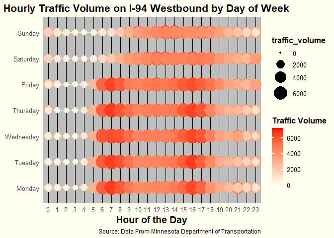

# Data Visualization Mini-Project (TrafficMN)

## Introduction

Welcome to the Data Visualization Mini-Project! In this project, we'll dive into the traffic data from Interstate 94 Westbound in Minnesota, exploring how various factors like weather and time of day impact traffic volume. The dataset contains hourly traffic volume records along with weather conditions, which offers a rich source of insights into traffic patterns.

### Data Preparation and Analysis

Before we get to the exciting visualizations, let's walk through the initial steps of preparing and the dataset. The primary goal is to clean the data, extract useful features, and ensure it's ready for analysis.

### Step-by-Step Code Explanation

1.  **Downloading the Dataset:**

First, the dataset are needed to be downloaded and save it locally. This ensures the project have a stable copy of the data for the project analysis.


```r
# # Set the URL for the dataset
# url <- "https://raw.githubusercontent.com/reisanar/datasets/master/trafficMN.csv"
# 
# # Create the data folder if it doesn't exist
# if (!dir.exists("../data")) {
#   dir.create("../data")
# }
# 
# # Download the dataset into the data folder
# download.file(url, destfile = "C:/Users/zhizh/Desktop/Zhi_Zheng_Mini_Project_1/data/trafficMN.csv", method = "curl")
```

2.  **Installing Required Libraries:**

The project need a few R libraries to help with data manipulation and visualization. Let's install them if they're not already installed.


```r
# # Install all required libraries
# install.packages("tidyverse")
# install.packages('reshape2')
# install.packages(ggplot2)
# install.packages(lubridate)
# install.packages(viridis)
```

3.  **Loading the Libraries:**

Now, let's load the libraries that will be use throughout the project.


```r
# Load necessary libraries
library(tidyverse)
```

```
## ── Attaching core tidyverse packages ──────────────────────── tidyverse 2.0.0 ──
## ✔ dplyr     1.1.4     ✔ readr     2.1.5
## ✔ forcats   1.0.0     ✔ stringr   1.5.1
## ✔ ggplot2   3.5.0     ✔ tibble    3.2.1
## ✔ lubridate 1.9.3     ✔ tidyr     1.3.1
## ✔ purrr     1.0.2     
## ── Conflicts ────────────────────────────────────────── tidyverse_conflicts() ──
## ✖ dplyr::filter() masks stats::filter()
## ✖ dplyr::lag()    masks stats::lag()
## ℹ Use the conflicted package (<http://conflicted.r-lib.org/>) to force all conflicts to become errors
```

```r
library(reshape2)
```

```
## 
## 载入程辑包：'reshape2'
## 
## The following object is masked from 'package:tidyr':
## 
##     smiths
```

```r
library(ggplot2)
library(lubridate)
library(viridis)
```

```
## 载入需要的程辑包：viridisLite
```

4.  **Loading and Checking the Dataset:**

With the libraries in place, dataset are loaded and perform an initial check to ensure it loaded correctly.


```r
# Load the dataset
traffic_data <- read_csv("../data/trafficMN.csv")
```

```
## Rows: 48204 Columns: 9
## ── Column specification ────────────────────────────────────────────────────────
## Delimiter: ","
## chr  (3): holiday, weather_main, weather_description
## dbl  (5): temp, rain_1h, snow_1h, clouds_all, traffic_volume
## dttm (1): date_time
## 
## ℹ Use `spec()` to retrieve the full column specification for this data.
## ℹ Specify the column types or set `show_col_types = FALSE` to quiet this message.
```

```r
# Initial check if the dataset is loaded correctly
head(traffic_data)
```

```
## # A tibble: 6 × 9
##   holiday  temp rain_1h snow_1h clouds_all weather_main weather_description
##   <chr>   <dbl>   <dbl>   <dbl>      <dbl> <chr>        <chr>              
## 1 None     288.       0       0         40 Clouds       scattered clouds   
## 2 None     289.       0       0         75 Clouds       broken clouds      
## 3 None     290.       0       0         90 Clouds       overcast clouds    
## 4 None     290.       0       0         90 Clouds       overcast clouds    
## 5 None     291.       0       0         75 Clouds       broken clouds      
## 6 None     292.       0       0          1 Clear        sky is clear       
## # ℹ 2 more variables: date_time <dttm>, traffic_volume <dbl>
```

5.  **Summarizing the Dataset:**

Next, the dataset are summarize to get an overview of its structure and content, and check for any missing values.


```r
# Summarize the dataset
summary(traffic_data)
```

```
##    holiday               temp          rain_1h            snow_1h         
##  Length:48204       Min.   :  0.0   Min.   :   0.000   Min.   :0.0000000  
##  Class :character   1st Qu.:272.2   1st Qu.:   0.000   1st Qu.:0.0000000  
##  Mode  :character   Median :282.4   Median :   0.000   Median :0.0000000  
##                     Mean   :281.2   Mean   :   0.334   Mean   :0.0002224  
##                     3rd Qu.:291.8   3rd Qu.:   0.000   3rd Qu.:0.0000000  
##                     Max.   :310.1   Max.   :9831.300   Max.   :0.5100000  
##    clouds_all     weather_main       weather_description
##  Min.   :  0.00   Length:48204       Length:48204       
##  1st Qu.:  1.00   Class :character   Class :character   
##  Median : 64.00   Mode  :character   Mode  :character   
##  Mean   : 49.36                                         
##  3rd Qu.: 90.00                                         
##  Max.   :100.00                                         
##    date_time                      traffic_volume
##  Min.   :2012-10-02 09:00:00.00   Min.   :   0  
##  1st Qu.:2014-02-06 11:45:00.00   1st Qu.:1193  
##  Median :2016-06-11 03:30:00.00   Median :3380  
##  Mean   :2016-01-05 10:46:16.76   Mean   :3260  
##  3rd Qu.:2017-08-11 06:00:00.00   3rd Qu.:4933  
##  Max.   :2018-09-30 23:00:00.00   Max.   :7280
```

```r
# Check for missing values
sum(is.na(traffic_data))
```

```
## [1] 0
```

```r
# Display the structure of the dataset
str(traffic_data)
```

```
## spc_tbl_ [48,204 × 9] (S3: spec_tbl_df/tbl_df/tbl/data.frame)
##  $ holiday            : chr [1:48204] "None" "None" "None" "None" ...
##  $ temp               : num [1:48204] 288 289 290 290 291 ...
##  $ rain_1h            : num [1:48204] 0 0 0 0 0 0 0 0 0 0 ...
##  $ snow_1h            : num [1:48204] 0 0 0 0 0 0 0 0 0 0 ...
##  $ clouds_all         : num [1:48204] 40 75 90 90 75 1 1 1 20 20 ...
##  $ weather_main       : chr [1:48204] "Clouds" "Clouds" "Clouds" "Clouds" ...
##  $ weather_description: chr [1:48204] "scattered clouds" "broken clouds" "overcast clouds" "overcast clouds" ...
##  $ date_time          : POSIXct[1:48204], format: "2012-10-02 09:00:00" "2012-10-02 10:00:00" ...
##  $ traffic_volume     : num [1:48204] 5545 4516 4767 5026 4918 ...
##  - attr(*, "spec")=
##   .. cols(
##   ..   holiday = col_character(),
##   ..   temp = col_double(),
##   ..   rain_1h = col_double(),
##   ..   snow_1h = col_double(),
##   ..   clouds_all = col_double(),
##   ..   weather_main = col_character(),
##   ..   weather_description = col_character(),
##   ..   date_time = col_datetime(format = ""),
##   ..   traffic_volume = col_double()
##   .. )
##  - attr(*, "problems")=<externalptr>
```

6.  **Feature Extraction:**

To make the analysis more insightful, additional features like `date`, `day of the week`, and `hour` are extract from the `date_time` column.


```r
# Extract the date and day of the week from the date_time column
traffic_data <- traffic_data %>%
  mutate(
    date = as.Date(date_time),
    day_of_week = weekdays(date),
    day_of_week = case_when(
      day_of_week == "星期一" ~ "Monday",
      day_of_week == "星期二" ~ "Tuesday",
      day_of_week == "星期三" ~ "Wednesday",
      day_of_week == "星期四" ~ "Thursday",
      day_of_week == "星期五" ~ "Friday",
      day_of_week == "星期六" ~ "Saturday",
      day_of_week == "星期日" ~ "Sunday"
    ),
    day_of_week = factor(day_of_week, 
                         levels = c("Monday",
                                  "Tuesday", 
                                   "Wednesday",
                                   "Thursday",
                                   "Friday",
                                   "Saturday",
                                   "Sunday")),
    hour = factor(hour(date_time))
  )
```

7.  **Summarizing Traffic Volume by Day of the Week:**

Finally, the traffic volume by day of the week are summarize to see how traffic patterns vary across different days.


```r
# Summarize the dataset
summary(traffic_data)
```

```
##    holiday               temp          rain_1h            snow_1h         
##  Length:48204       Min.   :  0.0   Min.   :   0.000   Min.   :0.0000000  
##  Class :character   1st Qu.:272.2   1st Qu.:   0.000   1st Qu.:0.0000000  
##  Mode  :character   Median :282.4   Median :   0.000   Median :0.0000000  
##                     Mean   :281.2   Mean   :   0.334   Mean   :0.0002224  
##                     3rd Qu.:291.8   3rd Qu.:   0.000   3rd Qu.:0.0000000  
##                     Max.   :310.1   Max.   :9831.300   Max.   :0.5100000  
##                                                                           
##    clouds_all     weather_main       weather_description
##  Min.   :  0.00   Length:48204       Length:48204       
##  1st Qu.:  1.00   Class :character   Class :character   
##  Median : 64.00   Mode  :character   Mode  :character   
##  Mean   : 49.36                                         
##  3rd Qu.: 90.00                                         
##  Max.   :100.00                                         
##                                                         
##    date_time                      traffic_volume      date           
##  Min.   :2012-10-02 09:00:00.00   Min.   :   0   Min.   :2012-10-02  
##  1st Qu.:2014-02-06 11:45:00.00   1st Qu.:1193   1st Qu.:2014-02-06  
##  Median :2016-06-11 03:30:00.00   Median :3380   Median :2016-06-11  
##  Mean   :2016-01-05 10:46:16.76   Mean   :3260   Mean   :2016-01-04  
##  3rd Qu.:2017-08-11 06:00:00.00   3rd Qu.:4933   3rd Qu.:2017-08-11  
##  Max.   :2018-09-30 23:00:00.00   Max.   :7280   Max.   :2018-09-30  
##                                                                      
##     day_of_week        hour      
##  Monday   :7072   4      : 2091  
##  Tuesday  :6846   6      : 2087  
##  Wednesday:6930   8      : 2080  
##  Thursday :6817   7      : 2079  
##  Friday   :6836   10     : 2078  
##  Saturday :6831   5      : 2063  
##  Sunday   :6872   (Other):35726
```

```r
# Check for missing values
sum(is.na(traffic_data))
```

```
## [1] 0
```

```r
# Display the structure of the dataset
str(traffic_data)
```

```
## tibble [48,204 × 12] (S3: tbl_df/tbl/data.frame)
##  $ holiday            : chr [1:48204] "None" "None" "None" "None" ...
##  $ temp               : num [1:48204] 288 289 290 290 291 ...
##  $ rain_1h            : num [1:48204] 0 0 0 0 0 0 0 0 0 0 ...
##  $ snow_1h            : num [1:48204] 0 0 0 0 0 0 0 0 0 0 ...
##  $ clouds_all         : num [1:48204] 40 75 90 90 75 1 1 1 20 20 ...
##  $ weather_main       : chr [1:48204] "Clouds" "Clouds" "Clouds" "Clouds" ...
##  $ weather_description: chr [1:48204] "scattered clouds" "broken clouds" "overcast clouds" "overcast clouds" ...
##  $ date_time          : POSIXct[1:48204], format: "2012-10-02 09:00:00" "2012-10-02 10:00:00" ...
##  $ traffic_volume     : num [1:48204] 5545 4516 4767 5026 4918 ...
##  $ date               : Date[1:48204], format: "2012-10-02" "2012-10-02" ...
##  $ day_of_week        : Factor w/ 7 levels "Monday","Tuesday",..: 2 2 2 2 2 2 2 2 2 2 ...
##  $ hour               : Factor w/ 24 levels "0","1","2","3",..: 10 11 12 13 14 15 16 17 18 19 ...
```

```r
# Summarize the data by grouping and calculating the mean traffic volume by day of the week
traffic_summary <- traffic_data %>%
  group_by(day_of_week) %>%
  summarize(mean_traffic_volume = mean(traffic_volume, na.rm = TRUE))
```

With the dataset now prepped for exploration and visualization, the analysis can commence. The traffic data has been successfully loaded, initial checks performed, and the dataset ensured to be clean and structured. Key features such as `date`, `day of the week`, and `hour` have been extracted from the `date_time` column, providing the necessary granularity for in-depth analysis. Additionally, the traffic volume has been summarized by day of the week, offering a preliminary understanding of how traffic patterns vary across different days. This thorough preparation sets the stage for creating insightful visualizations that will uncover trends and patterns in traffic volume, influenced by time of day, weather conditions, and holidays.

------------------------------------------------------------------------

## Density Plot of Traffic Volume: Strategy and Insights

### Evolution of Visualization Plan

The initial plan for this assignment began with creating a histogram to explore the traffic volume data from Interstate 94 Westbound in Minnesota. The purpose of the histogram was to observe the raw distribution of traffic volumes, as histograms provide detailed count information within specified bins and help identify the frequency of traffic volumes across different ranges. However, seeking to enhance the visualization and provide more detailed insights, the plan evolved to consider a violin plot. The violin plot aimed to combine density estimation with summary statistics such as the median and quartiles, offering a more detailed view of the data distribution's shape and central tendency. Despite these advantages, violin plots can be visually complex and potentially cluttered.

Ultimately, the decision was made to use a density plot for its ability to offer a smooth, continuous estimate of the distribution of traffic volume. Density plots highlight patterns and peaks more clearly than histograms and provide a cleaner, less cluttered representation compared to violin plots. This choice aligns with the objective of creating a clear, informative, and visually appealing representation of the traffic volume data.


```r
# Compute summary statistics for traffic volume
traffic_summary <- traffic_data %>%
  summarize(
    mean_volume = mean(traffic_volume, na.rm = TRUE),     # Calculate the mean traffic volume, excluding NA values
    median_volume = median(traffic_volume, na.rm = TRUE), # Calculate the median traffic volume, excluding NA values
    sd_volume = sd(traffic_volume, na.rm = TRUE),         # Calculate the standard deviation of traffic volume, excluding NA values
    q1_volume = quantile(traffic_volume, 0.25, na.rm = TRUE), # Calculate the 1st quartile (Q1) of traffic volume, excluding NA values
    q3_volume = quantile(traffic_volume, 0.75, na.rm = TRUE)  # Calculate the 3rd quartile (Q3) of traffic volume, excluding NA values
  )

# Display the summary statistics
print(traffic_summary)
```

```
## # A tibble: 1 × 5
##   mean_volume median_volume sd_volume q1_volume q3_volume
##         <dbl>         <dbl>     <dbl>     <dbl>     <dbl>
## 1       3260.          3380     1987.      1193      4933
```


```r
# Prepare data for lines to be added as separate layers
# This data frame includes the x-intercepts for mean, median, Q1, and Q3 traffic volumes
line_data <- data.frame(
  xintercept = c(traffic_summary$mean_volume, traffic_summary$median_volume, traffic_summary$q1_volume, traffic_summary$q3_volume),
  category = factor(c("Mean", "Median", "Q1", "Q3"), levels = c("Q1", "Median", "Mean", "Q3"))
)

# Define color-blind friendly palette
cb_palette <- c(
  "Mean" = "#E69F00",   # orange
  "Median" = "#56B4E9", # sky blue
  "Q1" = "#009E73",     # bluish green
  "Q3" = "#F0E442"      # yellow
)

# Create a density plot for traffic volume
traffic_density_plot <- ggplot(traffic_data, aes(x = traffic_volume)) +
  # Add a density plot with light blue fill and black border
  geom_density(fill = "lightblue", alpha = 0.5, color = "black") +
  # Add vertical lines for mean, median, Q1, and Q3 traffic volumes
  geom_vline(data = line_data, aes(xintercept = xintercept, color = category, linetype = category), size = 1) +
  # Customize color and linetype scales
  scale_color_manual(values = cb_palette) +
  scale_linetype_manual(values = c("Mean" = "solid", "Median" = "dashed", "Q1" = "dotted", "Q3" = "dotdash")) +
  # Add plot title, subtitle, caption, and axis labels
  labs(
    title = "Density Plot of Traffic Volume",
    subtitle = "Traffic volume data collected from Interstate 94 Westbound in Minnesota",
    caption = "Source: Data From Minnesota Department of Transportation",
    x = "Traffic Volume (Number of Vehicles per Hour)",
    y = "Density",
    color = "Statistic",
    linetype = "Statistic"
  ) +
  # Customize y-axis and x-axis labels
  scale_y_continuous(labels = scales::number_format(accuracy = 0.0001)) +
  scale_x_continuous(labels = scales::comma) +
  # Apply a minimal theme for the plot
  theme_minimal() +
  # Customize various elements of the plot's theme
  theme(
    plot.title.position = "plot",
    plot.title = element_text(hjust = 0, size = 14, face = "bold"),
    plot.subtitle = element_text(hjust = 0, size = 12),
    plot.caption = element_text(hjust = 1, size = 10, face = "italic"),
    axis.title.x = element_text(size = 12, face = "bold"),
    axis.title.y = element_text(size = 12, face = "bold", angle = 0, vjust = 0.5),
    axis.text = element_text(size = 10),
    panel.background = element_rect(fill = "gray", color = NA),
    plot.background = element_rect(fill = "ivory", color = NA),
    panel.grid.major = element_line(color = "ivory", linewidth = 0.5),
    panel.grid.minor = element_line(color = "ivory", linewidth = 0.25),
    legend.position = "right"
  )
```

```
## Warning: Using `size` aesthetic for lines was deprecated in ggplot2 3.4.0.
## ℹ Please use `linewidth` instead.
## This warning is displayed once every 8 hours.
## Call `lifecycle::last_lifecycle_warnings()` to see where this warning was
## generated.
```

```r
# Display the plot
traffic_density_plot
```

<!-- -->

### Insights from the Density Plot

The final density plot conveys several key insights about traffic volume patterns. It illustrates the overall distribution of traffic volumes, highlighting common traffic volumes and peak frequencies. By incorporating lines for the mean, median, first quartile (Q1), and third quartile (Q3), the plot provides insights into central tendencies and variability, offering a clear understanding of typical traffic conditions and their variations. The inclusion of summary statistics allows for quick comparisons between measures of central tendency (mean vs. median) and data spread (Q1 and Q3), enhancing the understanding of traffic patterns.

### Stories Derived from Insights

1.  **Traffic Flow During Peak Hours:**
    -   The density plot indicates distinct peaks at certain traffic volumes, suggesting the times of day when traffic is heaviest. These peaks likely correspond to rush hours when people are commuting to and from work. Understanding these peak times can help traffic management authorities implement measures such as adjusting traffic signal timings, encouraging carpooling, or promoting public transportation during these hours to alleviate congestion.
2.  **Variability in Traffic Volumes:**
    -   The spread of traffic volumes, as indicated by the quartile lines, highlights the variability in traffic conditions. On some days, traffic volumes may fluctuate widely, indicating inconsistent traffic flow. This variability can be influenced by external factors such as weather conditions, accidents, or special events. Recognizing these patterns can assist in proactive traffic management, such as deploying additional traffic control personnel during high-variability periods or informing drivers about expected delays.

These stories provide actionable insights that can inform traffic management strategies aimed at reducing congestion and improving traffic flow on Interstate 94 Westbound.

#### Application of Data Visualization Principles

The following principles of data visualization and design were applied to create an effective and informative density plot:

1.  **Clarity and Simplicity:**
    -   The density plot provides a smooth, continuous estimate of traffic volume distribution, avoiding the clutter of histograms and the complexity of violin plots.
2.  **Use of Color and Aesthetics:**
    -   A color-blind friendly palette ensures accessibility and readability for all viewers. Different colors effectively distinguish between the mean, median, Q1, and Q3 lines.
    -   The plot background and gridlines are styled to enhance readability without overshadowing the data.
3.  **Incorporation of Summary Statistics:**
    -   Lines for mean, median, Q1, and Q3 are added to provide context and additional insights into the distribution of traffic volume.
    -   These lines help viewers quickly understand central tendency and variability in the data.
4.  **Effective Labeling and Titles:**
    -   Descriptive title, subtitle, and axis labels clearly communicate the data being presented.
    -   A caption provides the data source, adding credibility and context to the visualization.
5.  **Attention to Detail:**
    -   Axis labels and gridlines are formatted for precision and ease of interpretation.
    -   The plot maintains a balance between visual appeal and informational content, effectively communicating the story behind the data.

------------------------------------------------------------------------

## Hourly Traffic Volume on I-94 Westbound by Day of Week

### Evolution of Visualization Plan

The initial plan for this visualization involved using a heatmap with `geom_tile` to represent traffic volume at different times of the day across various days of the week. This approach aimed to provide a clear and compact overview of traffic patterns. However, the heatmap lacked visual impact due to its shape limitations. Next, a sunburst plot was considered to offer a hierarchical view of the traffic data and illustrate nested relationships. Unfortunately, the sunburst plot also proved to be visually unappealing and complex. Ultimately, a point plot using `geom_point` was chosen for its ability to deliver better granularity and clarity, offering a more detailed and precise representation of the dataset.


```r
# Create a scatter plot for hourly traffic volume on I-94 Westbound by day of the week
traffic_volume_plot <- ggplot(traffic_data, aes(x = hour, y = day_of_week)) +
  # Add points to the plot, with size and color based on traffic volume
  geom_point(aes(size = traffic_volume, color = traffic_volume)) +
  # Define the color gradient for traffic volume
  scale_color_gradient(low = "ivory", high = "red", name = "Traffic Volume") +
  # Define the size range for points
  scale_size(range = c(1, 10)) +
  # Add plot title, caption, and axis labels
  labs(
    title = "Hourly Traffic Volume on I-94 Westbound by Day of Week",
    caption = "Source: Data From Minnesota Department of Transportation",
    x = "Hour of the Day",
    y = ""
  ) +
  # Apply a minimal theme for the plot
  theme_minimal() +
  # Customize various elements of the plot's theme
  theme(
    plot.title.position = "plot",
    plot.title = element_text(hjust = 0, size = 16, face = "bold"),
    axis.title.x = element_text(size = 14, face = "bold"),
    axis.title.y = element_text(size = 14, face = "bold", angle = 0, vjust = 0.5),
    axis.text.x = element_text(size = 10),
    axis.text.y = element_text(size = 10),
    legend.title = element_text(size = 12, face = "bold"),
    legend.text = element_text(size = 10),
    panel.background = element_rect(fill = "gray", color = NA),
    plot.background = element_rect(fill = "ivory", color = NA),
    panel.grid.major.x = element_line(color = "black", size = 0.5),
    panel.grid.minor.x = element_blank()
  )
```

```
## Warning: The `size` argument of `element_line()` is deprecated as of ggplot2 3.4.0.
## ℹ Please use the `linewidth` argument instead.
## This warning is displayed once every 8 hours.
## Call `lifecycle::last_lifecycle_warnings()` to see where this warning was
## generated.
```

```r
# Display the plot in RStudio
print(traffic_volume_plot)
```

<!-- -->

```r
# Save the plot to a file with specified dimensions
ggsave("hourly_traffic_volume_i94.png", plot = traffic_volume_plot, width = 12, height = 8)
```

### Insights from the Point Plot

The scatter plot above represents hourly traffic volumes on I-94 Westbound, categorized by the day of the week. This visualization provides a detailed view of how traffic patterns fluctuate throughout the day and across different days of the week. The size and color of the points correspond to the traffic volume, with larger and darker points indicating higher volumes.

### Stories Derived from Insights

1.  **Daily Traffic Patterns:**
    -   The scatter plot reveals distinct daily traffic patterns. For example, weekday mornings and evenings show higher traffic volumes, indicative of typical rush hour peaks. In contrast, weekends display a more spread out traffic volume, with peaks occurring later in the day, likely reflecting different travel behaviors on non-workdays.
2.  **Impact of Hourly Traffic Flow:**
    -   By visualizing traffic volume by hour and day, this plot highlights critical periods of congestion, which can inform targeted traffic management interventions. For instance, identifying the hours with consistently high traffic volumes across weekdays can help in scheduling road maintenance, optimizing traffic signal timings, and implementing congestion pricing during peak hours to manage demand.

## Application of Data Visualization Principles for Hourly Traffic Volume on I-94 Westbound by Day of Week

The point plot representing hourly traffic volumes on I-94 Westbound by day of the week was created by applying several key principles of data visualization and design:

1.  **Clarity and Simplicity:**

    -   The point plot provides a clear and straightforward representation of traffic volumes at different hours across the days of the week. Each point's size and color correspond to the traffic volume, making it easy to compare traffic patterns visually.

2.  **Effective Use of Color and Size:**

    -   A color gradient ranging from light to dark red was used to represent increasing traffic volumes, ensuring that higher volumes stand out prominently. The size of the points also varies with traffic volume, adding another layer of visual differentiation.

3.  **Granularity and Detail:**

    -   By using a point plot, the visualization achieves a high level of granularity, showing traffic volumes for each hour of the day. This detailed representation allows for precise analysis of traffic patterns and peak times.

4.  **Appropriate Scales and Legends:**

    -   The axes are clearly labeled, with the x-axis representing the hour of the day and the y-axis representing the days of the week. A legend is included to explain the color gradient and point size, aiding in the interpretation of the plot.

5.  **Minimalistic Design:**

    -   A minimalistic theme was applied to reduce visual clutter, focusing the viewer's attention on the data. Background colors and gridlines are kept subtle to enhance readability without distracting from the main points.

6.  **Informative Titles and Captions:**

    -   The plot includes a descriptive title that clearly indicates the purpose of the visualization. A caption is provided to cite the data source, adding credibility and context to the plot.

7.  **Accessibility:**

    -   The color palette used is color-blind friendly, ensuring that the visualization is accessible to a wider audience. This consideration is crucial for inclusive data presentation.

------------------------------------------------------------------------

## Distribution of Traffic Volume by Weather Condition

### Evolution of Visualization Plan

The initial plan for this visualization involved using subgroups of histograms to represent traffic volume at different times of the day across various weather conditions. This approach aimed to provide a clear and detailed view of traffic patterns. However, the histograms lacked the ability to effectively compare distributions across multiple categories simultaneously. To improve the visualization, the plan was changed to use a density plot with subgroups. While density plots offered a smoother representation of data distribution, they still fell short in comparing multiple categories clearly.

Ultimately, a violin plot was chosen for its superior ability to combine density distribution and summary statistics. Violin plots offer a more comprehensive view by showing the full distribution of the data along with critical summary statistics like the median and quartiles. This makes it easier to compare the spread and central tendency of traffic volumes across different weather conditions. The violin plot's visual appeal and effectiveness in highlighting differences between categories made it the best choice for this situation.


```r
# Filter data for specific weather conditions
filtered_traffic_data <- traffic_data %>%
  filter(weather_main %in% c("Clear", "Fog", "Snow", "Rain", "Drizzle", "Thunderstorm"))

# Violin Plot with additional context
ggplot(filtered_traffic_data, aes(x = weather_main, y = traffic_volume, fill = weather_main)) +
  geom_violin(trim = FALSE, scale = "width", adjust = 1, alpha = 0.7) +
  geom_boxplot(width = 0.1, fill = "white", alpha = 0.7) +
  scale_fill_viridis_d(option = "viridis") +
  labs(
    title = "Distribution of Traffic Volume by Weather Condition",
    subtitle = "Comparison of traffic volume under different weather conditions",
    caption = "Source: Data From Minnesota Department of Transportation",
    x = "Weather Condition",
    y = "Traffic Volume",
    fill = "Weather Condition"
  ) +
  theme_minimal() +
  theme(
    plot.title = element_text(hjust = 0, size = 16, face = "bold"),
    plot.subtitle = element_text(hjust = 0, size = 12),
    plot.caption = element_text(hjust = 1, size = 10, face = "italic"),
    axis.title.x = element_text(size = 14, face = "bold"),
    axis.title.y = element_text(size = 14, face = "bold", angle = 0, vjust = 0.5),
    axis.text.x = element_text(size = 10),
    axis.text.y = element_text(size = 10),
    legend.position = "right",
    panel.background = element_rect(fill = "ivory", color = NA),
    plot.background = element_rect(fill = "ivory", color = NA),
    panel.grid.major.x = element_line(color = "black", size = 0.5),
    panel.grid.minor.x = element_blank()
  )
```

<!-- -->

### Insights from the Violin Plot

The violin plot compares the distribution of traffic volume under different weather conditions. It shows how weather impacts traffic volumes, highlighting the spread and central tendency for each condition. By incorporating both the density distribution and a boxplot within the violin plot, it provides a comprehensive view of the data.

### Stories Derived from Insights

1.  **Impact of Weather Conditions on Traffic Volume:**
    -   The violin plot reveals that traffic volumes tend to be higher during clear weather conditions, as indicated by the wider spread and higher central tendency in the "Clear" category. This suggests that favorable weather conditions correlate with increased traffic flow, likely due to more predictable and safer driving conditions. Conversely, traffic volumes tend to decrease under adverse weather conditions such as fog, snow, and thunderstorms, where the spread is narrower, and central tendencies are lower. This can inform traffic management strategies to anticipate and address potential congestion during adverse weather by deploying resources to manage traffic more effectively and ensuring timely communication of traffic advisories to drivers.
2.  **Variability in Traffic Volumes Across Weather Conditions:**
    -   The inclusion of boxplots within the violins indicates the variability in traffic volumes. For example, the interquartile range (IQR) for clear and drizzle conditions is relatively larger, indicating higher variability and fluctuations in traffic volume. In contrast, fog, snow, and thunderstorms show more consistent traffic volumes with less variability, possibly due to reduced travel during these conditions. Understanding these patterns can help in optimizing traffic signal timings and planning maintenance activities. For instance, during periods of low variability in adverse weather conditions, maintenance work can be scheduled to minimize disruption to traffic flow.

### Application of Data Visualization Principles for the Violin Plot

The violin plot representing the distribution of traffic volume by weather condition was created by applying several key principles of data visualization and design:

1.  **Clarity and Simplicity:**
    -   The violin plot provides a clear and straightforward representation of traffic volumes under different weather conditions. Each violin's shape, width, and the included boxplot help convey the distribution, spread, and central tendency of the data.
2.  **Effective Use of Color:**
    -   A color palette from the viridis package was used to differentiate between weather conditions, ensuring that each category is distinct and easily identifiable. This helps viewers quickly associate traffic patterns with specific weather conditions.
3.  **Granularity and Detail:**
    -   By using a violin plot with an overlaid boxplot, the visualization achieves a high level of granularity, showing both the distribution of traffic volumes and key summary statistics (median, quartiles). This detailed representation allows for a comprehensive analysis of traffic patterns.
4.  **Appropriate Scales and Legends:**
    -   The axes are clearly labeled, with the x-axis representing the weather condition and the y-axis representing traffic volume. A legend is included to explain the color coding of weather conditions, aiding in the interpretation of the plot.
5.  **Minimalistic Design:**
    -   A minimalistic theme was applied to reduce visual clutter, focusing the viewer's attention on the data. Background colors and gridlines are kept subtle to enhance readability without distracting from the main elements.
6.  **Informative Titles and Captions:**
    -   The plot includes a descriptive title and subtitle that clearly indicate the purpose of the visualization. A caption is provided to cite the data source, adding credibility and context to the plot.
7.  **Accessibility:**
    -   The color palette used is color-blind friendly, ensuring that the visualization is accessible to a wider audience. This consideration is crucial for inclusive data presentation.

------------------------------------------------------------------------

## Conclusion

### Combined Story from the Visualizations

Together, these visualizations tell a comprehensive story about the traffic patterns on Interstate 94 Westbound:

1.  **Peak Traffic Times:**

    -   **Density Plot:** The density plot highlights distinct peaks in traffic volume, clearly indicating the times of day when traffic is at its heaviest. These peaks correspond to the morning (7 AM to 9 AM) and evening (4 PM to 6 PM) rush hours on weekdays. This pattern suggests that the majority of commuters travel to and from work during these times, reinforcing a strong daily routine.
    -   **Point Plot:** The point plot complements this by providing a detailed view of how traffic volume varies across different days of the week and hours of the day. It shows that while weekdays have pronounced peaks during rush hours, weekends exhibit more evenly distributed traffic volumes, with peaks occurring later in the day. This indicates different travel behaviors, likely due to leisure activities and shopping.

    **Insight:** Traffic management authorities can use these insights to implement targeted measures during peak hours. For instance, adjusting traffic signal timings to prioritize flow on major commuter routes during rush hours, encouraging carpooling to reduce the number of vehicles on the road, and promoting the use of public transportation can help alleviate congestion.

2.  **Weather Impact:**

    -   **Violin Plot:** The violin plot adds another dimension by illustrating how different weather conditions affect traffic volumes. Clear weather conditions result in higher traffic volumes, as indicated by the wider spread and higher central tendency in the "Clear" category. In contrast, adverse weather conditions like fog, snow, and thunderstorms lead to lower traffic volumes and more consistent patterns, suggesting that drivers may opt to stay off the roads during poor weather.

    **Insight:** Understanding the impact of weather on traffic volumes enables traffic management authorities to anticipate changes in traffic patterns during adverse conditions. Proactive measures such as timely communication of weather-related advisories, deploying additional traffic control personnel, and ensuring that road maintenance and clearing operations are in place can help maintain traffic flow and safety.

3.  **Planning and Management:**

    -   **Density Plot, Point Plot, and Violin Plot Combined:** By integrating the insights from all three visualizations, a holistic understanding of traffic behavior emerges. During peak hours on weekdays, traffic volumes are significantly higher, necessitating targeted congestion management strategies. On weekends, the traffic volume is more evenly distributed, allowing for more flexible management approaches. Adverse weather conditions consistently reduce traffic volumes, indicating a need for preparedness and adaptive strategies during such events.

    **Insight:** A comprehensive traffic management plan can be developed by combining these insights. During peak hours, strategies such as dynamic traffic signal timings, dedicated carpool lanes, and incentives for public transportation can be implemented. For weekends, flexible traffic management that accommodates leisure travel patterns can be adopted. During adverse weather, ensuring clear communication, deploying necessary resources, and prioritizing road safety become crucial.

**Overall Story:** The combined visualizations provide a nuanced understanding of traffic patterns on Interstate 94 Westbound. They highlight the critical role of peak traffic times, the significant impact of weather conditions, and the need for adaptive planning and management strategies. By leveraging these insights, traffic management authorities can enhance their ability to manage traffic flow, reduce congestion, and improve overall road safety and efficiency. This holistic approach ensures that traffic management is responsive to both routine and extraordinary conditions, ultimately leading to better travel experiences for all road users.

## Future Work

The insights gained from this analysis offer a solid foundation for understanding traffic patterns on Interstate 94 Westbound. However, there are several avenues for future work that can build upon these findings to further enhance traffic management and planning:

1.  **Advanced Predictive Modeling:**
    -   Developing advanced predictive models using machine learning algorithms can help forecast traffic volumes based on historical data, weather forecasts, and other relevant factors. These models can provide valuable foresight, enabling proactive traffic management and planning.
2.  **Expand Data Sources:**
    -   Including additional data sources such as accident reports, construction schedules, and public events can offer a more comprehensive view of factors affecting traffic patterns. This would enhance the ability to anticipate and manage traffic disruptions more effectively.
3.  **Geospatial Analysis:**
    -   Conducting geospatial analysis to study traffic patterns in different geographical areas of the highway can identify localized issues and opportunities for improvement. This would support more tailored and effective traffic management strategies.
4.  **Enhanced Visualization Techniques:**
    -   Exploring more advanced and interactive visualization techniques can improve the communication of traffic data insights to stakeholders. Interactive dashboards and visual analytics tools can make it easier for traffic management authorities to explore and understand complex data sets.

By pursuing these areas of future work, traffic management authorities can continue to improve their understanding of traffic patterns and develop more effective strategies to manage traffic flow, reduce congestion, and enhance road safety. This ongoing effort will contribute to creating a more efficient and responsive transportation system on Interstate 94 Westbound and beyond.
