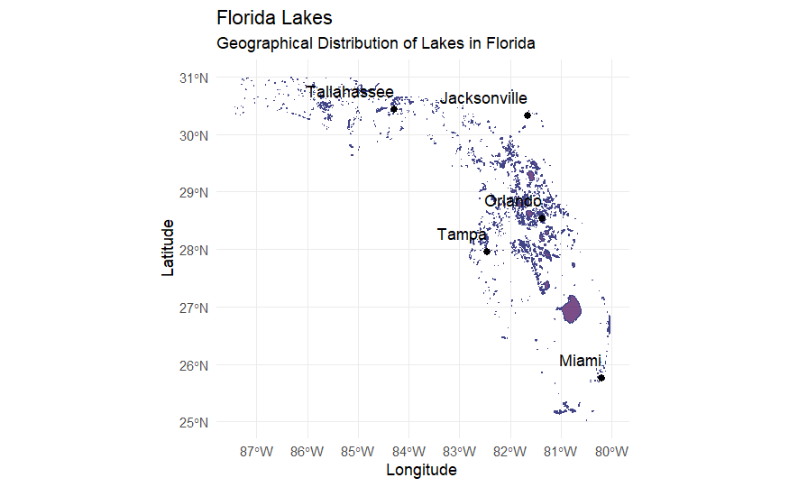

# Data Visualization 

> Zhi Zheng

## Mini-Project 2

### Project Description

This mini-project focuses on analyzing the geographical distribution of lakes in Florida and predicting the SHAPEAREA of these lakes based on their PERIMETER using linear regression. The main objectives of this project include data cleaning and preparation, fitting a linear regression model, analyzing residuals, and creating both static and interactive visualizations to effectively communicate the findings.

### Motivation

The motivation behind this project is to understand the spatial distribution of lakes in Florida and explore the relationship between a lake's perimeter and its area. This analysis provides insights into the characteristics of Florida's lakes and helps identify patterns and anomalies in their distribution and size.

### Summary of Findings

- **Geographical Distribution (Revised)**: The spatial visualizations show the distribution of lakes across Florida, categorized by their size. Major cities are marked to provide context and help understand the proximity of lakes to urban areas. After revision, the visualizations have been enhanced by adding the outline of Florida and the boundaries of its counties.

  

  

  

  

- **Interactive Visualization (Revised)**: An interactive map was created to enhance user engagement, providing additional information through hover text and zoom capabilities. This allows users to explore the data more dynamically and gain deeper insights.

- **Linear Regression Analysis**: A linear regression model was fitted to predict the area of lakes based on their perimeter. The model confirmed a significant correlation between perimeter and area, with some notable outliers indicating unique characteristics or measurement anomalies.

  

  

### Data Description

The project utilizes the Florida Lakes Shapefiles dataset. Key attributes explored in the analysis include:

- **SHAPEAREA**: The area of each lake in the dataset.
- **PERIMETER**: The perimeter length of each lake.
- **Location Coordinates**: The geographical coordinates (latitude and longitude) of each lake.
- **Area Category**: The categorization of lakes based on their area (Small, Medium, Large).

### Key Components

- **Data Acquisition and Preparation**: Downloading and preparing the datasets, ensuring the validity of spatial data, and categorizing lakes based on their area.
- **Static and Enhanced Visualizations**: Creating basic and enhanced static maps of Florida lakes, including contextual elements like major cities.
- **Interactive Visualization**: Converting static plots to interactive maps using plotly, allowing for dynamic exploration of the data.
- **Linear Regression Analysis**: Fitting a linear model to predict lake area based on perimeter and analyzing residuals to identify significant outliers.

### Items

- **Data Cleaning and Categorization**: Ensuring the dataset's validity by correcting invalid geometries and categorizing lakes based on their area.
- **Visual and Statistical Analysis**: Creating static and interactive visualizations to explore the spatial distribution of lakes and fitting a linear regression model to analyze the relationship between lake perimeter and area.

