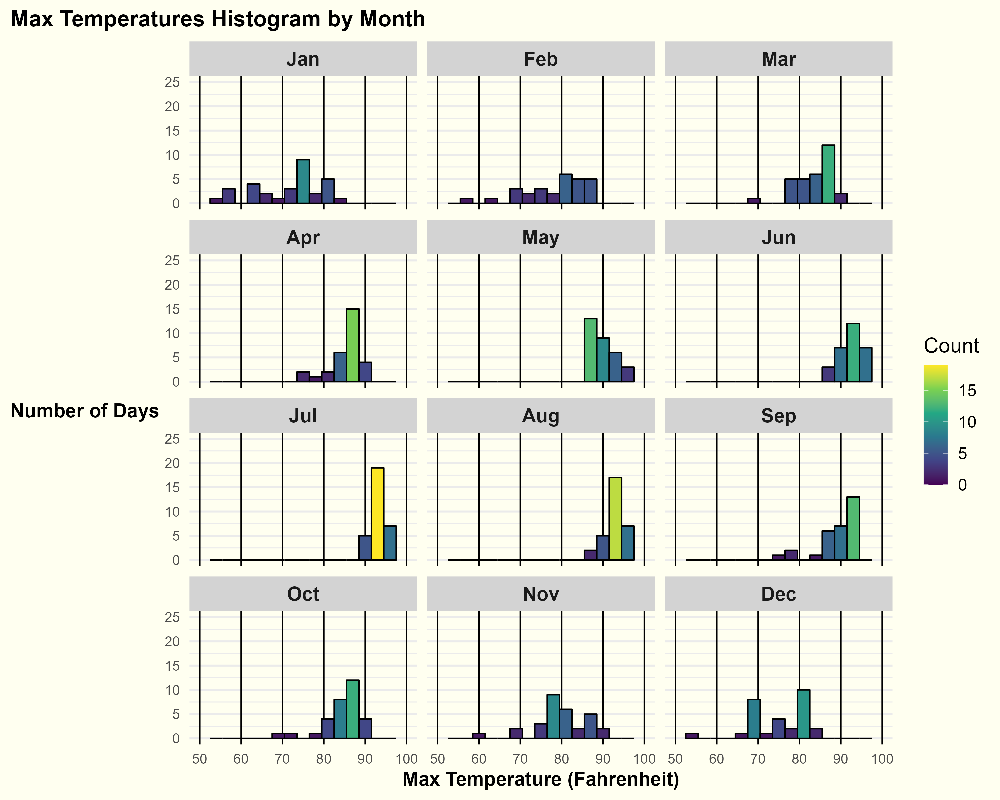
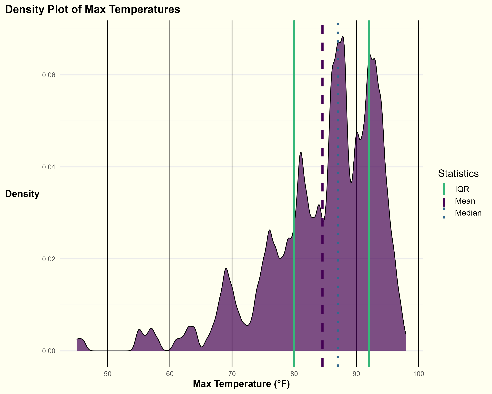
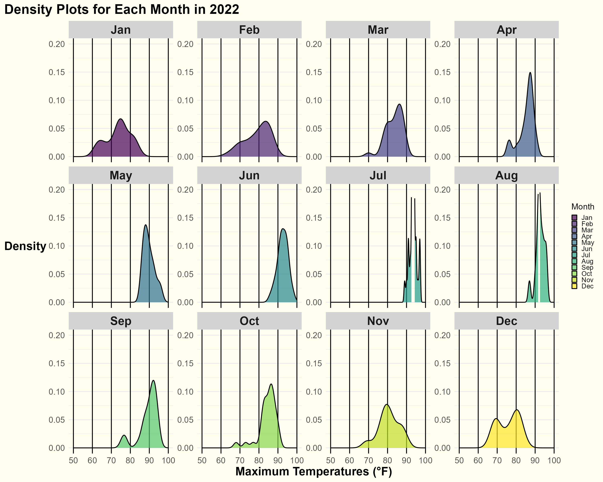
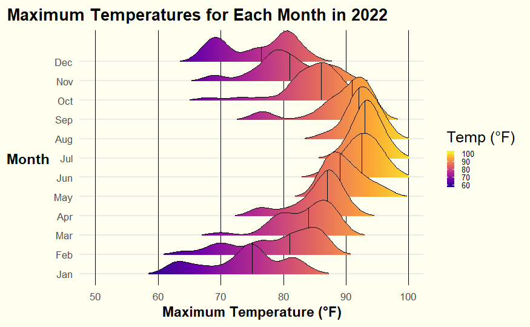
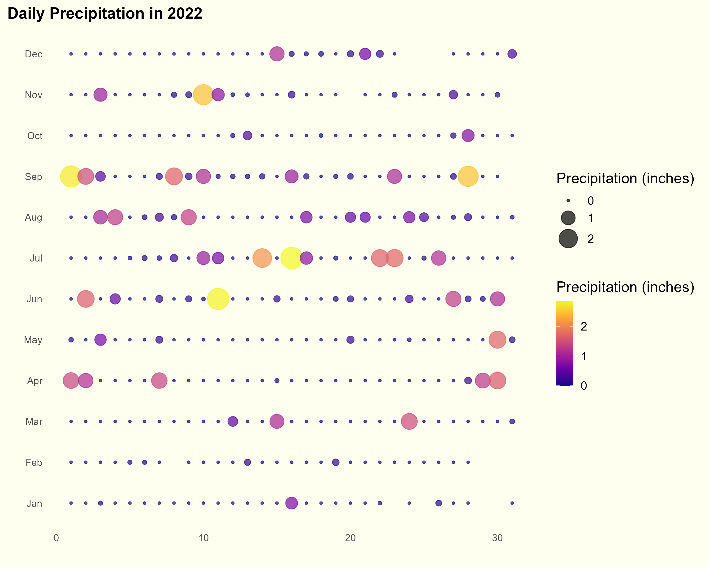
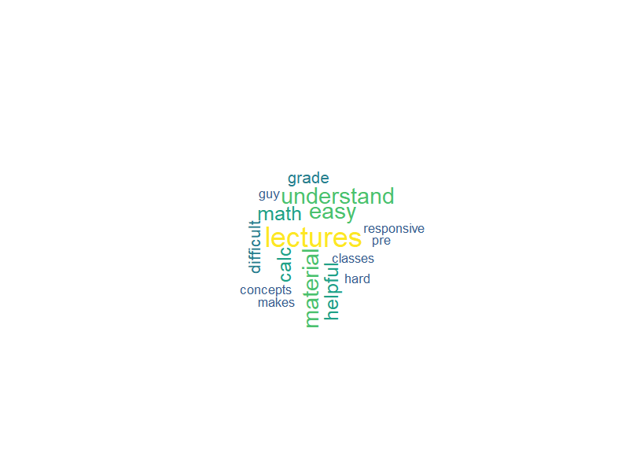
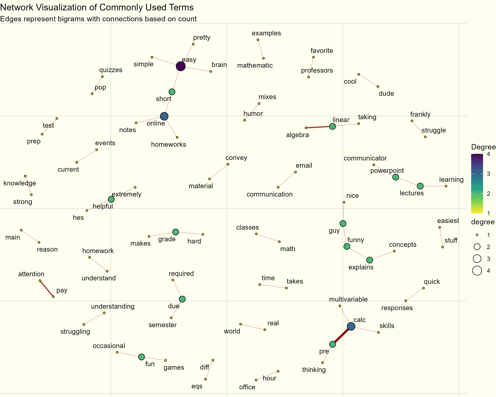
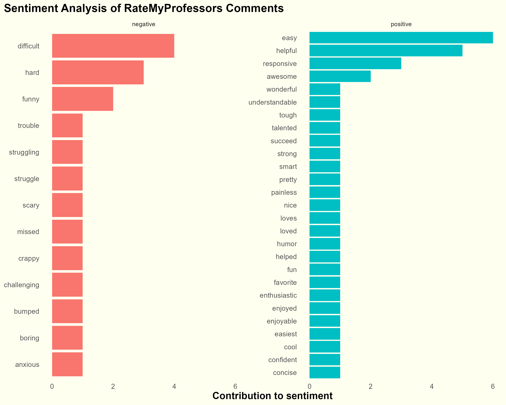
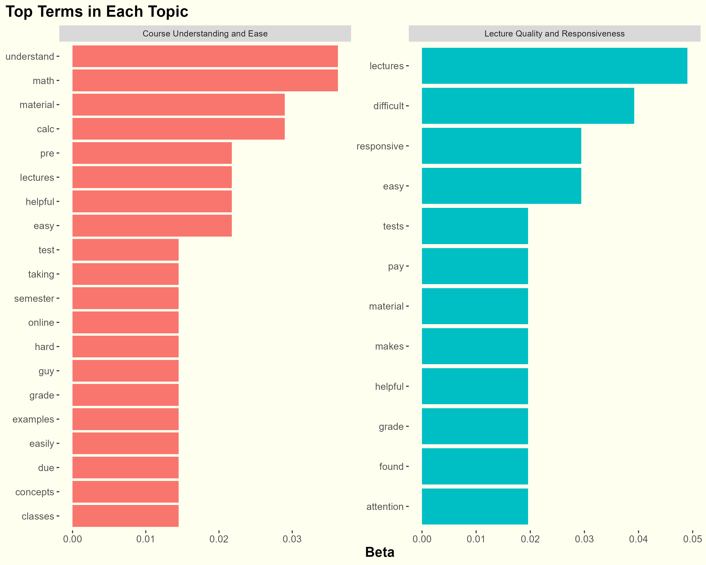

# Data Visualization for Exploratory Data Analysis

Weather (TPA 2022) and text (RateMyProfessors) exploration with multiple visualization techniques in R.

## Contents
- `Zheng_project_03.Rmd` — source analysis (R Markdown)
- `Zheng_project_03.html` / `Zheng_project_03.md` — rendered outputs
- Figures referenced below live in `../figures/`

## Data
- Weather: `data/tpa_weather_2022.csv`
- Text: `data/rmp_wit_comments.csv`

## Requirements
R packages used:
`tidyverse`, `lubridate`, `ggridges`, `viridis`, `tidytext`, `topicmodels`, `wordcloud`, `igraph`, `ggraph`, `tm`, `ggrepel`, `RColorBrewer`, `rmarkdown`.

Install everything at once:

```
Rscript scripts/install_packages.R
```

## Run / Reproduce
Option A — Render all projects:

```
Rscript scripts/render_all.R
```

Option B — From R/RStudio, open and knit `project-03/Zheng_project_03.Rmd`.

## Visualizations

### Max Temperatures Histogram by Month


### Density Plot of Max Temperatures


### Density Plots for Each Month in 2022


### Maximum Temperatures for Each Month in 2022


### Daily Precipitation in 2022


### Word Cloud


### Network Visualization of Commonly Used Terms


### Sentiment Analysis of RateMyProfessors Comments


### Top Terms in Each Topic


## Acknowledgments
- Florida State University's Florida Climate Center for weather data.
- RateMyProfessors for comments data.
- RStudio and the R community for the tools and packages used.

