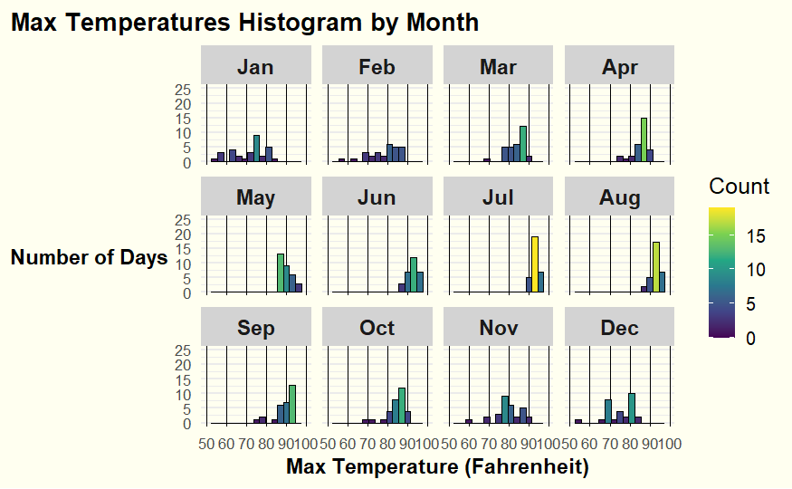
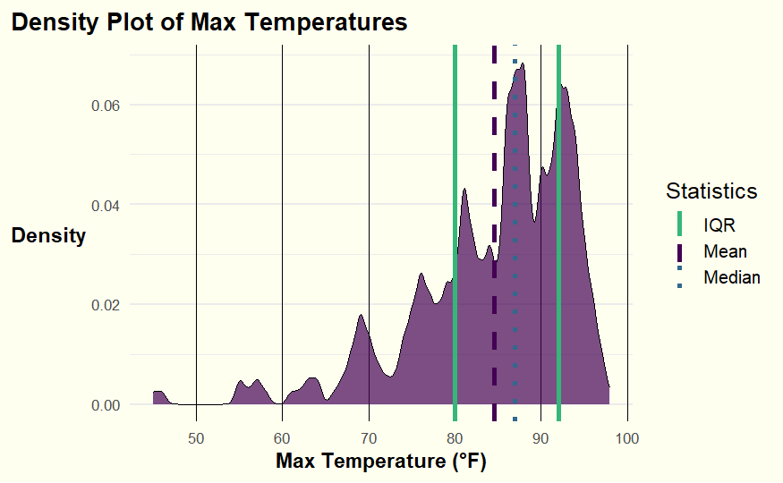
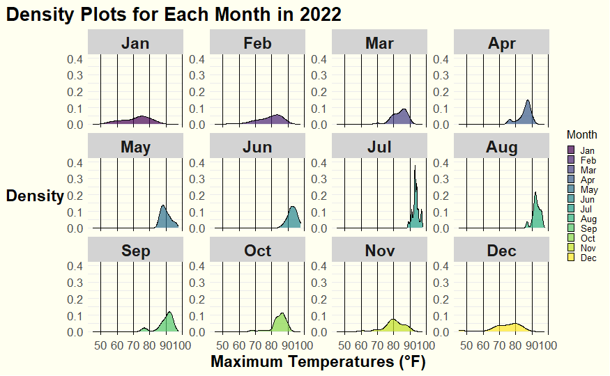
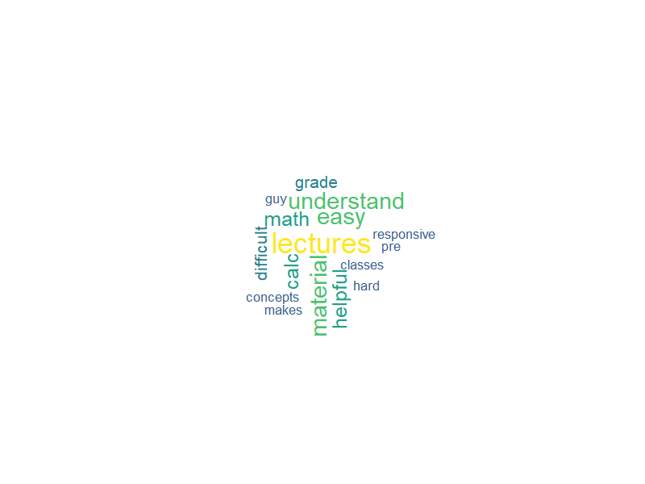

<<<<<<< HEAD
# Data Visualization for Exploratory Data Analysis

**Author: Zhi Zheng**

This repository contains a project focused on creating various data visualizations for exploratory data analysis using weather data from Tampa International Airport (TPA) for 2022 and RateMyProfessors comments.

## Project Overview

### Part 1: Density Plots
Visualizations using TPA weather data:
1. **Max Temperatures Histogram by Month**
2. **Density Plot of Max Temperatures**
3. **Density Plots for Each Month in 2022**
4. **Maximum Temperatures for Each Month in 2022**
5. **Daily Precipitation in 2022**

### Part 2: Visualizing Text Data
Visualizations using RateMyProfessors comments:
1. **Word Cloud**
2. **Bigram Analysis and Network Visualization**
3. **Sentiment Analysis**
4. **Topic Modeling**

## Getting Started

### Prerequisites
Install the following R packages:
- tidyverse
- lubridate
- ggridges
- viridis
- tidytext
- topicmodels
- wordcloud
- igraph
- ggraph
- tm
- ggrepel

### Installation
1. **Clone the repository:**
   git clone https://github.com/your-username/data-visualization-project-03.git
   
2. **Navigate to the project directory:**
   cd data-visualization-project-03

3. **Install the required R packages:**
   install.packages(c("tidyverse", "lubridate", "ggridges", "viridis", "tidytext", "topicmodels", "wordcloud", "igraph", "ggraph", "tm", "ggrepel"))

## Usage
Open `Zheng_project_03.Rmd` in RStudio and run the code chunks to generate the visualizations. Ensure the datasets (`tpa_weather_2022.csv` and `rmp_wit_comments.csv`) are in the `data/` folder.

## Visualizations

### Max Temperatures Histogram by Month

### Density Plot of Max Temperatures

### Density Plots for Each Month in 2022

### Maximum Temperatures for Each Month in 2022

### Daily Precipitation in 2022

### Word Cloud

### Network Visualization of Commonly Used Terms

### Sentiment Analysis of RateMyProfessors Comments

### Top Terms in Each Topic

## Contributing
Feel free to fork the repository and create a pull request with your proposed changes.

## License
This project is licensed under the MIT License - see the [LICENSE](LICENSE.md) file for details.

## Acknowledgments
- Florida State University's Florida Climate Center for weather data.
- RateMyProfessors for comments data.
- RStudio and the R community for the tools and packages used.

=======
# Data Visualization for Exploratory Data Analysis

**Author: Zhi Zheng**

This repository contains a project focused on creating various data visualizations for exploratory data analysis using weather data from Tampa International Airport (TPA) for 2022 and RateMyProfessors comments.

## Project Overview

### Part 1: Density Plots
Visualizations using TPA weather data:
1. **Max Temperatures Histogram by Month**
2. **Density Plot of Max Temperatures**
3. **Density Plots for Each Month in 2022**
4. **Maximum Temperatures for Each Month in 2022**
5. **Daily Precipitation in 2022**

### Part 2: Visualizing Text Data
Visualizations using RateMyProfessors comments:
1. **Word Cloud**
2. **Bigram Analysis and Network Visualization**
3. **Sentiment Analysis**
4. **Topic Modeling**

## Getting Started

### Prerequisites
Install the following R packages:
- tidyverse
- lubridate
- ggridges
- viridis
- tidytext
- topicmodels
- wordcloud
- igraph
- ggraph
- tm
- ggrepel

### Installation
1. **Clone the repository:**
   git clone https://github.com/your-username/data-visualization-project-03.git
   
2. **Navigate to the project directory:**
   cd data-visualization-project-03

3. **Install the required R packages:**
   install.packages(c("tidyverse", "lubridate", "ggridges", "viridis", "tidytext", "topicmodels", "wordcloud", "igraph", "ggraph", "tm", "ggrepel"))

## Usage
Open `Zheng_project_03.Rmd` in RStudio and run the code chunks to generate the visualizations. Ensure the datasets (`tpa_weather_2022.csv` and `rmp_wit_comments.csv`) are in the `data/` folder.

## Visualizations

### Max Temperatures Histogram by Month

### Density Plot of Max Temperatures

### Density Plots for Each Month in 2022

### Maximum Temperatures for Each Month in 2022

### Daily Precipitation in 2022

### Word Cloud

### Network Visualization of Commonly Used Terms

### Sentiment Analysis of RateMyProfessors Comments

### Top Terms in Each Topic

## Contributing
Feel free to fork the repository and create a pull request with your proposed changes.

## License
This project is licensed under the MIT License - see the [LICENSE](LICENSE.md) file for details.

## Acknowledgments
- Florida State University's Florida Climate Center for weather data.
- RateMyProfessors for comments data.
- RStudio and the R community for the tools and packages used.

>>>>>>> 5d4ec357d1be224df900a88935ab88c1f428b64d
