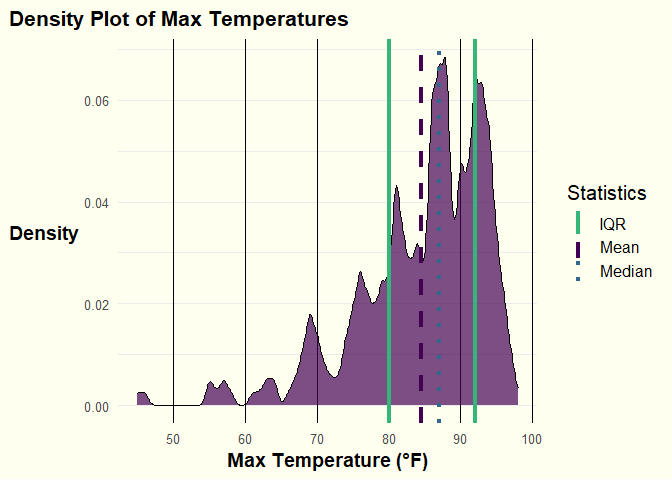
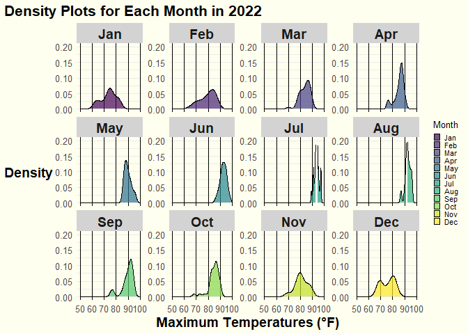
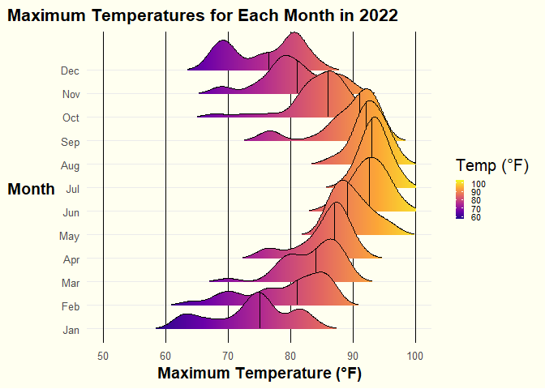
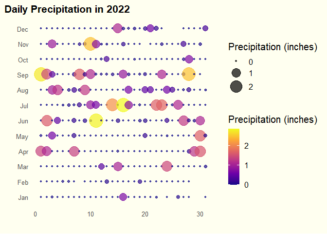
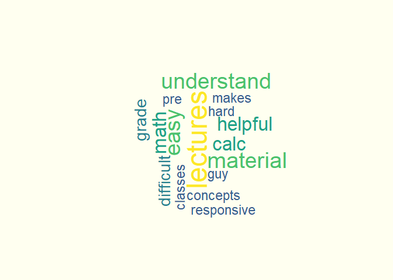
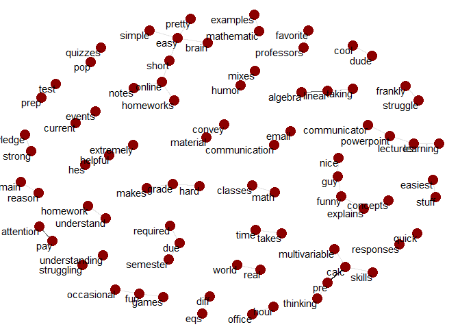
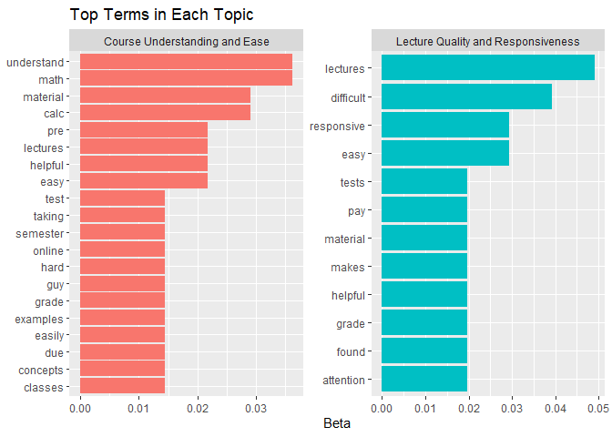

# Data Visualization Project 03

In this exercise you will explore methods to create different types of data visualizations (such as plotting text data, or exploring the distributions of continuous variables).

## PART 1: Density Plots

Using the dataset obtained from FSU's [Florida Climate Center](https://climatecenter.fsu.edu/climate-data-access-tools/downloadable-data), for a station at Tampa International Airport (TPA) for 2022, attempt to recreate the charts shown below which were generated using data from 2016. You can read the 2022 dataset using the code below:


```r
# Load necessary libraries
library(tidyverse)
library(lubridate)
library(ggridges)
library(viridis)
library(tidytext)
library(topicmodels)
library(wordcloud)
library(igraph)
library(ggraph)
library(tm)
```


```r
# Read the dataset
weather_tpa <- read_csv("../data/tpa_weather_2022.csv")
```

```
## Rows: 365 Columns: 7
## ── Column specification ────────────────────────────────────────────────────────
## Delimiter: ","
## dbl (7): year, month, day, precipitation, max_temp, min_temp, ave_temp
## 
## ℹ Use `spec()` to retrieve the full column specification for this data.
## ℹ Specify the column types or set `show_col_types = FALSE` to quiet this message.
```

```r
# Display the structure and a sample of the data
weather_tpa
```

```
## # A tibble: 365 × 7
##     year month   day precipitation max_temp min_temp ave_temp
##    <dbl> <dbl> <dbl>         <dbl>    <dbl>    <dbl>    <dbl>
##  1  2022     1     1       0             82       67     74.5
##  2  2022     1     2       0             82       71     76.5
##  3  2022     1     3       0.02          75       55     65  
##  4  2022     1     4       0             76       50     63  
##  5  2022     1     5       0             75       59     67  
##  6  2022     1     6       0.00001       74       56     65  
##  7  2022     1     7       0.00001       81       63     72  
##  8  2022     1     8       0             81       58     69.5
##  9  2022     1     9       0             84       65     74.5
## 10  2022     1    10       0             81       64     72.5
## # ℹ 355 more rows
```

See <https://www.reisanar.com/slides/relationships-models#10> for a reminder on how to use this type of dataset with the `lubridate` package for dates and times (example included in the slides uses data from 2016).

Using the 2022 data:

(a) Create a plot like the one below:


```r
# Combine year, month, and day into a single date column using lubridate
weather_tpa <- weather_tpa %>%
  mutate(date = make_date(year, month, day))

# Check the structure and summary again to confirm the conversion
str(weather_tpa)
```

```
## tibble [365 × 8] (S3: tbl_df/tbl/data.frame)
##  $ year         : num [1:365] 2022 2022 2022 2022 2022 ...
##  $ month        : num [1:365] 1 1 1 1 1 1 1 1 1 1 ...
##  $ day          : num [1:365] 1 2 3 4 5 6 7 8 9 10 ...
##  $ precipitation: num [1:365] 0e+00 0e+00 2e-02 0e+00 0e+00 1e-05 1e-05 0e+00 0e+00 0e+00 ...
##  $ max_temp     : num [1:365] 82 82 75 76 75 74 81 81 84 81 ...
##  $ min_temp     : num [1:365] 67 71 55 50 59 56 63 58 65 64 ...
##  $ ave_temp     : num [1:365] 74.5 76.5 65 63 67 65 72 69.5 74.5 72.5 ...
##  $ date         : Date[1:365], format: "2022-01-01" "2022-01-02" ...
```

```r
summary(weather_tpa)
```

```
##       year          month             day        precipitation   
##  Min.   :2022   Min.   : 1.000   Min.   : 1.00   Min.   :0.0000  
##  1st Qu.:2022   1st Qu.: 4.000   1st Qu.: 8.00   1st Qu.:0.0000  
##  Median :2022   Median : 7.000   Median :16.00   Median :0.0000  
##  Mean   :2022   Mean   : 6.526   Mean   :15.72   Mean   :0.1697  
##  3rd Qu.:2022   3rd Qu.:10.000   3rd Qu.:23.00   3rd Qu.:0.0300  
##  Max.   :2022   Max.   :12.000   Max.   :31.00   Max.   :2.8600  
##     max_temp        min_temp        ave_temp          date           
##  Min.   :45.00   Min.   :31.00   Min.   :38.00   Min.   :2022-01-01  
##  1st Qu.:80.00   1st Qu.:63.00   1st Qu.:71.00   1st Qu.:2022-04-02  
##  Median :87.00   Median :70.00   Median :78.00   Median :2022-07-02  
##  Mean   :84.54   Mean   :68.21   Mean   :76.37   Mean   :2022-07-02  
##  3rd Qu.:92.00   3rd Qu.:77.00   3rd Qu.:84.00   3rd Qu.:2022-10-01  
##  Max.   :98.00   Max.   :83.00   Max.   :89.50   Max.   :2022-12-31
```

```r
# Random sample to inspect the data
sample_n(weather_tpa, 100)
```

```
## # A tibble: 100 × 8
##     year month   day precipitation max_temp min_temp ave_temp date      
##    <dbl> <dbl> <dbl>         <dbl>    <dbl>    <dbl>    <dbl> <date>    
##  1  2022     8     5       0.00001       96       78     87   2022-08-05
##  2  2022     7     7       0.03          93       81     87   2022-07-07
##  3  2022     4    21       0             87       67     77   2022-04-21
##  4  2022    11    16       0.14          79       62     70.5 2022-11-16
##  5  2022     3    27       0             81       63     72   2022-03-27
##  6  2022     1    27       0             74       59     66.5 2022-01-27
##  7  2022     9    22       0             94       77     85.5 2022-09-22
##  8  2022     1    12       0             77       54     65.5 2022-01-12
##  9  2022    10    11       0.00001       89       74     81.5 2022-10-11
## 10  2022     2     1       0             76       49     62.5 2022-02-01
## # ℹ 90 more rows
```

```r
# Create a named vector to map month numbers to abbreviated month names
month_names <- c('Jan', 'Feb', 'Mar', 'Apr', 'May', 'Jun',
                 'Jul', 'Aug', 'Sep', 'Oct', 'Nov', 'Dec')

# Convert Month column to a factor with abbreviated month names as labels
weather_tpa$month <- factor(weather_tpa$month, levels = 1:12, labels = month_names)
```


```r
# Create a histogram of maximum temperature distribution by month with a color-blind friendly palette
hist_plot <- weather_tpa %>%
  ggplot(aes(x = max_temp, fill = ..count..)) + # Fill based on the count
  geom_histogram(binwidth = 3, color = "black", na.rm = TRUE) +
  scale_fill_viridis_c(option = "D", name = "Count") + # Ensuring continuous scale for count
  facet_wrap(~ month, scales = "fixed", ncol = 3) +
  theme_minimal(base_size = 15) +
  theme(
    strip.background = element_rect(fill = "lightgray", color = NA),
    strip.text = element_text(size = 14, face = "bold"),
    plot.title.position = "plot",
    plot.title = element_text(hjust = 0, size = 16, face = "bold"),
    plot.subtitle = element_text(hjust = 0, size = 12),
    plot.caption = element_text(hjust = 1, size = 10, face = "italic"),
    axis.title.x = element_text(size = 14, face = "bold"),
    axis.title.y = element_text(size = 14, face = "bold", angle = 0, vjust = 0.5),
    axis.text.x = element_text(size = 10),
    axis.text.y = element_text(size = 10),
    legend.position = "right",
    panel.background = element_rect(fill = "ivory", color = NA),
    plot.background = element_rect(fill = "ivory", color = NA),
    panel.grid.major.x = element_line(color = "black", linewidth = 0.5),
    panel.grid.minor.x = element_blank()
  ) +
  labs(
    title = "Max Temperatures Histogram by Month",
    x = "Max Temperature (Fahrenheit)",
    y = "Number of Days"
  ) +
  scale_x_continuous(limits = c(50, 100)) +
  scale_y_continuous(limits = c(0, 25))

# Print histogram plot
print(hist_plot)
```

```
## Warning: The dot-dot notation (`..count..`) was deprecated in ggplot2 3.4.0.
## ℹ Please use `after_stat(count)` instead.
## This warning is displayed once every 8 hours.
## Call `lifecycle::last_lifecycle_warnings()` to see where this warning was
## generated.
```

<!-- -->

Hint: the option `binwidth = 3` was used with the `geom_histogram()` function.

(b) Create a plot like the one below:


```r
# Calculate statistics
mean_temp <- mean(weather_tpa$max_temp, na.rm = TRUE)
median_temp <- median(weather_tpa$max_temp, na.rm = TRUE)
iqr_temp <- IQR(weather_tpa$max_temp, na.rm = TRUE)
lower_iqr <- quantile(weather_tpa$max_temp, 0.25, na.rm = TRUE)
upper_iqr <- quantile(weather_tpa$max_temp, 0.75, na.rm = TRUE)
```


```r
# Enhanced density plot for max_temp with color-blind friendly palette and statistics
density_plot <- weather_tpa %>%
  ggplot(aes(x = max_temp)) +
  geom_density(kernel = "gaussian", bw = 0.5, fill = viridis(1), alpha = 0.7) +
  geom_vline(aes(xintercept = mean_temp, color = "Mean"), linetype = "dashed", size = 1.5) +
  geom_vline(aes(xintercept = median_temp, color = "Median"), linetype = "dotted", size = 1.5) +
  geom_vline(aes(xintercept = lower_iqr, color = "IQR"), linetype = "solid", size = 1.5) +
  geom_vline(aes(xintercept = upper_iqr, color = "IQR"), linetype = "solid", size = 1.5) +
  scale_color_manual(values = c("Mean" = viridis::viridis(4)[1], "Median" = viridis::viridis(4)[2], "IQR" = viridis::viridis(4)[3])) + # Use viridis colors
  theme_minimal(base_size = 15) +
  theme(
    plot.title.position = "plot",
    plot.title = element_text(hjust = 0, size = 16, face = "bold"),
    plot.subtitle = element_text(hjust = 0, size = 12),
    plot.caption = element_text(hjust = 1, size = 10, face = "italic"),
    axis.title.x = element_text(size = 14, face = "bold"),
    axis.title.y = element_text(size = 14, face = "bold", angle = 0, vjust = 0.5),
    axis.text.x = element_text(size = 10),
    axis.text.y = element_text(size = 10),
    legend.position = "right",
    panel.background = element_rect(fill = "ivory", color = NA),
    plot.background = element_rect(fill = "ivory", color = NA),
    panel.grid.major.x = element_line(color = "black", linewidth = 0.5),
    panel.grid.minor.x = element_blank()
  ) +
  labs(
    title = "Density Plot of Max Temperatures",
    x = "Max Temperature (°F)",
    y = "Density",
    color = "Statistics"
  )
```

```
## Warning: Using `size` aesthetic for lines was deprecated in ggplot2 3.4.0.
## ℹ Please use `linewidth` instead.
## This warning is displayed once every 8 hours.
## Call `lifecycle::last_lifecycle_warnings()` to see where this warning was
## generated.
```

```r
# Print density plot
density_plot
```

<!-- -->


Hint: check the `kernel` parameter of the `geom_density()` function, and use `bw = 0.5`.

(c) Create a plot like the one below:


```r
# Function to remove outliers based on the IQR method
remove_outliers <- function(data, column) {
  Q1 <- quantile(data[[column]], 0.25)
  Q3 <- quantile(data[[column]], 0.75)
  IQR <- Q3 - Q1
  lower_bound <- Q1 - 1.5 * IQR
  upper_bound <- Q3 + 1.5 * IQR
  data %>% filter(data[[column]] >= lower_bound & data[[column]] <= upper_bound)
}

# Remove outliers from the max_temp column
weather_tpa <- remove_outliers(weather_tpa, "max_temp")
```


```r
# Create the density plot with faceting
density_facet_plot <- weather_tpa %>%
  ggplot(aes(x = max_temp, fill = month)) + # Use month for fill
  geom_density(alpha = 0.7, color = "black") +
  facet_wrap(~ month, scales = "free_y", ncol = 4) +
  scale_fill_viridis_d(name = "Month") + # Use discrete scale for month
  theme_minimal(base_size = 10) +
  theme(
    strip.background = element_rect(fill = "lightgray", color = NA),
    strip.text = element_text(size = 14, face = "bold"),
    plot.title.position = "plot",
    plot.title = element_text(hjust = 0, size = 16, face = "bold"),
    plot.subtitle = element_text(hjust = 0.5, size = 12),
    plot.caption = element_text(hjust = 1, size = 10, face = "italic"),
    axis.title.x = element_text(size = 14, face = "bold"),
    axis.title.y = element_text(size = 14, face = "bold", angle = 0, vjust = 0.5),
    axis.text.x = element_text(size = 10),
    axis.text.y = element_text(size = 10),
    legend.key.size = unit(0.5, "lines"), # Adjust the size of the legend keys
    legend.text = element_text(size = 8), # Adjust the size of the legend text
    legend.spacing.x = unit(0.2, 'cm'), # Adjust spacing between legend items
    panel.background = element_rect(fill = "ivory", color = NA),
    plot.background = element_rect(fill = "ivory", color = NA),
    panel.grid.major.x = element_line(color = "black", linewidth = 0.5),
    panel.grid.minor.x = element_blank()
  ) +
  labs(
    title = "Density Plots for Each Month in 2022",
    x = "Maximum Temperatures (°F)",
    y = "Density"
  ) +
  scale_x_continuous(limits = c(50, 100)) +
  scale_y_continuous(limits = c(0, .2))

# Print the plot
density_facet_plot
```

<!-- -->


Hint: default options for `geom_density()` were used.

(d) Generate a plot like the chart below:


```r
# Create the density ridges plot
ridges_plot <- weather_tpa %>%
  ggplot(aes(x = max_temp, y = month, fill = ..x..)) +
  geom_density_ridges_gradient(scale = 3, rel_min_height = 0.01, quantile_lines = TRUE, quantiles = 2) +
  scale_fill_viridis_c(option = "plasma", name = "Temp (°F)") +
  theme_minimal(base_size = 15) +
  theme(
    plot.title.position = "plot",
    plot.title = element_text(hjust = 0, size = 16, face = "bold"),
    plot.subtitle = element_text(hjust = 0.5, size = 12),
    plot.caption = element_text(hjust = 1, size = 10, face = "italic"),
    axis.title.x = element_text(size = 14, face = "bold"),
    axis.title.y = element_text(size = 14, face = "bold", angle = 0, vjust = 0.5),
    axis.text.x = element_text(size = 10),
    axis.text.y = element_text(size = 10),
    legend.position = "right"
  ) +
  labs(
    title = "Maximum Temperatures for Each Month in 2022",
    x = "Maximum Temperature (°F)",
    y = "Month"
  ) +
  scale_x_continuous(limits = c(50, 100))

# Print the plot
ridges_plot
```

```
## Picking joint bandwidth of 1.71
```

<!-- -->


Hint: use the`{ggridges}` package, and the `geom_density_ridges()` function paying close attention to the `quantile_lines` and `quantiles` parameters. The plot above uses the `plasma` option (color scale) for the *viridis* palette.

(e) Create a plot of your choice that uses the attribute for precipitation *(values of -99.9 for temperature or -99.99 for precipitation represent missing data)*.


```r
# Filter out missing precipitation data
weather_tpa <- weather_tpa %>%
  filter(precipitation != -99.99)

# Extract day from the date
weather_tpa$day <- day(weather_tpa$date)
```


```r
# Create the plot with points for precipitation
precipitation_point_plot <- weather_tpa %>%
  ggplot(aes(x = day, y = month, size = precipitation, color = precipitation)) +
  geom_point(alpha = 0.7) +
  scale_color_viridis_c(option = "plasma", name = "Precipitation (inches)") +
  scale_size_continuous(range = c(1, 10), name = "Precipitation (inches)") +
  theme_minimal(base_size = 15) +
  theme(
    axis.title.x = element_text(size = 14, face = "bold"),
    axis.title.y = element_text(size = 14, face = "bold"),
    axis.text.x = element_text(size = 10),
    axis.text.y = element_text(size = 10),
    legend.position = "right",
    plot.title.position = "plot",
    plot.title = element_text(hjust = 0, size = 16, face = "bold"),
    plot.background = element_rect(fill = "ivory", color = NA),
    panel.grid.major = element_blank(),
    panel.grid.minor = element_blank(),
    panel.background = element_rect(fill = "ivory", color = NA)
  ) +
  labs(
    title = "Daily Precipitation in 2022",
    x = "",
    y = ""
  )

# Print the plot
print(precipitation_point_plot)
```

<!-- -->


## PART 2

> **You can choose to work on either Option (A) or Option (B)**. Remove from this template the option you decided not to work on.

### Option (A): Visualizing Text Data

Review the set of slides (and additional resources linked in it) for visualizing text data: <https://www.reisanar.com/slides/text-viz#1>

Choose any dataset with text data, and create at least one visualization with it. For example, you can create a frequency count of most used bigrams, a sentiment analysis of the text data, a network visualization of terms commonly used together, and/or a visualization of a topic modeling approach to the problem of identifying words/documents associated to different topics in the text data you decide to use.

Make sure to include a copy of the dataset in the `data/` folder, and reference your sources if different from the ones listed below:

-   [Billboard Top 100 Lyrics](https://github.com/reisanar/datasets/blob/master/BB_top100_2015.csv)

-   [RateMyProfessors comments](https://github.com/reisanar/datasets/blob/master/rmp_wit_comments.csv)

-   [FL Poly News Articles](https://github.com/reisanar/datasets/blob/master/flpoly_news_SP23.csv)

(to get the "raw" data from any of the links listed above, simply click on the `raw` button of the GitHub page and copy the URL to be able to read it in your computer using the `read_csv()` function)


```r
# # Download the dataset
# url <- "https://raw.githubusercontent.com/reisanar/datasets/master/rmp_wit_comments.csv"
# download.file(url, destfile = "../data/rmp_wit_comments.csv")
```

```r
# Read the dataset from the data folder
comments <- read_csv("../data/rmp_wit_comments.csv")
```

```
## Rows: 18 Columns: 2
## ── Column specification ────────────────────────────────────────────────────────
## Delimiter: ","
## chr (2): course, comments
## 
## ℹ Use `spec()` to retrieve the full column specification for this data.
## ℹ Specify the column types or set `show_col_types = FALSE` to quiet this message.
```

```r
# Inspect the dataset
glimpse(comments)
```

```
## Rows: 18
## Columns: 2
## $ course   <chr> "MATH1900", "MATH250", "MATH2860", "MATH2860", "MATH2025", "M…
## $ comments <chr> "He is very enthusiastic to help students. His course content…
```

```r
# Unnest tokens (words)
tidy_comments <- comments %>%
  unnest_tokens(word, comments) %>%
  anti_join(stop_words) %>%
  filter(!str_detect(word, "\\d+")) %>%  # Remove numbers
  filter(!word %in% c("professor", "class", "course", "teacher", "students", "lecture", "content", "organized"))  # Remove common non-informative words
```

```
## Joining with `by = join_by(word)`
```

```r
# Inspect the tidy text data
glimpse(tidy_comments)
```

```
## Rows: 240
## Columns: 2
## $ course <chr> "MATH1900", "MATH1900", "MATH1900", "MATH1900", "MATH1900", "MA…
## $ word   <chr> "enthusiastic", "concise", "enjoyed", "time", "grade", "materia…
```


```r
# Create a word cloud
tidy_comments %>%
  count(word, sort = TRUE) %>%
  with(wordcloud(word, n, max.words = 100, colors = brewer.pal(8, "Dark2")))
```

<!-- -->


```r
# Unnest bigrams
bigrams <- comments %>%
  unnest_tokens(bigram, comments, token = "ngrams", n = 2) %>%
  separate(bigram, into = c("word1", "word2"), sep = " ") %>%
  filter(!word1 %in% stop_words$word,
         !word2 %in% stop_words$word) %>%
  filter(!word1 %in% c("professor", "class", "course", "teacher", "students", "lecture", "content", "organized"),
         !word2 %in% c("professor", "class", "course", "teacher", "students", "lecture", "content", "organized")) %>%
  unite(bigram, word1, word2, sep = " ")

# Count bigrams
bigram_counts <- bigrams %>%
  count(bigram, sort = TRUE)

# Inspect bigram counts
glimpse(bigram_counts)
```

```
## Rows: 50
## Columns: 2
## $ bigram <chr> "pre calc", "linear algebra", "pay attention", "brain easy", "c…
## $ n      <int> 3, 2, 2, 1, 1, 1, 1, 1, 1, 1, 1, 1, 1, 1, 1, 1, 1, 1, 1, 1, 1, …
```


```r
# Separate bigram back into two words for graph
bigram_counts_separated <- bigram_counts %>%
  separate(bigram, into = c("word1", "word2"), sep = " ")

# Create the graph object
bigram_graph <- bigram_counts_separated %>%
  filter(n > 0) %>%  # Reduce the threshold to include more bigrams
  graph_from_data_frame()

# Create the network plot
set.seed(123)
ggraph(bigram_graph, layout = "fr") +
  geom_edge_link(aes(edge_alpha = n), show.legend = FALSE) +
  geom_node_point(color = "darkred", size = 5) +
  geom_node_text(aes(label = name), vjust = 1, hjust = 1) +
  theme_void()
```

<!-- -->


```r
# Perform sentiment analysis
sentiments <- tidy_comments %>%
  inner_join(get_sentiments("bing")) %>%
  count(word, sentiment, sort = TRUE) %>%
  ungroup()
```

```
## Joining with `by = join_by(word)`
```

```r
# Visualize sentiment
sentiments %>%
  group_by(sentiment) %>%
  top_n(10) %>%
  ungroup() %>%
  mutate(word = reorder(word, n)) %>%
  ggplot(aes(word, n, fill = sentiment)) +
  geom_col(show.legend = FALSE) +
  facet_wrap(~sentiment, scales = "free_y") +
  labs(title = "Sentiment Analysis of RateMyProfessors Comments",
       y = "Contribution to sentiment",
       x = NULL) +
  coord_flip() +
  theme_minimal()
```

```
## Selecting by n
```

<!-- -->


```r
# Create a document-term matrix
dtm <- tidy_comments %>%
  count(course, word) %>%
  cast_dtm(course, word, n)

# Inspect the document-term matrix
inspect(dtm)
```

```
## <<DocumentTermMatrix (documents: 7, terms: 167)>>
## Non-/sparse entries: 214/955
## Sparsity           : 82%
## Maximal term length: 14
## Weighting          : term frequency (tf)
## Sample             :
##           Terms
## Docs       calc difficult easy grade helpful lectures material math responsive
##   MATH1900    0         0    0     1       1        0        0    0          1
##   MATH2025    1         2    0     0       1        1        2    0          2
##   MATH250     3         0    1     0       1        0        0    1          0
##   MATH2860    0         2    2     1       0        3        0    0          0
##   MATH310     0         0    1     0       0        1        0    0          0
##   MATH430     0         0    1     1       0        1        2    4          0
##   MATH890     1         0    1     1       2        2        2    0          0
##           Terms
## Docs       understand
##   MATH1900          0
##   MATH2025          0
##   MATH250           1
##   MATH2860          1
##   MATH310           0
##   MATH430           3
##   MATH890           1
```


```r
# Fit a Latent Dirichlet Allocation (LDA) model with 2 topics
lda_model <- LDA(dtm, k = 2, control = list(seed = 1234))

# Get the topics
topics <- tidy(lda_model, matrix = "beta")

# Inspect the topics
glimpse(topics)
```

```
## Rows: 334
## Columns: 3
## $ topic <int> 1, 2, 1, 2, 1, 2, 1, 2, 1, 2, 1, 2, 1, 2, 1, 2, 1, 2, 1, 2, 1, 2…
## $ term  <chr> "awesome", "awesome", "classroom", "classroom", "communication",…
## $ beta  <dbl> 7.246377e-03, 9.803922e-03, 5.148156e-96, 9.803922e-03, 1.134765…
```


```r
# Get the top terms for each topic
top_terms <- topics %>%
  group_by(topic) %>%
  top_n(10, beta) %>%
  ungroup() %>%
  arrange(topic, -beta)

# Visualize the top terms for each topic
top_terms %>%
  mutate(term = reorder_within(term, beta, topic)) %>%
  ggplot(aes(term, beta, fill = factor(topic))) +
  geom_col(show.legend = FALSE) +
  facet_wrap(~ topic, scales = "free",
             labeller = labeller(topic = c("1" = "Course Understanding and Ease", 
                                           "2" = "Lecture Quality and Responsiveness"))) +
  coord_flip() +
  scale_x_reordered() +
  labs(title = "Top Terms in Each Topic",
       x = NULL, y = "Beta")
```

<!-- -->

