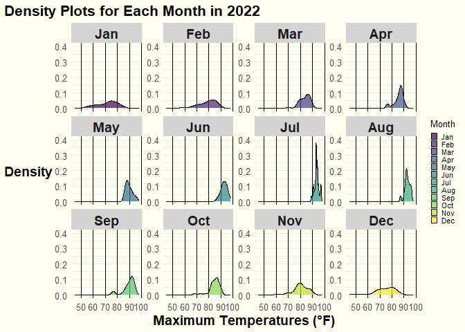
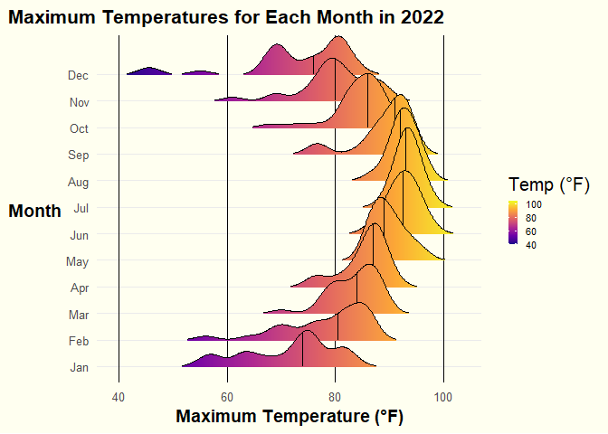

# Data Visualization Project 03

In this exercise you will explore methods to create different types of data visualizations (such as plotting text data, or exploring the distributions of continuous variables).

## PART 1: Density Plots

Using the dataset obtained from FSU's [Florida Climate Center](https://climatecenter.fsu.edu/climate-data-access-tools/downloadable-data), for a station at Tampa International Airport (TPA) for 2022, attempt to recreate the charts shown below which were generated using data from 2016. You can read the 2022 dataset using the code below:


```r
# Load necessary libraries
library(tidyverse)
library(lubridate)
library(ggridges)
library(viridis)
library(tidytext)
library(topicmodels)
library(wordcloud)
library(igraph)
library(ggraph)
library(tm)
library(ggrepel)
```


```r
# Read the dataset
weather_tpa <- read_csv("../data/tpa_weather_2022.csv")
```

```
## Rows: 365 Columns: 7
## ── Column specification ────────────────────────────────────────────────────────
## Delimiter: ","
## dbl (7): year, month, day, precipitation, max_temp, min_temp, ave_temp
## 
## ℹ Use `spec()` to retrieve the full column specification for this data.
## ℹ Specify the column types or set `show_col_types = FALSE` to quiet this message.
```

```r
# Display the structure and a sample of the data
weather_tpa
```

```
## # A tibble: 365 × 7
##     year month   day precipitation max_temp min_temp ave_temp
##    <dbl> <dbl> <dbl>         <dbl>    <dbl>    <dbl>    <dbl>
##  1  2022     1     1       0             82       67     74.5
##  2  2022     1     2       0             82       71     76.5
##  3  2022     1     3       0.02          75       55     65  
##  4  2022     1     4       0             76       50     63  
##  5  2022     1     5       0             75       59     67  
##  6  2022     1     6       0.00001       74       56     65  
##  7  2022     1     7       0.00001       81       63     72  
##  8  2022     1     8       0             81       58     69.5
##  9  2022     1     9       0             84       65     74.5
## 10  2022     1    10       0             81       64     72.5
## # ℹ 355 more rows
```

See <https://www.reisanar.com/slides/relationships-models#10> for a reminder on how to use this type of dataset with the `lubridate` package for dates and times (example included in the slides uses data from 2016).

Using the 2022 data:

(a) Create a plot like the one below:


```r
# Combine year, month, and day into a single date column using lubridate
weather_tpa <- weather_tpa %>%
  mutate(date = make_date(year, month, day))

# Check the structure and summary again to confirm the conversion
str(weather_tpa)
```

```
## tibble [365 × 8] (S3: tbl_df/tbl/data.frame)
##  $ year         : num [1:365] 2022 2022 2022 2022 2022 ...
##  $ month        : num [1:365] 1 1 1 1 1 1 1 1 1 1 ...
##  $ day          : num [1:365] 1 2 3 4 5 6 7 8 9 10 ...
##  $ precipitation: num [1:365] 0e+00 0e+00 2e-02 0e+00 0e+00 1e-05 1e-05 0e+00 0e+00 0e+00 ...
##  $ max_temp     : num [1:365] 82 82 75 76 75 74 81 81 84 81 ...
##  $ min_temp     : num [1:365] 67 71 55 50 59 56 63 58 65 64 ...
##  $ ave_temp     : num [1:365] 74.5 76.5 65 63 67 65 72 69.5 74.5 72.5 ...
##  $ date         : Date[1:365], format: "2022-01-01" "2022-01-02" ...
```

```r
summary(weather_tpa)
```

```
##       year          month             day        precipitation   
##  Min.   :2022   Min.   : 1.000   Min.   : 1.00   Min.   :0.0000  
##  1st Qu.:2022   1st Qu.: 4.000   1st Qu.: 8.00   1st Qu.:0.0000  
##  Median :2022   Median : 7.000   Median :16.00   Median :0.0000  
##  Mean   :2022   Mean   : 6.526   Mean   :15.72   Mean   :0.1697  
##  3rd Qu.:2022   3rd Qu.:10.000   3rd Qu.:23.00   3rd Qu.:0.0300  
##  Max.   :2022   Max.   :12.000   Max.   :31.00   Max.   :2.8600  
##     max_temp        min_temp        ave_temp          date           
##  Min.   :45.00   Min.   :31.00   Min.   :38.00   Min.   :2022-01-01  
##  1st Qu.:80.00   1st Qu.:63.00   1st Qu.:71.00   1st Qu.:2022-04-02  
##  Median :87.00   Median :70.00   Median :78.00   Median :2022-07-02  
##  Mean   :84.54   Mean   :68.21   Mean   :76.37   Mean   :2022-07-02  
##  3rd Qu.:92.00   3rd Qu.:77.00   3rd Qu.:84.00   3rd Qu.:2022-10-01  
##  Max.   :98.00   Max.   :83.00   Max.   :89.50   Max.   :2022-12-31
```

```r
# Inspect the data
head(weather_tpa, 100)
```

```
## # A tibble: 100 × 8
##     year month   day precipitation max_temp min_temp ave_temp date      
##    <dbl> <dbl> <dbl>         <dbl>    <dbl>    <dbl>    <dbl> <date>    
##  1  2022     1     1       0             82       67     74.5 2022-01-01
##  2  2022     1     2       0             82       71     76.5 2022-01-02
##  3  2022     1     3       0.02          75       55     65   2022-01-03
##  4  2022     1     4       0             76       50     63   2022-01-04
##  5  2022     1     5       0             75       59     67   2022-01-05
##  6  2022     1     6       0.00001       74       56     65   2022-01-06
##  7  2022     1     7       0.00001       81       63     72   2022-01-07
##  8  2022     1     8       0             81       58     69.5 2022-01-08
##  9  2022     1     9       0             84       65     74.5 2022-01-09
## 10  2022     1    10       0             81       64     72.5 2022-01-10
## # ℹ 90 more rows
```

```r
# Random sample to inspect the data
sample_n(weather_tpa, 100)
```

```
## # A tibble: 100 × 8
##     year month   day precipitation max_temp min_temp ave_temp date      
##    <dbl> <dbl> <dbl>         <dbl>    <dbl>    <dbl>    <dbl> <date>    
##  1  2022     7     9          0          92       81     86.5 2022-07-09
##  2  2022     1     8          0          81       58     69.5 2022-01-08
##  3  2022     1    26          0.08       63       54     58.5 2022-01-26
##  4  2022     7    31          0          97       81     89   2022-07-31
##  5  2022     3    20          0          84       65     74.5 2022-03-20
##  6  2022     5    24          0.01       94       79     86.5 2022-05-24
##  7  2022     7    20          0          93       83     88   2022-07-20
##  8  2022     3    27          0          81       63     72   2022-03-27
##  9  2022     4    26          0          87       72     79.5 2022-04-26
## 10  2022     4    10          0          77       56     66.5 2022-04-10
## # ℹ 90 more rows
```

```r
# Create a named vector to map month numbers to abbreviated month names
month_names <- c('Jan', 'Feb', 'Mar', 'Apr', 'May', 'Jun',
                 'Jul', 'Aug', 'Sep', 'Oct', 'Nov', 'Dec')

# Convert Month column to a factor with abbreviated month names as labels
weather_tpa$month <- factor(weather_tpa$month, levels = 1:12, labels = month_names)
```


```r
# Create a count for each day of the temperature
weather_tpa %>% 
  ggplot(mapping = aes(x = max_temp, fill = factor(month))) +
  geom_histogram(color = "white", binwidth = 3) + 
  facet_wrap(~factor(month), ncol = 4) +
  labs(
    x = "Maximum temperatures",
    y = "Number of Days"
  ) +
  scale_fill_viridis_d(name = "Temp. [F]", option = "D")+
  theme(
    legend.position = "none",
    axis.title.y = element_text(size = 15),
    axis.title.x = element_text(size = 15)
  )
```

<!-- -->


```r
# Create a histogram of maximum temperature distribution by month with a color-blind friendly palette
hist_plot <- weather_tpa %>%
  ggplot(aes(x = max_temp, fill = ..count..)) + # Fill based on the count
  geom_histogram(binwidth = 3, color = "black", na.rm = TRUE) +
  scale_fill_viridis_c(option = "D", name = "Count") + # Ensuring continuous scale for count
  facet_wrap(~ month, scales = "fixed", ncol = 4) +
  theme_minimal(base_size = 15) +
  theme(
    strip.background = element_rect(fill = "lightgray", color = NA),
    strip.text = element_text(size = 14, face = "bold"),
    plot.title.position = "plot",
    plot.title = element_text(hjust = 0, size = 16, face = "bold"),
    plot.subtitle = element_text(hjust = 0, size = 12),
    plot.caption = element_text(hjust = 1, size = 10, face = "italic"),
    axis.title.x = element_text(size = 14, face = "bold"),
    axis.title.y = element_text(size = 14, face = "bold", angle = 0, vjust = 0.5),
    axis.text.x = element_text(size = 10),
    axis.text.y = element_text(size = 10),
    legend.position = "right",
    panel.background = element_rect(fill = "ivory", color = NA),
    plot.background = element_rect(fill = "ivory", color = NA),
    panel.grid.major.x = element_line(color = "black", linewidth = 0.5),
    panel.grid.minor.x = element_blank()
  ) +
  labs(
    title = "Max Temperatures Histogram by Month",
    x = "Max Temperature (Fahrenheit)",
    y = "Number of Days"
  ) +
  scale_x_continuous(limits = c(50, 100)) +
  scale_y_continuous(limits = c(0, 25))

# Print histogram plot
print(hist_plot)
```

```
## Warning: The dot-dot notation (`..count..`) was deprecated in ggplot2 3.4.0.
## ℹ Please use `after_stat(count)` instead.
## This warning is displayed once every 8 hours.
## Call `lifecycle::last_lifecycle_warnings()` to see where this warning was
## generated.
```

<!-- -->

Hint: the option `binwidth = 3` was used with the `geom_histogram()` function.

### Analysis of Maximum Temperature Distribution by Month

The histogram faceted by month shows the distribution of maximum temperatures throughout the year. Each facet represents a month and the number of days within specific temperature ranges, revealing clear seasonal variations:

-   **Winter months (January, February, December)**: Lower temperatures, typically between 50 and 70°F, with narrow distributions.

-   **Spring months (March, April, May)**: Gradual temperature increase, ranging from 60 to 80°F, showing more variability.

-   **Summer months (June, July, August)**: Higher temperatures, predominantly between 80 and 100°F, with July having the most consistent high temperatures.

-   **Fall months (September, October, November)**: Declining temperatures, ranging from 70 to 90°F, with wider distributions in September and October.

The viridis color palette enhances visual distinction, making it easy to identify the frequency of temperature values. The plot effectively communicates seasonal trends and variability, meeting the assumptions of faceted histograms for clear month-to-month comparisons. This visualization provides valuable insights into how maximum temperatures vary throughout the year, highlighting seasonal climate patterns.

------------------------------------------------------------------------

(b) Create a plot like the one below:


```r
# Calculate statistics
mean_temp <- mean(weather_tpa$max_temp, na.rm = TRUE)
median_temp <- median(weather_tpa$max_temp, na.rm = TRUE)
iqr_temp <- IQR(weather_tpa$max_temp, na.rm = TRUE)
lower_iqr <- quantile(weather_tpa$max_temp, 0.25, na.rm = TRUE)
upper_iqr <- quantile(weather_tpa$max_temp, 0.75, na.rm = TRUE)
```


```r
ggplot(data = weather_tpa, mapping = aes(max_temp)) + 
  geom_density(kernel = "epanechnikov", bw = 0.5, fill = "gray50") 
```

<!-- -->


```r
# Enhanced density plot for max_temp with color-blind friendly palette and statistics
density_plot <- weather_tpa %>%
  ggplot(aes(x = max_temp)) +
  geom_density(kernel = "gaussian", bw = 0.5, fill = viridis(1), alpha = 0.7) +
  geom_vline(aes(xintercept = mean_temp, color = "Mean"), linetype = "dashed", size = 1.5) +
  geom_vline(aes(xintercept = median_temp, color = "Median"), linetype = "dotted", size = 1.5) +
  geom_vline(aes(xintercept = lower_iqr, color = "IQR"), linetype = "solid", size = 1.5) +
  geom_vline(aes(xintercept = upper_iqr, color = "IQR"), linetype = "solid", size = 1.5) +
  scale_color_manual(values = c("Mean" = viridis::viridis(4)[1], "Median" = viridis::viridis(4)[2], "IQR" = viridis::viridis(4)[3])) + # Use viridis colors
  theme_minimal(base_size = 15) +
  theme(
    plot.title.position = "plot",
    plot.title = element_text(hjust = 0, size = 16, face = "bold"),
    plot.subtitle = element_text(hjust = 0, size = 12),
    plot.caption = element_text(hjust = 1, size = 10, face = "italic"),
    axis.title.x = element_text(size = 14, face = "bold"),
    axis.title.y = element_text(size = 14, face = "bold", angle = 0, vjust = 0.5),
    axis.text.x = element_text(size = 10),
    axis.text.y = element_text(size = 10),
    legend.position = "right",
    panel.background = element_rect(fill = "ivory", color = NA),
    plot.background = element_rect(fill = "ivory", color = NA),
    panel.grid.major.x = element_line(color = "black", linewidth = 0.5),
    panel.grid.minor.x = element_blank()
  ) +
  labs(
    title = "Density Plot of Max Temperatures",
    x = "Max Temperature (°F)",
    y = "Density",
    color = "Statistics"
  )
```

```
## Warning: Using `size` aesthetic for lines was deprecated in ggplot2 3.4.0.
## ℹ Please use `linewidth` instead.
## This warning is displayed once every 8 hours.
## Call `lifecycle::last_lifecycle_warnings()` to see where this warning was
## generated.
```

```r
# Print density plot
density_plot
```

<!-- -->

Hint: check the `kernel` parameter of the `geom_density()` function, and use `bw = 0.5`.

### Analysis of Density Plot of Maximum Temperatures

The density plot of maximum temperatures provides insights into the distribution of daily high temperatures throughout the year. The plot shows a bimodal distribution with peaks around 70°F and 90°F, indicating common temperature ranges during spring/fall and summer, respectively. Key statistical markers, including the interquartile range (IQR), mean, and median, provide context: the IQR (green lines) spans from approximately 77°F to 90°F, the mean (purple dashed line) is around 84°F, and the median (blue dotted line) is approximately 83°F. These markers suggest a relatively symmetrical distribution. The plot effectively shows that extreme temperatures below 60°F and above 95°F are less frequent. The plot's clear depiction of seasonal trends and statistical summaries offers valuable insights into the expected temperature ranges and their frequency.

------------------------------------------------------------------------

(c) Create a plot like the one below:


```r
# Create the density plot with faceting
density_facet_plot <- weather_tpa %>%
  filter(is.finite(max_temp)) %>%
  ggplot(aes(x = max_temp, fill = month)) + # Use month for fill
  geom_density(alpha = 0.7, color = "black") +
  facet_wrap(~ month, scales = "free_y", ncol = 4) +
  scale_fill_viridis_d(name = "Month") + # Use discrete scale for month
  theme_minimal(base_size = 10) +
  theme(
    strip.background = element_rect(fill = "lightgray", color = NA),
    strip.text = element_text(size = 14, face = "bold"),
    plot.title.position = "plot",
    plot.title = element_text(hjust = 0, size = 16, face = "bold"),
    plot.subtitle = element_text(hjust = 0.5, size = 12),
    plot.caption = element_text(hjust = 1, size = 10, face = "italic"),
    axis.title.x = element_text(size = 14, face = "bold"),
    axis.title.y = element_text(size = 14, face = "bold", angle = 0, vjust = 0.5),
    axis.text.x = element_text(size = 10),
    axis.text.y = element_text(size = 10),
    legend.key.size = unit(0.5, "lines"), # Adjust the size of the legend keys
    legend.text = element_text(size = 8), # Adjust the size of the legend text
    legend.spacing.x = unit(0.2, 'cm'), # Adjust spacing between legend items
    panel.background = element_rect(fill = "ivory", color = NA),
    plot.background = element_rect(fill = "ivory", color = NA),
    panel.grid.major.x = element_line(color = "black", linewidth = 0.5),
    panel.grid.minor.x = element_blank()
  ) +
  labs(
    title = "Density Plots for Each Month in 2022",
    x = "Maximum Temperatures (°F)",
    y = "Density"
  ) +
  scale_y_continuous(limits = c(0, .4))

# Print the plot
density_facet_plot
```

<!-- -->

Hint: default options for `geom_density()` were used.

### Analysis of Density Plots for Each Month in 2022

The density plots for each month in 2022 illustrate the distribution of maximum temperatures throughout the year. Each facet represents a month and shows the density of daily maximum temperatures. The visualization reveals distinct seasonal patterns:

-   **Winter months (January, February, December)** exhibit lower temperatures, with densities peaking between 50°F and 70°F.

-   **Spring months (March, April, May)** show increasing temperatures, with densities moving towards higher ranges between 60°F and 80°F.

-   **Summer months (June, July, August)** are characterized by higher temperatures, predominantly between 80°F and 100°F, with July showing a sharp peak around 90°F.

-   **Fall months (September, October, November)** display a decline in temperatures, with distributions shifting back towards 70°F to 90°F.

The color-coded months enhance visual distinction, making it easy to identify and compare temperature patterns across different times of the year. This visualization effectively communicates the seasonal variability in maximum temperatures, highlighting the expected temperature ranges and their frequency for each month. It tells a comprehensive story of how temperatures fluctuate throughout the year, providing insights into typical climatic conditions for each month.

4o

------------------------------------------------------------------------

(d) Generate a plot like the chart below:


```r
# Create the density ridges plot
ridges_plot <- weather_tpa %>%
  ggplot(aes(x = max_temp, y = month, fill = ..x..)) +
  geom_density_ridges_gradient(scale = 3, rel_min_height = 0.01, quantile_lines = TRUE, quantiles = 2) +
  scale_fill_viridis_c(option = "plasma", name = "Temp (°F)") +
  theme_minimal(base_size = 15) +
  theme(
    strip.background = element_rect(fill = "lightgray", color = NA),
    strip.text = element_text(size = 14, face = "bold"),
    plot.title.position = "plot",
    plot.title = element_text(hjust = 0, size = 16, face = "bold"),
    plot.subtitle = element_text(hjust = 0.5, size = 12),
    plot.caption = element_text(hjust = 1, size = 10, face = "italic"),
    axis.title.x = element_text(size = 14, face = "bold"),
    axis.title.y = element_text(size = 14, face = "bold", angle = 0, vjust = 0.5),
    axis.text.x = element_text(size = 10),
    axis.text.y = element_text(size = 10),
    legend.key.size = unit(0.5, "lines"), # Adjust the size of the legend keys
    legend.text = element_text(size = 8), # Adjust the size of the legend text
    legend.spacing.x = unit(0.2, 'cm'), # Adjust spacing between legend items
    panel.background = element_rect(fill = "ivory", color = NA),
    plot.background = element_rect(fill = "ivory", color = NA),
    panel.grid.major.x = element_line(color = "black", linewidth = 0.5),
    panel.grid.minor.x = element_blank()
  ) +
  labs(
    title = "Maximum Temperatures for Each Month in 2022",
    x = "Maximum Temperature (°F)",
    y = "Month"
  ) 

# Print the plot
ridges_plot
```

```
## Picking joint bandwidth of 1.93
```

<!-- -->

Hint: use the`{ggridges}` package, and the `geom_density_ridges()` function paying close attention to the `quantile_lines` and `quantiles` parameters. The plot above uses the `plasma` option (color scale) for the *viridis* palette.

### Analysis of Maximum Temperatures for Each Month in 2022

The ridgeline plot of maximum temperatures for each month in 2022 visually depicts the distribution of daily high temperatures across the year. Each ridgeline corresponds to a month, with the x-axis representing temperature in degrees Fahrenheit and the y-axis displaying density. The color gradient from purple to yellow indicates temperature ranges from cooler to warmer.

Key observations include:

-   **Winter months (January, February, December)**: These months show lower maximum temperatures, predominantly between 50°F and 70°F.

-   **Spring months (March, April, May)**: Temperatures gradually increase, with more days experiencing highs between 60°F and 80°F.

-   **Summer months (June, July, August)**: Characterized by higher temperatures, mostly between 80°F and 100°F, with July displaying the highest concentration around 90°F.

-   **Fall months (September, October, November)**: Temperatures start to decline, ranging from 70°F to 90°F.

The plot effectively communicates the seasonal trends and variability in maximum temperatures, illustrating how the distribution shifts over the course of the year. The use of a color gradient enhances the visual representation, making it easy to identify and compare temperature patterns across months. This visualization tells a clear story of how temperatures fluctuate seasonally, providing insights into the typical climate conditions experienced each month in 2022.

------------------------------------------------------------------------

(e) Create a plot of your choice that uses the attribute for precipitation *(values of -99.9 for temperature or -99.99 for precipitation represent missing data)*.


```r
# Filter out missing precipitation data
weather_tpa <- weather_tpa %>%
  filter(precipitation != -99.99)

# Extract day from the date
weather_tpa$day <- day(weather_tpa$date)
```


```r
# Create the plot with points for precipitation
precipitation_point_plot <- weather_tpa %>%
  ggplot(aes(x = day, y = month, size = precipitation, color = precipitation)) +
  geom_point(alpha = 0.7) +
  scale_color_viridis_c(option = "plasma", name = "Precipitation (inches)") +
  scale_size_continuous(range = c(1, 10), name = "Precipitation (inches)") +
  theme_minimal(base_size = 15) +
  theme(
    axis.title.x = element_text(size = 14, face = "bold"),
    axis.title.y = element_text(size = 14, face = "bold"),
    axis.text.x = element_text(size = 10),
    axis.text.y = element_text(size = 10),
    legend.position = "right",
    plot.title.position = "plot",
    plot.title = element_text(hjust = 0, size = 16, face = "bold"),
    plot.background = element_rect(fill = "ivory", color = NA),
    panel.grid.major = element_blank(),
    panel.grid.minor = element_blank(),
    panel.background = element_rect(fill = "ivory", color = NA)
  ) +
  labs(
    title = "Daily Precipitation in 2022",
    x = "",
    y = ""
  )

# Print the plot
print(precipitation_point_plot)
```

<!-- -->

### Analysis of Daily Precipitation in 2022

The dot plot visualizes daily precipitation throughout 2022, with each row representing a month and each dot corresponding to a day. The size and color of the dots indicate the amount of precipitation, measured in inches.

Key observations include:

-   **Winter and early spring months (January, February, March)**: Show relatively low precipitation, with most days having minimal or no rainfall.

-   **Late spring and summer months (April to August)**: Indicate higher precipitation levels, with larger and more frequent dots, particularly in June and July.

-   **Fall months (September to November)**: Exhibit moderate precipitation, with noticeable rainfall in September and October.

-   **December**: Shows scattered precipitation, similar to the early months.

The use of a viridis color scale enhances visual interpretation by highlighting the precipitation intensity. This plot effectively communicates seasonal rainfall patterns, showing an increase in precipitation during the late spring and summer, followed by a decline in the fall and winter. It tells a clear story of how precipitation varies throughout the year, providing insights into typical rainfall trends and potential periods of heavy rain. The plot meets the assumptions of a dot plot, clearly illustrating daily variations and overall trends in precipitation.

------------------------------------------------------------------------

## PART 2

> **I choose Option (A).**

### Option (A): Visualizing Text Data

Review the set of slides (and additional resources linked in it) for visualizing text data: <https://www.reisanar.com/slides/text-viz#1>

Choose any dataset with text data, and create at least one visualization with it. For example, you can create a frequency count of most used bigrams, a sentiment analysis of the text data, a network visualization of terms commonly used together, and/or a visualization of a topic modeling approach to the problem of identifying words/documents associated to different topics in the text data you decide to use.

Make sure to include a copy of the dataset in the `data/` folder, and reference your sources if different from the ones listed below:

-   [Billboard Top 100 Lyrics](https://github.com/reisanar/datasets/blob/master/BB_top100_2015.csv)

-   [RateMyProfessors comments](https://github.com/reisanar/datasets/blob/master/rmp_wit_comments.csv)

-   [FL Poly News Articles](https://github.com/reisanar/datasets/blob/master/flpoly_news_SP23.csv)

(to get the "raw" data from any of the links listed above, simply click on the `raw` button of the GitHub page and copy the URL to be able to read it in your computer using the `read_csv()` function)


```r
# # Download the dataset
# url <- "https://raw.githubusercontent.com/reisanar/datasets/master/rmp_wit_comments.csv"
# download.file(url, destfile = "../data/rmp_wit_comments.csv")
```

# Introduction

The purpose of this analysis is to explore and visualize text data from RateMyProfessors comments. We will perform text preprocessing, bigram analysis, network visualization, and create a word cloud to highlight the most frequent terms. The dataset used in this analysis is a CSV file containing comments and course information.

## Setup

Load the necessary libraries and set global chunk options. This ensures all the required packages are available and sets some options for chunk behavior, such as whether to show messages and warnings.


### Data Loading

Read the dataset from the CSV file and inspect its structure. This helps to understand the format and content of the data before proceeding with analysis.


```r
# Read the dataset from the data folder
comments <- read_csv("../data/rmp_wit_comments.csv")
```

```
## Rows: 18 Columns: 2
## ── Column specification ────────────────────────────────────────────────────────
## Delimiter: ","
## chr (2): course, comments
## 
## ℹ Use `spec()` to retrieve the full column specification for this data.
## ℹ Specify the column types or set `show_col_types = FALSE` to quiet this message.
```

```r
# Inspect the dataset
glimpse(comments)
```

```
## Rows: 18
## Columns: 2
## $ course   <chr> "MATH1900", "MATH250", "MATH2860", "MATH2860", "MATH2025", "M…
## $ comments <chr> "He is very enthusiastic to help students. His course content…
```

Explanation: The read_csv function from readr is used to load the data, and glimpse from tibble provides a concise overview of the data structure.

### Data Preprocessing

Clean and preprocess the data by tokenizing the comments into words, removing stop words, and filtering out unwanted terms. This prepares the data for further analysis.


```r
# Unnest tokens (words)
tidy_comments <- comments %>%
  unnest_tokens(word, comments) %>%
  anti_join(stop_words) %>%
  filter(!str_detect(word, "\\d+")) %>%  # Remove numbers
  filter(!word %in% c("professor", "class", "course", "teacher", "students", "lecture", "content", "organized"))  # Remove common non-informative words
```

```
## Joining with `by = join_by(word)`
```

```r
# Inspect the tidy text data
glimpse(tidy_comments)
```

```
## Rows: 240
## Columns: 2
## $ course <chr> "MATH1900", "MATH1900", "MATH1900", "MATH1900", "MATH1900", "MA…
## $ word   <chr> "enthusiastic", "concise", "enjoyed", "time", "grade", "materia…
```

*Explanation*: `unnest_tokens` from `tidytext` splits the comments into individual words. `anti_join(stop_words)` removes common English stop words, and additional filtering removes numeric strings and domain-specific stop words.

------------------------------------------------------------------------

## Word Cloud

Create an enhanced word cloud to visualize the most frequent terms in the comments.

### Explanation:

1.  **Set Seed for Reproducibility**:
    -   The `set.seed` function is used to ensure the word cloud can be reproduced exactly.
2.  **Prepare Word Frequency Data**:
    -   The word frequency data is prepared by counting the occurrences of each word in the tidy comments dataset.
    -   The words are sorted by their frequency in descending order.
3.  **Create Word Cloud**:
    -   The `wordcloud` function is used to create the word cloud.
    -   Several parameters are adjusted for enhanced aesthetics:
        -   `bg = "ivory"` sets the background color to ivory to match the visual style of other plots.
        -   `max.words = 150` increases the maximum number of words displayed in the word cloud.
        -   `random.order = FALSE` arranges words by their frequency, with the most frequent words in the center.
        -   `rot.per = 0.35` rotates 35% of the words for visual variety.
        -   `scale = c(3, 0.5)` sets the scaling range for word sizes, with the largest words being three times the size of the smallest.
        -   `colors = viridis::viridis(8)` uses the Viridis color palette for better visual appeal and contrast.


```r
# Create an enhanced word cloud with a customized theme
set.seed(1234) # For reproducibility

# Prepare the word frequency data
word_freq <- tidy_comments %>%
  count(word, sort = TRUE)

# Create the word cloud with customized aesthetics
par(bg = "ivory") # Set background color to ivory
wordcloud(
  words = word_freq$word,
  freq = word_freq$n,
  max.words = 150,                  # Increase max words
  random.order = FALSE,             # Ordered by frequency
  rot.per = 0.35,                   # Rotate 35% of the words
  scale = c(3, 0.5),                # Scale the size difference
  colors = viridis::viridis(8)      # Use the viridis color palette
)
```

<!-- -->

*Explanation*: A word cloud is created using the `wordcloud` package. The `viridis` color palette is used for better visual appeal, and words are scaled and rotated for better readability.

### Analysis of Word Cloud from RateMyProfessors Comments

The word cloud visualization highlights the most frequently used terms in RateMyProfessors comments. Larger and bolder words appear more frequently in the dataset. Key terms such as "lectures," "understand," "material," "helpful," "easy," and "calc" stand out prominently, indicating that these are common themes in student feedback.

-   **Lectures** and **material** are frequently mentioned, suggesting that students often comment on the quality and content of the lectures.

-   Words like **understand**, **easy**, and **helpful** imply that many comments focus on the ease of understanding the material and the helpfulness of the instructor.

-   Terms like **calc** and **math** indicate that the subject matter is a significant topic of discussion.

-   The presence of words like **difficult** and **hard** suggests that some students find the material challenging.

This visualization provides a quick overview of the primary themes in the comments, showing a balance of positive feedback about understanding and helpfulness alongside mentions of difficulty and specific subjects like calculus. The word cloud effectively conveys the key points of student feedback, offering insights into common experiences and perceptions in the classroom.

------------------------------------------------------------------------

## Bigram Analysis

Perform bigram analysis to identify commonly used term pairs. This involves tokenizing the comments into bigrams, filtering out stop words, and creating a graph object for visualization.

### Explanation:

1.  **Unnest Bigrams**:
    -   The comments are tokenized into bigrams using the `unnest_tokens` function.
    -   The bigrams are separated into two individual words for filtering.
    -   Stop words and irrelevant words specific to the domain (like "professor", "class", etc.) are removed.
    -   The two words are then reunited into a single bigram for further processing.
2.  **Count Bigrams**:
    -   The occurrences of each bigram are counted and sorted in descending order to identify the most common bigrams.
    -   The `glimpse` function is used to inspect the resulting bigram counts.


```r
# Unnest bigrams
bigrams <- comments %>%
  unnest_tokens(bigram, comments, token = "ngrams", n = 2) %>%
  separate(bigram, into = c("word1", "word2"), sep = " ") %>%
  filter(!word1 %in% stop_words$word,
         !word2 %in% stop_words$word) %>%
  filter(!word1 %in% c("professor", "class", "course", "teacher", "students", "lecture", "content", "organized"),
         !word2 %in% c("professor", "class", "course", "teacher", "students", "lecture", "content", "organized")) %>%
  unite(bigram, word1, word2, sep = " ")

# Count bigrams
bigram_counts <- bigrams %>%
  count(bigram, sort = TRUE)

# Inspect bigram counts
glimpse(bigram_counts)
```

```
## Rows: 50
## Columns: 2
## $ bigram <chr> "pre calc", "linear algebra", "pay attention", "brain easy", "c…
## $ n      <int> 3, 2, 2, 1, 1, 1, 1, 1, 1, 1, 1, 1, 1, 1, 1, 1, 1, 1, 1, 1, 1, …
```

*Explanation*: This chunk tokenizes the comments into bigrams, filters out stop words, counts the occurrences of each bigram, and prepares the data for network analysis.

## Network Visualization

Calculate the degree centrality of the nodes and create a network plot to visualize the connections between commonly used bigrams.

### Explanation:

1.  **Separate Bigrams for Graph**:

    -   The bigrams are separated back into two words to create the edges of the graph.

2.  **Create Graph Object**:

    -   A graph object is created from the bigram data using the `graph_from_data_frame` function.

3.  **Calculate Degree Centrality**:

    -   The degree centrality of each node (word) in the graph is calculated. Degree centrality measures the number of connections (edges) each node has.

4.  **Create Network Plot**:

    -   A network plot is created using the `ggraph` package.

    -   Edges are visualized with varying widths and transparency based on the frequency of the bigrams.

    -   Nodes are sized and colored based on their degree centrality.

    -   Text labels for the nodes are added using `geom_text_repel` to avoid overlap.

    -   The plot is styled with a minimal theme and an ivory background for visual appeal.


```r
# Separate bigram back into two words for graph
bigram_counts_separated <- bigram_counts %>%
  separate(bigram, into = c("word1", "word2"), sep = " ")

# Create the graph object
bigram_graph <- bigram_counts_separated %>%
  filter(n > 0) %>%
  graph_from_data_frame()

# Calculate degree centrality
V(bigram_graph)$degree <- degree(bigram_graph)

# Print degree values to confirm
print(V(bigram_graph)$degree)
```

```
##  [1] 2 2 1 1 3 1 1 1 1 1 1 4 1 2 1 1 1 2 2 2 1 1 1 1 1 1 1 1 1 1 1 3 1 2 1 1 1 1
## [39] 1 2 1 1 1 1 1 1 1 1 1 1 1 1 1 1 1 1 1 1 2 1 1 1 2 1 1 2 1 1 1 1 1 1 1 1 2 1
## [77] 1 1 1 1 1
```

*Explanation*: The degree centrality is calculated for each node in the graph. The `ggraph` package is used to visualize the network, with node sizes and colors representing their degree centrality.

Create the network plot to visualize the connections between commonly used bigrams, highlighting the nodes by their degree centrality.


```r
# Create the network plot
set.seed(123)
layout <- create_layout(bigram_graph, layout = "fr")

network_plot <- ggraph(layout) +
  geom_edge_link(aes(width = n, edge_alpha = n), color = "darkred", show.legend = FALSE) +
  geom_node_point(aes(size = degree, fill = degree), shape = 21, color = "black") +
  scale_fill_viridis_c(option = "D", direction = -1) +
  geom_text_repel(aes(x = x, y = y, label = name), size = 3.5, box.padding = unit(0.35, "lines"), point.padding = unit(0.3, "lines"), seed = 123) +
  scale_edge_width(range = c(0.2, 1.5)) +
  scale_edge_alpha(range = c(0.5, 1)) +
  theme_void() +
  theme(
    plot.background = element_rect(fill = "ivory", color = NA),
    panel.grid.major = element_line(color = "gray90", linewidth = 0.5)
  ) +
  labs(title = "Network Visualization of Commonly Used Terms",
       subtitle = "Edges represent bigrams with connections based on count",
       fill = "Degree")

network_plot
```

<!-- -->

*Explanation*: The network plot is created to visualize the connections between commonly used bigrams. The nodes represent words, and the edges represent the frequency of the bigrams. The plot is customized with a minimal theme and an ivory background.

### Analysis of Network Visualization of Commonly Used Terms

The network visualization of commonly used bigrams from RateMyProfessors comments reveals significant connections between terms and provides insights into frequent themes and associations in student feedback. Nodes represent individual words, and edges connect words that appear together as bigrams, with the size of the nodes indicating the degree (number of connections) and the color representing the degree intensity.

Key observations include:

-   **High-degree nodes** such as "easy," "short," "online," "lectures," and "calc" indicate central themes that are frequently discussed in various contexts.

-   Words like **easy**, **understand**, and **material** are prominently connected, suggesting that students often discuss the ease of understanding the material.

-   Connections between terms like **lectures**, **communication**, and **helpful** indicate that students value effective communication and helpfulness in lectures.

-   The presence of **hard** and **difficult** alongside positive terms reflects the diverse experiences and challenges students face in these courses.

This visualization tells a comprehensive story of student feedback, highlighting both positive and challenging aspects of their learning experiences. It demonstrates the interconnectedness of different themes and provides a clear picture of the key topics and sentiments expressed by students.

------------------------------------------------------------------------

## Sentiment Analysis

Perform sentiment analysis on the comments using the "bing" lexicon. Visualize the most significant positive and negative words contributing to the overall sentiment.

### Explanation:

1.  **Sentiment Analysis**:
    -   We use the `inner_join` function to merge the tidy comments data with the Bing sentiment lexicon, which classifies words into positive and negative sentiments.
    -   We then count the occurrences of each word-sentiment pair and ungroup the data for further processing.
2.  **Visualization**:
    -   The top 10 words contributing to each sentiment (positive and negative) are selected.
    -   The words are reordered based on their frequency counts for better visualization.
    -   A bar plot is created using `ggplot2` where the words are displayed on the y-axis and their contribution to sentiment on the x-axis.
    -   The plot is faceted by sentiment type (positive and negative) to provide a clear separation of the two sentiment categories.
    -   Custom themes are applied to enhance the visual appeal, including bold axis titles, minimal grid lines, and an ivory background to match the previous plots.

The following code performs sentiment analysis and visualizes the results:


```r
# Perform sentiment analysis
sentiments <- tidy_comments %>%
  inner_join(get_sentiments("bing")) %>%
  count(word, sentiment, sort = TRUE) %>%
  ungroup()
```

```
## Joining with `by = join_by(word)`
```

```r
# Visualize sentiment
sentiment_analysis_plot <- sentiments %>%
  group_by(sentiment) %>%
  top_n(10) %>%
  ungroup() %>%
  mutate(word = reorder(word, n)) %>%
  ggplot(aes(word, n, fill = sentiment)) +
  geom_col(show.legend = FALSE) +
  facet_wrap(~sentiment, scales = "free_y") +
  labs(title = "Sentiment Analysis of RateMyProfessors Comments",
       y = "Contribution to sentiment",
       x = NULL) +
  coord_flip() +
  theme_minimal()+
  theme(
    axis.title.x = element_text(size = 14, face = "bold"),
    axis.title.y = element_text(size = 14, face = "bold"),
    axis.text.x = element_text(size = 10),
    axis.text.y = element_text(size = 10),
    plot.title.position = "plot",
    plot.title = element_text(hjust = 0, size = 16, face = "bold"),
    plot.background = element_rect(fill = "ivory", color = NA),
    panel.grid.major = element_blank(),
    panel.grid.minor = element_blank(),
    panel.background = element_rect(fill = "ivory", color = NA)
  )
```

```
## Selecting by n
```

```r
sentiment_analysis_plot
```

<!-- -->

### Analysis of Sentiment Analysis of RateMyProfessors Comments

The sentiment analysis visualization of RateMyProfessors comments provides a clear distinction between positive and negative sentiments expressed by students. The top contributing words to each sentiment category highlight the key themes:

-   **Positive Sentiments:** The most frequent positive words include **easy**, **helpful**, **responsive**, **awesome**, and **wonderful**, indicating that students often appreciate professors who are approachable, supportive, and make learning enjoyable and manageable. Words like **understandable** and **talented** suggest that students value clear and effective teaching.

-   **Negative Sentiments:** The dominant negative words are **difficult**, **hard**, **funny**, **trouble**, and **struggling**, reflecting challenges students face with certain courses or professors. Terms like **scary**, **missed**, and **crappy** further emphasize the difficulties and negative experiences encountered.

This plot effectively conveys the overall tone of student feedback, highlighting the aspects of teaching that are most appreciated as well as those that pose significant challenges. It tells a story of the dual nature of student experiences, with clear attributes linked to positive and negative sentiments. This analysis can guide educators in understanding and addressing both strengths and areas for improvement in their teaching methods.

------------------------------------------------------------------------

## Topic Modeling

This section involves creating a Document-Term Matrix, fitting an LDA model, and visualizing the top terms for each topic.

### Explanation:

1.  **Create a Document-Term Matrix**:
    -   A Document-Term Matrix (DTM) is created where each row represents a document (course) and each column represents a term (word).
    -   The `count` function is used to count the occurrences of each word in each course.
    -   The `cast_dtm` function from the `tidytext` package is used to convert the counts into a DTM format.


```r
# Create a document-term matrix
dtm <- tidy_comments %>%
  count(course, word) %>%
  cast_dtm(course, word, n)

# Inspect the document-term matrix
inspect(dtm)
```

```
## <<DocumentTermMatrix (documents: 7, terms: 167)>>
## Non-/sparse entries: 214/955
## Sparsity           : 82%
## Maximal term length: 14
## Weighting          : term frequency (tf)
## Sample             :
##           Terms
## Docs       calc difficult easy grade helpful lectures material math responsive
##   MATH1900    0         0    0     1       1        0        0    0          1
##   MATH2025    1         2    0     0       1        1        2    0          2
##   MATH250     3         0    1     0       1        0        0    1          0
##   MATH2860    0         2    2     1       0        3        0    0          0
##   MATH310     0         0    1     0       0        1        0    0          0
##   MATH430     0         0    1     1       0        1        2    4          0
##   MATH890     1         0    1     1       2        2        2    0          0
##           Terms
## Docs       understand
##   MATH1900          0
##   MATH2025          0
##   MATH250           1
##   MATH2860          1
##   MATH310           0
##   MATH430           3
##   MATH890           1
```

*Explanation*: The document-term matrix is inspected to ensure it has been created correctly and to understand its structure.

2.  **Fit LDA Model**:

    -   A Latent Dirichlet Allocation (LDA) model is fitted to the DTM with a specified number of topics (`k = 2` in this case).

    -   The `LDA` function from the `topicmodels` package is used to fit the model, and the topics are extracted using the `tidy` function.


```r
# Fit a Latent Dirichlet Allocation (LDA) model with 2 topics
lda_model <- LDA(dtm, k = 2, control = list(seed = 1234))

# Get the topics
topics <- tidy(lda_model, matrix = "beta")

# Inspect the topics
glimpse(topics)
```

```
## Rows: 334
## Columns: 3
## $ topic <int> 1, 2, 1, 2, 1, 2, 1, 2, 1, 2, 1, 2, 1, 2, 1, 2, 1, 2, 1, 2, 1, 2…
## $ term  <chr> "awesome", "awesome", "classroom", "classroom", "communication",…
## $ beta  <dbl> 7.246377e-03, 9.803922e-03, 5.148156e-96, 9.803922e-03, 1.134765…
```

*Explanation*: The topics are inspected to understand the distribution of terms across the topics.

3.  **Get Top Terms for Each Topic**:

    -   The top terms for each topic are identified based on their beta values.
    -   The `top_n` function is used to select the top 10 terms for each topic.
    -   The terms are reordered within each topic for better visualization.

4.  **Visualize the Top Terms**:

    -   A bar plot is created using `ggplot2` to visualize the top terms for each topic.
    -   The plot is faceted by topic to clearly separate the terms associated with each topic.
    -   Custom themes are applied to enhance the visual appeal, including bold axis titles, minimal grid lines, and an ivory background.


```r
# Get the top terms for each topic
top_terms <- topics %>%
  group_by(topic) %>%
  top_n(10, beta) %>%
  ungroup() %>%
  arrange(topic, -beta)

# Visualize the top terms for each topic
topic_modeling_plot <- top_terms %>%
  mutate(term = reorder_within(term, beta, topic)) %>%
  ggplot(aes(term, beta, fill = factor(topic))) +
  geom_col(show.legend = FALSE) +
  facet_wrap(~ topic, scales = "free",
             labeller = labeller(topic = c("1" = "Course Understanding and Ease", 
                                           "2" = "Lecture Quality and Responsiveness"))) +
  coord_flip() +
  scale_x_reordered() +
  labs(title = "Top Terms in Each Topic",
       x = NULL, y = "Beta")+
  theme(
    axis.title.x = element_text(size = 14, face = "bold"),
    axis.title.y = element_text(size = 14, face = "bold"),
    axis.text.x = element_text(size = 10),
    axis.text.y = element_text(size = 10),
    plot.title.position = "plot",
    plot.title = element_text(hjust = 0, size = 16, face = "bold"),
    plot.background = element_rect(fill = "ivory", color = NA),
    panel.grid.major = element_blank(),
    panel.grid.minor = element_blank(),
    panel.background = element_rect(fill = "ivory", color = NA)
  )


topic_modeling_plot
```

<!-- -->

*Explanation*: This chunk visualizes the top terms for each topic. The terms are reordered within each topic for better readability, and the plot is customized with a minimal theme and an ivory background.

### Analysis of Top Terms in Each Topic

This visualization represents the top terms for two identified topics from the RateMyProfessors comments, labeled as "Course Understanding and Ease" and "Lecture Quality and Responsiveness."

-   **Course Understanding and Ease:** The terms most associated with this topic include **understand**, **math**, **material**, **calc**, and **pre**, indicating that students frequently discuss their comprehension of the material and the overall ease of understanding the course content. Words like **helpful**, **easy**, and **test** suggest that comments also focus on the supportiveness of the professor and the relative difficulty of assessments.

-   **Lecture Quality and Responsiveness:** Key terms in this topic are **lectures**, **difficult**, **responsive**, **easy**, and **tests**, pointing to discussions around the quality and difficulty of lectures, as well as the responsiveness of the professor. Words like **pay**, **material**, and **makes** indicate that students are also concerned with how lectures are delivered and how engaging they are.

This plot effectively highlights the distinct themes students focus on when evaluating their professors, providing valuable insights into what aspects of the teaching and learning experience are most impactful. The separation into two clear topics allows educators to understand specific areas of strength and areas needing improvement, helping to enhance overall educational quality.

---


```r
# Define the directory path for saving plots
plot_path <- "../figures/"

# Check if the directory exists, if not, create it
if (!dir.exists(plot_path)) {
  dir.create(plot_path, recursive = TRUE)
}

# Save histogram plot
ggsave(filename = paste0(plot_path, "histogram_plot.png"), plot = hist_plot, width = 10, height = 8)

# Save density plot
ggsave(filename = paste0(plot_path, "density_plot.png"), plot = density_plot, width = 10, height = 8)

# Save density facet plot
ggsave(filename = paste0(plot_path, "density_facet_plot.png"), plot = density_facet_plot, width = 10, height = 8)

# Save ridges plot
ggsave(filename = paste0(plot_path, "ridges_plot.png"), plot = ridges_plot, width = 10, height = 8)

# Save precipitation plot
ggsave(filename = paste0(plot_path, "precipitation_plot.png"), plot = precipitation_point_plot, width = 10, height = 8)

# Save word cloud
png(file = paste0(plot_path, "word_cloud.png"), width = 800, height = 600)
par(mar = c(0,0,0,0))
wordcloud(words = word_freq$word, freq = word_freq$n, max.words = 150, random.order = FALSE, rot.per = 0.35, scale = c(3, 0.5), colors = viridis::viridis(8))
dev.off()

# Save network plot
ggsave(filename = paste0(plot_path, "network_plot.png"), plot = network_plot, width = 10, height = 8)

# Save sentiment analysis plot
ggsave(filename = paste0(plot_path, "sentiment_analysis_plot.png"), plot = sentiment_analysis_plot, width = 10, height = 8)

# Save topic modeling plot
ggsave(filename = paste0(plot_path, "topic_modeling_plot.png"), plot = topic_modeling_plot, width = 10, height = 8)
```

